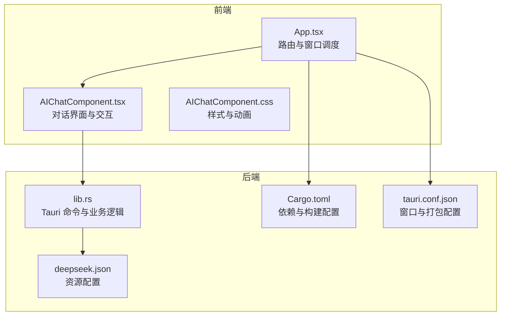
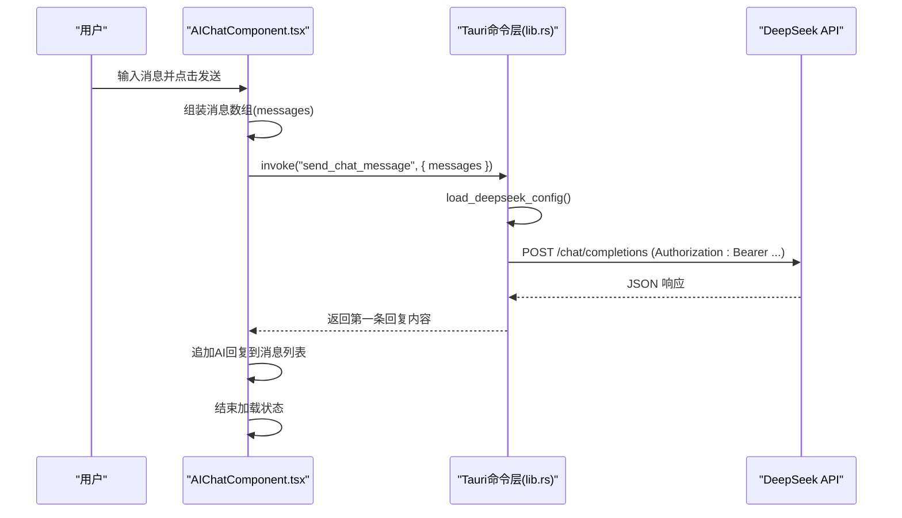
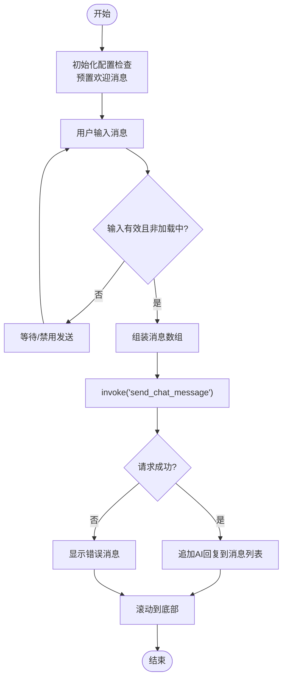
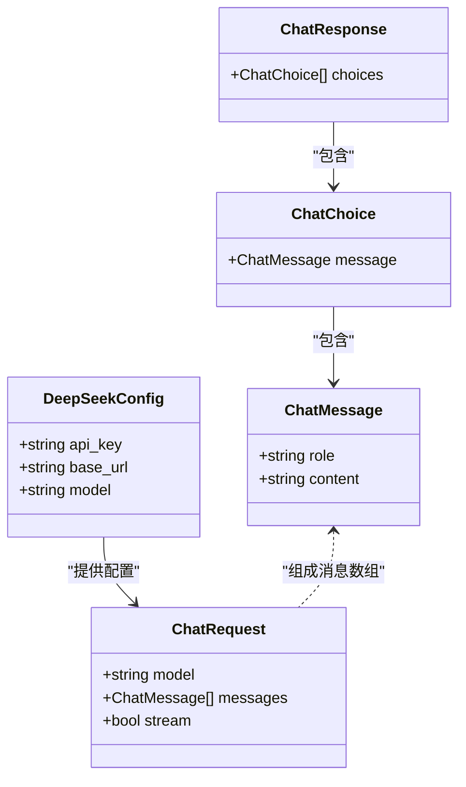
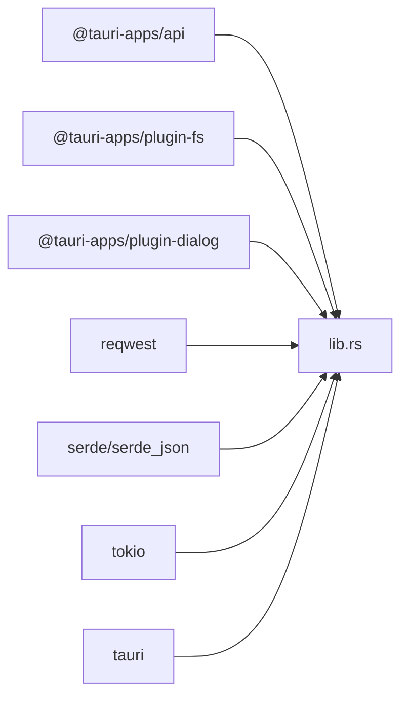

# AI对话助手

<cite>
**本文档引用的文件**
- [AIChatComponent.tsx](file://src/components/AIChatComponent.tsx)
- [AIChatComponent.css](file://src/components/AIChatComponent.css)
- [App.tsx](file://src/App.tsx)
- [lib.rs](file://src-tauri/src/lib.rs)
- [Cargo.toml](file://src-tauri/Cargo.toml)
- [tauri.conf.json](file://src-tauri/tauri.conf.json)
- [deepseek.json](file://src-tauri/config/deepseek.json)
- [package.json](file://package.json)
- [vite.config.ts](file://vite.config.ts)
</cite>

## 目录
1. [简介](#简介)
2. [项目结构](#项目结构)
3. [核心组件](#核心组件)
4. [架构总览](#架构总览)
5. [详细组件分析](#详细组件分析)
6. [依赖关系分析](#依赖关系分析)
7. [性能考虑](#性能考虑)
8. [故障排除指南](#故障排除指南)
9. [结论](#结论)
10. [附录](#附录)

## 简介
本项目是一个基于 Tauri + React 的桌面端 AI 对话助手，集成了 DeepSeek 大模型 API，支持本地配置管理、非流式对话、基础的 UI 交互与状态管理。当前实现采用同步请求方式调用 DeepSeek 的 chat/completions 接口，未实现 WebSocket 流式响应与实时 UI 更新；同时具备基本的错误处理与配置加载/保存能力。

## 项目结构
项目采用前后端分离架构：
- 前端（React）负责 UI 渲染、用户交互与状态管理
- 后端（Tauri/Rust）负责网络请求、配置持久化与系统集成

**图表来源**
- [App.tsx:34-35](file://src/App.tsx#L34-L35)
- [AIChatComponent.tsx:23](file://src/components/AIChatComponent.tsx#L23-L49)
- [lib.rs:147-186](file://src-tauri/src/lib.rs#L147-L186)
- [deepseek.json:1-6](file://src-tauri/config/deepseek.json#L1-L6)
- [tauri.conf.json:13-43](file://src-tauri/tauri.conf.json#L13-L43)

**章节来源**
- [App.tsx:17-56](file://src/App.tsx#L17-L56)
- [package.json:1-29](file://package.json#L1-L29)
- [vite.config.ts:1-33](file://vite.config.ts#L1-L33)

## 核心组件
- 前端对话组件：负责消息渲染、输入处理、配置弹窗与加载状态展示
- 后端命令层：封装 DeepSeek API 请求、配置读写与错误处理
- 资源配置：提供默认的 API 基础地址与模型名

关键职责划分：
- 前端负责 UI 交互与状态管理（消息列表、输入框、设置弹窗、加载指示器）
- 后端负责网络请求、配置持久化与错误返回
- 配置文件作为资源文件参与初始配置加载

**章节来源**
- [AIChatComponent.tsx:23-171](file://src/components/AIChatComponent.tsx#L23-L171)
- [lib.rs:147-186](file://src-tauri/src/lib.rs#L147-L186)
- [deepseek.json:1-6](file://src-tauri/config/deepseek.json#L1-L6)

## 架构总览
整体调用链路如下：

**图表来源**
- [AIChatComponent.tsx:101-135](file://src/components/AIChatComponent.tsx#L101-L135)
- [lib.rs:147-186](file://src-tauri/src/lib.rs#L147-L186)

## 详细组件分析

### 前端对话组件（AIChatComponent）
- 状态管理
  - 消息列表：包含角色、内容与时间戳
  - 输入值与加载状态：控制发送按钮可用性与“正在思考”指示
  - 配置错误提示：当未配置 API Key 时显示引导
  - 设置弹窗：支持修改 API Key、Base URL 与模型名
- 交互流程
  - 初始化时检查配置并预置欢迎消息
  - 发送消息时组装消息数组并调用后端命令
  - 成功后追加 AI 回复，失败则显示错误消息
  - 支持清空聊天与关闭窗口
- UI 特性
  - 自动滚动到底部
  - 输入框支持 Enter 发送、Shift+Enter 换行
  - 加载态显示“正在思考”的打字动画
  - 设置弹窗采用半透明背景与模糊效果

**图表来源**
- [AIChatComponent.tsx:42-135](file://src/components/AIChatComponent.tsx#L42-L135)

**章节来源**
- [AIChatComponent.tsx:23-171](file://src/components/AIChatComponent.tsx#L23-L171)
- [AIChatComponent.css:173-298](file://src/components/AIChatComponent.css#L173-L298)

### 后端命令层（lib.rs）
- 配置管理
  - 本地配置优先：从应用数据目录读取 deepseek_config.json
  - 资源配置回退：读取资源中的 config/deepseek.json
  - 校验规则：API Key 不能为空且不等于占位符
- DeepSeek 请求
  - 构造请求体：包含 model、messages、stream=false
  - 设置请求头：Authorization Bearer + Content-Type
  - 发送请求并校验状态码，解析 JSON 响应
  - 返回第一条 choices.message.content
- 错误处理
  - 网络错误、状态码非成功、解析失败均转换为字符串错误返回
- 文件路径
  - 本地配置路径：应用数据目录/deepseek_config.json

**图表来源**
- [lib.rs:113-142](file://src-tauri/src/lib.rs#L113-L142)
- [lib.rs:147-186](file://src-tauri/src/lib.rs#L147-L186)

**章节来源**
- [lib.rs:147-186](file://src-tauri/src/lib.rs#L147-L186)
- [lib.rs:203-271](file://src-tauri/src/lib.rs#L203-L271)

### 配置管理与存储
- 存储位置
  - 本地配置：应用数据目录下的 deepseek_config.json
  - 资源配置：打包时嵌入的 config/deepseek.json
- 格式规范
  - 字段：apiKey、baseUrl、model
  - 默认 baseUrl 与模型名在资源文件中定义
- 加载策略
  - 优先读取本地配置，若有效则直接使用
  - 否则读取资源配置并进行有效性校验

**章节来源**
- [lib.rs:188-200](file://src-tauri/src/lib.rs#L188-L200)
- [lib.rs:218-271](file://src-tauri/src/lib.rs#L218-L271)
- [deepseek.json:1-6](file://src-tauri/config/deepseek.json#L1-L6)

### 网络请求与错误处理
- 请求参数
  - URL：{baseUrl}/chat/completions
  - 头部：Authorization: Bearer {apiKey}, Content-Type: application/json
  - Body：包含 model、messages、stream=false
- 响应解析
  - 解析 JSON 并提取 choices[0].message.content
- 错误处理
  - 状态码非成功：返回包含状态码与错误文本的字符串
  - 解析失败：返回解析错误字符串
  - 无 choices：返回“AI响应为空”

**章节来源**
- [lib.rs:147-186](file://src-tauri/src/lib.rs#L147-L186)

### 对话历史与上下文
- 当前实现
  - 将历史消息与当前用户输入合并为 messages 数组传递给后端
  - 后端按传入 messages 直接请求 API，不做额外上下文维护
- 建议改进
  - 前端可限制历史消息数量，避免超出模型上下文长度
  - 后端可增加会话清理策略（如定期清理过期会话）

**章节来源**
- [AIChatComponent.tsx:101-111](file://src/components/AIChatComponent.tsx#L101-L111)
- [lib.rs:155-159](file://src-tauri/src/lib.rs#L155-L159)

### WebSocket 流式响应与实时更新（现状与建议）
- 现状
  - 后端请求设置 stream=false，不支持流式响应
  - 前端未实现 WebSocket 连接与增量渲染
- 建议
  - 后端将 ChatRequest.stream 设为 true
  - 使用 tokio-util 的 LinesCodec 或类似工具解析 SSE/流式数据
  - 前端逐条接收并实时更新消息内容，配合“正在思考”状态

[本节为概念性建议，不对应具体源码，故无图表来源]

## 依赖关系分析
- 前端依赖
  - @tauri-apps/api：调用后端命令、窗口管理
  - @tauri-apps/plugin-*：文件系统、对话框等插件
- 后端依赖
  - reqwest：HTTP 客户端
  - serde/serde_json：序列化与反序列化
  - tokio：异步运行时
  - tauri：窗口、托盘、能力配置

**图表来源**
- [package.json:12-19](file://package.json#L12-L19)
- [Cargo.toml:15-35](file://src-tauri/Cargo.toml#L15-L35)

**章节来源**
- [package.json:12-29](file://package.json#L12-L29)
- [Cargo.toml:15-43](file://src-tauri/Cargo.toml#L15-L43)

## 性能考虑
- 请求并发
  - 当前为串行请求，建议在多轮对话场景下避免重复创建 HTTP 客户端
- 响应体积
  - 控制历史消息长度，减少请求体大小
- UI 渲染
  - 使用 React.memo 或类似手段减少不必要的重渲染
- 异步 I/O
  - 本地配置读写已使用 tokio 异步，保持一致的异步模式

[本节提供通用指导，不涉及具体文件分析]

## 故障排除指南
- 常见错误类型
  - 配置缺失：API Key 为空或为占位符
  - 网络错误：DNS 解析失败、超时、证书问题
  - API 响应异常：状态码非 2xx、响应体非 JSON
- 定位步骤
  - 检查本地配置文件是否存在且格式正确
  - 校验资源配置文件中的 baseUrl 与 model
  - 查看后端错误字符串中包含的状态码与错误文本
- 解决方案
  - 补充有效的 API Key
  - 更正 baseUrl（确保末尾无多余斜杠）
  - 检查网络连通性与代理设置
  - 如遇证书问题，确认系统时间与网络环境

**章节来源**
- [lib.rs:244-271](file://src-tauri/src/lib.rs#L244-L271)
- [lib.rs:170-174](file://src-tauri/src/lib.rs#L170-L174)

## 结论
本项目实现了基于 DeepSeek 的基础对话功能，具备本地配置与资源配置双通道加载、简洁的 UI 交互与错误反馈。当前版本未实现流式响应与实时更新，建议后续引入流式传输与增量渲染以提升用户体验。同时可扩展对话历史管理与会话清理策略，进一步优化上下文长度与性能表现。

## 附录

### API 使用限制、速率控制与成本优化
- 限制与速率
  - 依据 DeepSeek 官方文档设置合理的请求频率与并发度
  - 对于高并发场景，建议引入本地缓存与队列限速
- 成本优化
  - 控制每轮对话的消息长度与上下文
  - 合理选择模型，平衡质量与成本
  - 记录与统计调用次数与字符数，便于成本控制

[本节为通用建议，不涉及具体文件分析]

### 本地配置文件存储位置与格式
- 存储位置
  - 应用数据目录/deepseek_config.json（本地配置）
  - 打包资源/config/deepseek.json（默认配置）
- 格式字段
  - apiKey：API 密钥
  - baseUrl：API 基础地址
  - model：模型名称

**章节来源**
- [lib.rs:188-200](file://src-tauri/src/lib.rs#L188-L200)
- [lib.rs:218-271](file://src-tauri/src/lib.rs#L218-L271)
- [deepseek.json:1-6](file://src-tauri/config/deepseek.json#L1-L6)