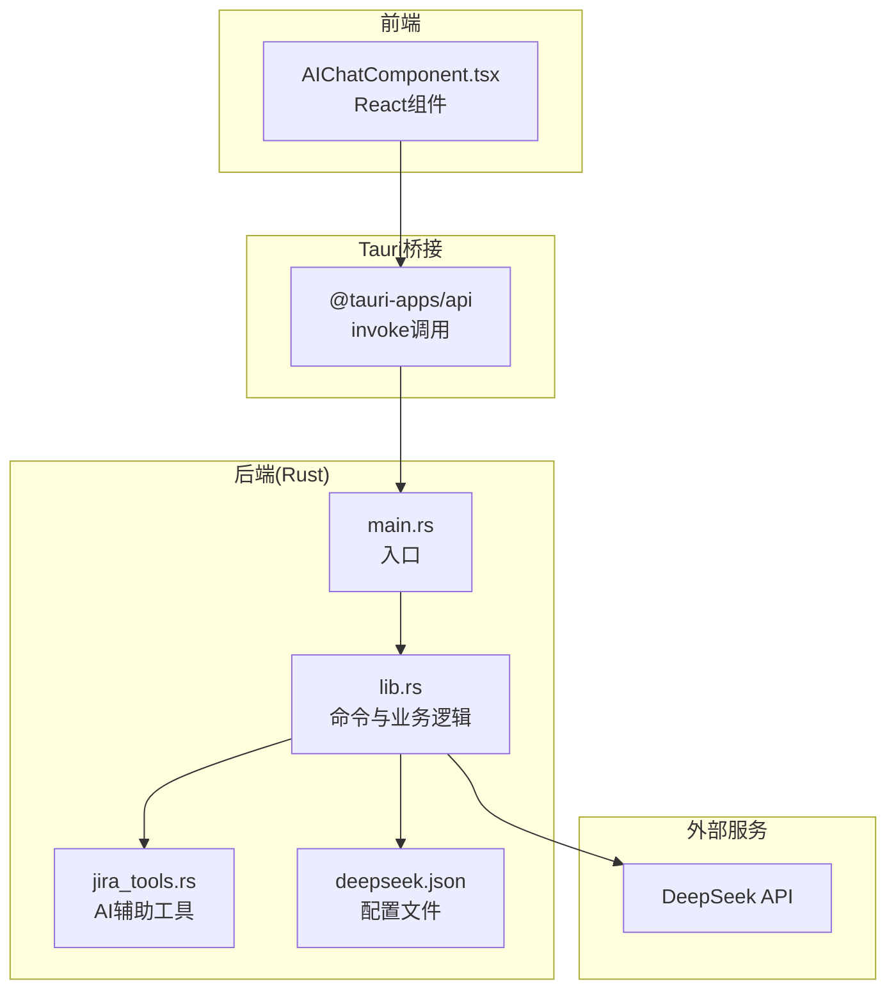
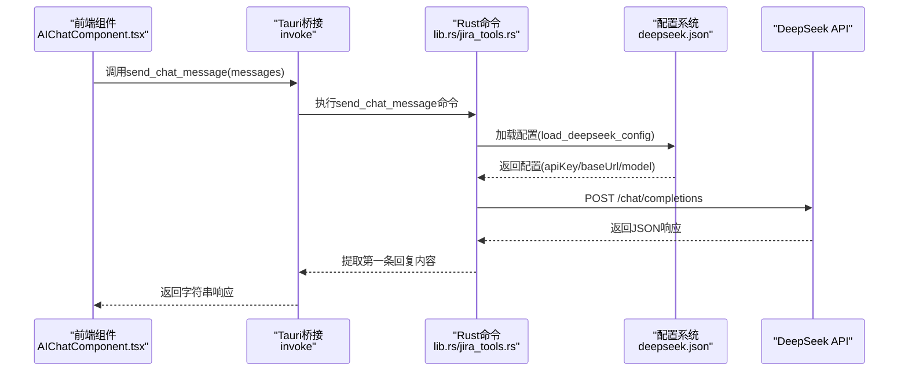
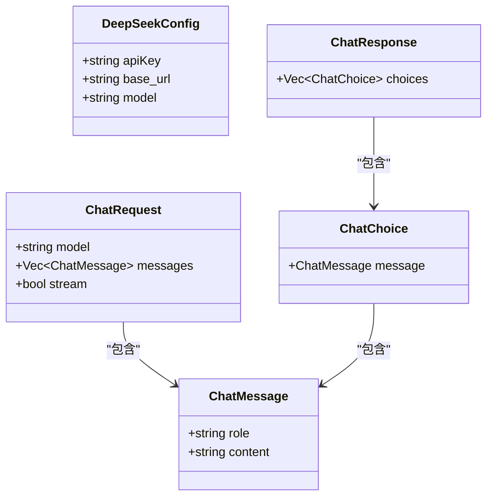
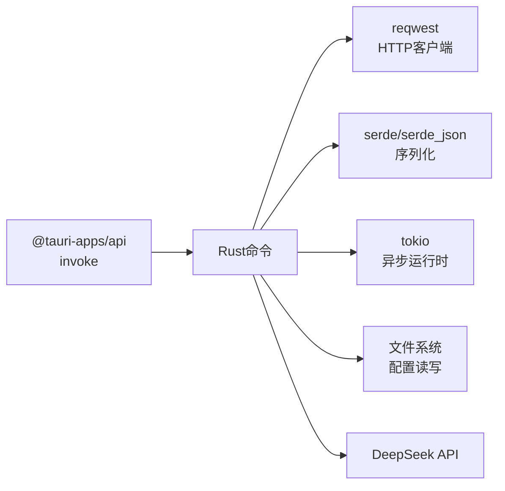
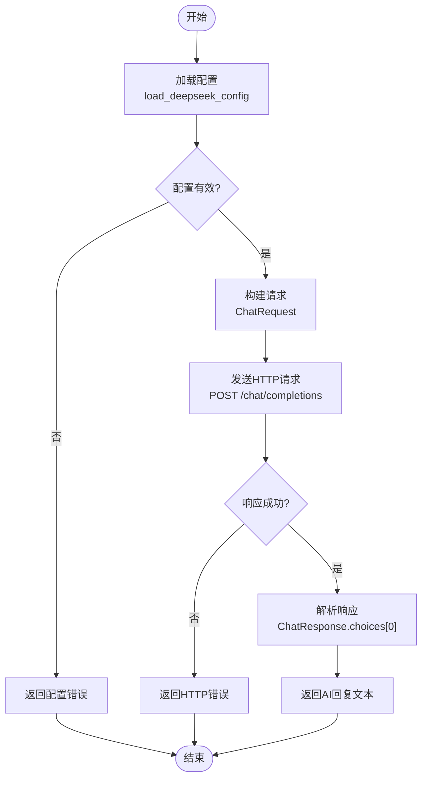

# API集成实现

<cite>
**本文档引用的文件**
- [main.rs](file://src-tauri/src/main.rs)
- [lib.rs](file://src-tauri/src/lib.rs)
- [jira_tools.rs](file://src-tauri/src/jira_tools.rs)
- [deepseek.json](file://src-tauri/config/deepseek.json)
- [AIChatComponent.tsx](file://src/components/AIChatComponent.tsx)
- [Cargo.toml](file://src-tauri/Cargo.toml)
- [package.json](file://package.json)
- [tauri.conf.json](file://src-tauri/tauri.conf.json)
</cite>

## 目录
1. [简介](#简介)
2. [项目结构](#项目结构)
3. [核心组件](#核心组件)
4. [架构概览](#架构概览)
5. [详细组件分析](#详细组件分析)
6. [依赖关系分析](#依赖关系分析)
7. [性能考量](#性能考量)
8. [故障排除指南](#故障排除指南)
9. [结论](#结论)
10. [附录](#附录)

## 简介
本文件为桌面宠物应用中的AI对话助手API集成实现提供详细技术文档。重点涵盖DeepSeek API的调用机制、Tauri命令定义与实现、HTTP请求构建与发送、响应数据解析与处理、API密钥安全存储与管理、请求参数构造、错误处理策略、性能优化方案以及最佳实践与安全考虑。

## 项目结构
该应用采用Tauri + React的混合架构，前端负责用户交互与界面展示，后端Rust负责系统能力与API调用封装。AI对话功能通过Tauri命令桥接前后端，实现从React组件到Rust后端的API调用。

图表来源
- [main.rs:1-11](file://src-tauri/src/main.rs#L1-L11)
- [lib.rs:836-1001](file://src-tauri/src/lib.rs#L836-L1001)
- [jira_tools.rs:1-1029](file://src-tauri/src/jira_tools.rs#L1-L1029)
- [deepseek.json:1-6](file://src-tauri/config/deepseek.json#L1-L6)

章节来源
- [main.rs:1-11](file://src-tauri/src/main.rs#L1-L11)
- [lib.rs:836-1001](file://src-tauri/src/lib.rs#L836-L1001)
- [AIChatComponent.tsx:1-371](file://src/components/AIChatComponent.tsx#L1-L371)
- [tauri.conf.json:1-74](file://src-tauri/tauri.conf.json#L1-L74)

## 核心组件
- 前端React组件：负责用户输入、消息展示、配置管理与Tauri命令调用。
- Tauri命令：在Rust侧定义命令，封装HTTP请求、配置读取与响应解析。
- 配置管理：支持本地配置文件与资源配置文件的双路径加载。
- API调用：基于reqwest构建HTTP请求，处理响应与错误。

章节来源
- [AIChatComponent.tsx:1-371](file://src/components/AIChatComponent.tsx#L1-L371)
- [lib.rs:147-274](file://src-tauri/src/lib.rs#L147-L274)
- [jira_tools.rs:714-805](file://src-tauri/src/jira_tools.rs#L714-L805)

## 架构概览
AI对话功能的调用链路如下：前端组件发起invoke调用，Tauri桥接到Rust命令，Rust命令加载配置、构建请求、发送HTTP请求并解析响应，最终将结果返回给前端。

图表来源
- [AIChatComponent.tsx:113-124](file://src/components/AIChatComponent.tsx#L113-L124)
- [lib.rs:150-189](file://src-tauri/src/lib.rs#L150-L189)
- [jira_tools.rs:769-805](file://src-tauri/src/jira_tools.rs#L769-L805)

## 详细组件分析

### 前端组件：AIChatComponent
- 负责消息状态管理、输入框处理、配置检查与保存、错误提示与加载状态。
- 通过invoke调用后端命令：
  - load_local_deepseek_config：加载本地配置
  - load_deepseek_config：加载资源配置
  - save_deepseek_config：保存配置
  - send_chat_message：发送聊天消息

章节来源
- [AIChatComponent.tsx:55-82](file://src/components/AIChatComponent.tsx#L55-L82)
- [AIChatComponent.tsx:113-135](file://src/components/AIChatComponent.tsx#L113-L135)

### Rust命令：配置加载与保存
- 配置路径优先级：本地配置文件 > 资源配置文件
- 本地配置文件位于应用数据目录下的deepseek_config.json
- 资源配置文件位于config/deepseek.json
- 保存配置时使用pretty序列化并异步写入文件系统

章节来源
- [lib.rs:191-218](file://src-tauri/src/lib.rs#L191-L218)
- [lib.rs:221-243](file://src-tauri/src/lib.rs#L221-L243)
- [lib.rs:246-274](file://src-tauri/src/lib.rs#L246-L274)

### Rust命令：发送聊天消息
- 构建ChatRequest结构体，包含model、messages与stream字段
- 使用reqwest客户端POST到baseUrl/chat/completions
- 设置Authorization头与Content-Type头
- 异步等待响应并解析为ChatResponse
- 提取choices[0].message.content作为回复文本

章节来源
- [lib.rs:114-145](file://src-tauri/src/lib.rs#L114-L145)
- [lib.rs:150-189](file://src-tauri/src/lib.rs#L150-L189)

### AI辅助工具：process_worklog_with_ai
- 组合获取日期、应工作时长、今日工作日志、未完成问题与Git提交
- 生成AI提示，调用send_ai_request
- 返回AI建议或提示信息

章节来源
- [jira_tools.rs:808-955](file://src-tauri/src/jira_tools.rs#L808-L955)
- [jira_tools.rs:769-805](file://src-tauri/src/jira_tools.rs#L769-L805)

### 类关系图：数据模型

图表来源
- [lib.rs:116-145](file://src-tauri/src/lib.rs#L116-L145)

## 依赖关系分析
- 前端依赖：@tauri-apps/api用于invoke调用，React用于组件渲染
- 后端依赖：reqwest用于HTTP请求，serde/serde_json用于序列化与反序列化，tokio用于异步运行时
- 配置文件：deepseek.json位于资源目录，运行时可通过资源路径访问

图表来源
- [Cargo.toml:15-36](file://src-tauri/Cargo.toml#L15-L36)
- [package.json:12-19](file://package.json#L12-L19)

章节来源
- [Cargo.toml:15-36](file://src-tauri/Cargo.toml#L15-L36)
- [package.json:12-19](file://package.json#L12-L19)

## 性能考量
- 异步I/O：配置读写与API请求均使用tokio异步实现，避免阻塞主线程
- 请求复用：Rust侧使用reqwest::Client复用连接，减少握手开销
- 响应解析：使用结构化类型解析JSON，降低解析成本
- 错误快速返回：对非成功状态码立即返回错误信息，避免无意义的后续处理
- 并发控制：当前实现为单请求处理；如需扩展，可在命令层引入信号量或限流器

章节来源
- [lib.rs:157-171](file://src-tauri/src/lib.rs#L157-L171)
- [lib.rs:191-203](file://src-tauri/src/lib.rs#L191-L203)

## 故障排除指南
- 配置缺失或无效
  - 现象：前端显示配置错误，无法发送消息
  - 处理：检查本地配置文件是否存在且apiKey有效；若无本地配置，则检查资源配置文件
- API请求失败
  - 现象：后端返回HTTP状态码非2xx与错误文本
  - 处理：核对apiKey、baseUrl与网络连通性；查看返回的错误文本
- 响应为空
  - 现象：choices为空导致AI响应为空
  - 处理：检查messages格式与model参数；确认API返回结构
- 超时与网络异常
  - 当前实现未显式设置超时；如遇超时，建议在reqwest客户端上增加超时配置

章节来源
- [lib.rs:173-177](file://src-tauri/src/lib.rs#L173-L177)
- [lib.rs:246-274](file://src-tauri/src/lib.rs#L246-L274)

## 结论
本实现通过Tauri命令桥接前端与后端，利用Rust的高性能与安全性保障，实现了对DeepSeek API的稳定调用。配置管理支持本地与资源双重路径，满足不同部署场景；错误处理与异步I/O提升了用户体验与系统可靠性。未来可在超时控制、并发限制与缓存策略方面进一步优化。

## 附录

### API调用流程图

图表来源
- [lib.rs:150-189](file://src-tauri/src/lib.rs#L150-L189)
- [lib.rs:246-274](file://src-tauri/src/lib.rs#L246-L274)

### 配置文件结构
- 本地配置：应用数据目录下的deepseek_config.json
- 资源配置：config/deepseek.json，包含apiKey、baseUrl与model字段

章节来源
- [deepseek.json:1-6](file://src-tauri/config/deepseek.json#L1-L6)
- [lib.rs:191-203](file://src-tauri/src/lib.rs#L191-L203)