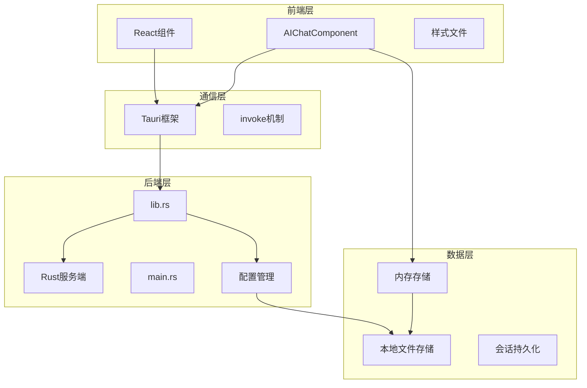
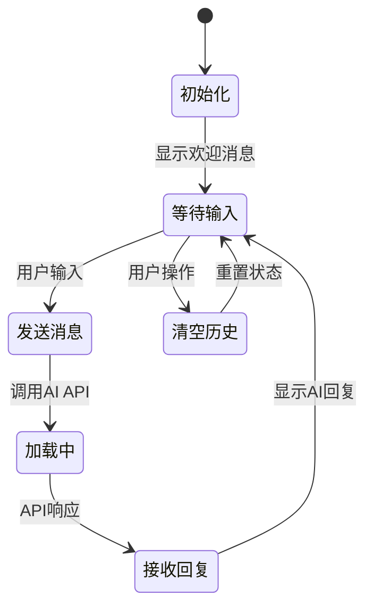
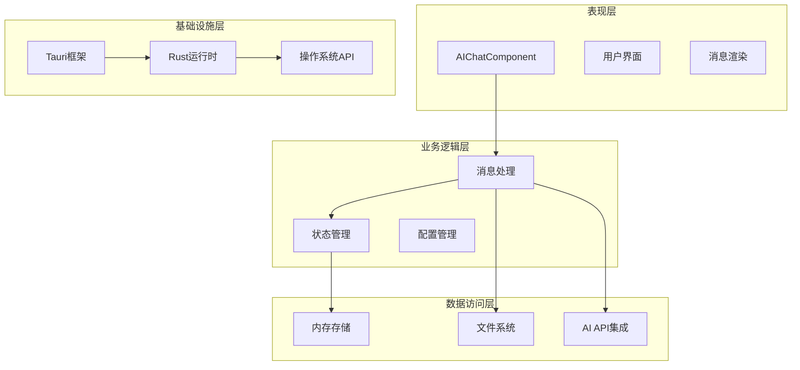
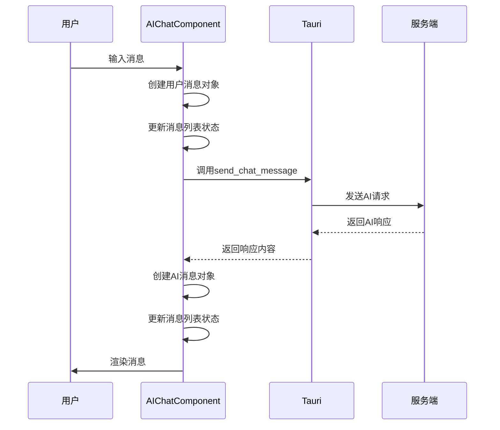
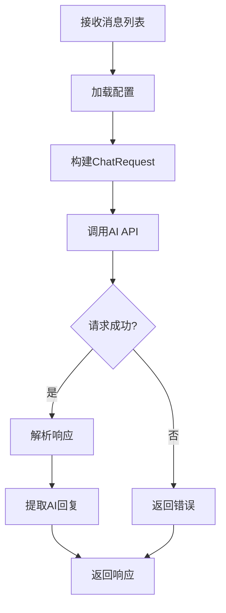
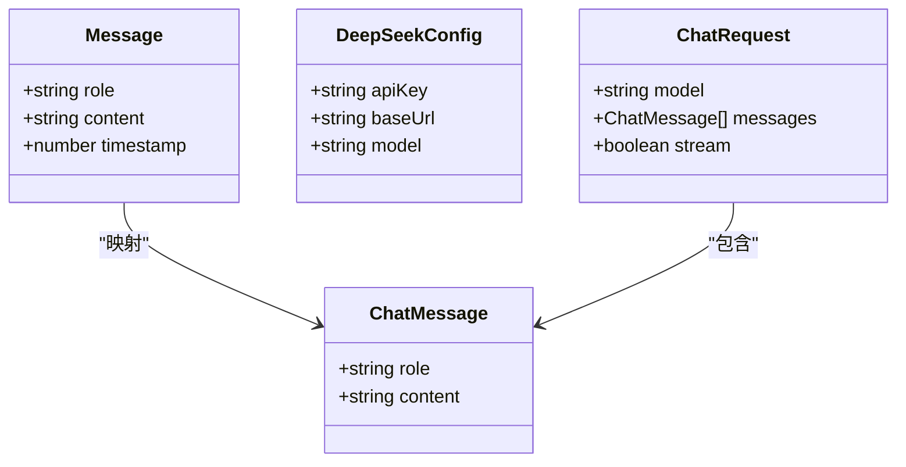
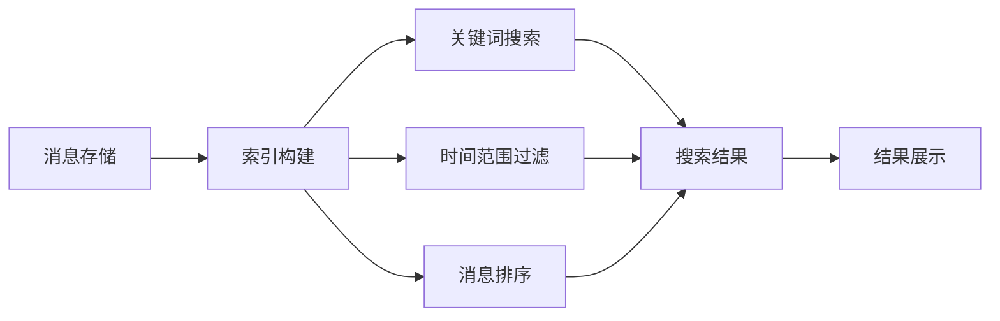
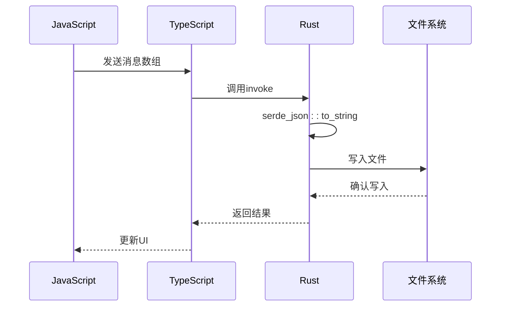
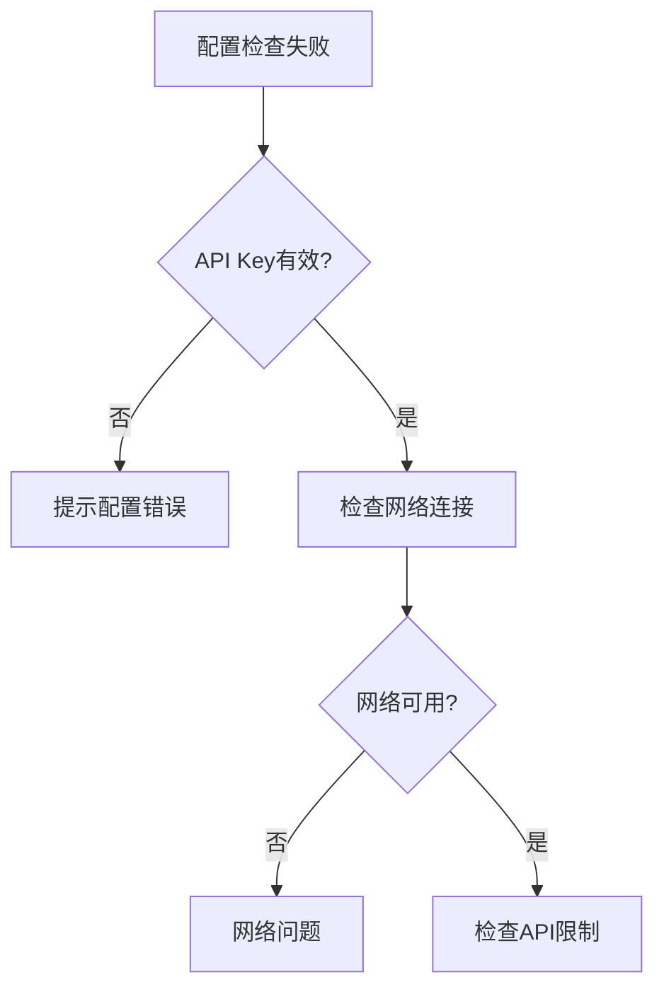

# 对话历史管理

<cite>
**本文档引用的文件**
- [AIChatComponent.tsx](file://src/components/AIChatComponent.tsx)
- [lib.rs](file://src-tauri/src/lib.rs)
- [main.rs](file://src-tauri/src/main.rs)
- [Cargo.toml](file://src-tauri/Cargo.toml)
- [bubbles.json](file://public/config/bubbles.json)
</cite>

## 目录
1. [简介](#简介)
2. [项目结构](#项目结构)
3. [核心组件](#核心组件)
4. [架构概览](#架构概览)
5. [详细组件分析](#详细组件分析)
6. [依赖关系分析](#依赖关系分析)
7. [性能考虑](#性能考虑)
8. [故障排除指南](#故障排除指南)
9. [结论](#结论)

## 简介

本文档详细阐述了AI对话助手的对话历史管理功能，这是一个基于Tauri框架构建的桌面应用程序中的核心模块。该系统实现了完整的对话历史管理，包括消息数据结构设计、对话状态维护、消息存储与检索、以及性能优化策略。

该系统采用前后端分离的架构设计：
- **前端层**：React组件负责用户界面交互和消息展示
- **后端层**：Rust服务端处理AI对话逻辑和数据持久化
- **通信层**：通过Tauri的invoke机制实现跨语言通信

## 项目结构

该项目采用现代化的桌面应用架构，主要分为以下层次：



**图表来源**
- [AIChatComponent.tsx:1-371](file://src/components/AIChatComponent.tsx#L1-L371)
- [lib.rs:1-1113](file://src-tauri/src/lib.rs#L1-L1113)
- [main.rs:1-11](file://src-tauri/src/main.rs#L1-L11)

**章节来源**
- [AIChatComponent.tsx:1-371](file://src/components/AIChatComponent.tsx#L1-L371)
- [lib.rs:1-1113](file://src-tauri/src/lib.rs#L1-L1113)
- [main.rs:1-11](file://src-tauri/src/main.rs#L1-L11)

## 核心组件

### 消息数据结构设计

系统定义了两种主要的消息类型来支持不同的数据处理需求：

#### 前端消息结构（Message）
用于UI渲染和用户交互：
```typescript
type Message = {
    role: 'user' | 'assistant';
    content: string;
    timestamp: number;
};
```

#### 后端消息结构（ChatMessage）
用于AI API通信：
```typescript
type ChatMessage = {
    role: string;
    content: string;
};
```

#### 配置数据结构
```typescript
type DeepSeekConfig = {
    apiKey: string;
    baseUrl: string;
    model: string;
};
```

**章节来源**
- [AIChatComponent.tsx:6-39](file://src/components/AIChatComponent.tsx#L6-L39)
- [lib.rs:220-250](file://src-tauri/src/lib.rs#L220-L250)

### 对话状态维护

系统采用React的状态管理机制来维护对话历史：



**图表来源**
- [AIChatComponent.tsx:88-135](file://src/components/AIChatComponent.tsx#L88-L135)

**章节来源**
- [AIChatComponent.tsx:23-169](file://src/components/AIChatComponent.tsx#L23-L169)

## 架构概览

系统采用分层架构设计，实现了清晰的关注点分离：



**图表来源**
- [lib.rs:940-996](file://src-tauri/src/lib.rs#L940-L996)
- [AIChatComponent.tsx:1-371](file://src/components/AIChatComponent.tsx#L1-L371)

## 详细组件分析

### 消息管理组件

#### 前端消息管理（AIChatComponent）

前端组件负责用户交互和消息展示：



**图表来源**
- [AIChatComponent.tsx:88-135](file://src/components/AIChatComponent.tsx#L88-L135)
- [lib.rs:255-294](file://src-tauri/src/lib.rs#L255-L294)

#### 后端消息处理（lib.rs）

后端服务端处理AI对话逻辑：



**图表来源**
- [lib.rs:255-294](file://src-tauri/src/lib.rs#L255-L294)

**章节来源**
- [AIChatComponent.tsx:88-135](file://src/components/AIChatComponent.tsx#L88-L135)
- [lib.rs:255-294](file://src-tauri/src/lib.rs#L255-L294)

### 消息存储实现

#### 内存存储机制

前端使用React状态管理实现内存存储：
- **实时性**：消息立即可见，用户体验流畅
- **临时性**：页面刷新后数据丢失
- **性能**：避免磁盘I/O开销

#### 本地存储机制

后端实现文件系统持久化：
- **配置存储**：DeepSeek API配置信息
- **数据目录**：应用数据统一管理
- **文件格式**：JSON格式便于人类阅读

#### 会话持久化策略



**图表来源**
- [AIChatComponent.tsx:6-39](file://src/components/AIChatComponent.tsx#L6-L39)
- [lib.rs:220-250](file://src-tauri/src/lib.rs#L220-L250)

**章节来源**
- [lib.rs:296-379](file://src-tauri/src/lib.rs#L296-L379)

### 消息检索与搜索功能

#### 当前实现状态

系统当前实现了基础的消息管理功能，但尚未实现高级检索功能。主要功能包括：
- **消息列表展示**：按时间顺序显示所有消息
- **实时更新**：新消息自动添加到列表末尾
- **配置管理**：支持API密钥和模型配置

#### 潜在扩展方向

基于现有架构，可以实现以下检索功能：



**章节来源**
- [AIChatComponent.tsx:273-299](file://src/components/AIChatComponent.tsx#L273-L299)

### 序列化与反序列化

#### JSON格式转换

系统广泛使用JSON进行数据序列化：



**图表来源**
- [lib.rs:310-323](file://src-tauri/src/lib.rs#L310-L323)
- [lib.rs:326-348](file://src-tauri/src/lib.rs#L326-L348)

#### 数据压缩与版本兼容性

当前实现未包含专门的数据压缩功能，但具备良好的版本兼容性：
- **向后兼容**：新增字段时保持向后兼容
- **错误处理**：完善的错误捕获和处理机制
- **类型安全**：使用TypeScript确保编译时类型检查

**章节来源**
- [lib.rs:310-379](file://src-tauri/src/lib.rs#L310-L379)

## 依赖关系分析

### 技术栈依赖

```mermaid
graph TB
subgraph "前端依赖"
A[React 18]
B[@tauri-apps/api]
C[TypeScript]
end
subgraph "后端依赖"
D[Tauri 2]
E[Serde JSON]
F[Reqwest HTTP]
G[Tokio异步]
end
subgraph "系统依赖"
H[Windows API]
I[文件系统]
J[网络接口]
end
A --> D
B --> D
C --> E
D --> E
E --> F
F --> G
G --> H
H --> I
I --> J
```

**图表来源**
- [Cargo.toml:15-35](file://src-tauri/Cargo.toml#L15-L35)
- [AIChatComponent.tsx:1-4](file://src/components/AIChatComponent.tsx#L1-L4)

**章节来源**
- [Cargo.toml:1-44](file://src-tauri/Cargo.toml#L1-L44)

### 组件耦合度分析

系统采用松耦合设计：
- **前端与后端**：通过明确定义的API接口通信
- **消息格式**：前后端共享相同的数据结构定义
- **错误处理**：统一的错误传播和处理机制

## 性能考虑

### 当前性能特征

#### 内存管理
- **消息列表**：完全驻留在内存中，访问速度快
- **状态更新**：使用不可变更新模式，避免意外修改
- **垃圾回收**：JavaScript引擎自动管理内存

#### I/O性能
- **配置文件**：小文件读写，性能影响可忽略
- **异步操作**：使用Tokio异步运行时处理I/O
- **错误恢复**：实现指数退避策略处理网络异常

### 性能优化建议

基于当前实现，可以考虑以下优化方案：

#### 虚拟滚动实现
对于大量历史消息的场景，建议实现虚拟滚动：
- **原理**：只渲染可视区域内的消息项
- **收益**：显著减少DOM节点数量，提升滚动性能
- **实现**：使用第三方虚拟滚动库如react-window

#### 增量更新策略
- **消息索引**：维护消息索引以支持快速定位
- **部分重渲染**：只更新发生变化的消息项
- **缓存机制**：缓存计算结果避免重复计算

#### 内存管理优化
- **消息截断**：实现智能的历史消息截断策略
- **内存池**：复用消息对象减少GC压力
- **懒加载**：延迟加载远期消息

## 故障排除指南

### 常见问题诊断

#### 配置相关问题


**图表来源**
- [AIChatComponent.tsx:55-68](file://src/components/AIChatComponent.tsx#L55-L68)

#### 消息处理问题
- **消息丢失**：检查状态更新逻辑和错误边界
- **响应超时**：实现超时控制和重试机制
- **格式错误**：验证AI响应格式的健壮性

**章节来源**
- [AIChatComponent.tsx:124-134](file://src/components/AIChatComponent.tsx#L124-L134)
- [lib.rs:278-282](file://src-tauri/src/lib.rs#L278-L282)

### 调试技巧

#### 前端调试
- **React DevTools**：检查组件状态和props
- **浏览器开发者工具**：监控网络请求和错误
- **日志输出**：使用console.log跟踪状态变化

#### 后端调试
- **Rust日志**：使用println!输出调试信息
- **错误链**：利用?操作符追踪错误来源
- **单元测试**：为关键函数编写测试用例

## 结论

该AI对话助手的对话历史管理系统展现了现代桌面应用开发的最佳实践。系统通过清晰的架构设计、合理的数据结构选择和完善的错误处理机制，实现了稳定可靠的消息管理功能。

### 主要优势

1. **架构清晰**：前后端分离，职责明确
2. **数据安全**：类型安全的TypeScript实现
3. **用户体验**：流畅的交互和即时反馈
4. **可扩展性**：模块化设计便于功能扩展

### 改进建议

1. **检索功能**：实现关键词搜索和时间范围过滤
2. **性能优化**：引入虚拟滚动和增量更新
3. **数据持久化**：实现更完善的会话管理和历史备份
4. **错误处理**：增强网络异常和API限制的处理

该系统为后续的功能扩展奠定了坚实的基础，特别是在消息检索、性能优化和数据持久化方面的改进将显著提升用户体验。