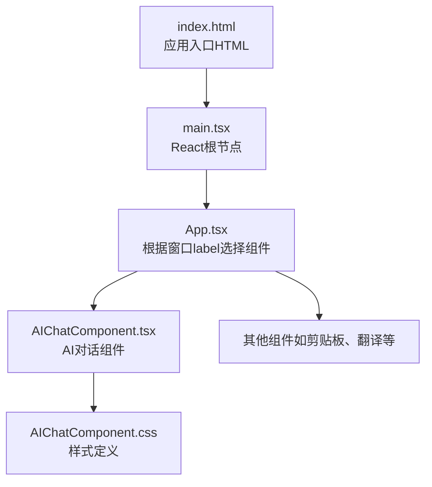
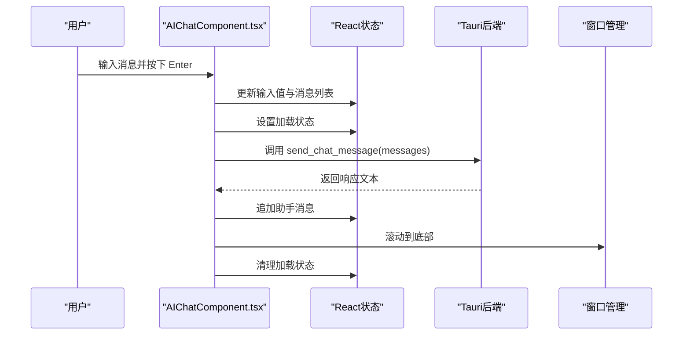
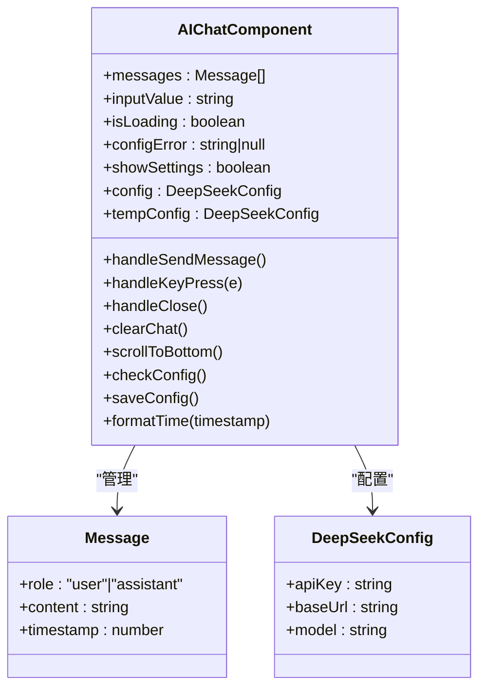
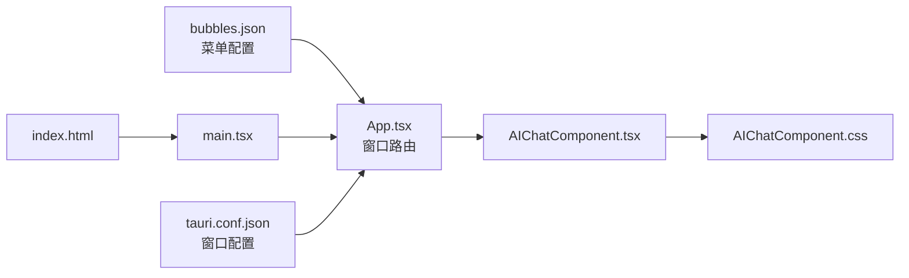

# 用户界面交互

<cite>
**本文引用的文件**
- [AIChatComponent.tsx](file://src/components/AIChatComponent.tsx)
- [AIChatComponent.css](file://src/components/AIChatComponent.css)
- [App.tsx](file://src/App.tsx)
- [index.html](file://index.html)
- [main.tsx](file://src/main.tsx)
- [bubbles.json](file://public/config/bubbles.json)
- [tauri.conf.json](file://src-tauri/tauri.conf.json)
</cite>

## 目录
1. [简介](#简介)
2. [项目结构](#项目结构)
3. [核心组件](#核心组件)
4. [架构总览](#架构总览)
5. [详细组件分析](#详细组件分析)
6. [依赖关系分析](#依赖关系分析)
7. [性能考量](#性能考量)
8. [故障排查指南](#故障排查指南)
9. [结论](#结论)
10. [附录](#附录)

## 简介
本文件聚焦于桌面宠物应用中的“AI对话助手”用户界面交互功能，围绕聊天界面的布局与样式、用户交互事件处理、UI状态管理、响应式设计、用户体验优化以及样式定制等方面进行系统化技术说明。文档同时给出关键流程图与时序图，帮助开发者快速理解组件行为与数据流。

## 项目结构
该应用采用 Tauri + React 架构，通过窗口标签路由到不同子组件。AI 对话组件位于 src/components/AIChatComponent.tsx，并配套样式文件 AIChatComponent.css；入口在 src/main.tsx，根组件 App.tsx 根据当前窗口 label 决定渲染哪个子组件。

图表来源
- [index.html:1-15](file://index.html#L1-L15)
- [main.tsx:1-10](file://src/main.tsx#L1-L10)
- [App.tsx:18-58](file://src/App.tsx#L18-L58)
- [AIChatComponent.tsx:23-371](file://src/components/AIChatComponent.tsx#L23-L371)
- [AIChatComponent.css:1-646](file://src/components/AIChatComponent.css#L1-L646)

章节来源
- [index.html:1-15](file://index.html#L1-L15)
- [main.tsx:1-10](file://src/main.tsx#L1-L10)
- [App.tsx:18-58](file://src/App.tsx#L18-L58)

## 核心组件
- AIChatComponent：负责消息展示、输入、发送、配置管理、窗口控制与状态切换。
- AIChatComponent.css：定义消息气泡、输入框、按钮、滚动条、设置弹窗等视觉样式与动画。
- App.tsx：根据窗口 label 路由到具体组件，其中包含对 ai-chat 的分支。
- index.html/main.tsx：应用启动入口。
- bubbles.json：菜单配置，包含“AI对话”入口项。
- tauri.conf.json：窗口配置，包含窗口标签与属性，支持拖拽与透明背景等。

章节来源
- [AIChatComponent.tsx:23-371](file://src/components/AIChatComponent.tsx#L23-L371)
- [AIChatComponent.css:1-646](file://src/components/AIChatComponent.css#L1-L646)
- [App.tsx:18-58](file://src/App.tsx#L18-L58)
- [bubbles.json:1-52](file://public/config/bubbles.json#L1-L52)
- [tauri.conf.json:1-74](file://src-tauri/tauri.conf.json#L1-L74)

## 架构总览
AI 对话组件通过 React 状态管理消息列表、输入值、加载状态与配置错误；通过 Tauri invoke 调用后端能力发送消息；通过 getCurrentWindow 控制窗口关闭；通过 ref 实现自动滚动至最新消息；通过 CSS 动画与类名实现状态指示与交互反馈。

图表来源
- [AIChatComponent.tsx:88-135](file://src/components/AIChatComponent.tsx#L88-L135)
- [AIChatComponent.tsx:84-86](file://src/components/AIChatComponent.tsx#L84-L86)
- [App.tsx:35-36](file://src/App.tsx#L35-L36)

## 详细组件分析

### 聊天界面布局与样式
- 头部区域：包含拖拽区域、头像、标题、状态指示器与操作按钮（设置、清空、关闭）。
- 消息区域：用户消息与助手消息分别使用不同的类名与头像背景；消息文本气泡具备圆角、阴影与边框；支持“正在输入”动画。
- 输入区域：输入框支持多行自适应高度，发送按钮根据输入状态启用/禁用；底部动作区包含设置、清空与关闭按钮。
- 设置弹窗：支持 DeepSeek API Key、Base URL、模型名称的配置与保存。
- 错误态：当未配置 API Key 时，显示错误提示与“配置API Key”按钮。

章节来源
- [AIChatComponent.tsx:240-371](file://src/components/AIChatComponent.tsx#L240-L371)
- [AIChatComponent.css:28-646](file://src/components/AIChatComponent.css#L28-L646)

### 用户交互事件处理
- 发送消息：handleSendMessage 在输入非空且非加载状态下触发；构建用户消息与助手消息序列，调用后端接口并追加响应；异常时插入错误消息。
- 键盘快捷键：handleKeyPress 监听 Enter（Shift+Enter 除外）触发发送。
- 窗口操作：handleClose 通过 getCurrentWindow 关闭当前窗口。
- 清空聊天：clearChat 重置消息列表为欢迎语。
- 设置弹窗：showSettings 控制弹窗显隐；saveConfig 保存临时配置并重新检查；handleSettingsClose 恢复临时配置并关闭弹窗。

章节来源
- [AIChatComponent.tsx:88-159](file://src/components/AIChatComponent.tsx#L88-L159)
- [AIChatComponent.tsx:137-142](file://src/components/AIChatComponent.tsx#L137-L142)
- [AIChatComponent.tsx:144-151](file://src/components/AIChatComponent.tsx#L144-L151)
- [AIChatComponent.tsx:153-159](file://src/components/AIChatComponent.tsx#L153-L159)
- [AIChatComponent.tsx:168-171](file://src/components/AIChatComponent.tsx#L168-L171)

### UI 状态管理
- 消息列表：messages 状态维护历史消息，每次发送后追加新消息。
- 输入状态：inputValue 绑定输入框，清空后恢复占位符。
- 加载状态：isLoading 控制“正在思考”指示器与发送按钮禁用。
- 配置状态：config 与 tempConfig 分离持久化与临时编辑；configError 用于错误提示与入口控制。
- 设置弹窗：showSettings 控制设置面板显隐。

章节来源
- [AIChatComponent.tsx:24-38](file://src/components/AIChatComponent.tsx#L24-L38)
- [AIChatComponent.tsx:55-68](file://src/components/AIChatComponent.tsx#L55-L68)
- [AIChatComponent.tsx:70-82](file://src/components/AIChatComponent.tsx#L70-L82)
- [AIChatComponent.tsx:168-171](file://src/components/AIChatComponent.tsx#L168-L171)

### 响应式设计与自适应
- 消息气泡最大宽度限制与两端对齐，保证在窄屏下仍具可读性。
- 输入框自适应高度：通过 CSS 控制最小/最大高度与行数，配合滚动容器实现纵向滚动。
- 滚动条样式：自定义 WebKit 滚动条颜色与尺寸，提升视觉一致性。
- 状态指示器：在线/思考两种状态通过类名与动画切换，避免占用额外空间。

章节来源
- [AIChatComponent.css:228-237](file://src/components/AIChatComponent.css#L228-L237)
- [AIChatComponent.css:327-340](file://src/components/AIChatComponent.css#L327-L340)
- [AIChatComponent.css:440-456](file://src/components/AIChatComponent.css#L440-L456)
- [AIChatComponent.css:84-99](file://src/components/AIChatComponent.css#L84-L99)

### 用户体验优化
- 自动滚动：每次消息更新后滚动到底部，确保最新消息可见。
- 发送按钮状态：仅在输入非空且非加载时启用，避免重复提交。
- 正在输入指示：三条点状动画，增强等待反馈。
- 时间戳：每条消息附带本地时间，便于回溯。
- 头像与配色：用户与助手使用不同头像与背景色，区分消息来源。

章节来源
- [AIChatComponent.tsx:51-53](file://src/components/AIChatComponent.tsx#L51-L53)
- [AIChatComponent.tsx:84-86](file://src/components/AIChatComponent.tsx#L84-L86)
- [AIChatComponent.tsx:313-319](file://src/components/AIChatComponent.tsx#L313-L319)
- [AIChatComponent.tsx:266-268](file://src/components/AIChatComponent.tsx#L266-L268)
- [AIChatComponent.tsx:280-283](file://src/components/AIChatComponent.tsx#L280-L283)

### 样式定制与主题
- 半透明遮罩：在容器上叠加半透明背景，提升文字可读性。
- 模糊背景：头部与输入区使用 backdrop-filter 提升层级感。
- 动画与过渡：消息滑入、按钮悬停缩放、状态点脉冲等增强交互反馈。
- 主题色：用户消息采用蓝色系，助手消息采用浅色系，形成对比。
- 图标与伪元素：通过 CSS 伪元素绘制关闭、设置、发送等图标，减少图片依赖。

章节来源
- [AIChatComponent.css:15-26](file://src/components/AIChatComponent.css#L15-L26)
- [AIChatComponent.css:33-40](file://src/components/AIChatComponent.css#L33-L40)
- [AIChatComponent.css:188-200](file://src/components/AIChatComponent.css#L188-L200)
- [AIChatComponent.css:356-368](file://src/components/AIChatComponent.css#L356-L368)
- [AIChatComponent.css:96-99](file://src/components/AIChatComponent.css#L96-L99)

### 代码级类图（组件与样式）

图表来源
- [AIChatComponent.tsx:6-38](file://src/components/AIChatComponent.tsx#L6-L38)

## 依赖关系分析
- 组件依赖：AIChatComponent 依赖 @tauri-apps/api 的 window 与 core 模块；依赖自身样式文件。
- 应用路由：App.tsx 根据窗口 label 决定渲染 AIChatComponent。
- 启动流程：index.html 引入 main.tsx，main.tsx 渲染 App，App 决定子组件。
- 菜单入口：bubbles.json 中包含“AI对话”入口项，用于触发打开 ai-chat 窗口。
- 窗口配置：tauri.conf.json 定义窗口标签与属性，支持拖拽与透明背景。

图表来源
- [bubbles.json:13-16](file://public/config/bubbles.json#L13-L16)
- [App.tsx:35-36](file://src/App.tsx#L35-L36)
- [AIChatComponent.tsx:23-371](file://src/components/AIChatComponent.tsx#L23-L371)
- [AIChatComponent.css:1-646](file://src/components/AIChatComponent.css#L1-L646)
- [main.tsx:1-10](file://src/main.tsx#L1-L10)
- [index.html:1-15](file://index.html#L1-L15)
- [tauri.conf.json:13-42](file://src-tauri/tauri.conf.json#L13-L42)

章节来源
- [bubbles.json:1-52](file://public/config/bubbles.json#L1-L52)
- [App.tsx:18-58](file://src/App.tsx#L18-L58)
- [tauri.conf.json:1-74](file://src-tauri/tauri.conf.json#L1-L74)

## 性能考量
- 渲染优化：消息列表使用 key 与条件渲染，避免不必要的重绘；输入框禁用时减少交互成本。
- 滚动优化：仅在消息新增时滚动，避免频繁滚动计算。
- 状态收敛：将配置与临时配置分离，减少保存失败时的回滚成本。
- 动画与模糊：合理使用 CSS 动画与 backdrop-filter，在保证体验的同时控制 GPU 开销。

## 故障排查指南
- 配置缺失：若 configError 存在且 API Key 为空，界面会显示错误提示与“配置API Key”按钮。可通过设置弹窗填写并保存。
- 发送失败：异常时会插入一条错误消息，确认网络与后端接口可用性。
- 窗口关闭失败：handleClose 使用 getCurrentWindow 关闭，若失败会在控制台输出错误日志。
- 输入无响应：检查 isLoading 状态与发送按钮禁用条件；确认键盘事件未被其他组件拦截。

章节来源
- [AIChatComponent.tsx:173-171](file://src/components/AIChatComponent.tsx#L173-L171)
- [AIChatComponent.tsx:124-134](file://src/components/AIChatComponent.tsx#L124-L134)
- [AIChatComponent.tsx:144-151](file://src/components/AIChatComponent.tsx#L144-L151)

## 结论
AI 对话助手的用户界面在布局、交互与状态管理方面实现了清晰的职责分离：组件负责业务逻辑与状态，样式负责表现与动画，路由负责窗口选择。通过键盘快捷键、自动滚动、状态指示与设置弹窗，提供了良好的用户体验。建议后续可进一步引入主题切换与更细粒度的响应式断点，以适配更多设备形态。

## 附录
- 代码示例路径（不直接展示代码内容）：
  - 发送消息流程：[AIChatComponent.tsx:88-135](file://src/components/AIChatComponent.tsx#L88-L135)
  - 键盘事件处理：[AIChatComponent.tsx:137-142](file://src/components/AIChatComponent.tsx#L137-L142)
  - 窗口关闭：[AIChatComponent.tsx:144-151](file://src/components/AIChatComponent.tsx#L144-L151)
  - 清空聊天：[AIChatComponent.tsx:153-159](file://src/components/AIChatComponent.tsx#L153-L159)
  - 自动滚动：[AIChatComponent.tsx:51-53](file://src/components/AIChatComponent.tsx#L51-L53)
  - 配置检查与保存：[AIChatComponent.tsx:55-82](file://src/components/AIChatComponent.tsx#L55-L82)
  - 样式定义（消息气泡、输入框、按钮、滚动条、设置弹窗）：[AIChatComponent.css:173-646](file://src/components/AIChatComponent.css#L173-L646)
  - 应用入口与路由：[index.html:1-15](file://index.html#L1-L15)、[main.tsx:1-10](file://src/main.tsx#L1-L10)、[App.tsx:18-58](file://src/App.tsx#L18-L58)
  - 菜单入口与窗口配置：[bubbles.json:13-16](file://public/config/bubbles.json#L13-L16)、[tauri.conf.json:13-42](file://src-tauri/tauri.conf.json#L13-L42)