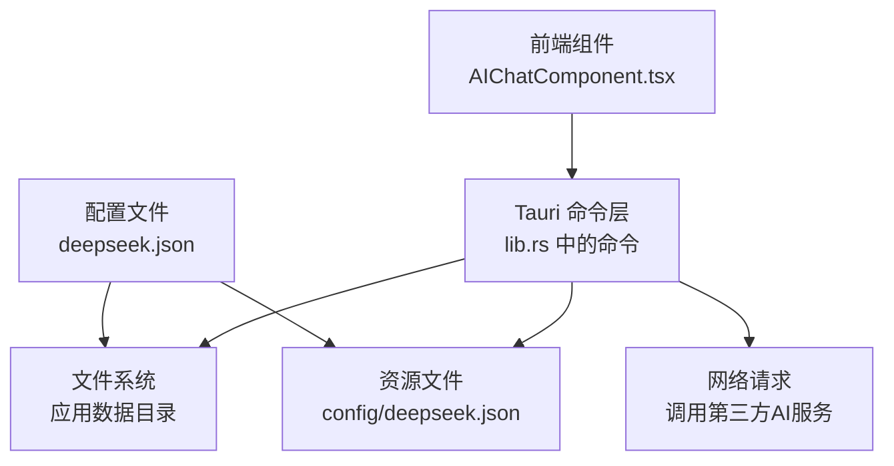
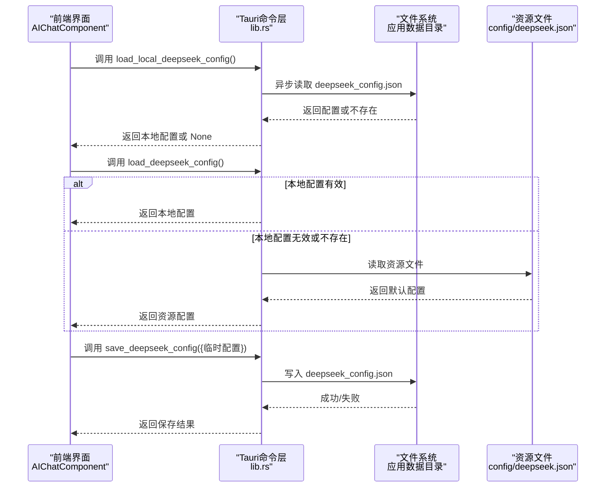
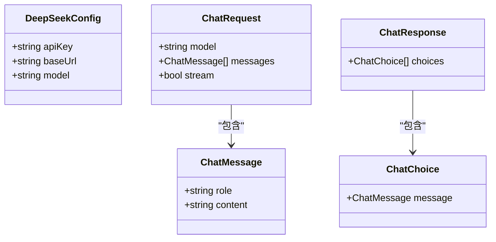
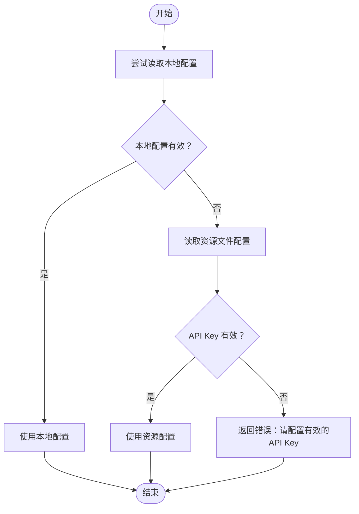
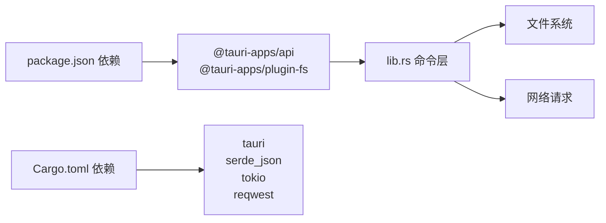

# 配置管理

<cite>
**本文引用的文件**
- [src-tauri/config/deepseek.json](file://src-tauri/config/deepseek.json)
- [src-tauri/src/lib.rs](file://src-tauri/src/lib.rs)
- [src/components/AIChatComponent.tsx](file://src/components/AIChatComponent.tsx)
- [src/App.tsx](file://src/App.tsx)
- [src-tauri/tauri.conf.json](file://src-tauri/tauri.conf.json)
- [src-tauri/Cargo.toml](file://src-tauri/Cargo.toml)
- [package.json](file://package.json)
- [src-tauri/capabilities/main.json](file://src-tauri/capabilities/main.json)
- [src-tauri/capabilities/drag.json](file://src-tauri/capabilities/drag.json)
- [src-tauri/capabilities/default.json](file://src-tauri/capabilities/default.json)
- [public/config/bubbles.json](file://public/config/bubbles.json)
</cite>

## 目录
1. [简介](#简介)
2. [项目结构](#项目结构)
3. [核心组件](#核心组件)
4. [架构总览](#架构总览)
5. [详细组件分析](#详细组件分析)
6. [依赖关系分析](#依赖关系分析)
7. [性能考量](#性能考量)
8. [故障排查指南](#故障排查指南)
9. [结论](#结论)
10. [附录](#附录)

## 简介
本文件围绕桌面宠物应用中的“AI对话助手”配置管理功能进行系统化技术说明。重点覆盖以下方面：
- 配置文件结构与格式：API Key、Base URL、模型名称的存储与命名映射
- 配置加载与验证机制：本地文件读取、资源文件回退、有效性校验与错误处理
- 动态更新能力：运行时配置修改、配置变更通知与回滚思路
- 安全性考虑：敏感信息保护、访问权限控制、备份与迁移策略
- 持久化存储：文件系统存储、打包资源同步、版本迁移
- 最佳实践：配置模板、校验规则、文档规范与示例格式

## 项目结构
该应用采用前端（React + Tauri）与后端（Rust）结合的架构。AI对话配置主要涉及：
- 前端组件负责展示与交互（读取/保存配置、错误提示）
- Rust 后端负责实际的配置读写、网络调用与权限控制
- 资源文件在打包时被复制到应用可执行包内，便于首次运行时回退使用

图表来源
- [src/components/AIChatComponent.tsx](file://src/components/AIChatComponent.tsx)
- [src-tauri/src/lib.rs](file://src-tauri/src/lib.rs)
- [src-tauri/config/deepseek.json](file://src-tauri/config/deepseek.json)

章节来源
- [src-tauri/tauri.conf.json](file://src-tauri/tauri.conf.json)
- [src-tauri/src/lib.rs](file://src-tauri/src/lib.rs)
- [src/components/AIChatComponent.tsx](file://src/components/AIChatComponent.tsx)

## 核心组件
- 配置数据模型
  - Rust 结构体定义了 DeepSeek 配置字段（API Key、Base URL、模型名），并使用 serde 的字段重命名以适配前端期望的键名
  - 前端类型与后端结构体保持一致，确保跨语言序列化/反序列化兼容
- 配置命令接口
  - 本地读取：从应用数据目录读取深搜配置
  - 资源回退：若本地无有效配置，则从资源文件读取默认配置
  - 保存写入：将用户输入的临时配置写入应用数据目录
  - 发送消息：携带配置向第三方服务发起请求
- 前端交互
  - 初始化时检查配置，若缺失则弹出设置面板
  - 支持密码输入框隐藏敏感信息
  - 保存成功后刷新配置状态并继续对话

章节来源
- [src-tauri/src/lib.rs](file://src-tauri/src/lib.rs)
- [src/components/AIChatComponent.tsx](file://src/components/AIChatComponent.tsx)

## 架构总览
下图展示了“AI对话助手”的配置管理在前后端之间的交互流程。

图表来源
- [src/components/AIChatComponent.tsx](file://src/components/AIChatComponent.tsx)
- [src-tauri/src/lib.rs](file://src-tauri/src/lib.rs)
- [src-tauri/config/deepseek.json](file://src-tauri/config/deepseek.json)

## 详细组件分析

### 配置数据模型与序列化
- 字段定义与命名映射
  - Rust 结构体中使用 serde 的 rename 属性，将内部字段映射为前端期望的键名，保证前后端一致
  - 前端类型与后端结构体字段一一对应，避免键名不一致导致的解析失败
- 数据结构复杂度
  - 序列化/反序列化为 O(n)，n 为 JSON 文本长度；IO 为 O(1) 访问路径 + O(n) 文件读写
- 依赖链
  - 依赖 serde/serde_json 进行结构化编解码
  - 依赖 tokio 的异步文件系统 API 实现非阻塞 IO

图表来源
- [src-tauri/src/lib.rs](file://src-tauri/src/lib.rs)

章节来源
- [src-tauri/src/lib.rs](file://src-tauri/src/lib.rs)

### 配置加载与验证机制
- 本地优先策略
  - 首先尝试从应用数据目录读取本地配置；若存在且包含有效 API Key，则直接使用
- 资源回退策略
  - 若本地配置缺失或无效，则从资源目录读取默认配置文件
  - 对默认配置进行有效性校验（如 API Key 是否为空或占位符）
- 错误处理
  - 统一通过返回错误字符串的方式传递异常信息，前端据此展示错误提示
  - IO 异常、解析异常、HTTP 请求异常均被捕获并转换为用户可理解的信息

图表来源
- [src-tauri/src/lib.rs](file://src-tauri/src/lib.rs)

章节来源
- [src-tauri/src/lib.rs](file://src-tauri/src/lib.rs)

### 配置保存与持久化
- 保存位置
  - 将配置写入应用数据目录下的深搜配置文件，确保每个用户独立隔离
- 写入流程
  - 前端提交临时配置，后端进行序列化并写入磁盘
  - 写入完成后，前端重新拉取配置以确认生效
- 持久化特性
  - 配置随应用数据目录持久化，卸载后仍可保留；升级时可通过迁移逻辑处理

章节来源
- [src-tauri/src/lib.rs](file://src-tauri/src/lib.rs)
- [src/components/AIChatComponent.tsx](file://src/components/AIChatComponent.tsx)

### 前端交互与错误提示
- 初始化检查
  - 组件挂载时调用配置检查，若未配置 API Key 则弹出设置面板
- 设置面板
  - 密码输入框隐藏敏感信息
  - 取消按钮支持回滚至原配置
- 错误提示
  - 配置加载失败或保存失败时，前端弹出错误信息并阻止继续对话

章节来源
- [src/components/AIChatComponent.tsx](file://src/components/AIChatComponent.tsx)

### 权限与安全控制
- 能力与权限
  - 主能力允许窗口创建、文件读写、剪贴板访问等关键操作
  - 拖拽能力仅授予特定窗口，限制无关窗口的拖拽行为
- 安全建议
  - 敏感配置应避免明文存储于可共享目录
  - 可引入平台级凭据存储或加密存储方案（建议）
  - 严格控制文件系统权限，避免被其他进程读取

章节来源
- [src-tauri/capabilities/main.json](file://src-tauri/capabilities/main.json)
- [src-tauri/capabilities/drag.json](file://src-tauri/capabilities/drag.json)
- [src-tauri/capabilities/default.json](file://src-tauri/capabilities/default.json)

### 配置模板与示例格式
- 模板字段
  - apiKey：第三方服务的认证密钥
  - baseUrl：服务的基础请求地址
  - model：使用的模型名称
- 示例格式
  - 参考资源文件中的 JSON 结构，字段键名为小写驼峰风格
  - 前端通过命令层读取并映射到内部结构体

章节来源
- [src-tauri/config/deepseek.json](file://src-tauri/config/deepseek.json)
- [src-tauri/src/lib.rs](file://src-tauri/src/lib.rs)

### 配置变更通知与回滚机制
- 变更通知
  - 当前实现未内置配置变更广播；可在保存后主动触发前端重新拉取配置
- 回滚机制
  - 设置面板提供取消按钮，恢复到进入设置前的配置快照
  - 建议引入版本化配置与自动备份，以便快速回滚

章节来源
- [src/components/AIChatComponent.tsx](file://src/components/AIChatComponent.tsx)

## 依赖关系分析
- 前端依赖
  - @tauri-apps/api：调用后端命令、窗口管理
  - @tauri-apps/plugin-fs：文件系统读写（通过后端命令）
- 后端依赖
  - tauri-plugin-fs：文件系统能力（在能力许可范围内）
  - serde/serde_json：结构化数据编解码
  - tokio：异步文件系统与任务调度
  - reqwest：HTTP 客户端调用第三方服务

图表来源
- [package.json](file://package.json)
- [src-tauri/Cargo.toml](file://src-tauri/Cargo.toml)
- [src-tauri/src/lib.rs](file://src-tauri/src/lib.rs)

章节来源
- [package.json](file://package.json)
- [src-tauri/Cargo.toml](file://src-tauri/Cargo.toml)
- [src-tauri/src/lib.rs](file://src-tauri/src/lib.rs)

## 性能考量
- 异步 IO
  - 使用 tokio 的异步文件系统 API，避免阻塞主线程
- 序列化成本
  - 配置文件通常较小，序列化/反序列化对性能影响可忽略
- 网络调用
  - 第三方服务调用受网络与服务端响应时间影响，需做好超时与重试策略

## 故障排查指南
- 常见问题
  - API Key 为空或占位符：检查资源文件与本地配置是否正确填写
  - 文件读取失败：确认应用数据目录存在且具备读写权限
  - 保存失败：检查文件系统权限与磁盘空间
- 排查步骤
  - 前端查看错误提示并重试
  - 后端查看命令返回的错误字符串定位具体环节
  - 检查能力配置是否允许文件读写与窗口创建

章节来源
- [src-tauri/src/lib.rs](file://src-tauri/src/lib.rs)
- [src-tauri/capabilities/main.json](file://src-tauri/capabilities/main.json)

## 结论
本配置管理模块以“本地优先、资源回退”为核心策略，结合前后端命令层协作，实现了简洁可靠的配置加载与保存流程。建议后续增强点包括：平台级凭据存储、配置版本化与自动备份、配置变更广播与统一校验规则，以进一步提升安全性与可用性。

## 附录

### 配置文件示例格式
- 字段说明
  - apiKey：第三方服务认证密钥
  - baseUrl：服务基础请求地址
  - model：模型名称
- 示例参考
  - 资源文件中的 JSON 结构可作为默认模板

章节来源
- [src-tauri/config/deepseek.json](file://src-tauri/config/deepseek.json)

### 配置修改的调用路径示例
- 前端调用保存配置
  - 路径参考：[AIChatComponent.tsx](file://src/components/AIChatComponent.tsx)
- 后端保存配置
  - 路径参考：[lib.rs](file://src-tauri/src/lib.rs)
- 前端调用加载配置
  - 路径参考：[AIChatComponent.tsx](file://src/components/AIChatComponent.tsx)
- 后端加载配置（本地优先、资源回退）
  - 路径参考：[lib.rs](file://src-tauri/src/lib.rs)