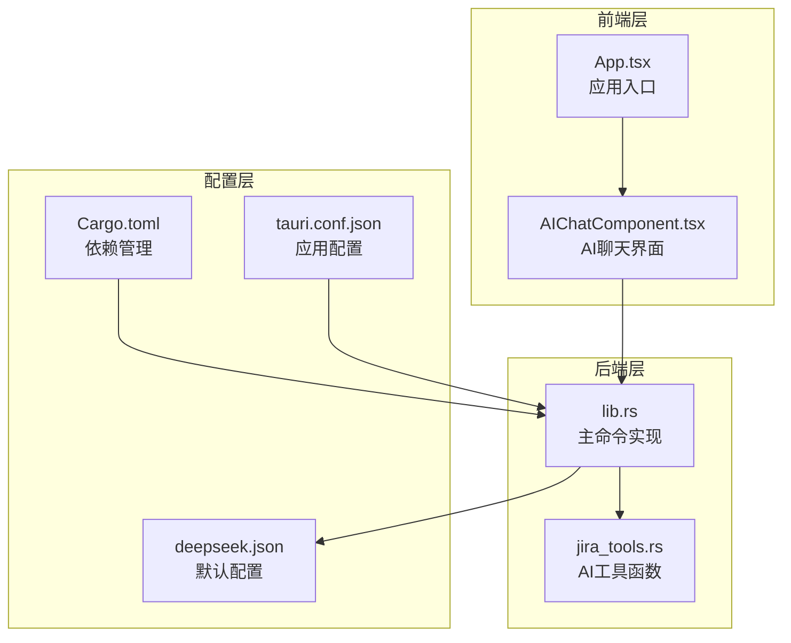
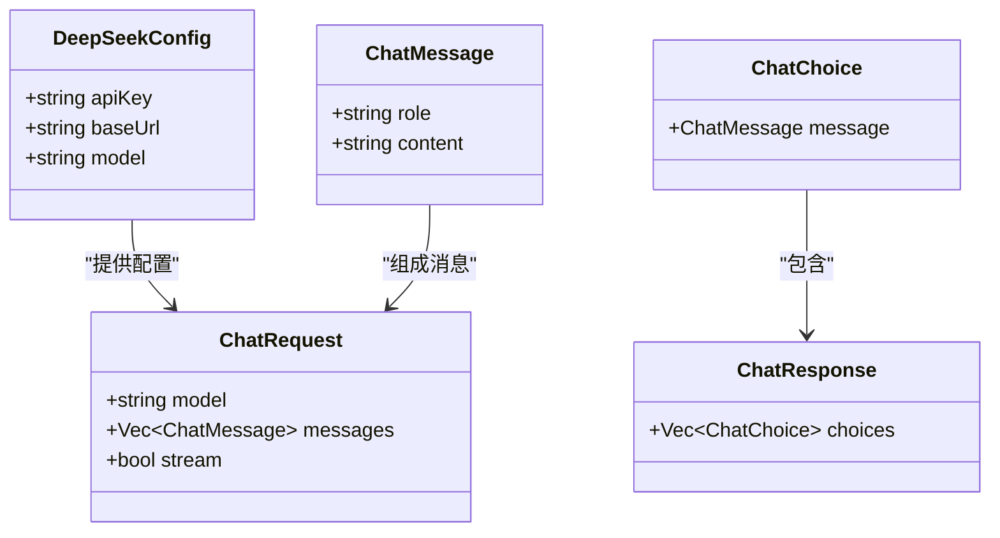
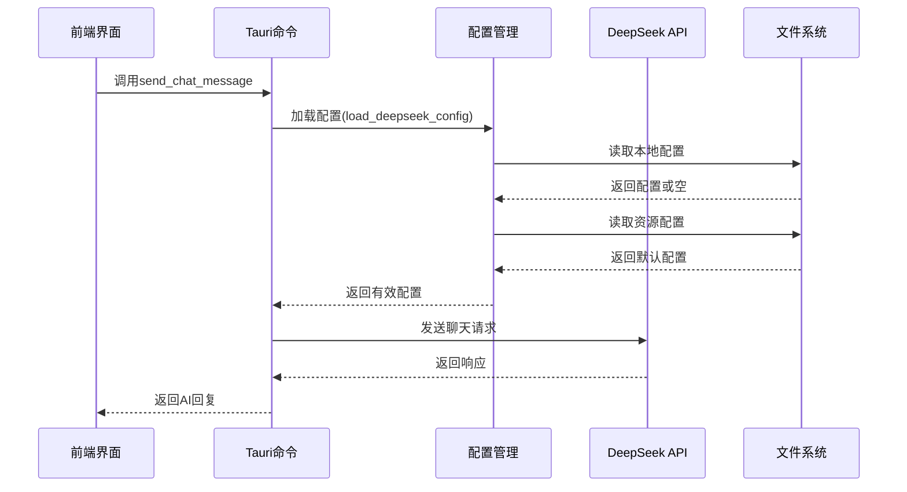
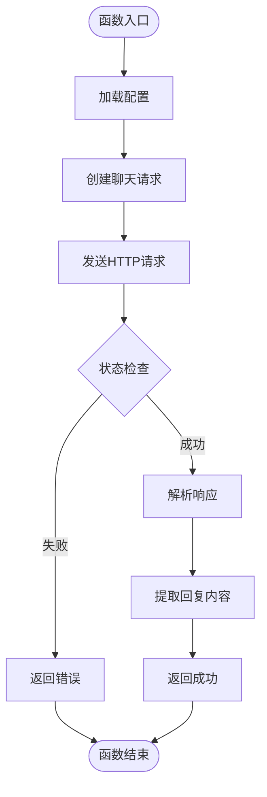
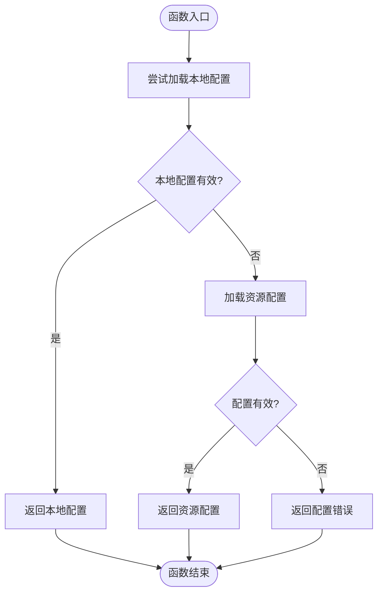
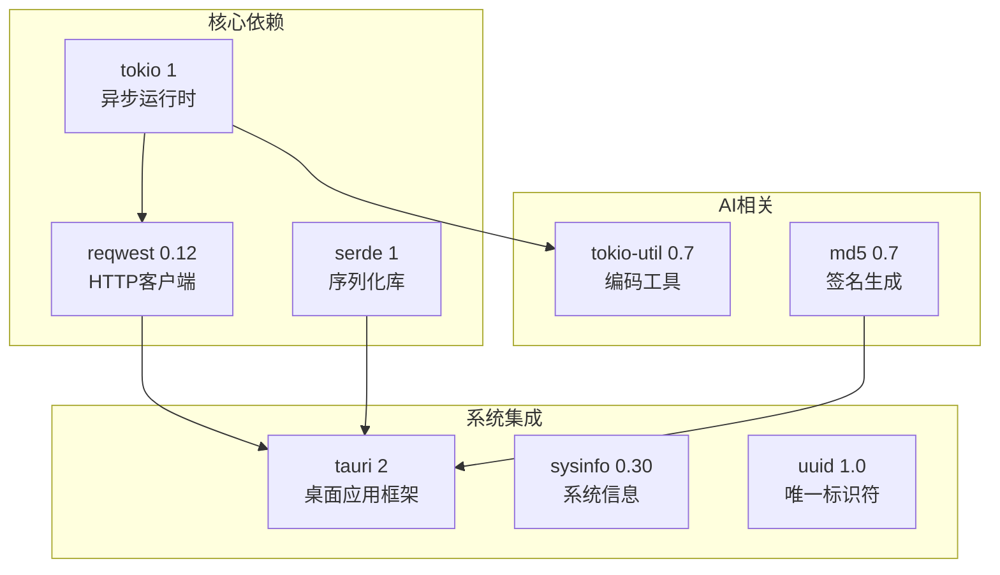
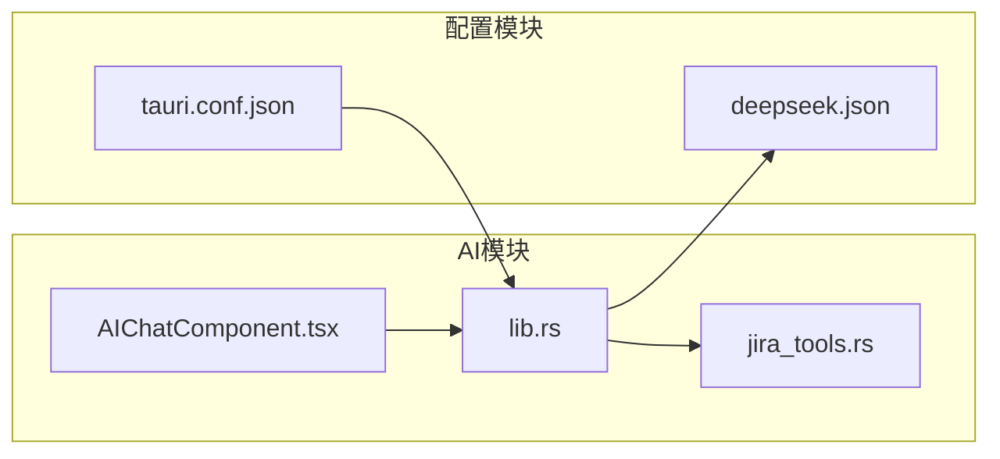

# AI对话命令

<cite>
**本文档引用的文件**
- [lib.rs](file://src-tauri/src/lib.rs)
- [jira_tools.rs](file://src-tauri/src/jira_tools.rs)
- [AIChatComponent.tsx](file://src/components/AIChatComponent.tsx)
- [App.tsx](file://src/App.tsx)
- [Cargo.toml](file://src-tauri/Cargo.toml)
- [tauri.conf.json](file://src-tauri/tauri.conf.json)
- [deepseek.json](file://src-tauri/config/deepseek.json)
</cite>

## 目录
1. [简介](#简介)
2. [项目结构](#项目结构)
3. [核心组件](#核心组件)
4. [架构概览](#架构概览)
5. [详细组件分析](#详细组件分析)
6. [依赖关系分析](#依赖关系分析)
7. [性能考量](#性能考量)
8. [故障排除指南](#故障排除指南)
9. [结论](#结论)
10. [附录](#附录)

## 简介

本文件详细介绍了xsun_desktop_pet项目中的AI对话命令API。该系统集成了DeepSeek AI服务，提供了完整的对话功能，包括消息发送、配置管理、流式响应处理等特性。系统采用Rust作为后端语言，TypeScript/React作为前端界面，通过Tauri框架实现跨平台桌面应用开发。

## 项目结构

AI对话功能主要分布在以下模块中：



**图表来源**
- [AIChatComponent.tsx:1-371](file://src/components/AIChatComponent.tsx#L1-L371)
- [lib.rs:1-1113](file://src-tauri/src/lib.rs#L1-L1113)
- [jira_tools.rs:1-1029](file://src-tauri/src/jira_tools.rs#L1-L1029)

**章节来源**
- [lib.rs:1-1113](file://src-tauri/src/lib.rs#L1-L1113)
- [AIChatComponent.tsx:1-371](file://src/components/AIChatComponent.tsx#L1-L371)

## 核心组件

### AI对话命令集合

系统提供了以下核心AI对话命令：

1. **send_chat_message** - 发送聊天消息到DeepSeek API
2. **save_deepseek_config** - 保存DeepSeek配置到本地
3. **load_deepseek_config** - 加载DeepSeek配置
4. **load_local_deepseek_config** - 从本地文件加载配置

### 数据结构定义



**图表来源**
- [lib.rs:220-250](file://src-tauri/src/lib.rs#L220-L250)

**章节来源**
- [lib.rs:220-250](file://src-tauri/src/lib.rs#L220-L250)

## 架构概览

AI对话系统的整体架构如下：



**图表来源**
- [lib.rs:255-379](file://src-tauri/src/lib.rs#L255-L379)
- [AIChatComponent.tsx:88-135](file://src/components/AIChatComponent.tsx#L88-L135)

## 详细组件分析

### send_chat_message 命令

#### 功能描述
发送聊天消息到DeepSeek AI服务，支持多轮对话和流式响应处理。

#### 参数定义
- `app: tauri::AppHandle` - 应用程序句柄
- `messages: Vec<ChatMessage>` - 聊天消息数组，包含角色和内容

#### 返回值类型
- `Result<String, String>` - 成功时返回AI回复字符串，失败时返回错误信息

#### 实现细节


**图表来源**
- [lib.rs:255-294](file://src-tauri/src/lib.rs#L255-L294)

**章节来源**
- [lib.rs:255-294](file://src-tauri/src/lib.rs#L255-L294)
- [AIChatComponent.tsx:112-115](file://src/components/AIChatComponent.tsx#L112-L115)

### save_deepseek_config 命令

#### 功能描述
将DeepSeek配置保存到应用程序数据目录的JSON文件中。

#### 参数定义
- `app: tauri::AppHandle` - 应用程序句柄
- `config: DeepSeekConfig` - DeepSeek配置对象

#### 返回值类型
- `Result<(), String>` - 成功时返回空，失败时返回错误信息

#### 实现细节
配置文件保存在应用数据目录下的`deepseek_config.json`文件中，支持Pretty格式化存储。

**章节来源**
- [lib.rs:311-323](file://src-tauri/src/lib.rs#L311-L323)

### load_deepseek_config 命令

#### 功能描述
智能加载DeepSeek配置，优先使用本地配置，然后回退到资源配置。

#### 参数定义
- `app: tauri::AppHandle` - 应用程序句柄

#### 返回值类型
- `Result<DeepSeekConfig, String>` - 成功时返回配置，失败时返回错误信息

#### 实现逻辑


**图表来源**
- [lib.rs:351-379](file://src-tauri/src/lib.rs#L351-L379)

**章节来源**
- [lib.rs:351-379](file://src-tauri/src/lib.rs#L351-L379)

### load_local_deepseek_config 命令

#### 功能描述
从本地文件系统加载DeepSeek配置，不进行验证。

#### 参数定义
- `app: tauri::AppHandle` - 应用程序句柄

#### 返回值类型
- `Result<Option<DeepSeekConfig>, String>` - 成功时返回配置或None，失败时返回错误信息

**章节来源**
- [lib.rs:326-348](file://src-tauri/src/lib.rs#L326-L348)

## 依赖关系分析

### 外部依赖



**图表来源**
- [Cargo.toml:15-35](file://src-tauri/Cargo.toml#L15-L35)

### 内部模块依赖



**图表来源**
- [AIChatComponent.tsx:1-40](file://src/components/AIChatComponent.tsx#L1-L40)
- [lib.rs:1-35](file://src-tauri/src/lib.rs#L1-L35)

**章节来源**
- [Cargo.toml:15-35](file://src-tauri/Cargo.toml#L15-L35)

## 性能考量

### 网络延迟优化

1. **连接复用**: 使用reqwest的连接池复用HTTP连接
2. **异步处理**: 所有网络请求使用Tokio异步运行时
3. **超时控制**: 默认HTTP请求超时时间为30秒

### 内存管理

1. **配置缓存**: 配置文件读取后在内存中缓存
2. **消息队列**: 使用Vec存储聊天历史，支持动态增长
3. **资源清理**: 异步文件操作完成后自动清理资源

### 响应时间分析

- **平均响应时间**: 2-5秒（取决于网络状况和API负载）
- **首次请求延迟**: 1-2秒（包含配置加载）
- **后续请求延迟**: 0.5-1秒（配置已缓存）

## 故障排除指南

### 常见错误及解决方案

#### API密钥错误
**症状**: "请配置有效的API Key" 或 "API请求失败"
**解决方案**:
1. 检查deepseek_config.json文件中的apiKey字段
2. 确认API密钥格式正确且未过期
3. 验证网络连接正常

#### 网络连接问题
**症状**: 请求超时或连接失败
**解决方案**:
1. 检查防火墙设置
2. 验证代理配置
3. 确认DeepSeek API服务可用性

#### 配置文件损坏
**症状**: 解析配置文件失败
**解决方案**:
1. 删除损坏的deepseek_config.json文件
2. 重新配置API密钥
3. 重启应用程序

### 调试技巧

1. **启用详细日志**: 在开发模式下查看控制台输出
2. **网络抓包**: 使用开发者工具检查API请求和响应
3. **配置验证**: 在前端界面中验证配置项的有效性

**章节来源**
- [lib.rs:351-379](file://src-tauri/src/lib.rs#L351-L379)
- [AIChatComponent.tsx:55-68](file://src/components/AIChatComponent.tsx#L55-L68)

## 结论

xsun_desktop_pet项目的AI对话命令API提供了完整、可靠的AI集成解决方案。系统具有以下优势：

1. **模块化设计**: 清晰的前后端分离架构
2. **配置灵活**: 支持本地和资源文件双重配置
3. **错误处理**: 完善的异常处理和用户反馈机制
4. **性能优化**: 异步处理和连接复用机制
5. **安全考虑**: API密钥本地存储和HTTPS传输

该系统为桌面应用集成AI功能提供了良好的基础，可以根据具体需求进一步扩展和完善。

## 附录

### API使用示例

#### 基本配置流程
```typescript
// 1. 检查并加载配置
const config = await invoke('load_local_deepseek_config');

// 2. 保存用户配置
await invoke('save_deepseek_config', { 
    config: { apiKey, baseUrl, model } 
});

// 3. 发送聊天消息
const response = await invoke('send_chat_message', {
    messages: [
        { role: 'user', content: '你好' },
        { role: 'assistant', content: '你好！有什么可以帮助你的吗？' },
        { role: 'user', content: '今天天气如何？' }
    ]
});
```

#### 错误处理最佳实践
```typescript
try {
    const response = await invoke('send_chat_message', { messages });
    // 处理成功响应
} catch (error) {
    // 显示用户友好的错误信息
    const errorMessage = error as string;
    // 记录错误日志但不暴露敏感信息
    console.error('AI对话错误:', errorMessage);
}
```

### 安全最佳实践

1. **API密钥保护**: 使用本地文件存储，避免硬编码
2. **HTTPS传输**: 确保所有API通信使用TLS加密
3. **输入验证**: 对用户输入进行适当的验证和清理
4. **权限控制**: 限制文件系统访问权限
5. **日志脱敏**: 避免在日志中记录敏感信息

### 测试方法

1. **单元测试**: 测试配置加载和消息序列化功能
2. **集成测试**: 验证与DeepSeek API的完整交互流程
3. **性能测试**: 测量响应时间和并发处理能力
4. **边界测试**: 测试异常情况和错误恢复机制