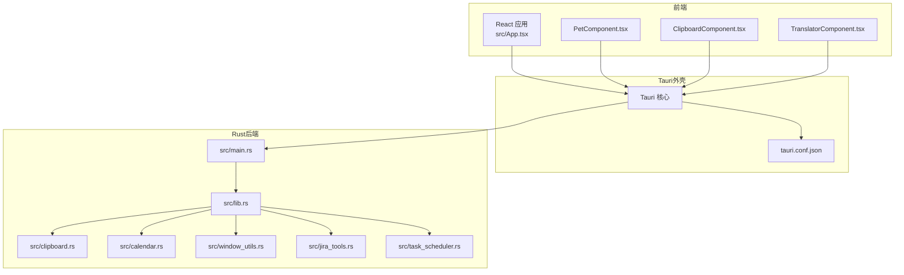
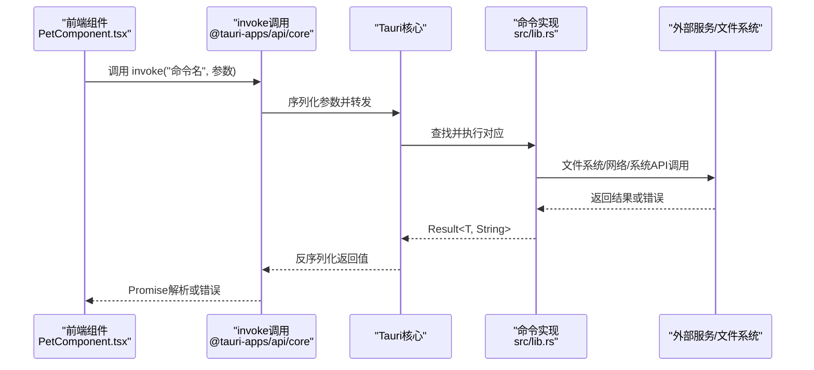
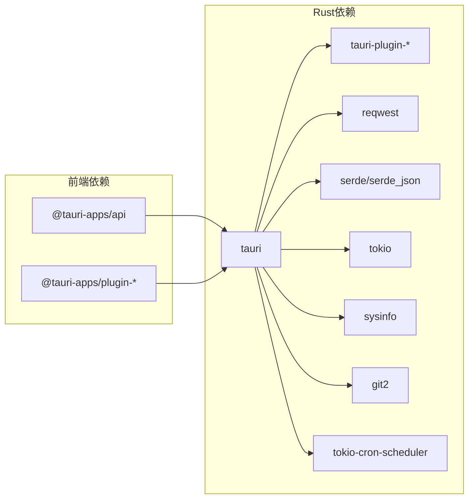

# API参考文档

<cite>
**本文档引用的文件**
- [src-tauri/src/lib.rs](file://src-tauri/src/lib.rs)
- [src-tauri/src/main.rs](file://src-tauri/src/main.rs)
- [src-tauri/src/clipboard.rs](file://src-tauri/src/clipboard.rs)
- [src-tauri/src/calendar.rs](file://src-tauri/src/calendar.rs)
- [src-tauri/src/window_utils.rs](file://src-tauri/src/window_utils.rs)
- [src-tauri/src/jira_tools.rs](file://src-tauri/src/jira_tools.rs)
- [src-tauri/src/task_scheduler.rs](file://src-tauri/src/task_scheduler.rs)
- [src-tauri/Cargo.toml](file://src-tauri/Cargo.toml)
- [src-tauri/tauri.conf.json](file://src-tauri/tauri.conf.json)
- [package.json](file://package.json)
- [src/App.tsx](file://src/App.tsx)
- [src/components/PetComponent.tsx](file://src/components/PetComponent.tsx)
- [src/components/ClipboardComponent.tsx](file://src/components/ClipboardComponent.tsx)
- [src/components/TranslatorComponent.tsx](file://src/components/TranslatorComponent.tsx)
</cite>

## 目录
1. [简介](#简介)
2. [项目结构](#项目结构)
3. [核心组件](#核心组件)
4. [架构概览](#架构概览)
5. [详细组件分析](#详细组件分析)
6. [依赖关系分析](#依赖关系分析)
7. [性能考量](#性能考量)
8. [故障排除指南](#故障排除指南)
9. [结论](#结论)
10. [附录](#附录)

## 简介
本文件为 xsun_desktop_pet 桌面宠物应用的 Tauri 命令 API 完整参考文档。文档涵盖所有后端命令的定义、参数、返回值、调用方式、错误处理、性能特征、版本兼容性、安全考虑、测试与调试方法以及最佳实践。同时提供前端 invoke 调用示例与使用场景，帮助开发者快速集成与扩展。

## 项目结构
该项目采用典型的 Tauri V2 架构，前端使用 React/Vite，后端 Rust 提供系统能力与业务逻辑，通过 Tauri 命令桥接前后端。

**图表来源**
- [src-tauri/src/main.rs:8-10](file://src-tauri/src/main.rs#L8-L10)
- [src-tauri/src/lib.rs:1-20](file://src-tauri/src/lib.rs#L1-L20)
- [src-tauri/tauri.conf.json:1-74](file://src-tauri/tauri.conf.json#L1-L74)
- [src/App.tsx:17-55](file://src/App.tsx#L17-L55)

**章节来源**
- [src-tauri/src/main.rs:1-11](file://src-tauri/src/main.rs#L1-L11)
- [src-tauri/src/lib.rs:1-30](file://src-tauri/src/lib.rs#L1-L30)
- [src-tauri/tauri.conf.json:1-74](file://src-tauri/tauri.conf.json#L1-L74)

## 核心组件
本项目的核心命令主要分布在以下模块：
- 系统与窗口管理：系统信息查询、窗口穿透控制、宠物唤醒/休眠、通知窗口展示
- 剪贴板管理：历史记录、复制、清空、手动检查
- AI与翻译：DeepSeek 对话、有道翻译
- 日历与待办：待办项 CRUD、日历设置、背景图上传/删除、数据刷新
- JIRA 工具：配置管理、工作日志查询、提交记录查询、连接测试
- 定时任务：基于 cron 的定时调度

**章节来源**
- [src-tauri/src/lib.rs:38-186](file://src-tauri/src/lib.rs#L38-L186)
- [src-tauri/src/lib.rs:188-271](file://src-tauri/src/lib.rs#L188-L271)
- [src-tauri/src/lib.rs:312-436](file://src-tauri/src/lib.rs#L312-L436)
- [src-tauri/src/lib.rs:462-660](file://src-tauri/src/lib.rs#L462-L660)
- [src-tauri/src/lib.rs:662-778](file://src-tauri/src/lib.rs#L662-L778)
- [src-tauri/src/clipboard.rs:124-224](file://src-tauri/src/clipboard.rs#L124-L224)
- [src-tauri/src/jira_tools.rs:80-115](file://src-tauri/src/jira_tools.rs#L80-L115)
- [src-tauri/src/jira_tools.rs:129-166](file://src-tauri/src/jira_tools.rs#L129-L166)
- [src-tauri/src/jira_tools.rs:188-243](file://src-tauri/src/jira_tools.rs#L188-L243)
- [src-tauri/src/jira_tools.rs:261-373](file://src-tauri/src/jira_tools.rs#L261-L373)
- [src-tauri/src/jira_tools.rs:457-503](file://src-tauri/src/jira_tools.rs#L457-L503)
- [src-tauri/src/task_scheduler.rs:82-93](file://src-tauri/src/task_scheduler.rs#L82-L93)

## 架构概览
Tauri 命令调用链路如下：

**图表来源**
- [src/components/PetComponent.tsx:36-47](file://src/components/PetComponent.tsx#L36-L47)
- [src-tauri/src/lib.rs:38-56](file://src-tauri/src/lib.rs#L38-L56)

## 详细组件分析

### 系统与窗口管理命令
- 命令：get_system_info
  - 参数：无
  - 返回：SystemInfo 结构体
  - 用途：采集 CPU/内存使用率
  - 异步：否
  - 错误：内部错误通过 Result<String> 抛出
  - 性能：轻量级系统采样
  - 安全：仅读取系统信息
  - 前端调用示例：参见 SystemInfoComponent.tsx 中的调用模式

- 命令：set_click_through
  - 参数：enabled: bool
  - 返回：Result<(), String>
  - 用途：设置窗口点击穿透（跨平台）
  - 异步：是
  - 错误：Windows 平台通过 Win32 API 错误码映射；非 Windows 使用 set_ignore_cursor_events
  - 性能：极低开销
  - 安全：窗口句柄操作，需目标窗口存在

- 命令：wake_up_pet
  - 参数：无
  - 返回：Result<(), String>
  - 用途：唤醒宠物窗口，取消穿透，发出 pet://wake-up 事件
  - 异步：是
  - 错误：窗口不存在或事件发送失败
  - 性能：事件驱动，瞬时

- 命令：open_expand_window
  - 参数：content: String
  - 返回：Result<(), String>
  - 用途：创建可编辑的扩展窗口，注入初始内容
  - 异步：是
  - 错误：窗口创建/显示/聚焦失败
  - 性能：窗口创建开销，JSON 注入成本低

- 命令：show_pomodoro_notification
  - 参数：message: String, is_work_time: bool
  - 返回：Result<(), String>
  - 用途：显示/更新番茄钟通知窗口
  - 异步：是
  - 错误：窗口不存在时创建失败或事件发送失败
  - 性能：事件通信，瞬时

**章节来源**
- [src-tauri/src/lib.rs:38-69](file://src-tauri/src/lib.rs#L38-L69)
- [src-tauri/src/lib.rs:44-56](file://src-tauri/src/lib.rs#L44-L56)
- [src-tauri/src/lib.rs:45-56](file://src-tauri/src/lib.rs#L45-L56)
- [src-tauri/src/lib.rs:71-109](file://src-tauri/src/lib.rs#L71-L109)
- [src-tauri/src/lib.rs:780-800](file://src-tauri/src/lib.rs#L780-L800)
- [src-tauri/src/window_utils.rs:9-32](file://src-tauri/src/window_utils.rs#L9-L32)

### 剪贴板管理命令
- 命令：get_clipboard_history
  - 参数：无
  - 返回：Result<Vec<ClipboardItem>, String>
  - 用途：获取剪贴板历史（最多5条）
  - 异步：否
  - 错误：锁竞争或序列化失败
  - 性能：O(n) 遍历，n≤5
  - 安全：仅读取内存状态

- 命令：add_to_clipboard_history
  - 参数：content: String
  - 返回：Result<(), String>
  - 用途：手动添加历史（带长度校验）
  - 异步：否
  - 错误：内容为空或过长
  - 性能：O(1)

- 命令：copy_to_clipboard
  - 参数：content: String
  - 返回：Result<(), String>
  - 用途：复制文本到系统剪贴板
  - 异步：否
  - 错误：内容为空或过长；写入失败
  - 性能：系统调用，瞬时

- 命令：get_current_clipboard
  - 参数：无
  - 返回：Result<String, String>
  - 用途：读取当前剪贴板内容
  - 异步：否
  - 错误：读取失败
  - 性能：系统调用，瞬时

- 命令：clear_clipboard_history
  - 参数：无
  - 返回：Result<(), String>
  - 用途：清空历史记录
  - 异步：否
  - 错误：无（内部锁）
  - 性能：O(1)

- 命令：manual_clipboard_check
  - 参数：无
  - 返回：Result<String, String>
  - 用途：手动检查并更新历史
  - 异步：否
  - 错误：内容过长或检查失败
  - 性能：O(1)

- 命令：test_add_multiple_items
  - 参数：无
  - 返回：Result<String, String>
  - 用途：批量添加测试（开发用）
  - 异步：否
  - 错误：添加失败
  - 性能：O(n)

**章节来源**
- [src-tauri/src/clipboard.rs:124-134](file://src-tauri/src/clipboard.rs#L124-L134)
- [src-tauri/src/clipboard.rs:136-158](file://src-tauri/src/clipboard.rs#L136-L158)
- [src-tauri/src/clipboard.rs:160-185](file://src-tauri/src/clipboard.rs#L160-L185)
- [src-tauri/src/clipboard.rs:187-191](file://src-tauri/src/clipboard.rs#L187-L191)
- [src-tauri/src/clipboard.rs:193-212](file://src-tauri/src/clipboard.rs#L193-L212)
- [src-tauri/src/clipboard.rs:214-224](file://src-tauri/src/clipboard.rs#L214-L224)
- [src-tauri/src/clipboard.rs:226-250](file://src-tauri/src/clipboard.rs#L226-L250)

### AI与翻译命令
- 命令：send_chat_message
  - 参数：messages: Vec<ChatMessage>
  - 返回：Result<String, String>
  - 用途：调用 DeepSeek API 获取回复
  - 异步：是
  - 错误：网络/解析/鉴权失败
  - 性能：网络IO，受API响应影响

- 命令：save_deepseek_config
  - 参数：config: DeepSeekConfig
  - 返回：Result<(), String>
  - 用途：保存配置到应用数据目录
  - 异步：是
  - 错误：文件写入失败
  - 性能：磁盘IO

- 命令：load_local_deepseek_config
  - 参数：无
  - 返回：Result<Option<DeepSeekConfig>, String>
  - 用途：加载本地配置
  - 异步：是
  - 错误：文件不存在或解析失败
  - 性能：磁盘IO

- 命令：load_deepseek_config
  - 参数：无
  - 返回：Result<DeepSeekConfig, String>
  - 用途：优先本地配置，否则资源文件
  - 异步：是
  - 错误：配置无效或加载失败
  - 性能：磁盘IO

- 命令：save_youdao_config
  - 参数：config: YoudaoConfig
  - 返回：Result<(), String>
  - 用途：保存有道翻译配置
  - 异步：是
  - 错误：文件写入失败
  - 性能：磁盘IO

- 命令：load_youdao_config
  - 参数：无
  - 返回：Result<Option<YoudaoConfig>, String>
  - 用途：加载有道翻译配置
  - 异步：是
  - 错误：文件不存在或解析失败
  - 性能：磁盘IO

- 命令：youdao_translate
  - 参数：text: String, from: String, to: String
  - 返回：Result<String, String>
  - 用途：调用有道翻译API
  - 异步：是
  - 错误：网络/解析/鉴权失败
  - 性能：网络IO

**章节来源**
- [src-tauri/src/lib.rs:147-186](file://src-tauri/src/lib.rs#L147-L186)
- [src-tauri/src/lib.rs:203-215](file://src-tauri/src/lib.rs#L203-L215)
- [src-tauri/src/lib.rs:218-240](file://src-tauri/src/lib.rs#L218-L240)
- [src-tauri/src/lib.rs:243-271](file://src-tauri/src/lib.rs#L243-L271)
- [src-tauri/src/lib.rs:312-324](file://src-tauri/src/lib.rs#L312-L324)
- [src-tauri/src/lib.rs:327-346](file://src-tauri/src/lib.rs#L327-L346)
- [src-tauri/src/lib.rs:363-436](file://src-tauri/src/lib.rs#L363-L436)

### 日历与待办命令
- 命令：get_todos_for_date
  - 参数：date: String
  - 返回：Result<Vec<TodoItem>, String>
  - 用途：按日期读取待办
  - 异步：是
  - 错误：文件读取/解析失败
  - 性能：磁盘IO

- 命令：save_todos_for_date
  - 参数：date: String, todos: Vec<TodoItem>
  - 返回：Result<(), String>
  - 用途：按日期保存待办
  - 异步：是
  - 错误：文件写入失败
  - 性能：磁盘IO

- 命令：open_todo_window
  - 参数：date: String
  - 返回：Result<(), String>
  - 用途：打开/聚焦待办窗口
  - 异步：是
  - 错误：窗口创建/显示/聚焦失败
  - 性能：窗口管理

- 命令：save_calendar_settings
  - 参数：settings: CalendarSettings
  - 返回：Result<(), String>
  - 用途：保存日历设置
  - 异步：是
  - 错误：文件写入失败
  - 性能：磁盘IO

- 命令：load_calendar_settings
  - 参数：无
  - 返回：Result<CalendarSettings, String>
  - 用途：加载日历设置
  - 异步：是
  - 错误：文件读取/解析失败
  - 性能：磁盘IO

- 命令：upload_background_image
  - 参数：image_data: Vec<u8>, filename: String
  - 返回：Result<String, String>
  - 用途：上传背景图并返回相对路径
  - 异步：是
  - 错误：目录创建/文件写入失败
  - 性能：磁盘IO

- 命令：delete_background_image
  - 参数：image_path: String
  - 返回：Result<(), String>
  - 用途：删除背景图
  - 异步：是
  - 错误：文件不存在或删除失败
  - 性能：磁盘IO

- 命令：refresh_calendar_data
  - 参数：无
  - 返回：Result<(), String>
  - 用途：向日历窗口发送刷新事件
  - 异步：否
  - 错误：窗口不存在或事件发送失败
  - 性能：事件通信

**章节来源**
- [src-tauri/src/lib.rs:462-522](file://src-tauri/src/lib.rs#L462-L522)
- [src-tauri/src/lib.rs:524-560](file://src-tauri/src/lib.rs#L524-L560)
- [src-tauri/src/lib.rs:562-609](file://src-tauri/src/lib.rs#L562-L609)
- [src-tauri/src/lib.rs:611-652](file://src-tauri/src/lib.rs#L611-L652)
- [src-tauri/src/lib.rs:653-660](file://src-tauri/src/lib.rs#L653-L660)

### JIRA工具命令
- 命令：save_jira_config
  - 参数：config: JiraConfig
  - 返回：Result<(), String>
  - 用途：保存JIRA配置
  - 异步：是
  - 错误：文件写入失败
  - 性能：磁盘IO

- 命令：load_jira_config
  - 参数：无
  - 返回：Result<Option<JiraConfig>, String>
  - 用途：加载JIRA配置
  - 异步：是
  - 错误：文件不存在或解析失败
  - 性能：磁盘IO

- 命令：get_my_unfinished_issues
  - 参数：无
  - 返回：Result<Vec<JiraIssue>, String>
  - 用途：获取未完成问题列表
  - 异步：是
  - 错误：网络/解析失败
  - 性能：网络IO

- 命令：get_my_today_worklogs
  - 参数：无
  - 返回：Result<Vec<WorklogEntry>, String>
  - 用途：获取当日工作日志
  - 异步：是
  - 错误：网络/解析失败
  - 性能：网络IO

- 命令：log_work
  - 参数：issue_key: String, time_spent_hours: f64, comment: String
  - 返回：Result<bool, String>
  - 用途：记录工作时间
  - 异步：是
  - 错误：网络/鉴权失败
  - 性能：网络IO

- 命令：test_jira_connection
  - 参数：无
  - 返回：Result<bool, String>
  - 用途：测试JIRA连接
  - 异步：是
  - 错误：网络/鉴权失败
  - 性能：网络IO

- 命令：get_commits_by_date
  - 参数：date_str: String
  - 返回：Result<Vec<GitCommit>, String>
  - 用途：按日期获取提交记录（多仓库）
  - 异步：是
  - 错误：Git操作/网络失败
  - 性能：Git操作，耗时较长

- 命令：get_current_date
  - 参数：无
  - 返回：Result<String, String>
  - 用途：获取当前日期和星期
  - 异步：否
  - 错误：无
  - 性能：瞬时

- 命令：get_required_work_hours
  - 参数：无
  - 返回：Result<f64, String>
  - 用途：计算应工作小时数
  - 异步：否
  - 错误：无
  - 性能：瞬时

**章节来源**
- [src-tauri/src/jira_tools.rs:80-115](file://src-tauri/src/jira_tools.rs#L80-L115)
- [src-tauri/src/jira_tools.rs:129-166](file://src-tauri/src/jira_tools.rs#L129-L166)
- [src-tauri/src/jira_tools.rs:188-243](file://src-tauri/src/jira_tools.rs#L188-L243)
- [src-tauri/src/jira_tools.rs:261-373](file://src-tauri/src/jira_tools.rs#L261-L373)
- [src-tauri/src/jira_tools.rs:374-455](file://src-tauri/src/jira_tools.rs#L374-L455)
- [src-tauri/src/jira_tools.rs:456-503](file://src-tauri/src/jira_tools.rs#L456-L503)
- [src-tauri/src/jira_tools.rs:524-654](file://src-tauri/src/jira_tools.rs#L524-L654)
- [src-tauri/src/jira_tools.rs:655-681](file://src-tauri/src/jira_tools.rs#L655-L681)

### 定时任务命令
- 命令：init_scheduler
  - 参数：无
  - 返回：Result<(), String>
  - 用途：初始化并启动定时任务调度器
  - 异步：是
  - 错误：调度器创建/启动失败
  - 性能：一次性初始化

- 命令：start_worklog_scheduler
  - 参数：无
  - 返回：Result<(), String>
  - 用途：启动工作日志AI定时任务
  - 异步：是
  - 错误：任务创建/添加失败
  - 性能：周期性任务，CPU占用低

**章节来源**
- [src-tauri/src/task_scheduler.rs:82-93](file://src-tauri/src/task_scheduler.rs#L82-L93)
- [src-tauri/src/task_scheduler.rs:21-61](file://src-tauri/src/task_scheduler.rs#L21-L61)

## 依赖关系分析
- Rust 依赖
  - tauri: 核心框架与命令系统
  - tauri-plugin-*: 插件（fs、dialog、opener、clipboard-manager）
  - reqwest: HTTP客户端
  - serde/serde_json: 序列化
  - tokio: 异步运行时
  - sysinfo: 系统信息
  - git2: Git操作
  - tokio-cron-scheduler: 定时任务
- 前端依赖
  - @tauri-apps/api: invoke、事件监听、窗口管理
  - @tauri-apps/plugin-*: 插件封装

**图表来源**
- [src-tauri/Cargo.toml:15-43](file://src-tauri/Cargo.toml#L15-L43)
- [package.json:12-28](file://package.json#L12-L28)

**章节来源**
- [src-tauri/Cargo.toml:15-43](file://src-tauri/Cargo.toml#L15-L43)
- [package.json:12-28](file://package.json#L12-L28)

## 性能考量
- 系统信息采集：轻量，CPU占用可忽略
- 窗口穿透切换：极低开销
- 窗口创建/显示：首次创建有开销，后续复用窗口可显著降低延迟
- 文件系统操作：JSON读写为 O(n) 且 n 很小，通常可忽略
- 网络请求：受外部API响应时间影响，建议增加超时与重试策略
- Git操作：多仓库clone/fetch较耗时，建议异步执行并在UI层提示进度
- 定时任务：基于 cron 的低频任务，CPU占用低

[本节为通用性能讨论，无需特定文件来源]

## 故障排除指南
- invoke 调用失败
  - 检查命令名称拼写与导出
  - 确认参数类型与数量正确
  - 查看 Result<String> 错误信息
- 窗口相关错误
  - 确认窗口标签存在且已创建
  - Windows 平台检查句柄有效性
- 文件读写错误
  - 检查应用数据目录权限
  - 确认 JSON 格式正确
- 网络请求错误
  - 检查代理/防火墙
  - 验证 API Key 与URL
- Git操作错误
  - 检查仓库URL与凭据
  - 确认网络可达性

**章节来源**
- [src-tauri/src/lib.rs:44-56](file://src-tauri/src/lib.rs#L44-L56)
- [src-tauri/src/lib.rs:71-109](file://src-tauri/src/lib.rs#L71-L109)
- [src-tauri/src/clipboard.rs:160-185](file://src-tauri/src/clipboard.rs#L160-L185)
- [src-tauri/src/jira_tools.rs:524-654](file://src-tauri/src/jira_tools.rs#L524-L654)

## 结论
本项目通过清晰的模块划分与完善的命令体系，实现了桌面宠物、剪贴板、AI对话、翻译、日历、JIRA 工具与定时任务等丰富功能。命令设计遵循异步原则，结合前端 invoke 调用与事件机制，提供了良好的用户体验。建议在生产环境中加强错误处理、增加超时与重试、对耗时操作进行异步化与进度反馈。

[本节为总结，无需特定文件来源]

## 附录

### 命令清单与调用示例

- 系统与窗口管理
  - get_system_info
    - 调用：invoke("get_system_info")
    - 返回：SystemInfo
    - 示例：参见 SystemInfoComponent.tsx
  - set_click_through
    - 调用：invoke("set_click_through", { enabled: true })
    - 返回：void
    - 示例：PetComponent.tsx 中的 setClickThrough
  - wake_up_pet
    - 调用：invoke("wake_up_pet")
    - 返回：void
    - 示例：PetComponent.tsx 中的唤醒逻辑
  - open_expand_window
    - 调用：invoke("open_expand_window", { content: "..." })
    - 返回：void
    - 示例：ClipboardComponent.tsx 中的 handleExpand
  - show_pomodoro_notification
    - 调用：invoke("show_pomodoro_notification", { message: "...", is_work_time: true })
    - 返回：void
    - 示例：定时任务触发处

- 剪贴板管理
  - get_clipboard_history
    - 调用：invoke("get_clipboard_history")
    - 返回：ClipboardItem[]
    - 示例：ClipboardComponent.tsx
  - add_to_clipboard_history
    - 调用：invoke("add_to_clipboard_history", { content: "..." })
    - 返回：void
  - copy_to_clipboard
    - 调用：invoke("copy_to_clipboard", { content: "..." })
    - 返回：void
  - get_current_clipboard
    - 调用：invoke("get_current_clipboard")
    - 返回：string
  - clear_clipboard_history
    - 调用：invoke("clear_clipboard_history")
    - 返回：void
  - manual_clipboard_check
    - 调用：invoke("manual_clipboard_check")
    - 返回：string

- AI与翻译
  - send_chat_message
    - 调用：invoke("send_chat_message", { messages: [...] })
    - 返回：string
    - 示例：AIChatComponent.tsx
  - save_deepseek_config
    - 调用：invoke("save_deepseek_config", { config: {...} })
    - 返回：void
  - load_local_deepseek_config
    - 调用：invoke("load_local_deepseek_config")
    - 返回：DeepSeekConfig?
  - load_deepseek_config
    - 调用：invoke("load_deepseek_config")
    - 返回：DeepSeekConfig
  - save_youdao_config
    - 调用：invoke("save_youdao_config", { config: {...} })
    - 返回：void
  - load_youdao_config
    - 调用：invoke("load_youdao_config")
    - 返回：YoudaoConfig?
  - youdao_translate
    - 调用：invoke("youdao_translate", { text, from, to })
    - 返回：string
    - 示例：TranslatorComponent.tsx

- 日历与待办
  - get_todos_for_date
    - 调用：invoke("get_todos_for_date", { date: "YYYY-MM-DD" })
    - 返回：TodoItem[]
  - save_todos_for_date
    - 调用：invoke("save_todos_for_date", { date, todos })
    - 返回：void
  - open_todo_window
    - 调用：invoke("open_todo_window", { date })
    - 返回：void
  - save_calendar_settings
    - 调用：invoke("save_calendar_settings", { settings })
    - 返回：void
  - load_calendar_settings
    - 调用：invoke("load_calendar_settings")
    - 返回：CalendarSettings
  - upload_background_image
    - 调用：invoke("upload_background_image", { image_data, filename })
    - 返回：string
  - delete_background_image
    - 调用：invoke("delete_background_image", { image_path })
    - 返回：void
  - refresh_calendar_data
    - 调用：invoke("refresh_calendar_data")
    - 返回：void

- JIRA工具
  - save_jira_config
    - 调用：invoke("save_jira_config", { config })
    - 返回：void
  - load_jira_config
    - 调用：invoke("load_jira_config")
    - 返回：JiraConfig?
  - get_my_unfinished_issues
    - 调用：invoke("get_my_unfinished_issues")
    - 返回：JiraIssue[]
  - get_my_today_worklogs
    - 调用：invoke("get_my_today_worklogs")
    - 返回：WorklogEntry[]
  - log_work
    - 调用：invoke("log_work", { issue_key, time_spent_hours, comment })
    - 返回：boolean
  - test_jira_connection
    - 调用：invoke("test_jira_connection")
    - 返回：boolean
  - get_commits_by_date
    - 调用：invoke("get_commits_by_date", { date_str })
    - 返回：GitCommit[]
  - get_current_date
    - 调用：invoke("get_current_date")
    - 返回：string
  - get_required_work_hours
    - 调用：invoke("get_required_work_hours")
    - 返回：number

- 定时任务
  - init_scheduler
    - 调用：invoke("init_scheduler")
    - 返回：void
  - start_worklog_scheduler
    - 调用：invoke("start_worklog_scheduler")
    - 返回：void

**章节来源**
- [src-tauri/src/lib.rs:38-186](file://src-tauri/src/lib.rs#L38-L186)
- [src-tauri/src/lib.rs:188-271](file://src-tauri/src/lib.rs#L188-L271)
- [src-tauri/src/lib.rs:312-436](file://src-tauri/src/lib.rs#L312-L436)
- [src-tauri/src/lib.rs:462-660](file://src-tauri/src/lib.rs#L462-L660)
- [src-tauri/src/lib.rs:662-778](file://src-tauri/src/lib.rs#L662-L778)
- [src-tauri/src/clipboard.rs:124-224](file://src-tauri/src/clipboard.rs#L124-L224)
- [src-tauri/src/jira_tools.rs:80-115](file://src-tauri/src/jira_tools.rs#L80-L115)
- [src-tauri/src/jira_tools.rs:129-166](file://src-tauri/src/jira_tools.rs#L129-L166)
- [src-tauri/src/jira_tools.rs:188-243](file://src-tauri/src/jira_tools.rs#L188-L243)
- [src-tauri/src/jira_tools.rs:261-373](file://src-tauri/src/jira_tools.rs#L261-L373)
- [src-tauri/src/jira_tools.rs:374-455](file://src-tauri/src/jira_tools.rs#L374-L455)
- [src-tauri/src/jira_tools.rs:456-503](file://src-tauri/src/jira_tools.rs#L456-L503)
- [src-tauri/src/task_scheduler.rs:82-93](file://src-tauri/src/task_scheduler.rs#L82-L93)

### 版本兼容性与迁移指南
- Tauri V2
  - 命令宏：#[tauri::command]
  - 插件：tauri-plugin-*
  - 前端：@tauri-apps/api ~2.8.0
- 迁移要点
  - 从 V1 升级需调整命令注册与插件加载方式
  - 注意事件命名空间与窗口标签管理
  - 插件 API 变更需同步更新

**章节来源**
- [src-tauri/tauri.conf.json:1-74](file://src-tauri/tauri.conf.json#L1-L74)
- [package.json:12-28](file://package.json#L12-L28)

### 安全考虑
- 输入验证
  - 所有外部输入（文本、路径、URL）均需长度与格式校验
- 权限控制
  - 文件系统访问通过 tauri-plugin-fs 控制
  - 窗口操作需目标窗口存在
- 机密信息
  - API Key 存储于应用数据目录，避免硬编码
  - 传输加密（reqwest rustls-tls）
- 访问控制
  - 通过窗口标签与事件通道限制交互范围

**章节来源**
- [src-tauri/src/lib.rs:147-186](file://src-tauri/src/lib.rs#L147-L186)
- [src-tauri/src/lib.rs:363-436](file://src-tauri/src/lib.rs#L363-L436)
- [src-tauri/src/clipboard.rs:160-185](file://src-tauri/src/clipboard.rs#L160-L185)
- [src-tauri/Cargo.toml:15-43](file://src-tauri/Cargo.toml#L15-L43)

### 测试方法与调试技巧
- 单元测试
  - 对纯函数与数据结构进行测试（如日期解析、配置加载）
- 集成测试
  - invoke 调用链路测试（前端组件 + 命令实现）
  - 外部服务模拟（mock API/文件系统）
- 调试技巧
  - 使用 console.error 输出错误
  - 前端监听事件确认后端事件发送
  - 分模块逐步验证（剪贴板 → 翻译 → 日历）

**章节来源**
- [src-tauri/src/clipboard.rs:226-250](file://src-tauri/src/clipboard.rs#L226-L250)
- [src-tauri/src/lib.rs:363-436](file://src-tauri/src/lib.rs#L363-L436)

### 最佳实践与性能优化建议
- 异步优先：网络与文件操作一律异步
- 错误早返回：参数校验与前置检查
- 资源复用：窗口与HTTP客户端复用
- 缓存策略：频繁读取的数据可缓存
- 超时与重试：网络请求增加超时与指数退避
- UI反馈：耗时操作显示加载状态与进度

[本节为通用建议，无需特定文件来源]