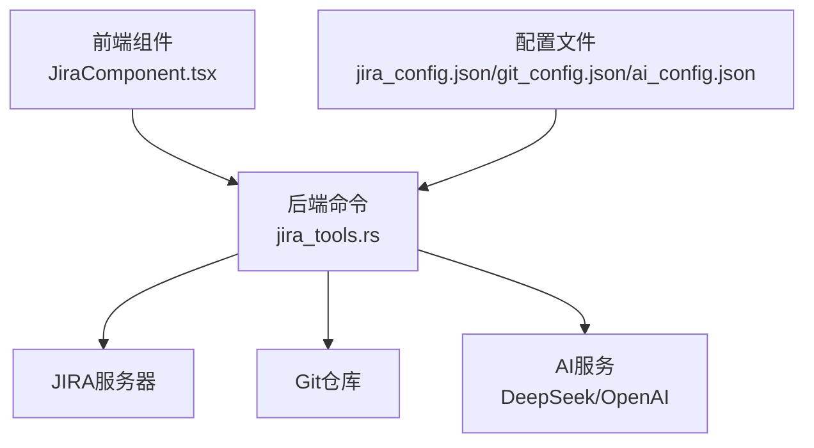
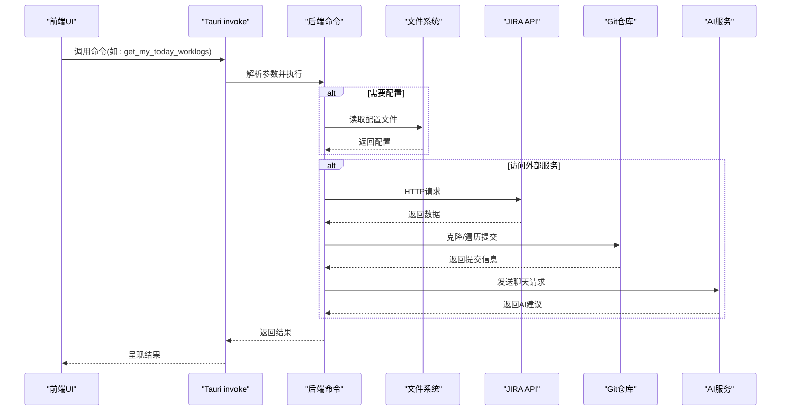
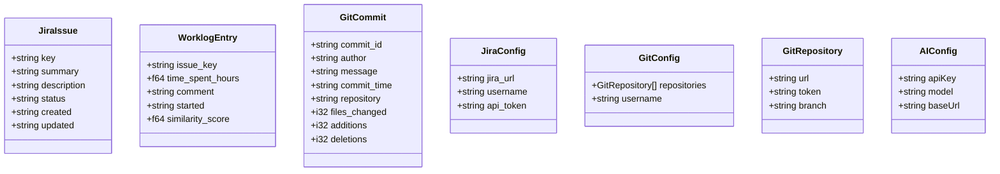
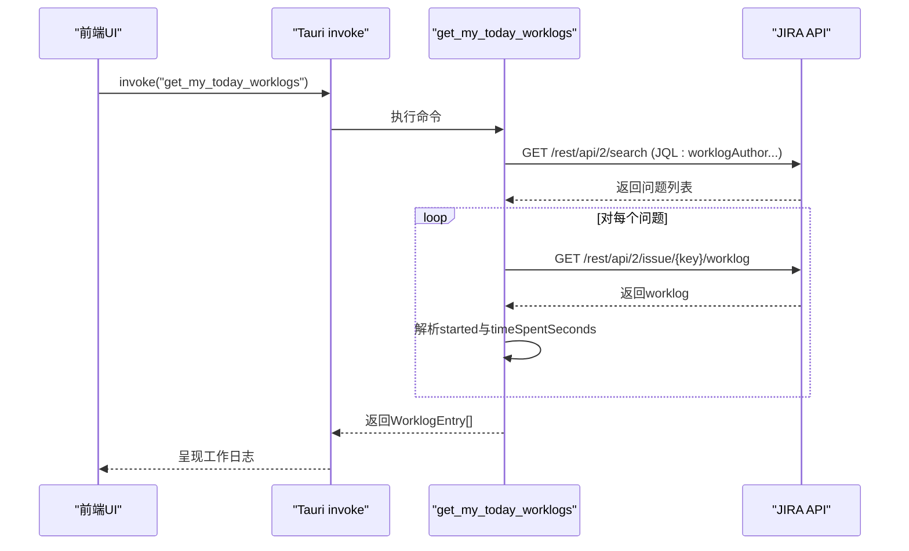
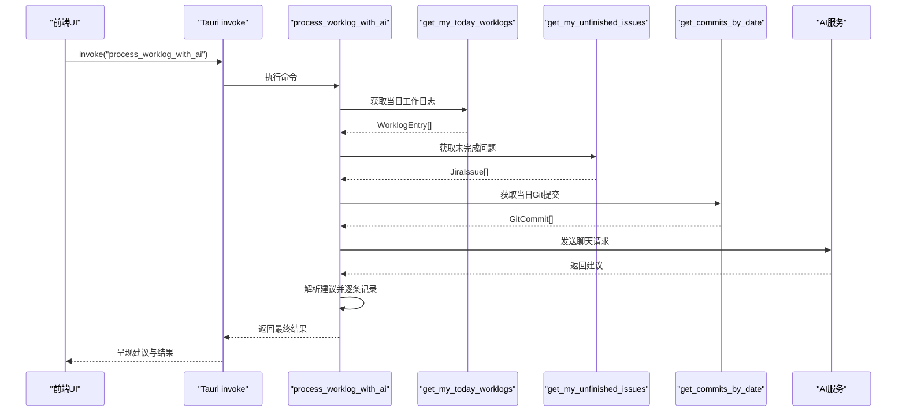
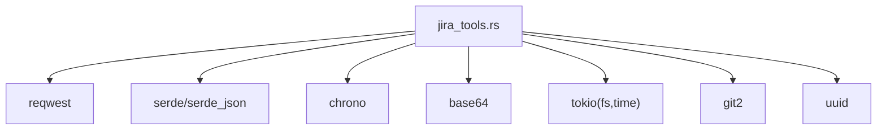

# JIRA集成命令

<cite>
**本文档引用的文件**
- [jira_tools.rs](file://src-tauri/src/jira_tools.rs)
- [lib.rs](file://src-tauri/src/lib.rs)
- [main.rs](file://src-tauri/src/main.rs)
- [JiraComponent.tsx](file://src/components/JiraComponent.tsx)
- [Cargo.toml](file://src-tauri/Cargo.toml)
- [deepseek.json](file://src-tauri/config/deepseek.json)
</cite>

## 目录
1. [简介](#简介)
2. [项目结构](#项目结构)
3. [核心组件](#核心组件)
4. [架构概览](#架构概览)
5. [详细组件分析](#详细组件分析)
6. [依赖关系分析](#依赖关系分析)
7. [性能考量](#性能考量)
8. [故障排除指南](#故障排除指南)
9. [结论](#结论)
10. [附录](#附录)

## 简介
本文件详细说明JIRA集成命令API，涵盖所有JIRA相关的Tauri命令，包括连接测试、工作日志查询、未完成问题获取、Git提交查询、工时需求计算、工作时间记录、AI辅助工作日志处理以及配置管理等。文档解释每个命令的功能、参数定义、返回值类型、使用示例，并分析数据结构、性能特征、错误处理机制、安全考虑、测试方法和调试技巧。

## 项目结构
JIRA集成位于Rust后端模块中，前端通过Tauri的invoke调用后端命令。关键文件如下：
- 后端命令实现：src-tauri/src/jira_tools.rs
- 前端组件：src/components/JiraComponent.tsx
- 依赖声明：src-tauri/Cargo.toml
- AI配置：src-tauri/config/deepseek.json

**图表来源**
- [jira_tools.rs:1-1029](file://src-tauri/src/jira_tools.rs#L1-L1029)
- [JiraComponent.tsx:1-826](file://src/components/JiraComponent.tsx#L1-L826)

**章节来源**
- [jira_tools.rs:1-1029](file://src-tauri/src/jira_tools.rs#L1-L1029)
- [lib.rs:1-1120](file://src-tauri/src/lib.rs#L1-L1120)
- [main.rs:1-11](file://src-tauri/src/main.rs#L1-L11)

## 核心组件
本节概述JIRA集成命令及其职责：
- 连接测试：验证JIRA凭据和可用性
- 工作日志查询：获取当日工作日志
- 未完成问题：获取当前用户的未完成问题列表
- Git提交查询：按日期获取Git提交
- 工时需求：根据星期计算当天应工作时长
- 工作时间记录：向JIRA记录工作时间
- AI辅助：基于AI生成工作日志建议并自动记录
- 配置管理：JIRA/Git/AI配置的保存与加载

**章节来源**
- [jira_tools.rs:80-115](file://src-tauri/src/jira_tools.rs#L80-L115)
- [jira_tools.rs:132-166](file://src-tauri/src/jira_tools.rs#L132-L166)
- [jira_tools.rs:972-1006](file://src-tauri/src/jira_tools.rs#L972-L1006)
- [jira_tools.rs:188-243](file://src-tauri/src/jira_tools.rs#L188-L243)
- [jira_tools.rs:262-373](file://src-tauri/src/jira_tools.rs#L262-L373)
- [jira_tools.rs:525-654](file://src-tauri/src/jira_tools.rs#L525-L654)
- [jira_tools.rs:669-681](file://src-tauri/src/jira_tools.rs#L669-L681)
- [jira_tools.rs:376-455](file://src-tauri/src/jira_tools.rs#L376-L455)
- [jira_tools.rs:809-955](file://src-tauri/src/jira_tools.rs#L809-L955)

## 架构概览
JIRA集成采用前后端分离设计：
- 前端负责用户界面与交互，通过Tauri invoke调用后端命令
- 后端命令封装HTTP请求、文件系统操作、Git仓库访问和AI服务调用
- 配置通过本地文件系统持久化，支持应用数据目录

**图表来源**
- [jira_tools.rs:262-373](file://src-tauri/src/jira_tools.rs#L262-L373)
- [jira_tools.rs:525-654](file://src-tauri/src/jira_tools.rs#L525-L654)
- [jira_tools.rs:809-955](file://src-tauri/src/jira_tools.rs#L809-L955)

## 详细组件分析

### 数据结构定义
JIRA集成涉及以下核心数据结构：

**图表来源**
- [jira_tools.rs:23-64](file://src-tauri/src/jira_tools.rs#L23-L64)

**章节来源**
- [jira_tools.rs:23-64](file://src-tauri/src/jira_tools.rs#L23-L64)

### 命令清单与详细说明

#### 1) test_jira_connection
- 功能：测试JIRA连接，验证凭据有效性
- 参数：无
- 返回：布尔值，表示连接是否成功
- 实现要点：使用基本认证访问JIRA的myself端点，解析HTTP状态码与响应体中的错误信息
- 使用示例：前端调用invoke("test_jira_connection")，在成功时弹出提示

**章节来源**
- [jira_tools.rs:457-503](file://src-tauri/src/jira_tools.rs#L457-L503)
- [JiraComponent.tsx:267-290](file://src/components/JiraComponent.tsx#L267-L290)

#### 2) get_my_today_worklogs
- 功能：获取当前用户当日的工作日志
- 参数：无
- 返回：WorklogEntry数组
- 实现要点：先搜索包含当日工作日志的问题，再对每个问题单独请求其worklog，解析started字段与timeSpentSeconds，兼容ADF评论结构
- 性能：对每个问题发起一次worklog请求，可能产生多次网络调用
- 使用示例：前端调用invoke("get_my_today_worklogs")

**章节来源**
- [jira_tools.rs:262-373](file://src-tauri/src/jira_tools.rs#L262-L373)
- [JiraComponent.tsx:234-235](file://src/components/JiraComponent.tsx#L234-L235)

#### 3) get_my_unfinished_issues
- 功能：获取当前用户未完成的问题列表
- 参数：无
- 返回：JiraIssue数组
- 实现要点：使用JQL查询assignee = currentUser() AND resolution = Unresolved，限制最大结果数
- 使用示例：前端调用invoke("get_my_unfinished_issues")

**章节来源**
- [jira_tools.rs:188-243](file://src-tauri/src/jira_tools.rs#L188-L243)
- [JiraComponent.tsx:231-232](file://src/components/JiraComponent.tsx#L231-L232)

#### 4) get_commits_by_date
- 功能：按指定日期获取Git提交
- 参数：dateStr (YYYY-MM-DD)
- 返回：GitCommit数组
- 实现要点：遍历配置的Git仓库，使用git2克隆并fetch所有远程分支，通过revwalk遍历提交，按作者与日期过滤，去重后返回
- 性能：每次调用会克隆仓库到临时目录，适合按天调用，避免频繁克隆
- 使用示例：前端调用invoke("get_commits_by_date", {dateStr: "2025-01-01"})

**章节来源**
- [jira_tools.rs:525-654](file://src-tauri/src/jira_tools.rs#L525-L654)
- [JiraComponent.tsx:247](file://src/components/JiraComponent.tsx#L247)

#### 5) get_required_work_hours
- 功能：根据当前星期计算当天应工作时长
- 参数：无
- 返回：f64 (小时)
- 实现要点：周一/三/五返回8小时，周二/四返回10小时，其他返回0
- 使用示例：前端调用invoke("get_required_work_hours")

**章节来源**
- [jira_tools.rs:669-681](file://src-tauri/src/jira_tools.rs#L669-L681)
- [JiraComponent.tsx:227-228](file://src/components/JiraComponent.tsx#L227-L228)

#### 6) log_work
- 功能：向JIRA记录工作时间
- 参数：
  - issueKey: 问题编号
  - timeSpentHours: 工作时长(小时)
  - comment: 工作说明
- 返回：布尔值，表示记录是否成功
- 实现要点：将小时转换为秒，使用JIRA推荐的started格式，解析响应中的错误信息
- 使用示例：前端调用invoke("log_work", {issueKey, timeSpentHours, comment})

**章节来源**
- [jira_tools.rs:376-455](file://src-tauri/src/jira_tools.rs#L376-L455)
- [JiraComponent.tsx:305-309](file://src/components/JiraComponent.tsx#L305-L309)

#### 7) process_worklog_with_ai
- 功能：AI辅助生成工作日志建议并自动记录
- 参数：无
- 返回：字符串，包含AI建议与最终结果
- 实现要点：组合当日工作日志、未完成问题、Git提交，计算剩余工时，构造提示词，调用AI服务，解析建议并逐条记录
- 性能：包含多次API调用与逐条记录，建议适当延迟避免过于频繁
- 使用示例：前端调用invoke("process_worklog_with_ai")

**章节来源**
- [jira_tools.rs:809-955](file://src-tauri/src/jira_tools.rs#L809-L955)
- [JiraComponent.tsx:366-377](file://src/components/JiraComponent.tsx#L366-L377)

#### 8) save_jira_config / load_jira_config
- 功能：保存/加载JIRA配置
- 参数：save_jira_config接收JiraConfig对象；load_jira_config无参数
- 返回：save返回空；load返回Option<JiraConfig>
- 实现要点：配置文件位于应用数据目录下的jira_config.json
- 使用示例：前端分别调用invoke("save_jira_config", {config})与invoke("load_jira_config")

**章节来源**
- [jira_tools.rs:80-115](file://src-tauri/src/jira_tools.rs#L80-L115)

#### 9) save_git_config / load_git_config
- 功能：保存/加载Git配置
- 参数：save_git_config接收GitConfig对象；load_git_config无参数
- 返回：save返回空；load返回Option<GitConfig>
- 实现要点：配置文件位于应用数据目录下的git_config.json
- 使用示例：前端分别调用invoke("save_git_config", {config})与invoke("load_git_config")

**章节来源**
- [jira_tools.rs:132-166](file://src-tauri/src/jira_tools.rs#L132-L166)

#### 10) save_ai_config / load_ai_config
- 功能：保存/加载AI配置
- 参数：save_ai_config接收AIConfig对象；load_ai_config无参数
- 返回：save返回空；load返回Option<AIConfig>
- 实现要点：配置文件位于应用数据目录下的ai_config.json
- 使用示例：前端分别调用invoke("save_ai_config", {config})与invoke("load_ai_config")

**章节来源**
- [jira_tools.rs:972-1006](file://src-tauri/src/jira_tools.rs#L972-L1006)

### 命令调用流程示例

#### 获取当日工作日志流程

**图表来源**
- [jira_tools.rs:262-373](file://src-tauri/src/jira_tools.rs#L262-L373)

#### AI辅助生成工作日志流程

**图表来源**
- [jira_tools.rs:809-955](file://src-tauri/src/jira_tools.rs#L809-L955)

## 依赖关系分析
JIRA集成命令依赖以下外部库与服务：
- reqwest：HTTP客户端，用于JIRA与AI服务请求
- git2：Git仓库访问，用于获取提交历史
- serde/serde_json：序列化/反序列化配置与响应
- chrono：日期时间处理
- base64：认证头编码
- tokio：异步文件系统与网络操作

**图表来源**
- [Cargo.toml:15-44](file://src-tauri/Cargo.toml#L15-L44)

**章节来源**
- [Cargo.toml:15-44](file://src-tauri/Cargo.toml#L15-L44)

## 性能考量
- API调用频率
  - get_my_today_worklogs：对每个包含当日工作日志的问题发起一次worklog请求，可能产生多次网络调用
  - get_my_unfinished_issues：单次搜索请求
  - log_work：单次POST请求
  - get_commits_by_date：每次调用会克隆仓库到临时目录，建议按天调用
- 数据处理效率
  - 解析JIRA响应时对每个worklog项进行started字符串解析与时间戳转换
  - Git提交遍历使用revwalk并去重，避免重复处理同一提交
- 并发与异步
  - 使用tokio异步文件系统与网络操作，提升I/O密集型场景性能
- 建议
  - 对于高频调用的命令，考虑增加本地缓存与批量请求策略
  - 在AI辅助记录时添加适当的请求间隔，避免过于频繁

[本节为通用性能讨论，无需特定文件来源]

## 故障排除指南
- 连接测试失败
  - 检查JIRA URL、用户名与API令牌是否正确
  - 确认网络可达性与防火墙设置
  - 查看返回的错误信息，区分HTTP错误与JIRA错误
- 工作日志查询异常
  - 确认当前用户是否有当日工作日志
  - 检查JIRA权限与问题可见性
- Git提交查询异常
  - 确认仓库URL、访问令牌与分支配置正确
  - 检查网络与SSH/Git凭证
- AI服务错误
  - 检查AI配置（API Key、模型、基础URL）
  - 确认AI服务可用性与配额

**章节来源**
- [jira_tools.rs:457-503](file://src-tauri/src/jira_tools.rs#L457-L503)
- [jira_tools.rs:262-373](file://src-tauri/src/jira_tools.rs#L262-L373)
- [jira_tools.rs:525-654](file://src-tauri/src/jira_tools.rs#L525-L654)
- [jira_tools.rs:809-955](file://src-tauri/src/jira_tools.rs#L809-L955)

## 结论
JIRA集成命令提供了完整的自动化工作流：从配置管理、连接测试、数据查询到AI辅助记录。通过清晰的数据结构与命令接口，前端可以便捷地集成JIRA与Git工作流。建议在生产环境中加强错误处理、配置校验与性能优化，并关注API调用频率与隐私保护。

[本节为总结性内容，无需特定文件来源]

## 附录

### 配置文件位置
- JIRA配置：应用数据目录/jira_config.json
- Git配置：应用数据目录/git_config.json
- AI配置：应用数据目录/ai_config.json

**章节来源**
- [jira_tools.rs:67-78](file://src-tauri/src/jira_tools.rs#L67-L78)
- [jira_tools.rs:118-129](file://src-tauri/src/jira_tools.rs#L118-L129)
- [jira_tools.rs:958-969](file://src-tauri/src/jira_tools.rs#L958-L969)

### AI配置示例
- 文件位置：src-tauri/config/deepseek.json
- 内容包含：apiKey、baseUrl、model

**章节来源**
- [deepseek.json:1-6](file://src-tauri/config/deepseek.json#L1-L6)

### 前端调用示例
- 保存JIRA配置：invoke("save_jira_config", {config})
- 测试连接：invoke("test_jira_connection")
- 获取当日工作日志：invoke("get_my_today_worklogs")
- 获取未完成问题：invoke("get_my_unfinished_issues")
- 获取Git提交：invoke("get_commits_by_date", {dateStr: "YYYY-MM-DD"})
- 记录工作时间：invoke("log_work", {issueKey, timeSpentHours, comment})
- AI辅助：invoke("process_worklog_with_ai")
- 保存/加载配置：invoke("save_git_config"/"load_git_config"/"save_ai_config"/"load_ai_config")

**章节来源**
- [JiraComponent.tsx:196-218](file://src/components/JiraComponent.tsx#L196-L218)
- [JiraComponent.tsx:247](file://src/components/JiraComponent.tsx#L247)
- [JiraComponent.tsx:305-309](file://src/components/JiraComponent.tsx#L305-L309)
- [JiraComponent.tsx:366-377](file://src/components/JiraComponent.tsx#L366-L377)

### 安全考虑
- API令牌保护
  - 配置文件存储在应用数据目录，建议限制文件权限
  - 前端输入时使用密码字段，避免明文显示
- 工作日志隐私
  - 仅在本地存储配置与日志，避免敏感信息泄露
  - AI服务调用需确保网络传输安全

**章节来源**
- [jira_tools.rs:80-115](file://src-tauri/src/jira_tools.rs#L80-L115)
- [jira_tools.rs:132-166](file://src-tauri/src/jira_tools.rs#L132-L166)
- [jira_tools.rs:972-1006](file://src-tauri/src/jira_tools.rs#L972-L1006)

### 测试方法与调试技巧
- 单元测试：为命令添加异步测试，模拟HTTP响应与文件系统行为
- 集成测试：使用真实JIRA与Git环境验证端到端流程
- 调试技巧：
  - 在前端捕获并展示错误信息
  - 使用日志记录关键步骤与响应状态
  - 对高频命令增加缓存与重试机制

[本节为通用指导，无需特定文件来源]