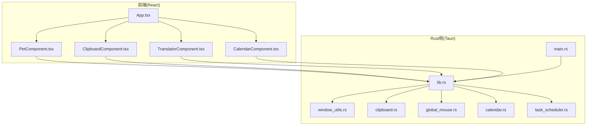
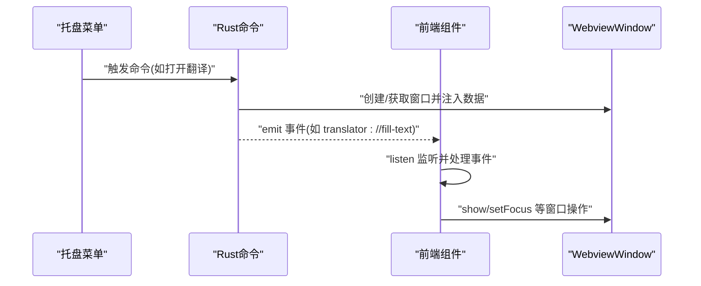
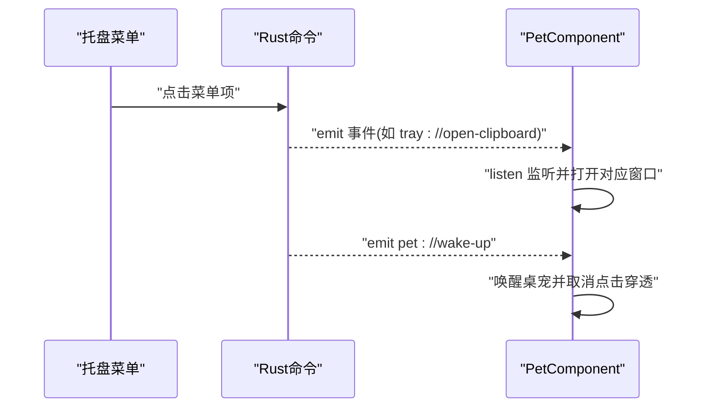
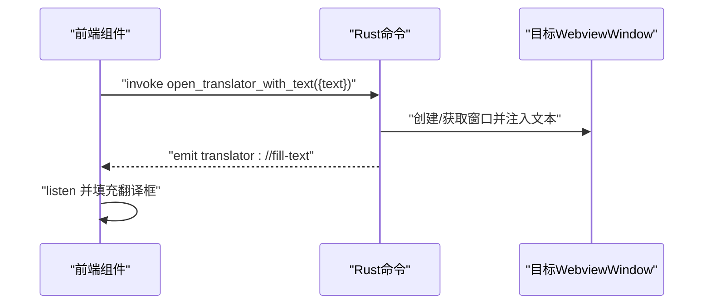
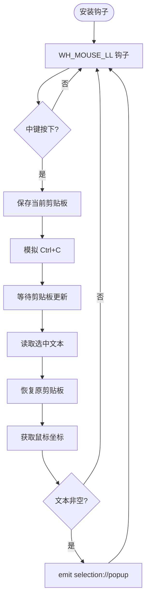
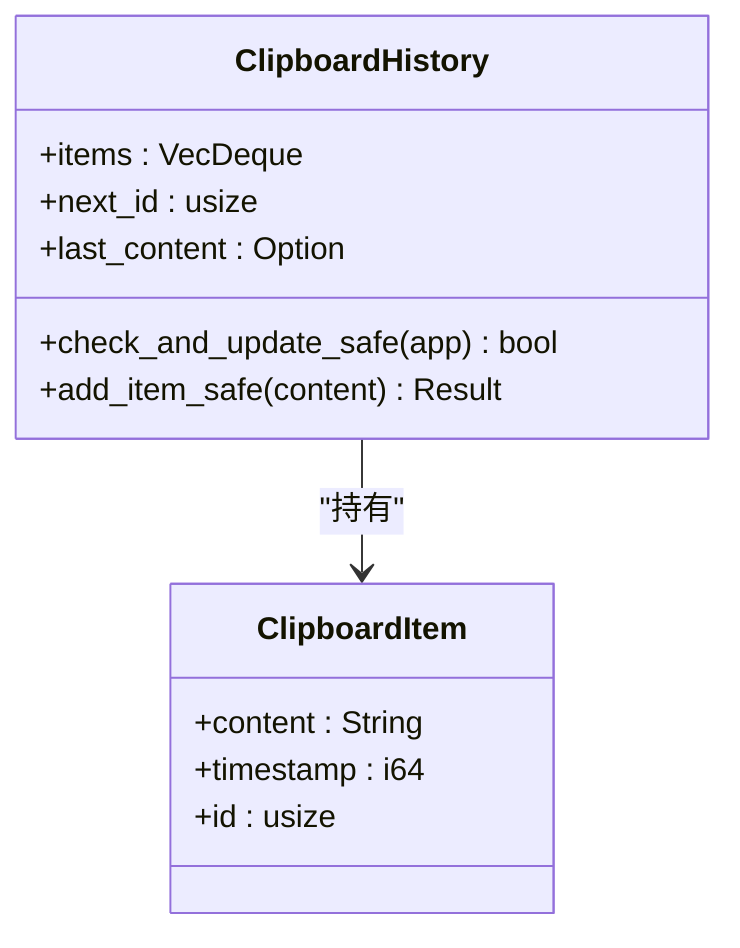
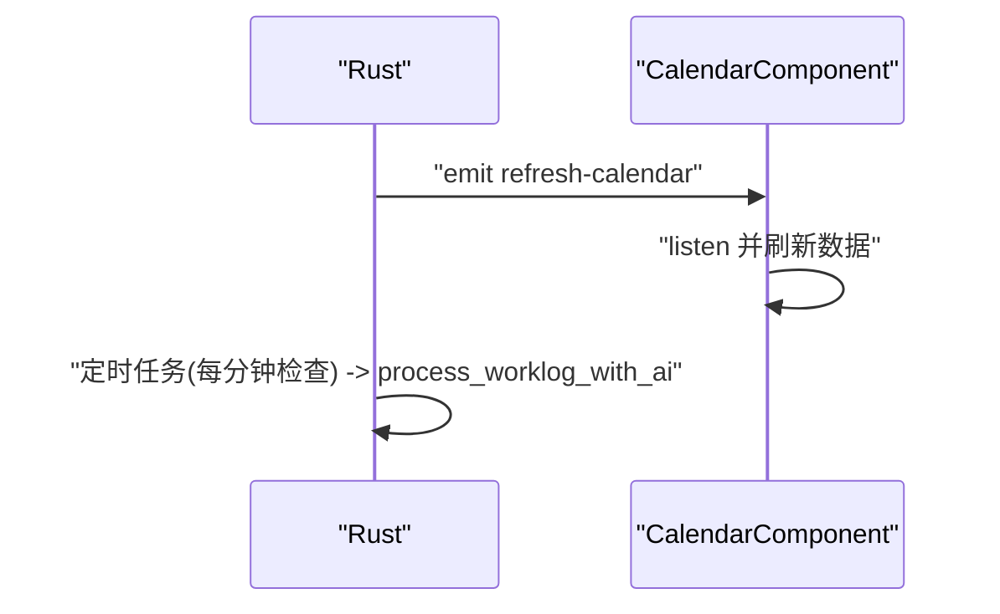
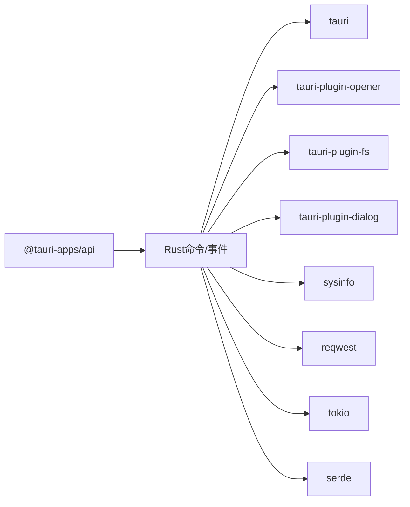

# 事件通信命令

<cite>
**本文引用的文件**
- [src-tauri/src/main.rs](file://src-tauri/src/main.rs)
- [src-tauri/src/lib.rs](file://src-tauri/src/lib.rs)
- [src-tauri/Cargo.toml](file://src-tauri/Cargo.toml)
- [src-tauri/tauri.conf.json](file://src-tauri/tauri.conf.json)
- [src/App.tsx](file://src/App.tsx)
- [src-tauri/src/window_utils.rs](file://src-tauri/src/window_utils.rs)
- [src-tauri/src/clipboard.rs](file://src-tauri/src/clipboard.rs)
- [src-tauri/src/global_mouse.rs](file://src-tauri/src/global_mouse.rs)
- [src-tauri/src/calendar.rs](file://src-tauri/src/calendar.rs)
- [src-tauri/src/task_scheduler.rs](file://src-tauri/src/task_scheduler.rs)
- [src/components/PetComponent.tsx](file://src/components/PetComponent.tsx)
- [src/components/ClipboardComponent.tsx](file://src/components/ClipboardComponent.tsx)
- [src/components/TranslatorComponent.tsx](file://src/components/TranslatorComponent.tsx)
- [src/components/CalendarComponent.tsx](file://src/components/CalendarComponent.tsx)
</cite>

## 目录
1. [简介](#简介)
2. [项目结构](#项目结构)
3. [核心组件](#核心组件)
4. [架构总览](#架构总览)
5. [详细组件分析](#详细组件分析)
6. [依赖关系分析](#依赖关系分析)
7. [性能考量](#性能考量)
8. [故障排查指南](#故障排查指南)
9. [结论](#结论)
10. [附录](#附录)

## 简介
本文档系统性梳理 xsun_desktop_pet 应用中的事件通信命令与事件驱动机制，覆盖托盘事件、窗口事件、系统事件与业务事件。重点阐述事件注册、触发与处理流程，给出事件命令类型与用途、性能特征、错误处理与安全考虑，并提供测试与调试方法及最佳实践。

## 项目结构
应用采用 Tauri v2 架构，Rust 侧提供命令与事件，前端 React 侧通过 @tauri-apps/api 的 invoke 与 listen 实现跨端通信。托盘菜单、窗口生命周期、剪贴板历史、全局鼠标钩子、日历与定时任务均通过事件与命令协同工作。

图表来源
- [src-tauri/src/main.rs:1-11](file://src-tauri/src/main.rs#L1-L11)
- [src-tauri/src/lib.rs:1-120](file://src-tauri/src/lib.rs#L1-L120)
- [src-tauri/src/window_utils.rs:1-33](file://src-tauri/src/window_utils.rs#L1-L33)
- [src-tauri/src/clipboard.rs:1-60](file://src-tauri/src/clipboard.rs#L1-L60)
- [src-tauri/src/global_mouse.rs:1-40](file://src-tauri/src/global_mouse.rs#L1-L40)
- [src-tauri/src/calendar.rs:1-40](file://src-tauri/src/calendar.rs#L1-L40)
- [src-tauri/src/task_scheduler.rs:1-40](file://src-tauri/src/task_scheduler.rs#L1-L40)
- [src/App.tsx:18-60](file://src/App.tsx#L18-L60)

章节来源
- [src-tauri/src/main.rs:1-11](file://src-tauri/src/main.rs#L1-L11)
- [src-tauri/src/lib.rs:1-120](file://src-tauri/src/lib.rs#L1-L120)
- [src-tauri/Cargo.toml:15-44](file://src-tauri/Cargo.toml#L15-L44)
- [src-tauri/tauri.conf.json:12-51](file://src-tauri/tauri.conf.json#L12-L51)
- [src/App.tsx:18-60](file://src/App.tsx#L18-L60)

## 核心组件
- Rust 命令与事件
  - 系统信息与窗口控制：get_system_info、set_click_through、wake_up_pet、open_expand_window、open_translator_with_text、open_json_compare_with_text、open_url_in_browser、refresh_calendar_data
  - 剪贴板：get_clipboard_history、add_to_clipboard_history、copy_to_clipboard、get_current_clipboard、clear_clipboard_history、manual_clipboard_check
  - 日历：get_todos_for_date、save_todos_for_date、open_todo_window、save_calendar_settings、load_calendar_settings、upload_background_image、delete_background_image
  - 翻译：send_chat_message、save_deepseek_config、load_local_deepseek_config、load_deepseek_config、save_youdao_config、load_youdao_config、youdao_translate
  - 全局鼠标钩子：init_global_mouse_hook（Windows），发射 selection://popup 事件
  - 托盘菜单：create_tray_menu（构建托盘菜单项）
- 前端事件监听与调用
  - invoke 调用 Rust 命令
  - listen 监听来自 Rust 的事件
  - WebviewWindow 发送窗口间事件（如 translator://fill-text、json://fill-text、selection://show）

章节来源
- [src-tauri/src/lib.rs:41-160](file://src-tauri/src/lib.rs#L41-L160)
- [src-tauri/src/lib.rs:162-224](file://src-tauri/src/lib.rs#L162-L224)
- [src-tauri/src/lib.rs:262-386](file://src-tauri/src/lib.rs#L262-L386)
- [src-tauri/src/lib.rs:388-552](file://src-tauri/src/lib.rs#L388-L552)
- [src-tauri/src/lib.rs:578-725](file://src-tauri/src/lib.rs#L578-L725)
- [src-tauri/src/lib.rs:778-800](file://src-tauri/src/lib.rs#L778-L800)
- [src-tauri/src/clipboard.rs:124-224](file://src-tauri/src/clipboard.rs#L124-L224)
- [src-tauri/src/global_mouse.rs:111-149](file://src-tauri/src/global_mouse.rs#L111-L149)
- [src-tauri/src/calendar.rs:578-725](file://src-tauri/src/calendar.rs#L578-L725)
- [src-tauri/src/task_scheduler.rs:82-93](file://src-tauri/src/task_scheduler.rs#L82-L93)

## 架构总览
事件驱动的总体流程：
- 前端通过 invoke 调用 Rust 命令，Rust 命令执行业务逻辑并可能向指定窗口或全局发出事件
- 前端通过 listen 订阅事件，接收来自 Rust 或其他窗口的事件并更新 UI
- 托盘菜单项触发 Rust 命令，命令再通过 emit 触发前端事件，实现窗口打开与数据注入

图表来源
- [src-tauri/src/lib.rs:115-160](file://src-tauri/src/lib.rs#L115-L160)
- [src-tauri/src/lib.rs:162-224](file://src-tauri/src/lib.rs#L162-L224)
- [src/components/TranslatorComponent.tsx:75-93](file://src/components/TranslatorComponent.tsx#L75-L93)

章节来源
- [src-tauri/src/lib.rs:115-160](file://src-tauri/src/lib.rs#L115-L160)
- [src-tauri/src/lib.rs:162-224](file://src-tauri/src/lib.rs#L162-L224)
- [src/components/TranslatorComponent.tsx:75-93](file://src/components/TranslatorComponent.tsx#L75-L93)

## 详细组件分析

### 托盘事件处理
- 托盘菜单项由 create_tray_menu 构建，包含“显示桌宠”“剪贴板”“系统信息”“AI对话”“有道翻译”“日历”“退出”等
- 前端 PetComponent 监听托盘事件，如 tray://open-clipboard、tray://open-system、tray://open-ai、tray://open-translator、tray://open-calendar、tray://open-jira
- Rust 侧 wake_up_pet 会向全局发出 pet://wake-up 事件，前端收到后唤醒桌宠

图表来源
- [src-tauri/src/lib.rs:778-800](file://src-tauri/src/lib.rs#L778-L800)
- [src/components/PetComponent.tsx:156-202](file://src/components/PetComponent.tsx#L156-L202)
- [src-tauri/src/lib.rs:52-59](file://src-tauri/src/lib.rs#L52-L59)

章节来源
- [src-tauri/src/lib.rs:778-800](file://src-tauri/src/lib.rs#L778-L800)
- [src/components/PetComponent.tsx:156-202](file://src/components/PetComponent.tsx#L156-L202)
- [src-tauri/src/lib.rs:52-59](file://src-tauri/src/lib.rs#L52-L59)

### 窗口事件通信
- 翻译窗口：通过 open_translator_with_text 创建/复用窗口；若窗口已存在，Rust 侧通过 emit 发送 translator://fill-text；前端 TranslatorComponent 监听该事件并填充文本
- JSON 比较窗口：open_json_compare_with_text 对应 json://fill-text 事件
- 扩展编辑窗口：open_expand_window 创建窗口并通过 initialization_script 注入内容
- 日历窗口：CalendarComponent 监听 refresh-calendar 事件以刷新数据；CalendarComponent 通过 emit 发送 set-todo-date 到 Todo 窗口

图表来源
- [src-tauri/src/lib.rs:115-160](file://src-tauri/src/lib.rs#L115-L160)
- [src-tauri/src/lib.rs:162-224](file://src-tauri/src/lib.rs#L162-L224)
- [src/components/TranslatorComponent.tsx:75-93](file://src/components/TranslatorComponent.tsx#L75-L93)

章节来源
- [src-tauri/src/lib.rs:115-160](file://src-tauri/src/lib.rs#L115-L160)
- [src-tauri/src/lib.rs:162-224](file://src-tauri/src/lib.rs#L162-L224)
- [src/components/TranslatorComponent.tsx:75-93](file://src/components/TranslatorComponent.tsx#L75-L93)

### 系统事件监听（全局鼠标钩子）
- Windows 平台通过 init_global_mouse_hook 安装低级鼠标钩子，捕获中键按下事件
- 读取当前剪贴板、模拟 Ctrl+C、恢复剪贴板、获取鼠标坐标，封装 SelectionPayload
- 通过 app.emit 发射 selection://popup 事件，前端 PetComponent 监听并弹出选择菜单

图表来源
- [src-tauri/src/global_mouse.rs:111-149](file://src-tauri/src/global_mouse.rs#L111-L149)
- [src-tauri/src/global_mouse.rs:30-69](file://src-tauri/src/global_mouse.rs#L30-L69)
- [src/components/PetComponent.tsx:186-200](file://src/components/PetComponent.tsx#L186-L200)

章节来源
- [src-tauri/src/global_mouse.rs:111-149](file://src-tauri/src/global_mouse.rs#L111-L149)
- [src-tauri/src/global_mouse.rs:30-69](file://src-tauri/src/global_mouse.rs#L30-L69)
- [src/components/PetComponent.tsx:186-200](file://src/components/PetComponent.tsx#L186-L200)

### 剪贴板事件与历史
- ClipboardHistory 结构体维护最多 N 条历史，避免重复内容
- 提供 get_clipboard_history、add_to_clipboard_history、copy_to_clipboard、clear_clipboard_history、manual_clipboard_check 等命令
- ClipboardComponent 通过定时轮询获取历史并展示，支持复制、展开、清空

图表来源
- [src-tauri/src/clipboard.rs:14-122](file://src-tauri/src/clipboard.rs#L14-L122)

章节来源
- [src-tauri/src/clipboard.rs:124-224](file://src-tauri/src/clipboard.rs#L124-L224)
- [src/components/ClipboardComponent.tsx:17-32](file://src/components/ClipboardComponent.tsx#L17-L32)

### 日历与定时任务
- 日历组件通过 invoke 读取/保存设置与待办，支持背景图轮播与卡片模式
- refresh_calendar_data 通过 emit 触发前端刷新
- 定时任务调度器基于 cron 表达式，按需执行 AI 工作日志处理

图表来源
- [src-tauri/src/lib.rs:778-776](file://src-tauri/src/lib.rs#L778-L776)
- [src/components/CalendarComponent.tsx:40-47](file://src/components/CalendarComponent.tsx#L40-L47)
- [src-tauri/src/task_scheduler.rs:21-61](file://src-tauri/src/task_scheduler.rs#L21-L61)

章节来源
- [src-tauri/src/lib.rs:778-776](file://src-tauri/src/lib.rs#L778-L776)
- [src/components/CalendarComponent.tsx:40-47](file://src/components/CalendarComponent.tsx#L40-L47)
- [src-tauri/src/task_scheduler.rs:21-61](file://src-tauri/src/task_scheduler.rs#L21-L61)

## 依赖关系分析
- Rust 侧依赖
  - tauri、tauri-plugin-opener、tauri-plugin-fs、tauri-plugin-dialog、sysinfo、reqwest、tokio、serde、md5、urlencoding、base64、git2、uuid、tokio-util、cron、tokio-cron-scheduler
- 前端侧依赖
  - @tauri-apps/api（invoke、listen、window、dialog、fs、opener）、@tauri-apps/plugin-xxx 插件

图表来源
- [src-tauri/Cargo.toml:15-44](file://src-tauri/Cargo.toml#L15-L44)
- [src-tauri/src/lib.rs:1-20](file://src-tauri/src/lib.rs#L1-L20)

章节来源
- [src-tauri/Cargo.toml:15-44](file://src-tauri/Cargo.toml#L15-L44)
- [src-tauri/src/lib.rs:1-20](file://src-tauri/src/lib.rs#L1-L20)

## 性能考量
- 事件处理延迟
  - 剪贴板轮询：ClipboardComponent 每 2 秒轮询一次历史，可根据需求调整频率
  - 全局鼠标钩子：Windows 低级钩子消息泵阻塞线程，注意避免长时间阻塞操作
  - 翻译/网络请求：youdao_translate、send_chat_message 为异步网络调用，建议增加超时与重试策略
- 内存占用
  - ClipboardHistory 限制最大历史条数，避免无限增长
  - 日历背景图轮播使用索引切换，避免频繁加载大图
- 并发与锁
  - ClipboardHistory 使用 Mutex 保护共享状态，注意避免死锁与长时间持锁

章节来源
- [src/components/ClipboardComponent.tsx:17-21](file://src/components/ClipboardComponent.tsx#L17-L21)
- [src-tauri/src/clipboard.rs:29-82](file://src-tauri/src/clipboard.rs#L29-L82)
- [src-tauri/src/global_mouse.rs:118-147](file://src-tauri/src/global_mouse.rs#L118-L147)

## 故障排查指南
- 事件未触发
  - 确认前端已正确调用 listen 并在组件卸载时调用 unlisten
  - 检查 Rust emit 的事件名与前端监听一致
- 窗口创建失败
  - 检查 WebviewWindowBuilder 参数与 tauri.conf.json 中的窗口配置
  - 关注 tauri://error 事件，定位创建失败原因
- 剪贴板异常
  - 检查内容长度限制与空内容校验
  - Windows 平台注意剪贴板访问权限与并发写入
- 翻译失败
  - 核对有道/DeepSeek 配置是否正确加载
  - 检查网络连通性与超时设置
- 定时任务未执行
  - 检查 cron 表达式与调度器启动状态
  - 查看调度器日志输出

章节来源
- [src/components/PetComponent.tsx:191-202](file://src/components/PetComponent.tsx#L191-L202)
- [src-tauri/src/lib.rs:115-160](file://src-tauri/src/lib.rs#L115-L160)
- [src-tauri/src/clipboard.rs:145-171](file://src-tauri/src/clipboard.rs#L145-L171)
- [src-tauri/src/lib.rs:388-552](file://src-tauri/src/lib.rs#L388-L552)
- [src-tauri/src/task_scheduler.rs:82-93](file://src-tauri/src/task_scheduler.rs#L82-L93)

## 结论
本应用通过 Rust 命令与前端事件监听形成清晰的事件驱动架构：托盘菜单、全局鼠标钩子、窗口间事件与定时任务共同构成丰富的交互体验。建议在生产环境中进一步完善错误处理、事件过滤与权限控制，并优化高频事件的性能与内存占用。

## 附录

### 事件命令类型与用途
- 托盘事件
  - 事件名：tray://open-clipboard、tray://open-system、tray://open-ai、tray://open-translator、tray://open-calendar、tray://open-jira
  - 用途：打开对应功能窗口
- 桌宠事件
  - 事件名：pet://wake-up
  - 用途：唤醒桌宠并取消点击穿透
- 翻译窗口事件
  - 事件名：translator://fill-text
  - 用途：向已有翻译窗口注入初始文本
- JSON 比较窗口事件
  - 事件名：json://fill-text
  - 用途：向 JSON 比较窗口注入初始文本
- 选中文本事件
  - 事件名：selection://popup
  - 用途：传递选中文本与鼠标坐标，弹出快捷菜单
- 日历刷新事件
  - 事件名：refresh-calendar
  - 用途：刷新日历数据
- 选中文本快捷菜单事件
  - 事件名：selection://show
  - 用途：向 selection-menu 窗口发送选中文本数据

章节来源
- [src-tauri/src/lib.rs:778-800](file://src-tauri/src/lib.rs#L778-L800)
- [src-tauri/src/lib.rs:52-59](file://src-tauri/src/lib.rs#L52-L59)
- [src-tauri/src/lib.rs:115-160](file://src-tauri/src/lib.rs#L115-L160)
- [src-tauri/src/lib.rs:162-224](file://src-tauri/src/lib.rs#L162-L224)
- [src-tauri/src/global_mouse.rs:60-68](file://src-tauri/src/global_mouse.rs#L60-L68)
- [src-tauri/src/lib.rs:778-776](file://src-tauri/src/lib.rs#L778-L776)
- [src-tauri/src/lib.rs:162-224](file://src-tauri/src/lib.rs#L162-L224)

### 测试方法与调试技巧
- 事件监听测试
  - 在前端组件中打印监听到的事件与 payload，确认事件名与数据结构
- 命令调用测试
  - 使用 @tauri-apps/cli 的 tauri dev 启动开发环境，结合浏览器调试器观察 invoke 调用链
- 窗口事件测试
  - 通过 open_*_with_text 创建窗口并验证 emit 是否生效
- 剪贴板测试
  - 使用 manual_clipboard_check 验证去重与长度限制逻辑
- 翻译测试
  - 逐步检查配置加载、签名生成、网络请求与响应解析
- 定时任务测试
  - 调整 cron 表达式为更短周期，观察调度器日志输出

章节来源
- [src-tauri/src/lib.rs:226-386](file://src-tauri/src/lib.rs#L226-L386)
- [src-tauri/src/clipboard.rs:227-250](file://src-tauri/src/clipboard.rs#L227-L250)
- [src-tauri/src/task_scheduler.rs:21-61](file://src-tauri/src/task_scheduler.rs#L21-L61)

### 安全考虑
- 事件过滤与权限控制
  - 仅允许受信任的窗口标签与事件通道进行通信
  - 对外部注入的数据进行严格校验（长度、格式、字符集）
- 网络请求安全
  - 使用 HTTPS 与证书校验，避免明文传输
  - 对第三方 API 密钥进行本地加密存储与最小暴露
- 系统事件安全
  - 全局鼠标钩子仅在 Windows 平台启用，注意权限与兼容性
  - 避免在钩子回调中执行耗时操作，防止系统卡顿

章节来源
- [src-tauri/src/lib.rs:212-224](file://src-tauri/src/lib.rs#L212-L224)
- [src-tauri/src/global_mouse.rs:111-149](file://src-tauri/src/global_mouse.rs#L111-L149)
- [src-tauri/Cargo.toml:15-44](file://src-tauri/Cargo.toml#L15-L44)