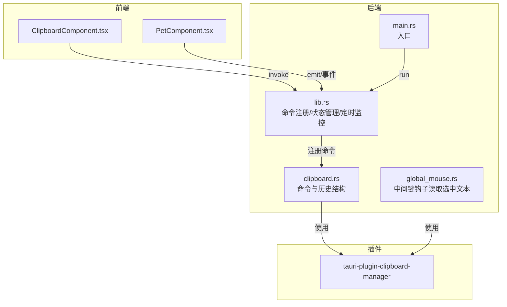
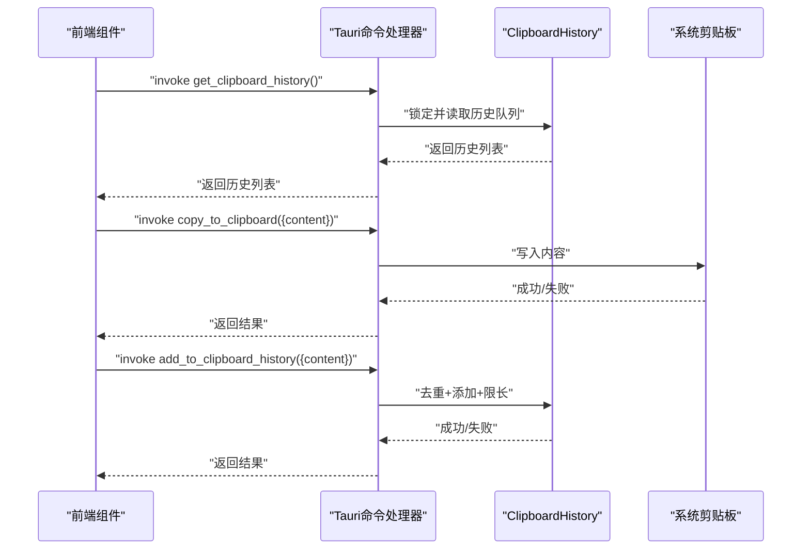
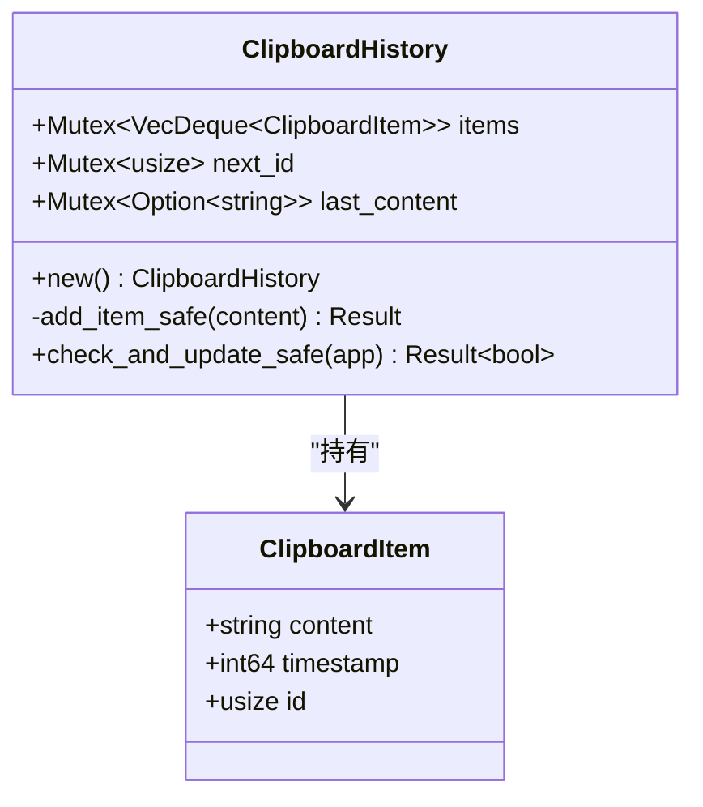
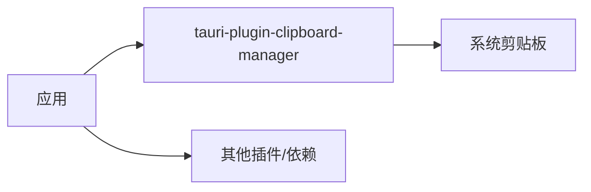

# 剪贴板命令

<cite>
**本文引用的文件列表**
- [clipboard.rs](file://src-tauri/src/clipboard.rs)
- [lib.rs](file://src-tauri/src/lib.rs)
- [Cargo.toml](file://src-tauri/Cargo.toml)
- [ClipboardComponent.tsx](file://src/components/ClipboardComponent.tsx)
- [PetComponent.tsx](file://src/components/PetComponent.tsx)
- [global_mouse.rs](file://src-tauri/src/global_mouse.rs)
- [main.rs](file://src-tauri/src/main.rs)
</cite>

## 目录
1. [简介](#简介)
2. [项目结构](#项目结构)
3. [核心组件](#核心组件)
4. [架构总览](#架构总览)
5. [详细组件分析](#详细组件分析)
6. [依赖关系分析](#依赖关系分析)
7. [性能考量](#性能考量)
8. [故障排查指南](#故障排查指南)
9. [结论](#结论)
10. [附录](#附录)

## 简介
本文件面向开发者与使用者，系统性梳理本项目中的剪贴板命令API，覆盖以下命令：
- add_to_clipboard_history：手动将内容加入剪贴板历史
- clear_clipboard_history：清空剪贴板历史
- copy_to_clipboard：复制内容到系统剪贴板
- get_clipboard_history：获取剪贴板历史列表
- get_current_clipboard：读取当前系统剪贴板内容
- manual_clipboard_check：手动触发一次剪贴板检查

同时，文档解释各命令的功能、参数、返回值、数据结构、性能特征、错误处理、安全考虑、测试与调试方法，并给出最佳实践与完整调用路径参考。

## 项目结构
剪贴板功能主要分布在 Rust 后端与 React 前端两部分：
- 后端（Tauri）：在 src-tauri/src/clipboard.rs 中实现剪贴板历史与命令；在 src-tauri/src/lib.rs 中注册命令与状态；通过 tauri-plugin-clipboard-manager 访问系统剪贴板。
- 前端（React）：在 src/components/ClipboardComponent.tsx 中展示历史、复制内容、清空历史；在 src/components/PetComponent.tsx 中通过托盘菜单打开剪贴板窗口。

图表来源
- [clipboard.rs:1-251](file://src-tauri/src/clipboard.rs#L1-L251)
- [lib.rs:948-1000](file://src-tauri/src/lib.rs#L948-L1000)
- [main.rs:1-11](file://src-tauri/src/main.rs#L1-L11)
- [global_mouse.rs:1-88](file://src-tauri/src/global_mouse.rs#L1-L88)

章节来源
- [clipboard.rs:1-251](file://src-tauri/src/clipboard.rs#L1-L251)
- [lib.rs:948-1000](file://src-tauri/src/lib.rs#L948-L1000)
- [Cargo.toml:15-36](file://src-tauri/Cargo.toml#L15-L36)

## 核心组件
- 数据结构
  - ClipboardItem：单条剪贴板历史项，包含内容、时间戳、自增ID。
  - ClipboardHistory：维护固定大小的历史队列、下一个ID、上次内容缓存。
- 命令集合
  - get_clipboard_history：返回历史列表
  - add_to_clipboard_history：手动添加历史
  - copy_to_clipboard：写入系统剪贴板
  - get_current_clipboard：读取系统剪贴板
  - clear_clipboard_history：清空历史
  - manual_clipboard_check：手动检查并更新历史

章节来源
- [clipboard.rs:7-122](file://src-tauri/src/clipboard.rs#L7-L122)
- [clipboard.rs:124-224](file://src-tauri/src/clipboard.rs#L124-L224)

## 架构总览
剪贴板命令通过 Tauri 的 invoke_handler 注册，前端以 invoke 调用；系统剪贴板通过 tauri-plugin-clipboard-manager 提供。后台还运行一个定时任务，周期性检查系统剪贴板变化并自动更新历史。

图表来源
- [lib.rs:948-1000](file://src-tauri/src/lib.rs#L948-L1000)
- [clipboard.rs:124-224](file://src-tauri/src/clipboard.rs#L124-L224)

## 详细组件分析

### 数据结构
- ClipboardItem
  - 字段：content（字符串）、timestamp（秒级时间戳）、id（usize）
  - 序列化/反序列化支持，便于跨线程传递
- ClipboardHistory
  - 字段：items（VecDeque<ClipboardItem>，带互斥锁）、next_id（usize，带互斥锁）、last_content（Option<String>，带互斥锁）
  - 方法：new、add_item_safe（去重、限长、分配ID）、check_and_update_safe（与上次内容比较并更新）

图表来源
- [clipboard.rs:7-122](file://src-tauri/src/clipboard.rs#L7-L122)

章节来源
- [clipboard.rs:7-122](file://src-tauri/src/clipboard.rs#L7-L122)

### 命令定义与行为

- get_clipboard_history
  - 参数：无
  - 返回：历史列表（Vec<ClipboardItem>）
  - 行为：锁定历史队列，克隆迭代器为向量返回
  - 复杂度：O(n)，n为历史数量
  - 线程安全：通过 Mutex 保护
  - 章节来源
    - [clipboard.rs:124-134](file://src-tauri/src/clipboard.rs#L124-L134)

- add_to_clipboard_history
  - 参数：content（字符串）
  - 返回：无（Result<(), String>）
  - 行为：校验非空与长度上限，去重后添加到队列前端，保持最多5条
  - 线程安全：通过 Mutex 保护
  - 章节来源
    - [clipboard.rs:136-158](file://src-tauri/src/clipboard.rs#L136-L158)

- copy_to_clipboard
  - 参数：content（字符串）
  - 返回：无（Result<(), String>）
  - 行为：校验非空与长度上限，写入系统剪贴板
  - 线程安全：通过 AppHandle 访问系统剪贴板
  - 章节来源
    - [clipboard.rs:160-185](file://src-tauri/src/clipboard.rs#L160-L185)

- get_current_clipboard
  - 参数：无
  - 返回：当前剪贴板内容（Result<String, String>）
  - 行为：读取系统剪贴板文本
  - 章节来源
    - [clipboard.rs:187-191](file://src-tauri/src/clipboard.rs#L187-L191)

- clear_clipboard_history
  - 参数：无
  - 返回：无（Result<(), String>）
  - 行为：清空历史队列、重置ID、清空上次内容缓存
  - 线程安全：通过 Mutex 保护
  - 章节来源
    - [clipboard.rs:193-212](file://src-tauri/src/clipboard.rs#L193-L212)

- manual_clipboard_check
  - 参数：无
  - 返回：字符串（Result<String, String>），包含“发现并添加新内容”、“无新内容”或“检查失败: ...”
  - 行为：调用 check_and_update_safe，根据结果返回提示
  - 章节来源
    - [clipboard.rs:214-224](file://src-tauri/src/clipboard.rs#L214-L224)

- 辅助命令（仅用于测试）
  - test_add_multiple_items：批量添加测试项，验证并发安全性
  - 章节来源
    - [clipboard.rs:226-250](file://src-tauri/src/clipboard.rs#L226-L250)

### 命令注册与生命周期
- 命令注册：在 lib.rs 的 invoke_handler 中统一注册上述命令
- 状态管理：ClipboardHistory 作为全局状态被管理
- 定时监控：后台异步任务每5秒检查一次系统剪贴板，自动更新历史
- 章节来源
  - [lib.rs:948-1000](file://src-tauri/src/lib.rs#L948-L1000)
  - [lib.rs:1070-1110](file://src-tauri/src/lib.rs#L1070-L1110)

### 前端集成
- ClipboardComponent.tsx
  - 定时轮询 get_clipboard_history
  - 调用 copy_to_clipboard 实现复制
  - 调用 clear_clipboard_history 清空历史
  - 章节来源
    - [ClipboardComponent.tsx:17-32](file://src/components/ClipboardComponent.tsx#L17-L32)
    - [ClipboardComponent.tsx:34-44](file://src/components/ClipboardComponent.tsx#L34-L44)
    - [ClipboardComponent.tsx:54-61](file://src/components/ClipboardComponent.tsx#L54-L61)

- PetComponent.tsx
  - 通过托盘菜单事件触发剪贴板窗口打开
  - 章节来源
    - [PetComponent.tsx:295-336](file://src/components/PetComponent.tsx#L295-L336)

### 系统剪贴板访问与中间键钩子
- global_mouse.rs
  - 使用 Windows 钩子捕获中键点击
  - 临时保存当前剪贴板内容，模拟 Ctrl+C，读取选中文本，恢复原剪贴板
  - 通过 tauri-plugin-clipboard-manager 访问系统剪贴板
  - 章节来源
    - [global_mouse.rs:39-69](file://src-tauri/src/global_mouse.rs#L39-L69)

## 依赖关系分析
- 插件依赖
  - tauri-plugin-clipboard-manager：提供系统剪贴板读写能力
  - tauri-plugin-opener/fs/dialog：其他功能所需
- 编译依赖
  - tauri = "2"，serde、tokio、windows（Windows平台）
- 章节来源
  - [Cargo.toml:15-44](file://src-tauri/Cargo.toml#L15-L44)

图表来源
- [Cargo.toml:15-44](file://src-tauri/Cargo.toml#L15-L44)

## 性能考量
- 时间复杂度
  - get_clipboard_history：O(n)，n为历史数量
  - add_to_clipboard_history：O(1)，队列首部插入并限长
  - copy_to_clipboard：O(1)，系统调用
  - clear_clipboard_history：O(1)，清空并重置
- 内存使用
  - 历史队列固定容量为5，避免无限增长
  - 单条内容按字符串存储，前端计算 Blob 大小用于展示
- 定时监控
  - 后台每5秒检查一次，连续错误超过阈值会暂停一段时间，降低系统压力
- 章节来源
  - [clipboard.rs:59-71](file://src-tauri/src/clipboard.rs#L59-L71)
  - [lib.rs:1074-1110](file://src-tauri/src/lib.rs#L1074-L1110)
  - [ClipboardComponent.tsx:93-98](file://src/components/ClipboardComponent.tsx#L93-L98)

## 故障排查指南
- 常见错误与处理
  - “内容不能为空”：输入为空导致校验失败
  - “内容过长”：超过长度限制（手动添加与复制均有限制）
  - “读取剪贴板失败/复制失败”：系统剪贴板访问异常或权限不足
  - “获取历史记录失败/获取items锁失败/获取next_id锁失败/获取last_content锁失败”：并发访问互斥锁失败
  - “剪贴板内容过长”：系统剪贴板读取时发现超长内容
  - 连续错误过多：后台监控任务会暂停一段时间以保护系统
- 调试建议
  - 查看控制台输出（命令内部 println）
  - 使用 manual_clipboard_check 触发一次检查并观察返回
  - 使用 test_add_multiple_items 验证并发安全性
  - 检查系统剪贴板可用性与权限
- 章节来源
  - [clipboard.rs:141-147](file://src-tauri/src/clipboard.rs#L141-L147)
  - [clipboard.rs:165-171](file://src-tauri/src/clipboard.rs#L165-L171)
  - [clipboard.rs:86-95](file://src-tauri/src/clipboard.rs#L86-L95)
  - [clipboard.rs:31-36](file://src-tauri/src/clipboard.rs#L31-L36)
  - [clipboard.rs:1093-1107](file://src-tauri/src/clipboard.rs#L1093-L1107)
  - [clipboard.rs:226-250](file://src-tauri/src/clipboard.rs#L226-L250)

## 结论
本项目的剪贴板命令设计简洁、线程安全，通过固定容量的历史队列与互斥锁保证并发安全；结合后台定时监控与手动检查，既能自动捕获剪贴板变化，也支持手动干预。前端组件通过 invoke 与命令交互，实现历史展示、复制与清空等功能。建议在生产环境中关注系统剪贴板权限与超长内容处理，并合理设置轮询频率以平衡实时性与性能。

## 附录

### 命令一览与使用要点
- get_clipboard_history
  - 用途：获取历史列表
  - 参数：无
  - 返回：历史数组
  - 最佳实践：前端定时轮询，避免频繁调用
  - 章节来源
    - [clipboard.rs:124-134](file://src-tauri/src/clipboard.rs#L124-L134)
    - [ClipboardComponent.tsx:23-32](file://src/components/ClipboardComponent.tsx#L23-L32)

- add_to_clipboard_history
  - 用途：手动添加历史
  - 参数：content（字符串）
  - 返回：无
  - 最佳实践：避免重复内容，注意长度限制
  - 章节来源
    - [clipboard.rs:136-158](file://src-tauri/src/clipboard.rs#L136-L158)

- copy_to_clipboard
  - 用途：复制内容到系统剪贴板
  - 参数：content（字符串）
  - 返回：无
  - 最佳实践：确保内容非空且长度合理
  - 章节来源
    - [clipboard.rs:160-185](file://src-tauri/src/clipboard.rs#L160-L185)
    - [ClipboardComponent.tsx:34-44](file://src/components/ClipboardComponent.tsx#L34-L44)

- get_current_clipboard
  - 用途：读取当前系统剪贴板内容
  - 参数：无
  - 返回：字符串
  - 最佳实践：注意长度限制与空内容判断
  - 章节来源
    - [clipboard.rs:187-191](file://src-tauri/src/clipboard.rs#L187-L191)

- clear_clipboard_history
  - 用途：清空历史
  - 参数：无
  - 返回：无
  - 最佳实践：清空后前端应刷新视图
  - 章节来源
    - [clipboard.rs:193-212](file://src-tauri/src/clipboard.rs#L193-L212)
    - [ClipboardComponent.tsx:54-61](file://src/components/ClipboardComponent.tsx#L54-L61)

- manual_clipboard_check
  - 用途：手动触发一次检查
  - 参数：无
  - 返回：字符串提示
  - 最佳实践：用于调试与确认系统剪贴板可用性
  - 章节来源
    - [clipboard.rs:214-224](file://src-tauri/src/clipboard.rs#L214-L224)

### 测试与调试方法
- 使用 test_add_multiple_items 进行批量添加测试，验证并发与限长逻辑
- 使用 manual_clipboard_check 观察返回值，确认系统剪贴板访问正常
- 在前端组件中增加错误提示与重试逻辑
- 章节来源
  - [clipboard.rs:226-250](file://src-tauri/src/clipboard.rs#L226-L250)

### 安全考虑
- 敏感数据保护
  - 历史内容以字符串形式存储，建议避免存储敏感信息
  - 前端展示时可截断显示，避免泄露
- 权限与系统剪贴板
  - 确保应用具备系统剪贴板访问权限
  - 对异常进行捕获与降级处理
- 跨进程通信
  - 通过 Tauri 的 invoke 与状态管理，避免直接共享内存
- 章节来源
  - [clipboard.rs:70-76](file://src-tauri/src/clipboard.rs#L70-L76)
  - [lib.rs:948-1000](file://src-tauri/src/lib.rs#L948-L1000)