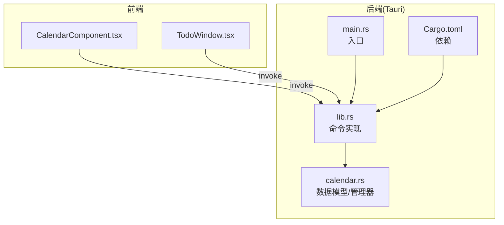
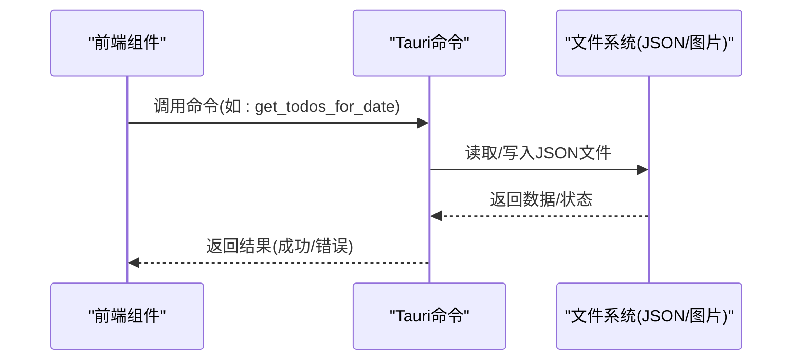
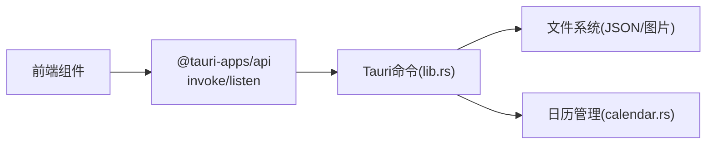

# 日历管理命令

<cite>
**本文引用的文件列表**
- [calendar.rs](file://src-tauri/src/calendar.rs)
- [lib.rs](file://src-tauri/src/lib.rs)
- [Cargo.toml](file://src-tauri/Cargo.toml)
- [CalendarComponent.tsx](file://src/components/CalendarComponent.tsx)
- [TodoWindow.tsx](file://src/components/TodoWindow.tsx)
- [main.rs](file://src-tauri/src/main.rs)
</cite>

## 目录
1. [简介](#简介)
2. [项目结构](#项目结构)
3. [核心组件](#核心组件)
4. [架构总览](#架构总览)
5. [详细组件分析](#详细组件分析)
6. [依赖关系分析](#依赖关系分析)
7. [性能考量](#性能考量)
8. [故障排查指南](#故障排查指南)
9. [结论](#结论)
10. [附录](#附录)

## 简介
本文件面向日历管理命令API，系统性梳理与说明以下Tauri命令：
- get_todos_for_date：按日期查询待办清单
- save_todos_for_date：按日期保存待办清单
- save_calendar_settings：保存日历设置
- load_calendar_settings：加载日历设置
- upload_background_image：上传背景图片
- delete_background_image：删除背景图片
- refresh_calendar_data：触发日历数据刷新

文档涵盖命令功能、参数与返回值、数据持久化机制、性能特征、错误处理、安全考虑、测试与调试方法，并给出最佳实践建议与参考实现路径。

## 项目结构
日历相关逻辑主要分布在Rust后端与React前端两部分：
- 后端（Tauri）：命令实现位于 src-tauri/src/lib.rs；通用日历数据结构与管理器位于 src-tauri/src/calendar.rs；构建配置在 src-tauri/Cargo.toml；入口在 src-tauri/src/main.rs
- 前端（React）：日历界面与交互位于 src/components/CalendarComponent.tsx；待办窗口位于 src/components/TodoWindow.tsx

图表来源
- [lib.rs:578-776](file://src-tauri/src/lib.rs#L578-L776)
- [calendar.rs:1-363](file://src-tauri/src/calendar.rs#L1-L363)
- [main.rs:1-11](file://src-tauri/src/main.rs#L1-L11)
- [Cargo.toml:1-44](file://src-tauri/Cargo.toml#L1-L44)

章节来源
- [lib.rs:1-1120](file://src-tauri/src/lib.rs#L1-L1120)
- [calendar.rs:1-363](file://src-tauri/src/calendar.rs#L1-L363)
- [main.rs:1-11](file://src-tauri/src/main.rs#L1-L11)
- [Cargo.toml:1-44](file://src-tauri/Cargo.toml#L1-L44)

## 核心组件
- 数据模型
  - TodoItem：待办项，包含id、content、completed、created_at等字段
  - CalendarSettings：日历设置，包含背景图数组、轮播间隔、主题、节日/农历显示开关、默认视图等
  - CalendarEvent：日历事件，包含id、title、description、时间范围、全天标记、颜色等
  - DayData：某日聚合数据，包含date、todos、events、notes
- 管理器
  - CalendarManager：封装文件系统读写、JSON序列化、目录创建、数据清理等能力

章节来源
- [calendar.rs:5-81](file://src-tauri/src/calendar.rs#L5-L81)
- [calendar.rs:83-363](file://src-tauri/src/calendar.rs#L83-L363)

## 架构总览
日历命令采用“前端调用Tauri命令—后端执行文件I/O—返回结果”的典型架构。前端通过 @tauri-apps/api 的 invoke 调用后端命令，后端命令负责：
- 解析应用数据目录
- 读取/写入JSON文件（todos.json、events.json、calendar_settings.json）
- 处理图片上传/删除（background_images目录）
- 触发前端刷新事件

图表来源
- [lib.rs:578-776](file://src-tauri/src/lib.rs#L578-L776)
- [calendar.rs:98-141](file://src-tauri/src/calendar.rs#L98-L141)

## 详细组件分析

### 命令：get_todos_for_date
- 功能：按指定日期从应用数据目录读取todos.json，返回该日期对应的待办列表
- 参数
  - app: AppHandle（用于解析应用数据目录）
  - date: String（日期字符串，格式通常为YYYY-MM-DD）
- 返回值
  - 成功：Vec<TodoItem>
  - 失败：String（错误信息）
- 实现要点
  - 解析应用数据目录
  - 若文件不存在则返回空列表
  - 读取JSON并反序列化为HashMap<Date, Vec<TodoItem>>
  - 取出目标日期条目，若无则返回空列表
- 前端使用
  - CalendarComponent.tsx 中监听 refresh-calendar 事件并触发刷新
  - TodoWindow.tsx 中通过 invoke 调用该命令加载待办

章节来源
- [lib.rs:578-599](file://src-tauri/src/lib.rs#L578-L599)
- [CalendarComponent.tsx:40-47](file://src/components/CalendarComponent.tsx#L40-L47)
- [TodoWindow.tsx:44-60](file://src/components/TodoWindow.tsx#L44-L60)

### 命令：save_todos_for_date
- 功能：按指定日期保存待办列表到todos.json
- 参数
  - app: AppHandle
  - date: String（日期）
  - todos: Vec<TodoItem>（待保存的待办列表）
- 返回值
  - 成功：()（空）
  - 失败：String（错误信息）
- 实现要点
  - 确保应用数据目录存在
  - 读取现有todos.json（若不存在则初始化空映射）
  - 将传入的todos覆盖写入对应日期键
  - 序列化为美化JSON并写回文件
- 前端使用
  - TodoWindow.tsx 中保存完成后调用 refresh_calendar_data 刷新日历

章节来源
- [lib.rs:602-638](file://src-tauri/src/lib.rs#L602-L638)
- [TodoWindow.tsx:62-70](file://src/components/TodoWindow.tsx#L62-L70)

### 命令：save_calendar_settings
- 功能：保存日历设置到calendar_settings.json
- 参数
  - app: AppHandle
  - settings: CalendarSettings（前端传递的设置对象）
- 返回值
  - 成功：()（空）
  - 失败：String（错误信息）
- 实现要点
  - 确保应用数据目录存在
  - 写入calendar_settings.json（美化序列化）

章节来源
- [lib.rs:679-699](file://src-tauri/src/lib.rs#L679-L699)
- [CalendarComponent.tsx:73-77](file://src/components/CalendarComponent.tsx#L73-L77)

### 命令：load_calendar_settings
- 功能：从calendar_settings.json加载日历设置
- 参数
  - app: AppHandle
- 返回值
  - 成功：CalendarSettings（若文件不存在则返回默认设置）
  - 失败：String（错误信息）
- 实现要点
  - 若文件不存在，返回默认CalendarSettings（含默认背景图、轮播间隔等）

章节来源
- [lib.rs:702-725](file://src-tauri/src/lib.rs#L702-L725)
- [CalendarComponent.tsx:63-71](file://src/components/CalendarComponent.tsx#L63-L71)

### 命令：upload_background_image
- 功能：将图片字节流写入应用数据目录的background_images子目录，并返回相对路径
- 参数
  - app: AppHandle
  - image_data: Vec<u8>（图片字节）
  - filename: String（文件名）
- 返回值
  - 成功：String（相对路径，如“background_images/xxx.jpg”）
  - 失败：String（错误信息）
- 实现要点
  - 确保background_images目录存在
  - 写入文件并返回相对路径

章节来源
- [lib.rs:728-750](file://src-tauri/src/lib.rs#L728-L750)
- [CalendarComponent.tsx:530-531](file://src/components/CalendarComponent.tsx#L530-L531)

### 命令：delete_background_image
- 功能：删除指定的背景图片文件
- 参数
  - app: AppHandle
  - image_path: String（完整文件路径，如“background_images/xxx.jpg”）
- 返回值
  - 成功：()（空）
  - 失败：String（错误信息）
- 实现要点
  - 检查文件是否存在，存在则删除

章节来源
- [lib.rs:752-768](file://src-tauri/src/lib.rs#L752-L768)
- [CalendarComponent.tsx:526-527](file://src/components/CalendarComponent.tsx#L526-L527)

### 命令：refresh_calendar_data
- 功能：向名为“calendar”的窗口广播刷新事件，触发前端重新加载数据
- 参数
  - app: AppHandle
- 返回值
  - 成功：()（空）
  - 失败：String（错误信息）
- 实现要点
  - 通过 emit 发送“refresh-calendar”事件

章节来源
- [lib.rs:770-776](file://src-tauri/src/lib.rs#L770-L776)
- [CalendarComponent.tsx:41-43](file://src/components/CalendarComponent.tsx#L41-L43)
- [TodoWindow.tsx](file://src/components/TodoWindow.tsx#L66)

## 依赖关系分析
- 前端依赖
  - @tauri-apps/api：invoke、window、event
  - tauri-plugin-fs、tauri-plugin-dialog：文件选择与对话框
- 后端依赖
  - tauri、serde、serde_json、tokio、chrono：命令、序列化、异步文件系统、日期
  - 其他插件：opener、clipboard-manager等（与日历命令无关）

图表来源
- [lib.rs:578-776](file://src-tauri/src/lib.rs#L578-L776)
- [calendar.rs:1-363](file://src-tauri/src/calendar.rs#L1-L363)
- [Cargo.toml:15-35](file://src-tauri/Cargo.toml#L15-L35)

章节来源
- [Cargo.toml:15-35](file://src-tauri/Cargo.toml#L15-L35)

## 性能考量
- 文件I/O
  - 读写JSON文件均为异步操作，避免阻塞UI线程
  - todos.json与events.json采用“日期→列表”的映射结构，便于按日期快速检索
- 序列化
  - 使用美化序列化（pretty）以提升可读性，但会增加文件体积；对频繁写入场景可权衡是否使用紧凑格式
- 图片处理
  - 上传图片为直接写入字节流，未做压缩或校验，建议前端进行尺寸/格式限制
- 数据清理
  - 提供清理旧数据的接口（cleanup_old_data），可用于定期清理历史数据，减少文件膨胀

章节来源
- [calendar.rs:324-361](file://src-tauri/src/calendar.rs#L324-L361)
- [lib.rs:602-638](file://src-tauri/src/lib.rs#L602-L638)

## 故障排查指南
- 常见错误类型
  - 文件读取失败：检查应用数据目录权限与路径
  - JSON解析失败：确认文件格式正确且字段匹配
  - 图片写入失败：检查background_images目录权限与磁盘空间
- 错误处理策略
  - 命令内部统一使用Result包装，错误信息以String形式返回
  - 对于不存在的文件，命令会返回默认值或空集合，避免崩溃
- 调试技巧
  - 前端：在控制台查看invoke调用返回的错误信息
  - 后端：在日志中输出关键步骤（路径、文件存在性、序列化结果）
  - 验证：手动检查应用数据目录中的JSON与图片文件是否更新

章节来源
- [lib.rs:578-776](file://src-tauri/src/lib.rs#L578-L776)
- [calendar.rs:98-141](file://src-tauri/src/calendar.rs#L98-L141)

## 结论
日历管理命令围绕“按日期待办/事件”和“日历设置与背景图片”两大主题，采用简洁的JSON文件存储与Tauri命令桥接，具备良好的扩展性与易用性。建议在生产环境中加强输入校验、图片预处理与数据清理策略，以进一步提升稳定性与性能。

## 附录

### 命令一览与最佳实践
- get_todos_for_date
  - 最佳实践：前端应在渲染前对completed与created_at排序；对空列表返回进行UI提示
  - 参考实现路径：[lib.rs:578-599](file://src-tauri/src/lib.rs#L578-L599)，[TodoWindow.tsx:44-60](file://src/components/TodoWindow.tsx#L44-L60)
- save_todos_for_date
  - 最佳实践：保存前进行去重与合法性校验；保存后立即调用refresh_calendar_data
  - 参考实现路径：[lib.rs:602-638](file://src-tauri/src/lib.rs#L602-L638)，[TodoWindow.tsx:62-70](file://src/components/TodoWindow.tsx#L62-L70)
- save_calendar_settings/load_calendar_settings
  - 最佳实践：设置变更后立即保存；加载失败时回退到默认值
  - 参考实现路径：[lib.rs:679-725](file://src-tauri/src/lib.rs#L679-L725)，[CalendarComponent.tsx:63-77](file://src/components/CalendarComponent.tsx#L63-L77)
- upload_background_image/delete_background_image
  - 最佳实践：上传前校验文件大小与格式；删除前确认文件存在
  - 参考实现路径：[lib.rs:728-768](file://src-tauri/src/lib.rs#L728-L768)，[CalendarComponent.tsx:520-531](file://src/components/CalendarComponent.tsx#L520-L531)
- refresh_calendar_data
  - 最佳实践：在关键数据变更后统一触发刷新事件
  - 参考实现路径：[lib.rs:770-776](file://src-tauri/src/lib.rs#L770-L776)，[CalendarComponent.tsx:41-43](file://src/components/CalendarComponent.tsx#L41-L43)

### 数据持久化机制
- 文件位置
  - 应用数据目录下：todos.json、events.json、calendar_settings.json、background_images/
- 存储格式
  - JSON：结构清晰，便于跨语言读取与调试
- 同步策略
  - 前端通过命令调用与事件广播实现弱同步；适合桌面应用场景

章节来源
- [lib.rs:578-776](file://src-tauri/src/lib.rs#L578-L776)
- [calendar.rs:98-218](file://src-tauri/src/calendar.rs#L98-L218)