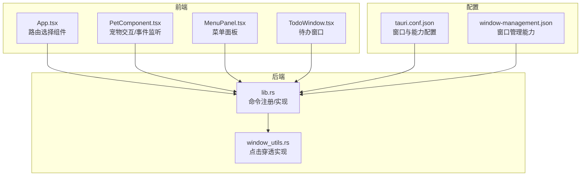
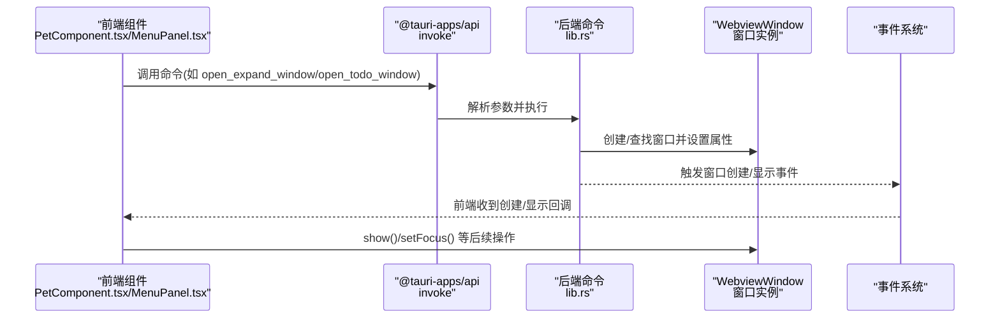
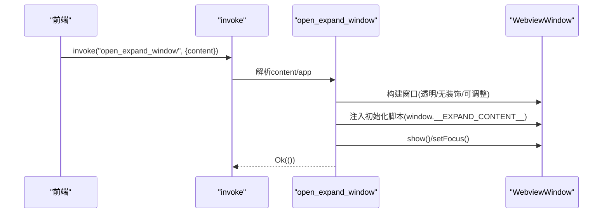
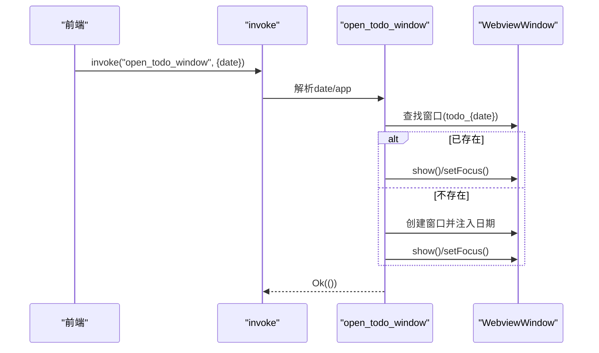
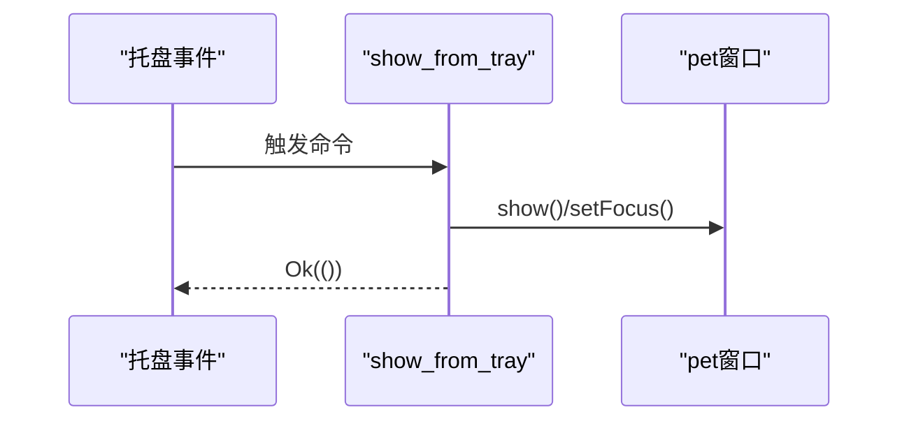
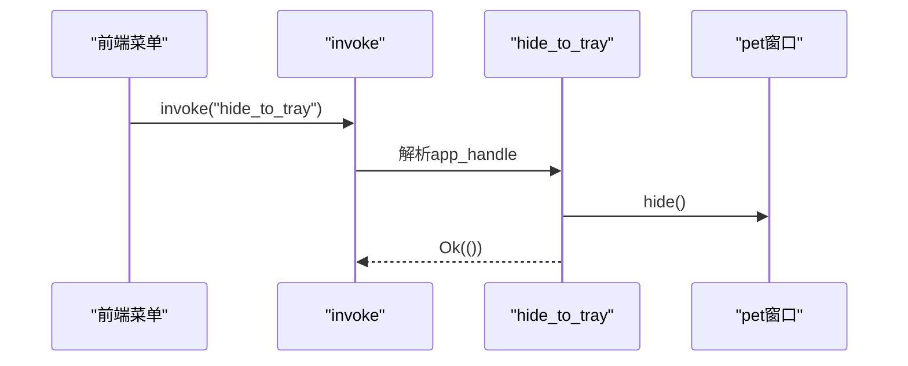
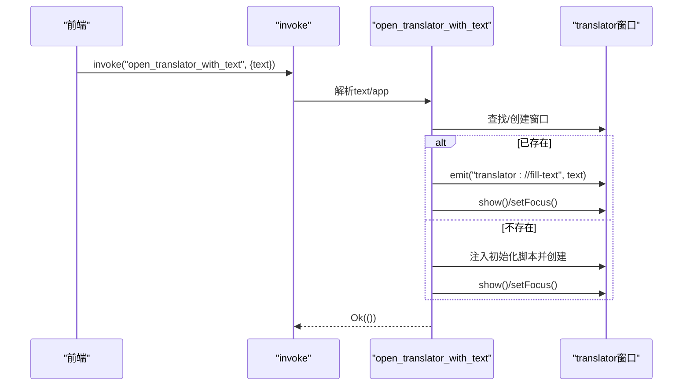
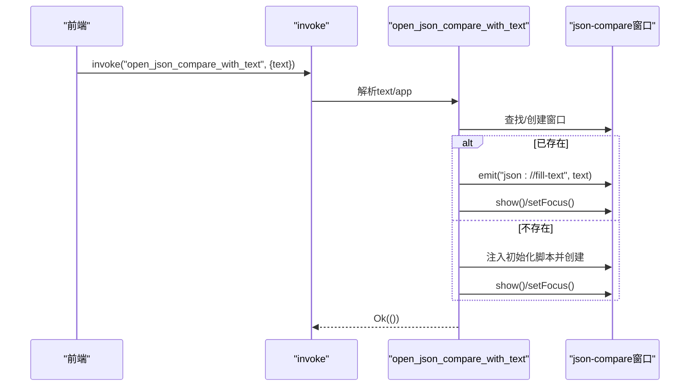
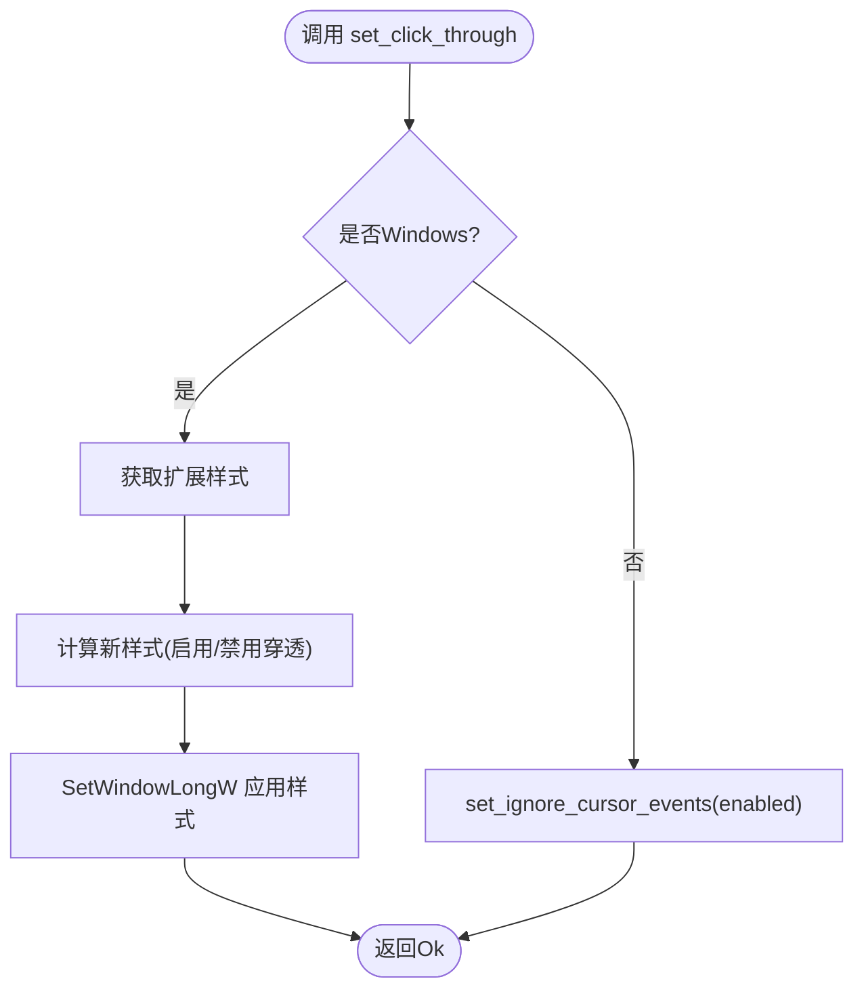
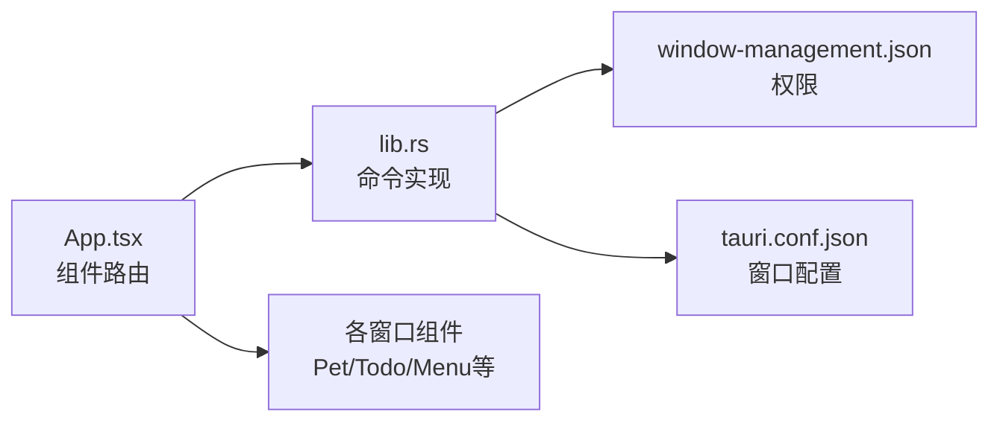

# 窗口管理命令

<cite>
**本文档引用的文件**
- [src-tauri/src/lib.rs](file://src-tauri/src/lib.rs)
- [src-tauri/src/window_utils.rs](file://src-tauri/src/window_utils.rs)
- [src-tauri/tauri.conf.json](file://src-tauri/tauri.conf.json)
- [src-tauri/capabilities/window-management.json](file://src-tauri/capabilities/window-management.json)
- [src/App.tsx](file://src/App.tsx)
- [src/components/PetComponent.tsx](file://src/components/PetComponent.tsx)
- [src/components/TodoWindow.tsx](file://src/components/TodoWindow.tsx)
- [src/components/MenuPanel.tsx](file://src/components/MenuPanel.tsx)
- [src-tauri/Cargo.toml](file://src-tauri/Cargo.toml)
</cite>

## 目录
1. [简介](#简介)
2. [项目结构](#项目结构)
3. [核心组件](#核心组件)
4. [架构总览](#架构总览)
5. [详细组件分析](#详细组件分析)
6. [依赖关系分析](#依赖关系分析)
7. [性能考量](#性能考量)
8. [故障排查指南](#故障排查指南)
9. [结论](#结论)
10. [附录](#附录)

## 简介
本文件系统性梳理并文档化本项目的窗口管理命令API，重点覆盖以下窗口相关命令：
- open_expand_window：创建可编辑扩展窗口
- open_todo_window：创建/显示指定日期的待办窗口
- show_from_tray：从托盘显示宠物窗口
- hide_to_tray：将宠物窗口最小化到托盘
- open_translator_with_text：创建/复用翻译器窗口并注入文本
- open_json_compare_with_text：创建/复用JSON比较窗口并注入文本
- set_click_through：设置窗口点击穿透
- wake_up_pet：唤醒宠物窗口并取消穿透

同时，文档涵盖命令的生命周期管理、性能特征、错误处理、安全考虑、测试与调试方法，以及最佳实践。

## 项目结构
本项目采用前后端分离的Tauri架构，窗口管理命令位于Rust后端，前端通过@tauri-apps/api调用；窗口配置与能力声明位于Tauri配置文件中。

**图表来源**
- [src-tauri/src/lib.rs:949-996](file://src-tauri/src/lib.rs#L949-L996)
- [src-tauri/src/window_utils.rs:1-33](file://src-tauri/src/window_utils.rs#L1-L33)
- [src-tauri/tauri.conf.json:13-51](file://src-tauri/tauri.conf.json#L13-L51)
- [src-tauri/capabilities/window-management.json:1-17](file://src-tauri/capabilities/window-management.json#L1-L17)

**章节来源**
- [src-tauri/src/lib.rs:949-996](file://src-tauri/src/lib.rs#L949-L996)
- [src-tauri/tauri.conf.json:13-51](file://src-tauri/tauri.conf.json#L13-L51)
- [src-tauri/capabilities/window-management.json:1-17](file://src-tauri/capabilities/window-management.json#L1-L17)

## 核心组件
- Rust后端命令注册与实现：集中于lib.rs中的invoke_handler注册表与各命令实现。
- 窗口工具模块：window_utils.rs提供跨平台的点击穿透设置。
- 前端窗口创建与复用：PetComponent.tsx、MenuPanel.tsx等负责窗口生命周期管理与事件绑定。
- 配置与能力：tauri.conf.json声明窗口属性，window-management.json声明窗口管理权限。

**章节来源**
- [src-tauri/src/lib.rs:949-996](file://src-tauri/src/lib.rs#L949-L996)
- [src-tauri/src/window_utils.rs:1-33](file://src-tauri/src/window_utils.rs#L1-L33)
- [src-tauri/tauri.conf.json:13-51](file://src-tauri/tauri.conf.json#L13-L51)
- [src-tauri/capabilities/window-management.json:1-17](file://src-tauri/capabilities/window-management.json#L1-L17)

## 架构总览
窗口管理命令的调用链路如下：
- 前端通过@tauri-apps/api的invoke调用后端命令
- 后端命令根据参数创建或复用WebviewWindow，设置初始脚本与窗口属性
- 前端组件监听事件或通过窗口标签进行复用显示
- 托盘事件触发show_from_tray/hide_to_tray等命令

**图表来源**
- [src-tauri/src/lib.rs:74-112](file://src-tauri/src/lib.rs#L74-L112)
- [src-tauri/src/lib.rs:634-669](file://src-tauri/src/lib.rs#L634-L669)
- [src-tauri/src/lib.rs:872-887](file://src-tauri/src/lib.rs#L872-L887)
- [src/components/PetComponent.tsx:576-583](file://src/components/PetComponent.tsx#L576-L583)

## 详细组件分析

### open_expand_window 命令
- 功能：创建一个带唯一标签的扩展编辑窗口，注入初始内容，设置透明无边框，显示并聚焦。
- 参数定义：
  - content: String，传入需要在窗口中编辑的文本内容
  - app: AppHandle，用于创建窗口
- 返回值类型：Result<(), String>，成功返回Ok(())，失败返回错误字符串
- 生命周期管理：
  - 窗口标签：以“expand_”前缀加时间戳生成唯一标签
  - 创建后立即显示并聚焦
- 错误处理：窗口构建、显示、聚焦阶段均捕获并返回错误
- 性能特征：单次创建，内存占用与内容大小线性相关；透明窗口渲染受GPU影响
- 安全考虑：仅注入JSON初始化脚本，避免执行任意JS；参数长度校验
- 使用示例：前端通过invoke调用，传入content即可创建窗口

**图表来源**
- [src-tauri/src/lib.rs:74-112](file://src-tauri/src/lib.rs#L74-L112)

**章节来源**
- [src-tauri/src/lib.rs:74-112](file://src-tauri/src/lib.rs#L74-L112)

### open_todo_window 命令
- 功能：按日期创建/显示待办窗口，若窗口已存在则直接显示并聚焦
- 参数定义：
  - date: String，目标日期
  - app: AppHandle
- 返回值类型：Result<(), String>
- 生命周期管理：
  - 窗口标签：todo_{date}
  - 若已存在则复用并显示/聚焦
- 错误处理：窗口构建、显示、聚焦阶段错误统一返回
- 性能特征：复用窗口避免重复创建；数据持久化在后端完成
- 安全考虑：初始化脚本注入日期参数，无执行风险
- 使用示例：前端调用open_todo_window(date)即可

**图表来源**
- [src-tauri/src/lib.rs:634-669](file://src-tauri/src/lib.rs#L634-L669)

**章节来源**
- [src-tauri/src/lib.rs:634-669](file://src-tauri/src/lib.rs#L634-L669)

### show_from_tray 命令
- 功能：通过托盘事件显示宠物窗口并聚焦
- 参数定义：app_handle: AppHandle
- 返回值类型：Result<(), String>
- 生命周期管理：仅对已存在的“pet”窗口执行show/setFocus
- 错误处理：窗口状态查询、显示、聚焦阶段错误返回
- 使用示例：托盘左键点击或菜单项触发

**图表来源**
- [src-tauri/src/lib.rs:872-879](file://src-tauri/src/lib.rs#L872-L879)

**章节来源**
- [src-tauri/src/lib.rs:872-879](file://src-tauri/src/lib.rs#L872-L879)

### hide_to_tray 命令
- 功能：将宠物窗口隐藏至托盘（即调用hide）
- 参数定义：app_handle: AppHandle
- 返回值类型：Result<(), String>
- 生命周期管理：仅对已存在的“pet”窗口执行hide
- 错误处理：窗口状态查询、隐藏阶段错误返回
- 使用示例：菜单项“最小化到托盘”触发

**图表来源**
- [src-tauri/src/lib.rs:881-887](file://src-tauri/src/lib.rs#L881-L887)

**章节来源**
- [src-tauri/src/lib.rs:881-887](file://src-tauri/src/lib.rs#L881-L887)

### open_translator_with_text 命令
- 功能：创建/复用翻译器窗口，注入待翻译文本
- 参数定义：
  - text: String，待翻译文本
  - app: AppHandle
- 返回值类型：Result<(), String>
- 生命周期管理：
  - 窗口标签："translator"
  - 已存在则通过事件注入文本并显示/聚焦
- 错误处理：窗口构建、事件发送、显示/聚焦阶段错误返回
- 使用示例：前端通过托盘菜单或快捷操作触发

**图表来源**
- [src-tauri/src/lib.rs:115-160](file://src-tauri/src/lib.rs#L115-L160)

**章节来源**
- [src-tauri/src/lib.rs:115-160](file://src-tauri/src/lib.rs#L115-L160)

### open_json_compare_with_text 命令
- 功能：创建/复用JSON比较窗口，注入待比较文本
- 参数定义：
  - text: String，待比较文本
  - app: AppHandle
- 返回值类型：Result<(), String>
- 生命周期管理：
  - 窗口标签："json-compare"
  - 已存在则通过事件注入文本并显示/聚焦
- 错误处理：窗口构建、事件发送、显示/聚焦阶段错误返回
- 使用示例：前端通过快捷操作触发

**图表来源**
- [src-tauri/src/lib.rs:163-209](file://src-tauri/src/lib.rs#L163-L209)

**章节来源**
- [src-tauri/src/lib.rs:163-209](file://src-tauri/src/lib.rs#L163-L209)

### set_click_through 命令
- 功能：设置窗口点击穿透（Windows使用原生API，其他平台使用忽略光标事件）
- 参数定义：
  - window: WebviewWindow，目标窗口
  - enabled: bool，true为启用穿透
- 返回值类型：Result<(), String>
- 平台差异：
  - Windows：通过GetWindowLongW/SetWindowLongW修改扩展样式
  - 其他平台：调用set_ignore_cursor_events
- 使用示例：宠物窗口休眠/活跃切换时调用

**图表来源**
- [src-tauri/src/window_utils.rs:9-32](file://src-tauri/src/window_utils.rs#L9-L32)

**章节来源**
- [src-tauri/src/window_utils.rs:1-33](file://src-tauri/src/window_utils.rs#L1-L33)

### wake_up_pet 命令
- 功能：唤醒宠物窗口，取消点击穿透并发出唤醒事件
- 参数定义：app: AppHandle
- 返回值类型：Result<(), String>
- 生命周期管理：仅对已存在的“pet”窗口生效
- 使用示例：前端监听“pet://wake-up”事件或调用此命令

**章节来源**
- [src-tauri/src/lib.rs:52-59](file://src-tauri/src/lib.rs#L52-L59)

## 依赖关系分析
- 命令注册：lib.rs通过generate_handler统一注册所有命令
- 能力声明：window-management.json声明允许的窗口操作权限
- 配置声明：tauri.conf.json声明窗口属性与能力集合
- 前端路由：App.tsx根据窗口label选择对应组件渲染

**图表来源**
- [src-tauri/src/lib.rs:949-996](file://src-tauri/src/lib.rs#L949-L996)
- [src-tauri/capabilities/window-management.json:1-17](file://src-tauri/capabilities/window-management.json#L1-L17)
- [src-tauri/tauri.conf.json:44-51](file://src-tauri/tauri.conf.json#L44-L51)
- [src/App.tsx:18-58](file://src/App.tsx#L18-L58)

**章节来源**
- [src-tauri/src/lib.rs:949-996](file://src-tauri/src/lib.rs#L949-L996)
- [src-tauri/capabilities/window-management.json:1-17](file://src-tauri/capabilities/window-management.json#L1-L17)
- [src-tauri/tauri.conf.json:44-51](file://src-tauri/tauri.conf.json#L44-L51)
- [src/App.tsx:18-58](file://src/App.tsx#L18-L58)

## 性能考量
- 窗口创建成本：首次创建窗口涉及系统窗口创建、WebView初始化、资源加载，建议复用已存在窗口（如待办、翻译、JSON比较）。
- 透明窗口渲染：透明无边框窗口在高DPI或某些GPU驱动下可能增加GPU负担，建议在不需要时隐藏或禁用透明。
- 事件与脚本注入：初始化脚本注入JSON字符串需注意内容大小，避免过大导致内存压力。
- 点击穿透：在Windows平台通过原生API切换，开销极低；其他平台通过忽略光标事件实现。
- 数据持久化：待办数据读写在后端完成，避免前端频繁网络请求。

[本节为通用性能指导，无需特定文件引用]

## 故障排查指南
- 窗口创建失败
  - 检查tauri.conf.json中窗口配置是否正确
  - 检查window-management.json权限是否包含所需操作
  - 查看命令返回的错误字符串，定位具体阶段（构建/显示/聚焦）
- 窗口复用问题
  - 确认窗口标签是否正确（如todo_{date}、translator、json-compare）
  - 前端组件应先查找再创建，避免重复创建
- 事件未到达
  - 确认前端监听的事件名与后端emit一致
  - 检查窗口初始化脚本是否正确注入
- 点击穿透异常
  - Windows平台确认已正确获取HWND并应用样式
  - 其他平台确认set_ignore_cursor_events调用成功

**章节来源**
- [src-tauri/src/lib.rs:74-112](file://src-tauri/src/lib.rs#L74-L112)
- [src-tauri/src/lib.rs:634-669](file://src-tauri/src/lib.rs#L634-L669)
- [src-tauri/src/lib.rs:115-160](file://src-tauri/src/lib.rs#L115-L160)
- [src-tauri/src/lib.rs:163-209](file://src-tauri/src/lib.rs#L163-L209)
- [src-tauri/src/window_utils.rs:9-32](file://src-tauri/src/window_utils.rs#L9-L32)

## 结论
本项目的窗口管理命令围绕“创建/复用/显示/隐藏/聚焦”的生命周期展开，结合前端事件与后端命令实现灵活的多窗口交互。通过能力与配置声明确保安全可控，通过复用策略与初始化脚本优化性能。建议在生产环境中严格校验输入、合理使用复用窗口、关注透明窗口的渲染开销，并完善错误处理与日志记录。

[本节为总结性内容，无需特定文件引用]

## 附录

### 命令清单与签名
- open_expand_window(content: String, app: AppHandle) -> Result<(), String>
- open_todo_window(date: String, app: AppHandle) -> Result<(), String>
- show_from_tray(app_handle: AppHandle) -> Result<(), String>
- hide_to_tray(app_handle: AppHandle) -> Result<(), String>
- open_translator_with_text(text: String, app: AppHandle) -> Result<(), String>
- open_json_compare_with_text(text: String, app: AppHandle) -> Result<(), String>
- set_click_through(window: WebviewWindow, enabled: bool) -> Result<(), String>
- wake_up_pet(app: AppHandle) -> Result<(), String>

**章节来源**
- [src-tauri/src/lib.rs:74-112](file://src-tauri/src/lib.rs#L74-L112)
- [src-tauri/src/lib.rs:634-669](file://src-tauri/src/lib.rs#L634-L669)
- [src-tauri/src/lib.rs:872-887](file://src-tauri/src/lib.rs#L872-L887)
- [src-tauri/src/lib.rs:115-160](file://src-tauri/src/lib.rs#L115-L160)
- [src-tauri/src/lib.rs:163-209](file://src-tauri/src/lib.rs#L163-L209)
- [src-tauri/src/lib.rs:48-59](file://src-tauri/src/lib.rs#L48-L59)
- [src-tauri/src/window_utils.rs:9-32](file://src-tauri/src/window_utils.rs#L9-L32)

### 安全考虑
- 权限控制：通过window-management.json声明允许的窗口操作（显示/隐藏/聚焦/忽略光标事件）
- 能力集合：tauri.conf.json的security.capabilities包含window-management等能力
- 输入校验：命令对参数长度与格式进行基本校验，避免过大或非法输入
- 跨窗口通信：通过事件名约定与初始化脚本注入，避免执行任意代码

**章节来源**
- [src-tauri/capabilities/window-management.json:1-17](file://src-tauri/capabilities/window-management.json#L1-L17)
- [src-tauri/tauri.conf.json:44-51](file://src-tauri/tauri.conf.json#L44-L51)

### 测试与调试技巧
- 前端测试：在PetComponent.tsx/MenuPanel.tsx中为窗口创建添加超时与错误监听，便于定位创建失败
- 后端测试：为每个命令添加最小化复现步骤（如仅调用命令），观察返回值与窗口状态
- 调试建议：
  - 使用console输出与日志记录命令执行路径
  - 对窗口状态查询（可见性、焦点）进行条件分支验证
  - 在Windows平台验证点击穿透切换效果

**章节来源**
- [src/components/PetComponent.tsx:576-583](file://src/components/PetComponent.tsx#L576-L583)
- [src-tauri/src/lib.rs:872-887](file://src-tauri/src/lib.rs#L872-L887)

### 最佳实践
- 复用优先：尽量复用已存在窗口，减少创建成本
- 初始化脚本：通过初始化脚本传递数据，避免运行时多次IPC
- 事件命名：前后端事件名保持一致，便于维护
- 权限最小化：仅授予必要的窗口管理权限
- 错误处理：命令中对每一步操作进行错误捕获与返回，便于前端提示

[本节为通用最佳实践，无需特定文件引用]