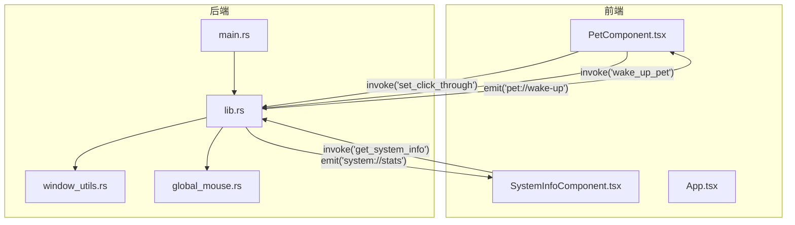
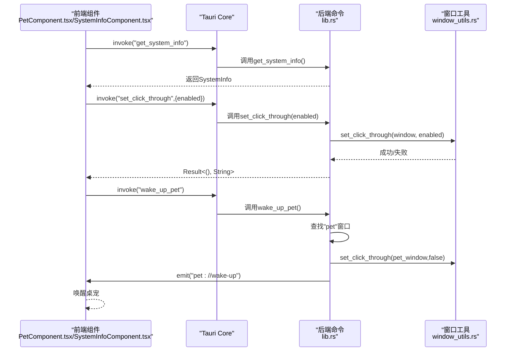
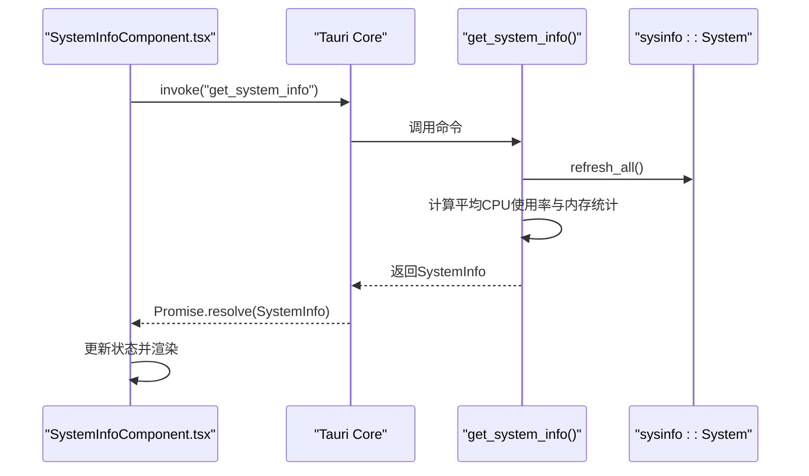
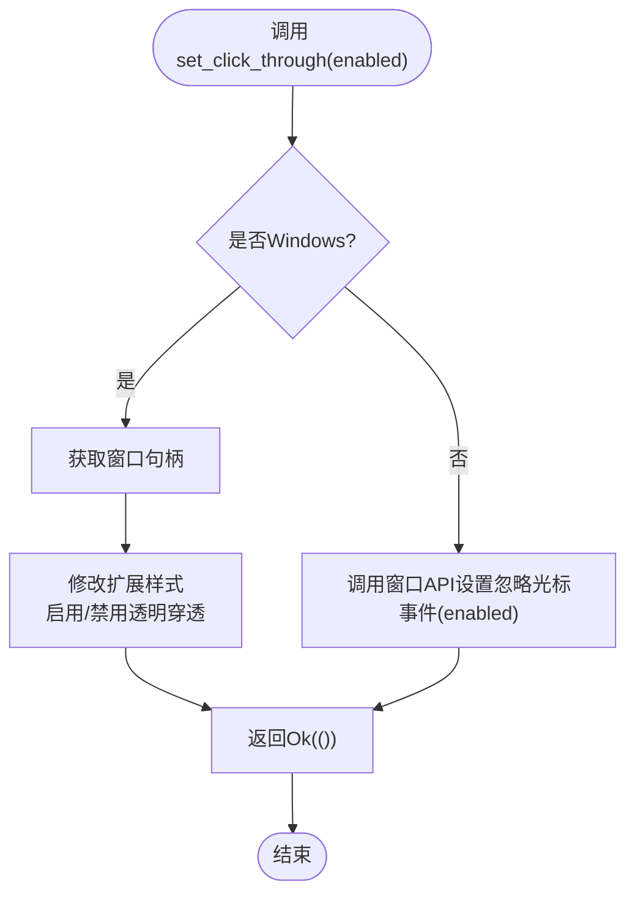
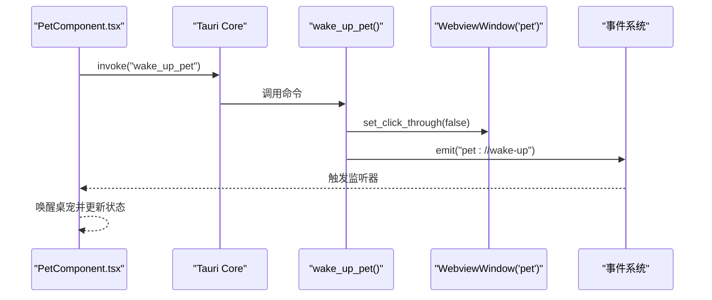
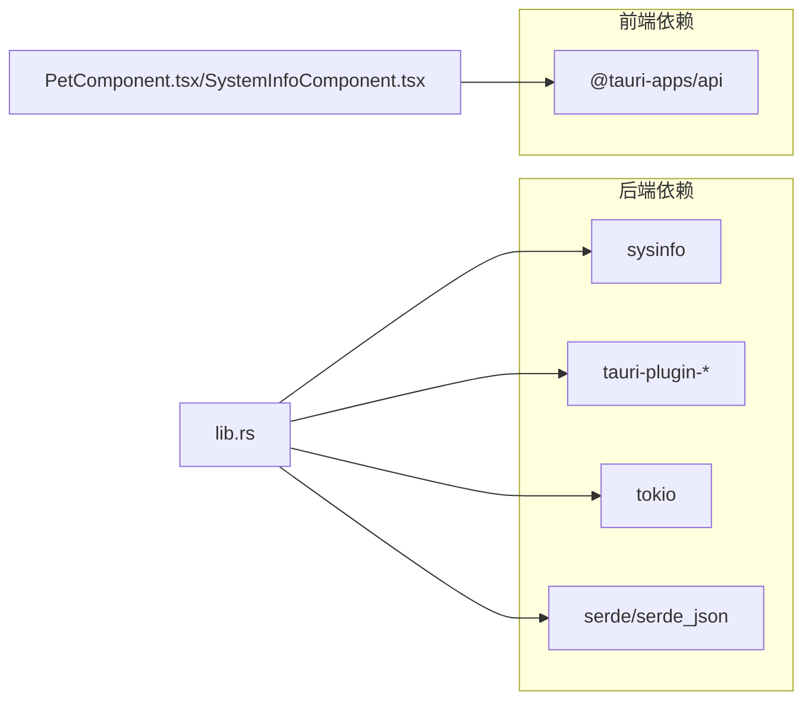

# 系统命令

<cite>
**本文引用的文件**
- [main.rs](file://src-tauri/src/main.rs)
- [lib.rs](file://src-tauri/src/lib.rs)
- [window_utils.rs](file://src-tauri/src/window_utils.rs)
- [Cargo.toml](file://src-tauri/Cargo.toml)
- [tauri.conf.json](file://src-tauri/tauri.conf.json)
- [PetComponent.tsx](file://src/components/PetComponent.tsx)
- [SystemInfoComponent.tsx](file://src/components/SystemInfoComponent.tsx)
- [App.tsx](file://src/App.tsx)
- [global_mouse.rs](file://src-tauri/src/global_mouse.rs)
- [README.md](file://README.md)
</cite>

## 目录
1. [简介](#简介)
2. [项目结构](#项目结构)
3. [核心组件](#核心组件)
4. [架构总览](#架构总览)
5. [详细组件分析](#详细组件分析)
6. [依赖关系分析](#依赖关系分析)
7. [性能考量](#性能考量)
8. [故障排查指南](#故障排查指南)
9. [结论](#结论)
10. [附录](#附录)

## 简介
本章节面向系统命令API的使用者与维护者，系统性梳理本项目中与“系统状态查询与控制”相关的Tauri命令，包括：
- get_system_info：查询系统CPU与内存使用情况
- set_click_through：设置窗口点击穿透状态
- wake_up_pet：唤醒桌宠窗口并取消点击穿透

文档将解释每个命令的功能、参数定义、返回值类型、调用方式（前端invoke、参数传递、异步处理）、性能特征、错误处理机制、安全考虑以及测试与调试方法，并给出完整代码示例路径与实际使用场景。

## 项目结构
本项目采用前后端分离的Tauri架构：
- 前端：React + TypeScript，负责UI与事件交互
- 后端：Rust + Tauri，负责系统命令、窗口管理、系统事件钩子等

图表来源
- [main.rs:8-10](file://src-tauri/src/main.rs#L8-L10)
- [lib.rs:41-59](file://src-tauri/src/lib.rs#L41-L59)
- [window_utils.rs:9-32](file://src-tauri/src/window_utils.rs#L9-L32)
- [PetComponent.tsx:36-54](file://src/components/PetComponent.tsx#L36-L54)
- [SystemInfoComponent.tsx:16-26](file://src/components/SystemInfoComponent.tsx#L16-L26)

章节来源
- [main.rs:1-11](file://src-tauri/src/main.rs#L1-L11)
- [lib.rs:1-1113](file://src-tauri/src/lib.rs#L1-L1113)
- [window_utils.rs:1-33](file://src-tauri/src/window_utils.rs#L1-L33)
- [PetComponent.tsx:1-819](file://src/components/PetComponent.tsx#L1-L819)
- [SystemInfoComponent.tsx:1-149](file://src/components/SystemInfoComponent.tsx#L1-L149)
- [App.tsx:1-57](file://src/App.tsx#L1-L57)

## 核心组件
- 系统信息查询命令：get_system_info
  - 功能：采集系统CPU与内存使用情况，返回结构化数据
  - 参数：无
  - 返回：SystemInfo对象（包含cpu_usage、total_memory、used_memory）
  - 调用方：SystemInfoComponent.tsx
- 窗口点击穿透控制命令：set_click_through
  - 功能：设置指定WebviewWindow的点击穿透状态
  - 参数：enabled（布尔）
  - 返回：Result<(), String>
  - 调用方：PetComponent.tsx
- 桌宠唤醒命令：wake_up_pet
  - 功能：唤醒桌宠窗口，取消点击穿透并发出唤醒事件
  - 参数：无
  - 返回：Result<(), String>
  - 调用方：PetComponent.tsx

章节来源
- [lib.rs:34-72](file://src-tauri/src/lib.rs#L34-L72)
- [lib.rs:41-59](file://src-tauri/src/lib.rs#L41-L59)
- [lib.rs:48-58](file://src-tauri/src/lib.rs#L48-L58)
- [window_utils.rs:9-32](file://src-tauri/src/window_utils.rs#L9-L32)
- [PetComponent.tsx:36-54](file://src/components/PetComponent.tsx#L36-L54)
- [SystemInfoComponent.tsx:16-26](file://src/components/SystemInfoComponent.tsx#L16-L26)

## 架构总览
系统命令的调用链路如下：
- 前端通过@tauri-apps/api/core的invoke发起命令调用
- Tauri将命令路由至后端lib.rs中的#[tauri::command]函数
- 后端执行业务逻辑（如系统信息采集、窗口属性修改、事件发射）
- 前端通过@tauri-apps/api/event的listen监听后端事件，更新UI

图表来源
- [PetComponent.tsx:36-54](file://src/components/PetComponent.tsx#L36-L54)
- [SystemInfoComponent.tsx:16-26](file://src/components/SystemInfoComponent.tsx#L16-L26)
- [lib.rs:41-59](file://src-tauri/src/lib.rs#L41-L59)
- [window_utils.rs:9-32](file://src-tauri/src/window_utils.rs#L9-L32)

## 详细组件分析

### 命令：get_system_info
- 功能：查询系统CPU与内存使用情况
- 定义位置：后端lib.rs中的#[tauri::command]函数
- 参数：无
- 返回：SystemInfo结构体
  - 字段：cpu_usage（f32）、total_memory（u64）、used_memory（u64）
- 调用方式：
  - 前端：SystemInfoComponent.tsx通过invoke调用
  - 异步：返回Promise，成功后更新组件状态
- 性能特征：
  - 采集周期：后端每秒通过定时器刷新一次，emit "system://stats"事件
  - 前端监听：SystemInfoComponent.tsx订阅该事件，实现UI实时更新
- 错误处理：
  - 命令本身返回Result<SystemInfo, String>；前端通常通过invoke的Promise.catch捕获错误
- 使用示例路径：
  - 前端调用：[SystemInfoComponent.tsx:16-26](file://src/components/SystemInfoComponent.tsx#L16-L26)
  - 后端命令：[lib.rs:41-45](file://src-tauri/src/lib.rs#L41-L45)
  - 系统信息采集：[lib.rs:61-72](file://src-tauri/src/lib.rs#L61-L72)

图表来源
- [SystemInfoComponent.tsx:16-26](file://src/components/SystemInfoComponent.tsx#L16-L26)
- [lib.rs:41-72](file://src-tauri/src/lib.rs#L41-L72)

章节来源
- [lib.rs:34-72](file://src-tauri/src/lib.rs#L34-L72)
- [SystemInfoComponent.tsx:1-149](file://src/components/SystemInfoComponent.tsx#L1-L149)

### 命令：set_click_through
- 功能：设置WebviewWindow的点击穿透状态
- 定义位置：#[tauri::command]函数
- 参数：
  - window：WebviewWindow（由调用方传入）
  - enabled：布尔值（true为启用穿透，false为禁用穿透）
- 返回：Result<(), String>
- 平台差异：
  - Windows：通过Win32 API修改窗口扩展样式
  - 非Windows：调用窗口API设置忽略光标事件
- 调用方式：
  - 前端：PetComponent.tsx通过invoke调用
  - 异步：返回Promise，成功后更新本地状态
- 错误处理：
  - 命令内部将底层错误转换为字符串返回
  - 前端应捕获并提示用户
- 使用示例路径：
  - 前端调用：[PetComponent.tsx:36-47](file://src/components/PetComponent.tsx#L36-L47)
  - 后端命令：[lib.rs:48-50](file://src-tauri/src/lib.rs#L48-L50)
  - 平台实现：[window_utils.rs:9-32](file://src-tauri/src/window_utils.rs#L9-L32)

图表来源
- [window_utils.rs:9-32](file://src-tauri/src/window_utils.rs#L9-L32)

章节来源
- [lib.rs:48-50](file://src-tauri/src/lib.rs#L48-L50)
- [window_utils.rs:1-33](file://src-tauri/src/window_utils.rs#L1-L33)
- [PetComponent.tsx:36-47](file://src/components/PetComponent.tsx#L36-L47)

### 命令：wake_up_pet
- 功能：唤醒桌宠窗口，取消点击穿透并发出“pet://wake-up”事件
- 定义位置：#[tauri::command]函数
- 参数：无
- 返回：Result<(), String>
- 行为流程：
  - 查找名为"pet"的WebviewWindow
  - 调用set_click_through(false)取消穿透
  - 通过AppHandle向前端发射"pet://wake-up"事件
- 调用方式：
  - 前端：PetComponent.tsx通过invoke调用
  - 前端监听：PetComponent.tsx监听"pet://wake-up"事件并唤醒桌宠
- 错误处理：
  - 若找不到窗口或事件发射失败，返回错误字符串
- 使用示例路径：
  - 前端调用：[PetComponent.tsx:49-54](file://src/components/PetComponent.tsx#L49-L54)
  - 前端监听：[PetComponent.tsx:156-159](file://src/components/PetComponent.tsx#L156-L159)
  - 后端命令：[lib.rs:52-59](file://src-tauri/src/lib.rs#L52-L59)

图表来源
- [PetComponent.tsx:49-54](file://src/components/PetComponent.tsx#L49-L54)
- [PetComponent.tsx:156-159](file://src/components/PetComponent.tsx#L156-L159)
- [lib.rs:52-59](file://src-tauri/src/lib.rs#L52-L59)

章节来源
- [lib.rs:52-59](file://src-tauri/src/lib.rs#L52-L59)
- [PetComponent.tsx:49-54](file://src/components/PetComponent.tsx#L49-L54)
- [PetComponent.tsx:156-159](file://src/components/PetComponent.tsx#L156-L159)

## 依赖关系分析
- 后端依赖
  - sysinfo：系统信息采集
  - tauri-plugin-opener/fs/dialog：外部打开、文件系统与对话框能力
  - tokio：异步运行时
  - serde/serde_json：序列化与网络请求
- 前端依赖
  - @tauri-apps/api：invoke、listen、window等API
- 权限配置
  - tauri.conf.json声明了capabilities（drag、window-management、main-capability），确保命令与窗口操作的权限

图表来源
- [Cargo.toml:15-36](file://src-tauri/Cargo.toml#L15-L36)
- [lib.rs:1-1113](file://src-tauri/src/lib.rs#L1-L1113)
- [PetComponent.tsx:1-819](file://src/components/PetComponent.tsx#L1-L819)
- [SystemInfoComponent.tsx:1-149](file://src/components/SystemInfoComponent.tsx#L1-L149)

章节来源
- [Cargo.toml:1-44](file://src-tauri/Cargo.toml#L1-L44)
- [tauri.conf.json:44-51](file://src-tauri/tauri.conf.json#L44-L51)

## 性能考量
- get_system_info
  - 采集频率：后端每秒刷新一次，emit "system://stats"事件
  - 前端监听：SystemInfoComponent.tsx订阅事件，避免轮询，降低CPU占用
  - 数据量：每次仅传输少量数值字段，网络开销极低
- set_click_through
  - Windows平台：通过Win32 API修改窗口样式，开销较小
  - 非Windows平台：调用窗口API设置忽略事件，开销极低
- wake_up_pet
  - 仅涉及窗口查找与事件发射，开销极低
- 异步与并发
  - 命令均使用async函数，避免阻塞主线程
  - 前端通过Promise与事件机制处理异步结果

章节来源
- [lib.rs:1039-1061](file://src-tauri/src/lib.rs#L1039-L1061)
- [SystemInfoComponent.tsx:16-26](file://src/components/SystemInfoComponent.tsx#L16-L26)
- [PetComponent.tsx:36-54](file://src/components/PetComponent.tsx#L36-L54)

## 故障排查指南
- invoke调用失败
  - 检查命令名称是否正确（get_system_info、set_click_through、wake_up_pet）
  - 确认前端已安装并正确引入@tauri-apps/api
- set_click_through返回错误
  - Windows平台：确认窗口句柄有效，检查权限与平台支持
  - 非Windows平台：确认窗口API可用
- wake_up_pet未生效
  - 确认存在名为"pet"的窗口
  - 检查事件监听是否注册成功
- 系统信息不更新
  - 检查后端定时器是否正常运行
  - 检查前端是否正确订阅"system://stats"事件

章节来源
- [PetComponent.tsx:156-159](file://src/components/PetComponent.tsx#L156-L159)
- [SystemInfoComponent.tsx:16-26](file://src/components/SystemInfoComponent.tsx#L16-L26)
- [lib.rs:1039-1061](file://src-tauri/src/lib.rs#L1039-L1061)

## 结论
本项目的系统命令设计简洁、职责清晰，通过Tauri的invoke与事件机制实现了前后端的高效协作。get_system_info提供实时系统监控，set_click_through与wake_up_pet共同支撑了桌宠的交互体验。整体性能表现良好，错误处理与异步机制完善，适合在生产环境中稳定运行。

## 附录

### 命令一览与使用示例路径
- get_system_info
  - 前端调用：[SystemInfoComponent.tsx:16-26](file://src/components/SystemInfoComponent.tsx#L16-L26)
  - 后端命令：[lib.rs:41-45](file://src-tauri/src/lib.rs#L41-L45)
  - 系统采集：[lib.rs:61-72](file://src-tauri/src/lib.rs#L61-L72)
- set_click_through
  - 前端调用：[PetComponent.tsx:36-47](file://src/components/PetComponent.tsx#L36-L47)
  - 后端命令：[lib.rs:48-50](file://src-tauri/src/lib.rs#L48-L50)
  - 平台实现：[window_utils.rs:9-32](file://src-tauri/src/window_utils.rs#L9-L32)
- wake_up_pet
  - 前端调用：[PetComponent.tsx:49-54](file://src/components/PetComponent.tsx#L49-L54)
  - 前端监听：[PetComponent.tsx:156-159](file://src/components/PetComponent.tsx#L156-L159)
  - 后端命令：[lib.rs:52-59](file://src-tauri/src/lib.rs#L52-L59)

### 安全与权限
- 权限配置：tauri.conf.json声明了capabilities，确保窗口管理与拖拽等能力受控
- 命令边界：命令参数均为基本类型，避免越权访问
- 平台差异：Windows平台通过Win32 API操作窗口，需遵循系统权限模型

章节来源
- [tauri.conf.json:44-51](file://src-tauri/tauri.conf.json#L44-L51)
- [Cargo.toml:15-36](file://src-tauri/Cargo.toml#L15-L36)