# 翻译命令

<cite>
**本文档引用的文件**
- [lib.rs](file://src-tauri/src/lib.rs)
- [main.rs](file://src-tauri/src/main.rs)
- [Cargo.toml](file://src-tauri/Cargo.toml)
- [TranslatorComponent.tsx](file://src/components/TranslatorComponent.tsx)
- [deepseek.json](file://src-tauri/config/deepseek.json)
</cite>

## 目录
1. [简介](#简介)
2. [项目结构](#项目结构)
3. [核心组件](#核心组件)
4. [架构概览](#架构概览)
5. [详细组件分析](#详细组件分析)
6. [依赖关系分析](#依赖关系分析)
7. [性能考虑](#性能考虑)
8. [故障排除指南](#故障排除指南)
9. [结论](#结论)

## 简介

本文档详细介绍了 xsun_desktop_pet 应用中的翻译命令API，特别是有道翻译API的集成。该应用使用 Tauri 框架构建桌面应用程序，提供了完整的翻译功能，包括有道翻译API的配置管理、签名生成和批量翻译处理。

翻译命令API是应用的核心功能之一，允许用户在桌面环境中进行实时翻译，支持多种语言对和批量翻译场景。系统集成了有道翻译API，提供了安全的API密钥管理和高效的翻译处理机制。

## 项目结构

翻译功能主要分布在以下关键文件中：

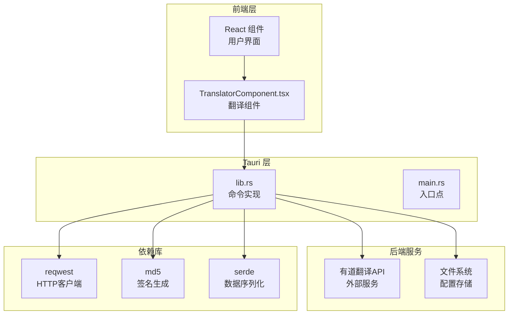

**图表来源**
- [lib.rs:1-1120](file://src-tauri/src/lib.rs#L1-L1120)
- [main.rs:1-11](file://src-tauri/src/main.rs#L1-L11)

**章节来源**
- [lib.rs:1-1120](file://src-tauri/src/lib.rs#L1-L1120)
- [main.rs:1-11](file://src-tauri/src/main.rs#L1-L11)

## 核心组件

### 翻译命令集合

应用提供了三个核心的翻译相关命令：

1. **youdao_translate** - 主要的翻译执行命令
2. **save_youdao_config** - 有道翻译配置保存命令  
3. **load_youdao_config** - 有道翻译配置加载命令

### 数据模型

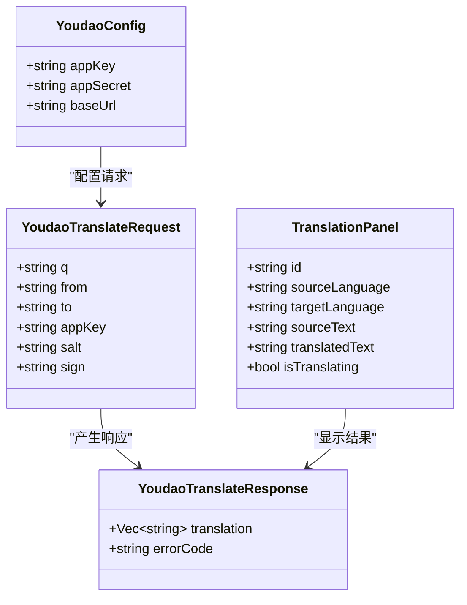

**图表来源**
- [lib.rs:388-412](file://src-tauri/src/lib.rs#L388-L412)
- [TranslatorComponent.tsx:7-25](file://src/components/TranslatorComponent.tsx#L7-L25)

**章节来源**
- [lib.rs:388-412](file://src-tauri/src/lib.rs#L388-L412)
- [TranslatorComponent.tsx:7-25](file://src/components/TranslatorComponent.tsx#L7-L25)

## 架构概览

翻译系统的整体架构采用分层设计，确保了良好的可维护性和扩展性：

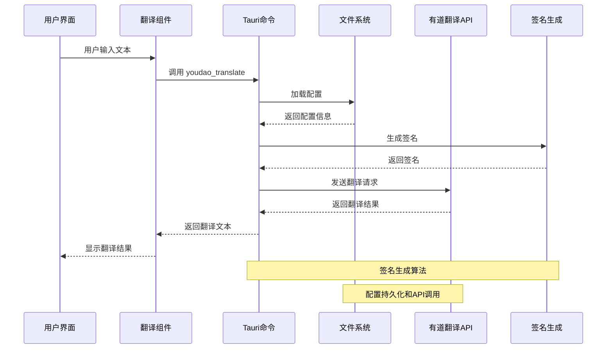

**图表来源**
- [lib.rs:480-552](file://src-tauri/src/lib.rs#L480-L552)
- [TranslatorComponent.tsx:164-187](file://src/components/TranslatorComponent.tsx#L164-L187)

## 详细组件分析

### youdao_translate 命令

#### 功能概述
`youdao_translate` 是翻译系统的核心命令，负责执行实际的翻译操作。它支持以下特性：
- 实时翻译处理
- 等号分割的特殊格式处理
- 错误码处理和状态反馈
- 异步网络请求处理

#### 参数定义
| 参数名称 | 类型 | 必需 | 描述 |
|---------|------|------|------|
| app | AppHandle | 是 | Tauri应用句柄 |
| text | String | 是 | 要翻译的文本内容 |
| from | String | 是 | 源语言代码 |
| to | String | 是 | 目标语言代码 |

#### 返回值类型
- **成功**: `Result<String, String>`
  - 返回翻译后的文本字符串
  - 支持等号分割格式的原始前缀保留
- **失败**: `Result<String, String>`
  - 返回详细的错误信息字符串

#### 调用流程

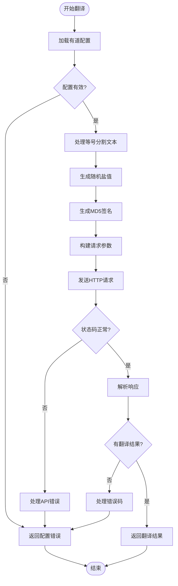

**图表来源**
- [lib.rs:480-552](file://src-tauri/src/lib.rs#L480-L552)

**章节来源**
- [lib.rs:480-552](file://src-tauri/src/lib.rs#L480-L552)

### save_youdao_config 命令

#### 功能概述
`save_youdao_config` 命令负责将用户的有道翻译API配置信息保存到本地文件系统中。

#### 参数定义
| 参数名称 | 类型 | 必需 | 描述 |
|---------|------|------|------|
| app | AppHandle | 是 | Tauri应用句柄 |
| config | YoudaoConfig | 是 | 配置对象 |

#### 返回值类型
- **成功**: `Result<(), String>`
- **失败**: `Result<(), String>` 包含错误信息

#### 配置存储机制

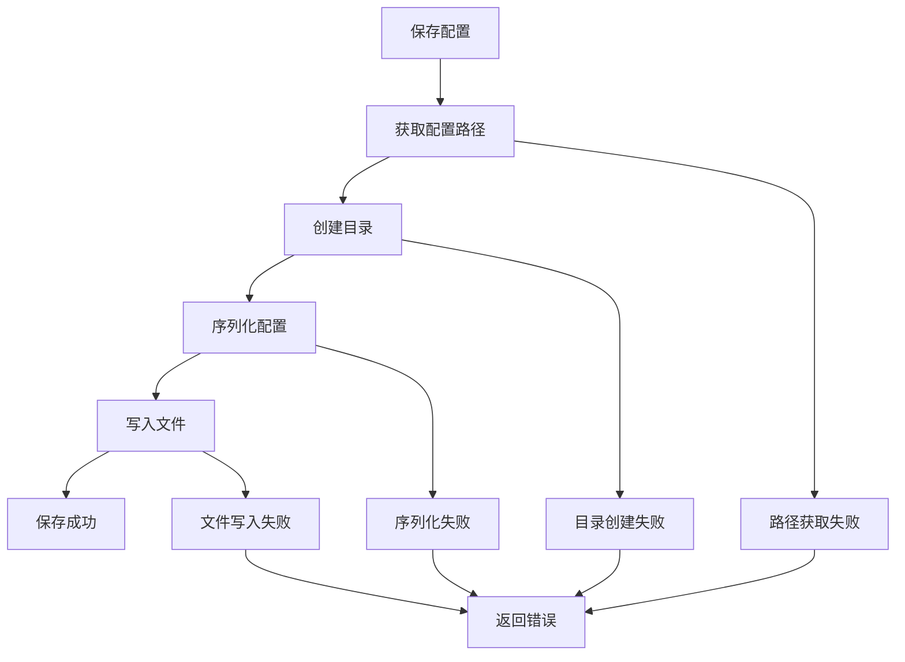

**图表来源**
- [lib.rs:428-440](file://src-tauri/src/lib.rs#L428-L440)

**章节来源**
- [lib.rs:428-440](file://src-tauri/src/lib.rs#L428-L440)

### load_youdao_config 命令

#### 功能概述
`load_youdao_config` 命令从本地文件系统加载之前保存的有道翻译API配置。

#### 参数定义
| 参数名称 | 类型 | 必需 | 描述 |
|---------|------|------|------|
| app | AppHandle | 是 | Tauri应用句柄 |

#### 返回值类型
- **成功**: `Result<Option<YoudaoConfig>, String>`
- **失败**: `Result<Option<YoudaoConfig>, String>`

#### 配置加载策略

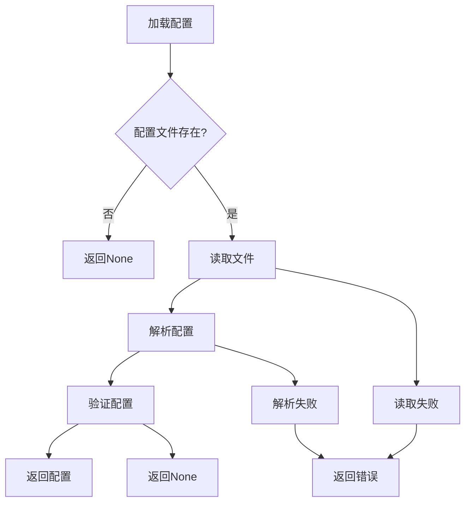

**图表来源**
- [lib.rs:443-462](file://src-tauri/src/lib.rs#L443-L462)

**章节来源**
- [lib.rs:443-462](file://src-tauri/src/lib.rs#L443-L462)

### 签名生成机制

#### 算法实现
有道翻译API使用MD5签名算法确保请求的安全性：

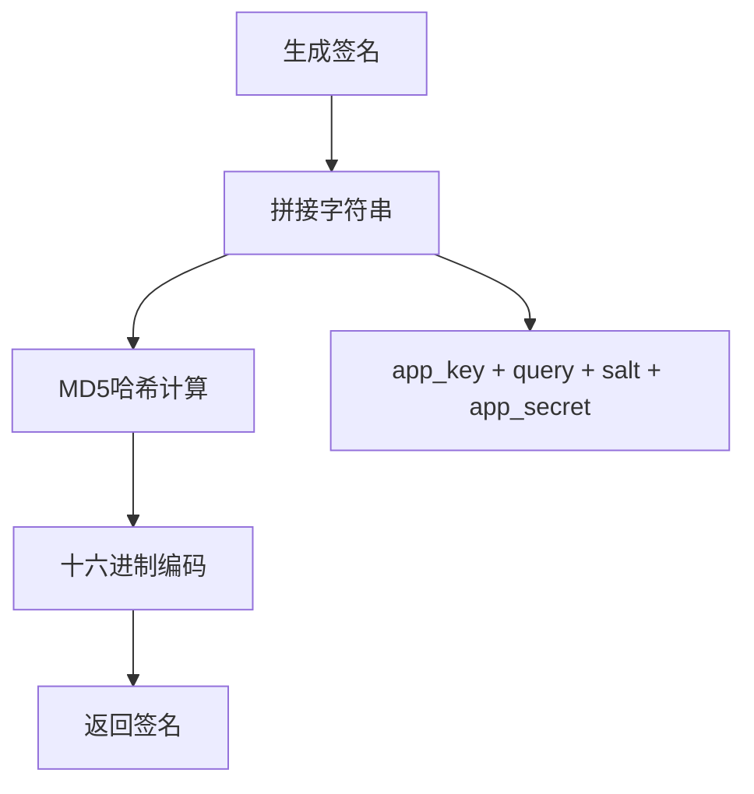

**图表来源**
- [lib.rs:422-425](file://src-tauri/src/lib.rs#L422-L425)

**章节来源**
- [lib.rs:422-425](file://src-tauri/src/lib.rs#L422-L425)

### 前端集成

#### React 组件架构
翻译组件采用现代化的React Hooks模式，提供了丰富的用户交互功能：

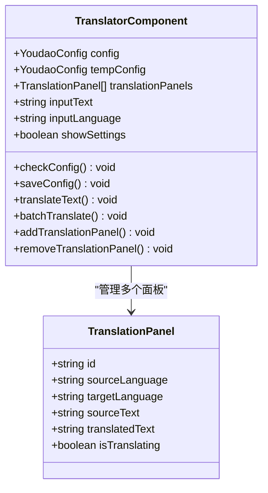

**图表来源**
- [TranslatorComponent.tsx:49-162](file://src/components/TranslatorComponent.tsx#L49-L162)

**章节来源**
- [TranslatorComponent.tsx:49-162](file://src/components/TranslatorComponent.tsx#L49-L162)

## 依赖关系分析

### 外部依赖

翻译系统依赖以下关键库：

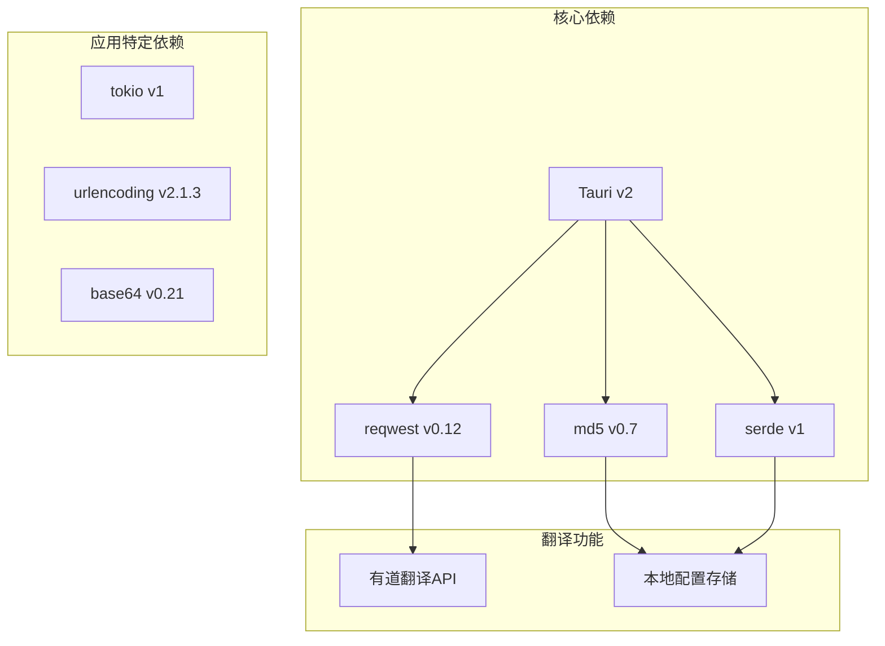

**图表来源**
- [Cargo.toml:15-35](file://src-tauri/Cargo.toml#L15-L35)

### 内部模块依赖

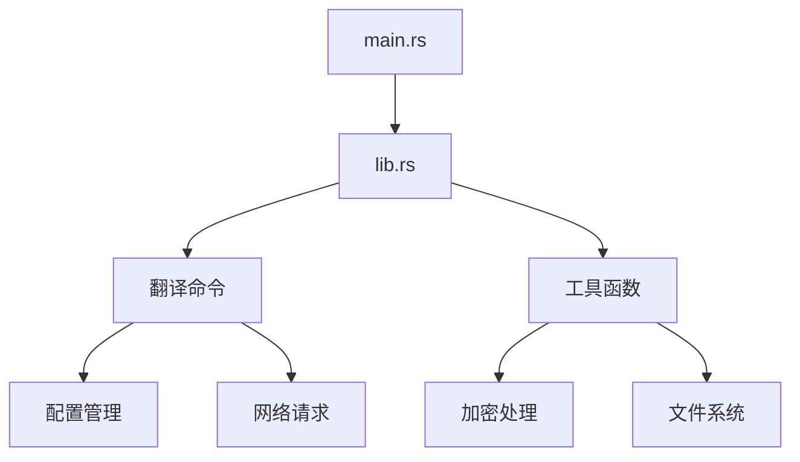

**图表来源**
- [main.rs:1-11](file://src-tauri/src/main.rs#L1-L11)
- [lib.rs:1-1120](file://src-tauri/src/lib.rs#L1-L1120)

**章节来源**
- [Cargo.toml:15-35](file://src-tauri/Cargo.toml#L15-L35)
- [main.rs:1-11](file://src-tauri/src/main.rs#L1-L11)
- [lib.rs:1-1120](file://src-tauri/src/lib.rs#L1-L1120)

## 性能考虑

### 网络请求优化

翻译系统采用了多项性能优化措施：

1. **异步请求处理**: 使用 tokio 异步运行时处理网络请求
2. **连接池管理**: reqwest 自动管理 HTTP 连接池
3. **超时控制**: 合理的请求超时设置避免阻塞
4. **错误重试**: 对于临时性错误提供重试机制

### 内存管理

1. **零拷贝优化**: 使用引用传递避免不必要的数据复制
2. **流式处理**: 对于大文本采用流式处理方式
3. **缓存策略**: 对常用配置进行内存缓存

### 并发处理

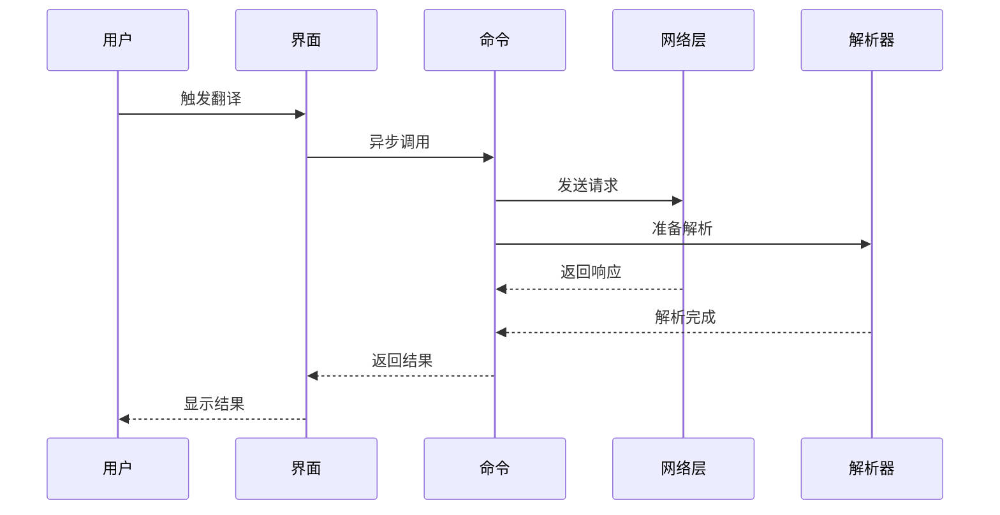

**图表来源**
- [lib.rs:480-552](file://src-tauri/src/lib.rs#L480-L552)

## 故障排除指南

### 常见错误类型

#### 配置相关错误
- **配置文件缺失**: 系统会返回"请先配置有道翻译API密钥"错误
- **API密钥无效**: 当 app_key 或 app_secret 为空时触发
- **配置解析失败**: JSON格式不正确导致的解析错误

#### 网络相关错误
- **API请求失败**: HTTP状态码非200时的错误
- **网络连接超时**: 请求超时或服务器无响应
- **签名验证失败**: 签名算法错误导致的认证失败

#### 处理流程

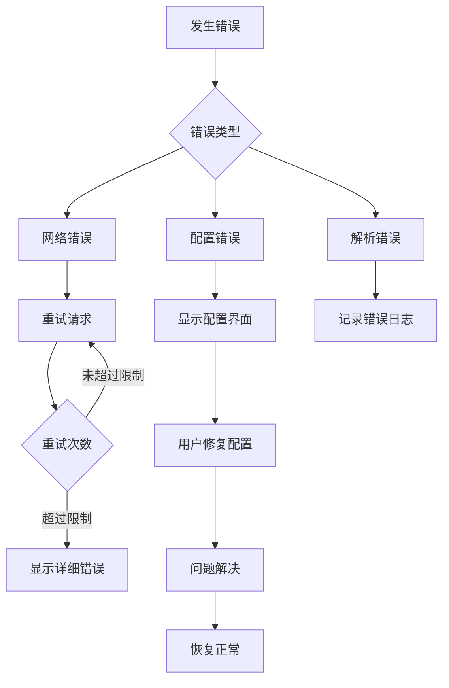

**图表来源**
- [lib.rs:486-551](file://src-tauri/src/lib.rs#L486-L551)

### 调试技巧

1. **启用详细日志**: 在开发模式下查看详细的错误信息
2. **检查网络连接**: 确保能够访问有道翻译API域名
3. **验证API密钥**: 确认 app_key 和 app_secret 的正确性
4. **测试签名算法**: 验证签名生成过程的正确性

**章节来源**
- [lib.rs:486-551](file://src-tauri/src/lib.rs#L486-L551)

## 结论

xsun_desktop_pet 应用的翻译命令API提供了一个完整、高效且安全的翻译解决方案。通过精心设计的架构和完善的错误处理机制，系统能够在保证安全性的同时提供流畅的用户体验。

### 主要优势

1. **安全性**: 采用MD5签名算法和本地配置存储
2. **易用性**: 提供直观的用户界面和简单的配置流程
3. **可靠性**: 完善的错误处理和重试机制
4. **性能**: 异步处理和连接池优化

### 最佳实践建议

1. **配置管理**: 始终使用 `save_youdao_config` 和 `load_youdao_config` 命令管理配置
2. **错误处理**: 在前端实现适当的错误提示和重试逻辑
3. **性能优化**: 对于大量翻译需求，考虑批处理和缓存策略
4. **安全考虑**: 避免在代码中硬编码API密钥，使用配置文件管理

该翻译命令API为开发者提供了清晰的接口和强大的功能，是构建桌面翻译应用的良好参考实现。