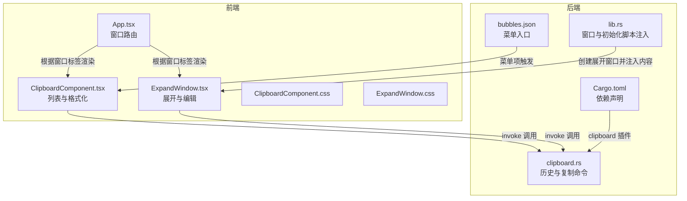
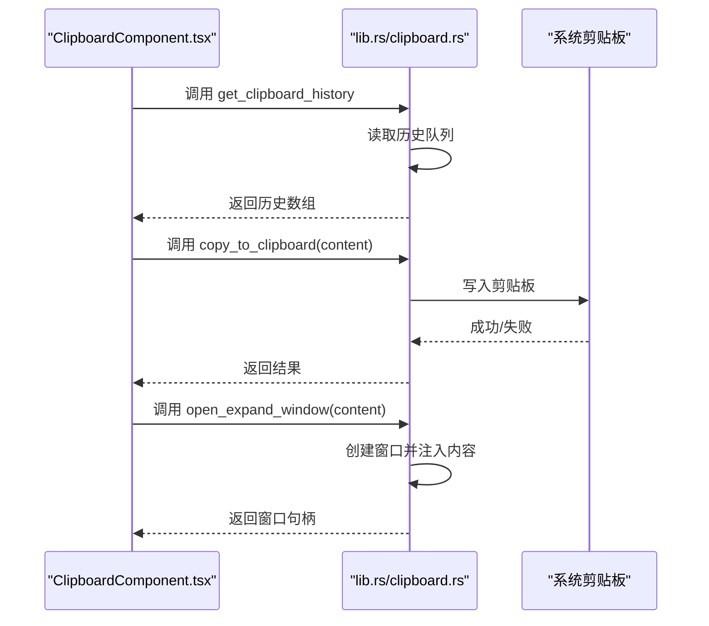
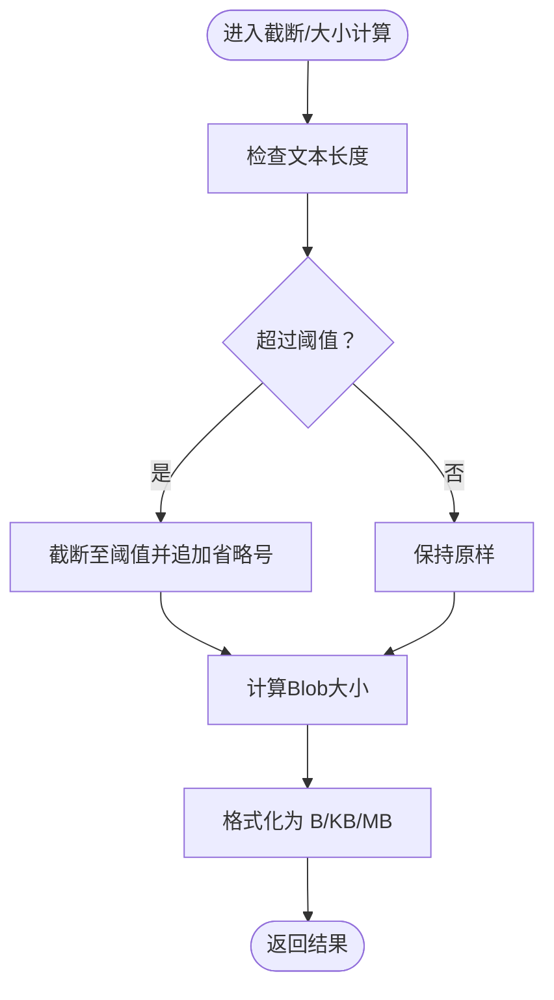
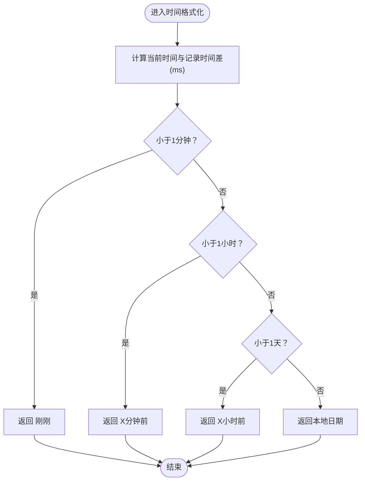
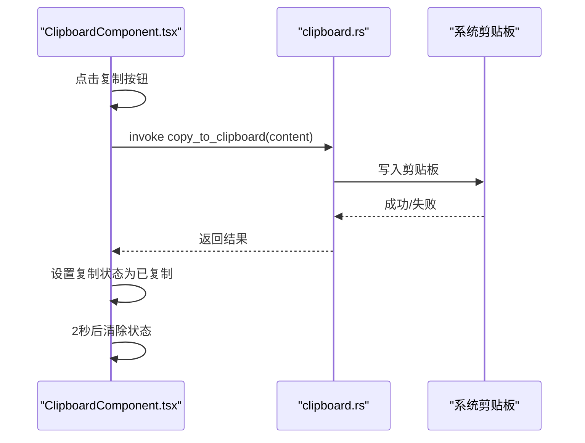
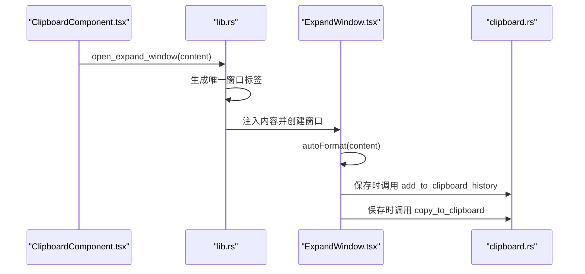
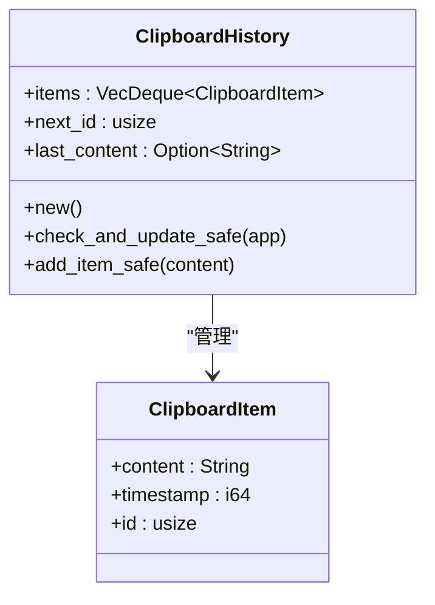
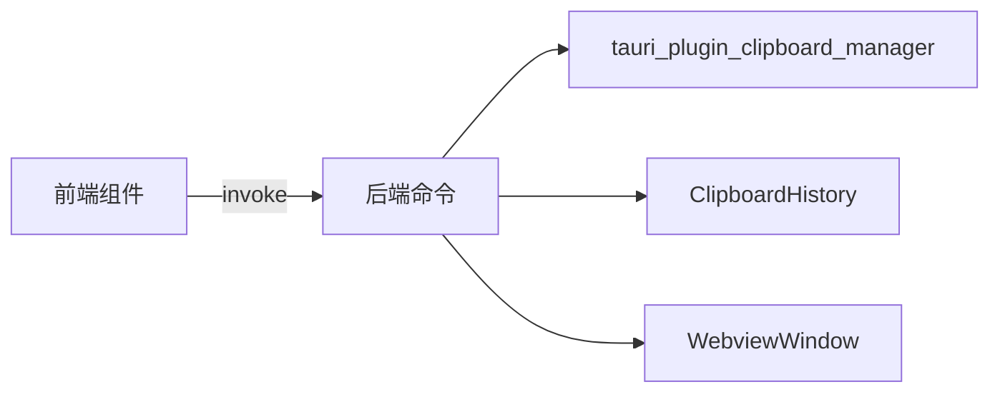

# 内容处理与格式化

<cite>
**本文引用的文件**
- [ClipboardComponent.tsx](file://src/components/ClipboardComponent.tsx)
- [ExpandWindow.tsx](file://src/components/ExpandWindow.tsx)
- [clipboard.rs](file://src-tauri/src/clipboard.rs)
- [lib.rs](file://src-tauri/src/lib.rs)
- [App.tsx](file://src/App.tsx)
- [ClipboardComponent.css](file://src/components/ClipboardComponent.css)
- [ExpandWindow.css](file://src/components/ExpandWindow.css)
- [bubbles.json](file://public/config/bubbles.json)
- [Cargo.toml](file://src-tauri/Cargo.toml)
</cite>

## 目录
1. [简介](#简介)
2. [项目结构](#项目结构)
3. [核心组件](#核心组件)
4. [架构总览](#架构总览)
5. [详细组件分析](#详细组件分析)
6. [依赖关系分析](#依赖关系分析)
7. [性能考量](#性能考量)
8. [故障排查指南](#故障排查指南)
9. [结论](#结论)
10. [附录](#附录)

## 简介
本文件围绕剪贴板内容处理与格式化进行系统性技术文档整理，重点覆盖以下方面：
- 内容格式化函数：文本截断、大小计算、时间格式化
- 内容类型识别与处理策略：纯文本、富文本与二进制数据的识别与处理
- 复制功能：复制状态管理与用户反馈机制
- 内容展开功能：长内容显示与格式化处理
- 性能考虑：大文本处理与内存优化
- 安全考虑：敏感信息过滤与隐私保护
- 最佳实践与常见问题解决方案

## 项目结构
该功能由前端 React 组件与 Tauri 原生模块协同实现，前端负责 UI 交互与格式化展示，后端负责剪贴板监听、历史存储与跨平台剪贴板读写。

**图表来源**
- [ClipboardComponent.tsx:1-182](file://src/components/ClipboardComponent.tsx#L1-L182)
- [ExpandWindow.tsx:1-168](file://src/components/ExpandWindow.tsx#L1-L168)
- [lib.rs:74-112](file://src-tauri/src/lib.rs#L74-L112)
- [clipboard.rs:124-224](file://src-tauri/src/clipboard.rs#L124-L224)
- [App.tsx:18-58](file://src/App.tsx#L18-L58)
- [bubbles.json:1-52](file://public/config/bubbles.json#L1-L52)
- [Cargo.toml](file://src-tauri/Cargo.toml)

**章节来源**
- [ClipboardComponent.tsx:1-182](file://src/components/ClipboardComponent.tsx#L1-L182)
- [ExpandWindow.tsx:1-168](file://src/components/ExpandWindow.tsx#L1-L168)
- [lib.rs:74-112](file://src-tauri/src/lib.rs#L74-L112)
- [clipboard.rs:124-224](file://src-tauri/src/clipboard.rs#L124-L224)
- [App.tsx:18-58](file://src/App.tsx#L18-L58)
- [bubbles.json:1-52](file://public/config/bubbles.json#L1-L52)
- [Cargo.toml](file://src-tauri/Cargo.toml)

## 核心组件
- 剪贴板历史组件（ClipboardComponent）：负责轮询历史、截断显示、时间格式化、大小格式化、复制与展开调用、清空历史与窗口关闭。
- 展开窗口组件（ExpandWindow）：负责长内容展示、自动格式化（JSON/逗号分隔）、编辑模式切换、保存与复制反馈。
- 剪贴板后端（clipboard.rs）：负责历史队列、去重、长度限制、剪贴板读写、清空历史、手动检查。
- 窗口创建与注入（lib.rs）：负责创建展开窗口并注入初始内容。
- 应用路由（App.tsx）：根据窗口标签选择渲染组件。
- 样式（ClipboardComponent.css、ExpandWindow.css）：提供视觉与交互反馈。

**章节来源**
- [ClipboardComponent.tsx:12-182](file://src/components/ClipboardComponent.tsx#L12-L182)
- [ExpandWindow.tsx:6-168](file://src/components/ExpandWindow.tsx#L6-L168)
- [clipboard.rs:14-122](file://src-tauri/src/clipboard.rs#L14-L122)
- [lib.rs:74-112](file://src-tauri/src/lib.rs#L74-L112)
- [App.tsx:18-58](file://src/App.tsx#L18-L58)

## 架构总览
前端通过 Tauri 的 invoke 调用后端命令，后端执行剪贴板读写与历史管理，并在需要时创建独立窗口以展示长内容。

**图表来源**
- [ClipboardComponent.tsx:23-52](file://src/components/ClipboardComponent.tsx#L23-L52)
- [clipboard.rs:124-191](file://src-tauri/src/clipboard.rs#L124-L191)
- [lib.rs:74-112](file://src-tauri/src/lib.rs#L74-L112)

## 详细组件分析

### 文本截断算法与大小计算
- 截断函数：对输入文本按固定长度进行截断并在末尾追加省略号，避免超长文本影响 UI 性能与可读性。
- 大小计算：使用 Blob 计算字节大小，支持 B/KB/MB 格式化输出，便于用户直观感知内容体量。

**图表来源**
- [ClipboardComponent.tsx:88-98](file://src/components/ClipboardComponent.tsx#L88-L98)
- [ExpandWindow.tsx:78-84](file://src/components/ExpandWindow.tsx#L78-L84)

**章节来源**
- [ClipboardComponent.tsx:88-98](file://src/components/ClipboardComponent.tsx#L88-L98)
- [ExpandWindow.tsx:78-84](file://src/components/ExpandWindow.tsx#L78-L84)

### 时间格式化逻辑
- 相对时间：小于一分钟显示“刚刚”，小于一小时按分钟数显示，小于一天按小时数显示，否则显示本地日期。
- 用途：提升用户对历史记录时效性的感知。

**图表来源**
- [ClipboardComponent.tsx:72-86](file://src/components/ClipboardComponent.tsx#L72-L86)

**章节来源**
- [ClipboardComponent.tsx:72-86](file://src/components/ClipboardComponent.tsx#L72-L86)

### 内容类型识别机制
- 纯文本：默认按字符串处理，支持截断与大小计算。
- 富文本与二进制数据：当前实现未对富文本或二进制进行专门识别；若粘贴富文本或二进制，将以字符串形式存储与展示。如需增强，可在前端或后端增加 MIME 类型检测与专用处理器。

**章节来源**
- [clipboard.rs:84-121](file://src-tauri/src/clipboard.rs#L84-L121)
- [clipboard.rs:136-158](file://src-tauri/src/clipboard.rs#L136-L158)

### 复制功能与状态管理
- 复制流程：前端调用后端复制命令，后端写入系统剪贴板并返回结果；前端设置复制状态并在短暂延迟后清除，提供“已复制”视觉反馈。
- 用户反馈：按钮标题与类名变化，配合样式高亮提示。

**图表来源**
- [ClipboardComponent.tsx:34-44](file://src/components/ClipboardComponent.tsx#L34-L44)
- [clipboard.rs:160-185](file://src-tauri/src/clipboard.rs#L160-L185)

**章节来源**
- [ClipboardComponent.tsx:34-44](file://src/components/ClipboardComponent.tsx#L34-L44)
- [clipboard.rs:160-185](file://src-tauri/src/clipboard.rs#L160-L185)

### 内容展开与格式化处理
- 展开窗口：通过后端创建独立窗口并注入内容，前端自动格式化（JSON 或逗号分隔），支持编辑与保存。
- 自动格式化：优先尝试 JSON 解析并缩进格式化；失败则按逗号分隔并换行。
- 编辑与保存：编辑模式下允许修改内容，保存时同时写入历史与剪贴板，并提供保存状态反馈。

**图表来源**
- [ClipboardComponent.tsx:46-52](file://src/components/ClipboardComponent.tsx#L46-L52)
- [lib.rs:74-112](file://src-tauri/src/lib.rs#L74-L112)
- [ExpandWindow.tsx:12-34](file://src/components/ExpandWindow.tsx#L12-L34)
- [clipboard.rs:136-158](file://src-tauri/src/clipboard.rs#L136-L158)
- [clipboard.rs:160-185](file://src-tauri/src/clipboard.rs#L160-L185)

**章节来源**
- [ExpandWindow.tsx:12-34](file://src/components/ExpandWindow.tsx#L12-L34)
- [lib.rs:74-112](file://src-tauri/src/lib.rs#L74-L112)
- [clipboard.rs:136-158](file://src-tauri/src/clipboard.rs#L136-L158)
- [clipboard.rs:160-185](file://src-tauri/src/clipboard.rs#L160-L185)

### 历史管理与去重
- 历史结构：使用线程安全的双端队列维护最近 N 条记录，自增 ID 与最近一次内容缓存。
- 去重策略：与最近一次内容相同则忽略新增。
- 长度控制：插入后确保不超过最大条数，超出则从尾部弹出。

**图表来源**
- [clipboard.rs:14-122](file://src-tauri/src/clipboard.rs#L14-L122)

**章节来源**
- [clipboard.rs:14-122](file://src-tauri/src/clipboard.rs#L14-L122)

## 依赖关系分析
- 剪贴板插件：后端通过剪贴板插件访问系统剪贴板。
- 命令导出：后端将历史查询、复制、清空等命令暴露给前端调用。
- 窗口注入：通过初始化脚本向展开窗口注入内容，实现跨窗口数据传递。

**图表来源**
- [clipboard.rs:4-5](file://src-tauri/src/clipboard.rs#L4-L5)
- [lib.rs:74-112](file://src-tauri/src/lib.rs#L74-L112)

**章节来源**
- [clipboard.rs:4-5](file://src-tauri/src/clipboard.rs#L4-L5)
- [lib.rs:74-112](file://src-tauri/src/lib.rs#L74-L112)

## 性能考量
- 大文本处理
  - 前端截断与大小计算：避免超长文本渲染造成 UI 卡顿。
  - 后端长度限制：复制与手动添加均有限制，防止异常大内容占用内存与系统资源。
- 内存优化
  - 历史队列长度固定：超出即弹出最旧项，维持常数级内存占用。
  - 去重策略：避免重复内容多次存储。
- 渲染优化
  - 使用虚拟滚动或分页可进一步优化长列表渲染（当前实现为简单映射）。

**章节来源**
- [ClipboardComponent.tsx:88-98](file://src/components/ClipboardComponent.tsx#L88-L98)
- [clipboard.rs:93-95](file://src-tauri/src/clipboard.rs#L93-L95)
- [clipboard.rs:145-147](file://src-tauri/src/clipboard.rs#L145-L147)
- [clipboard.rs:59-70](file://src-tauri/src/clipboard.rs#L59-L70)

## 故障排查指南
- 复制失败
  - 检查内容是否为空或超长；确认后端命令返回的错误信息。
  - 确认剪贴板插件权限与平台兼容性。
- 展开窗口无法打开
  - 检查窗口创建与初始化脚本注入是否成功；确认窗口标签唯一性。
- 历史不更新
  - 检查去重逻辑与长度上限；确认系统剪贴板内容非空且长度合理。
- 格式化异常
  - JSON 格式化失败时回退为逗号分隔格式；检查输入内容是否符合预期。

**章节来源**
- [clipboard.rs:160-185](file://src-tauri/src/clipboard.rs#L160-L185)
- [lib.rs:74-112](file://src-tauri/src/lib.rs#L74-L112)
- [clipboard.rs:84-121](file://src-tauri/src/clipboard.rs#L84-L121)

## 结论
该实现以简洁高效为目标，前端负责格式化与交互，后端负责历史与剪贴板能力，二者通过 Tauri 命令桥接协作。当前版本对纯文本处理友好，具备良好的性能与可维护性；对于富文本与二进制内容，建议后续扩展类型识别与专用处理器以提升用户体验。

## 附录

### 最佳实践
- 输入校验：始终对输入内容进行长度与空值校验。
- 错误处理：统一捕获并记录错误，向前端返回明确状态。
- 用户反馈：通过状态与样式变化提供即时反馈。
- 安全与隐私：避免在历史中存储敏感信息；必要时提供清理与加密选项。

### 常见问题与解决方案
- 问题：复制内容过大导致失败
  - 方案：在前端与后端分别限制长度，并提示用户拆分内容。
- 问题：历史过多导致内存占用上升
  - 方案：调整最大条数或增加定期清理策略。
- 问题：富文本丢失格式
  - 方案：引入富文本解析器与专用展示组件，或提供“原始内容”查看模式。