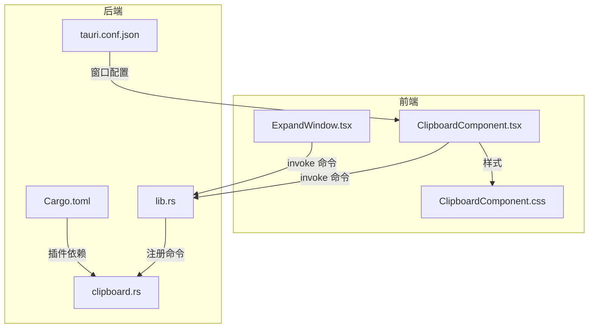
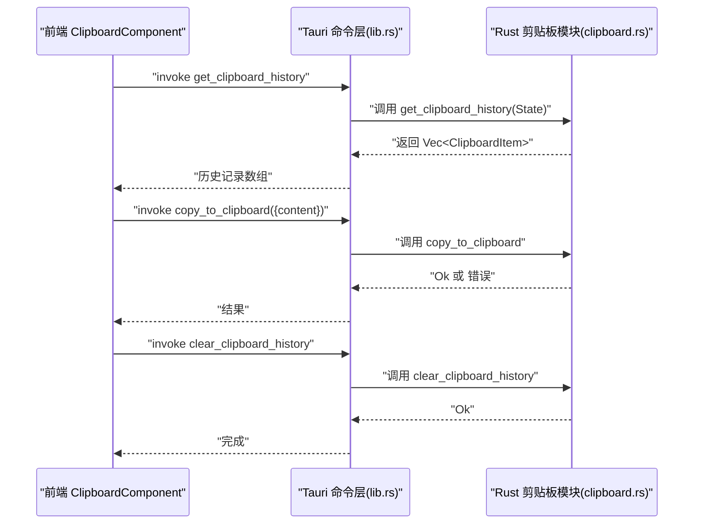
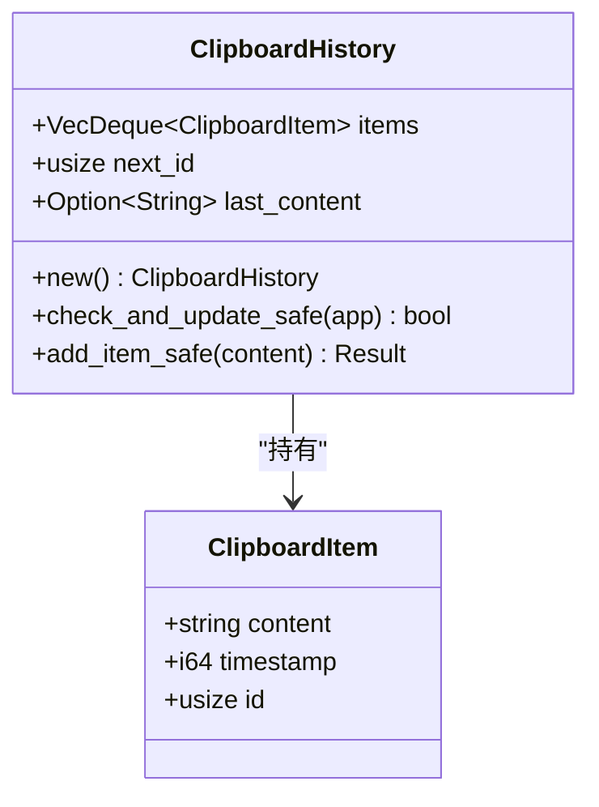
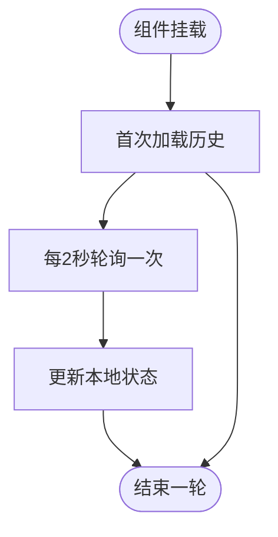
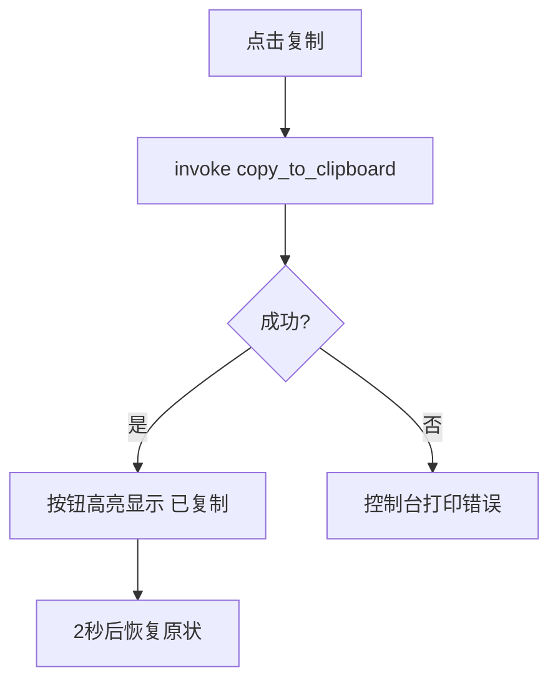
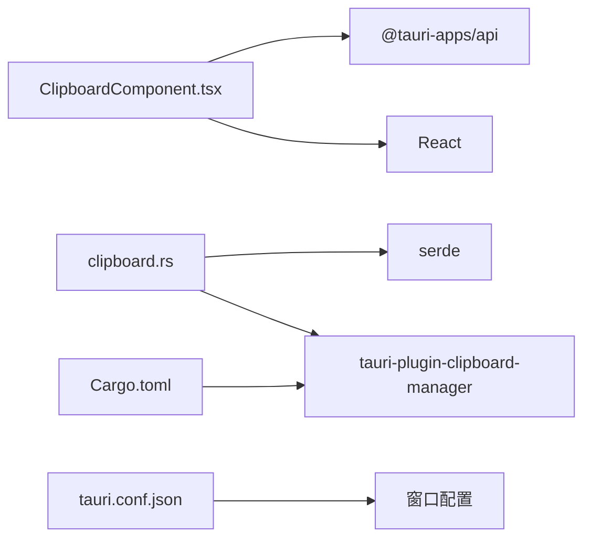

# 剪贴板历史记录

<cite>
**本文引用的文件列表**
- [ClipboardComponent.tsx](file://src/components/ClipboardComponent.tsx)
- [ClipboardComponent.css](file://src/components/ClipboardComponent.css)
- [clipboard.rs](file://src-tauri/src/clipboard.rs)
- [lib.rs](file://src-tauri/src/lib.rs)
- [Cargo.toml](file://src-tauri/Cargo.toml)
- [tauri.conf.json](file://src-tauri/tauri.conf.json)
- [App.tsx](file://src/App.tsx)
- [ExpandWindow.tsx](file://src/components/ExpandWindow.tsx)
- [MenuPanel.tsx](file://src/components/MenuPanel.tsx)
- [PetComponent.tsx](file://src/components/PetComponent.tsx)
</cite>

## 目录
1. [简介](#简介)
2. [项目结构](#项目结构)
3. [核心组件](#核心组件)
4. [架构总览](#架构总览)
5. [详细组件分析](#详细组件分析)
6. [依赖关系分析](#依赖关系分析)
7. [性能考量](#性能考量)
8. [故障排查指南](#故障排查指南)
9. [结论](#结论)
10. [附录](#附录)

## 简介
本文件面向“剪贴板历史记录”功能，提供从数据结构、存储机制、加载刷新、UI 展示到性能优化与错误处理的完整技术文档。该功能以 Tauri 为后端，React 为前端，通过命令桥接实现跨语言调用，支持定时轮询、内容去重、时间戳记录、内容截断与大小计算，并提供简洁直观的 UI 展示与交互反馈。

## 项目结构
剪贴板历史记录涉及前端组件、样式、后端命令与窗口管理等模块：
- 前端
  - 历史记录列表组件：负责轮询、渲染、交互（复制、展开、清空、关闭）
  - 样式：统一视觉风格与交互反馈
  - 扩展窗口：编辑/查看历史项的增强视图
- 后端
  - 历史记录数据结构与命令：存储、查询、清理、复制
  - 应用窗口管理：创建/显示/聚焦特定窗口
  - 依赖：clipboard-manager 插件、线程同步、锁保护

图表来源
- [ClipboardComponent.tsx:1-182](file://src/components/ClipboardComponent.tsx#L1-L182)
- [ExpandWindow.tsx:1-168](file://src/components/ExpandWindow.tsx#L1-L168)
- [ClipboardComponent.css:1-396](file://src/components/ClipboardComponent.css#L1-L396)
- [lib.rs:1-1115](file://src-tauri/src/lib.rs#L1-L1115)
- [clipboard.rs:1-251](file://src-tauri/src/clipboard.rs#L1-L251)
- [Cargo.toml:1-44](file://src-tauri/Cargo.toml#L1-L44)
- [tauri.conf.json:1-74](file://src-tauri/tauri.conf.json#L1-L74)

章节来源
- [ClipboardComponent.tsx:1-182](file://src/components/ClipboardComponent.tsx#L1-L182)
- [clipboard.rs:1-251](file://src-tauri/src/clipboard.rs#L1-L251)
- [lib.rs:1-1115](file://src-tauri/src/lib.rs#L1-L1115)
- [Cargo.toml:1-44](file://src-tauri/Cargo.toml#L1-L44)
- [tauri.conf.json:1-74](file://src-tauri/tauri.conf.json#L1-L74)

## 核心组件
- 剪贴板历史记录组件（前端）
  - 负责定时轮询历史记录、渲染列表、复制项、打开扩展窗口、清空历史、关闭窗口
  - 提供时间格式化、内容截断、大小计算与加载/空状态 UI
- 剪贴板历史记录（后端）
  - 数据结构：历史项包含内容、时间戳、自增 ID；使用双端队列维护顺序
  - 命令：获取历史、添加到历史、复制到剪贴板、清空历史、手动检查
  - 去重策略：与最近一次内容相同则不重复添加
  - 容量控制：最多保留固定数量的历史项
- 扩展窗口（前端）
  - 编辑/查看历史项，支持自动格式化、保存到剪贴板并写入历史
- 应用窗口管理（后端）
  - 统一创建/显示/聚焦窗口，注入初始内容

章节来源
- [ClipboardComponent.tsx:1-182](file://src/components/ClipboardComponent.tsx#L1-L182)
- [clipboard.rs:1-251](file://src-tauri/src/clipboard.rs#L1-L251)
- [ExpandWindow.tsx:1-168](file://src/components/ExpandWindow.tsx#L1-L168)
- [lib.rs:75-112](file://src-tauri/src/lib.rs#L75-L112)

## 架构总览
前后端通过 Tauri 命令桥连接，前端发起 invoke 调用，后端在 Rust 中执行业务逻辑并返回结果。

图表来源
- [ClipboardComponent.tsx:23-61](file://src/components/ClipboardComponent.tsx#L23-L61)
- [lib.rs:124-134](file://src-tauri/src/lib.rs#L124-L134)
- [clipboard.rs:160-185](file://src-tauri/src/clipboard.rs#L160-L185)
- [clipboard.rs:193-212](file://src-tauri/src/clipboard.rs#L193-L212)

## 详细组件分析

### 数据结构与存储机制
- 历史项结构
  - 字段：内容、时间戳、自增 ID
  - 类型：前端使用数字时间戳，后端使用秒级整数时间戳
- 存储容器
  - 后端采用双端队列（VecDeque）+ 互斥锁（Mutex），保证并发安全
  - 维护 next_id 作为自增 ID，last_content 记录上次内容，用于去重
- 去重策略
  - 若新内容与最近一条历史项内容一致，则跳过添加
- 容量控制
  - 最大历史项数量固定，超出时从尾部弹出旧项
- 时间戳记录
  - 添加时记录当前系统时间（秒）

图表来源
- [clipboard.rs:7-18](file://src-tauri/src/clipboard.rs#L7-L18)
- [clipboard.rs:20-121](file://src-tauri/src/clipboard.rs#L20-L121)

章节来源
- [clipboard.rs:7-18](file://src-tauri/src/clipboard.rs#L7-L18)
- [clipboard.rs:20-121](file://src-tauri/src/clipboard.rs#L20-L121)

### 加载与刷新机制
- 定时轮询
  - 前端组件挂载后立即加载一次，随后每 2 秒轮询一次
  - 轮询期间设置加载状态，避免重复请求
- 事件触发
  - 手动复制、清空、打开扩展窗口均通过命令触发，完成后根据需要刷新列表
- 状态管理
  - 复制反馈：单个历史项复制成功后短暂高亮
  - 清空历史：调用后前端清空本地列表
  - 空状态：当历史为空时显示提示文案

图表来源
- [ClipboardComponent.tsx:17-32](file://src/components/ClipboardComponent.tsx#L17-L32)

章节来源
- [ClipboardComponent.tsx:17-32](file://src/components/ClipboardComponent.tsx#L17-L32)

### 数据格式与内容处理
- 纯文本处理
  - 前端渲染时对内容进行截断（默认 100 字符），并在 UI 上显示字节大小
  - 扩展窗口支持自动格式化（JSON/逗号分隔），并显示字符数与字节大小
- 长度限制与大小计算
  - 后端命令对内容长度进行上限校验（例如 10000 字符）
  - 前端使用 Blob 计算字节大小，按 B/KB/MB 格式化
- 截断策略
  - 前端截断仅影响展示，不修改实际内容
  - 后端在添加时也提供截断预览，便于日志输出

章节来源
- [ClipboardComponent.tsx:88-98](file://src/components/ClipboardComponent.tsx#L88-L98)
- [ExpandWindow.tsx:79-84](file://src/components/ExpandWindow.tsx#L79-L84)
- [clipboard.rs:140-157](file://src-tauri/src/clipboard.rs#L140-L157)
- [clipboard.rs:165-171](file://src-tauri/src/clipboard.rs#L165-L171)

### UI 展示与交互反馈
- 时间格式化
  - 刚刚、N 分钟前、N 小时前、日期
- 内容截断
  - 默认截断长度 100 字符，超出部分省略
- 状态指示
  - 加载中：旋转动画与提示
  - 空状态：提示“暂无历史”
  - 复制反馈：按钮高亮并显示“已复制”
- 交互
  - 复制：调用后端复制命令
  - 展开：打开独立窗口编辑/查看
  - 清空：清空后端历史并重置前端状态
  - 关闭：关闭当前窗口

图表来源
- [ClipboardComponent.tsx:34-44](file://src/components/ClipboardComponent.tsx#L34-L44)

章节来源
- [ClipboardComponent.tsx:72-98](file://src/components/ClipboardComponent.tsx#L72-L98)
- [ClipboardComponent.css:1-396](file://src/components/ClipboardComponent.css#L1-L396)

### 命令与窗口管理
- 历史记录命令
  - 获取历史：返回当前所有历史项
  - 添加到历史：手动添加并写入剪贴板
  - 复制到剪贴板：将内容写入系统剪贴板
  - 清空历史：清空后端状态并重置计数器
  - 手动检查：检查当前剪贴板是否有新内容
- 扩展窗口
  - 注入初始内容，支持编辑、保存、复制
  - 保存时同时写入剪贴板与历史
- 窗口创建与显示
  - 通过统一的窗口管理函数创建/显示指定标签的窗口
  - 支持开发/生产环境不同入口

章节来源
- [clipboard.rs:124-224](file://src-tauri/src/clipboard.rs#L124-L224)
- [lib.rs:75-112](file://src-tauri/src/lib.rs#L75-L112)
- [ExpandWindow.tsx:1-168](file://src/components/ExpandWindow.tsx#L1-L168)
- [MenuPanel.tsx:111-124](file://src/components/MenuPanel.tsx#L111-L124)
- [PetComponent.tsx:283-340](file://src/components/PetComponent.tsx#L283-L340)

## 依赖关系分析
- 前端依赖
  - @tauri-apps/api：命令调用、窗口控制
  - React：状态管理与渲染
- 后端依赖
  - tauri-plugin-clipboard-manager：读写剪贴板
  - serde：序列化/反序列化
  - Mutex/VecDeque：线程安全与容量控制
- 构建与打包
  - Tauri 配置定义窗口属性与能力
  - Cargo.toml 声明插件与运行时依赖

图表来源
- [Cargo.toml:15-31](file://src-tauri/Cargo.toml#L15-L31)
- [clipboard.rs:1-5](file://src-tauri/src/clipboard.rs#L1-L5)
- [tauri.conf.json:1-74](file://src-tauri/tauri.conf.json#L1-L74)

章节来源
- [Cargo.toml:15-31](file://src-tauri/Cargo.toml#L15-L31)
- [clipboard.rs:1-5](file://src-tauri/src/clipboard.rs#L1-L5)
- [tauri.conf.json:1-74](file://src-tauri/tauri.conf.json#L1-L74)

## 性能考量
- 内存管理
  - 后端使用双端队列与互斥锁，容量固定，避免无限增长
  - 去重减少重复内容占用
- 渲染优化
  - 前端轮询间隔 2 秒，频率适中，避免频繁重渲染
  - 列表项使用简单结构，仅在复制时局部更新状态
- I/O 与网络
  - 剪贴板读写为本地操作，无网络依赖
- 并发安全
  - 对共享状态加锁访问，防止竞态条件

章节来源
- [clipboard.rs:14-27](file://src-tauri/src/clipboard.rs#L14-L27)
- [clipboard.rs:29-82](file://src-tauri/src/clipboard.rs#L29-L82)
- [ClipboardComponent.tsx:17-21](file://src/components/ClipboardComponent.tsx#L17-L21)

## 故障排查指南
- 常见错误与恢复
  - 获取历史失败：前端捕获异常并保持加载状态，建议检查后端命令是否注册
  - 复制失败：前端打印错误，检查剪贴板权限与内容长度
  - 清空历史失败：前端打印错误，确认后端命令执行结果
  - 窗口创建超时：检查窗口标签与入口路径，确保前端路由正确
- 日志与调试
  - 后端命令打印关键信息（如添加/清空/复制），便于定位问题
  - 前端控制台输出错误信息，结合后端日志定位

章节来源
- [ClipboardComponent.tsx:27-60](file://src/components/ClipboardComponent.tsx#L27-L60)
- [clipboard.rs:128-134](file://src-tauri/src/clipboard.rs#L128-L134)
- [clipboard.rs:164-185](file://src-tauri/src/clipboard.rs#L164-L185)
- [clipboard.rs:196-212](file://src-tauri/src/clipboard.rs#L196-L212)
- [PetComponent.tsx:314-328](file://src/components/PetComponent.tsx#L314-L328)

## 结论
剪贴板历史记录功能通过前后端清晰的职责划分与命令桥接，实现了稳定的时间戳记录、内容去重、容量控制与简洁的 UI 展示。定时轮询与状态管理确保了良好的用户体验，而严格的长度限制与大小计算保障了性能与可靠性。后续可在以下方面进一步优化：
- 增加用户可配置的最大历史条数
- 引入增量刷新或事件驱动更新
- 增强错误提示与重试机制
- 支持更多内容类型（富文本、图片等）

## 附录
- 剪贴板窗口创建流程（概览）
  - 通过统一函数创建窗口，注入初始内容，显示并聚焦
  - 开发/生产环境分别指向不同入口

章节来源
- [MenuPanel.tsx:111-124](file://src/components/MenuPanel.tsx#L111-L124)
- [PetComponent.tsx:283-340](file://src/components/PetComponent.tsx#L283-L340)
- [lib.rs:75-112](file://src-tauri/src/lib.rs#L75-L112)