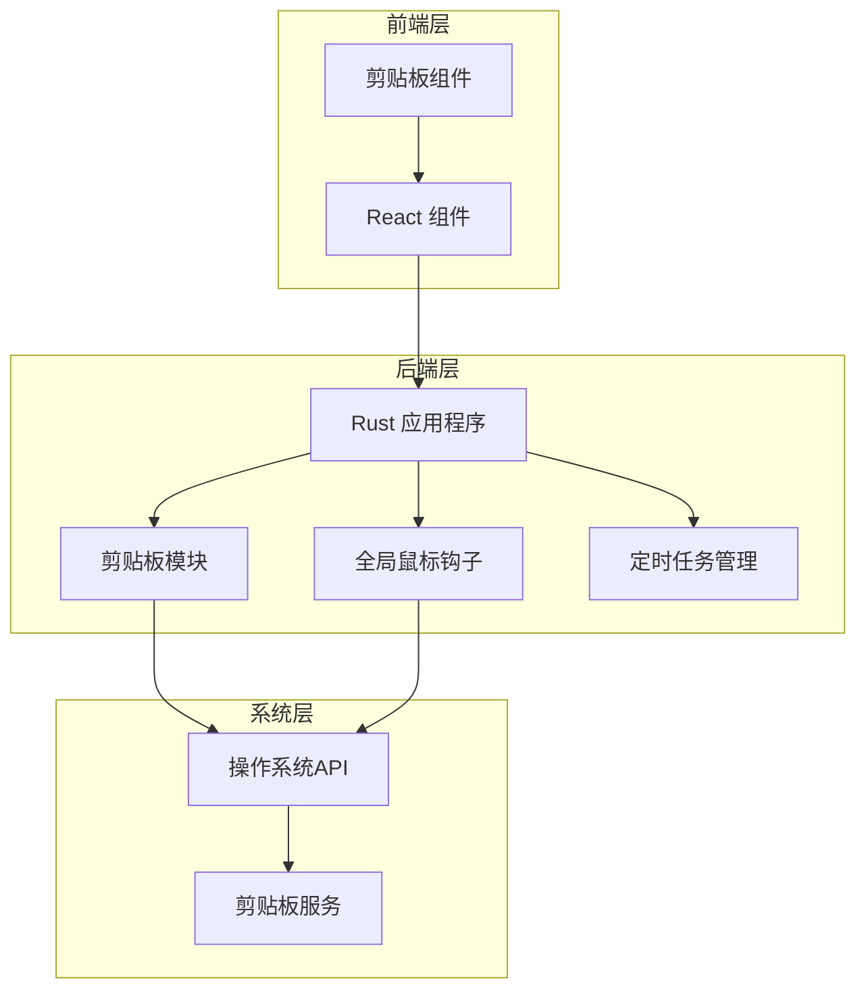
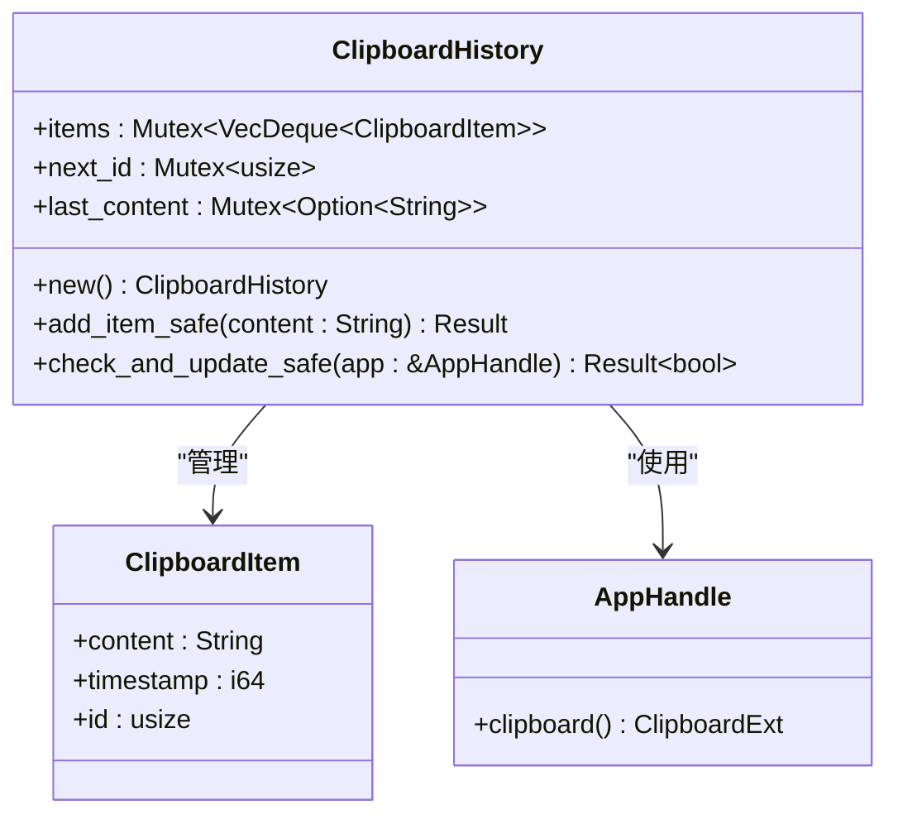
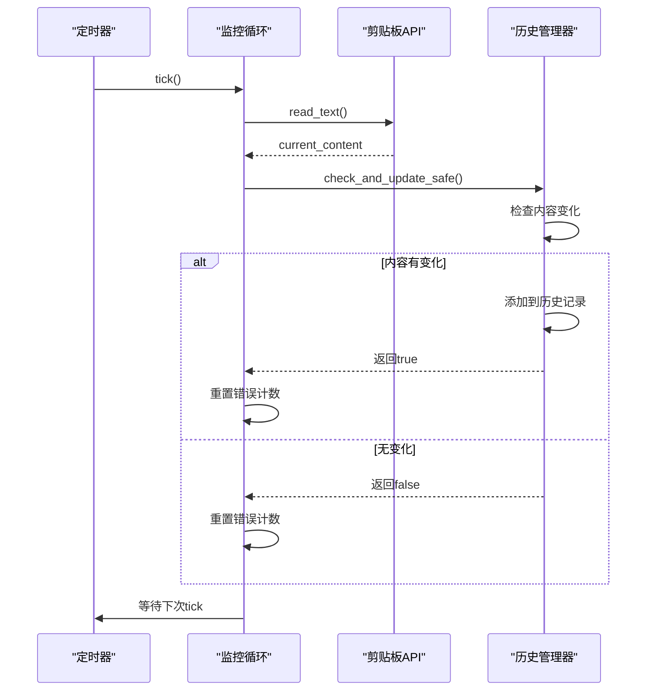
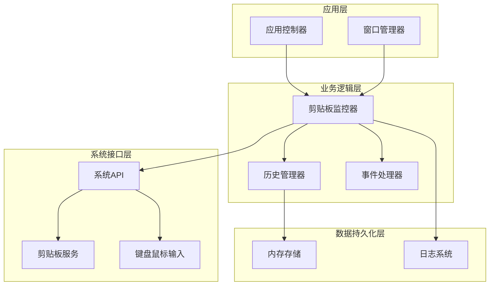
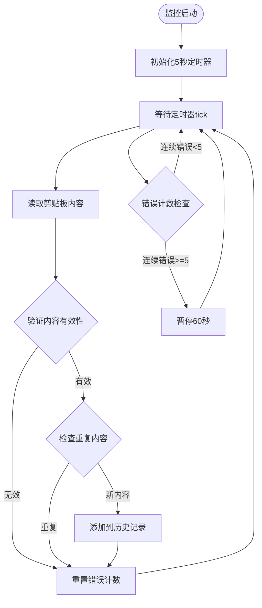
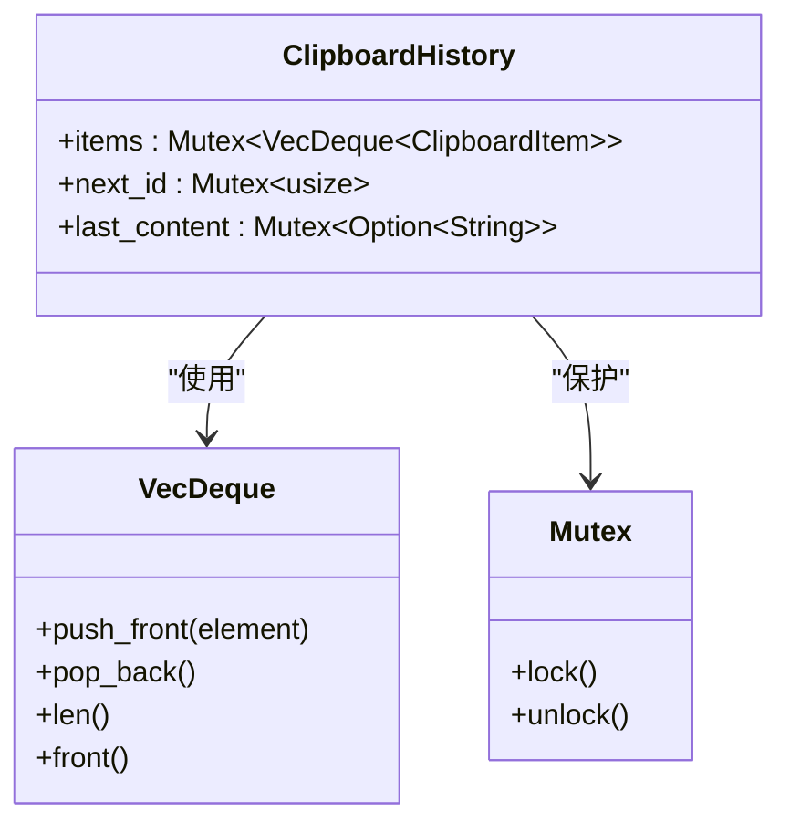
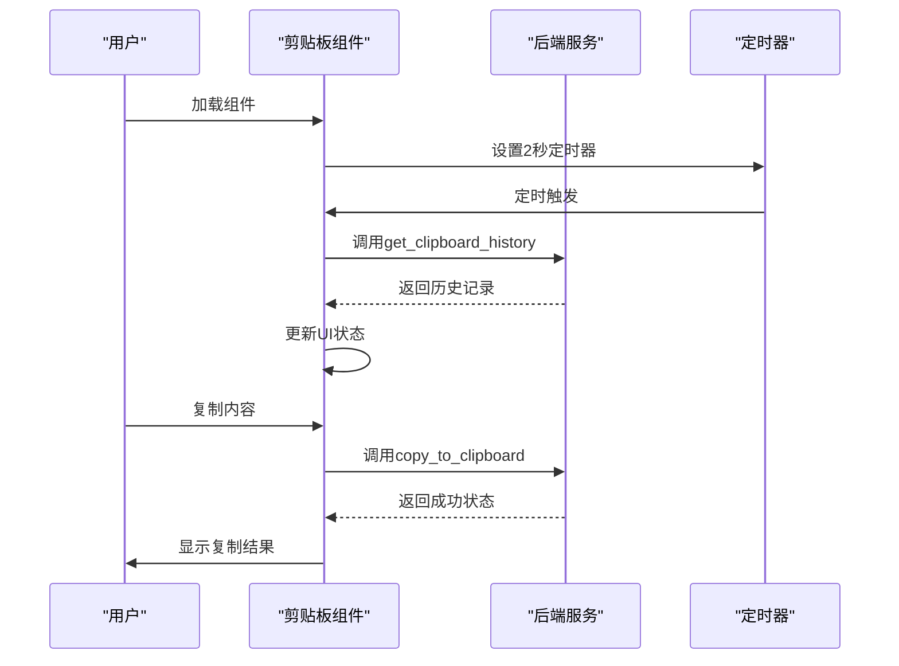
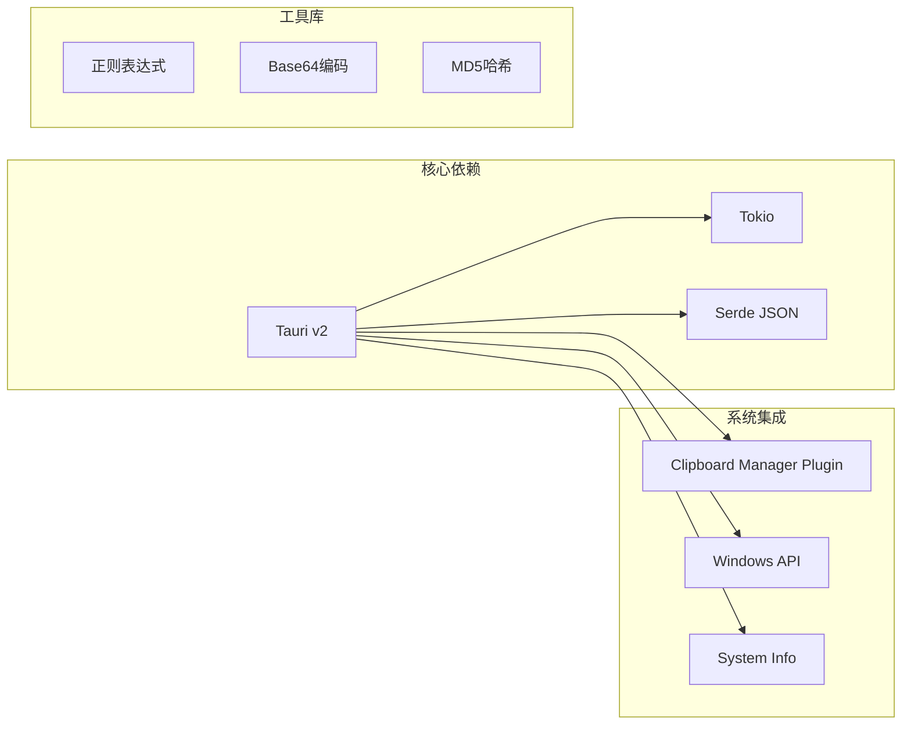
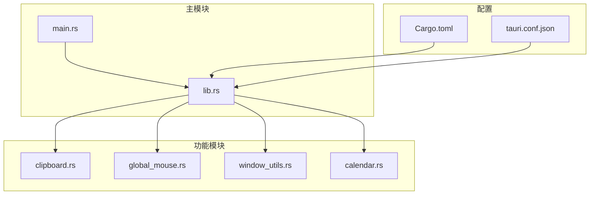

# 剪贴板监控机制

<cite>
**本文档引用的文件**
- [clipboard.rs](file://src-tauri/src/clipboard.rs)
- [lib.rs](file://src-tauri/src/lib.rs)
- [global_mouse.rs](file://src-tauri/src/global_mouse.rs)
- [ClipboardComponent.tsx](file://src/components/ClipboardComponent.tsx)
- [Cargo.toml](file://src-tauri/Cargo.toml)
- [tauri.conf.json](file://src-tauri/tauri.conf.json)
</cite>

## 目录
1. [简介](#简介)
2. [项目结构](#项目结构)
3. [核心组件](#核心组件)
4. [架构概览](#架构概览)
5. [详细组件分析](#详细组件分析)
6. [依赖关系分析](#依赖关系分析)
7. [性能考虑](#性能考虑)
8. [故障排除指南](#故障排除指南)
9. [结论](#结论)

## 简介

本项目实现了桌面应用程序的剪贴板监控机制，通过系统级API调用和事件监听实现对用户剪贴板内容的实时监控。该机制采用异步轮询策略，在后台持续检查剪贴板变化，自动捕获用户复制的内容并维护历史记录。

## 项目结构

该项目采用Tauri框架构建，前端使用React，后端使用Rust实现系统级功能。剪贴板监控机制主要分布在以下模块：

**图表来源**
- [lib.rs:1067-1103](file://src-tauri/src/lib.rs#L1067-L1103)
- [clipboard.rs:1-251](file://src-tauri/src/clipboard.rs#L1-L251)

**章节来源**
- [lib.rs:1-1113](file://src-tauri/src/lib.rs#L1-L1113)
- [Cargo.toml:15-44](file://src-tauri/Cargo.toml#L15-L44)

## 核心组件

### 剪贴板历史管理器

剪贴板历史管理器是整个监控机制的核心组件，负责存储和管理剪贴板历史记录。

**图表来源**
- [clipboard.rs:7-122](file://src-tauri/src/clipboard.rs#L7-L122)

### 异步监控循环

系统使用Tokio异步运行时实现高效的监控循环，采用指数退避策略处理错误情况。

**图表来源**
- [lib.rs:1067-1103](file://src-tauri/src/lib.rs#L1067-L1103)
- [clipboard.rs:85-121](file://src-tauri/src/clipboard.rs#L85-L121)

**章节来源**
- [clipboard.rs:14-122](file://src-tauri/src/clipboard.rs#L14-L122)
- [lib.rs:1067-1103](file://src-tauri/src/lib.rs#L1067-L1103)

## 架构概览

剪贴板监控机制采用分层架构设计，确保系统的可维护性和扩展性：

**图表来源**
- [lib.rs:1000-1113](file://src-tauri/src/lib.rs#L1000-L1113)
- [clipboard.rs:1-251](file://src-tauri/src/clipboard.rs#L1-L251)

## 详细组件分析

### 剪贴板监控器实现

剪贴板监控器采用异步非阻塞方式实现，避免影响主界面响应性。

#### 监控循环设计

监控循环使用Tokio的interval定时器实现，具有以下特点：

- **轮询间隔**: 默认5秒，可根据需要调整
- **错误处理**: 连续5次错误后暂停60秒，防止系统资源浪费
- **内存管理**: 自动清理超出限制的历史记录

**图表来源**
- [lib.rs:1067-1103](file://src-tauri/src/lib.rs#L1067-L1103)

#### 数据采集流程

数据采集过程包括多个验证步骤，确保数据质量和系统稳定性：

1. **内容获取**: 通过系统API获取当前剪贴板文本
2. **格式检测**: 检查内容是否为空或过长
3. **变化判断**: 比较当前内容与上次内容的差异
4. **历史记录**: 将新内容添加到历史队列

**章节来源**
- [clipboard.rs:85-121](file://src-tauri/src/clipboard.rs#L85-L121)

### 历史记录管理

历史记录管理系统采用双缓冲设计，确保线程安全和数据一致性。

#### 数据结构设计

**图表来源**
- [clipboard.rs:14-18](file://src-tauri/src/clipboard.rs#L14-L18)

#### 内存控制策略

- **容量限制**: 最大保留5条历史记录
- **自动清理**: 超出限制时自动移除最旧记录
- **锁粒度**: 分离不同数据字段的锁，提高并发性能

**章节来源**
- [clipboard.rs:29-82](file://src-tauri/src/clipboard.rs#L29-L82)

### 前端交互组件

前端剪贴板组件提供用户友好的界面，支持实时查看和管理历史记录。

#### 组件生命周期

**图表来源**
- [ClipboardComponent.tsx:17-32](file://src/components/ClipboardComponent.tsx#L17-L32)

**章节来源**
- [ClipboardComponent.tsx:1-182](file://src/components/ClipboardComponent.tsx#L1-L182)

## 依赖关系分析

### 外部依赖

项目使用多个关键依赖实现剪贴板监控功能：

**图表来源**
- [Cargo.toml:15-44](file://src-tauri/Cargo.toml#L15-L44)

### 内部模块依赖

**图表来源**
- [main.rs:1-11](file://src-tauri/src/main.rs#L1-L11)
- [lib.rs:1-31](file://src-tauri/src/lib.rs#L1-L31)

**章节来源**
- [Cargo.toml:15-44](file://src-tauri/Cargo.toml#L15-L44)
- [main.rs:1-11](file://src-tauri/src/main.rs#L1-L11)

## 性能考虑

### CPU使用率优化

1. **异步非阻塞**: 使用Tokio异步运行时避免阻塞主线程
2. **智能轮询**: 5秒轮询间隔平衡响应性和资源消耗
3. **错误退避**: 连续错误时自动延长等待时间
4. **内存管理**: 自动清理超限历史记录

### 内存控制策略

- **容量限制**: 历史记录最多5条，避免内存泄漏
- **锁分离**: 不同数据字段使用独立锁，减少锁竞争
- **及时释放**: 使用drop显式释放锁，避免死锁

### 系统资源管理

- **线程池**: 利用Tokio的多线程运行时
- **定时器复用**: 单一定时器管理所有监控任务
- **错误恢复**: 自动错误检测和恢复机制

## 故障排除指南

### 常见问题及解决方案

#### 剪贴板监控不工作

**症状**: 历史记录不更新，定时器无输出

**排查步骤**:
1. 检查应用日志中的"剪贴板监控任务启动"消息
2. 验证定时器是否正常运行（每5秒一次）
3. 确认错误计数是否超过阈值（连续5次错误会暂停）

**解决方案**:
- 重启应用程序
- 检查系统权限设置
- 查看详细的错误日志

#### 内容重复问题

**症状**: 相同内容多次出现

**原因分析**:
- 系统API返回的剪贴板内容包含隐藏字符
- 用户频繁复制相同内容

**解决方法**:
- 检查内容去空白处理
- 实施更严格的重复检测算法

#### 内存占用过高

**症状**: 应用程序内存使用持续增长

**诊断方法**:
1. 监控历史记录数量（应保持在5条以内）
2. 检查是否有内存泄漏
3. 验证锁的正确使用

**预防措施**:
- 确保历史记录自动清理机制正常工作
- 定期检查锁的使用情况
- 监控应用程序性能指标

**章节来源**
- [lib.rs:1086-1100](file://src-tauri/src/lib.rs#L1086-L1100)
- [clipboard.rs:37-42](file://src-tauri/src/clipboard.rs#L37-L42)

### 调试方法

#### 日志分析

系统提供了详细的日志输出，用于调试和监控：

- **启动日志**: "剪贴板监控任务启动"
- **成功日志**: "✓ 检测到新的剪贴板内容"
- **错误日志**: 包含错误计数和具体错误信息
- **操作日志**: 内容添加、删除等操作记录

#### 性能监控

- **CPU使用率**: 监控应用程序的CPU占用
- **内存使用**: 跟踪历史记录数量和内存占用
- **磁盘I/O**: 检查日志文件大小和写入频率

## 结论

本剪贴板监控机制通过精心设计的架构和优化策略，实现了高效、可靠的剪贴板内容监控功能。系统采用异步非阻塞设计，确保不影响用户体验，同时具备完善的错误处理和性能优化机制。

### 主要优势

1. **高可靠性**: 智能错误处理和自动恢复机制
2. **高性能**: 异步设计和内存优化策略
3. **易维护**: 清晰的模块划分和接口设计
4. **用户友好**: 提供直观的前端界面和实时反馈

### 改进建议

1. **配置化**: 增加更多可配置参数（监控频率、历史记录数量等）
2. **扩展性**: 支持多种剪贴板格式（图片、文件等）
3. **安全性**: 增强敏感内容的处理和存储安全
4. **跨平台**: 扩展到其他操作系统平台

该机制为桌面应用程序提供了强大的剪贴板监控能力，可以作为其他类似功能的基础架构参考。