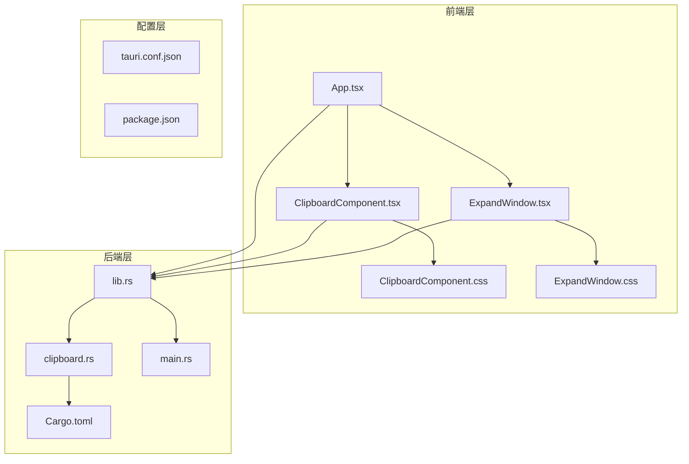
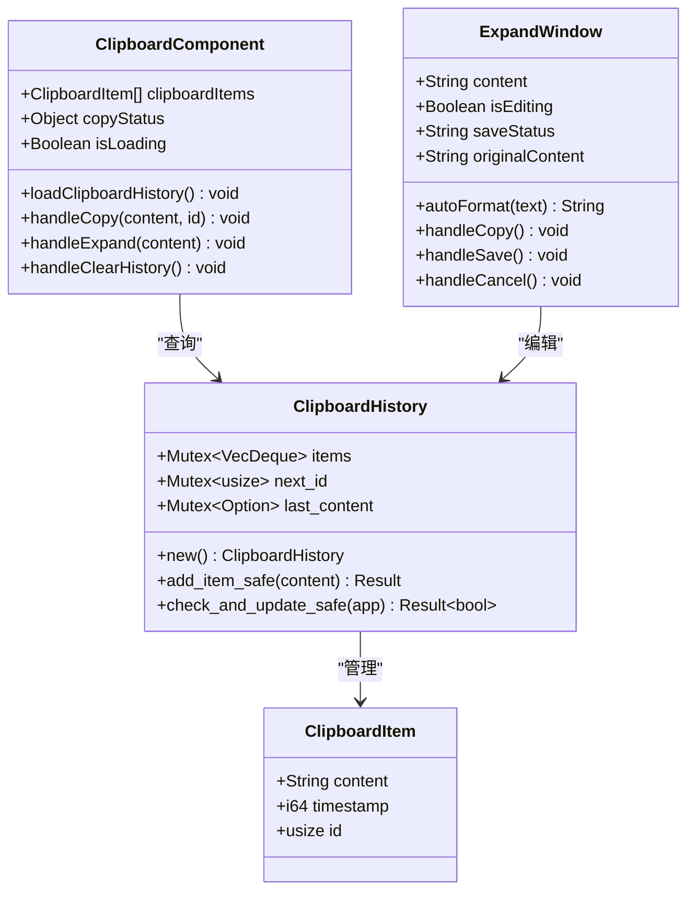
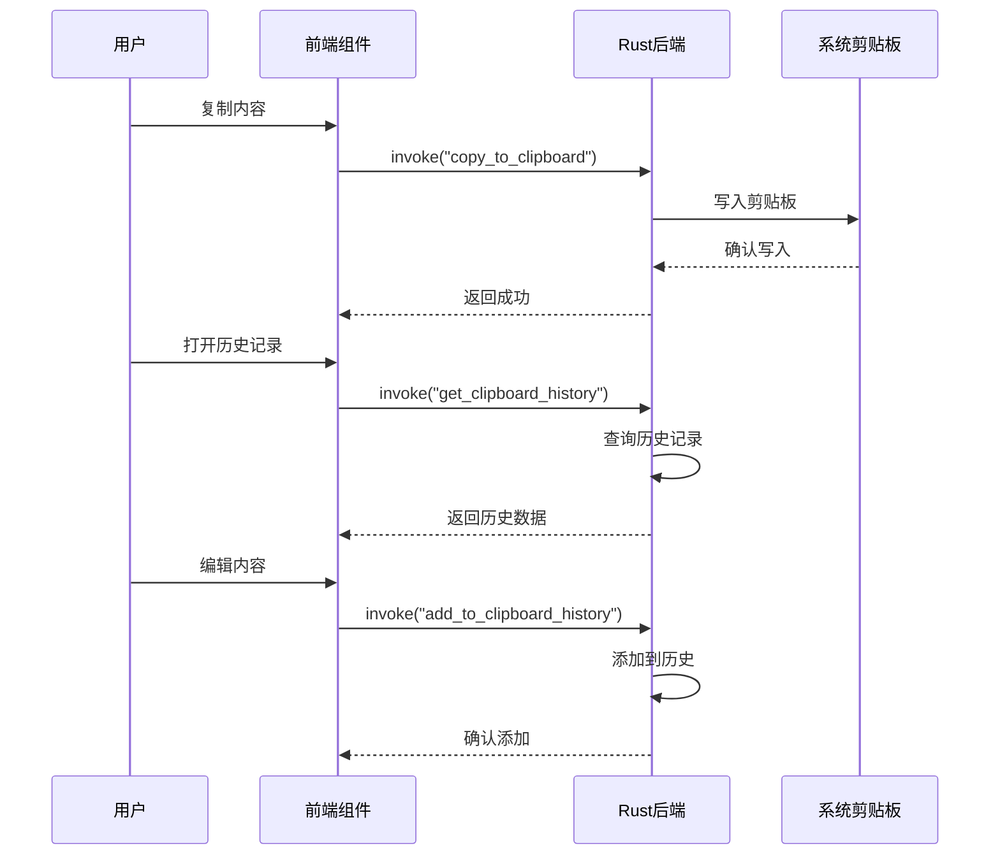
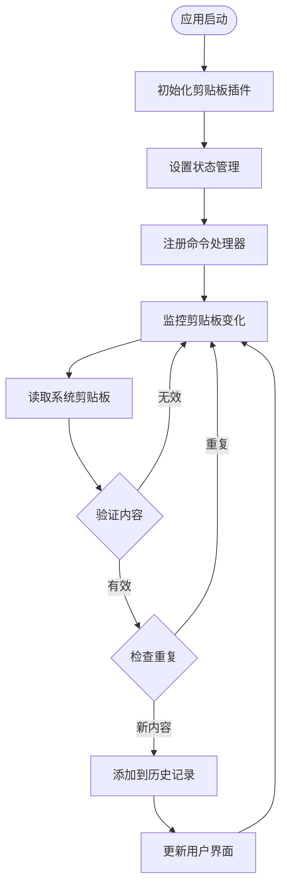
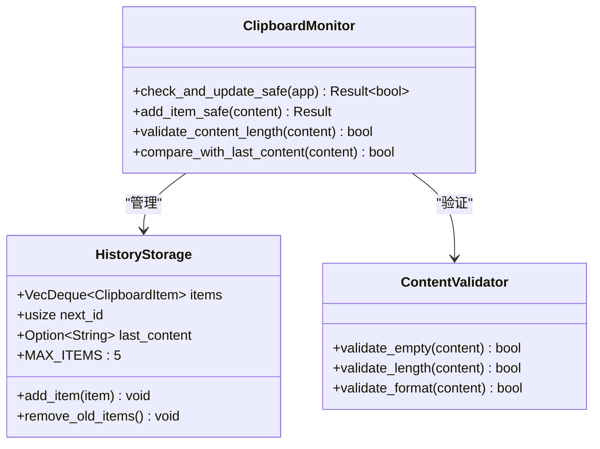
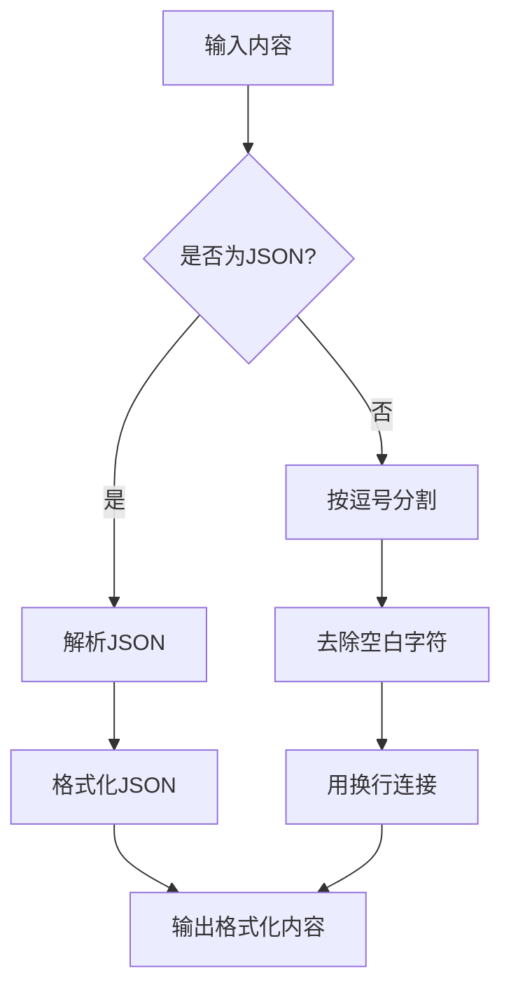
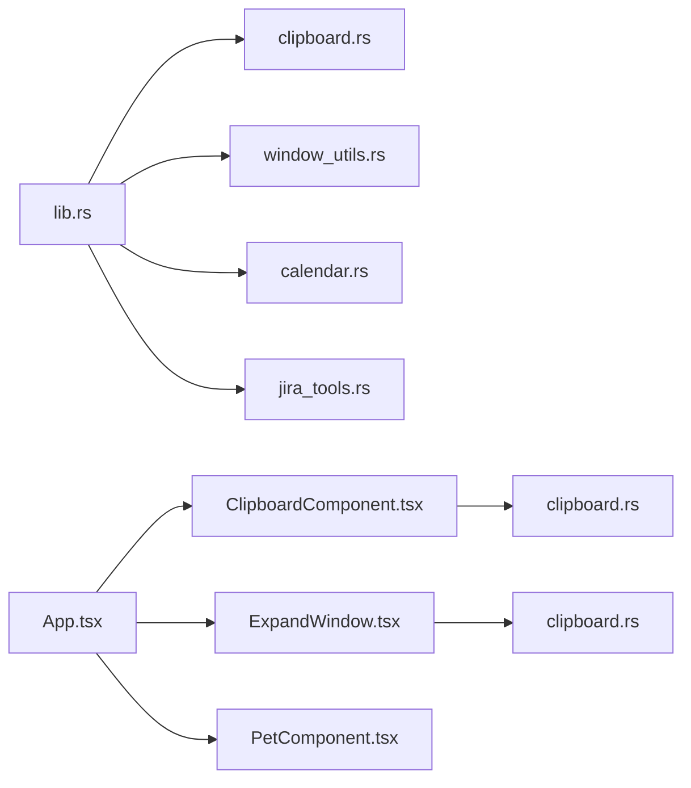

# 剪贴板管理器

<cite>
**本文档引用的文件**
- [ClipboardComponent.tsx](file://src/components/ClipboardComponent.tsx)
- [ExpandWindow.tsx](file://src/components/ExpandWindow.tsx)
- [clipboard.rs](file://src-tauri/src/clipboard.rs)
- [lib.rs](file://src-tauri/src/lib.rs)
- [Cargo.toml](file://src-tauri/Cargo.toml)
- [tauri.conf.json](file://src-tauri/tauri.conf.json)
- [ClipboardComponent.css](file://src/components/ClipboardComponent.css)
- [ExpandWindow.css](file://src/components/ExpandWindow.css)
- [App.tsx](file://src/App.tsx)
</cite>

## 目录
1. [简介](#简介)
2. [项目结构](#项目结构)
3. [核心组件](#核心组件)
4. [架构概览](#架构概览)
5. [详细组件分析](#详细组件分析)
6. [依赖关系分析](#依赖关系分析)
7. [性能考虑](#性能考虑)
8. [故障排除指南](#故障排除指南)
9. [结论](#结论)

## 简介

剪贴板管理器是一个基于Tauri框架开发的桌面应用程序，提供了完整的剪贴板历史记录管理功能。该系统能够自动捕获用户复制的内容，维护历史记录，提供内容编辑和格式化功能，并支持手动刷新和清理操作。

本项目采用前后端分离的架构设计，前端使用React构建用户界面，后端使用Rust实现系统级的剪贴板监控和数据管理。通过Tauri的桥接机制，实现了安全高效的跨语言通信。

## 项目结构

项目采用模块化的组织方式，主要分为前端组件和后端服务两个部分：



**图表来源**
- [App.tsx:17-55](file://src/App.tsx#L17-L55)
- [lib.rs:832-884](file://src-tauri/src/lib.rs#L832-L884)
- [clipboard.rs:1-251](file://src-tauri/src/clipboard.rs#L1-L251)

**章节来源**
- [App.tsx:1-57](file://src/App.tsx#L1-L57)
- [lib.rs:832-884](file://src-tauri/src/lib.rs#L832-L884)

## 核心组件

### 剪贴板历史数据模型

系统使用统一的数据结构来表示剪贴板历史项：



**图表来源**
- [clipboard.rs:7-18](file://src-tauri/src/clipboard.rs#L7-L18)
- [clipboard.rs:20-121](file://src-tauri/src/clipboard.rs#L20-L121)
- [ClipboardComponent.tsx:6-10](file://src/components/ClipboardComponent.tsx#L6-L10)
- [ExpandWindow.tsx:6-11](file://src/components/ExpandWindow.tsx#L6-L11)

### 数据结构设计特点

1. **线程安全**: 使用Mutex确保多线程环境下的数据一致性
2. **内存优化**: 限制历史记录数量为5条，避免内存泄漏
3. **去重机制**: 防止重复内容的多次存储
4. **时间戳记录**: 精确记录每条历史的时间信息

**章节来源**
- [clipboard.rs:14-27](file://src-tauri/src/clipboard.rs#L14-L27)
- [clipboard.rs:29-82](file://src-tauri/src/clipboard.rs#L29-L82)

## 架构概览

系统采用分层架构设计，实现了清晰的职责分离：



**图表来源**
- [ClipboardComponent.tsx:34-52](file://src/components/ClipboardComponent.tsx#L34-L52)
- [clipboard.rs:124-134](file://src-tauri/src/clipboard.rs#L124-L134)
- [clipboard.rs:136-158](file://src-tauri/src/clipboard.rs#L136-L158)

### 系统API调用流程



**图表来源**
- [lib.rs:832-884](file://src-tauri/src/lib.rs#L832-L884)
- [clipboard.rs:85-121](file://src-tauri/src/clipboard.rs#L85-L121)

## 详细组件分析

### 剪贴板历史管理组件

#### 组件职责
- 实时监控系统剪贴板变化
- 存储和管理历史记录
- 提供内容去重和时间戳管理
- 支持手动刷新和清理操作

#### 核心功能实现



**图表来源**
- [clipboard.rs:20-121](file://src-tauri/src/clipboard.rs#L20-L121)
- [clipboard.rs:136-158](file://src-tauri/src/clipboard.rs#L136-L158)

#### 内容捕获时机

系统通过定时轮询机制监控剪贴板变化：

1. **自动检测**: 每2秒检查一次系统剪贴板内容
2. **手动刷新**: 用户可点击按钮强制刷新历史记录
3. **事件触发**: 通过Tauri事件系统响应外部触发

**章节来源**
- [ClipboardComponent.tsx:17-21](file://src/components/ClipboardComponent.tsx#L17-L21)
- [clipboard.rs:85-121](file://src-tauri/src/clipboard.rs#L85-L121)

### 展开窗口功能组件

#### 功能特性
- 长内容显示和编辑
- 自动格式化处理（JSON和逗号分隔）
- 内容复制和保存功能
- 实时内容大小计算

#### 格式化处理机制



**图表来源**
- [ExpandWindow.tsx:12-25](file://src/components/ExpandWindow.tsx#L12-L25)

**章节来源**
- [ExpandWindow.tsx:1-168](file://src/components/ExpandWindow.tsx#L1-L168)

### 前端界面组件

#### 剪贴板历史列表

界面组件负责展示和交互：

1. **实时更新**: 每2秒自动刷新历史记录
2. **内容预览**: 显示截断的文本内容
3. **元数据展示**: 时间戳和内容大小
4. **操作按钮**: 复制、编辑、清空功能

#### 展开窗口界面

提供完整的编辑和查看功能：

1. **编辑模式**: 文本区域支持内容修改
2. **查看模式**: 格式化显示原始内容
3. **状态反馈**: 操作结果的视觉反馈
4. **尺寸信息**: 实时显示内容大小和字符数

**章节来源**
- [ClipboardComponent.tsx:100-182](file://src/components/ClipboardComponent.tsx#L100-L182)
- [ExpandWindow.tsx:86-167](file://src/components/ExpandWindow.tsx#L86-L167)

## 依赖关系分析

### 外部依赖

系统依赖以下关键组件：

```mermaid
graph TB
subgraph "核心依赖"
A[Tauri v2]
B[tauri-plugin-clipboard-manager]
C[Rust标准库]
end
subgraph "前端依赖"
D[React]
E[@tauri-apps/api]
F[TypeScript]
end
subgraph "工具依赖"
G[tokio]
H[serde]
I[sysinfo]
end
A --> B
A --> C
D --> E
F --> E
A --> G
A --> H
A --> I
```

**图表来源**
- [Cargo.toml:15-35](file://src-tauri/Cargo.toml#L15-L35)
- [lib.rs:1-16](file://src-tauri/src/lib.rs#L1-L16)

### 内部模块依赖



**图表来源**
- [lib.rs:12-16](file://src-tauri/src/lib.rs#L12-L16)
- [App.tsx:1-16](file://src/App.tsx#L1-L16)

**章节来源**
- [Cargo.toml:1-43](file://src-tauri/Cargo.toml#L1-L43)
- [lib.rs:12-21](file://src-tauri/src/lib.rs#L12-L21)

## 性能考虑

### 内存管理优化

1. **历史记录限制**: 最大保留5条历史记录，避免内存膨胀
2. **智能去重**: 跳过重复内容的存储，减少不必要的操作
3. **锁粒度优化**: 使用细粒度锁提高并发性能
4. **内容截断**: 避免存储完整内容，仅存储必要的摘要信息

### 响应速度优化

1. **定时轮询**: 2秒间隔平衡响应性和性能
2. **异步操作**: 所有磁盘和网络操作使用异步执行
3. **缓存机制**: 避免重复的系统调用
4. **增量更新**: 仅在内容变化时更新界面

### 安全性考虑

1. **内容长度限制**: 防止过大内容导致系统资源耗尽
2. **类型验证**: 确保数据结构的完整性
3. **权限控制**: 通过Tauri的安全模型限制访问范围
4. **错误处理**: 完善的异常捕获和恢复机制

## 故障排除指南

### 常见问题及解决方案

#### 剪贴板监控失效

**症状**: 历史记录不更新
**原因**: 系统权限不足或插件初始化失败
**解决**: 
1. 检查系统剪贴板权限
2. 重启应用程序
3. 验证插件配置

#### 内容显示异常

**症状**: 特殊字符显示乱码
**原因**: 编码格式不兼容
**解决**:
1. 检查内容编码
2. 使用展开窗口进行格式化
3. 重新复制内容

#### 性能问题

**症状**: 应用响应缓慢
**原因**: 历史记录过多或频繁操作
**解决**:
1. 清理历史记录
2. 调整轮询间隔
3. 关闭不必要的窗口

**章节来源**
- [clipboard.rs:89-95](file://src-tauri/src/clipboard.rs#L89-L95)
- [clipboard.rs:145-147](file://src-tauri/src/clipboard.rs#L145-L147)

## 结论

剪贴板管理器项目展现了现代桌面应用开发的最佳实践。通过合理的架构设计、完善的错误处理和优化的性能考虑，实现了稳定可靠的剪贴板历史管理功能。

系统的主要优势包括：
- **模块化设计**: 清晰的职责分离便于维护和扩展
- **安全性保障**: 通过Tauri的安全模型保护系统资源
- **用户体验**: 直观的界面和流畅的操作体验
- **性能优化**: 智能的内存管理和响应式更新机制

未来可以考虑的功能增强包括：搜索和过滤功能、内容分类管理、跨平台同步支持等。