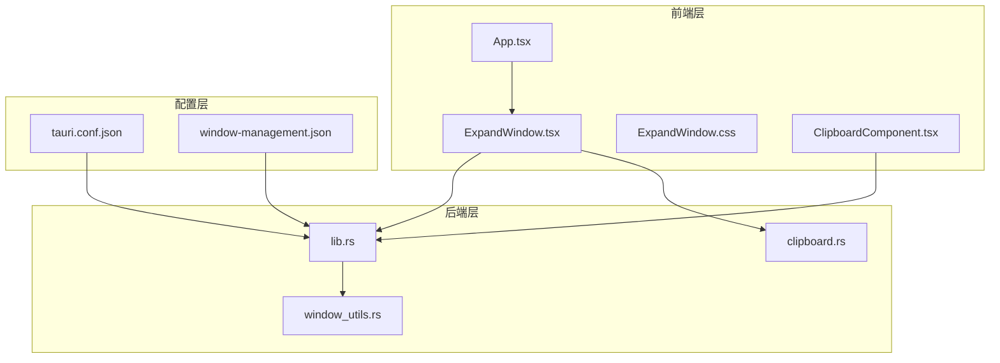
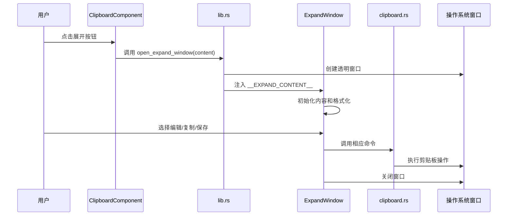
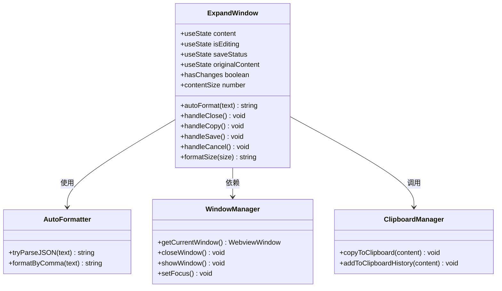
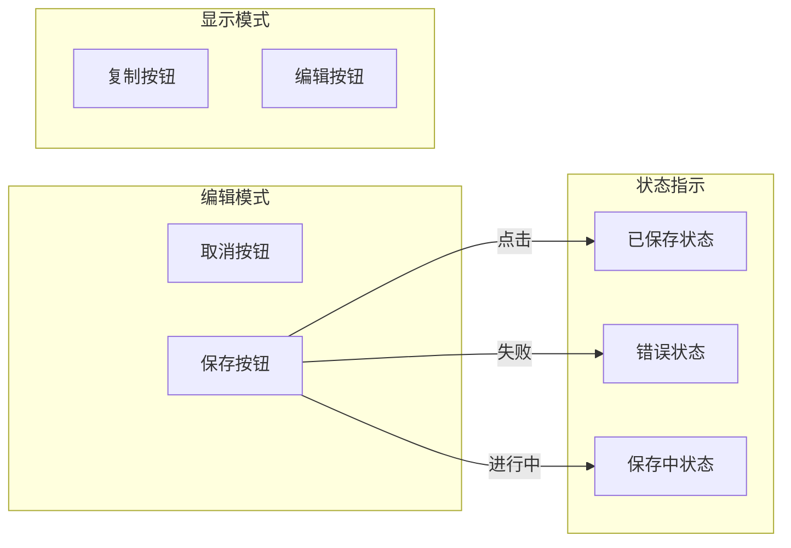
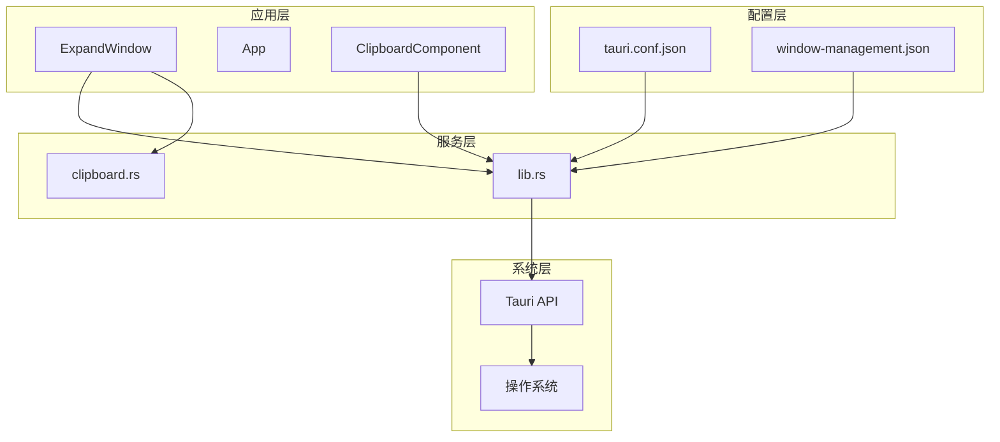

# 展开窗口功能

<cite>
**本文档引用的文件**
- [ExpandWindow.tsx](file://src/components/ExpandWindow.tsx)
- [ExpandWindow.css](file://src/components/ExpandWindow.css)
- [App.tsx](file://src/App.tsx)
- [clipboard.rs](file://src-tauri/src/clipboard.rs)
- [lib.rs](file://src-tauri/src/lib.rs)
- [window_utils.rs](file://src-tauri/src/window_utils.rs)
- [ClipboardComponent.tsx](file://src/components/ClipboardComponent.tsx)
- [tauri.conf.json](file://src-tauri/tauri.conf.json)
- [window-management.json](file://src-tauri/capabilities/window-management.json)
</cite>

## 目录
1. [简介](#简介)
2. [项目结构](#项目结构)
3. [核心组件](#核心组件)
4. [架构概览](#架构概览)
5. [详细组件分析](#详细组件分析)
6. [依赖关系分析](#依赖关系分析)
7. [性能考虑](#性能考虑)
8. [故障排除指南](#故障排除指南)
9. [结论](#结论)

## 简介

展开窗口功能是 xsun_desktop_pet 应用中的一个核心组件，它提供了一个专门的界面来查看和编辑剪贴板内容。该功能实现了完整的窗口生命周期管理、内容格式化、用户交互和数据持久化机制。

展开窗口采用现代化的 React + Tauri 架构，结合了前端的响应式 UI 和后端的原生窗口管理能力。该组件支持多种内容格式的自动识别和格式化，提供了直观的编辑体验和丰富的交互功能。

## 项目结构

展开窗口功能涉及以下关键文件和模块：



**图表来源**
- [ExpandWindow.tsx:1-168](file://src/components/ExpandWindow.tsx#L1-L168)
- [lib.rs:74-112](file://src-tauri/src/lib.rs#L74-L112)
- [clipboard.rs:124-185](file://src-tauri/src/clipboard.rs#L124-L185)

**章节来源**
- [ExpandWindow.tsx:1-168](file://src/components/ExpandWindow.tsx#L1-L168)
- [App.tsx:18-58](file://src/App.tsx#L18-L58)
- [lib.rs:74-112](file://src-tauri/src/lib.rs#L74-L112)

## 核心组件

展开窗口功能由多个相互协作的组件构成：

### 主要组件职责

1. **ExpandWindow 组件** - 核心 UI 组件，负责展示和编辑内容
2. **样式系统** - 提供完整的视觉设计和响应式布局
3. **窗口管理** - 处理窗口创建、销毁和状态管理
4. **剪贴板集成** - 实现内容的复制和历史记录功能
5. **格式化引擎** - 支持 JSON 和文本格式的自动识别

### 关键状态管理

组件维护以下核心状态：
- `content`: 当前显示/编辑的内容
- `isEditing`: 编辑模式状态
- `saveStatus`: 保存操作状态（空、saving、saved、error）
- `originalContent`: 原始内容备份

**章节来源**
- [ExpandWindow.tsx:6-10](file://src/components/ExpandWindow.tsx#L6-L10)
- [ExpandWindow.tsx:13-25](file://src/components/ExpandWindow.tsx#L13-L25)

## 架构概览

展开窗口功能采用分层架构设计，实现了清晰的关注点分离：



**图表来源**
- [ClipboardComponent.tsx:46-52](file://src/components/ClipboardComponent.tsx#L46-L52)
- [lib.rs:75-111](file://src-tauri/src/lib.rs#L75-L111)
- [ExpandWindow.tsx:27-34](file://src/components/ExpandWindow.tsx#L27-L34)

## 详细组件分析

### ExpandWindow 组件架构



**图表来源**
- [ExpandWindow.tsx:6-167](file://src/components/ExpandWindow.tsx#L6-L167)
- [lib.rs:74-112](file://src-tauri/src/lib.rs#L74-L112)

#### 窗口创建流程

展开窗口通过 Tauri 的 WebviewWindowBuilder 创建，具有以下特性：

1. **唯一标识符生成** - 基于时间戳的唯一窗口标签
2. **透明背景** - 实现无边框的现代化外观
3. **可拖拽区域** - header 区域支持拖拽移动
4. **初始化脚本** - 注入全局内容变量

#### 内容格式化机制

组件内置智能格式化引擎，支持两种主要格式：

```mermaid
flowchart TD
Start([输入内容]) --> TryJSON{尝试JSON解析}
TryJSON --> |成功| FormatJSON[JSON.stringify(parsed, null, 2)]
TryJSON --> |失败| SplitComma[按逗号分割]
SplitComma --> TrimItems[去除空白字符]
TrimItems --> JoinNewline[用逗号+换行连接]
FormatJSON --> Output[格式化输出]
JoinNewline --> Output
```

**图表来源**
- [ExpandWindow.tsx:13-25](file://src/components/ExpandWindow.tsx#L13-L25)

**章节来源**
- [ExpandWindow.tsx:27-34](file://src/components/ExpandWindow.tsx#L27-L34)
- [ExpandWindow.tsx:13-25](file://src/components/ExpandWindow.tsx#L13-L25)

### UI 组件系统

展开窗口采用模块化的 UI 设计，包含以下核心组件：

#### 头部区域组件
- **标题栏** - 显示窗口标题和内容信息
- **操作按钮** - 条件渲染的编辑/保存/取消按钮
- **拖拽区域** - 支持窗口拖拽移动

#### 内容区域组件
- **编辑模式** - 文本域用于内容编辑
- **显示模式** - 预格式化文本用于只读显示
- **滚动容器** - 支持大文本内容的滚动浏览

#### 操作按钮系统



**图表来源**
- [ExpandWindow.tsx:96-136](file://src/components/ExpandWindow.tsx#L96-L136)
- [ExpandWindow.css:55-127](file://src/components/ExpandWindow.css#L55-L127)

**章节来源**
- [ExpandWindow.tsx:86-167](file://src/components/ExpandWindow.tsx#L86-L167)
- [ExpandWindow.css:12-228](file://src/components/ExpandWindow.css#L12-L228)

### 状态管理系统

展开窗口实现了完整的状态管理机制：

#### 生命周期状态
- **初始化状态** - 从全局变量读取内容并格式化
- **编辑状态** - 文本域激活，允许内容修改
- **保存状态** - 异步保存过程中的状态反馈
- **错误状态** - 操作失败时的错误提示

#### 数据同步机制
- **内容比较** - 通过格式化后的版本比较检测变更
- **原始内容备份** - 保存未格式化内容用于撤销操作
- **实时大小计算** - 动态计算内容字节大小

**章节来源**
- [ExpandWindow.tsx:72-84](file://src/components/ExpandWindow.tsx#L72-L84)
- [ExpandWindow.tsx:78-84](file://src/components/ExpandWindow.tsx#L78-L84)

## 依赖关系分析

展开窗口功能的依赖关系呈现清晰的分层结构：



**图表来源**
- [App.tsx:5-6](file://src/App.tsx#L5-L6)
- [lib.rs:19-22](file://src-tauri/src/lib.rs#L19-L22)

### 外部依赖

展开窗口功能依赖以下关键外部库：

- **@tauri-apps/api**: Tauri 平台 API 访问
- **React**: 前端 UI 框架
- **CSS Modules**: 样式隔离和模块化

### 内部模块依赖

- **clipboard.rs**: 剪贴板操作的核心实现
- **window_utils.rs**: 窗口属性管理
- **App.tsx**: 应用路由和窗口调度

**章节来源**
- [package.json:12-19](file://package.json#L12-L19)
- [lib.rs:19-22](file://src-tauri/src/lib.rs#L19-L22)

## 性能考虑

展开窗口功能在性能方面采用了多项优化策略：

### 大文本处理优化

1. **Blob 大小计算** - 使用 Blob 对象高效计算内容大小
2. **条件渲染** - 根据编辑状态动态切换组件
3. **懒加载** - 窗口按需创建，避免不必要的内存占用

### 渲染性能优化

1. **CSS 过渡动画** - 使用硬件加速的 CSS3 动画
2. **防抖处理** - 输入事件的防抖处理减少重渲染
3. **虚拟滚动** - 对于超大文本内容，考虑实现虚拟滚动

### 内存管理

1. **状态清理** - 组件卸载时自动清理状态
2. **定时器管理** - 及时清理超时和轮询定时器
3. **事件监听器** - 正确移除事件监听器防止内存泄漏

### 窗口性能

1. **透明窗口** - 减少不必要的窗口装饰
2. **最小化重绘** - 仅在必要时更新 DOM
3. **GPU 加速** - 利用 CSS backdrop-filter 和 transform

**章节来源**
- [ExpandWindow.tsx:78-84](file://src/components/ExpandWindow.tsx#L78-L84)
- [ExpandWindow.css:1-10](file://src/components/ExpandWindow.css#L1-L10)

## 故障排除指南

展开窗口功能可能遇到的常见问题及解决方案：

### 窗口创建失败

**症状**: 调用 `open_expand_window` 时抛出异常
**原因**: 
- 窗口标签冲突
- 初始化脚本注入失败
- 窗口属性配置错误

**解决方案**:
1. 检查窗口标签的唯一性
2. 验证初始化脚本的 JSON 序列化
3. 确认窗口属性配置的有效性

### 内容格式化错误

**症状**: JSON 格式化失败或格式化结果不正确
**原因**:
- 输入内容不是有效 JSON
- 格式化算法处理异常

**解决方案**:
1. 实施更健壮的 JSON 解析错误处理
2. 提供格式化回退机制
3. 添加格式化预验证

### 剪贴板操作失败

**症状**: 复制或保存操作抛出异常
**原因**:
- 剪贴板权限不足
- 内容长度超出限制
- 系统剪贴板服务不可用

**解决方案**:
1. 检查剪贴板插件权限配置
2. 实施内容长度验证
3. 添加重试机制和用户提示

### 窗口拖拽失效

**症状**: 窗口头部无法拖拽移动
**原因**:
- data-tauri-drag-region 属性缺失
- CSS 样式冲突
- 窗口属性设置问题

**解决方案**:
1. 确保 header 元素包含正确的拖拽属性
2. 检查 CSS 样式的优先级
3. 验证窗口的可拖拽属性设置

**章节来源**
- [lib.rs:75-111](file://src-tauri/src/lib.rs#L75-L111)
- [clipboard.rs:137-185](file://src-tauri/src/clipboard.rs#L137-L185)

## 结论

展开窗口功能展现了现代桌面应用开发的最佳实践，成功地将前端的响应式 UI 与后端的原生窗口管理能力相结合。该功能具有以下突出特点：

### 技术优势
- **模块化设计**: 清晰的组件分离和职责划分
- **状态管理**: 完整的生命周期管理和数据同步机制
- **性能优化**: 针对大文本和复杂 UI 的优化策略
- **错误处理**: 全面的异常处理和用户反馈机制

### 用户体验
- **直观的界面**: 简洁明了的操作界面
- **流畅的交互**: 响应迅速的用户操作反馈
- **灵活的格式化**: 智能的内容格式化支持
- **可靠的稳定性**: 稳定的窗口管理和数据持久化

### 扩展潜力
该功能为未来的扩展奠定了良好的基础，可以轻松添加更多内容格式支持、高级编辑功能和个性化定制选项。整体而言，展开窗口功能是一个设计精良、实现完善的桌面应用组件，为用户提供优质的剪贴板内容管理体验。