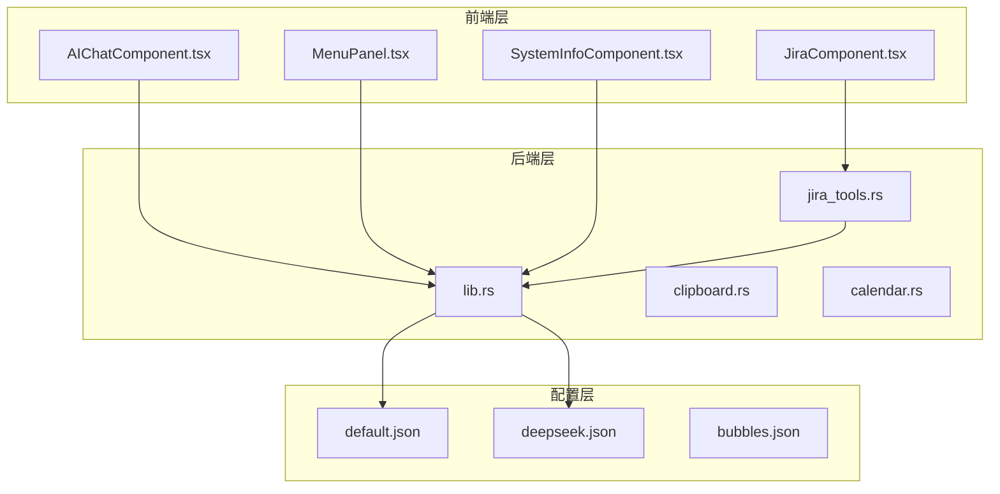
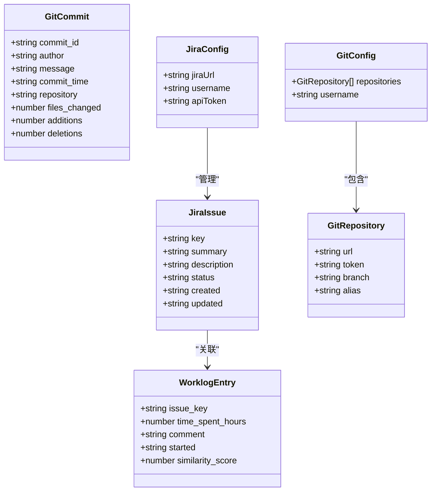
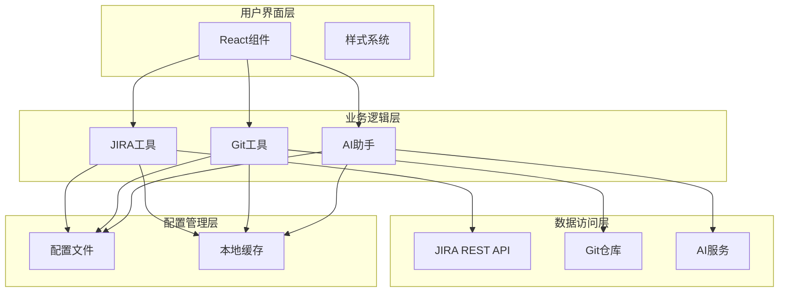
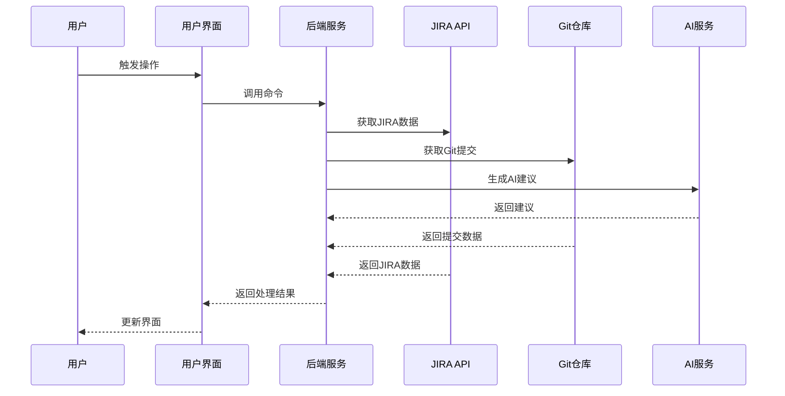
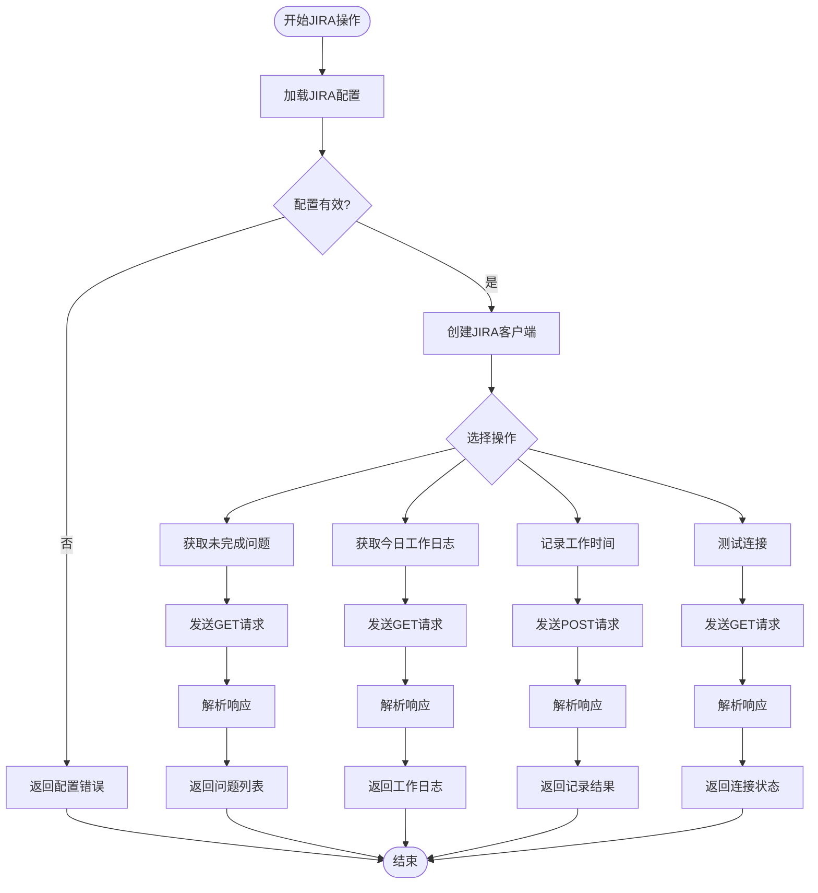
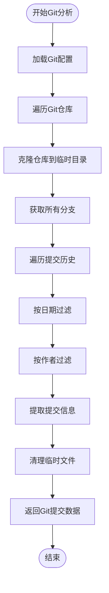
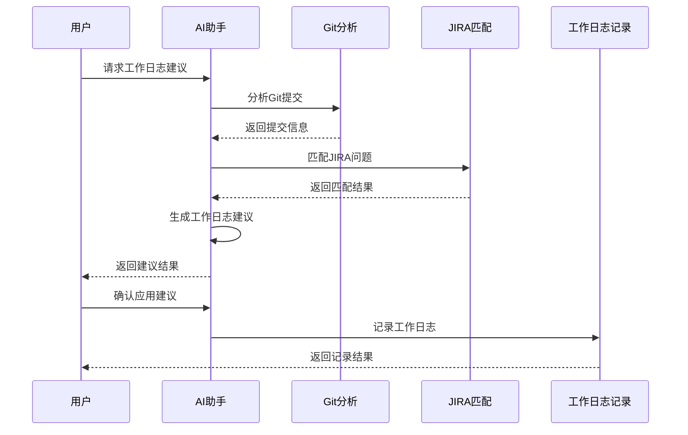
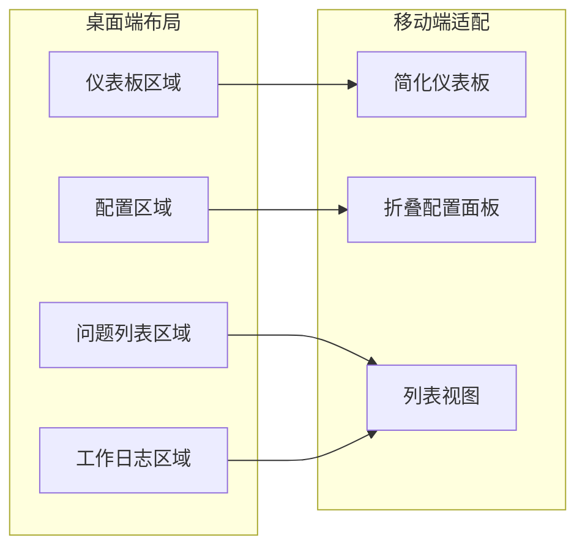
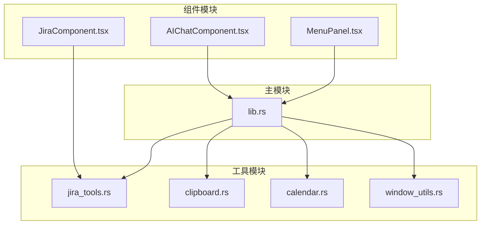

# JIRA工作流助手

<cite>
**本文档引用的文件**
- [README.md](file://README.md)
- [JiraComponent.tsx](file://src/components/JiraComponent.tsx)
- [JiraComponent.css](file://src/components/JiraComponent.css)
- [jira_tools.rs](file://src-tauri/src/jira_tools.rs)
- [lib.rs](file://src-tauri/src/lib.rs)
- [default.json](file://src-tauri/capabilities/default.json)
- [deepseek.json](file://src-tauri/config/deepseek.json)
- [package.json](file://package.json)
</cite>

## 目录
1. [简介](#简介)
2. [项目结构](#项目结构)
3. [核心组件](#核心组件)
4. [架构概览](#架构概览)
5. [详细组件分析](#详细组件分析)
6. [依赖关系分析](#依赖关系分析)
7. [性能考虑](#性能考虑)
8. [故障排除指南](#故障排除指南)
9. [结论](#结论)

## 简介

JIRA工作流助手是一个基于Rust和Tauri 2开发的桌面应用程序，专门用于自动化JIRA工作流程管理和Git提交日志生成。该工具集成了AI辅助功能，能够根据Git提交自动创建JIRA工作日志，大大提高了开发团队的工作效率。

### 主要功能特性

- **JIRA集成**: 与Atlassian JIRA无缝集成，支持工作日志记录和问题管理
- **Git自动化**: 自动提取Git提交信息，智能匹配JIRA问题
- **AI辅助**: 基于深度学习的智能工作日志生成和建议
- **多配置支持**: 支持JIRA、Git和AI服务的灵活配置
- **实时预览**: 提供工作日志的实时预览和验证功能
- **错误处理**: 完善的错误处理和用户反馈机制

## 项目结构

该项目采用现代化的桌面应用架构，结合了前端React组件和后端Rust服务的优势。



**图表来源**
- [JiraComponent.tsx:1-826](file://src/components/JiraComponent.tsx#L1-L826)
- [jira_tools.rs:1-1029](file://src-tauri/src/jira_tools.rs#L1-L1029)
- [lib.rs:940-1113](file://src-tauri/src/lib.rs#L940-L1113)

**章节来源**
- [README.md:129-181](file://README.md#L129-L181)
- [package.json:1-29](file://package.json#L1-L29)

## 核心组件

### JIRA工作流助手组件

JIRA工作流助手是整个应用的核心组件，提供了完整的JIRA集成和Git自动化功能。

#### 数据结构设计

组件使用了精心设计的数据结构来处理各种业务需求：



**图表来源**
- [JiraComponent.tsx:6-57](file://src/components/JiraComponent.tsx#L6-L57)
- [jira_tools.rs:11-64](file://src-tauri/src/jira_tools.rs#L11-L64)

#### 核心功能模块

1. **配置管理**: 支持JIRA、Git和AI服务的配置
2. **数据获取**: 自动获取JIRA问题、工作日志和Git提交
3. **AI集成**: 智能生成工作日志建议
4. **工作日志记录**: 自动记录JIRA工作时间
5. **界面管理**: 提供直观的用户界面

**章节来源**
- [JiraComponent.tsx:66-192](file://src/components/JiraComponent.tsx#L66-L192)
- [jira_tools.rs:80-166](file://src-tauri/src/jira_tools.rs#L80-L166)

## 架构概览

### 系统架构设计

JIRA工作流助手采用了分层架构设计，确保了系统的可维护性和扩展性。



**图表来源**
- [lib.rs:940-1113](file://src-tauri/src/lib.rs#L940-L1113)
- [jira_tools.rs:168-503](file://src-tauri/src/jira_tools.rs#L168-L503)

### 数据流架构

系统采用异步数据流设计，确保了响应性和可靠性。



**图表来源**
- [JiraComponent.tsx:188-254](file://src/components/JiraComponent.tsx#L188-L254)
- [jira_tools.rs:808-955](file://src-tauri/src/jira_tools.rs#L808-L955)

## 详细组件分析

### JIRA集成组件

#### JIRA API通信

JIRA集成组件实现了与Atlassian JIRA的完整API通信，支持多种操作：



**图表来源**
- [jira_tools.rs:188-243](file://src-tauri/src/jira_tools.rs#L188-L243)
- [jira_tools.rs:262-373](file://src-tauri/src/jira_tools.rs#L262-L373)
- [jira_tools.rs:376-455](file://src-tauri/src/jira_tools.rs#L376-L455)
- [jira_tools.rs:458-503](file://src-tauri/src/jira_tools.rs#L458-L503)

#### 权限验证机制

系统实现了多层次的权限验证机制，确保安全访问：

1. **基本认证**: 使用Base64编码的用户名和API令牌
2. **API令牌**: JIRA Cloud推荐的安全认证方式
3. **连接测试**: 验证配置的有效性和网络连通性

**章节来源**
- [jira_tools.rs:169-185](file://src-tauri/src/jira_tools.rs#L169-L185)
- [jira_tools.rs:458-503](file://src-tauri/src/jira_tools.rs#L458-L503)

### Git集成组件

#### Git提交信息提取

Git集成组件能够智能提取和分析Git提交信息：



**图表来源**
- [jira_tools.rs:525-654](file://src-tauri/src/jira_tools.rs#L525-L654)

#### 多仓库支持

系统支持多个Git仓库的配置和管理：

- **多仓库配置**: 支持配置多个Git仓库
- **分支管理**: 支持指定特定分支
- **访问令牌**: 每个仓库可配置独立的访问令牌
- **仓库别名**: 提供仓库名称的友好标识

**章节来源**
- [JiraComponent.tsx:332-348](file://src/components/JiraComponent.tsx#L332-L348)
- [jira_tools.rs:52-64](file://src-tauri/src/jira_tools.rs#L52-L64)

### AI辅助功能

#### 智能工作日志生成

AI助手组件提供了强大的智能工作日志生成功能：



**图表来源**
- [jira_tools.rs:808-955](file://src-tauri/src/jira_tools.rs#L808-L955)

#### AI配置管理

系统支持灵活的AI服务配置：

- **API密钥管理**: 安全存储和管理API密钥
- **模型选择**: 支持多种AI模型
- **基础URL配置**: 支持自定义AI服务端点
- **配置优先级**: 本地配置优先于资源配置

**章节来源**
- [JiraComponent.tsx:350-358](file://src/components/JiraComponent.tsx#L350-L358)
- [jira_tools.rs:714-767](file://src-tauri/src/jira_tools.rs#L714-L767)

### 用户界面设计

#### 响应式布局

JIRA工作流助手采用了现代化的响应式设计：



**图表来源**
- [JiraComponent.css:427-446](file://src/components/JiraComponent.css#L427-L446)

#### 交互设计

界面提供了丰富的交互功能：

- **标签页导航**: 支持仪表板、配置、问题列表、工作日志四个主要视图
- **日期选择器**: 支持选择任意日期查看历史数据
- **实时预览**: AI建议的实时预览和验证
- **错误处理**: 完善的错误提示和用户反馈

**章节来源**
- [JiraComponent.tsx:438-826](file://src/components/JiraComponent.tsx#L438-L826)
- [JiraComponent.css:1-469](file://src/components/JiraComponent.css#L1-L469)

## 依赖关系分析

### 外部依赖

项目使用了现代化的技术栈，确保了稳定性和性能：

```mermaid
graph TB
subgraph "前端依赖"
React[React 19.1.0]
TS[TypeScript 5.8.3]
Tauri[@tauri-apps/api 2.8.0]
Dialog[@tauri-apps/plugin-dialog 2.4.0]
FS[@tauri-apps/plugin-fs 2.4.0]
end
subgraph "后端依赖"
Rust[Rust 1.87.0]
TauriRS[Tauri 2.8.0]
Reqwest[reqwest 0.12.4]
Git2[git2 0.19.0]
Serde[serde 1.0.204]
Chrono[chrono 0.4.38]
end
subgraph "开发工具"
Vite[Vite 7.0.4]
CLI[@tauri/cli 2.0.0]
TypescriptTS[@types/react 19.1.8]
end
React --> Tauri
Tauri --> TauriRS
TauriRS --> Reqwest
TauriRS --> Git2
TauriRS --> Serde
TauriRS --> Chrono
```

**图表来源**
- [package.json:12-28](file://package.json#L12-L28)
- [lib.rs:1-17](file://src-tauri/src/lib.rs#L1-L17)

### 内部模块依赖

系统内部模块之间建立了清晰的依赖关系：



**图表来源**
- [lib.rs:12-17](file://src-tauri/src/lib.rs#L12-L17)
- [lib.rs:411](file://src-tauri/src/lib.rs#L411)

**章节来源**
- [package.json:1-29](file://package.json#L1-L29)
- [lib.rs:940-1113](file://src-tauri/src/lib.rs#L940-L1113)

## 性能考虑

### 异步处理

系统广泛采用了异步编程模式来提高性能：

- **并发请求**: 同时处理多个API请求
- **非阻塞操作**: 避免UI冻结
- **资源管理**: 合理管理临时文件和网络连接

### 缓存策略

为了提高响应速度，系统实现了多层缓存机制：

- **配置缓存**: 本地配置文件缓存
- **API响应缓存**: 避免重复的API调用
- **Git数据缓存**: 临时文件缓存机制

### 错误恢复

系统具备完善的错误处理和恢复机制：

- **重试机制**: 对临时性错误自动重试
- **降级策略**: 在服务不可用时提供降级功能
- **超时控制**: 防止长时间等待阻塞系统

## 故障排除指南

### 常见问题诊断

#### JIRA连接问题

1. **检查配置**: 确认JIRA URL、用户名和API令牌正确
2. **网络连接**: 验证网络连通性和防火墙设置
3. **API限制**: 检查JIRA API使用限制和配额

#### Git集成问题

1. **仓库访问**: 确认Git仓库URL和访问令牌有效
2. **分支权限**: 验证对目标分支的访问权限
3. **网络代理**: 检查代理设置和网络配置

#### AI服务问题

1. **API密钥**: 验证AI服务API密钥的有效性
2. **服务可用性**: 检查AI服务的可用性和响应时间
3. **配置优先级**: 确认本地配置覆盖了默认配置

### 调试技巧

1. **日志分析**: 查看应用日志了解详细错误信息
2. **网络监控**: 使用开发者工具监控网络请求
3. **配置验证**: 逐步验证各个配置项的有效性

**章节来源**
- [jira_tools.rs:211-215](file://src-tauri/src/jira_tools.rs#L211-L215)
- [jira_tools.rs:429-452](file://src-tauri/src/jira_tools.rs#L429-L452)

## 结论

JIRA工作流助手是一个功能强大且设计精良的桌面应用程序，它成功地将JIRA集成、Git自动化和AI辅助功能结合在一起。通过采用现代化的技术栈和架构设计，该应用不仅提供了优秀的用户体验，还确保了系统的可维护性和扩展性。

### 主要优势

1. **功能完整性**: 覆盖了JIRA工作流程的各个方面
2. **智能化程度高**: AI辅助功能显著提升了工作效率
3. **用户体验优秀**: 直观的界面设计和流畅的操作体验
4. **安全性保障**: 多层次的安全机制保护用户数据
5. **可扩展性强**: 模块化的架构便于功能扩展

### 未来发展方向

1. **更多AI模型支持**: 支持更多的AI服务提供商
2. **工作流定制**: 提供更灵活的工作流定制选项
3. **数据分析**: 增强数据分析和报告功能
4. **团队协作**: 支持团队级别的协作和共享
5. **移动端支持**: 开发移动应用版本

该应用为开发团队提供了一个高效、智能的工作流程管理解决方案，值得在实际工作中推广使用。