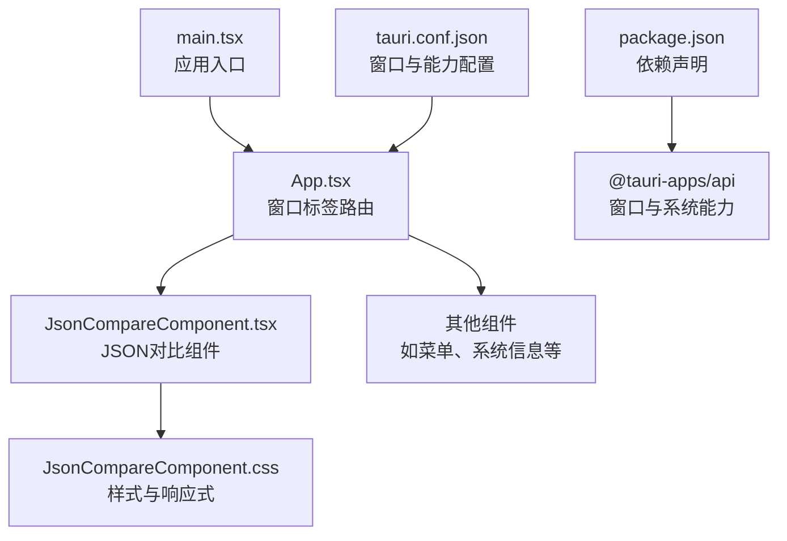
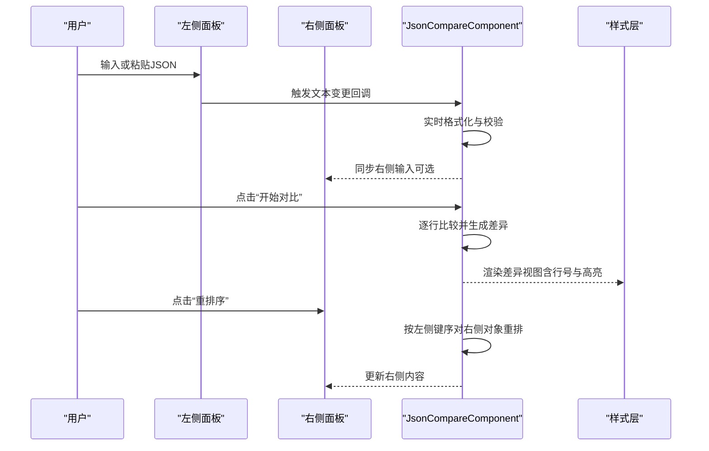
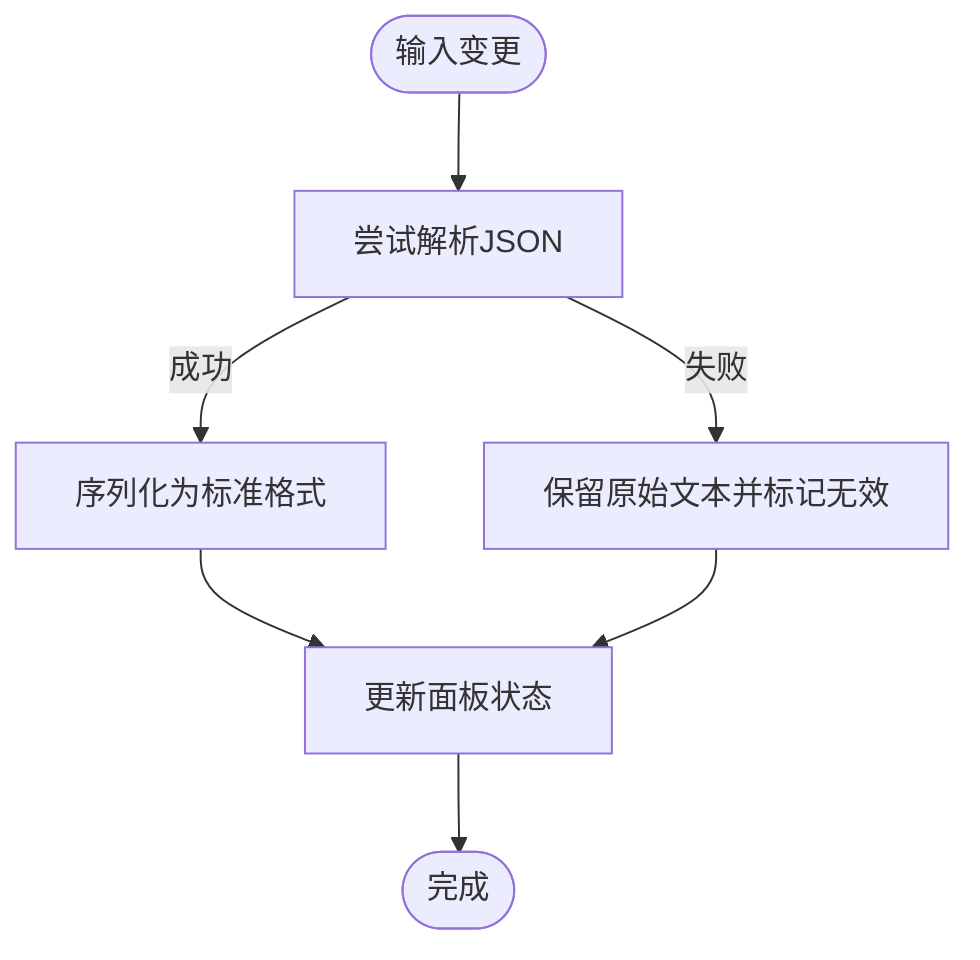
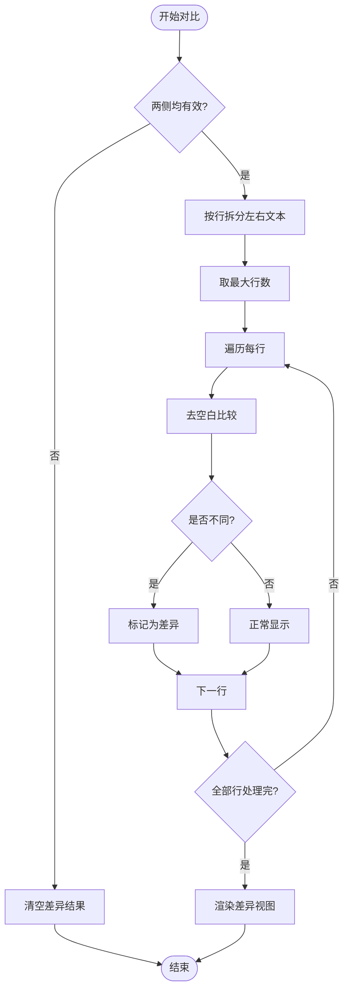
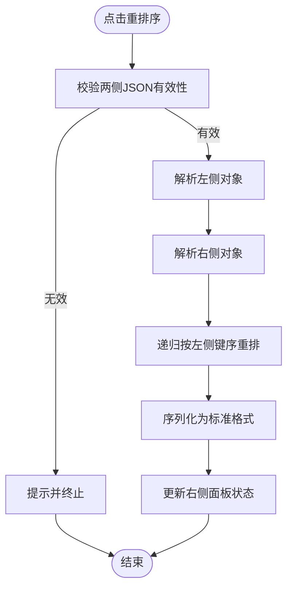
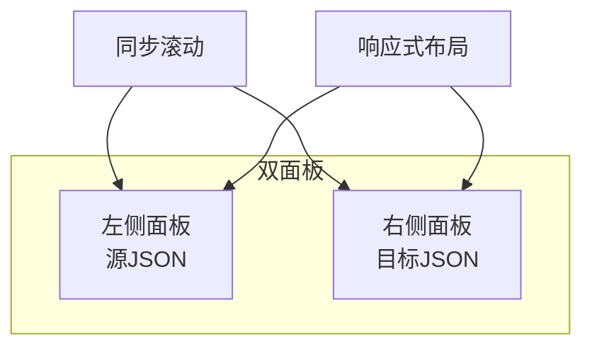
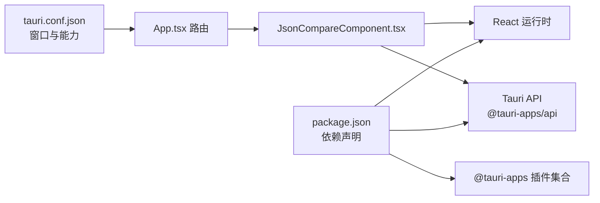

# JSON对比工具

<cite>
**本文引用的文件列表**
- [JsonCompareComponent.tsx](file://src/components/JsonCompareComponent.tsx)
- [JsonCompareComponent.css](file://src/components/JsonCompareComponent.css)
- [App.tsx](file://src/App.tsx)
- [main.tsx](file://src/main.tsx)
- [package.json](file://package.json)
- [tauri.conf.json](file://src-tauri/tauri.conf.json)
</cite>

## 目录
1. [简介](#简介)
2. [项目结构](#项目结构)
3. [核心组件](#核心组件)
4. [架构总览](#架构总览)
5. [详细组件分析](#详细组件分析)
6. [依赖关系分析](#依赖关系分析)
7. [性能考量](#性能考量)
8. [故障排查指南](#故障排查指南)
9. [结论](#结论)
10. [附录](#附录)

## 简介
本文件为桌面端 JSON 对比工具的功能文档，聚焦以下能力：
- JSON 格式化：自动格式化、语法验证与错误提示
- JSON 对比：逐行比较、差异标记与可视化展示
- 重排序：按键顺序对齐与嵌套对象处理
- 用户界面：双面板布局、同步滚动与响应式设计
- 输入验证：实时格式检查与错误状态显示
- 使用建议：大文件处理与性能优化
- 配置与集成：窗口标签、Tauri 能力与数据传递

## 项目结构
该工具采用 React + Tauri 架构，前端负责 UI 与交互逻辑，后端通过 Tauri 提供系统级能力（如窗口拖拽）。JSON 对比功能位于独立组件中，并由应用入口按窗口标签动态渲染。

图表来源
- [main.tsx:1-10](file://src/main.tsx#L1-L10)
- [App.tsx:17-55](file://src/App.tsx#L17-L55)
- [JsonCompareComponent.tsx:19-398](file://src/components/JsonCompareComponent.tsx#L19-L398)
- [JsonCompareComponent.css:1-386](file://src/components/JsonCompareComponent.css#L1-L386)
- [package.json:12-27](file://package.json#L12-L27)
- [tauri.conf.json:13-51](file://src-tauri/tauri.conf.json#L13-L51)

章节来源
- [main.tsx:1-10](file://src/main.tsx#L1-L10)
- [App.tsx:17-55](file://src/App.tsx#L17-L55)
- [package.json:12-27](file://package.json#L12-L27)
- [tauri.conf.json:13-51](file://src-tauri/tauri.conf.json#L13-L51)

## 核心组件
- JsonCompareComponent：负责双面板输入、格式化、对比、重排序与差异可视化；管理面板状态与滚动同步。
- 样式层：提供双面板布局、差异高亮、按钮与滚动条美化、响应式适配。
- 应用入口与路由：根据窗口标签选择性渲染组件，支持 JSON 对比窗口。

章节来源
- [JsonCompareComponent.tsx:19-398](file://src/components/JsonCompareComponent.tsx#L19-L398)
- [JsonCompareComponent.css:122-386](file://src/components/JsonCompareComponent.css#L122-L386)
- [App.tsx:44-45](file://src/App.tsx#L44-L45)

## 架构总览
JSON 对比工具采用“前端组件 + Tauri 能力”的混合架构：
- 前端：React 组件负责输入、格式化、对比与 UI 呈现
- 后端：Tauri 提供窗口能力（拖拽、关闭）与安全策略
- 数据流：组件内部状态驱动对比与展示，不涉及跨进程数据持久化

图表来源
- [JsonCompareComponent.tsx:105-127](file://src/components/JsonCompareComponent.tsx#L105-L127)
- [JsonCompareComponent.tsx:192-245](file://src/components/JsonCompareComponent.tsx#L192-L245)
- [JsonCompareComponent.tsx:129-190](file://src/components/JsonCompareComponent.tsx#L129-L190)
- [JsonCompareComponent.css:248-300](file://src/components/JsonCompareComponent.css#L248-L300)

## 详细组件分析

### JSON格式化与语法验证
- 自动格式化：输入时即时调用解析与序列化，保持缩进一致
- 语法验证：捕获解析异常，返回“无效”状态并保留原始文本
- 错误提示：面板右上角徽章显示“格式错误”，按钮禁用无效状态
- 时间戳：每次有效输入更新时间戳，便于追踪

图表来源
- [JsonCompareComponent.tsx:65-76](file://src/components/JsonCompareComponent.tsx#L65-L76)
- [JsonCompareComponent.tsx:105-127](file://src/components/JsonCompareComponent.tsx#L105-L127)

章节来源
- [JsonCompareComponent.tsx:65-76](file://src/components/JsonCompareComponent.tsx#L65-L76)
- [JsonCompareComponent.tsx:105-127](file://src/components/JsonCompareComponent.tsx#L105-L127)
- [JsonCompareComponent.css:175-182](file://src/components/JsonCompareComponent.css#L175-L182)

### JSON对比算法与可视化
- 逐行比较：将左右两侧文本按行拆分，补齐较短侧为空行
- 差异标记：去除空白后比较，相同则不高亮，不同则高亮
- 可视化展示：行号 + 内容，差异行带背景高亮与轻微动画
- 重新对比：对比完成后可一键回到编辑态，再次触发对比

图表来源
- [JsonCompareComponent.tsx:192-245](file://src/components/JsonCompareComponent.tsx#L192-L245)
- [JsonCompareComponent.css:262-300](file://src/components/JsonCompareComponent.css#L262-L300)

章节来源
- [JsonCompareComponent.tsx:192-245](file://src/components/JsonCompareComponent.tsx#L192-L245)
- [JsonCompareComponent.css:248-300](file://src/components/JsonCompareComponent.css#L248-L300)

### 重排序功能（按键顺序对齐与嵌套对象处理）
- 依据左侧对象键顺序对右侧对象进行重排
- 递归处理嵌套对象，数组保持原样
- 未在左侧出现的键追加到右侧末尾
- 成功后更新右侧内容并刷新时间戳

图表来源
- [JsonCompareComponent.tsx:129-190](file://src/components/JsonCompareComponent.tsx#L129-L190)

章节来源
- [JsonCompareComponent.tsx:129-190](file://src/components/JsonCompareComponent.tsx#L129-L190)

### 用户界面设计（双面板布局、同步滚动与响应式）
- 双面板：左“源JSON”，右“目标JSON”，均支持格式化与错误徽章
- 同步滚动：任一侧滚动时联动另一侧滚动位置
- 响应式：小屏设备自动切换为纵向布局，对比按钮居中
- 视觉反馈：按钮悬停、焦点、滚动条美化；差异行高亮动画

图表来源
- [JsonCompareComponent.tsx:247-255](file://src/components/JsonCompareComponent.tsx#L247-L255)
- [JsonCompareComponent.css:374-386](file://src/components/JsonCompareComponent.css#L374-L386)

章节来源
- [JsonCompareComponent.tsx:247-255](file://src/components/JsonCompareComponent.tsx#L247-L255)
- [JsonCompareComponent.css:122-145](file://src/components/JsonCompareComponent.css#L122-L145)
- [JsonCompareComponent.css:374-386](file://src/components/JsonCompareComponent.css#L374-L386)

### 输入验证机制（实时格式检查与错误状态显示）
- 实时格式检查：输入变更即触发格式化与校验
- 错误状态显示：无效时显示“格式错误”徽章，按钮禁用
- 时间戳：有效输入时记录时间，便于回溯

章节来源
- [JsonCompareComponent.tsx:105-127](file://src/components/JsonCompareComponent.tsx#L105-L127)
- [JsonCompareComponent.css:175-182](file://src/components/JsonCompareComponent.css#L175-L182)

### 工具使用最佳实践
- 小心大文件：对比会按行拆分并逐行比较，长文本可能导致 DOM 行数过多，影响滚动与渲染性能
- 建议：优先格式化后再对比，减少空白差异干扰
- 重排序：在键顺序敏感场景（如接口文档）使用“重排序”对齐字段顺序
- 同步滚动：利用同步滚动快速定位差异位置

章节来源
- [JsonCompareComponent.tsx:192-245](file://src/components/JsonCompareComponent.tsx#L192-L245)

### 工具配置选项与自定义设置
- 窗口标签：通过应用路由按标签渲染组件，JSON 对比窗口标签为“json-compare”
- Tauri 能力：窗口拖拽与关闭能力由 @tauri-apps/api 提供，样式层通过 data-tauri-drag-region 标记可拖拽区域
- 样式定制：可通过修改 CSS 变量与类名调整颜色、字体与尺寸

章节来源
- [App.tsx:44-45](file://src/App.tsx#L44-L45)
- [JsonCompareComponent.tsx:259](file://src/components/JsonCompareComponent.tsx#L259)
- [JsonCompareComponent.css:1-386](file://src/components/JsonCompareComponent.css#L1-L386)

### 与其他组件的集成与数据传递
- 组件间无直接数据共享：对比结果仅在组件内部状态维护，不跨组件持久化
- 窗口集成：通过窗口标签与路由选择渲染，与菜单面板、系统信息等组件并列
- 能力集成：使用 @tauri-apps/api 的窗口能力实现拖拽与关闭

章节来源
- [App.tsx:17-55](file://src/App.tsx#L17-L55)
- [JsonCompareComponent.tsx:259](file://src/components/JsonCompareComponent.tsx#L259)
- [package.json:12-18](file://package.json#L12-L18)

## 依赖关系分析
- 前端依赖：React、@tauri-apps/api（窗口能力）、@tauri-apps 插件（对话框、文件系统、打开器）
- 构建与运行：Vite + TypeScript，开发时通过 CLI 启动
- Tauri 配置：声明窗口与能力，启用拖拽与窗口管理能力

图表来源
- [package.json:12-27](file://package.json#L12-L27)
- [JsonCompareComponent.tsx:19-398](file://src/components/JsonCompareComponent.tsx#L19-L398)
- [App.tsx:17-55](file://src/App.tsx#L17-L55)
- [tauri.conf.json:44-51](file://src-tauri/tauri.conf.json#L44-L51)

章节来源
- [package.json:12-27](file://package.json#L12-L27)
- [tauri.conf.json:44-51](file://src-tauri/tauri.conf.json#L44-L51)

## 性能考量
- 对比复杂度：逐行比较的时间复杂度为 O(N)，N 为较长侧行数；空间复杂度 O(N)
- DOM 行数：长文本会生成大量行元素，可能影响滚动与渲染性能
- 优化建议：
  - 对超长文本先进行预处理（如按段落或层级切分）
  - 在对比前统一格式化，减少空白差异
  - 避免频繁触发对比（例如在输入过程中节流）

章节来源
- [JsonCompareComponent.tsx:192-245](file://src/components/JsonCompareComponent.tsx#L192-L245)

## 故障排查指南
- “格式错误”徽章持续显示
  - 检查输入是否为合法 JSON；确认括号、引号与逗号正确
  - 使用“格式化”按钮自动修复常见格式问题
- 对比按钮不可用
  - 确认两侧均为有效 JSON；任一侧无效时按钮禁用
- 重排序失败
  - 确认两侧均为有效 JSON；检查对象结构是否匹配
- 滚动不同步
  - 确认未禁用滚动同步；检查容器高度与滚动事件绑定

章节来源
- [JsonCompareComponent.tsx:132-134](file://src/components/JsonCompareComponent.tsx#L132-L134)
- [JsonCompareComponent.tsx:247-255](file://src/components/JsonCompareComponent.tsx#L247-L255)

## 结论
该 JSON 对比工具以简洁的双面板设计与直观的差异高亮为核心，结合实时格式化、按键顺序重排序与同步滚动，满足日常 JSON 对比与对齐需求。通过合理的使用建议与性能优化策略，可在保证体验的同时提升大文件处理效率。未来可考虑引入增量对比、差异折叠与导出功能以进一步增强实用性。

## 附录
- 窗口标签：json-compare
- 关键能力：窗口拖拽、关闭（通过 @tauri-apps/api）
- 样式定制：通过修改 CSS 类与变量实现主题与尺寸调整

章节来源
- [App.tsx:44-45](file://src/App.tsx#L44-L45)
- [JsonCompareComponent.css:1-386](file://src/components/JsonCompareComponent.css#L1-L386)