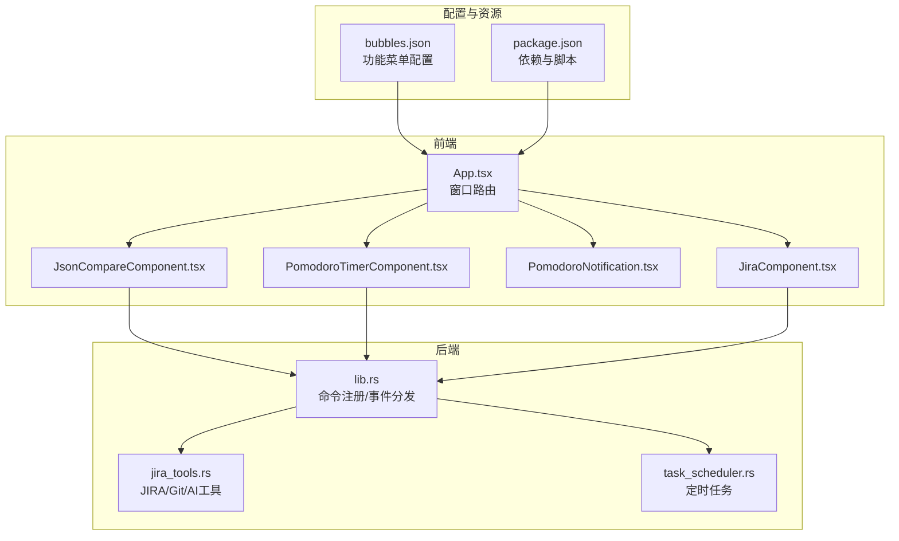
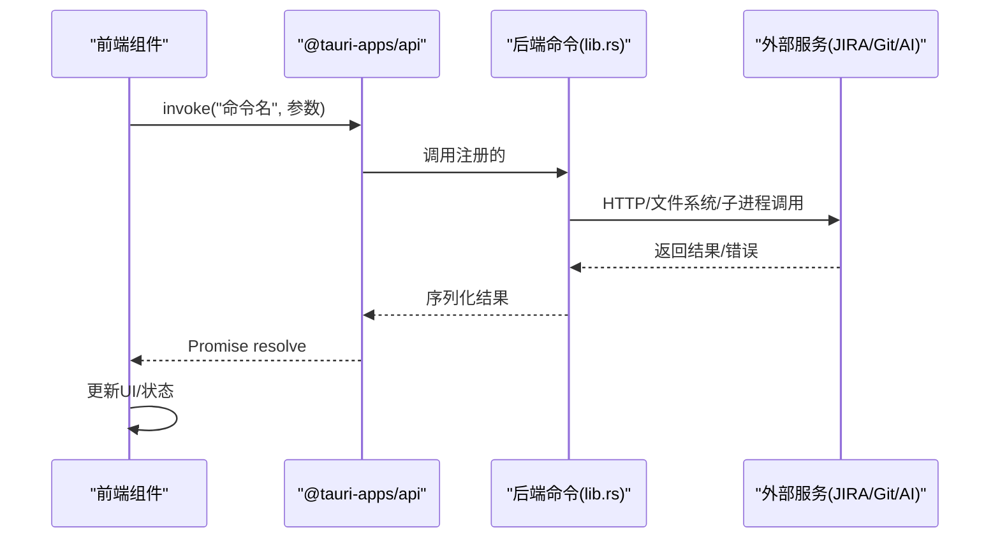
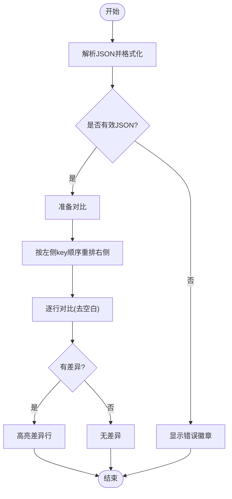
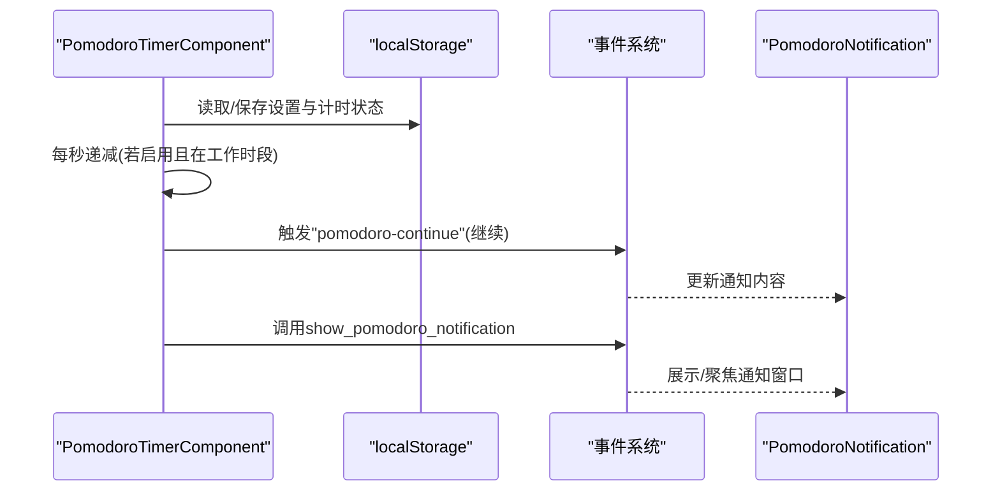
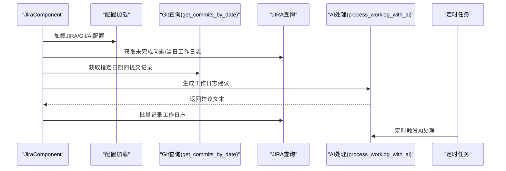
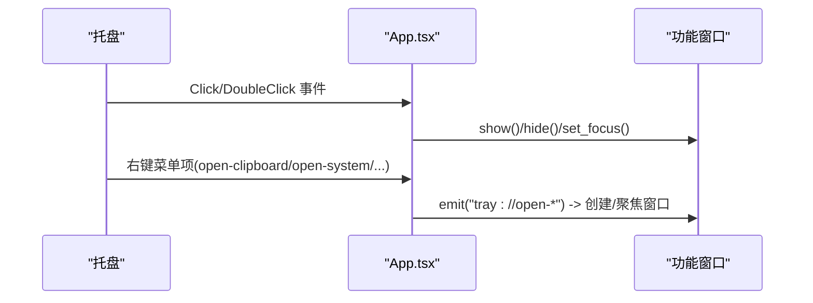
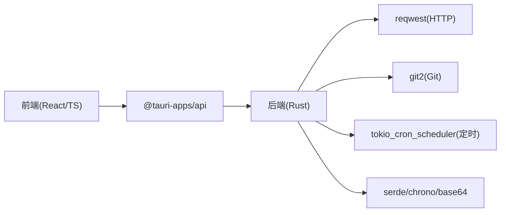

# 开发工具集

<cite>
**本文档引用的文件**
- [README.md](file://README.md)
- [App.tsx](file://src/App.tsx)
- [main.tsx](file://src/main.tsx)
- [JsonCompareComponent.tsx](file://src/components/JsonCompareComponent.tsx)
- [JsonCompareComponent.css](file://src/components/JsonCompareComponent.css)
- [PomodoroTimerComponent.tsx](file://src/components/PomodoroTimerComponent.tsx)
- [PomodoroTimerComponent.css](file://src/components/PomodoroTimerComponent.css)
- [PomodoroNotification.tsx](file://src/components/PomodoroNotification.tsx)
- [JiraComponent.tsx](file://src/components/JiraComponent.tsx)
- [JiraComponent.css](file://src/components/JiraComponent.css)
- [lib.rs](file://src-tauri/src/lib.rs)
- [jira_tools.rs](file://src-tauri/src/jira_tools.rs)
- [task_scheduler.rs](file://src-tauri/src/task_scheduler.rs)
- [bubbles.json](file://public/config/bubbles.json)
- [package.json](file://package.json)
</cite>

## 目录
1. [简介](#简介)
2. [项目结构](#项目结构)
3. [核心组件](#核心组件)
4. [架构总览](#架构总览)
5. [详细组件分析](#详细组件分析)
6. [依赖关系分析](#依赖关系分析)
7. [性能考量](#性能考量)
8. [故障排查指南](#故障排查指南)
9. [结论](#结论)
10. [附录](#附录)

## 简介
本项目是一个基于 Rust 与 Tauri 2 的桌面应用，集成了多种开发者常用工具，包括 JSON 对比、番茄钟、JIRA 助手、剪贴板管理、系统信息监控、AI 对话、有道翻译、日历 TODO 等功能。应用采用前端 React + TypeScript + 后端 Rust 的分层架构，通过 Tauri 的 invoke 机制实现前后端通信，并提供多窗口管理与托盘交互能力。

## 项目结构
应用采用模块化组件设计，前端组件位于 src/components，后端逻辑位于 src-tauri/src，静态资源与配置位于 public 与 src-tauri/config。功能入口由 src/App.tsx 根据窗口 label 动态渲染对应组件；后端通过 lib.rs 暴露命令接口，供前端调用。

**图表来源**
- [App.tsx:17-55](file://src/App.tsx#L17-L55)
- [lib.rs:1-10](file://src-tauri/src/lib.rs#L1-L10)
- [jira_tools.rs:1-20](file://src-tauri/src/jira_tools.rs#L1-L20)
- [task_scheduler.rs:1-20](file://src-tauri/src/task_scheduler.rs#L1-L20)
- [bubbles.json:1-52](file://public/config/bubbles.json#L1-L52)
- [package.json:1-29](file://package.json#L1-L29)

**章节来源**
- [README.md:129-181](file://README.md#L129-L181)
- [App.tsx:17-55](file://src/App.tsx#L17-L55)
- [package.json:1-29](file://package.json#L1-L29)

## 核心组件
- JSON 对比工具：提供双面板编辑、格式化、按左侧 key 顺序重排、逐行差异高亮与同步滚动。
- 番茄钟：支持工作/休息周期切换、本地持久化、工作时段限制、事件驱动通知。
- JIRA 助手：集成 JIRA 查询、Git 提交统计、AI 辅助生成工作日志、定时任务自动处理。
- 菜单与托盘：通过 bubbles.json 配置菜单项，支持左键显示/隐藏、右键菜单、事件驱动窗口创建。

**章节来源**
- [README.md:107-128](file://README.md#L107-L128)
- [bubbles.json:27-41](file://public/config/bubbles.json#L27-L41)
- [App.tsx:17-55](file://src/App.tsx#L17-L55)

## 架构总览
应用采用“前端组件 + 后端命令”的架构。前端通过 @tauri-apps/api 的 invoke 调用后端命令，后端通过 tauri::command 注解暴露函数，实现系统级能力与业务逻辑分离。事件系统用于窗口间通信（如番茄钟通知）。

**图表来源**
- [lib.rs:38-47](file://src-tauri/src/lib.rs#L38-L47)
- [jira_tools.rs:188-243](file://src-tauri/src/jira_tools.rs#L188-L243)
- [task_scheduler.rs:21-61](file://src-tauri/src/task_scheduler.rs#L21-L61)

## 详细组件分析

### JSON 对比工具
- 输入验证与格式化：对输入进行 JSON 解析与格式化，错误时保留原始文本并显示“格式错误”徽章。
- 差异算法：按行比较两侧文本，去除空白后对比，标记不同行并高亮。
- 可视化展示：双面板布局，支持同步滚动；提供“格式化”“重排序”“开始对比/重新对比/返回编辑”等操作。
- 交互细节：自动对比、按键提示、时间戳显示、错误反馈。

**图表来源**
- [JsonCompareComponent.tsx:65-103](file://src/components/JsonCompareComponent.tsx#L65-L103)
- [JsonCompareComponent.tsx:129-190](file://src/components/JsonCompareComponent.tsx#L129-L190)
- [JsonCompareComponent.tsx:192-245](file://src/components/JsonCompareComponent.tsx#L192-L245)

**章节来源**
- [JsonCompareComponent.tsx:19-399](file://src/components/JsonCompareComponent.tsx#L19-L399)
- [JsonCompareComponent.css:1-386](file://src/components/JsonCompareComponent.css#L1-L386)

### 番茄钟功能
- 计时逻辑：基于 setInterval 的秒级计数，支持工作/休息周期切换；在非工作时段或未启用时自动暂停。
- 专注模式与休息提醒：通过事件监听“继续”动作恢复计时；通知窗口通过 invoke 触发，支持动态更新。
- 本地持久化：设置与计时状态分别持久化到 localStorage，应用重启后可恢复。
- UI 设计：双面板布局，设置区与计时区分离；进度条与状态文字提示。

**图表来源**
- [PomodoroTimerComponent.tsx:116-187](file://src/components/PomodoroTimerComponent.tsx#L116-L187)
- [PomodoroNotification.tsx:17-39](file://src/components/PomodoroNotification.tsx#L17-L39)
- [lib.rs:780-800](file://src-tauri/src/lib.rs#L780-L800)

**章节来源**
- [PomodoroTimerComponent.tsx:22-402](file://src/components/PomodoroTimerComponent.tsx#L22-L402)
- [PomodoroTimerComponent.css:1-710](file://src/components/PomodoroTimerComponent.css#L1-L710)
- [PomodoroNotification.tsx:11-65](file://src/components/PomodoroNotification.tsx#L11-L65)

### JIRA 助手
- Git 集成：遍历配置仓库，抓取指定日期的提交记录，支持多分支合并去重。
- JIRA 查询：获取当前用户未完成问题、当日工作日志；解析多种时间格式与评论结构。
- AI 辅助：通过 DeepSeek API 生成工作日志建议，正则解析并批量应用。
- 定时任务：每日 17:00 左右自动执行 AI 处理，减少手工负担。
- UI 设计：多标签页（仪表板/配置/问题/工作日志），日期选择器，表格展示。

**图表来源**
- [JiraComponent.tsx:189-254](file://src/components/JiraComponent.tsx#L189-L254)
- [jira_tools.rs:524-654](file://src-tauri/src/jira_tools.rs#L524-L654)
- [jira_tools.rs:188-243](file://src-tauri/src/jira_tools.rs#L188-L243)
- [jira_tools.rs:769-800](file://src-tauri/src/jira_tools.rs#L769-L800)
- [task_scheduler.rs:21-61](file://src-tauri/src/task_scheduler.rs#L21-L61)

**章节来源**
- [JiraComponent.tsx:66-826](file://src/components/JiraComponent.tsx#L66-L826)
- [JiraComponent.css:1-469](file://src/components/JiraComponent.css#L1-L469)
- [jira_tools.rs:1-1029](file://src-tauri/src/jira_tools.rs#L1-L1029)
- [task_scheduler.rs:1-93](file://src-tauri/src/task_scheduler.rs#L1-L93)

### 菜单与托盘
- 功能菜单：通过 bubbles.json 配置菜单项与图标，点击后通过事件或窗口路由打开对应功能。
- 托盘交互：左键显示/隐藏桌宠；右键打开功能菜单；双击显示桌宠。
- 窗口管理：主窗口 pet 始终存在，功能窗口按需创建与销毁；菜单窗口临时显示。

**图表来源**
- [bubbles.json:1-52](file://public/config/bubbles.json#L1-L52)
- [lib.rs:692-778](file://src-tauri/src/lib.rs#L692-L778)
- [App.tsx:17-55](file://src/App.tsx#L17-L55)

**章节来源**
- [bubbles.json:1-52](file://public/config/bubbles.json#L1-L52)
- [lib.rs:662-778](file://src-tauri/src/lib.rs#L662-L778)
- [App.tsx:17-55](file://src/App.tsx#L17-L55)

## 依赖关系分析
- 前端依赖：React + TypeScript + @tauri-apps/api（窗口、事件、文件系统、对话框等插件）。
- 后端依赖：reqwest（HTTP）、git2（Git）、tokio_cron_scheduler（定时任务）、serde/chrono/base64 等。
- 构建与运行：Vite + Tauri CLI，开发时使用 npm run tauri dev，生产构建使用 cargo tauri build。

**图表来源**
- [package.json:12-27](file://package.json#L12-L27)
- [lib.rs:1-10](file://src-tauri/src/lib.rs#L1-L10)
- [jira_tools.rs:1-10](file://src-tauri/src/jira_tools.rs#L1-L10)

**章节来源**
- [package.json:1-29](file://package.json#L1-L29)
- [lib.rs:1-10](file://src-tauri/src/lib.rs#L1-L10)

## 性能考量
- JSON 对比：逐行比较与高亮渲染，建议在大文件场景下延迟对比或分块渲染；当前实现已通过去空白比较减少误报。
- 番茄钟：每秒更新一次，使用 useRef 缓存设置与计时状态，避免重复渲染；工作时段外自动暂停，降低 CPU 占用。
- JIRA 助手：Git 克隆使用临时目录并在完成后清理；JIRA 请求按需发起，AI 请求通过正则解析减少二次处理。
- 定时任务：每分钟检查一次，仅在工作日 17:00 左右触发，避免高频网络请求。
- UI 优化：使用 CSS backdrop-filter 与渐变背景，配合响应式布局适配不同屏幕尺寸。

[本节为通用性能建议，无需特定文件引用]

## 故障排查指南
- JSON 对比
  - 症状：格式错误徽章持续出现
  - 排查：确认输入为合法 JSON；检查格式化按钮是否可用；查看错误提示
  - 相关实现：[JsonCompareComponent.tsx:65-103](file://src/components/JsonCompareComponent.tsx#L65-L103)
- 番茄钟
  - 症状：计时不更新或无法暂停
  - 排查：确认工作时段设置；检查启用开关；查看 localStorage 是否正常读写
  - 相关实现：[PomodoroTimerComponent.tsx:116-166](file://src/components/PomodoroTimerComponent.tsx#L116-L166)
- JIRA 助手
  - 症状：JIRA/Git 请求失败
  - 排查：检查配置保存与连接测试；确认 API Token/URL 正确；查看错误信息
  - 相关实现：[JiraComponent.tsx:256-290](file://src/components/JiraComponent.tsx#L256-L290)、[jira_tools.rs:188-243](file://src-tauri/src/jira_tools.rs#L188-L243)
- 托盘与窗口
  - 症状：托盘菜单无响应或窗口无法显示
  - 排查：确认事件监听是否正确；检查窗口标签与创建逻辑
  - 相关实现：[lib.rs:692-778](file://src-tauri/src/lib.rs#L692-L778)、[App.tsx:17-55](file://src/App.tsx#L17-L55)

**章节来源**
- [JsonCompareComponent.tsx:65-103](file://src/components/JsonCompareComponent.tsx#L65-L103)
- [PomodoroTimerComponent.tsx:116-166](file://src/components/PomodoroTimerComponent.tsx#L116-L166)
- [JiraComponent.tsx:256-290](file://src/components/JiraComponent.tsx#L256-L290)
- [jira_tools.rs:188-243](file://src-tauri/src/jira_tools.rs#L188-L243)
- [lib.rs:692-778](file://src-tauri/src/lib.rs#L692-L778)
- [App.tsx:17-55](file://src/App.tsx#L17-L55)

## 结论
本项目通过清晰的前后端分层与模块化组件设计，提供了实用的开发工具集。JSON 对比强调易用性与可视化，番茄钟注重专注与提醒，JIRA 助手结合 Git 与 AI 提升工作效率。整体架构稳定、扩展性强，适合进一步定制与功能迭代。

[本节为总结性内容，无需特定文件引用]

## 附录

### 工具间的协作与数据共享
- 事件驱动：通过 listen/emit 实现窗口间通信（如番茄钟通知）。
- 本地存储：各工具使用 localStorage 或应用数据目录持久化配置与状态。
- 命令接口：前端通过 invoke 调用后端命令，实现系统级能力与业务逻辑。

**章节来源**
- [PomodoroNotification.tsx:17-39](file://src/components/PomodoroNotification.tsx#L17-L39)
- [lib.rs:780-800](file://src-tauri/src/lib.rs#L780-L800)

### 配置选项与个性化设置
- JSON 对比：双面板编辑、格式化、重排序、对比按钮、时间戳显示。
- 番茄钟：启用开关、工作时段、专注/休息时长、本地持久化。
- JIRA 助手：JIRA/Git/AI 配置、日期选择、问题列表、工作日志记录、AI 建议应用。
- 菜单与托盘：bubbles.json 配置菜单项与图标；托盘左键/右键行为。

**章节来源**
- [JsonCompareComponent.tsx:19-399](file://src/components/JsonCompareComponent.tsx#L19-L399)
- [PomodoroTimerComponent.tsx:22-402](file://src/components/PomodoroTimerComponent.tsx#L22-L402)
- [JiraComponent.tsx:66-826](file://src/components/JiraComponent.tsx#L66-L826)
- [bubbles.json:1-52](file://public/config/bubbles.json#L1-L52)

### 性能优化与资源占用控制
- 控制渲染频率：番茄钟每秒更新一次，避免过度重绘。
- 按需请求：JIRA/Git 请求仅在需要时发起，AI 请求通过定时任务降低频率。
- 本地缓存：设置与计时状态本地持久化，减少重复计算。
- UI 优化：使用 CSS backdrop-filter 与渐变背景，响应式布局减少不必要的重排。

**章节来源**
- [PomodoroTimerComponent.tsx:116-166](file://src/components/PomodoroTimerComponent.tsx#L116-L166)
- [task_scheduler.rs:21-61](file://src-tauri/src/task_scheduler.rs#L21-L61)

### 使用最佳实践与效率提升建议
- JSON 对比：先格式化再对比；使用“重排序”保持字段顺序一致性；大文件建议分块对比。
- 番茄钟：设定合理的工作/休息时长；在工作时段外自动暂停；使用通知窗口集中处理。
- JIRA 助手：定期保存配置；利用 AI 建议批量应用；关注定时任务执行情况。
- 菜单与托盘：根据使用习惯调整菜单项；利用托盘快速切换功能。

**章节来源**
- [README.md:107-128](file://README.md#L107-L128)
- [JsonCompareComponent.tsx:19-399](file://src/components/JsonCompareComponent.tsx#L19-L399)
- [PomodoroTimerComponent.tsx:22-402](file://src/components/PomodoroTimerComponent.tsx#L22-L402)
- [JiraComponent.tsx:66-826](file://src/components/JiraComponent.tsx#L66-L826)

### 扩展方法与自定义选项
- 新增功能：在 bubbles.json 添加菜单项；创建前端组件；在 lib.rs 中添加命令函数；在 App.tsx 中增加窗口路由。
- 后端扩展：在 jira_tools.rs 中新增工具函数；在 task_scheduler.rs 中添加定时任务。
- UI 扩展：通过 CSS 变量与媒体查询适配深色模式、高对比度与打印样式。

**章节来源**
- [README.md:261-268](file://README.md#L261-L268)
- [bubbles.json:1-52](file://public/config/bubbles.json#L1-L52)
- [lib.rs:1-10](file://src-tauri/src/lib.rs#L1-L10)
- [jira_tools.rs:1-20](file://src-tauri/src/jira_tools.rs#L1-L20)
- [task_scheduler.rs:1-20](file://src-tauri/src/task_scheduler.rs#L1-L20)