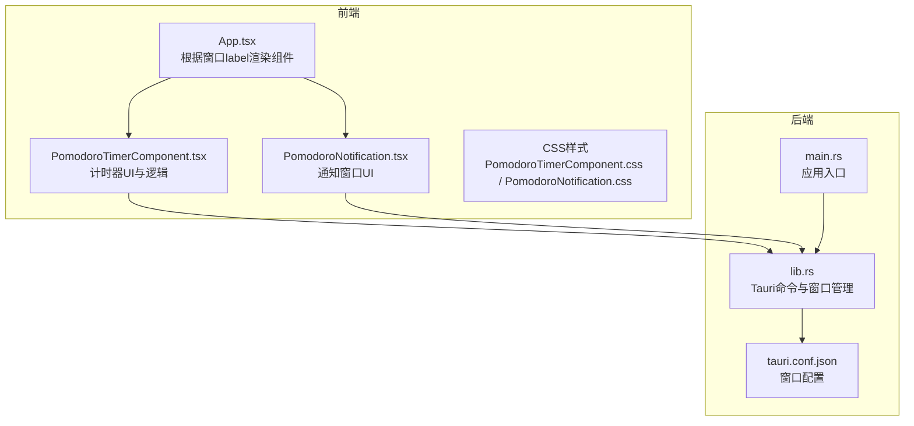
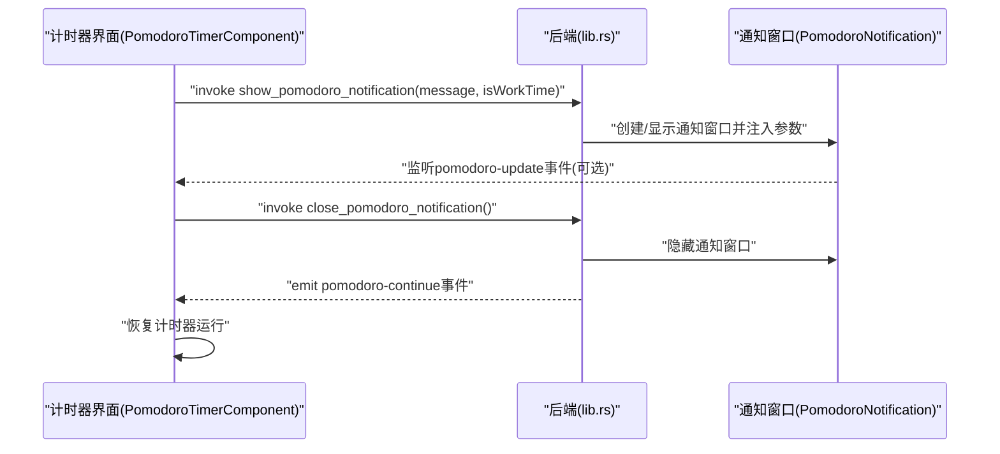
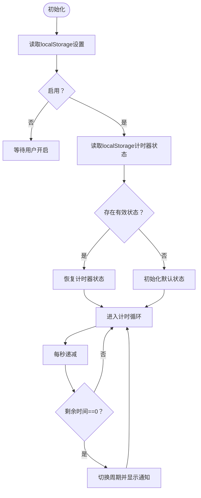
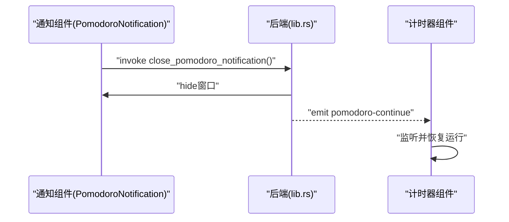
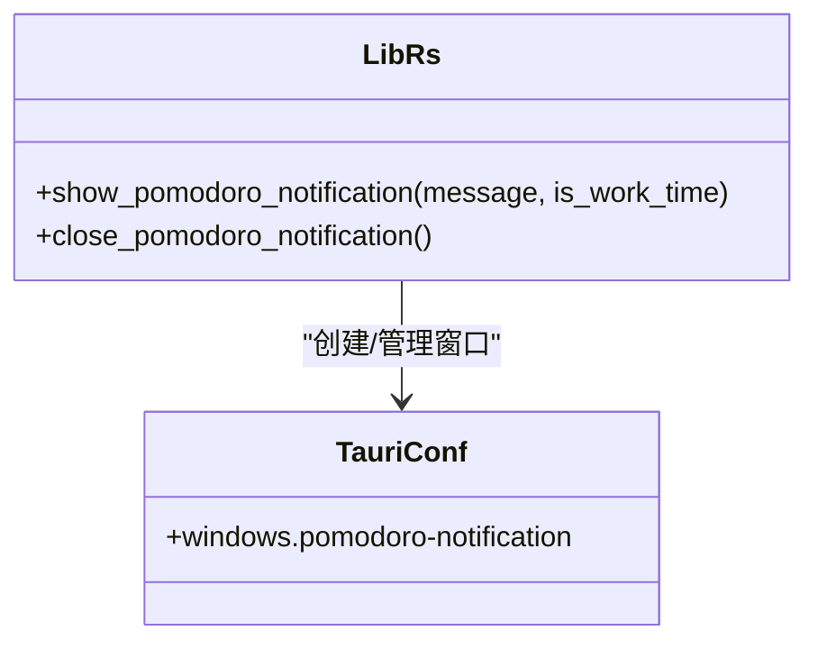
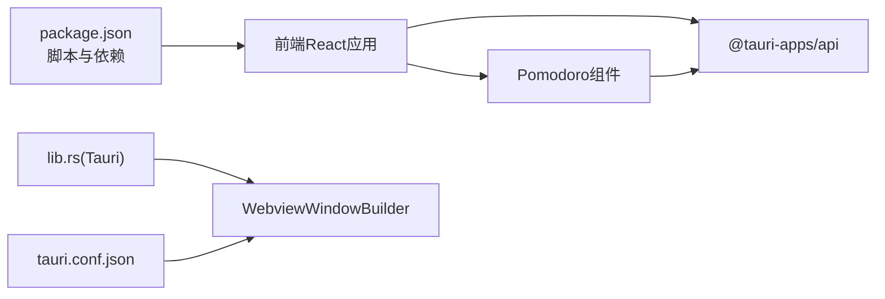

# 番茄钟计时器

<cite>
**本文引用的文件**
- [PomodoroTimerComponent.tsx](file://src/components/PomodoroTimerComponent.tsx)
- [PomodoroNotification.tsx](file://src/components/PomodoroNotification.tsx)
- [PomodoroTimerComponent.css](file://src/components/PomodoroTimerComponent.css)
- [PomodoroNotification.css](file://src/components/PomodoroNotification.css)
- [lib.rs](file://src-tauri/src/lib.rs)
- [main.rs](file://src-tauri/src/main.rs)
- [tauri.conf.json](file://src-tauri/tauri.conf.json)
- [App.tsx](file://src/App.tsx)
- [package.json](file://package.json)
- [README.md](file://README.md)
</cite>

## 目录
1. [简介](#简介)
2. [项目结构](#项目结构)
3. [核心组件](#核心组件)
4. [架构总览](#架构总览)
5. [详细组件分析](#详细组件分析)
6. [依赖关系分析](#依赖关系分析)
7. [性能考量](#性能考量)
8. [故障排查指南](#故障排查指南)
9. [结论](#结论)
10. [附录](#附录)

## 简介
本项目提供了一个基于 Tauri 2 + React 的桌面番茄钟计时器，支持专注时间与休息时间的循环切换、工作时段限制、本地持久化、系统托盘集成以及“番茄钟提醒”桌面通知窗口。用户可通过设置面板配置专注时长、休息时长与工作时段；计时器在倒计时结束时通过通知窗口提示并等待用户确认后自动进入下一周期。

## 项目结构
- 前端采用 React + TypeScript，核心组件位于 src/components 下，其中 PomodoroTimerComponent.tsx 与 PomodoroNotification.tsx 分别负责计时器界面与通知窗口。
- 后端使用 Rust + Tauri，核心逻辑在 src-tauri/src/lib.rs 中，通过命令暴露给前端调用。
- 应用窗口配置在 src-tauri/tauri.conf.json 中，定义了“pomodoro-notification”窗口属性。
- App.tsx 根据窗口 label 动态渲染不同组件，包括番茄钟计时器与通知窗口。

图表来源
- [App.tsx:18-58](file://src/App.tsx#L18-L58)
- [PomodoroTimerComponent.tsx:22-402](file://src/components/PomodoroTimerComponent.tsx#L22-L402)
- [PomodoroNotification.tsx:11-64](file://src/components/PomodoroNotification.tsx#L11-L64)
- [lib.rs:941-1113](file://src-tauri/src/lib.rs#L941-L1113)
- [main.rs:8-11](file://src-tauri/src/main.rs#L8-L11)
- [tauri.conf.json:13-42](file://src-tauri/tauri.conf.json#L13-L42)

章节来源
- [App.tsx:18-58](file://src/App.tsx#L18-L58)
- [package.json:1-29](file://package.json#L1-L29)
- [README.md:129-169](file://README.md#L129-L169)

## 核心组件
- 计时器组件：负责设置、状态管理、倒计时推进、工作/休息模式切换、与通知系统的交互。
- 通知组件：负责显示“番茄钟提醒”窗口，接收来自后端的更新事件，并在用户点击“继续”后向主计时器发送继续信号。
- 后端命令：提供 show_pomodoro_notification 与 close_pomodoro_notification，用于创建/更新通知窗口并回传继续事件。
- 窗口配置：在 tauri.conf.json 中声明 pomodoro-notification 窗口，设置尺寸、置顶、无边框等属性。

章节来源
- [PomodoroTimerComponent.tsx:22-402](file://src/components/PomodoroTimerComponent.tsx#L22-L402)
- [PomodoroNotification.tsx:11-64](file://src/components/PomodoroNotification.tsx#L11-L64)
- [lib.rs:889-939](file://src-tauri/src/lib.rs#L889-L939)
- [tauri.conf.json:29-42](file://src-tauri/tauri.conf.json#L29-L42)

## 架构总览
前端通过 @tauri-apps/api 的 invoke 调用后端命令，后端使用 WebviewWindowBuilder 创建或复用通知窗口，并通过事件系统与前端通信。

图表来源
- [PomodoroTimerComponent.tsx:56-65](file://src/components/PomodoroTimerComponent.tsx#L56-L65)
- [lib.rs:890-939](file://src-tauri/src/lib.rs#L890-L939)
- [PomodoroNotification.tsx:25-39](file://src/components/PomodoroNotification.tsx#L25-L39)

## 详细组件分析

### 计时器组件（PomodoroTimerComponent）
- 设置与状态
  - 设置项：工作开始/结束时间、专注时长（分钟）、休息时长（分钟）、启用开关。
  - 状态项：是否运行、是否专注时间、剩余秒数、周期起始时间戳。
- 生命周期与持久化
  - 初始化：从 localStorage 读取设置；若启用且存在保存的计时器状态则恢复。
  - 运行中：每秒递减；当剩余时间为0时触发周期切换。
  - 持久化：运行中的计时器状态写入 localStorage，以便重启后恢复。
- 控制逻辑
  - 开始/暂停：切换 isRunning 并记录 cycleStartTime。
  - 重置：保持当前模式，将 timeLeft 重置为对应时长。
  - 切换周期：根据当前 isWorkTime 选择下个时长，显示对应通知，然后重置状态。
- 工作时段限制
  - 仅在工作时段内允许计时器运行；若超出时段则自动停止。
- 事件监听
  - 监听 pomodoro-continue 事件，收到后恢复计时器运行。
- UI 展示
  - 当前模式标识、倒计时数字、进度条、控制按钮（开始/暂停、重置）。

图表来源
- [PomodoroTimerComponent.tsx:67-104](file://src/components/PomodoroTimerComponent.tsx#L67-L104)
- [PomodoroTimerComponent.tsx:116-166](file://src/components/PomodoroTimerComponent.tsx#L116-L166)

章节来源
- [PomodoroTimerComponent.tsx:22-402](file://src/components/PomodoroTimerComponent.tsx#L22-L402)
- [PomodoroTimerComponent.css:332-428](file://src/components/PomodoroTimerComponent.css#L332-L428)

### 通知组件（PomodoroNotification）
- 初始化：从 URL hash 参数解析 message 与 isWorkTime。
- 更新：监听 pomodoro-update 事件，动态更新通知内容。
- 交互：用户点击“继续”按钮后调用后端 close_pomodoro_notification，隐藏通知窗口并向主计时器发送 pomodoro-continue 事件。

图表来源
- [PomodoroNotification.tsx:41-47](file://src/components/PomodoroNotification.tsx#L41-L47)
- [lib.rs:931-939](file://src-tauri/src/lib.rs#L931-L939)
- [PomodoroTimerComponent.tsx:168-187](file://src/components/PomodoroTimerComponent.tsx#L168-L187)

章节来源
- [PomodoroNotification.tsx:11-64](file://src/components/PomodoroNotification.tsx#L11-L64)
- [PomodoroNotification.css:1-87](file://src/components/PomodoroNotification.css#L1-L87)

### 后端命令与窗口管理（lib.rs）
- show_pomodoro_notification
  - 若通知窗口已存在：向其发送 pomodoro-update 事件并显示/聚焦。
  - 若不存在：创建新窗口，注入 message 与 isWorkTime 参数。
- close_pomodoro_notification
  - 隐藏通知窗口，并向主计时器窗口发出 pomodoro-continue 事件。
- 窗口配置
  - tauri.conf.json 中声明 pomodoro-notification 窗口，设置透明、无边框、置顶、居中等属性。

图表来源
- [lib.rs:889-939](file://src-tauri/src/lib.rs#L889-L939)
- [tauri.conf.json:29-42](file://src-tauri/tauri.conf.json#L29-L42)

章节来源
- [lib.rs:889-939](file://src-tauri/src/lib.rs#L889-L939)
- [tauri.conf.json:29-42](file://src-tauri/tauri.conf.json#L29-L42)

## 依赖关系分析
- 前端依赖
  - @tauri-apps/api：用于 invoke、listen、window 操作。
  - React：组件化 UI。
- 后端依赖
  - tauri：窗口管理、事件系统、插件。
  - serde、tokio：序列化与异步任务。
- 构建与脚本
  - package.json 定义了 dev/build/tauri 脚本，配合 tauri.conf.json 的 build 字段。

图表来源
- [package.json:6-11](file://package.json#L6-L11)
- [tauri.conf.json:6-11](file://src-tauri/tauri.conf.json#L6-L11)
- [lib.rs:941-996](file://src-tauri/src/lib.rs#L941-L996)

章节来源
- [package.json:1-29](file://package.json#L1-L29)
- [tauri.conf.json:1-74](file://src-tauri/tauri.conf.json#L1-L74)

## 性能考量
- 计时精度：前端使用 setInterval 每秒递减，时间精度受浏览器定时器影响；建议在长时间运行场景下关注漂移问题。
- 事件监听：组件卸载时清理监听器，避免内存泄漏。
- 窗口管理：通知窗口按需创建/复用，避免重复实例导致资源浪费。
- 持久化：仅在运行中写入 localStorage，减少频繁 IO。

## 故障排查指南
- 通知窗口未显示
  - 检查后端命令是否成功创建窗口，确认 tauri.conf.json 中 pomodoro-notification 窗口配置。
  - 确认前端已调用 invoke show_pomodoro_notification。
- 无法继续计时
  - 确认通知窗口点击“继续”后是否调用 close_pomodoro_notification。
  - 检查后端是否正确发出 pomodoro-continue 事件，前端是否监听到该事件。
- 计时器不运行
  - 检查工作时段设置与当前时间是否匹配。
  - 确认启用开关已开启，且 localStorage 中未被意外清空。
- 窗口无法隐藏/显示
  - 检查 App.tsx 中根据窗口 label 的渲染逻辑，确保 label 正确。

章节来源
- [PomodoroTimerComponent.tsx:168-187](file://src/components/PomodoroTimerComponent.tsx#L168-L187)
- [PomodoroNotification.tsx:41-47](file://src/components/PomodoroNotification.tsx#L41-L47)
- [lib.rs:889-939](file://src-tauri/src/lib.rs#L889-L939)
- [App.tsx:47-50](file://src/App.tsx#L47-L50)

## 结论
本番茄钟计时器通过清晰的前后端职责划分与事件驱动的窗口通信，实现了专注/休息模式的自动化切换与用户反馈。其模块化设计便于扩展更多功能，如长休息周期、统计报表、主题切换等。建议后续优化计时精度与持久化策略，以提升长期使用的稳定性与体验。

## 附录

### 使用指南与效率建议
- 时间设置
  - 专注时长：建议 25 分钟起步，便于进入心流状态。
  - 休息时长：建议 5 分钟，用于短暂放松与活动。
  - 工作时段：仅在工作时间内启用计时器，避免非工作时间打扰。
- 用户反馈
  - 切换周期时，通知窗口会提示“需要走走休息一会儿了”或“休息好了可以继续工作啦”，点击“继续”后自动进入下一周期。
- 控制操作
  - 开始/暂停：在运行中可随时暂停，再次点击继续。
  - 重置：重置当前模式的时间，不改变模式。
- 界面与主题
  - UI 包含倒计时数字、进度条与控制按钮，支持深色模式与高对比度模式。
- 托盘与后台
  - 应用支持托盘图标与菜单，可在托盘中快速显示/隐藏主窗口与其他功能窗口。计时器在后台运行，不受前台窗口切换影响。

章节来源
- [PomodoroTimerComponent.tsx:225-255](file://src/components/PomodoroTimerComponent.tsx#L225-L255)
- [PomodoroTimerComponent.css:342-428](file://src/components/PomodoroTimerComponent.css#L342-L428)
- [README.md:216-229](file://README.md#L216-L229)