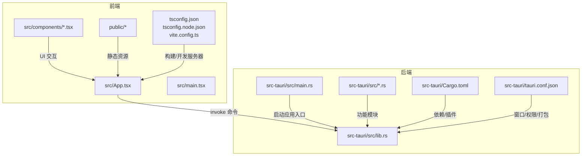
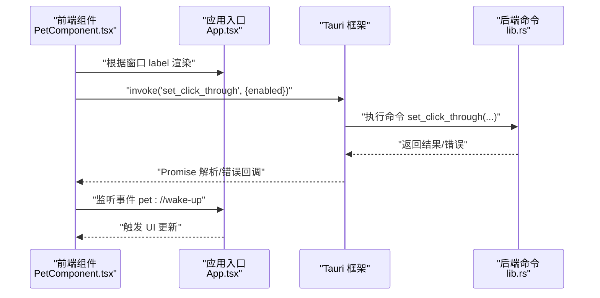
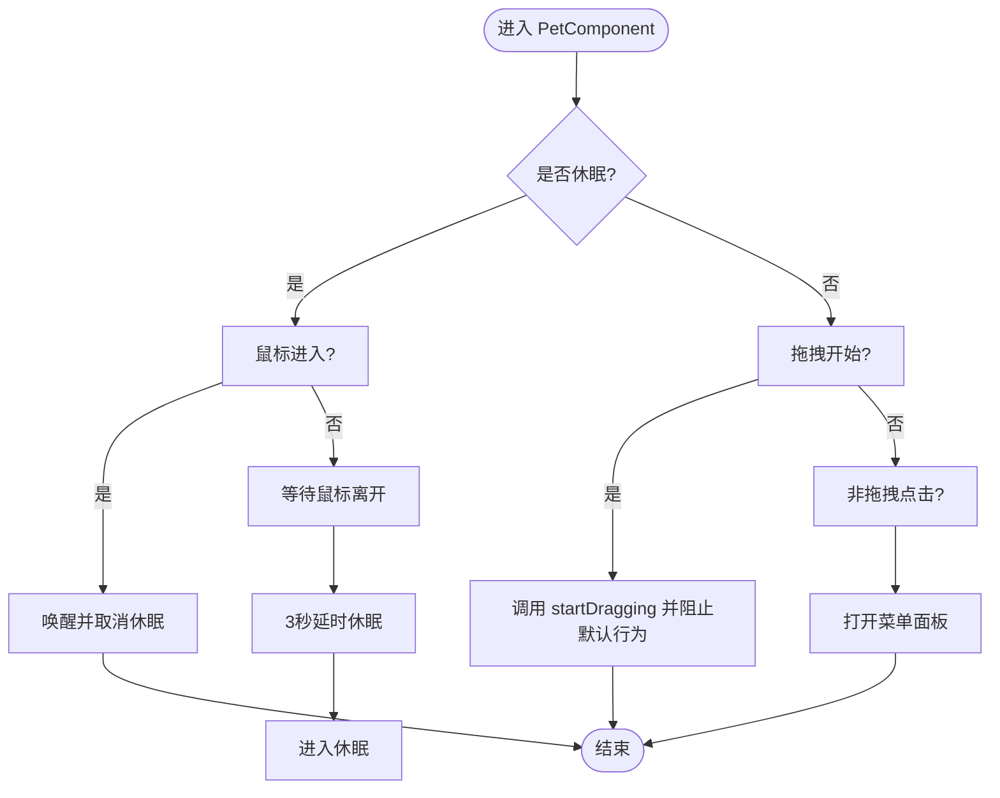
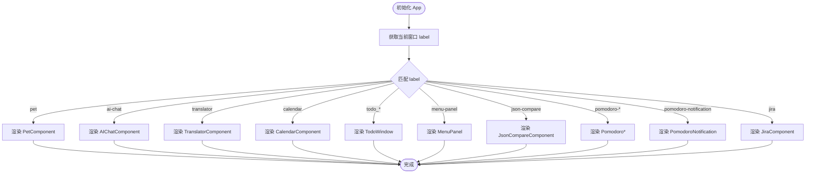
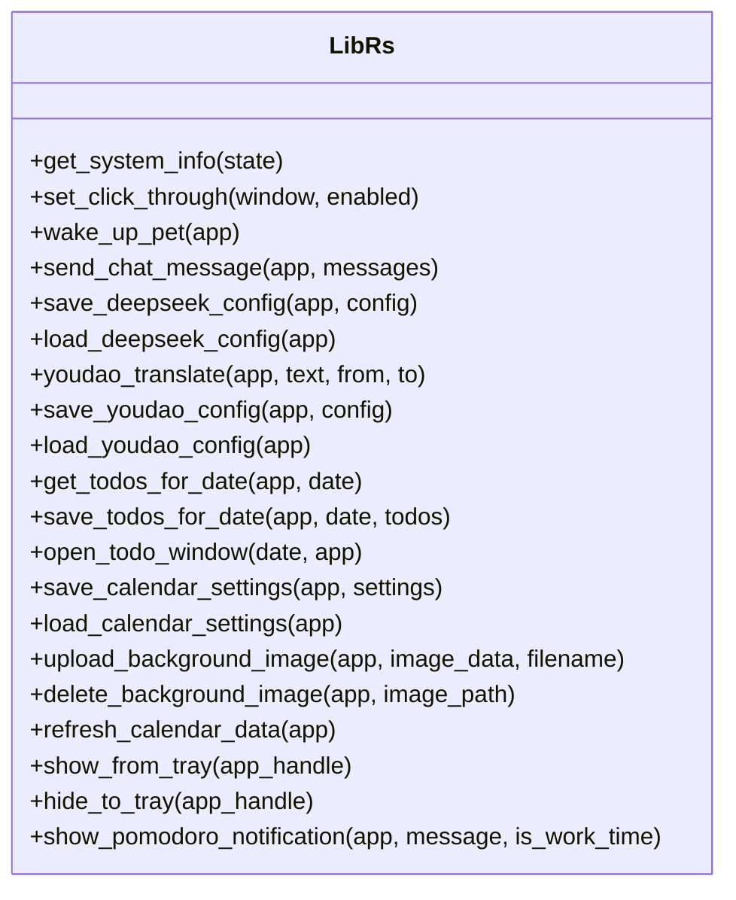
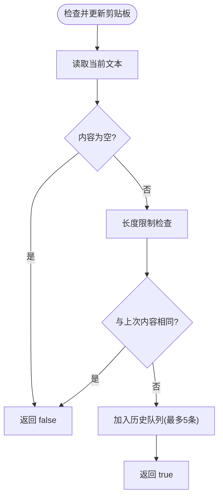
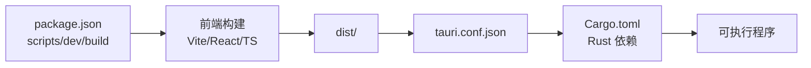

# 开发指南

<cite>
**本文引用的文件**
- [package.json](file://package.json)
- [vite.config.ts](file://vite.config.ts)
- [tsconfig.json](file://tsconfig.json)
- [tsconfig.node.json](file://tsconfig.node.json)
- [src-tauri/Cargo.toml](file://src-tauri/Cargo.toml)
- [src-tauri/tauri.conf.json](file://src-tauri/tauri.conf.json)
- [src-tauri/tauri.conf.dev.json](file://src-tauri/tauri.conf.dev.json)
- [src-tauri/src/main.rs](file://src-tauri/src/main.rs)
- [src-tauri/src/lib.rs](file://src-tauri/src/lib.rs)
- [src-tauri/src/clipboard.rs](file://src-tauri/src/clipboard.rs)
- [src-tauri/src/calendar.rs](file://src-tauri/src/calendar.rs)
- [src-tauri/src/jira_tools.rs](file://src-tauri/src/jira_tools.rs)
- [src/App.tsx](file://src/App.tsx)
- [src/main.tsx](file://src/main.tsx)
- [public/config/bubbles.json](file://public/config/bubbles.json)
- [README.md](file://README.md)
</cite>

## 目录
1. [简介](#简介)
2. [项目结构](#项目结构)
3. [核心组件](#核心组件)
4. [架构总览](#架构总览)
5. [详细组件分析](#详细组件分析)
6. [依赖关系分析](#依赖关系分析)
7. [性能考虑](#性能考虑)
8. [故障排查指南](#故障排查指南)
9. [结论](#结论)
10. [附录](#附录)

## 简介
本指南面向参与 XSUN Desktop Pet（桌宠）项目的开发者，提供从环境搭建、开发流程、调试方法、构建打包、测试策略到性能优化与质量保障的全流程说明。项目采用 React + TypeScript 前端与 Rust + Tauri 2 后端的跨平台桌面应用架构，具备多窗口、托盘、系统级能力与多种实用工具模块。

## 项目结构
项目采用前后端分离的 Tauri 应用布局：
- 前端位于 src/，包含 React 组件与工具函数；静态资源位于 public/；Vite 配置位于根目录。
- 后端位于 src-tauri/，包含 Rust 源码、配置与能力声明；Tauri 配置位于 tauri.conf.json。
- 根目录包含包管理与类型配置文件，如 package.json、tsconfig.json、vite.config.ts 等。

图表来源
- [src-tauri/src/main.rs:1-11](file://src-tauri/src/main.rs#L1-L11)
- [src-tauri/src/lib.rs:1-100](file://src-tauri/src/lib.rs#L1-L100)
- [src/App.tsx:1-57](file://src/App.tsx#L1-L57)
- [src/main.tsx:1-10](file://src/main.tsx#L1-L10)
- [vite.config.ts:1-33](file://vite.config.ts#L1-L33)
- [tsconfig.json:1-26](file://tsconfig.json#L1-L26)
- [tsconfig.node.json:1-11](file://tsconfig.node.json#L1-L11)
- [src-tauri/Cargo.toml:1-43](file://src-tauri/Cargo.toml#L1-L43)
- [src-tauri/tauri.conf.json:1-74](file://src-tauri/tauri.conf.json#L1-L74)

章节来源
- [README.md:232-247](file://README.md#L232-L247)
- [src-tauri/tauri.conf.json:1-74](file://src-tauri/tauri.conf.json#L1-L74)
- [vite.config.ts:1-33](file://vite.config.ts#L1-L33)

## 核心组件
- 桌宠主界面与菜单：PetComponent.tsx 负责可拖动的宠物形象、休眠/活跃状态切换、菜单面板弹出与托盘事件监听。
- 窗口路由与入口：App.tsx 根据窗口 label 切换渲染不同组件，实现多窗口架构。
- 后端命令与系统能力：lib.rs 定义 invoke 命令（系统信息、窗口控制、AI/翻译、日历、剪贴板、托盘等），配合各模块实现业务逻辑。
- 配置与资源：bubbles.json 定义菜单项；tauri.conf.json 管理窗口、权限与打包目标；Cargo.toml 管理 Rust 依赖与插件。

章节来源
- [src/App.tsx:1-57](file://src/App.tsx#L1-L57)
- [src-tauri/src/lib.rs:38-186](file://src-tauri/src/lib.rs#L38-L186)
- [public/config/bubbles.json:1-52](file://public/config/bubbles.json#L1-L52)
- [src-tauri/tauri.conf.json:1-74](file://src-tauri/tauri.conf.json#L1-L74)

## 架构总览
前端通过 Tauri 的 invoke 与后端命令通信，后端通过命令暴露系统能力与业务逻辑，多窗口按需创建与销毁，托盘提供快捷入口。

图表来源
- [src/App.tsx:1-57](file://src/App.tsx#L1-L57)
- [src-tauri/src/lib.rs:45-56](file://src-tauri/src/lib.rs#L45-L56)

章节来源
- [README.md:170-176](file://README.md#L170-L176)
- [src-tauri/src/lib.rs:38-186](file://src-tauri/src/lib.rs#L38-L186)

## 详细组件分析

### 桌宠与菜单交互（PetComponent）
- 状态机：休眠（点击穿透）、活跃（可拖动/点击）。鼠标进入唤醒、离开延时休眠。
- 事件处理：拖拽、点击（打开菜单）、双击（休眠下唤醒）。
- 与后端通信：调用 set_click_through 控制点击穿透；监听 pet://wake-up 事件。

图表来源
- [src/components/PetComponent.tsx:1-200](file://src/components/PetComponent.tsx#L1-L200)

章节来源
- [src/components/PetComponent.tsx:1-200](file://src/components/PetComponent.tsx#L1-L200)

### 窗口路由与多窗口管理（App.tsx）
- 根据窗口 label 切换渲染：pet、ai-chat、translator、calendar、todo_*、menu-panel、json-compare、pomodoro-*、pomodoro-notification、jira 等。
- 与后端事件联动：监听 tray://open-* 事件以创建/聚焦对应窗口。

图表来源
- [src/App.tsx:17-55](file://src/App.tsx#L17-L55)

章节来源
- [src/App.tsx:1-57](file://src/App.tsx#L1-L57)

### 后端命令与系统能力（lib.rs）
- 系统信息：获取 CPU/内存使用率。
- 窗口控制：设置点击穿透、唤醒桌宠。
- AI 对话：DeepSeek 配置加载与消息发送。
- 翻译：有道翻译 API 请求与签名生成。
- 日历：待办事项、设置、背景图上传/删除。
- 托盘：创建菜单、处理点击/双击事件。
- 番茄钟通知：动态创建/复用通知窗口并推送消息。

图表来源
- [src-tauri/src/lib.rs:38-800](file://src-tauri/src/lib.rs#L38-L800)

章节来源
- [src-tauri/src/lib.rs:38-800](file://src-tauri/src/lib.rs#L38-L800)

### 剪贴板模块（clipboard.rs）
- 历史记录：最多 5 条，去重与时间戳管理。
- 操作：读取当前剪贴板、追加历史、复制内容、清空历史。
- 错误处理：锁竞争、内容长度限制、异常路径提示。

图表来源
- [src-tauri/src/clipboard.rs:85-121](file://src-tauri/src/clipboard.rs#L85-L121)

章节来源
- [src-tauri/src/clipboard.rs:1-200](file://src-tauri/src/clipboard.rs#L1-L200)

### 日历模块（calendar.rs）
- 数据模型：TodoItem、CalendarEvent、DayData、CalendarSettings。
- 文件存储：todos.json、events.json、calendar_settings.json。
- 功能：按日期加载/保存待办、事件；默认设置与主题选项。

章节来源
- [src-tauri/src/calendar.rs:1-200](file://src-tauri/src/calendar.rs#L1-L200)

### JIRA 工具（jira_tools.rs）
- 配置：JiraConfig、GitConfig、GitRepository。
- 能力：加载/保存配置；连接 JIRA；查询未完成任务；工作日志处理；AI 辅助生成。
- 安全：基础认证与 Token 管理。

章节来源
- [src-tauri/src/jira_tools.rs:1-200](file://src-tauri/src/jira_tools.rs#L1-L200)

## 依赖关系分析
- 前端依赖：React、@tauri-apps/api、@tauri-apps 插件（fs、dialog、opener）。
- 后端依赖：tauri、reqwest、sysinfo、tokio、serde、uuid、git2、clipboard-manager 等。
- 构建与开发：Vite、TypeScript、Tauri CLI。

图表来源
- [package.json:1-29](file://package.json#L1-L29)
- [vite.config.ts:1-33](file://vite.config.ts#L1-L33)
- [src-tauri/Cargo.toml:1-43](file://src-tauri/Cargo.toml#L1-L43)
- [src-tauri/tauri.conf.json:1-74](file://src-tauri/tauri.conf.json#L1-L74)

章节来源
- [package.json:1-29](file://package.json#L1-L29)
- [src-tauri/Cargo.toml:1-43](file://src-tauri/Cargo.toml#L1-L43)

## 性能考虑
- 前端
  - 组件懒加载与按需渲染，减少初始开销。
  - 合理使用事件监听与定时器，避免内存泄漏。
  - 图片与动画资源压缩，避免大体积资源常驻内存。
- 后端
  - 异步 I/O：使用 tokio 运行时，避免阻塞 UI。
  - 依赖库优化：sysinfo、reqwest、serde 等按需启用特性。
  - 剪贴板与日历数据：限制容量与序列化大小，及时清理。
- 资源与打包
  - Tauri 打包目标包含 msi、nsis、dmg，按需选择。
  - 静态资源与配置文件纳入打包范围。

章节来源
- [src-tauri/src/clipboard.rs:29-82](file://src-tauri/src/clipboard.rs#L29-L82)
- [src-tauri/src/calendar.rs:98-141](file://src-tauri/src/calendar.rs#L98-L141)
- [src-tauri/tauri.conf.json:53-68](file://src-tauri/tauri.conf.json#L53-L68)

## 故障排查指南
- 开发环境
  - 端口占用：Vite 固定端口 1420，严格端口模式，确保未被占用。
  - HMR 主机：通过环境变量配置远程主机，便于容器/网络联调。
- 后端命令
  - invoke 失败：检查命令签名与参数类型，关注错误字符串返回。
  - 文件读写：确认应用数据目录存在且有写权限。
- 窗口与托盘
  - 窗口找不到：确认窗口 label 与创建逻辑一致。
  - 托盘菜单：检查事件监听与菜单项 id 匹配。
- 网络与第三方 API
  - AI/翻译接口：检查配置文件与鉴权头，关注状态码与错误信息。

章节来源
- [vite.config.ts:14-31](file://vite.config.ts#L14-L31)
- [src-tauri/src/lib.rs:147-186](file://src-tauri/src/lib.rs#L147-L186)
- [src-tauri/src/lib.rs:363-436](file://src-tauri/src/lib.rs#L363-L436)

## 结论
本项目以模块化与多窗口为核心，结合 Tauri 的系统能力与前端的交互体验，提供了完整的开发与运行框架。遵循本文档的环境搭建、开发流程、调试与性能优化建议，可高效推进功能迭代与质量保障。

## 附录

### 开发环境搭建
- Node.js 与 npm：参考 README 的版本信息，安装对应版本以保证兼容性。
- Rust 与 Cargo：安装指定版本，确保工具链可用。
- Tauri：安装 CLI 并按需安装平台依赖（Windows SDK、Linux GTK 等）。
- IDE：推荐 VS Code，安装 TypeScript、React、Tauri 相关扩展。

章节来源
- [README.md:22-28](file://README.md#L22-L28)

### 开发流程与规范
- 代码结构：前端组件按功能划分，后端模块按职责拆分。
- 命令扩展：新增功能先在 lib.rs 添加命令，再在前端调用 invoke。
- 配置管理：菜单项在 bubbles.json 中维护，后端配置保存于应用数据目录。
- 版本控制：遵循分支策略与提交规范，变更涉及的配置与资源一并提交。

章节来源
- [public/config/bubbles.json:1-52](file://public/config/bubbles.json#L1-L52)
- [src-tauri/src/lib.rs:242-271](file://src-tauri/src/lib.rs#L242-L271)

### 调试技巧与工具
- 前端调试：浏览器 DevTools、React DevTools；Vite HMR 与热更新。
- 后端调试：Rust 日志输出、错误字符串回传；Windows Subsystem 控制台。
- 跨端调试：通过 tauri.conf.json 的 devUrl 与 beforeDevCommand 配合 Vite；远程主机调试可设置 TAURI_DEV_HOST。
- 托盘与窗口：打印窗口可见性与焦点状态，验证事件流。

章节来源
- [vite.config.ts:5-31](file://vite.config.ts#L5-L31)
- [src-tauri/tauri.conf.json:6-11](file://src-tauri/tauri.conf.json#L6-L11)
- [src-tauri/src/main.rs:1-11](file://src-tauri/src/main.rs#L1-L11)

### 构建与打包
- 开发构建：npm run dev 启动 Vite，tauri dev 启动 Tauri 开发。
- 生产构建：npm run build 生成前端产物，cargo tauri build 生成安装包。
- 打包目标：tauri.conf.json 中 targets 指定 msi/nsis/dmg。

章节来源
- [package.json:6-11](file://package.json#L6-L11)
- [README.md:249-259](file://README.md#L249-L259)
- [src-tauri/tauri.conf.json:53-68](file://src-tauri/tauri.conf.json#L53-L68)

### 测试策略
- 单元测试：后端命令与工具函数可按模块编写异步测试。
- 集成测试：模拟窗口事件与 invoke 调用，验证 UI 与命令交互。
- 端到端测试：使用 Tauri 提供的 e2e 能力或外部工具，覆盖关键用户路径（如菜单、托盘、窗口切换）。

[本节为通用指导，无需特定文件来源]

### 性能优化
- 前端：减少不必要的重渲染，使用 React.memo/useCallback；按需加载大组件。
- 后端：避免在主线程执行耗时操作；合理使用 tokio 任务池；缓存热点数据。
- 资源：压缩图片与字体；限制剪贴板与日历数据容量；及时释放资源句柄。

[本节为通用指导，无需特定文件来源]

### 代码审查与质量保证
- 规范：统一命名、注释与错误处理风格；命令参数与返回值一致性。
- 安全：敏感配置（API Key）不硬编码；鉴权头与签名生成正确性。
- 可靠性：边界条件与异常路径覆盖；资源清理与锁保护。

[本节为通用指导，无需特定文件来源]

### 常见问题与解决方案
- 桌宠无法拖动：检查 set_click_through 状态与事件拦截。
- 菜单不显示：确认 bubbles.json 与 MenuPanel 的窗口创建逻辑。
- 托盘点击无响应：核对事件监听与菜单项 id。
- 翻译/AI 接口报错：检查配置文件与网络连通性，关注状态码与错误信息。

章节来源
- [src-tauri/src/lib.rs:662-760](file://src-tauri/src/lib.rs#L662-L760)
- [src-tauri/src/lib.rs:363-436](file://src-tauri/src/lib.rs#L363-L436)

### 开发工具与 IDE 配置建议
- VS Code 扩展：TypeScript TmBundle、ESLint、Prettier、Tauri、Rust-analyzer。
- 调试配置：前端使用 Chrome DevTools；后端使用 CodeLLDB 或 rust-lldb。
- 格式化与 Lint：prettier + eslint；tsconfig 严格模式开启。

章节来源
- [tsconfig.json:17-22](file://tsconfig.json#L17-L22)
- [tsconfig.node.json:1-11](file://tsconfig.node.json#L1-L11)