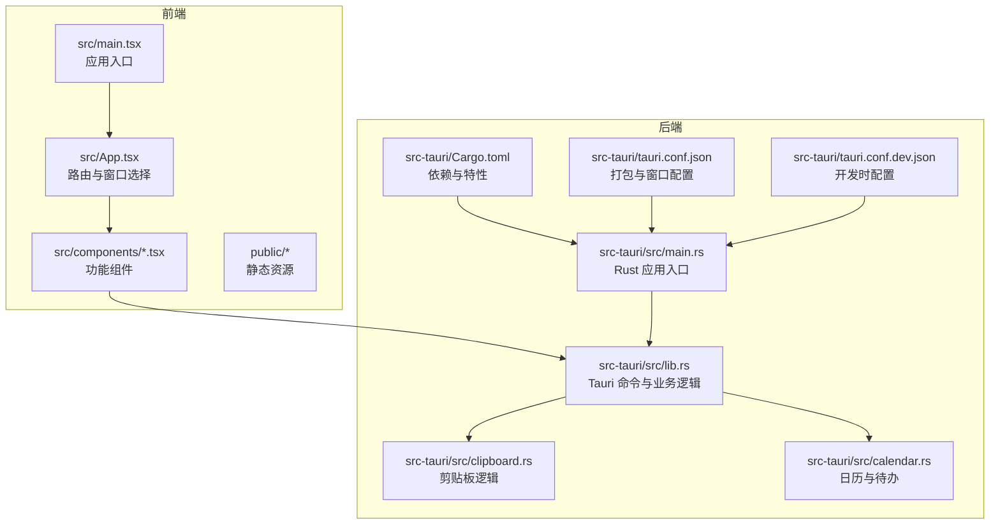
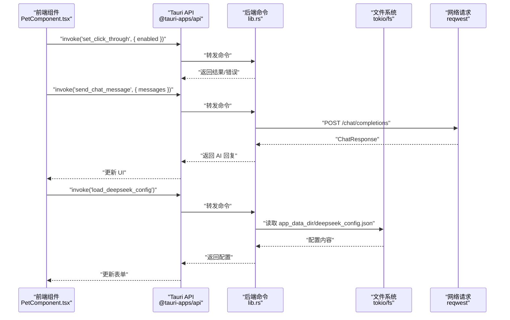
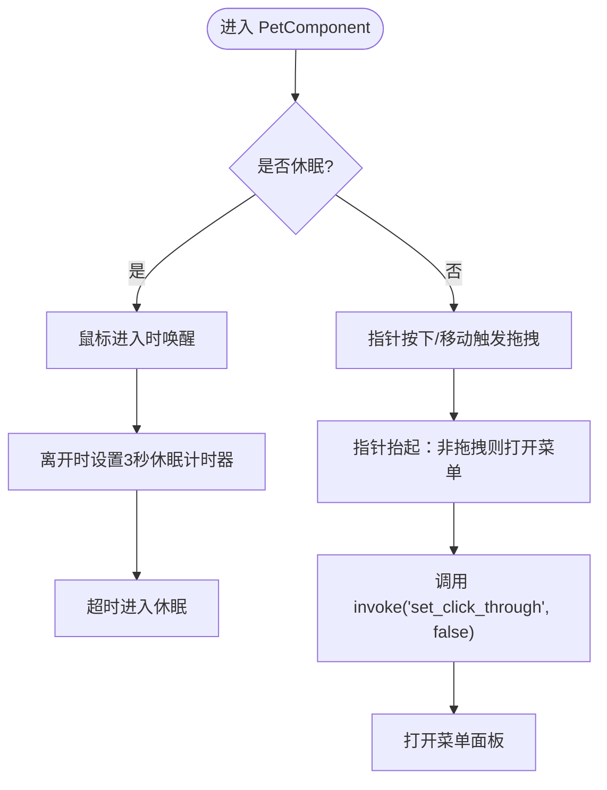
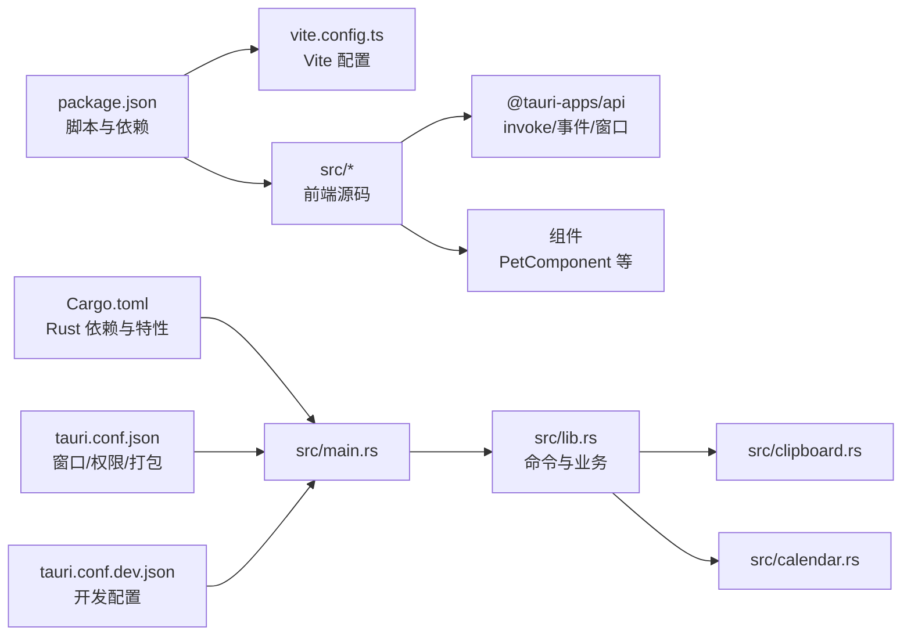

# 开发流程

<cite>
**本文引用的文件**
- [package.json](file://package.json)
- [vite.config.ts](file://vite.config.ts)
- [tsconfig.json](file://tsconfig.json)
- [tsconfig.node.json](file://tsconfig.node.json)
- [src-tauri/Cargo.toml](file://src-tauri/Cargo.toml)
- [src-tauri/tauri.conf.json](file://src-tauri/tauri.conf.json)
- [src-tauri/tauri.conf.dev.json](file://src-tauri/tauri.conf.dev.json)
- [src/main.tsx](file://src/main.tsx)
- [src/App.tsx](file://src/App.tsx)
- [src/components/PetComponent.tsx](file://src/components/PetComponent.tsx)
- [src-tauri/src/main.rs](file://src-tauri/src/main.rs)
- [src-tauri/src/lib.rs](file://src-tauri/src/lib.rs)
- [src-tauri/src/clipboard.rs](file://src-tauri/src/clipboard.rs)
- [src-tauri/src/calendar.rs](file://src-tauri/src/calendar.rs)
- [README.md](file://README.md)
</cite>

## 目录
1. [简介](#简介)
2. [项目结构](#项目结构)
3. [核心组件](#核心组件)
4. [架构总览](#架构总览)
5. [详细组件分析](#详细组件分析)
6. [依赖关系分析](#依赖关系分析)
7. [性能考量](#性能考量)
8. [故障排查指南](#故障排查指南)
9. [结论](#结论)
10. [附录](#附录)

## 简介
本项目是一个基于 React + TypeScript 的前端与 Rust + Tauri 的后端组合的桌面应用，提供“桌宠”以及多种实用工具（剪贴板、系统信息、AI 对话、翻译、日历 TODO、JSON 对比、JIRA 填写等）。开发流程围绕前端 Vite + React、后端 Tauri + Rust 展开，通过 IPC 调用实现前后端协作。

## 项目结构
- src：前端源码，包含组件、工具函数、入口文件等
- src-tauri：Rust 后端源码，包含命令实现、窗口工具、插件依赖等
- public：静态资源（如配置、图片等）
- 构建与开发脚本由 package.json 管理，Vite 配置集中于 vite.config.ts
- Tauri 配置位于 src-tauri/tauri.conf.json（生产）与 tauri.conf.dev.json（开发）

图表来源
- [src/main.tsx:1-10](file://src/main.tsx#L1-L10)
- [src/App.tsx:1-60](file://src/App.tsx#L1-L60)
- [src-tauri/src/main.rs:1-11](file://src-tauri/src/main.rs#L1-L11)
- [src-tauri/src/lib.rs:1-120](file://src-tauri/src/lib.rs#L1-L120)
- [src-tauri/src/clipboard.rs:1-60](file://src-tauri/src/clipboard.rs#L1-L60)
- [src-tauri/src/calendar.rs:1-60](file://src-tauri/src/calendar.rs#L1-L60)
- [src-tauri/Cargo.toml:1-44](file://src-tauri/Cargo.toml#L1-L44)
- [src-tauri/tauri.conf.json:1-74](file://src-tauri/tauri.conf.json#L1-L74)
- [src-tauri/tauri.conf.dev.json:1-8](file://src-tauri/tauri.conf.dev.json#L1-L8)

章节来源
- [README.md:232-247](file://README.md#L232-L247)
- [package.json:1-29](file://package.json#L1-L29)
- [vite.config.ts:1-33](file://vite.config.ts#L1-L33)
- [src-tauri/tauri.conf.json:1-74](file://src-tauri/tauri.conf.json#L1-L74)
- [src-tauri/tauri.conf.dev.json:1-8](file://src-tauri/tauri.conf.dev.json#L1-L8)

## 核心组件
- 前端入口与路由
  - 入口：src/main.tsx 创建根节点并渲染 App
  - 路由：src/App.tsx 根据当前窗口 label 渲染不同组件（如 PetComponent、SystemInfoComponent、AIChatComponent、TranslatorComponent、CalendarComponent、TodoWindow、MenuPanel、JsonCompareComponent、PomodoroTimerComponent、PomodoroNotification、JiraComponent、SelectionMenu 等）
- Rust 后端入口与命令
  - 入口：src-tauri/src/main.rs 调用 xsun_desktop_pet_lib::run
  - 命令：src-tauri/src/lib.rs 定义大量 #[tauri::command]，涵盖系统信息、窗口控制、AI 对话、翻译、日历、剪贴板、任务调度、托盘菜单等
- 配置与构建
  - 前端：package.json 定义 dev/build/preview/tauri 脚本；vite.config.ts 配置固定端口、禁用清屏、忽略 src-tauri 监控、HMR 主机等
  - 后端：Cargo.toml 管理依赖与特性；tauri.conf.json/tauri.conf.dev.json 管理 devUrl、前置命令、窗口与权限、打包目标与资源

章节来源
- [src/main.tsx:1-10](file://src/main.tsx#L1-L10)
- [src/App.tsx:18-58](file://src/App.tsx#L18-L58)
- [src-tauri/src/main.rs:8-11](file://src-tauri/src/main.rs#L8-L11)
- [src-tauri/src/lib.rs:41-160](file://src-tauri/src/lib.rs#L41-L160)
- [package.json:6-11](file://package.json#L6-L11)
- [vite.config.ts:8-32](file://vite.config.ts#L8-L32)
- [src-tauri/Cargo.toml:15-44](file://src-tauri/Cargo.toml#L15-L44)
- [src-tauri/tauri.conf.json:6-11](file://src-tauri/tauri.conf.json#L6-L11)
- [src-tauri/tauri.conf.dev.json:2-7](file://src-tauri/tauri.conf.dev.json#L2-L7)

## 架构总览
前端通过 @tauri-apps/api 的 invoke 与事件监听与后端通信；后端通过 #[tauri::command] 暴露命令，结合窗口管理、系统信息采集、网络请求、文件系统等能力，形成“多窗口 + 托盘 + IPC”的桌面应用架构。

图表来源
- [src/components/PetComponent.tsx:36-47](file://src/components/PetComponent.tsx#L36-L47)
- [src-tauri/src/lib.rs:255-294](file://src-tauri/src/lib.rs#L255-L294)
- [src-tauri/src/lib.rs:311-348](file://src-tauri/src/lib.rs#L311-L348)

章节来源
- [README.md:170-176](file://README.md#L170-L176)
- [src-tauri/src/lib.rs:41-379](file://src-tauri/src/lib.rs#L41-L379)

## 详细组件分析

### 前端入口与路由
- src/main.tsx：创建根节点并渲染 App
- src/App.tsx：根据窗口 label 切换渲染组件，支持 pet、main、clipboard、expand_*、ai-chat、translator、calendar、todo_*、menu-panel、json-compare、pomodoro-timer、pomodoro-notification、jira、selection-menu 等

章节来源
- [src/main.tsx:1-10](file://src/main.tsx#L1-L10)
- [src/App.tsx:18-58](file://src/App.tsx#L18-L58)

### 桌宠组件与交互
- 事件与状态：支持拖拽、点击穿透、休眠/活跃切换、菜单弹出、双击唤醒、鼠标进入/离开延时休眠
- IPC 通信：调用 set_click_through、监听 pet://wake-up、监听托盘事件与选中文本事件

图表来源
- [src/components/PetComponent.tsx:36-87](file://src/components/PetComponent.tsx#L36-L87)
- [src/components/PetComponent.tsx:129-139](file://src/components/PetComponent.tsx#L129-L139)

章节来源
- [src/components/PetComponent.tsx:19-200](file://src/components/PetComponent.tsx#L19-L200)

### Rust 后端命令与业务逻辑
- 系统信息：get_system_info 采集 CPU/内存并返回结构体
- 窗口控制：set_click_through、open_expand_window、open_translator_with_text、open_json_compare_with_text、open_todo_window、wake_up_pet、refresh_calendar_data
- AI 对话：send_chat_message、save_deepseek_config、load_deepseek_config、load_local_deepseek_config
- 翻译：youdao_translate、save_youdao_config、load_youdao_config
- 日历：get_todos_for_date、save_todos_for_date、save_calendar_settings、load_calendar_settings、upload_background_image、delete_background_image
- 剪贴板：get_clipboard_history、add_to_clipboard_history、copy_to_clipboard、get_current_clipboard、clear_clipboard_history
- 托盘菜单：create_tray_menu、处理托盘事件

章节来源
- [src-tauri/src/lib.rs:41-72](file://src-tauri/src/lib.rs#L41-L72)
- [src-tauri/src/lib.rs:48-59](file://src-tauri/src/lib.rs#L48-L59)
- [src-tauri/src/lib.rs:74-112](file://src-tauri/src/lib.rs#L74-L112)
- [src-tauri/src/lib.rs:114-160](file://src-tauri/src/lib.rs#L114-L160)
- [src-tauri/src/lib.rs:162-209](file://src-tauri/src/lib.rs#L162-L209)
- [src-tauri/src/lib.rs:255-294](file://src-tauri/src/lib.rs#L255-L294)
- [src-tauri/src/lib.rs:311-348](file://src-tauri/src/lib.rs#L311-L348)
- [src-tauri/src/lib.rs:351-379](file://src-tauri/src/lib.rs#L351-L379)
- [src-tauri/src/lib.rs:472-545](file://src-tauri/src/lib.rs#L472-L545)
- [src-tauri/src/lib.rs:571-631](file://src-tauri/src/lib.rs#L571-L631)
- [src-tauri/src/lib.rs:672-718](file://src-tauri/src/lib.rs#L672-L718)
- [src-tauri/src/lib.rs:721-761](file://src-tauri/src/lib.rs#L721-L761)
- [src-tauri/src/clipboard.rs:124-200](file://src-tauri/src/clipboard.rs#L124-L200)
- [src-tauri/src/calendar.rs:98-141](file://src-tauri/src/calendar.rs#L98-L141)

### 剪贴板模块
- 数据结构：ClipboardItem、ClipboardHistory（循环队列 + ID + 时间戳）
- 命令：获取历史、手动添加、复制到剪贴板、读取当前剪贴板、清空历史
- 并发与边界：线程安全（Mutex）、长度限制、重复过滤、超长内容保护

章节来源
- [src-tauri/src/clipboard.rs:7-19](file://src-tauri/src/clipboard.rs#L7-L19)
- [src-tauri/src/clipboard.rs:124-200](file://src-tauri/src/clipboard.rs#L124-L200)

### 日历模块
- 数据结构：TodoItem、CalendarEvent、DayData、CalendarSettings、LunarInfo
- 命令：按日期读取/保存待办、读取/保存事件、读取/保存设置、上传/删除背景图
- 文件存储：todos.json、events.json、calendar_settings.json

章节来源
- [src-tauri/src/calendar.rs:5-51](file://src-tauri/src/calendar.rs#L5-L51)
- [src-tauri/src/calendar.rs:98-141](file://src-tauri/src/calendar.rs#L98-L141)
- [src-tauri/src/calendar.rs:143-186](file://src-tauri/src/calendar.rs#L143-L186)
- [src-tauri/src/calendar.rs:188-200](file://src-tauri/src/calendar.rs#L188-L200)

## 依赖关系分析

图表来源
- [package.json:6-27](file://package.json#L6-L27)
- [vite.config.ts:8-32](file://vite.config.ts#L8-L32)
- [src-tauri/Cargo.toml:15-44](file://src-tauri/Cargo.toml#L15-L44)
- [src-tauri/src/main.rs:8-11](file://src-tauri/src/main.rs#L8-L11)
- [src-tauri/src/lib.rs:1-30](file://src-tauri/src/lib.rs#L1-L30)
- [src-tauri/tauri.conf.json:6-11](file://src-tauri/tauri.conf.json#L6-L11)
- [src-tauri/tauri.conf.dev.json:2-7](file://src-tauri/tauri.conf.dev.json#L2-L7)

章节来源
- [package.json:12-27](file://package.json#L12-L27)
- [src-tauri/Cargo.toml:15-44](file://src-tauri/Cargo.toml#L15-L44)
- [src-tauri/tauri.conf.json:44-51](file://src-tauri/tauri.conf.json#L44-L51)

## 性能考量
- 前端
  - Vite 固定端口与严格端口模式避免端口冲突
  - 忽略 src-tauri 监控减少不必要的文件系统扫描
  - HMR 仅在指定主机启用，确保开发体验与性能平衡
- 后端
  - 异步文件系统（tokio/fs）与异步网络（reqwest）提升 IO 效率
  - 窗口与事件采用轻量初始化脚本注入，避免额外开销
  - 剪贴板历史队列长度限制与重复过滤，控制内存占用

章节来源
- [vite.config.ts:14-31](file://vite.config.ts#L14-L31)
- [src-tauri/src/lib.rs:311-348](file://src-tauri/src/lib.rs#L311-L348)
- [src-tauri/src/clipboard.rs:29-82](file://src-tauri/src/clipboard.rs#L29-L82)

## 故障排查指南
- 开发启动失败
  - 确认端口 1420/1421 可用，或设置 TAURI_DEV_HOST 指定主机
  - 检查 beforeDevCommand 是否正确执行 npm run dev
- 构建失败
  - 确认 npm run build 成功生成 dist
  - 检查 tauri.conf.json 的 frontendDist 指向正确
- IPC 调用异常
  - 检查命令名称与参数类型是否匹配
  - 查看后端命令返回的错误字符串定位问题
- 窗口与托盘
  - 确认窗口 label 与 App.tsx 路由一致
  - 托盘菜单项与事件监听需一一对应

章节来源
- [vite.config.ts:5-26](file://vite.config.ts#L5-L26)
- [src-tauri/tauri.conf.json:7-11](file://src-tauri/tauri.conf.json#L7-L11)
- [src-tauri/src/lib.rs:48-59](file://src-tauri/src/lib.rs#L48-L59)
- [src/App.tsx:18-58](file://src/App.tsx#L18-L58)

## 结论
本项目采用“前端 React + 后端 Tauri/Rust”的清晰分层架构，通过 IPC 命令实现前后端协作。开发脚本与配置明确，窗口与托盘管理完善，业务模块（剪贴板、日历、AI、翻译等）职责分离，具备良好的扩展性与可维护性。

## 附录

### 开发脚本与使用场景
- dev：启动 Vite 开发服务器，前端热重载，配合 Tauri dev 使用
- build：TypeScript 编译 + Vite 构建，生成 dist
- preview：本地预览构建产物
- tauri：调用 @tauri-apps/cli，执行 Tauri 命令（如 dev/build）

章节来源
- [package.json:6-11](file://package.json#L6-L11)

### Tauri 命令调用与 IPC 通信
- 前端通过 invoke 调用后端命令，如 set_click_through、send_chat_message、load_deepseek_config、open_translator_with_text、open_json_compare_with_text、open_todo_window、youdao_translate、get_todos_for_date、save_todos_for_date、save_calendar_settings、load_calendar_settings、upload_background_image、delete_background_image、refresh_calendar_data
- 事件监听：pet://wake-up、tray://open-*、selection://popup 等

章节来源
- [src-tauri/src/lib.rs:48-59](file://src-tauri/src/lib.rs#L48-L59)
- [src-tauri/src/lib.rs:255-294](file://src-tauri/src/lib.rs#L255-L294)
- [src-tauri/src/lib.rs:311-348](file://src-tauri/src/lib.rs#L311-L348)
- [src-tauri/src/lib.rs:114-160](file://src-tauri/src/lib.rs#L114-L160)
- [src-tauri/src/lib.rs:162-209](file://src-tauri/src/lib.rs#L162-L209)
- [src-tauri/src/lib.rs:633-669](file://src-tauri/src/lib.rs#L633-L669)
- [src-tauri/src/lib.rs:472-545](file://src-tauri/src/lib.rs#L472-L545)
- [src-tauri/src/lib.rs:571-631](file://src-tauri/src/lib.rs#L571-L631)
- [src-tauri/src/lib.rs:672-718](file://src-tauri/src/lib.rs#L672-L718)
- [src-tauri/src/lib.rs:721-761](file://src-tauri/src/lib.rs#L721-L761)
- [src/components/PetComponent.tsx:156-200](file://src/components/PetComponent.tsx#L156-L200)

### 代码规范与最佳实践
- TypeScript
  - 严格模式、未使用变量/参数检查、switch 不可贯穿
  - JSX 使用 react-jsx，模块解析使用 bundler
- Rust
  - 使用 #[tauri::command] 暴露命令，返回 Result 类型统一错误处理
  - 异步使用 tokio，文件与网络请求采用异步 API
  - 结构体使用 serde 序列化，确保跨语言传递安全
- 前后端协作
  - 命令命名清晰，参数与返回值结构化
  - 事件命名采用命名空间（如 pet://、tray://、translator://、json://），避免冲突

章节来源
- [tsconfig.json:17-22](file://tsconfig.json#L17-L22)
- [tsconfig.node.json:1-11](file://tsconfig.node.json#L1-L11)
- [src-tauri/Cargo.toml:21-26](file://src-tauri/Cargo.toml#L21-L26)
- [src-tauri/src/lib.rs:311-348](file://src-tauri/src/lib.rs#L311-L348)

### 版本控制与分支管理
- 仓库包含 .gitignore，建议遵循常规 Git 工作流：feature 分支开发 → Pull Request → 主干合并 → 打标签发布
- 提交信息建议遵循约定式提交（如 feat/fix/docs/chore 等前缀），便于自动化变更日志与版本发布

章节来源
- [.gitignore](file://.gitignore)

### 调试流程与效率工具
- 热重载：Vite HMR，修改前端即刻生效
- 断点调试：前端可在浏览器 DevTools 设置断点；后端可在 VS Code 中为 Rust 项目设置断点（需安装 Rust 扩展）
- 日志输出：后端命令打印关键信息（如添加/删除剪贴板项、翻译请求、配置读取），便于定位问题
- 开发效率：固定端口与严格端口模式减少端口冲突；忽略 src-tauri 监控减少磁盘扫描；Tauri dev 自动启动前端与后端

章节来源
- [vite.config.ts:14-31](file://vite.config.ts#L14-L31)
- [src-tauri/src/clipboard.rs:72-82](file://src-tauri/src/clipboard.rs#L72-L82)
- [src-tauri/src/lib.rs:472-545](file://src-tauri/src/lib.rs#L472-L545)