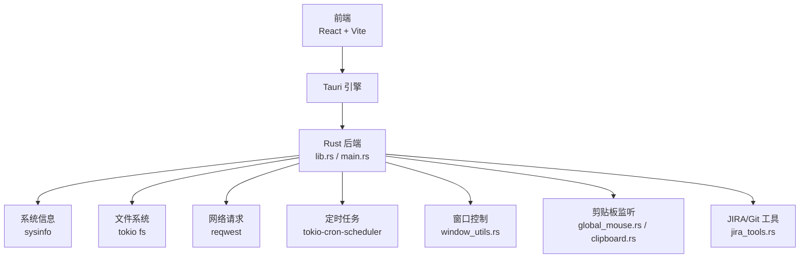
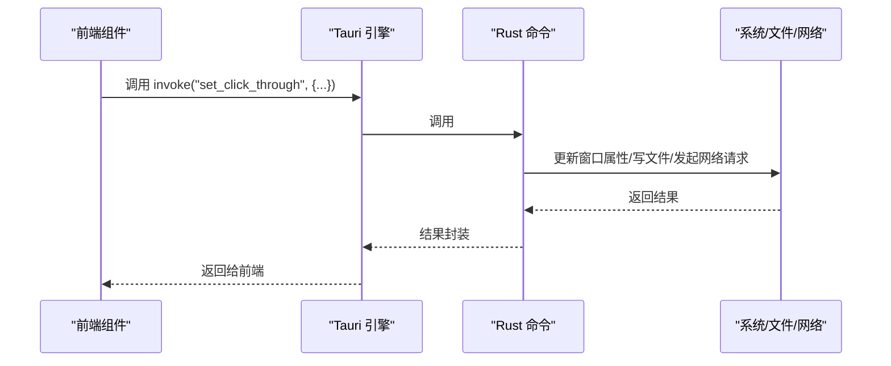
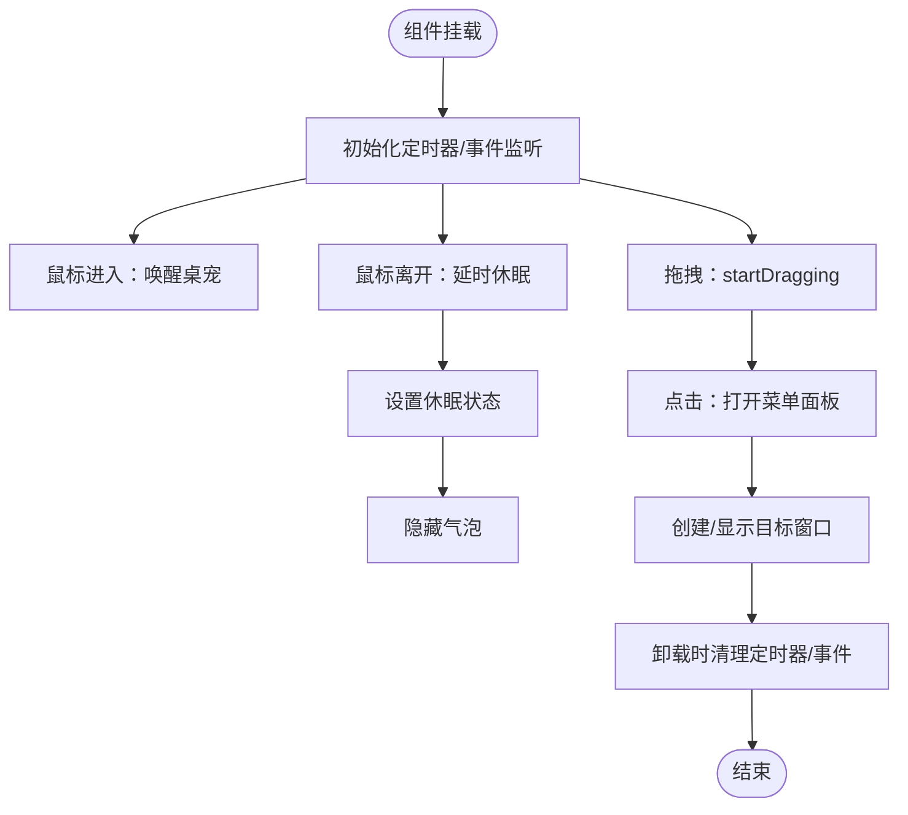
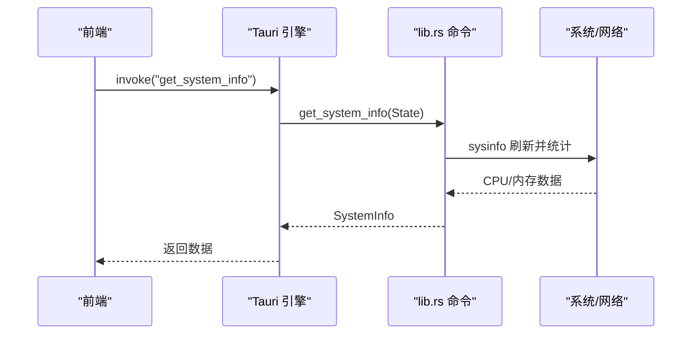
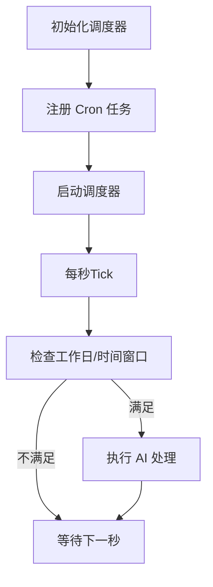
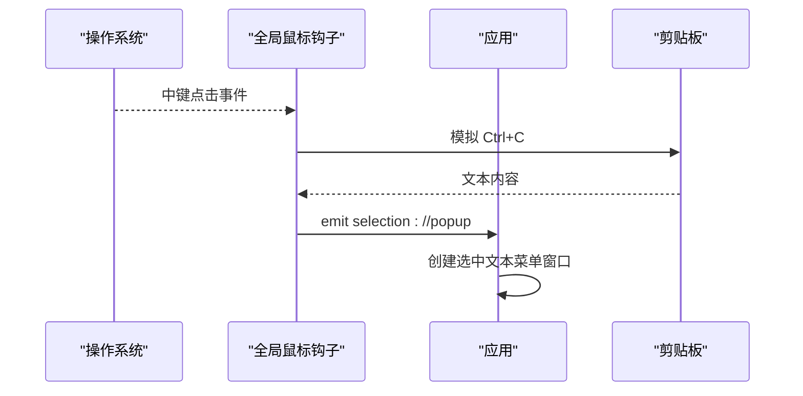
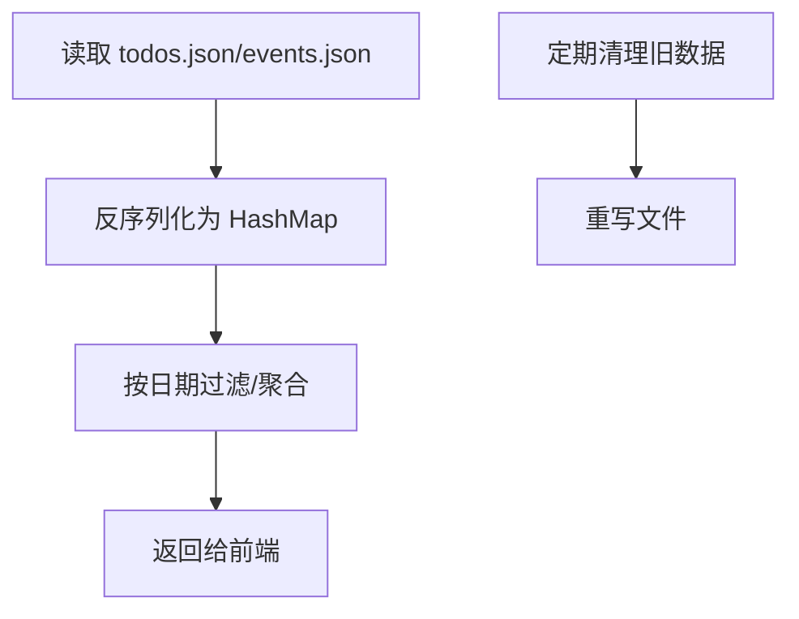
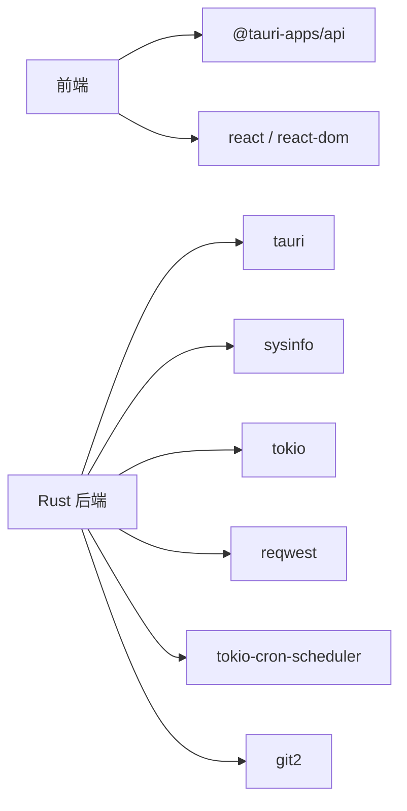

# 性能优化

<cite>
**本文档引用的文件**
- [package.json](file://package.json)
- [vite.config.ts](file://vite.config.ts)
- [src/main.tsx](file://src/main.tsx)
- [src/App.tsx](file://src/App.tsx)
- [src/components/PetComponent.tsx](file://src/components/PetComponent.tsx)
- [src-tauri/Cargo.toml](file://src-tauri/Cargo.toml)
- [src-tauri/src/lib.rs](file://src-tauri/src/lib.rs)
- [src-tauri/src/main.rs](file://src-tauri/src/main.rs)
- [src-tauri/src/calendar.rs](file://src-tauri/src/calendar.rs)
- [src-tauri/src/task_scheduler.rs](file://src-tauri/src/task_scheduler.rs)
- [src-tauri/src/clipboard.rs](file://src-tauri/src/clipboard.rs)
- [src-tauri/src/global_mouse.rs](file://src-tauri/src/global_mouse.rs)
- [src-tauri/src/window_utils.rs](file://src-tauri/src/window_utils.rs)
- [src-tauri/src/jira_tools.rs](file://src-tauri/src/jira_tools.rs)
</cite>

## 目录
1. [简介](#简介)
2. [项目结构](#项目结构)
3. [核心组件](#核心组件)
4. [架构总览](#架构总览)
5. [详细组件分析](#详细组件分析)
6. [依赖关系分析](#依赖关系分析)
7. [性能考量](#性能考量)
8. [故障排查指南](#故障排查指南)
9. [结论](#结论)
10. [附录](#附录)

## 简介
本指南面向前端与后端性能优化，结合当前代码库的实际实现，给出可落地的优化策略与最佳实践。内容涵盖：
- 前端性能优化：React 组件优化、内存管理、渲染性能提升
- 后端性能优化：Rust 代码优化、并发处理、系统资源管理
- 内存管理最佳实践：垃圾回收、内存泄漏预防、资源释放
- 系统监控与性能分析：CPU 使用率监控、内存占用分析、网络请求优化
- 缓存策略：数据缓存、组件缓存、资源缓存
- 性能测试工具：基准测试与压力测试
- 性能问题诊断与解决方案

## 项目结构
该项目采用 Tauri 架构，前端基于 React + Vite，后端使用 Rust 提供系统能力与业务逻辑。前端负责窗口选择与交互，后端负责系统信息采集、窗口控制、剪贴板监听、定时任务与外部服务集成。

图表来源
- [src-tauri/src/lib.rs:1-120](file://src-tauri/src/lib.rs#L1-L120)
- [src-tauri/src/main.rs:1-11](file://src-tauri/src/main.rs#L1-L11)
- [src-tauri/Cargo.toml:1-44](file://src-tauri/Cargo.toml#L1-L44)

章节来源
- [package.json:1-29](file://package.json#L1-L29)
- [vite.config.ts:1-33](file://vite.config.ts#L1-L33)
- [src/main.tsx:1-10](file://src/main.tsx#L1-L10)
- [src/App.tsx:1-60](file://src/App.tsx#L1-L60)

## 核心组件
- 前端入口与窗口路由：前端通过窗口 label 决定渲染哪个组件，避免不必要的全量加载。
- 桌宠组件：负责窗口拖拽、点击穿透、气泡菜单、事件监听与窗口创建，涉及大量 DOM 事件与定时器。
- Rust 后端命令：提供系统信息采集、窗口控制、剪贴板历史、定时任务、JIRA/Git 集成等能力。
- 系统监控：通过 sysinfo 实时采集 CPU/内存使用率；通过定时任务周期性执行 AI 工作日志处理。

章节来源
- [src/App.tsx:18-58](file://src/App.tsx#L18-L58)
- [src/components/PetComponent.tsx:1-200](file://src/components/PetComponent.tsx#L1-L200)
- [src-tauri/src/lib.rs:41-72](file://src-tauri/src/lib.rs#L41-L72)
- [src-tauri/src/task_scheduler.rs:21-61](file://src-tauri/src/task_scheduler.rs#L21-L61)

## 架构总览
前端通过 Tauri 暴露的命令与后端交互，后端以命令函数形式提供能力，并通过 tokio 并发模型处理 I/O 与定时任务。

图表来源
- [src-tauri/src/lib.rs:48-59](file://src-tauri/src/lib.rs#L48-L59)
- [src-tauri/src/window_utils.rs:9-32](file://src-tauri/src/window_utils.rs#L9-L32)

## 详细组件分析

### 前端组件优化（PetComponent）
- 事件与定时器管理
  - 使用 ref 存储定时器句柄，避免泄漏；在组件卸载时清理。
  - 鼠标进入/离开与拖拽逻辑分离，减少不必要渲染。
- 窗口创建与展示
  - 通过 WebviewWindow 创建新窗口，合理设置透明、装饰、尺寸与中心化，降低视觉与性能开销。
- 气泡菜单与点击穿透
  - 通过 set_click_through 控制窗口穿透，减少输入事件处理成本。
- 状态与副作用
  - 使用 useEffect 注册/注销事件监听，避免重复监听导致的内存泄漏。

图表来源
- [src/components/PetComponent.tsx:64-228](file://src/components/PetComponent.tsx#L64-L228)
- [src/components/PetComponent.tsx:230-758](file://src/components/PetComponent.tsx#L230-L758)

章节来源
- [src/components/PetComponent.tsx:1-819](file://src/components/PetComponent.tsx#L1-L819)

### 后端命令与并发（lib.rs）
- 系统信息采集
  - 使用 sysinfo 聚合多核 CPU 使用率与内存统计，避免频繁刷新造成抖动。
- 窗口控制
  - set_click_through 通过平台 API 设置窗口属性，减少输入事件穿透带来的额外处理。
- 窗口创建与通信
  - 通过 WebviewWindowBuilder 创建窗口并注入初始化脚本，减少二次通信成本。
- 翻译与 AI 对话
  - 使用 reqwest 发起 HTTP 请求，注意超时与错误处理，避免阻塞主线程。

图表来源
- [src-tauri/src/lib.rs:41-72](file://src-tauri/src/lib.rs#L41-L72)

章节来源
- [src-tauri/src/lib.rs:41-160](file://src-tauri/src/lib.rs#L41-L160)

### 定时任务与资源管理（task_scheduler.rs）
- 任务调度
  - 使用 tokio-cron-scheduler 每分钟检查一次，仅在特定时间窗口触发 AI 处理，降低 CPU 占用。
- 资源管理
  - 任务持有 AppHandle 引用，确保生命周期与应用一致；任务结束后释放。

图表来源
- [src-tauri/src/task_scheduler.rs:21-61](file://src-tauri/src/task_scheduler.rs#L21-L61)

章节来源
- [src-tauri/src/task_scheduler.rs:1-93](file://src-tauri/src/task_scheduler.rs#L1-L93)

### 剪贴板监听与历史（clipboard.rs / global_mouse.rs）
- 全局鼠标钩子
  - Windows 下使用 SetWindowsHookExW 捕获中键点击，模拟 Ctrl+C 读取选中文本，避免轮询带来的性能损耗。
- 剪贴板历史
  - 使用 VecDeque 限制历史数量，避免无限增长；通过 Mutex 保护共享状态，防止竞态。

图表来源
- [src-tauri/src/global_mouse.rs:30-69](file://src-tauri/src/global_mouse.rs#L30-L69)

章节来源
- [src-tauri/src/clipboard.rs:1-251](file://src-tauri/src/clipboard.rs#L1-L251)
- [src-tauri/src/global_mouse.rs:1-149](file://src-tauri/src/global_mouse.rs#L1-L149)

### 日历与数据持久化（calendar.rs）
- 数据结构
  - 使用 HashMap 存储按日期分组的待办与事件，便于按需读取。
- 文件 I/O
  - 异步读写 JSON 文件，避免阻塞；提供清理旧数据接口，控制磁盘占用。

图表来源
- [src-tauri/src/calendar.rs:98-141](file://src-tauri/src/calendar.rs#L98-L141)
- [src-tauri/src/calendar.rs:324-361](file://src-tauri/src/calendar.rs#L324-L361)

章节来源
- [src-tauri/src/calendar.rs:1-363](file://src-tauri/src/calendar.rs#L1-L363)

### JIRA/Git 工具链（jira_tools.rs）
- 外部服务集成
  - 通过 reqwest 访问 JIRA API，注意鉴权与错误处理；对响应进行健壮解析。
- Git 操作
  - 使用 git2 克隆/拉取远程分支，遍历提交并去重，避免重复处理。

章节来源
- [src-tauri/src/jira_tools.rs:188-373](file://src-tauri/src/jira_tools.rs#L188-L373)
- [src-tauri/src/jira_tools.rs:524-654](file://src-tauri/src/jira_tools.rs#L524-L654)

## 依赖关系分析
- 前端依赖
  - React、@tauri-apps/api、开发期插件（@vitejs/plugin-react）、构建工具（vite）。
- 后端依赖
  - tauri、sysinfo、tokio（含 rt-multi-thread）、reqwest、serde、tokio-cron-scheduler、git2、uuid 等。

图表来源
- [package.json:12-27](file://package.json#L12-L27)
- [src-tauri/Cargo.toml:15-44](file://src-tauri/Cargo.toml#L15-L44)

章节来源
- [package.json:1-29](file://package.json#L1-L29)
- [src-tauri/Cargo.toml:1-44](file://src-tauri/Cargo.toml#L1-L44)

## 性能考量

### 前端性能优化
- 组件渲染优化
  - 使用 React.memo 或 useMemo/useCallback 降低子组件重渲染频率（如气泡渲染、菜单项）。
  - 将大列表虚拟化，减少一次性渲染节点数量。
- 事件与定时器
  - 在组件卸载时清理所有定时器与事件监听，避免内存泄漏。
  - 合并高频事件（如鼠标移动、窗口拖拽）的处理逻辑，使用节流/防抖。
- 窗口与动画
  - 合理设置透明与装饰，减少合成开销；避免在休眠状态下仍进行复杂计算。
- 资源加载
  - 图片与静态资源尽量压缩；按需加载非关键模块，减少首屏负担。

### 后端性能优化
- 并发模型
  - 使用 tokio 的多线程运行时处理 I/O 密集型任务；避免在命令函数中执行 CPU 密集型操作。
- 系统资源
  - sysinfo 刷新频率可控，避免过于频繁的采集导致抖动；合并多次采集为一次。
- 网络请求
  - 复用 HTTP 客户端，设置合理的超时与重试策略；对第三方 API 响应进行缓存与降级。
- 文件 I/O
  - 异步读写，批量写入；对大文件操作使用流式处理，避免一次性读入内存。

### 内存管理最佳实践
- 前端
  - 使用 useRef 存储定时器与订阅句柄；在 useEffect 返回的清理函数中释放。
  - 避免在状态中存放大型对象，必要时拆分为多个状态或使用惰性初始化。
- 后端
  - 使用 Mutex/Arc 管理共享状态，避免竞态；及时释放不再使用的临时缓冲区。
  - 对 VecDeque 等集合设置上限，防止无限增长。

### 系统监控与性能分析
- CPU/内存监控
  - 前端调用 get_system_info 获取平均 CPU 使用率与内存使用量，用于 UI 展示或告警。
- 网络请求优化
  - 对外服务请求设置超时与重试；对响应进行缓存；避免重复请求相同数据。
- 窗口与事件
  - 合理使用 set_click_through 与透明窗口，减少输入事件穿透带来的额外处理。

### 缓存策略
- 数据缓存
  - 日历数据按日期分组存储，按需读取；对热点数据进行内存缓存。
- 组件缓存
  - 对于不常变化的 UI 片段，使用 React 缓存策略减少重渲染。
- 资源缓存
  - 静态资源启用浏览器缓存；对动态生成的图片或临时文件设置 TTL。

### 性能测试工具
- 基准测试
  - 使用浏览器性能面板（Performance）录制交互流程，分析帧率与长任务。
- 压力测试
  - 对网络请求与 I/O 操作进行并发压测，观察吞吐与延迟。
- Rust 性能分析
  - 使用火焰图工具（perf/flamegraph）定位 CPU 热点；使用内存分析工具（valgrind/memray）排查泄漏。

### 诊断与解决方案
- 常见问题
  - 窗口无法聚焦/显示：检查 WebviewWindow 生命周期与错误事件；增加超时与重试。
  - 剪贴板监听失效：确认全局钩子安装成功与消息泵运行；检查权限与系统策略。
  - 定时任务未执行：检查 Cron 表达式与时区；验证调度器启动状态。
- 解决方案
  - 增加重试与降级逻辑；对异常进行日志记录与上报；提供健康检查接口。

## 故障排查指南
- 前端
  - 检查事件监听是否正确注册与清理；确认定时器句柄未被意外覆盖。
- 后端
  - 检查命令函数的错误返回与日志输出；确认 tokio 任务未阻塞运行时。
- 系统
  - 检查 sysinfo 刷新频率与平台差异；确认文件路径与权限。

章节来源
- [src-tauri/src/lib.rs:778-800](file://src-tauri/src/lib.rs#L778-L800)
- [src-tauri/src/clipboard.rs:84-122](file://src-tauri/src/clipboard.rs#L84-L122)
- [src-tauri/src/global_mouse.rs:111-149](file://src-tauri/src/global_mouse.rs#L111-L149)

## 结论
通过在前端进行组件与事件优化、在后端采用并发与系统资源管理策略，并配合缓存与监控体系，可以有效提升整体性能与稳定性。建议持续关注关键指标（CPU/内存/网络/IO），并结合性能测试工具进行迭代优化。

## 附录
- 构建与开发
  - 使用 Vite 进行开发与构建，前端脚本与依赖配置清晰；后端通过 Tauri CLI 管理。
- 窗口路由
  - 前端根据窗口 label 渲染对应组件，避免全量加载，提高启动效率。

章节来源
- [package.json:6-11](file://package.json#L6-L11)
- [vite.config.ts:8-32](file://vite.config.ts#L8-L32)
- [src/App.tsx:18-58](file://src/App.tsx#L18-L58)