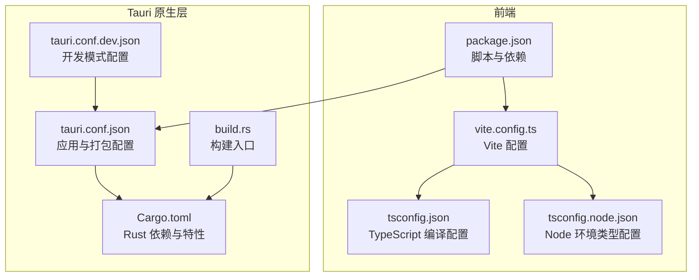
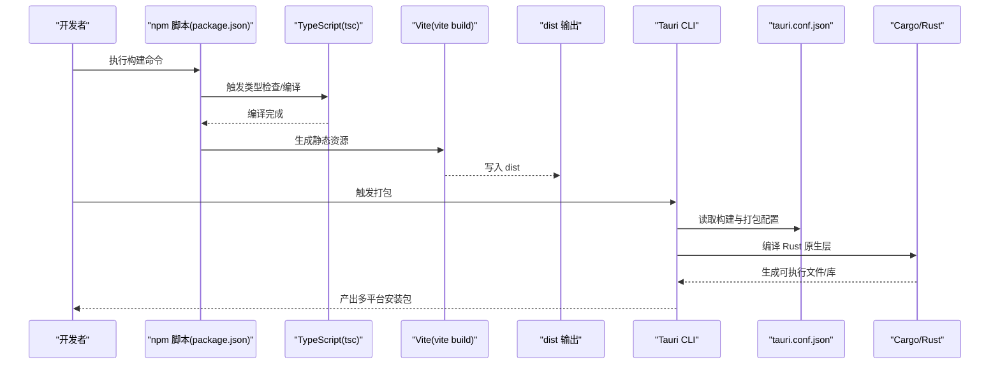
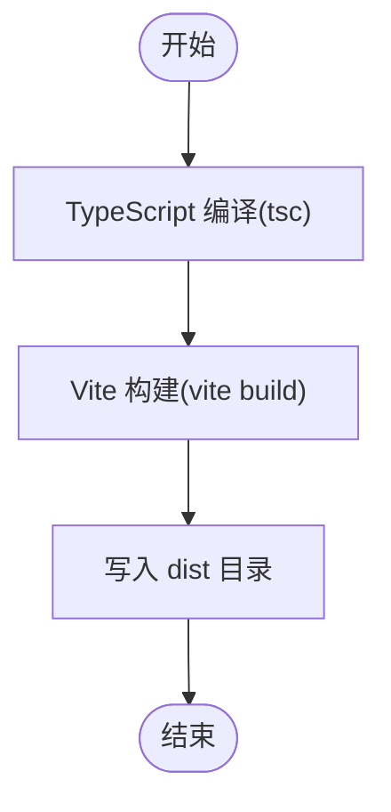
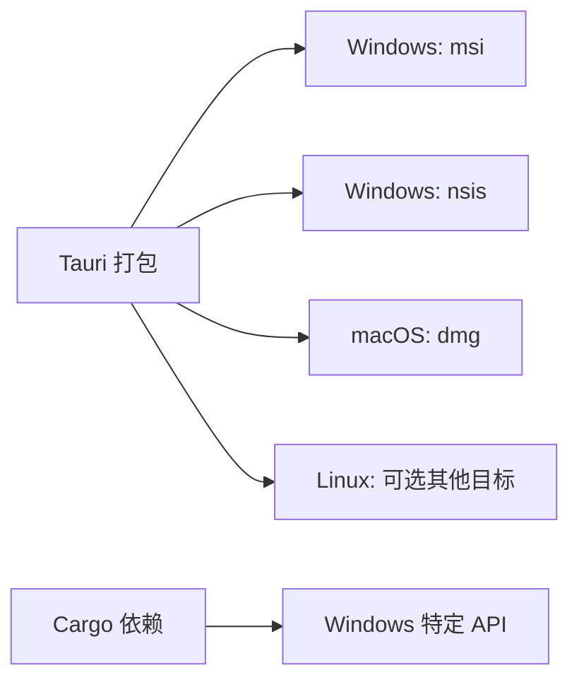
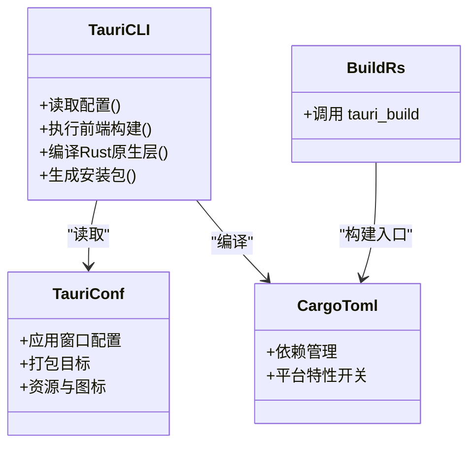
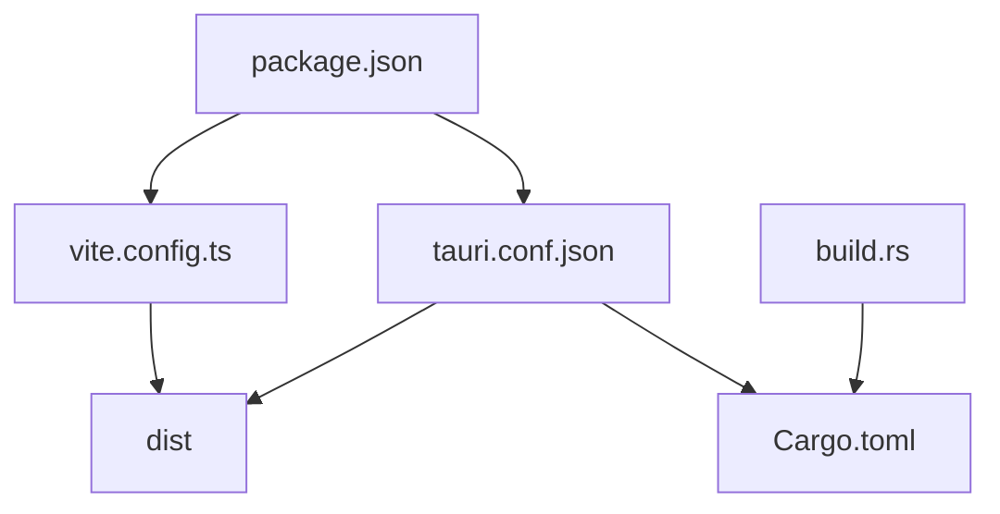

# 构建与打包

<cite>
**本文引用的文件**
- [package.json](file://package.json)
- [vite.config.ts](file://vite.config.ts)
- [tsconfig.json](file://tsconfig.json)
- [tsconfig.node.json](file://tsconfig.node.json)
- [src-tauri/Cargo.toml](file://src-tauri/Cargo.toml)
- [src-tauri/tauri.conf.json](file://src-tauri/tauri.conf.json)
- [src-tauri/build.rs](file://src-tauri/build.rs)
- [src-tauri/tauri.conf.dev.json](file://src-tauri/tauri.conf.dev.json)
- [openspec/config.yaml](file://openspec/config.yaml)
</cite>

## 目录
1. [简介](#简介)
2. [项目结构](#项目结构)
3. [核心组件](#核心组件)
4. [架构总览](#架构总览)
5. [详细组件分析](#详细组件分析)
6. [依赖关系分析](#依赖关系分析)
7. [性能考虑](#性能考虑)
8. [故障排查指南](#故障排查指南)
9. [结论](#结论)
10. [附录](#附录)

## 简介
本指南面向开发者与运维人员，系统性说明本项目的构建与打包流程，涵盖前端开发构建（Vite + TypeScript）、生产构建优化、跨平台打包（Windows/macOS/Linux）、Tauri 应用打包与原生依赖处理、签名配置建议、构建脚本自定义、持续集成与自动化构建、以及构建产物验证与测试方法，并提供常见问题排查思路。

## 项目结构
该项目采用“前端（React + Vite + TypeScript）+ 后端（Rust + Tauri）”的混合架构，前端通过 Vite 进行开发与构建，产物由 Tauri 在构建阶段打包为多平台安装包。

**图表来源**
- [package.json:1-29](file://package.json#L1-L29)
- [vite.config.ts:1-33](file://vite.config.ts#L1-L33)
- [tsconfig.json:1-26](file://tsconfig.json#L1-L26)
- [tsconfig.node.json:1-11](file://tsconfig.node.json#L1-L11)
- [src-tauri/tauri.conf.json:1-74](file://src-tauri/tauri.conf.json#L1-L74)
- [src-tauri/tauri.conf.dev.json:1-8](file://src-tauri/tauri.conf.dev.json#L1-L8)
- [src-tauri/Cargo.toml:1-44](file://src-tauri/Cargo.toml#L1-L44)
- [src-tauri/build.rs:1-4](file://src-tauri/build.rs#L1-L4)

**章节来源**
- [package.json:1-29](file://package.json#L1-L29)
- [vite.config.ts:1-33](file://vite.config.ts#L1-L33)
- [tsconfig.json:1-26](file://tsconfig.json#L1-L26)
- [tsconfig.node.json:1-11](file://tsconfig.node.json#L1-L11)
- [src-tauri/Cargo.toml:1-44](file://src-tauri/Cargo.toml#L1-L44)
- [src-tauri/tauri.conf.json:1-74](file://src-tauri/tauri.conf.json#L1-L74)
- [src-tauri/tauri.conf.dev.json:1-8](file://src-tauri/tauri.conf.dev.json#L1-L8)
- [src-tauri/build.rs:1-4](file://src-tauri/build.rs#L1-L4)

## 核心组件
- 前端构建链路：通过 npm 脚本触发 TypeScript 编译与 Vite 构建，生成静态资源到 dist 目录，供 Tauri 打包使用。
- 开发服务器：Vite 在固定端口启动热更新服务，支持 Tauri 开发模式下的 HMR。
- Tauri 构建链路：Tauri CLI 读取配置，先执行前端构建，再将 dist 产物与 Rust 原生二进制打包为多目标安装包。
- 原生依赖：Rust 侧通过 Cargo 管理依赖，包含窗口、系统信息、网络请求、调度等能力；Windows 平台引入特定 Win32 API 依赖。

**章节来源**
- [package.json:6-11](file://package.json#L6-L11)
- [vite.config.ts:8-32](file://vite.config.ts#L8-L32)
- [src-tauri/tauri.conf.json:6-11](file://src-tauri/tauri.conf.json#L6-L11)
- [src-tauri/Cargo.toml:15-43](file://src-tauri/Cargo.toml#L15-L43)

## 架构总览
下图展示从开发到生产的整体流程，以及各配置文件在其中的作用。

**图表来源**
- [package.json:6-11](file://package.json#L6-L11)
- [vite.config.ts:8-32](file://vite.config.ts#L8-L32)
- [src-tauri/tauri.conf.json:6-11](file://src-tauri/tauri.conf.json#L6-L11)
- [src-tauri/Cargo.toml:1-44](file://src-tauri/Cargo.toml#L1-L44)

## 详细组件分析

### 前端开发构建（Vite + TypeScript）
- TypeScript 编译：通过独立的 tsc 流程进行类型检查与编译，确保类型安全后再进入 Vite 构建。
- Vite 构建：在 Tauri 开发/构建场景中启用固定端口与 HMR，忽略对 src-tauri 的监听以提升稳定性。
- 类型配置：tsconfig.json 使用 bundler 模式解析模块，禁用 emit 并启用严格模式，保证构建一致性与性能。

**图表来源**
- [package.json:8](file://package.json#L8)
- [vite.config.ts:8-32](file://vite.config.ts#L8-L32)
- [tsconfig.json:9-15](file://tsconfig.json#L9-L15)

**章节来源**
- [package.json:6-11](file://package.json#L6-L11)
- [vite.config.ts:8-32](file://vite.config.ts#L8-L32)
- [tsconfig.json:1-26](file://tsconfig.json#L1-L26)
- [tsconfig.node.json:1-11](file://tsconfig.node.json#L1-L11)

### 生产构建配置与优化
- 代码压缩与打包：Vite 默认使用 Rollup 进行生产打包，可结合插件实现更细粒度的优化（如按需注入、Tree Shaking）。当前仓库未显式声明额外优化插件，建议在生产环境评估是否引入压缩与资源内联策略。
- 资源优化：静态资源位于 public 目录，建议在构建后进行体积审计与缓存策略配置（例如为 dist 中的静态资源添加指纹后缀）。
- 性能调优：保持模块解析为 bundler 模式，避免重复打包；合理拆分代码与懒加载路由/组件，减少首屏体积。
- 窗口与透明渲染：应用配置了透明无边框窗口，注意在不同平台上的渲染差异与性能影响。

**章节来源**
- [src-tauri/tauri.conf.json:13-43](file://src-tauri/tauri.conf.json#L13-L43)

### 跨平台打包流程（Windows、macOS、Linux）
- 目标平台：配置中启用了 msi（Windows）、nsis（Windows）、dmg（macOS）等目标，满足主流桌面平台发布需求。
- 平台特定依赖：Windows 平台引入 Win32 API 依赖，用于鼠标钩子与输入模拟；其他平台默认不启用该特性，避免跨平台兼容问题。
- 图标与资源：通过 bundle.icon 指定多尺寸图标，bundle.resources 指定随包携带的配置文件路径。

**图表来源**
- [src-tauri/tauri.conf.json:58-67](file://src-tauri/tauri.conf.json#L58-L67)
- [src-tauri/Cargo.toml:37-43](file://src-tauri/Cargo.toml#L37-L43)

**章节来源**
- [src-tauri/tauri.conf.json:53-67](file://src-tauri/tauri.conf.json#L53-L67)
- [src-tauri/Cargo.toml:37-43](file://src-tauri/Cargo.toml#L37-L43)

### Tauri 应用打包与原生依赖处理
- 构建入口：build.rs 调用 tauri_build::build，驱动 Rust 原生层的构建与能力生成。
- 原生依赖：Rust 侧包含窗口管理、系统信息、文件系统、对话框、剪贴板、网络请求、调度等能力；Windows 平台引入 Win32 API 依赖。
- 能力与权限：通过 capabilities 字段声明窗口管理、拖拽、主能力等，确保运行时具备相应权限。

**图表来源**
- [src-tauri/tauri.conf.json:1-74](file://src-tauri/tauri.conf.json#L1-L74)
- [src-tauri/Cargo.toml:1-44](file://src-tauri/Cargo.toml#L1-L44)
- [src-tauri/build.rs:1-4](file://src-tauri/build.rs#L1-L4)

**章节来源**
- [src-tauri/build.rs:1-4](file://src-tauri/build.rs#L1-L4)
- [src-tauri/Cargo.toml:15-43](file://src-tauri/Cargo.toml#L15-L43)
- [src-tauri/tauri.conf.json:44-51](file://src-tauri/tauri.conf.json#L44-L51)

### 构建脚本自定义与输出目录
- 自定义构建参数：可在 npm scripts 中传入环境变量或调整命令顺序，例如在构建前清理 dist 或执行额外校验。
- 输出目录：前端构建输出至 dist；Tauri 通过 frontendDist 指向该目录；可按需修改以适配 CI/CD 工作流。
- 开发模式：devUrl 固定为本地开发服务器地址，beforeDevCommand 与 beforeBuildCommand 分别在开发与构建前执行。

**章节来源**
- [package.json:6-11](file://package.json#L6-L11)
- [src-tauri/tauri.conf.json:6-11](file://src-tauri/tauri.conf.json#L6-L11)
- [src-tauri/tauri.conf.dev.json:2-7](file://src-tauri/tauri.conf.dev.json#L2-L7)

### 持续集成与自动化构建
- 通用步骤：安装 Node 与 Rust 工具链 → 安装依赖 → 前端构建 → Tauri 打包 → 产物归档。
- OpenSpec 配置：仓库包含 openspec 配置文件，可用于规范文档与任务生成，便于在 CI 中统一上下文与规则。
- 平台矩阵：建议在 CI 中并行构建 Windows（msi/nsis）、macOS（dmg）与 Linux（可选 deb/rpm），并上传制品与生成变更日志。

**章节来源**
- [openspec/config.yaml:1-21](file://openspec/config.yaml#L1-L21)

### 构建产物验证与测试
- 静态检查：在 CI 中加入前端与原生层的类型检查、语法检查与格式化校验。
- 功能回归：在受控环境中启动应用，验证窗口行为、透明渲染、系统交互与资源加载。
- 体积与缓存：记录 dist 体积变化趋势，确保资源指纹与缓存策略生效。
- 安装包验证：在各平台验证安装包完整性、启动速度与首次运行体验。

## 依赖关系分析
- 前端与 Tauri 的耦合点：前端构建产物路径由 tauri.conf.json 的 frontendDist 指定；开发模式通过 devUrl 与 beforeDevCommand 协同。
- 原生层与平台特性：Windows 平台引入 Win32 API 依赖，其他平台保持默认；Rust 依赖通过 Cargo.toml 统一管理。
- 插件与能力：Tauri 插件（fs、dialog、opener、clipboard）在运行时提供系统级能力，需与 capabilities 配置匹配。

**图表来源**
- [package.json:1-29](file://package.json#L1-L29)
- [vite.config.ts:1-33](file://vite.config.ts#L1-L33)
- [src-tauri/tauri.conf.json:1-74](file://src-tauri/tauri.conf.json#L1-L74)
- [src-tauri/build.rs:1-4](file://src-tauri/build.rs#L1-L4)
- [src-tauri/Cargo.toml:1-44](file://src-tauri/Cargo.toml#L1-L44)

**章节来源**
- [package.json:1-29](file://package.json#L1-L29)
- [vite.config.ts:1-33](file://vite.config.ts#L1-L33)
- [src-tauri/tauri.conf.json:1-74](file://src-tauri/tauri.conf.json#L1-L74)
- [src-tauri/build.rs:1-4](file://src-tauri/build.rs#L1-L4)
- [src-tauri/Cargo.toml:1-44](file://src-tauri/Cargo.toml#L1-L44)

## 性能考虑
- 构建性能：保持模块解析为 bundler 模式，避免重复打包；在大型项目中考虑拆分 vendor chunk 与动态导入。
- 运行性能：透明窗口与无边框窗口在不同平台上渲染成本不同，建议在 Windows 上谨慎启用阴影与装饰，减少 GPU 压力。
- 资源体积：对图片与字体进行压缩与 WebP 化；对 JSON 配置进行最小化；利用浏览器缓存与指纹命名。
- 网络与 TLS：网络请求使用 rustls-tls 特性，确保 HTTPS 与证书校验正确配置。

## 故障排查指南
- 端口占用与 HMR 失败：确认开发端口 1420 与 HMR 端口 1421 未被占用；若通过 TAURI_DEV_HOST 指定主机，确保网络连通。
- 前端构建失败：先执行 tsc 独立检查类型错误，再执行 vite build；检查 tsconfig 与插件版本兼容性。
- Tauri 打包失败：确认 dist 目录存在且内容完整；检查 tauri.conf.json 的 frontendDist 与 devUrl 是否正确；在 Windows 平台确保已安装 MSVC 工具链。
- 平台差异：Windows 特有 API 仅在 Windows 平台生效，其他平台需降级或条件编译；避免在非 Windows 平台加载 Win32 依赖。
- 资源缺失：检查 bundle.resources 与 icons 路径是否正确；确保资源文件存在于打包上下文中。

**章节来源**
- [vite.config.ts:16-30](file://vite.config.ts#L16-L30)
- [package.json:8](file://package.json#L8)
- [src-tauri/tauri.conf.json:6-11](file://src-tauri/tauri.conf.json#L6-L11)
- [src-tauri/Cargo.toml:37-43](file://src-tauri/Cargo.toml#L37-L43)

## 结论
本项目采用“前端 Vite + TypeScript + Tauri + Rust”的成熟组合，具备清晰的开发与打包边界。通过合理配置前端构建、Tauri 打包目标与原生依赖，可在多平台稳定产出安装包。建议在生产构建中引入资源优化与体积审计，在 CI 中完善自动化与验证流程，并针对平台差异制定差异化配置与测试策略。

## 附录
- 常用命令参考
  - 开发：npm run dev
  - 预览：npm run preview
  - 构建：npm run build
  - Tauri：npm run tauri
- 关键配置定位
  - 前端构建：vite.config.ts、tsconfig.json、tsconfig.node.json
  - Tauri 打包：tauri.conf.json、tauri.conf.dev.json、Cargo.toml、build.rs
  - CI 规范：openspec/config.yaml