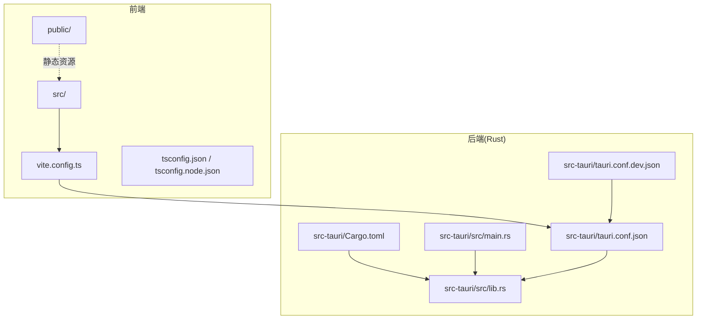
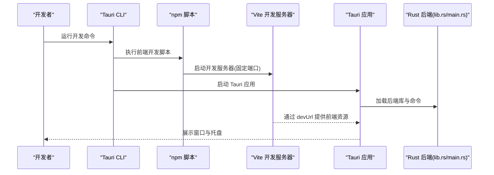
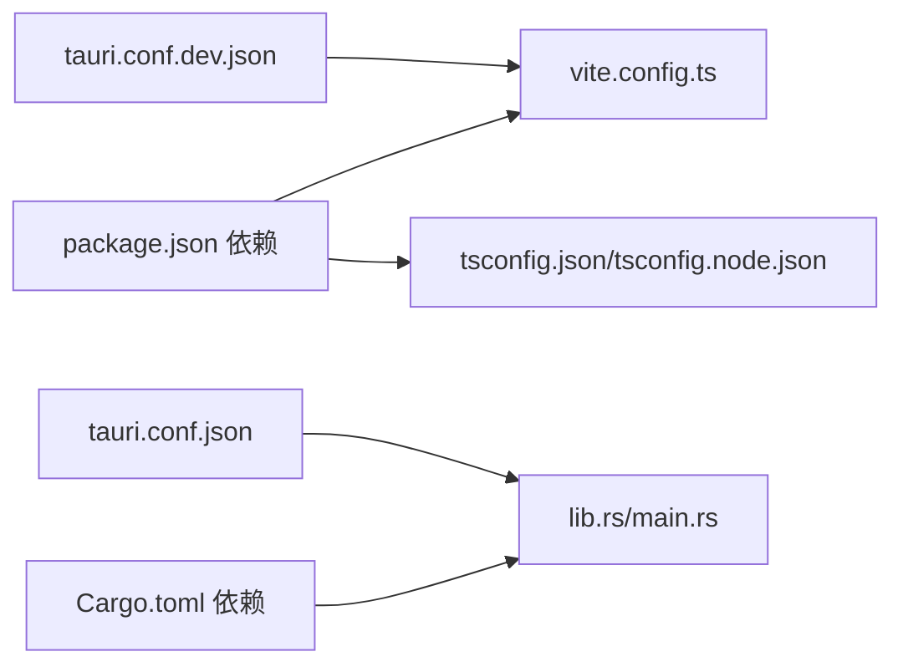

# 环境搭建

<cite>
**本文引用的文件**
- [package.json](file://package.json)
- [README.md](file://README.md)
- [tsconfig.json](file://tsconfig.json)
- [tsconfig.node.json](file://tsconfig.node.json)
- [vite.config.ts](file://vite.config.ts)
- [src-tauri/Cargo.toml](file://src-tauri/Cargo.toml)
- [src-tauri/tauri.conf.json](file://src-tauri/tauri.conf.json)
- [src-tauri/tauri.conf.dev.json](file://src-tauri/tauri.conf.dev.json)
- [src/App.tsx](file://src/App.tsx)
- [src-tauri/src/main.rs](file://src-tauri/src/main.rs)
- [src-tauri/src/lib.rs](file://src-tauri/src/lib.rs)
</cite>

## 目录
1. [简介](#简介)
2. [项目结构](#项目结构)
3. [核心组件](#核心组件)
4. [架构总览](#架构总览)
5. [详细组件分析](#详细组件分析)
6. [依赖分析](#依赖分析)
7. [性能考虑](#性能考虑)
8. [故障排查指南](#故障排查指南)
9. [结论](#结论)
10. [附录](#附录)

## 简介
本指南面向首次搭建 XSUN Desktop Pet（桌宠）开发环境的开发者，覆盖 Node.js 与 npm、Rust 工具链、Tauri CLI 的安装与配置，以及 IDE 推荐与系统依赖。文档严格依据仓库中的配置文件与说明，确保安装步骤与版本要求准确可复现。

## 项目结构
该项目为 Tauri 2 + React + TypeScript 的桌面应用，前端位于 src 与 public，后端 Rust 代码位于 src-tauri，构建与打包由 Vite + Tauri CLI 协同完成。

图表来源
- [vite.config.ts:1-33](file://vite.config.ts#L1-L33)
- [tsconfig.json:1-26](file://tsconfig.json#L1-L26)
- [tsconfig.node.json:1-11](file://tsconfig.node.json#L1-L11)
- [src-tauri/Cargo.toml:1-44](file://src-tauri/Cargo.toml#L1-L44)
- [src-tauri/src/lib.rs:1-200](file://src-tauri/src/lib.rs#L1-L200)
- [src-tauri/src/main.rs:1-11](file://src-tauri/src/main.rs#L1-L11)
- [src-tauri/tauri.conf.json:1-74](file://src-tauri/tauri.conf.json#L1-L74)
- [src-tauri/tauri.conf.dev.json:1-8](file://src-tauri/tauri.conf.dev.json#L1-L8)

章节来源
- [package.json:1-29](file://package.json#L1-L29)
- [README.md:22-28](file://README.md#L22-L28)
- [vite.config.ts:1-33](file://vite.config.ts#L1-L33)
- [tsconfig.json:1-26](file://tsconfig.json#L1-L26)
- [tsconfig.node.json:1-11](file://tsconfig.node.json#L1-L11)
- [src-tauri/Cargo.toml:1-44](file://src-tauri/Cargo.toml#L1-L44)
- [src-tauri/tauri.conf.json:1-74](file://src-tauri/tauri.conf.json#L1-L74)
- [src-tauri/tauri.conf.dev.json:1-8](file://src-tauri/tauri.conf.dev.json#L1-L8)

## 核心组件
- 前端运行与构建
  - 开发脚本与构建脚本由 package.json 定义，开发模式通过 Tauri CLI 触发 Vite，生产构建由 Tauri CLI 调用 Vite 与 Rust 编译器完成。
- TypeScript 与 Vite 配置
  - tsconfig.json 与 tsconfig.node.json 提供严格的类型检查与模块解析策略；vite.config.ts 固定开发端口并禁用清屏，便于 Rust 错误可见。
- Tauri 配置
  - tauri.conf.json 定义产品名、窗口属性、安全能力与打包目标；tauri.conf.dev.json 为开发模式下的构建前置命令与前端分发目录。

章节来源
- [package.json:6-11](file://package.json#L6-L11)
- [tsconfig.json:1-26](file://tsconfig.json#L1-L26)
- [tsconfig.node.json:1-11](file://tsconfig.node.json#L1-L11)
- [vite.config.ts:1-33](file://vite.config.ts#L1-L33)
- [src-tauri/tauri.conf.json:1-74](file://src-tauri/tauri.conf.json#L1-L74)
- [src-tauri/tauri.conf.dev.json:1-8](file://src-tauri/tauri.conf.dev.json#L1-L8)

## 架构总览
下图展示从开发到生产的典型流程，以及前后端交互的关键点。

图表来源
- [src-tauri/tauri.conf.json:6-11](file://src-tauri/tauri.conf.json#L6-L11)
- [src-tauri/tauri.conf.dev.json:2-7](file://src-tauri/tauri.conf.dev.json#L2-L7)
- [vite.config.ts:16-31](file://vite.config.ts#L16-L31)
- [src-tauri/src/lib.rs:1-200](file://src-tauri/src/lib.rs#L1-L200)
- [src-tauri/src/main.rs:8-11](file://src-tauri/src/main.rs#L8-L11)

## 详细组件分析

### Node.js 与 npm 安装与版本要求
- 版本要求
  - 项目声明的 Node 与 npm 版本见 README 的“版本信息”区域。
- 兼容性检查
  - 使用包管理器安装后，可通过命令行查询版本，确保与项目要求一致。
- 安装步骤（通用）
  - 下载并安装 Node.js（包含 npm），或使用版本管理器安装指定版本。
  - 安装完成后，执行版本查询确认安装成功。
- 项目内脚本
  - package.json 中定义了开发、构建与预览脚本，开发模式通过 Tauri CLI 触发。

章节来源
- [README.md:22-28](file://README.md#L22-L28)
- [package.json:6-11](file://package.json#L6-L11)

### Rust 工具链安装（含 rustup、编译工具链与目标平台）
- 版本要求
  - 项目声明的 Rust 与 Cargo 版本见 README 的“版本信息”区域。
- rustup 安装
  - 使用官方安装程序安装 rustup，随后安装稳定工具链与所需目标平台。
- 编译工具链
  - 安装系统依赖后，即可使用 cargo 进行编译与打包。
- 目标平台支持
  - 项目 Cargo.toml 中包含 Windows 平台特定依赖，表明需要 Windows 相关能力支持。

章节来源
- [README.md:22-28](file://README.md#L22-L28)
- [src-tauri/Cargo.toml:37-43](file://src-tauri/Cargo.toml#L37-L43)

### Tauri CLI 安装与配置
- 安装
  - 通过包管理器安装 Tauri CLI，或使用 Cargo 安装。
- 开发模式 vs 生产模式
  - 开发模式：通过 Tauri CLI 启动，读取 tauri.conf.dev.json 的构建前置命令与前端分发目录，Vite 在固定端口提供前端资源。
  - 生产模式：通过 Tauri CLI 执行构建，调用 Rust 编译器与 Vite 构建产物，生成多平台安装包。
- 关键配置
  - tauri.conf.json 定义窗口、安全能力与打包目标；tauri.conf.dev.json 指定开发时的 devUrl、前置命令与前端分发目录。

章节来源
- [README.md:249-259](file://README.md#L249-L259)
- [src-tauri/tauri.conf.json:1-74](file://src-tauri/tauri.conf.json#L1-L74)
- [src-tauri/tauri.conf.dev.json:1-8](file://src-tauri/tauri.conf.dev.json#L1-L8)

### IDE 配置建议（VS Code）
- 插件推荐
  - TypeScript/JavaScript 开发必备插件（如 Prettier、ESLint 等）。
  - Rust 扩展（如 Rust Analyzer）以获得更好的类型提示与诊断。
- TypeScript 配置
  - 使用项目提供的 tsconfig.json 与 tsconfig.node.json，确保模块解析与严格模式生效。
- VS Code 工作区设置
  - 可在工作区设置中固定 Node 与 Rust 工具链路径，避免多版本冲突。

章节来源
- [tsconfig.json:1-26](file://tsconfig.json#L1-L26)
- [tsconfig.node.json:1-11](file://tsconfig.node.json#L1-L11)

### 系统依赖安装（Windows、macOS、Linux）
- Windows
  - 安装 Visual Studio Build Tools 或 Visual Studio（带 C++ 工作负载），或安装单独的 MSVC 工具链。
  - 安装 Windows SDK 与 Windows 10/11 相关头文件与库。
- macOS
  - 安装 Xcode Command Line Tools。
  - 安装 Rust 工具链与目标平台支持。
- Linux
  - 安装编译工具链与系统库（如 GTK、Wayland/X11 相关开发包）。
  - 安装 Rust 工具链与目标平台支持。

章节来源
- [src-tauri/Cargo.toml:37-43](file://src-tauri/Cargo.toml#L37-L43)

### 环境变量与 PATH 设置
- 环境变量
  - 可通过 TAURI_DEV_HOST 控制开发主机（vite.config.ts 中读取）。
- PATH 设置
  - 将 Node、npm、Rust（cargo）、Tauri CLI 与系统 SDK 的 bin 目录加入 PATH，确保命令行可用。

章节来源
- [vite.config.ts:5-6](file://vite.config.ts#L5-L6)

### 环境验证步骤
- Node.js 与 npm
  - 查询版本并确认与 README 的版本信息一致。
- Rust 工具链
  - 查询 rustc 与 cargo 版本，确认与 README 的版本信息一致。
- Tauri CLI
  - 运行 tauri info，检查 CLI、Rust、Node、npm、Vite 等版本与配置。
- 开发运行
  - 在项目根目录执行开发命令，确认 Vite 在固定端口启动，Tauri 应用加载前端资源并显示窗口。
- 构建验证
  - 执行生产构建命令，确认生成多平台安装包且无错误。

章节来源
- [README.md:22-28](file://README.md#L22-L28)
- [README.md:249-259](file://README.md#L249-L259)
- [src-tauri/tauri.conf.json:6-11](file://src-tauri/tauri.conf.json#L6-L11)
- [src-tauri/tauri.conf.dev.json:2-7](file://src-tauri/tauri.conf.dev.json#L2-L7)

## 依赖分析
- 前端依赖
  - React、TypeScript、Vite、React 插件等，由 package.json 管理。
- 后端依赖
  - Tauri 2、系统信息采集、HTTP 客户端、序列化库等，由 Cargo.toml 管理。
- 构建与打包
  - Tauri 配置文件定义窗口、安全能力与打包目标，Vite 提供开发与构建支持。

图表来源
- [package.json:12-27](file://package.json#L12-L27)
- [src-tauri/Cargo.toml:15-35](file://src-tauri/Cargo.toml#L15-L35)
- [vite.config.ts:1-33](file://vite.config.ts#L1-L33)
- [src-tauri/tauri.conf.json:1-74](file://src-tauri/tauri.conf.json#L1-L74)
- [src-tauri/tauri.conf.dev.json:1-8](file://src-tauri/tauri.conf.dev.json#L1-L8)

章节来源
- [package.json:12-27](file://package.json#L12-L27)
- [src-tauri/Cargo.toml:15-35](file://src-tauri/Cargo.toml#L15-L35)
- [vite.config.ts:1-33](file://vite.config.ts#L1-L33)
- [src-tauri/tauri.conf.json:1-74](file://src-tauri/tauri.conf.json#L1-L74)
- [src-tauri/tauri.conf.dev.json:1-8](file://src-tauri/tauri.conf.dev.json#L1-L8)

## 性能考虑
- 开发阶段
  - 固定端口与严格端口模式可减少端口占用冲突；禁用清屏避免 Rust 错误被隐藏。
- 构建阶段
  - 合理配置打包目标与资源，避免不必要的资源被打包进安装包。
- 运行阶段
  - 后端命令与窗口管理应避免频繁创建销毁，降低系统开销。

章节来源
- [vite.config.ts:14-16](file://vite.config.ts#L14-L16)
- [src-tauri/tauri.conf.json:53-68](file://src-tauri/tauri.conf.json#L53-L68)

## 故障排查指南
- 端口占用
  - 开发端口固定为 1420，若被占用会导致开发无法启动。请释放端口或修改配置。
- Node 版本不匹配
  - 确保 Node 与 npm 版本满足 README 的版本要求。
- Rust 工具链缺失
  - 确认已安装稳定工具链与必要目标平台，Windows 平台需安装 MSVC 工具链。
- Tauri CLI 不兼容
  - 使用与项目版本匹配的 Tauri CLI，并确保插件版本与 CLI 版本兼容。
- 前端资源加载失败
  - 检查 tauri.conf.json 中的 devUrl 与前端分发目录配置，确保 Vite 正常提供资源。

章节来源
- [vite.config.ts:16-31](file://vite.config.ts#L16-L31)
- [src-tauri/tauri.conf.json:6-11](file://src-tauri/tauri.conf.json#L6-L11)
- [README.md:22-28](file://README.md#L22-L28)

## 结论
按照本指南完成 Node.js、npm、Rust 工具链与 Tauri CLI 的安装与配置，并遵循系统依赖与环境变量设置，即可顺利运行与构建 XSUN Desktop Pet。开发与生产模式的差异已在配置文件中明确体现，按步骤执行即可完成环境验证。

## 附录
- 快速参考
  - 开发运行：使用 Tauri CLI 启动开发模式，确保 Vite 在 1420 端口提供资源。
  - 生产构建：使用 Tauri CLI 执行构建，生成多平台安装包。
  - 版本核对：对照 README 的版本信息核对 Node、npm、Rust、Cargo、Tauri。

章节来源
- [README.md:249-259](file://README.md#L249-L259)
- [README.md:22-28](file://README.md#L22-L28)
- [src-tauri/tauri.conf.json:6-11](file://src-tauri/tauri.conf.json#L6-L11)
- [src-tauri/tauri.conf.dev.json:2-7](file://src-tauri/tauri.conf.dev.json#L2-L7)