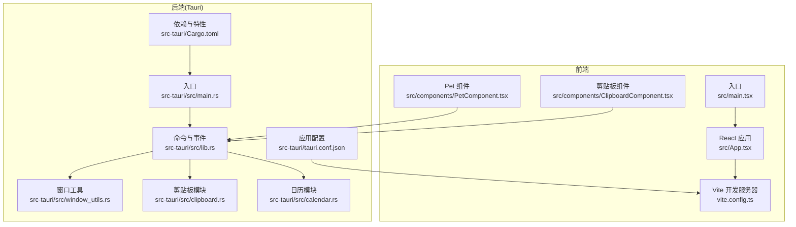
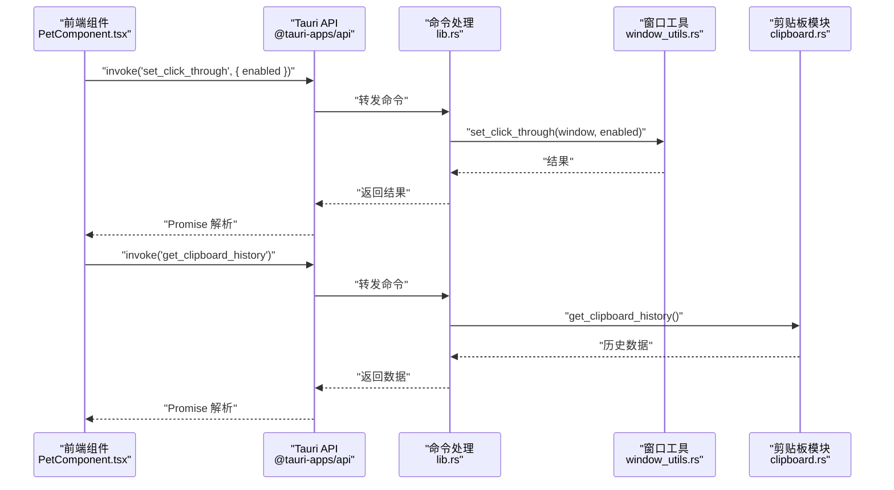
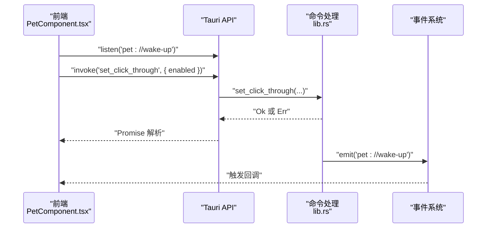
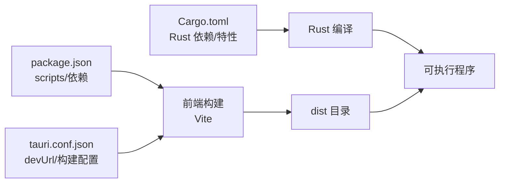

# 调试与测试

<cite>
**本文引用的文件**   
- [package.json](file://package.json)
- [vite.config.ts](file://vite.config.ts)
- [src-tauri/Cargo.toml](file://src-tauri/Cargo.toml)
- [src-tauri/tauri.conf.json](file://src-tauri/tauri.conf.json)
- [src/App.tsx](file://src/App.tsx)
- [src/main.tsx](file://src/main.tsx)
- [src-tauri/src/lib.rs](file://src-tauri/src/lib.rs)
- [src-tauri/src/main.rs](file://src-tauri/src/main.rs)
- [src-tauri/src/window_utils.rs](file://src-tauri/src/window_utils.rs)
- [src-tauri/src/clipboard.rs](file://src-tauri/src/clipboard.rs)
- [src-tauri/src/calendar.rs](file://src-tauri/src/calendar.rs)
- [src/components/PetComponent.tsx](file://src/components/PetComponent.tsx)
- [src/components/ClipboardComponent.tsx](file://src/components/ClipboardComponent.tsx)
</cite>

## 目录
1. [简介](#简介)
2. [项目结构](#项目结构)
3. [核心组件](#核心组件)
4. [架构总览](#架构总览)
5. [详细组件分析](#详细组件分析)
6. [依赖关系分析](#依赖关系分析)
7. [性能考量](#性能考量)
8. [故障排查指南](#故障排查指南)
9. [结论](#结论)
10. [附录](#附录)

## 简介
本指南面向前端、后端与跨端（Tauri）开发场景，提供从调试工具到测试策略的完整实践建议。内容涵盖：
- 前端调试：React DevTools、浏览器开发者工具、Vite 调试与热重载
- 后端调试：Rust 调试器、日志输出、断点设置
- 跨端调试：Tauri 命令调试、IPC 事件与窗口生命周期
- 测试指南：单元测试、集成测试、端到端测试
- 性能分析：内存与 CPU 监控
- 常见问题诊断与解决

## 项目结构
该项目采用前后端分离与 Tauri 集成的桌面应用架构：
- 前端基于 React + TypeScript，使用 Vite 构建与开发
- 后端 Rust 通过 Tauri 暴露命令与事件，管理窗口、系统信息、剪贴板、日历等功能
- 配置文件分别位于前端与 Tauri 目录，便于开发与打包流程控制

图表来源
- [src/App.tsx:1-60](file://src/App.tsx#L1-L60)
- [src/main.tsx:1-10](file://src/main.tsx#L1-L10)
- [vite.config.ts:1-33](file://vite.config.ts#L1-L33)
- [src-tauri/src/lib.rs:1-120](file://src-tauri/src/lib.rs#L1-L120)
- [src-tauri/src/main.rs:1-11](file://src-tauri/src/main.rs#L1-L11)
- [src-tauri/src/window_utils.rs:1-33](file://src-tauri/src/window_utils.rs#L1-L33)
- [src-tauri/src/clipboard.rs:1-120](file://src-tauri/src/clipboard.rs#L1-L120)
- [src-tauri/src/calendar.rs:1-120](file://src-tauri/src/calendar.rs#L1-L120)
- [src-tauri/Cargo.toml:1-44](file://src-tauri/Cargo.toml#L1-L44)
- [src-tauri/tauri.conf.json:1-74](file://src-tauri/tauri.conf.json#L1-L74)

章节来源
- [package.json:1-29](file://package.json#L1-L29)
- [vite.config.ts:1-33](file://vite.config.ts#L1-L33)
- [src-tauri/tauri.conf.json:1-74](file://src-tauri/tauri.conf.json#L1-L74)

## 核心组件
- 前端应用入口与路由：React 应用通过窗口 label 切换不同功能视图
- Tauri 命令与事件：Rust 层暴露命令（如系统信息、窗口控制、剪贴板、AI/翻译、日历等），并通过事件与前端通信
- 窗口与 IPC：前端通过 invoke 调用后端命令，通过 listen 监听后端事件；窗口创建与初始化脚本用于传递数据
- 模块化后端：窗口工具、剪贴板、日历等按功能拆分，便于维护与测试

章节来源
- [src/App.tsx:18-58](file://src/App.tsx#L18-L58)
- [src-tauri/src/lib.rs:41-120](file://src-tauri/src/lib.rs#L41-L120)
- [src-tauri/src/window_utils.rs:9-32](file://src-tauri/src/window_utils.rs#L9-L32)
- [src-tauri/src/clipboard.rs:124-224](file://src-tauri/src/clipboard.rs#L124-L224)
- [src-tauri/src/calendar.rs:87-141](file://src-tauri/src/calendar.rs#L87-L141)

## 架构总览
下图展示前端与后端交互的关键路径：前端发起命令调用，后端执行业务逻辑并通过事件或窗口初始化脚本回传数据。

图表来源
- [src/components/PetComponent.tsx:36-47](file://src/components/PetComponent.tsx#L36-L47)
- [src-tauri/src/lib.rs:41-50](file://src-tauri/src/lib.rs#L41-L50)
- [src-tauri/src/window_utils.rs:9-32](file://src-tauri/src/window_utils.rs#L9-L32)
- [src-tauri/src/clipboard.rs:124-134](file://src-tauri/src/clipboard.rs#L124-L134)

## 详细组件分析

### 前端调试：React DevTools、浏览器开发者工具与 Vite 调试
- React DevTools
  - 安装并启用 React DevTools 浏览器扩展，定位组件树、Props 与 State
  - 关注 PetComponent 的状态切换（休眠/活跃）、气泡菜单、窗口创建流程
- 浏览器开发者工具
  - 使用 Elements/Console/Network 面板：
    - Console：观察 invoke 调用与事件监听的日志输出
    - Network：查看前端与后端命令交互（Tauri IPC）
    - Performance：检测拖拽、动画与窗口创建的性能瓶颈
- Vite 调试
  - 开发模式下，Vite 以固定端口启动并禁用清屏，便于 Rust 错误可见
  - HMR 配置支持远程主机，便于跨设备联调
  - 忽略 src-tauri 目录，避免不必要的文件监听

章节来源
- [vite.config.ts:8-32](file://vite.config.ts#L8-L32)
- [src-tauri/tauri.conf.json:7-11](file://src-tauri/tauri.conf.json#L7-L11)
- [src/components/PetComponent.tsx:19-202](file://src/components/PetComponent.tsx#L19-L202)

### 后端调试：Rust 调试器、日志与断点
- 调试器与断点
  - 使用 IDE（如 VS Code）配置 Rust 调试任务，设置断点于命令处理函数与窗口工具
  - 关注命令参数校验、错误返回与事件发射
- 日志输出
  - 后端广泛使用打印语句输出状态与异常，便于快速定位问题
  - 建议在开发阶段保留打印，在生产构建中可通过特性开关或日志级别控制
- 关键调试点
  - 窗口点击穿透：window_utils.rs 中的平台差异实现
  - 剪贴板历史：clipboard.rs 中的去重、容量限制与锁保护
  - 日历数据：calendar.rs 中的文件读写与序列化

章节来源
- [src-tauri/src/main.rs:8-10](file://src-tauri/src/main.rs#L8-L10)
- [src-tauri/src/lib.rs:41-120](file://src-tauri/src/lib.rs#L41-L120)
- [src-tauri/src/window_utils.rs:9-32](file://src-tauri/src/window_utils.rs#L9-L32)
- [src-tauri/src/clipboard.rs:29-121](file://src-tauri/src/clipboard.rs#L29-L121)
- [src-tauri/src/calendar.rs:98-141](file://src-tauri/src/calendar.rs#L98-L141)

### 跨端调试：Tauri 命令与 IPC
- 命令调试
  - 前端通过 invoke 调用后端命令，后端通过 #[tauri::command] 注解暴露
  - 建议在命令处理函数中增加输入参数校验与错误包装，便于前端捕获
- IPC 事件
  - 前端使用 listen 监听后端事件（如“pet://wake-up”、“selection://popup”）
  - 后端通过 emit 发送事件，注意事件命名规范与作用域
- 窗口生命周期
  - 前端通过 WebviewWindow 创建子窗口，使用 initialization_script 注入初始数据
  - 注意窗口创建超时与错误事件监听，及时处理失败场景

图表来源
- [src/components/PetComponent.tsx:156-202](file://src/components/PetComponent.tsx#L156-L202)
- [src-tauri/src/lib.rs:52-59](file://src-tauri/src/lib.rs#L52-L59)

章节来源
- [src/components/PetComponent.tsx:156-202](file://src/components/PetComponent.tsx#L156-L202)
- [src-tauri/src/lib.rs:52-59](file://src-tauri/src/lib.rs#L52-L59)

### 单元测试与集成测试指南
- 测试框架选择
  - 前端：推荐使用 Vitest 与 React Testing Library，结合 @testing-library/jest-dom
  - 后端：使用 Rust 标准测试（#[test]）与 mock（如 mockall）模拟外部依赖
- 测试用例设计
  - 前端：组件渲染、事件监听、命令调用（mock invoke）、窗口创建与销毁
  - 后端：命令参数校验、错误分支、并发安全（锁）、文件读写与序列化
- 示例关注点
  - PetComponent：状态切换、拖拽、双击唤醒、菜单面板打开
  - ClipboardComponent：历史加载、复制、展开、清空
  - 剪贴板模块：去重、容量限制、批量添加测试命令
  - 日历模块：日期范围、事件与待办的读写、背景图上传与删除

章节来源
- [src/components/PetComponent.tsx:19-202](file://src/components/PetComponent.tsx#L19-L202)
- [src/components/ClipboardComponent.tsx:12-100](file://src/components/ClipboardComponent.tsx#L12-L100)
- [src-tauri/src/clipboard.rs:227-250](file://src-tauri/src/clipboard.rs#L227-L250)
- [src-tauri/src/calendar.rs:115-141](file://src-tauri/src/calendar.rs#L115-L141)

### 端到端测试实施
- 用户界面测试
  - 使用 Playwright 或 Cypress，录制并回放用户操作（打开菜单、拖拽、复制、窗口切换）
- 功能测试
  - 覆盖关键流程：剪贴板历史获取与复制、AI/翻译窗口打开、日历数据读写、托盘菜单交互
- 跨端验证
  - 在 Windows 平台验证点击穿透、窗口层级与任务栏行为
  - 验证 IPC 事件在不同窗口间的传递与一致性

[本节为通用指导，无需列出具体文件来源]

### 性能分析工具使用
- 内存分析
  - 浏览器 Performance 面板：捕获组件渲染、事件回调与窗口创建的内存增长
  - Rust：使用 flamegraph 或 perf 采集火焰图，定位热点函数
- CPU 监控
  - 前端：Profile 页面滚动、动画帧率与主线程阻塞
  - 后端：命令执行耗时、文件 I/O 与网络请求耗时
- 建议
  - 对高频命令（如剪贴板轮询）进行节流或去抖
  - 对大对象序列化/反序列化进行缓存或分页处理

[本节为通用指导，无需列出具体文件来源]

## 依赖关系分析
- 前端依赖
  - React、React DOM、@tauri-apps/api、开发期插件与类型
- 后端依赖
  - Tauri 核心、插件（fs、dialog、opener、clipboard-manager）、系统信息、HTTP 客户端、调度与时间工具
- 构建与运行
  - Vite 固定端口与 HMR 配置，Tauri 开发/构建前置命令与前端产物目录

图表来源
- [package.json:6-11](file://package.json#L6-L11)
- [vite.config.ts:16-31](file://vite.config.ts#L16-L31)
- [src-tauri/tauri.conf.json:6-11](file://src-tauri/tauri.conf.json#L6-L11)
- [src-tauri/Cargo.toml:15-35](file://src-tauri/Cargo.toml#L15-L35)

章节来源
- [package.json:12-27](file://package.json#L12-L27)
- [src-tauri/Cargo.toml:15-44](file://src-tauri/Cargo.toml#L15-L44)

## 性能考量
- 前端
  - 减少不必要的重渲染：使用 React.memo、useMemo、useCallback
  - 控制窗口数量与层级，避免过度透明与装饰带来的绘制开销
- 后端
  - 文件读写与 JSON 序列化尽量异步化，避免阻塞事件循环
  - 对外部 API 请求设置超时与重试策略

[本节为通用指导，无需列出具体文件来源]

## 故障排查指南
- 常见问题与定位
  - 命令调用失败：检查 invoke 参数、后端命令实现与错误返回
  - 窗口创建超时：确认 HMR/开发服务器可用性与端口占用
  - 剪贴板异常：检查内容长度限制、重复项过滤与锁竞争
  - 日历数据丢失：核对数据目录权限与文件读写错误
- 建议步骤
  - 启用详细日志，逐步缩小范围
  - 使用最小复现用例，隔离前端/后端问题
  - 对比不同平台（Windows）差异行为

章节来源
- [src-tauri/src/clipboard.rs:84-121](file://src-tauri/src/clipboard.rs#L84-L121)
- [src-tauri/src/calendar.rs:98-141](file://src-tauri/src/calendar.rs#L98-L141)
- [src-tauri/src/lib.rs:255-294](file://src-tauri/src/lib.rs#L255-L294)

## 结论
通过合理利用前端调试工具、Rust 调试器与 Tauri IPC，结合完善的单元与端到端测试策略，可以高效地定位与解决问题，并持续优化性能与稳定性。建议在开发流程中固化调试与测试步骤，确保跨端体验一致可靠。

[本节为总结性内容，无需列出具体文件来源]

## 附录
- 快速启动
  - 前端开发：npm run dev
  - 后端开发：cargo run（或使用 IDE 调试）
  - Tauri 开发：npm run tauri dev
- 关键配置参考
  - Vite 固定端口与 HMR：vite.config.ts
  - Tauri 开发 URL 与构建前置命令：tauri.conf.json
  - Rust 依赖与特性：Cargo.toml

章节来源
- [package.json:6-11](file://package.json#L6-L11)
- [vite.config.ts:16-31](file://vite.config.ts#L16-L31)
- [src-tauri/tauri.conf.json:6-11](file://src-tauri/tauri.conf.json#L6-L11)
- [src-tauri/Cargo.toml:15-44](file://src-tauri/Cargo.toml#L15-L44)