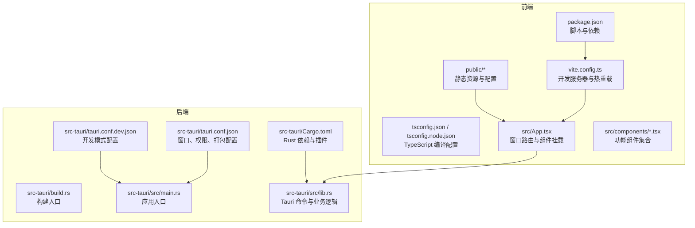
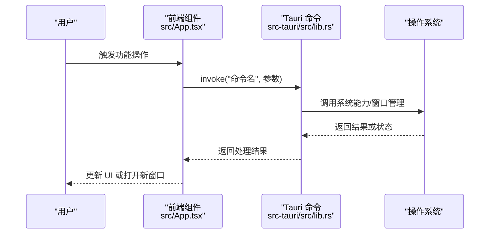
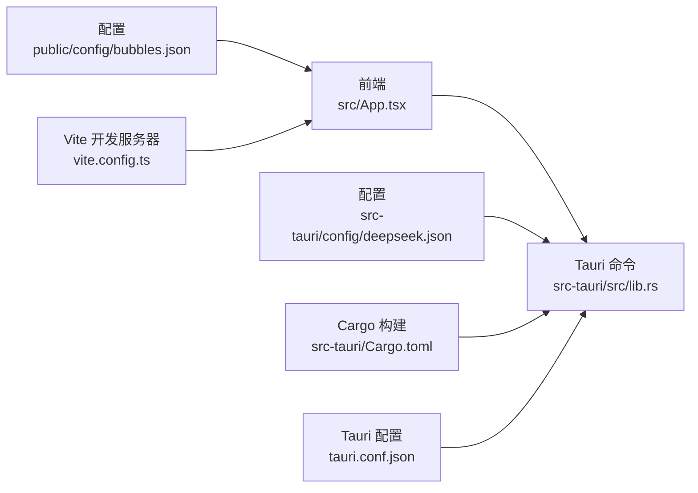

# 快速开始

<cite>
**本文引用的文件**
- [README.md](file://README.md)
- [package.json](file://package.json)
- [vite.config.ts](file://vite.config.ts)
- [tsconfig.json](file://tsconfig.json)
- [tsconfig.node.json](file://tsconfig.node.json)
- [src-tauri/Cargo.toml](file://src-tauri/Cargo.toml)
- [src-tauri/tauri.conf.json](file://src-tauri/tauri.conf.json)
- [src-tauri/tauri.conf.dev.json](file://src-tauri/tauri.conf.dev.json)
- [src-tauri/build.rs](file://src-tauri/build.rs)
- [src-tauri/src/main.rs](file://src-tauri/src/main.rs)
- [src-tauri/src/lib.rs](file://src-tauri/src/lib.rs)
- [src/App.tsx](file://src/App.tsx)
- [public/config/bubbles.json](file://public/config/bubbles.json)
- [src-tauri/config/deepseek.json](file://src-tauri/config/deepseek.json)
</cite>

## 目录
1. [简介](#简介)
2. [项目结构](#项目结构)
3. [核心组件](#核心组件)
4. [架构总览](#架构总览)
5. [详细组件分析](#详细组件分析)
6. [依赖关系分析](#依赖关系分析)
7. [性能考虑](#性能考虑)
8. [故障排除指南](#故障排除指南)
9. [结论](#结论)
10. [附录](#附录)

## 简介
本指南面向首次接触 XSUN 桌面宠物项目的开发者与用户，提供从环境准备、安装部署、开发调试到生产构建的完整流程说明，并给出常见问题排查建议与首次运行后的基本使用方法。

## 项目结构
该项目采用“前端 React + TypeScript + Vite”与“后端 Rust + Tauri 2”的分层架构，前端位于 src 目录，后端位于 src-tauri 目录；静态资源位于 public 目录；配置文件集中在根目录与 src-tauri/config 目录。

图表来源
- [package.json:1-29](file://package.json#L1-L29)
- [vite.config.ts:1-33](file://vite.config.ts#L1-L33)
- [tsconfig.json:1-26](file://tsconfig.json#L1-L26)
- [tsconfig.node.json:1-11](file://tsconfig.node.json#L1-L11)
- [src-tauri/Cargo.toml:1-43](file://src-tauri/Cargo.toml#L1-L43)
- [src-tauri/tauri.conf.json:1-74](file://src-tauri/tauri.conf.json#L1-L74)
- [src-tauri/tauri.conf.dev.json:1-8](file://src-tauri/tauri.conf.dev.json#L1-L8)
- [src-tauri/build.rs:1-4](file://src-tauri/build.rs#L1-L4)
- [src-tauri/src/main.rs:1-11](file://src-tauri/src/main.rs#L1-L11)
- [src-tauri/src/lib.rs:1-200](file://src-tauri/src/lib.rs#L1-L200)
- [src/App.tsx:1-57](file://src/App.tsx#L1-L57)
- [public/config/bubbles.json:1-52](file://public/config/bubbles.json#L1-L52)

章节来源
- [README.md:129-247](file://README.md#L129-L247)
- [package.json:1-29](file://package.json#L1-L29)
- [vite.config.ts:1-33](file://vite.config.ts#L1-L33)
- [tsconfig.json:1-26](file://tsconfig.json#L1-L26)
- [tsconfig.node.json:1-11](file://tsconfig.node.json#L1-L11)
- [src-tauri/Cargo.toml:1-43](file://src-tauri/Cargo.toml#L1-L43)
- [src-tauri/tauri.conf.json:1-74](file://src-tauri/tauri.conf.json#L1-L74)
- [src-tauri/tauri.conf.dev.json:1-8](file://src-tauri/tauri.conf.dev.json#L1-L8)
- [src-tauri/build.rs:1-4](file://src-tauri/build.rs#L1-L4)
- [src-tauri/src/main.rs:1-11](file://src-tauri/src/main.rs#L1-L11)
- [src-tauri/src/lib.rs:1-200](file://src-tauri/src/lib.rs#L1-L200)
- [src/App.tsx:1-57](file://src/App.tsx#L1-L57)
- [public/config/bubbles.json:1-52](file://public/config/bubbles.json#L1-L52)

## 核心组件
- 前端框架与工具链
  - React + TypeScript + Vite：开发体验与构建工具
  - TypeScript 配置：严格类型检查与模块解析策略
- 后端框架与插件
  - Rust + Tauri 2：跨平台桌面应用框架，提供系统级能力与窗口管理
  - 插件生态：文件系统、对话框、剪贴板、外部打开等
- 配置与资源
  - Tauri 配置：窗口属性、安全能力、打包目标与图标
  - 静态配置：功能菜单、AI 配置示例等

章节来源
- [README.md:16-28](file://README.md#L16-L28)
- [package.json:12-27](file://package.json#L12-L27)
- [src-tauri/Cargo.toml:15-35](file://src-tauri/Cargo.toml#L15-L35)
- [src-tauri/tauri.conf.json:44-73](file://src-tauri/tauri.conf.json#L44-L73)
- [public/config/bubbles.json:1-52](file://public/config/bubbles.json#L1-L52)
- [src-tauri/config/deepseek.json:1-6](file://src-tauri/config/deepseek.json#L1-L6)

## 架构总览
前端通过 Tauri 的 invoke 与后端命令交互，实现系统信息采集、窗口管理、托盘事件、AI 对话等功能；静态资源由 Vite 在开发时提供，构建阶段由 Tauri 打包为原生应用。

图表来源
- [src/App.tsx:17-55](file://src/App.tsx#L17-L55)
- [src-tauri/src/lib.rs:38-200](file://src-tauri/src/lib.rs#L38-L200)

章节来源
- [README.md:170-176](file://README.md#L170-L176)
- [src/App.tsx:17-55](file://src/App.tsx#L17-L55)
- [src-tauri/src/lib.rs:38-200](file://src-tauri/src/lib.rs#L38-L200)

## 详细组件分析

### 环境准备与系统前置条件
- Node.js 与 npm
  - 项目使用 npm 作为包管理器，前端脚本与依赖均在此生态下管理
- Rust 与 Cargo
  - 后端使用 Rust 与 Cargo 构建，Tauri 2 作为应用框架
- Tauri CLI
  - 通过 npm 安装的 @tauri-apps/cli 提供 tauri 命令
- 平台支持
  - 项目未声明特定平台限制，结合 Tauri 生态与依赖可见支持 Windows/macOS/Linux（具体以 Tauri 官方支持为准）

章节来源
- [README.md:22-28](file://README.md#L22-L28)
- [package.json:12-27](file://package.json#L12-L27)
- [src-tauri/Cargo.toml:15-35](file://src-tauri/Cargo.toml#L15-L35)

### 安装与首次运行
- 步骤概览
  1) 克隆仓库
  2) 安装前端依赖（npm install）
  3) 安装后端依赖（Rust/Cargo 已就绪）
  4) 开发运行（npm run tauri dev）
  5) 生产构建（cargo tauri build）
- 详细步骤
  - 安装前端依赖
    - 在项目根目录执行安装命令，安装 React、TypeScript、Vite 与 Tauri CLI 等依赖
  - 开发运行
    - 使用 Tauri 开发命令启动应用，Vite 在固定端口提供前端开发服务器，Tauri 作为宿主加载前端页面
  - 生产构建
    - 使用 Cargo 调用 Tauri CLI 执行构建，按配置打包为 MSI/NSIS/DMG 等目标产物

章节来源
- [README.md:249-259](file://README.md#L249-L259)
- [package.json:6-11](file://package.json#L6-L11)
- [src-tauri/tauri.conf.json:6-11](file://src-tauri/tauri.conf.json#L6-L11)

### 开发工具链配置
- Vite 配置
  - 固定开发端口与严格端口策略，确保 Tauri DevUrl 一致
  - HMR 配置支持远程主机热更新
  - 忽略对 src-tauri 的监听，避免不必要的文件变更触发
- TypeScript 配置
  - 严格模式与模块解析策略，配合 Vite 的 bundler 模式
  - tsconfig.node.json 用于 Vite 配置文件的类型支持
- Rust 构建配置
  - Cargo.toml 定义依赖与插件，包含系统信息、网络请求、调度任务等
  - tauri.conf.json 定义窗口、权限、打包与图标等
  - build.rs 作为构建入口，调用 tauri_build

章节来源
- [vite.config.ts:8-32](file://vite.config.ts#L8-L32)
- [tsconfig.json:1-26](file://tsconfig.json#L1-L26)
- [tsconfig.node.json:1-11](file://tsconfig.node.json#L1-L11)
- [src-tauri/Cargo.toml:1-43](file://src-tauri/Cargo.toml#L1-L43)
- [src-tauri/tauri.conf.json:1-74](file://src-tauri/tauri.conf.json#L1-L74)
- [src-tauri/build.rs:1-4](file://src-tauri/build.rs#L1-L4)

### 功能菜单与窗口路由
- 功能菜单
  - 菜单项来源于公共配置文件，包含剪贴板、系统信息、AI 对话、有道翻译、日历 TODO、JSON 对比、番茄钟、JIRA 助手、关闭与最小化托盘等
- 窗口路由
  - App.tsx 根据当前窗口 label 渲染不同组件，实现主桌宠窗口与其他功能窗口的统一管理

章节来源
- [public/config/bubbles.json:1-52](file://public/config/bubbles.json#L1-L52)
- [src/App.tsx:17-55](file://src/App.tsx#L17-L55)

### AI 对话与配置
- 配置示例
  - AI 配置示例文件包含基础 URL、模型与 API Key 字段
- 命令与流程
  - 前端通过 invoke 调用后端命令发送聊天消息，后端读取配置并请求第三方接口，返回结果给前端

章节来源
- [src-tauri/config/deepseek.json:1-6](file://src-tauri/config/deepseek.json#L1-L6)
- [src-tauri/src/lib.rs:147-186](file://src-tauri/src/lib.rs#L147-L186)

### 托盘与事件
- 托盘菜单
  - 左键：显示/隐藏桌宠
  - 右键：打开功能菜单（显示桌宠、剪贴板、系统信息、AI 对话、有道翻译、日历 TODO、退出）
- 事件监听
  - 前端监听托盘事件，触发相应窗口创建或显示

章节来源
- [README.md:216-229](file://README.md#L216-L229)
- [src/components/PetComponent.tsx:157-196](file://src/components/PetComponent.tsx#L157-L196)

## 依赖关系分析
- 前端到后端
  - 前端通过 Tauri 的 invoke 与后端命令建立通信，后端负责系统能力与业务逻辑
- 配置驱动
  - 功能菜单与窗口路由由配置文件驱动，便于扩展与维护
- 构建链路
  - Vite 负责前端开发与构建，Tauri 负责打包与运行时集成

图表来源
- [src/App.tsx:17-55](file://src/App.tsx#L17-L55)
- [src-tauri/src/lib.rs:38-200](file://src-tauri/src/lib.rs#L38-L200)
- [public/config/bubbles.json:1-52](file://public/config/bubbles.json#L1-L52)
- [src-tauri/config/deepseek.json:1-6](file://src-tauri/config/deepseek.json#L1-L6)
- [vite.config.ts:8-32](file://vite.config.ts#L8-L32)
- [src-tauri/Cargo.toml:1-43](file://src-tauri/Cargo.toml#L1-L43)
- [src-tauri/tauri.conf.json:1-74](file://src-tauri/tauri.conf.json#L1-L74)

章节来源
- [src/App.tsx:17-55](file://src/App.tsx#L17-L55)
- [src-tauri/src/lib.rs:38-200](file://src-tauri/src/lib.rs#L38-L200)
- [public/config/bubbles.json:1-52](file://public/config/bubbles.json#L1-L52)
- [src-tauri/config/deepseek.json:1-6](file://src-tauri/config/deepseek.json#L1-L6)
- [vite.config.ts:8-32](file://vite.config.ts#L8-L32)
- [src-tauri/Cargo.toml:1-43](file://src-tauri/Cargo.toml#L1-L43)
- [src-tauri/tauri.conf.json:1-74](file://src-tauri/tauri.conf.json#L1-L74)

## 性能考虑
- 开发时使用固定端口与严格端口策略，减少端口冲突与重复启动开销
- Vite 忽略 src-tauri 目录监听，避免不必要的文件系统扫描
- 后端命令按需调用，避免频繁 IO 与网络请求
- 窗口管理采用按需创建与销毁，降低内存占用

章节来源
- [vite.config.ts:14-30](file://vite.config.ts#L14-L30)
- [src-tauri/tauri.conf.json:13-43](file://src-tauri/tauri.conf.json#L13-L43)

## 故障排除指南
- 端口占用
  - 现象：开发时提示端口不可用
  - 处理：确认 1420/1421 端口未被占用，或调整 Vite 配置中的端口
- 依赖缺失
  - 现象：安装失败或运行时报错
  - 处理：确保 Node.js、npm、Rust/Cargo、Tauri CLI 均已正确安装且版本满足要求
- 构建失败
  - 现象：cargo tauri build 失败
  - 处理：检查 Tauri 配置与打包目标是否正确，确认系统已安装对应平台的构建依赖
- AI 配置无效
  - 现象：AI 对话无响应或报错
  - 处理：在后端配置文件中填写正确的 API Key 与基础 URL，并确保网络可达

章节来源
- [vite.config.ts:16-26](file://vite.config.ts#L16-L26)
- [README.md:22-28](file://README.md#L22-L28)
- [src-tauri/tauri.conf.json:53-68](file://src-tauri/tauri.conf.json#L53-L68)
- [src-tauri/config/deepseek.json:1-6](file://src-tauri/config/deepseek.json#L1-L6)

## 结论
本指南提供了 XSUN 桌面宠物项目的快速起步路径，涵盖环境准备、安装流程、开发与构建命令、工具链配置以及常见问题排查。按照步骤执行即可完成首次运行，并在此基础上扩展更多功能模块。

## 附录
- 常用命令
  - 开发运行：npm run tauri dev
  - 生产构建：cargo tauri build
- 关键配置参考
  - Vite：vite.config.ts
  - TypeScript：tsconfig.json、tsconfig.node.json
  - Tauri：tauri.conf.json、tauri.conf.dev.json
  - Rust：Cargo.toml、build.rs、src/main.rs、src/lib.rs
  - 静态配置：public/config/bubbles.json、src-tauri/config/deepseek.json

章节来源
- [README.md:249-259](file://README.md#L249-L259)
- [vite.config.ts:1-33](file://vite.config.ts#L1-L33)
- [tsconfig.json:1-26](file://tsconfig.json#L1-L26)
- [tsconfig.node.json:1-11](file://tsconfig.node.json#L1-L11)
- [src-tauri/tauri.conf.json:1-74](file://src-tauri/tauri.conf.json#L1-L74)
- [src-tauri/tauri.conf.dev.json:1-8](file://src-tauri/tauri.conf.dev.json#L1-L8)
- [src-tauri/Cargo.toml:1-43](file://src-tauri/Cargo.toml#L1-L43)
- [src-tauri/build.rs:1-4](file://src-tauri/build.rs#L1-L4)
- [src-tauri/src/main.rs:1-11](file://src-tauri/src/main.rs#L1-L11)
- [src-tauri/src/lib.rs:1-200](file://src-tauri/src/lib.rs#L1-L200)
- [public/config/bubbles.json:1-52](file://public/config/bubbles.json#L1-L52)
- [src-tauri/config/deepseek.json:1-6](file://src-tauri/config/deepseek.json#L1-L6)