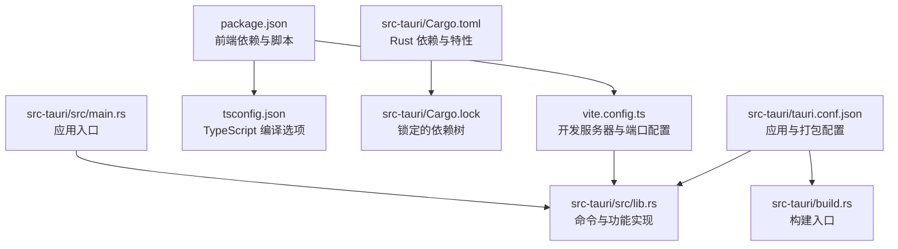
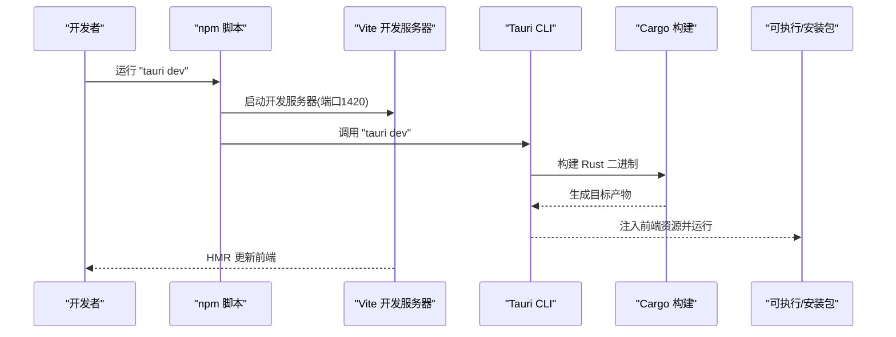
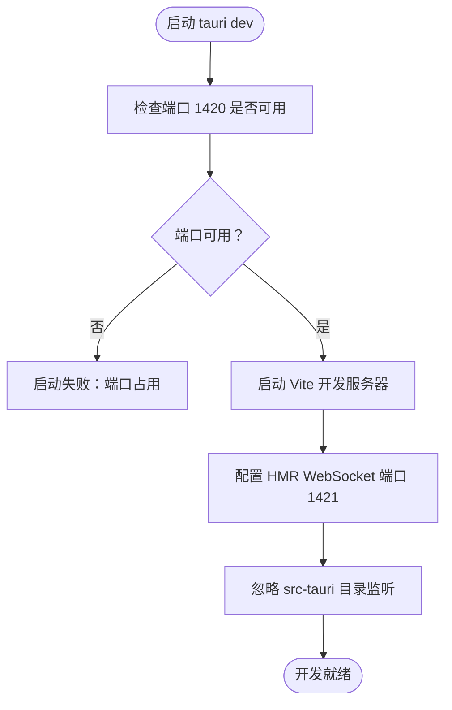
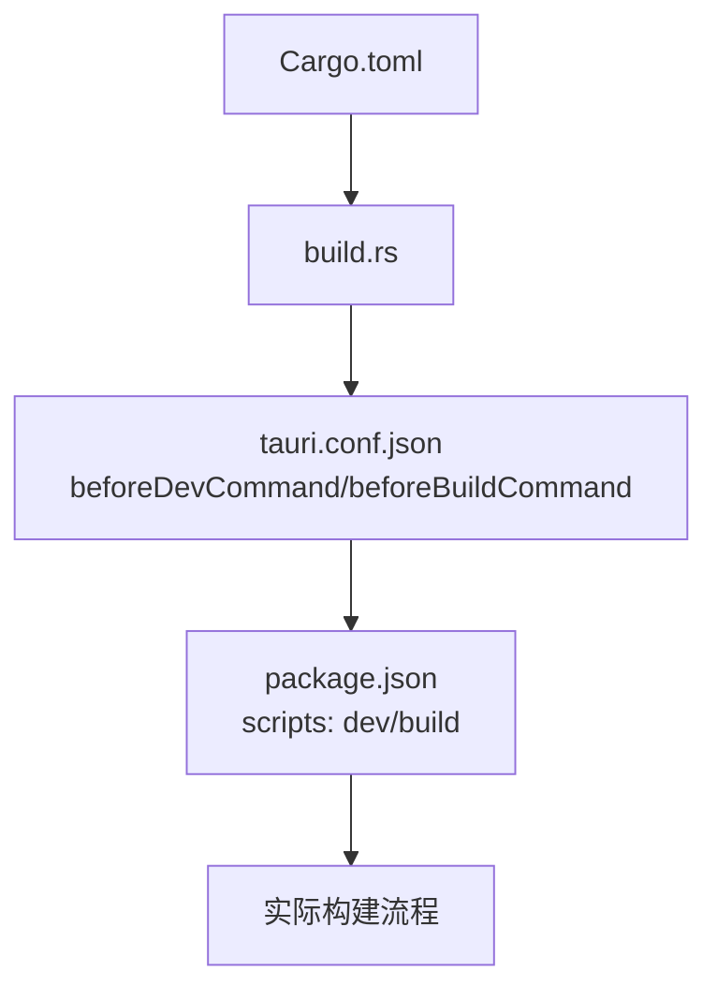
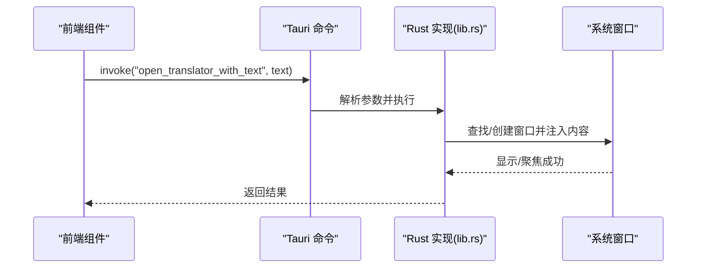
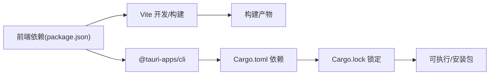

# 安装问题

<cite>
**本文引用的文件**
- [package.json](file://package.json)
- [README.md](file://README.md)
- [vite.config.ts](file://vite.config.ts)
- [tsconfig.json](file://tsconfig.json)
- [src-tauri/Cargo.toml](file://src-tauri/Cargo.toml)
- [src-tauri/Cargo.lock](file://src-tauri/Cargo.lock)
- [src-tauri/tauri.conf.json](file://src-tauri/tauri.conf.json)
- [src-tauri/build.rs](file://src-tauri/build.rs)
- [src-tauri/src/main.rs](file://src-tauri/src/main.rs)
- [src-tauri/src/lib.rs](file://src-tauri/src/lib.rs)
- [src/components/PetComponent.tsx](file://src/components/PetComponent.tsx)
</cite>

## 目录
1. [简介](#简介)
2. [项目结构](#项目结构)
3. [核心组件](#核心组件)
4. [架构总览](#架构总览)
5. [详细组件分析](#详细组件分析)
6. [依赖关系分析](#依赖关系分析)
7. [性能考虑](#性能考虑)
8. [故障排除指南](#故障排除指南)
9. [结论](#结论)
10. [附录](#附录)

## 简介
本指南面向首次安装与构建 XSUN Desktop Pet 的用户，聚焦于安装阶段常见失败场景的诊断与修复，覆盖 Node.js 版本不兼容、Rust 工具链缺失、系统依赖库安装失败、依赖冲突、环境变量配置错误、离线与代理环境安装，以及安装过程中常见错误信息的含义与处理建议。文档同时给出 Windows、macOS、Linux 三大平台的安装注意事项与特殊要求。

## 项目结构
该项目为基于 React + TypeScript 的前端与 Rust + Tauri 的后端组合，前端通过 Vite 开发服务器与 Tauri CLI 协作，后端通过 Cargo 管理 Rust 依赖并打包为原生应用。

**图表来源**
- [package.json:1-29](file://package.json#L1-L29)
- [vite.config.ts:1-33](file://vite.config.ts#L1-L33)
- [tsconfig.json:1-26](file://tsconfig.json#L1-L26)
- [src-tauri/Cargo.toml:1-44](file://src-tauri/Cargo.toml#L1-L44)
- [src-tauri/Cargo.lock:1-200](file://src-tauri/Cargo.lock#L1-L200)
- [src-tauri/tauri.conf.json:1-74](file://src-tauri/tauri.conf.json#L1-L74)
- [src-tauri/build.rs:1-4](file://src-tauri/build.rs#L1-L4)
- [src-tauri/src/main.rs:1-11](file://src-tauri/src/main.rs#L1-L11)
- [src-tauri/src/lib.rs:1-800](file://src-tauri/src/lib.rs#L1-L800)

**章节来源**
- [package.json:1-29](file://package.json#L1-L29)
- [vite.config.ts:1-33](file://vite.config.ts#L1-L33)
- [tsconfig.json:1-26](file://tsconfig.json#L1-L26)
- [src-tauri/Cargo.toml:1-44](file://src-tauri/Cargo.toml#L1-L44)
- [src-tauri/tauri.conf.json:1-74](file://src-tauri/tauri.conf.json#L1-L74)

## 核心组件
- 前端开发与构建
  - Vite 作为开发服务器与打包工具，固定端口与严格端口模式，避免端口占用导致的启动失败。
  - TypeScript 编译配置采用 Bundler 模式，确保与现代打包器兼容。
- Rust 后端与 Tauri
  - Cargo.toml 定义了 Tauri 2、插件与系统信息等依赖，并针对 Windows 平台引入特定依赖。
  - tauri.conf.json 配置开发 URL、构建前置命令、窗口属性与打包目标。
  - build.rs 作为构建入口，调用 tauri_build::build。
- 应用入口
  - src/main.rs 设置 Windows 子系统并在发布版隐藏控制台。
  - src/lib.rs 定义大量命令（系统信息、窗口管理、AI/翻译、日历等），并与前端通过 invoke 通信。

**章节来源**
- [vite.config.ts:1-33](file://vite.config.ts#L1-L33)
- [tsconfig.json:1-26](file://tsconfig.json#L1-L26)
- [src-tauri/Cargo.toml:1-44](file://src-tauri/Cargo.toml#L1-L44)
- [src-tauri/tauri.conf.json:1-74](file://src-tauri/tauri.conf.json#L1-L74)
- [src-tauri/build.rs:1-4](file://src-tauri/build.rs#L1-L4)
- [src-tauri/src/main.rs:1-11](file://src-tauri/src/main.rs#L1-L11)
- [src-tauri/src/lib.rs:1-800](file://src-tauri/src/lib.rs#L1-L800)

## 架构总览
下图展示从开发到构建的关键流程：前端通过 Vite 启动，Tauri CLI 触发 Rust 构建，最终生成可执行程序或安装包。

**图表来源**
- [package.json:6-11](file://package.json#L6-L11)
- [vite.config.ts:16-26](file://vite.config.ts#L16-L26)
- [src-tauri/tauri.conf.json:6-11](file://src-tauri/tauri.conf.json#L6-L11)
- [src-tauri/build.rs:1-4](file://src-tauri/build.rs#L1-L4)

## 详细组件分析

### 组件A：开发服务器与端口配置
- 固定端口与严格端口模式：开发服务器固定在 1420，若被占用将直接失败；HMR WebSocket 端口为 1421。
- 忽略监听 src-tauri 目录，避免不必要的重载。
- 通过环境变量 TAURI_DEV_HOST 支持远程主机热更。

**图表来源**
- [vite.config.ts:16-31](file://vite.config.ts#L16-L31)

**章节来源**
- [vite.config.ts:1-33](file://vite.config.ts#L1-L33)

### 组件B：Rust 构建与平台依赖
- Cargo.toml 指定 Rust edition 与 Tauri 2 依赖，Windows 平台引入特定 Win32 API 依赖。
- build.rs 调用 tauri_build::build，确保构建流程正确。
- tauri.conf.json 的 beforeDevCommand/beforeBuildCommand 与 package.json scripts 协同。

**图表来源**
- [src-tauri/Cargo.toml:1-44](file://src-tauri/Cargo.toml#L1-L44)
- [src-tauri/build.rs:1-4](file://src-tauri/build.rs#L1-L4)
- [src-tauri/tauri.conf.json:6-11](file://src-tauri/tauri.conf.json#L6-L11)
- [package.json:6-11](file://package.json#L6-L11)

**章节来源**
- [src-tauri/Cargo.toml:1-44](file://src-tauri/Cargo.toml#L1-L44)
- [src-tauri/build.rs:1-4](file://src-tauri/build.rs#L1-L4)
- [src-tauri/tauri.conf.json:1-74](file://src-tauri/tauri.conf.json#L1-L74)
- [package.json:1-29](file://package.json#L1-L29)

### 组件C：窗口与命令系统（概念）
- src/lib.rs 定义大量命令，如系统信息、窗口管理、AI/翻译、日历等，前端通过 invoke 调用。
- 窗口管理策略：若目标窗口已存在则显示并聚焦，否则创建新窗口；窗口关闭时销毁实例。

**图表来源**
- [src-tauri/src/lib.rs:115-160](file://src-tauri/src/lib.rs#L115-L160)

**章节来源**
- [src-tauri/src/lib.rs:1-800](file://src-tauri/src/lib.rs#L1-L800)

## 依赖关系分析
- 前端依赖
  - React + TypeScript + Vite + Tauri CLI，版本由 package.json 管控。
- Rust 依赖
  - Tauri 2、插件集合、系统信息、网络请求、时间调度等，Windows 平台额外引入 Win32 API。
- 锁定文件
  - Cargo.lock 记录具体版本与校验和，确保跨平台一致性。

**图表来源**
- [package.json:12-27](file://package.json#L12-L27)
- [src-tauri/Cargo.toml:15-35](file://src-tauri/Cargo.toml#L15-L35)
- [src-tauri/Cargo.lock:1-200](file://src-tauri/Cargo.lock#L1-L200)

**章节来源**
- [package.json:1-29](file://package.json#L1-L29)
- [src-tauri/Cargo.toml:1-44](file://src-tauri/Cargo.toml#L1-L44)
- [src-tauri/Cargo.lock:1-200](file://src-tauri/Cargo.lock#L1-L200)

## 性能考虑
- 开发阶段避免不必要的文件监听，减少磁盘 IO 与内存占用。
- 严格端口模式有助于快速发现端口冲突，缩短调试时间。
- Rust 侧使用 tokio 异步 I/O 与串行化，降低阻塞风险。

[本节为通用指导，无需列出具体文件来源]

## 故障排除指南

### 一、Node.js 与 npm 版本不兼容
- 现有条件
  - 项目声明 Node.js 与 npm 版本，建议按 README 中标注的版本安装。
- 常见症状
  - 安装依赖时报错，或运行 tauri dev 时出现 Node 版本警告。
- 排查步骤
  - 使用版本管理器（如 nvm 或 fnm）切换到推荐版本。
  - 清理缓存与锁文件后重试：删除 node_modules 与 package-lock.json，重新安装。
- 修复建议
  - 严格遵循 README 的版本矩阵，避免使用过新或过旧的 Node.js 版本。

**章节来源**
- [README.md:22-28](file://README.md#L22-L28)
- [package.json:1-29](file://package.json#L1-L29)

### 二、Rust 工具链缺失或版本不匹配
- 现有条件
  - 项目使用 Tauri 2 与 Rust 2021 edition；Windows 平台引入 Win32 API 依赖。
- 常见症状
  - cargo build/cargo tauri build 报错，提示找不到 rustc、链接器或平台依赖。
- 排查步骤
  - 安装稳定版 Rust（建议与 README 版本一致）。
  - 安装平台所需工具链与链接器（Windows 上的 MSVC 工具链）。
  - 验证 Windows 平台依赖是否满足（Win32 系列 API）。
- 修复建议
  - 使用 rustup 安装并切换到推荐版本。
  - Windows 用户安装 Visual Studio Build Tools 或单独的 MSVC 工具链。

**章节来源**
- [README.md:24-28](file://README.md#L24-L28)
- [src-tauri/Cargo.toml:1-10](file://src-tauri/Cargo.toml#L1-L10)
- [src-tauri/Cargo.toml:37-43](file://src-tauri/Cargo.toml#L37-L43)

### 三、系统依赖库安装失败
- 现有条件
  - Windows 平台引入 Win32 API 依赖；Cargo.lock 展示了大量系统与平台相关依赖。
- 常见症状
  - 构建时链接失败、找不到系统头文件或动态库。
- 排查步骤
  - Windows：确认已安装 Visual Studio Build Tools 或 Visual Studio Community。
  - Linux/macOS：确认已安装系统开发工具链与 pkg-config。
- 修复建议
  - 安装完整构建工具链，必要时安装额外系统包（如 OpenSSL、GTK 等）。

**章节来源**
- [src-tauri/Cargo.toml:37-43](file://src-tauri/Cargo.toml#L37-L43)
- [src-tauri/Cargo.lock:4344-4412](file://src-tauri/Cargo.lock#L4344-L4412)

### 四、依赖冲突（npm 包与 Rust crate）
- 现有条件
  - package.json 与 Cargo.toml 分别管理前端与后端依赖；Cargo.lock 锁定版本。
- 常见症状
  - 依赖解析失败、版本冲突、重复安装或构建中断。
- 排查步骤
  - 清理 node_modules 与 package-lock.json，重新安装。
  - 检查 Cargo.lock 中是否存在版本不一致或冲突的 crate。
- 修复建议
  - 保持 package.json 与 Cargo.toml 的依赖版本与 README 一致。
  - 使用 yarn/pnpm 替代 npm 以减少冲突概率（视团队策略）。

**章节来源**
- [package.json:12-27](file://package.json#L12-L27)
- [src-tauri/Cargo.toml:15-35](file://src-tauri/Cargo.toml#L15-L35)
- [src-tauri/Cargo.lock:1-200](file://src-tauri/Cargo.lock#L1-L200)

### 五、环境变量配置错误
- 现有条件
  - Vite 配置支持通过环境变量 TAURI_DEV_HOST 控制 HMR 主机。
- 常见症状
  - 开发时 HMR 不生效或连接失败。
- 排查步骤
  - 确认 TAURI_DEV_HOST 是否正确设置（如需要）。
  - 检查防火墙与网络策略是否允许 1420/1421 端口通信。
- 修复建议
  - 在开发环境中显式设置 TAURI_DEV_HOST，或保持默认值。

**章节来源**
- [vite.config.ts:5](file://vite.config.ts#L5)
- [vite.config.ts:20-26](file://vite.config.ts#L20-L26)

### 六、离线安装与代理环境
- 现有条件
  - package-lock.json 与 Cargo.lock 提供锁定版本；Windows 平台存在多架构 CLI 二进制。
- 常见症状
  - 无法访问外部镜像源，安装缓慢或失败。
- 排查步骤
  - npm：配置 registry 与缓存，或使用本地镜像；清理缓存后重试。
  - cargo：配置 .cargo/config.toml 使用国内镜像源；提前下载所需二进制。
- 修复建议
  - 将 package-lock.json 与 Cargo.lock 提交至内网仓库，离线安装时直接使用。
  - Windows 平台根据 CPU 架构选择对应 @tauri-apps/cli 二进制。

**章节来源**
- [package.json:6-11](file://package.json#L6-L11)
- [package-lock.json:1229-1351](file://package-lock.json#L1229-L1351)
- [src-tauri/Cargo.toml:15-35](file://src-tauri/Cargo.toml#L15-L35)

### 七、安装过程中的常见错误信息与含义
- “端口 1420 已被占用”
  - 含义：Vite 开发服务器固定端口被占用。
  - 处理：释放端口或修改 vite.config.ts 的端口配置。
- “找不到 rustc 或链接器”
  - 含义：缺少 Rust 工具链或平台构建工具。
  - 处理：安装 rustup 与对应平台工具链。
- “Windows SDK/MSVC 缺失”
  - 含义：Windows 平台缺少构建所需的 SDK 或编译器。
  - 处理：安装 Visual Studio Build Tools 或单独的 MSVC。
- “API 请求失败 (状态码)”
  - 含义：前端调用后端命令或第三方 API 失败。
  - 处理：检查配置文件、网络连通性与鉴权信息。

**章节来源**
- [vite.config.ts:16-18](file://vite.config.ts#L16-L18)
- [src-tauri/src/lib.rs:278-282](file://src-tauri/src/lib.rs#L278-L282)

### 八、不同操作系统（Windows、macOS、Linux）安装注意事项
- Windows
  - 必须安装 Visual Studio Build Tools 或 Visual Studio Community。
  - 注意 Win32 API 依赖与架构匹配（x64/ARM64）。
- macOS
  - 安装 Xcode Command Line Tools。
  - 如使用 Homebrew，注意 OpenSSL 等库的版本与链接路径。
- Linux
  - 安装系统开发工具链与 GTK/WebKit 等依赖。
  - 部分依赖可能需要 pkg-config 与系统头文件。

**章节来源**
- [src-tauri/Cargo.toml:37-43](file://src-tauri/Cargo.toml#L37-L43)
- [src-tauri/Cargo.lock:4344-4412](file://src-tauri/Cargo.lock#L4344-L4412)

## 结论
安装阶段的问题多源于工具链版本不匹配、系统依赖缺失与网络/代理限制。建议严格遵循 README 的版本矩阵，准备齐全的构建工具链，并在离线/代理环境下使用锁定文件与镜像源。遇到错误时，优先检查端口占用、Rust 工具链与平台 SDK，再逐步排查依赖与网络问题。

[本节为总结性内容，无需列出具体文件来源]

## 附录

### A. 开发与构建命令对照
- 开发运行：npm run tauri dev
- 生产构建：npm run build；cargo tauri build

**章节来源**
- [package.json:6-11](file://package.json#L6-L11)
- [README.md:252-259](file://README.md#L252-L259)

### B. 端口与窗口配置速查
- 开发端口：1420（固定且严格）
- HMR 端口：1421（可选）
- 窗口属性：透明、无装饰、置顶等在 tauri.conf.json 中集中配置

**章节来源**
- [vite.config.ts:16-26](file://vite.config.ts#L16-L26)
- [src-tauri/tauri.conf.json:13-43](file://src-tauri/tauri.conf.json#L13-L43)