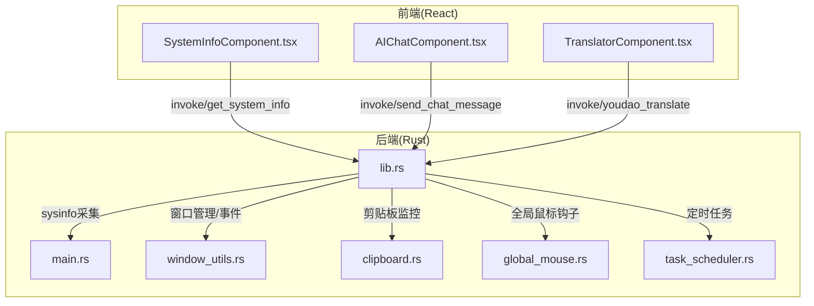
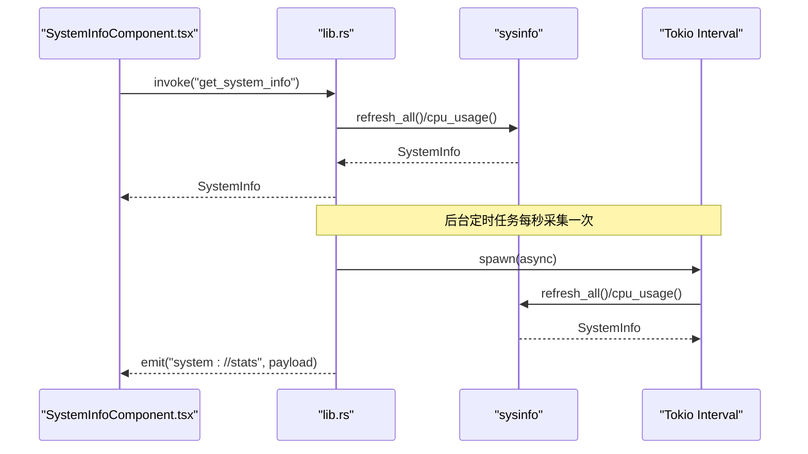
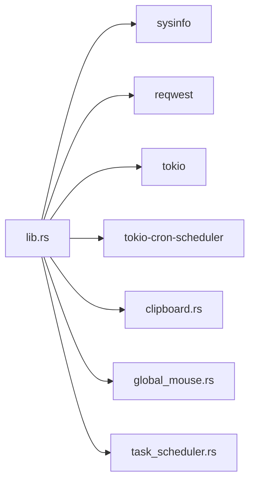

# CPU性能优化

<cite>
**本文引用的文件**
- [src/components/SystemInfoComponent.tsx](file://src/components/SystemInfoComponent.tsx)
- [src-tauri/src/lib.rs](file://src-tauri/src/lib.rs)
- [src-tauri/src/main.rs](file://src-tauri/src/main.rs)
- [src-tauri/Cargo.toml](file://src-tauri/Cargo.toml)
- [src-tauri/src/window_utils.rs](file://src-tauri/src/window_utils.rs)
- [src-tauri/src/clipboard.rs](file://src-tauri/src/clipboard.rs)
- [src-tauri/src/global_mouse.rs](file://src-tauri/src/global_mouse.rs)
- [src-tauri/src/task_scheduler.rs](file://src-tauri/src/task_scheduler.rs)
- [src/components/AIChatComponent.tsx](file://src/components/AIChatComponent.tsx)
- [src/components/TranslatorComponent.tsx](file://src/components/TranslatorComponent.tsx)
</cite>

## 目录
1. [简介](#简介)
2. [项目结构](#项目结构)
3. [核心组件](#核心组件)
4. [架构总览](#架构总览)
5. [详细组件分析](#详细组件分析)
6. [依赖关系分析](#依赖关系分析)
7. [性能考量](#性能考量)
8. [故障排查指南](#故障排查指南)
9. [结论](#结论)
10. [附录](#附录)

## 简介
本指南围绕桌面宠物应用的CPU性能优化展开，重点分析系统监控组件中CPU使用率计算的性能瓶颈与优化策略，涵盖sysinfo库调用频率优化、CPU使用率计算算法优化、多核CPU负载均衡策略；同时覆盖窗口管理中的CPU开销问题（窗口创建/销毁频率控制、事件循环优化、定时器管理）；并提供AI对话与翻译功能中的CPU优化策略（异步处理优化、请求合并、缓存机制）。最后给出性能测试方法、CPU使用率监控指标及针对不同硬件配置的优化建议。

## 项目结构
该应用采用Tauri v2 + React架构，Rust侧负责系统信息采集、窗口管理、剪贴板监控、定时任务与AI/翻译接口，前端React负责UI渲染与事件交互。

**图表来源**
- [src-tauri/src/main.rs:8-10](file://src-tauri/src/main.rs#L8-L10)
- [src-tauri/src/lib.rs:948-1119](file://src-tauri/src/lib.rs#L948-L1119)
- [src/components/SystemInfoComponent.tsx:16-26](file://src/components/SystemInfoComponent.tsx#L16-L26)
- [src/components/AIChatComponent.tsx:113-135](file://src/components/AIChatComponent.tsx#L113-L135)
- [src/components/TranslatorComponent.tsx:174-187](file://src/components/TranslatorComponent.tsx#L174-L187)

**章节来源**
- [src-tauri/src/main.rs:8-10](file://src-tauri/src/main.rs#L8-L10)
- [src-tauri/src/lib.rs:948-1119](file://src-tauri/src/lib.rs#L948-L1119)

## 核心组件
- 系统监控组件：负责展示CPU/内存使用率，并通过事件流接收实时数据。
- Rust系统信息采集：基于sysinfo定期采集并广播事件。
- 窗口管理：统一创建/复用窗口，避免频繁销毁重建。
- 剪贴板监控：降低检查频率，避免高CPU占用。
- 定时任务：使用cron调度器，按需执行AI/翻译等高开销任务。
- AI对话与翻译：通过异步invoke调用后端接口，避免阻塞UI线程。

**章节来源**
- [src/components/SystemInfoComponent.tsx:13-26](file://src/components/SystemInfoComponent.tsx#L13-L26)
- [src-tauri/src/lib.rs:1042-1068](file://src-tauri/src/lib.rs#L1042-L1068)
- [src-tauri/src/clipboard.rs:84-121](file://src-tauri/src/clipboard.rs#L84-L121)
- [src-tauri/src/task_scheduler.rs:21-61](file://src-tauri/src/task_scheduler.rs#L21-L61)

## 架构总览
系统采用“前端事件驱动 + Rust后台服务”的模式。前端通过invoke调用后端命令，后端通过状态共享与事件广播向前端推送数据。系统信息采集与剪贴板监控在Rust侧以异步任务运行，定时任务在独立调度器中执行，避免阻塞主线程。

**图表来源**
- [src-tauri/src/lib.rs:41-72](file://src-tauri/src/lib.rs#L41-L72)
- [src-tauri/src/lib.rs:1046-1068](file://src-tauri/src/lib.rs#L1046-L1068)
- [src/components/SystemInfoComponent.tsx:16-26](file://src/components/SystemInfoComponent.tsx#L16-L26)

## 详细组件分析

### 系统监控组件与CPU使用率计算
- 数据来源：首次通过invoke获取一次快照，随后监听"system://stats"事件持续接收实时数据。
- 计算逻辑：Rust侧对所有CPU核心使用率求和后除以核心数，得到平均值，避免单核峰值导致误判。
- 渲染策略：仅在事件到达时更新状态，避免高频重绘。

优化建议
- 采集频率：当前为每秒一次，已较为合理；若CPU压力较大可考虑增加到2秒一次。
- 计算算法：可引入滑动平均或指数加权移动平均，平滑瞬时波动。
- 多核均衡：当前已按核心数取平均，进一步可按核心负载分布进行权重调整（需评估收益）。

**章节来源**
- [src/components/SystemInfoComponent.tsx:16-26](file://src/components/SystemInfoComponent.tsx#L16-L26)
- [src-tauri/src/lib.rs:61-72](file://src-tauri/src/lib.rs#L61-L72)
- [src-tauri/src/lib.rs:1046-1068](file://src-tauri/src/lib.rs#L1046-L1068)

### 窗口管理与事件循环优化
- 窗口复用：前端在创建窗口前先查询是否存在同标签窗口，存在则显示并聚焦，避免重复创建销毁。
- 事件监听：组件卸载时及时解绑事件监听，防止内存泄漏与无效回调。
- 定时器管理：使用tokio::time::interval控制轮询频率，避免忙等。

优化建议
- 窗口生命周期：对长时间不使用的窗口进行懒加载或延迟创建，减少常驻窗口数量。
- 事件去抖：对高频事件（如窗口大小变化）进行去抖处理，降低渲染压力。
- 定时器合并：将多个定时任务合并为一个，减少上下文切换。

**章节来源**
- [src/components/PetComponent.tsx:45-77](file://src/components/PetComponent.tsx#L45-L77)
- [src-tauri/src/lib.rs:1046-1068](file://src-tauri/src/lib.rs#L1046-L1068)

### 剪贴板监控与CPU开销控制
- 检查频率：当前为每5秒一次，已显著低于高频轮询。
- 去重策略：记录上次内容，相同则跳过，避免重复处理。
- 错误恢复：连续错误达到阈值后进入退避策略，暂停一段时间再恢复。

优化建议
- 内容长度限制：对超长内容直接拒绝，避免后续处理开销。
- 异步处理：将内容写入队列，由后台worker异步处理，避免阻塞主线程。
- 缓存策略：对近期重复内容建立缓存，减少磁盘IO。

**章节来源**
- [src-tauri/src/lib.rs:1074-1110](file://src-tauri/src/lib.rs#L1074-L1110)
- [src-tauri/src/clipboard.rs:84-121](file://src-tauri/src/clipboard.rs#L84-L121)
- [src-tauri/src/clipboard.rs:124-224](file://src-tauri/src/clipboard.rs#L124-L224)

### 定时任务与AI/翻译优化
- 调度器：使用tokio-cron-scheduler，按Cron表达式执行任务。
- AI任务：仅在工作日17:00附近执行，避免全天候高负载。
- 翻译/对话：通过invoke异步调用，前端等待期间显示加载态，避免阻塞。

优化建议
- 请求合并：对短时间内的多次翻译请求进行合并，减少网络往返。
- 结果缓存：对相同文本的翻译结果进行缓存，命中则直接返回。
- 异步队列：将高开销任务放入异步队列，按优先级调度。

**章节来源**
- [src-tauri/src/task_scheduler.rs:21-61](file://src-tauri/src/task_scheduler.rs#L21-L61)
- [src-tauri/src/lib.rs:262-301](file://src-tauri/src/lib.rs#L262-L301)
- [src-tauri/src/lib.rs:478-552](file://src-tauri/src/lib.rs#L478-L552)

### 全局鼠标钩子与窗口穿透
- 钩子实现：在Windows上使用WH_MOUSE_LL钩子捕获中键点击，模拟Ctrl+C获取选中文本。
- 窗口穿透：通过设置透明/穿透属性，降低光标事件处理开销。

优化建议
- 钩子粒度：仅在需要时启用钩子，空闲时禁用以降低CPU占用。
- 事件过滤：对非目标区域的事件进行快速过滤，减少处理分支。

**章节来源**
- [src-tauri/src/global_mouse.rs:111-149](file://src-tauri/src/global_mouse.rs#L111-L149)
- [src-tauri/src/window_utils.rs:9-32](file://src-tauri/src/window_utils.rs#L9-L32)

## 依赖关系分析
Rust侧依赖sysinfo进行系统信息采集，reqwest进行HTTP请求，tokio用于异步任务调度，cron调度器用于定时任务。

**图表来源**
- [src-tauri/Cargo.toml:15-35](file://src-tauri/Cargo.toml#L15-L35)
- [src-tauri/src/lib.rs:1-11](file://src-tauri/src/lib.rs#L1-L11)

**章节来源**
- [src-tauri/Cargo.toml:15-35](file://src-tauri/Cargo.toml#L15-L35)

## 性能考量
- CPU使用率监控指标
  - 平均CPU使用率：系统整体平均，反映长期负载。
  - 用户态CPU使用率：应用自身逻辑占比。
  - 中断/系统调用：sysinfo调用次数与耗时。
  - 线程数与上下文切换：过多线程会增加调度开销。
- 性能测试方法
  - 使用系统自带性能监视器或第三方工具（如htop/PerfView）观察CPU曲线。
  - 对比优化前后的CPU使用率、P95/P99延迟。
  - 压力测试：模拟高频窗口创建/销毁、大量剪贴板事件、并发翻译请求。
- 不同硬件配置建议
  - 低配CPU（2-4核）：提高sysinfo采集间隔至2秒，减少定时任务频率，启用请求合并与缓存。
  - 中配CPU（6-8核）：保持默认配置，适度开启缓存与去抖。
  - 高配CPU（>8核）：可适当降低缓存/去抖策略，提升实时性。

## 故障排查指南
- 系统监控无数据
  - 检查Rust侧定时任务是否正常运行，确认事件广播是否成功。
  - 查看前端事件监听是否正确绑定与解绑。
- CPU使用率异常升高
  - 检查sysinfo调用频率是否被意外降低或增加。
  - 排查剪贴板监控是否因错误过多进入退避。
  - 检查定时任务是否重复注册或执行时间冲突。
- 翻译/对话卡顿
  - 检查invoke调用是否阻塞UI线程（应为异步）。
  - 查看网络请求是否超时或频繁失败导致重试。
  - 对比优化前后请求合并与缓存命中率。

**章节来源**
- [src-tauri/src/lib.rs:1046-1068](file://src-tauri/src/lib.rs#L1046-L1068)
- [src-tauri/src/lib.rs:1074-1110](file://src-tauri/src/lib.rs#L1074-L1110)
- [src-tauri/src/task_scheduler.rs:21-61](file://src-tauri/src/task_scheduler.rs#L21-L61)

## 结论
通过对sysinfo调用频率、事件驱动架构、窗口生命周期管理、剪贴板监控与定时任务的系统性优化，可在保证用户体验的同时显著降低CPU开销。建议在不同硬件配置下采用差异化策略，并结合性能测试持续验证优化效果。

## 附录
- 优化清单
  - 提高sysinfo采集间隔（如2秒）
  - 引入滑动平均/EMA算法平滑CPU曲线
  - 启用请求合并与结果缓存
  - 对高频事件进行去抖/节流
  - 合并定时任务，减少上下文切换
  - 窗口懒加载与复用
  - 剪贴板内容长度限制与异步处理