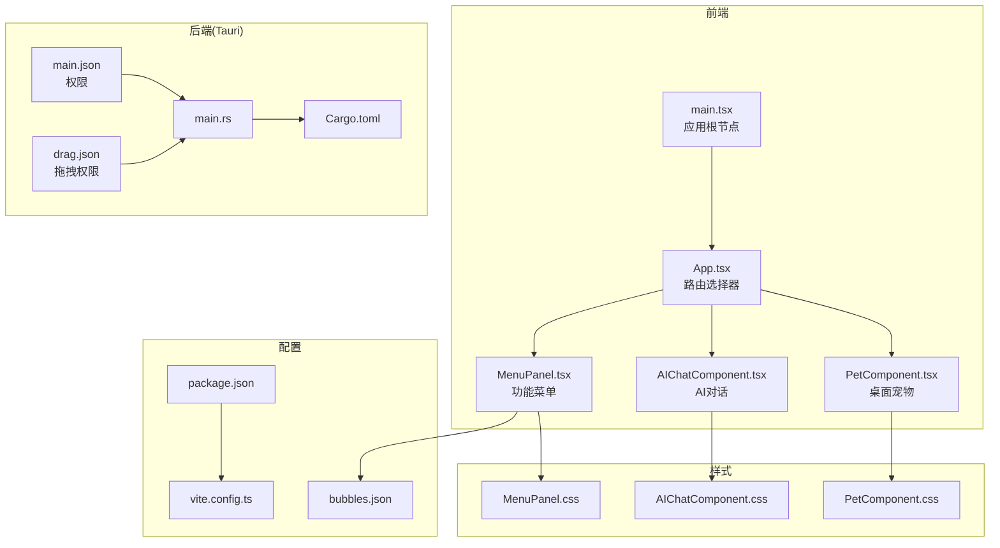
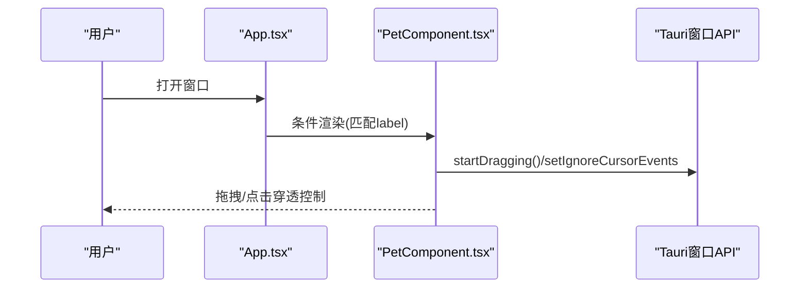
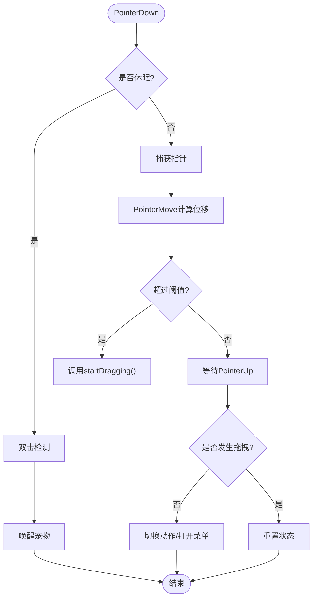
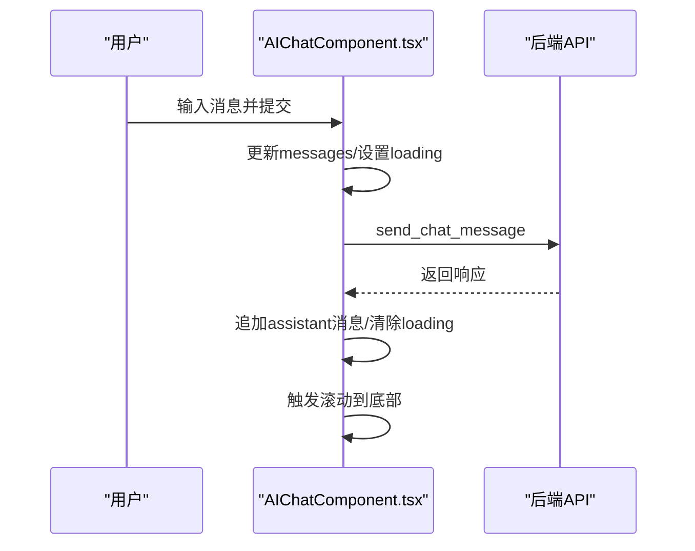
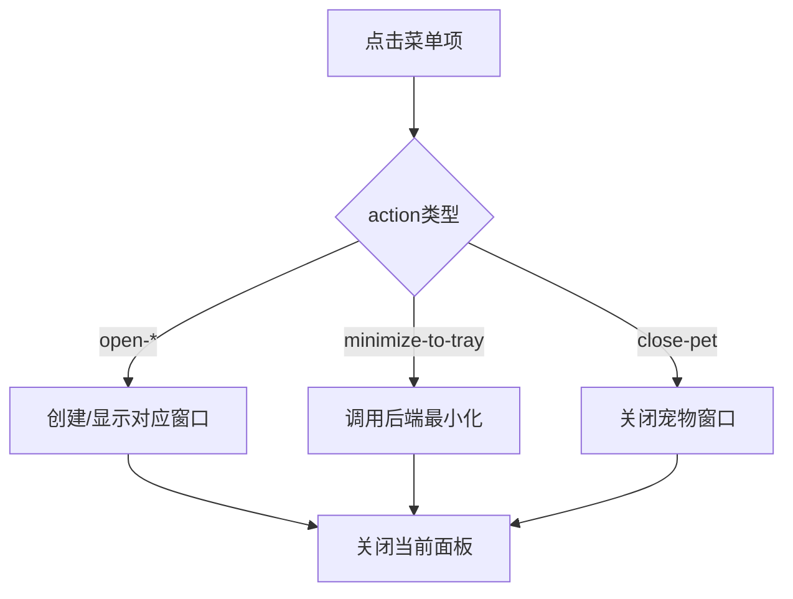
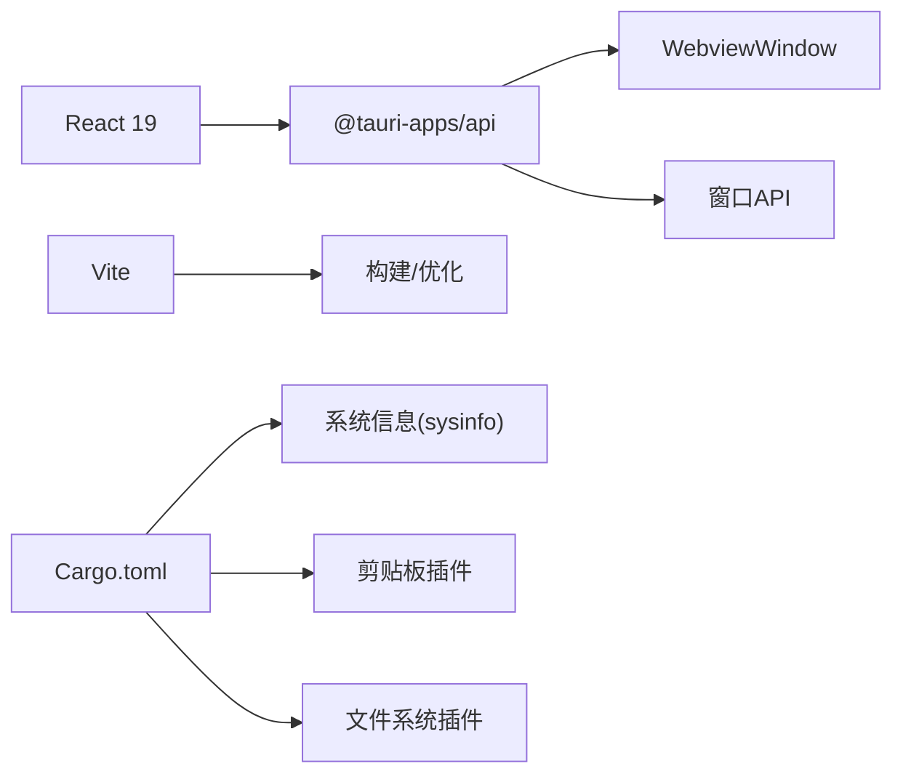

# UI渲染性能优化

<cite>
**本文引用的文件**
- [App.tsx](file://src/App.tsx)
- [main.tsx](file://src/main.tsx)
- [PetComponent.tsx](file://src/components/PetComponent.tsx)
- [PetComponent.css](file://src/components/PetComponent.css)
- [AIChatComponent.tsx](file://src/components/AIChatComponent.tsx)
- [AIChatComponent.css](file://src/components/AIChatComponent.css)
- [MenuPanel.tsx](file://src/components/MenuPanel.tsx)
- [MenuPanel.css](file://src/components/MenuPanel.css)
- [bubbles.json](file://dist/config/bubbles.json)
- [package.json](file://package.json)
- [vite.config.ts](file://vite.config.ts)
- [Cargo.toml](file://src-tauri/Cargo.toml)
- [main.rs](file://src-tauri/src/main.rs)
- [main.json](file://src-tauri/capabilities/main.json)
- [drag.json](file://src-tauri/capabilities/drag.json)
</cite>

## 目录
1. [引言](#引言)
2. [项目结构](#项目结构)
3. [核心组件](#核心组件)
4. [架构总览](#架构总览)
5. [详细组件分析](#详细组件分析)
6. [依赖关系分析](#依赖关系分析)
7. [性能考量](#性能考量)
8. [故障排查指南](#故障排查指南)
9. [结论](#结论)
10. [附录](#附录)

## 引言
本指南聚焦于桌面宠物应用的UI渲染性能优化，结合现有代码实现，系统阐述以下主题：
- React组件重渲染优化：useMemo/useCallback的正确使用、组件拆分策略、状态提升优化
- 桌面宠物拖拽动画性能：requestAnimationFrame替代方案、CSS动画与GPU加速
- 多窗口架构渲染管理：窗口可见性优化、懒加载策略、事件委托优化
- 性能分析工具与监控指标：如何在本项目中落地
- 用户体验优化最佳实践：交互流畅度、视觉反馈与资源占用平衡

## 项目结构
项目采用前端React + Tauri后端的混合架构，前端通过Vite构建，Tauri负责系统级能力（窗口、托盘、文件系统等）。核心入口位于src目录，组件按功能模块划分；多窗口通过WebviewWindow动态创建。

图表来源
- [main.tsx:1-10](file://src/main.tsx#L1-L10)
- [App.tsx:18-58](file://src/App.tsx#L18-L58)
- [PetComponent.tsx:19-819](file://src/components/PetComponent.tsx#L19-L819)
- [AIChatComponent.tsx:23-371](file://src/components/AIChatComponent.tsx#L23-L371)
- [MenuPanel.tsx:14-295](file://src/components/MenuPanel.tsx#L14-L295)
- [PetComponent.css:1-242](file://src/components/PetComponent.css#L1-L242)
- [AIChatComponent.css:1-646](file://src/components/AIChatComponent.css#L1-L646)
- [MenuPanel.css:1-180](file://src/components/MenuPanel.css#L1-L180)
- [package.json:1-29](file://package.json#L1-L29)
- [vite.config.ts:1-33](file://vite.config.ts#L1-L33)
- [bubbles.json:1-52](file://dist/config/bubbles.json#L1-L52)
- [main.rs:8-11](file://src-tauri/src/main.rs#L8-L11)
- [Cargo.toml:15-44](file://src-tauri/Cargo.toml#L15-L44)
- [main.json:1-40](file://src-tauri/capabilities/main.json#L1-L40)
- [drag.json:1-14](file://src-tauri/capabilities/drag.json#L1-L14)

章节来源
- [main.tsx:1-10](file://src/main.tsx#L1-L10)
- [App.tsx:18-58](file://src/App.tsx#L18-L58)
- [package.json:1-29](file://package.json#L1-L29)
- [vite.config.ts:1-33](file://vite.config.ts#L1-L33)

## 核心组件
- 应用入口与路由：应用根节点在main.tsx中创建，App.tsx根据窗口label动态渲染不同组件，避免不必要的全量渲染。
- 桌面宠物：PetComponent.tsx负责拖拽、休眠/唤醒逻辑、气泡菜单渲染与窗口创建，是性能优化的关键点。
- AI对话：AIChatComponent.tsx负责消息列表渲染、输入框与滚动行为，涉及大量DOM更新。
- 功能菜单：MenuPanel.tsx提供九宫格菜单，支持点击外部关闭与窗口创建。

章节来源
- [main.tsx:5-9](file://src/main.tsx#L5-L9)
- [App.tsx:18-58](file://src/App.tsx#L18-L58)
- [PetComponent.tsx:19-819](file://src/components/PetComponent.tsx#L19-L819)
- [AIChatComponent.tsx:23-371](file://src/components/AIChatComponent.tsx#L23-L371)
- [MenuPanel.tsx:14-295](file://src/components/MenuPanel.tsx#L14-L295)

## 架构总览
前端通过App.tsx的条件渲染，仅在当前窗口label匹配时挂载对应组件，减少全局状态变更带来的重渲染。多窗口通过WebviewWindow按需创建，避免一次性初始化所有窗口。

图表来源
- [App.tsx:27-55](file://src/App.tsx#L27-L55)
- [PetComponent.tsx:118-139](file://src/components/PetComponent.tsx#L118-L139)

## 详细组件分析

### 桌面宠物组件(PetComponent)性能分析
- 状态与副作用
  - 使用useState维护索引、气泡显示、点击穿透、休眠状态等，避免在渲染期间产生副作用。
  - useRef存储拖拽阈值、定时器、指针按下位置等，防止每次渲染都创建新引用导致子组件重渲染。
  - useEffect监听唤醒事件、托盘事件与选中文本事件，统一在卸载时清理，避免内存泄漏。
- 拖拽与点击穿透
  - onPointerDown/onPointerMove/onPointerUp组合实现拖拽，使用setPointerCapture捕获指针，减少事件冒泡成本。
  - 通过invoke调用后端能力切换点击穿透，休眠时仅在宠物图像上响应双击，降低事件处理复杂度。
- 气泡菜单渲染
  - renderBubbles基于固定半径与角度计算位置，使用map生成子元素，注意key的稳定性与transform的使用。
  - CSS动画通过fadeIn/smoothFloatIn控制出现/消失，避免使用会触发回流的属性（如left/top）。
- 窗口创建与通信
  - createOrShowWindow系列函数按需创建子窗口，使用WebviewWindow.once监听tauri://created，避免重复监听。
  - 通过事件系统传递数据，减少跨窗口直接状态共享带来的重渲染。

图表来源
- [PetComponent.tsx:90-139](file://src/components/PetComponent.tsx#L90-L139)
- [PetComponent.tsx:152-202](file://src/components/PetComponent.tsx#L152-L202)

章节来源
- [PetComponent.tsx:19-819](file://src/components/PetComponent.tsx#L19-L819)
- [PetComponent.css:40-171](file://src/components/PetComponent.css#L40-L171)

### AI对话组件(AIChatComponent)性能分析
- 消息列表渲染
  - messages数组驱动列表渲染，每次新增消息都会触发重渲染。建议：
    - 使用useMemo缓存消息项的渲染结果（若消息项包含复杂计算）
    - 使用React.memo包装消息项组件，避免无关兄弟节点重渲染
- 滚动行为
  - useEffect依赖messages，每次新增消息自动滚动到底部。建议：
    - 将滚动逻辑封装为useCallback，避免每次渲染都创建新函数
    - 对长列表使用虚拟滚动（如react-window）减少DOM节点数量
- 输入与发送
  - 输入框受isLoading控制禁用，避免并发请求。建议：
    - 将handleSendMessage用useCallback包裹，作为依赖传入useEffect
    - 使用防抖/节流处理高频输入

图表来源
- [AIChatComponent.tsx:88-135](file://src/components/AIChatComponent.tsx#L88-L135)
- [AIChatComponent.tsx:42-53](file://src/components/AIChatComponent.tsx#L42-L53)

章节来源
- [AIChatComponent.tsx:23-371](file://src/components/AIChatComponent.tsx#L23-L371)
- [AIChatComponent.css:173-200](file://src/components/AIChatComponent.css#L173-L200)

### 功能菜单组件(MenuPanel)性能分析
- 菜单项渲染
  - items来自bubbles.json，使用useState初始化，避免在渲染期间进行昂贵计算。
  - handleItemClick根据action分支创建或显示目标窗口，统一在关闭面板后执行。
- 点击外部关闭
  - useEffect延迟添加文档级mousedown监听，避免创建时误触；清理时移除监听。
- 图标加载降级
  - onError回调提供默认图标，避免单个图标失败影响整体渲染。

图表来源
- [MenuPanel.tsx:90-259](file://src/components/MenuPanel.tsx#L90-L259)
- [bubbles.json:1-52](file://dist/config/bubbles.json#L1-L52)

章节来源
- [MenuPanel.tsx:14-295](file://src/components/MenuPanel.tsx#L14-L295)
- [MenuPanel.css:78-154](file://src/components/MenuPanel.css#L78-L154)

## 依赖关系分析
- 前端依赖
  - React 19与@tauri-apps/api提供窗口、事件、WebviewWindow等能力
  - Vite提供开发服务器与HMR，生产构建优化打包
- 后端依赖
  - Tauri核心能力与插件（clipboard、fs、opener、dialog），系统信息采集（sysinfo）
  - Windows平台特定能力（鼠标钩子、SendInput）

图表来源
- [package.json:12-19](file://package.json#L12-L19)
- [vite.config.ts:8-32](file://vite.config.ts#L8-L32)
- [Cargo.toml:15-44](file://src-tauri/Cargo.toml#L15-L44)

章节来源
- [package.json:1-29](file://package.json#L1-29)
- [Cargo.toml:15-44](file://src-tauri/Cargo.toml#L15-L44)

## 性能考量

### React组件重渲染优化
- useMemo/useCallback的正确使用
  - 在AIChatComponent中，将handleSendMessage与scrollToBottom用useCallback包裹，避免每次渲染都创建新函数导致子组件重渲染。
  - 在PetComponent中，将renderBubbles的计算逻辑放入useMemo（若存在复杂计算），或保持当前稳定映射以减少对象创建。
- 组件拆分策略
  - 将消息项拆分为独立组件并使用React.memo包装，仅在props变化时重渲染。
  - 将菜单项拆分为独立组件，使用memo化与稳定的key。
- 状态提升优化
  - 将跨窗口共享的状态集中管理（如当前激活窗口、全局配置），避免在多个组件内重复订阅事件。
  - 使用Context或轻量状态库（如Zustand）减少深层props传递。

### 桌面宠物拖拽动画性能
- requestAnimationFrame替代方案
  - 现有实现使用原生Pointer事件与Tauri窗口拖拽API，无需手动RAF。建议在自定义动画中使用requestAnimationFrame，避免setTimeout/setInterval造成的掉帧。
- CSS动画与GPU加速
  - PetComponent.css中使用transform与opacity动画，这些属性由合成线程处理，避免回流。建议：
    - 优先使用transform/opacity，避免width/height/left/top等布局属性
    - 为动画元素添加will-change或transform3d以提示浏览器启用GPU加速
- 动画节流与去抖
  - 拖拽过程中的位置更新可通过节流控制频率，减少重排压力。

### 多窗口架构渲染管理
- 窗口可见性优化
  - 使用getCurrentWindow().isVisible()判断窗口状态，避免在不可见时执行昂贵操作。
  - 在窗口隐藏时暂停定时器与轮询任务，显示时恢复。
- 懒加载策略
  - 子窗口按需创建（WebviewWindow），首次访问才初始化，减少启动时间与内存占用。
  - 对大组件（如AI对话）采用Suspense或骨架屏，提升感知性能。
- 事件委托优化
  - MenuPanel在文档级别监听mousedown，使用事件委托减少绑定数量。
  - 在PetComponent中，将事件绑定在容器上，利用事件冒泡减少绑定次数。

### 性能分析工具与监控指标
- 开发期工具
  - React DevTools Profiler：识别重渲染热点与长任务
  - Chrome Performance面板：分析主线程阻塞、布局与绘制
  - Lighthouse：评估交互延迟与渲染性能
- 生产监控
  - FPS计数：在调试模式下显示帧率
  - 首屏时间与交互就绪时间：通过Navigation Timing API统计
  - 长任务检测：使用PerformanceObserver监控>50ms的任务

### 用户体验优化最佳实践
- 交互反馈
  - 拖拽开始/结束提供即时视觉反馈（缩放、阴影变化）
  - 气泡菜单出现/消失使用平滑动画，避免闪烁
- 资源占用
  - 休眠状态下停止非必要动画与事件监听
  - 图片与背景图使用合适的尺寸与格式（WebP），减少带宽与解码时间

## 故障排查指南
- 窗口创建超时
  - 检查WebviewWindow.once监听是否正确注册与清理，确认tauri://created与tauri://error事件路径。
- 事件未触发或重复触发
  - 确认事件监听在组件挂载时注册，在卸载时清理；避免在渲染期间注册监听。
- 拖拽失效
  - 检查权限配置（drag.json）与后端能力（main.json），确保允许startDragging与setIgnoreCursorEvents。
- 滚动异常
  - 确保scrollIntoView调用时机正确，避免在消息数量为0时调用。

章节来源
- [PetComponent.tsx:191-202](file://src/components/PetComponent.tsx#L191-L202)
- [MenuPanel.tsx:18-34](file://src/components/MenuPanel.tsx#L18-L34)
- [main.json:6-38](file://src-tauri/capabilities/main.json#L6-L38)
- [drag.json:4-12](file://src-tauri/capabilities/drag.json#L4-L12)

## 结论
本项目在多窗口与桌面宠物场景下，已具备良好的性能基础：按需创建窗口、事件委托与有限的动画使用。进一步优化可集中在：
- React层：useMemo/useCallback规范化、组件拆分与memo化
- 动画层：优先使用transform/opacity、合理使用RAF
- 架构层：窗口可见性管理、懒加载与事件去抖
- 工具层：引入Profiler与性能监控，持续迭代

## 附录
- 关键配置参考
  - Vite开发服务器端口与HMR配置
  - Tauri权限声明与能力范围
  - 菜单项配置与图标路径

章节来源
- [vite.config.ts:16-26](file://vite.config.ts#L16-L26)
- [main.json:1-40](file://src-tauri/capabilities/main.json#L1-L40)
- [drag.json:1-14](file://src-tauri/capabilities/drag.json#L1-L14)
- [bubbles.json:1-52](file://dist/config/bubbles.json#L1-L52)