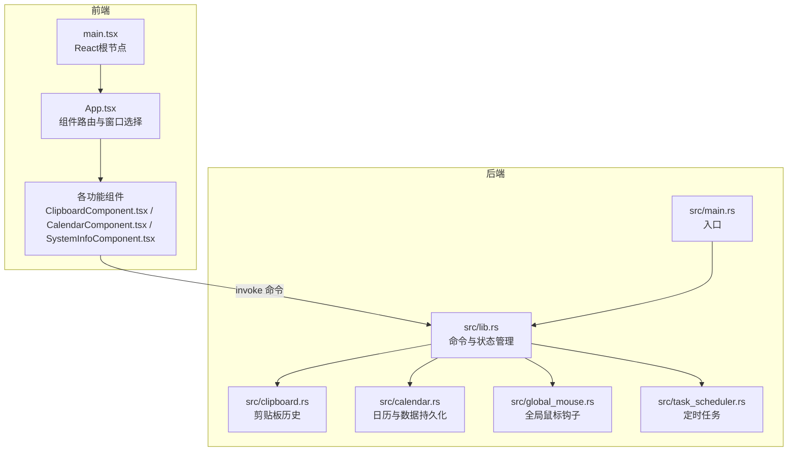
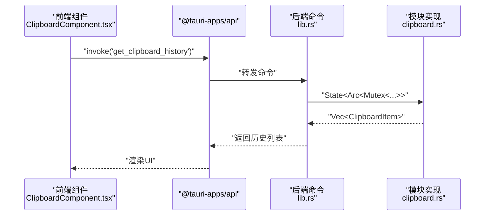
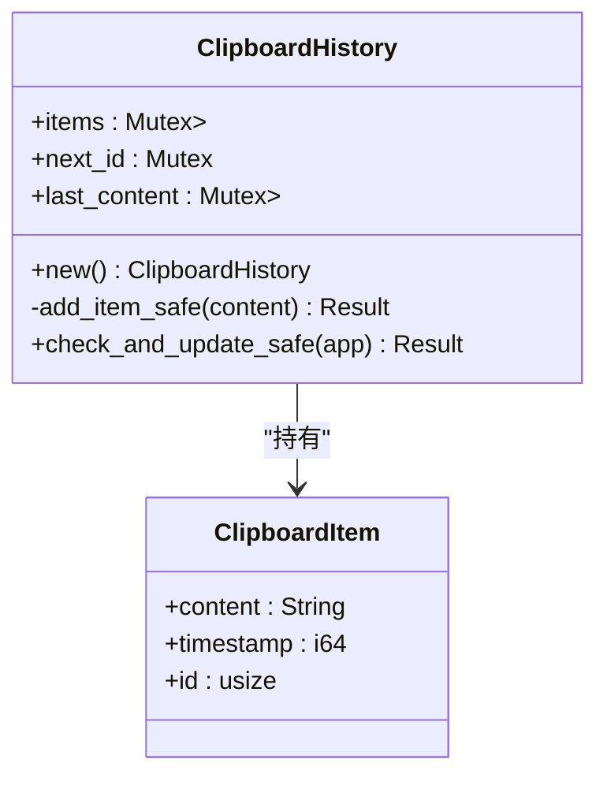
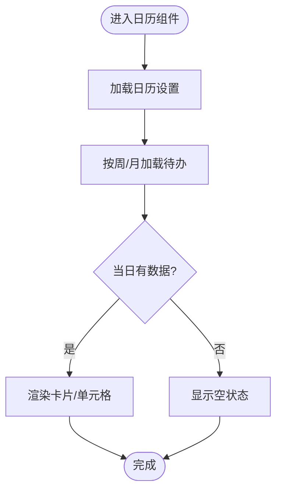
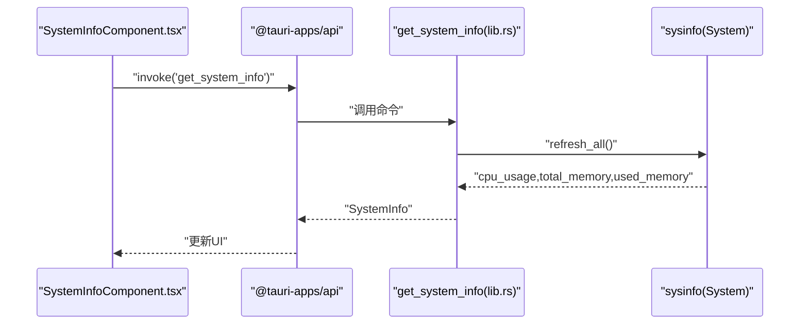
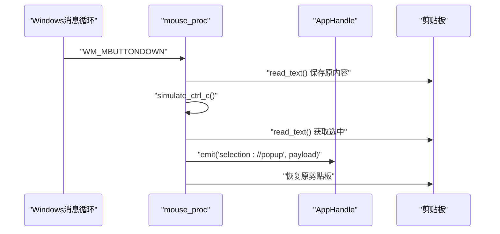
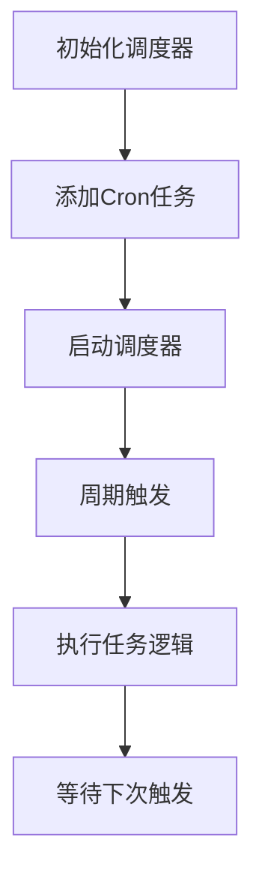
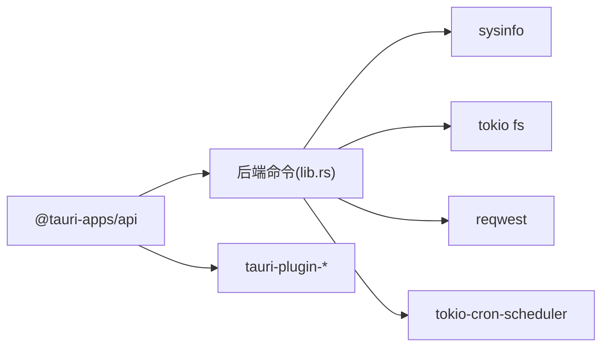

# 内存性能优化

<cite>
**本文引用的文件**
- [src-tauri/src/main.rs](file://src-tauri/src/main.rs)
- [src-tauri/src/lib.rs](file://src-tauri/src/lib.rs)
- [src-tauri/Cargo.toml](file://src-tauri/Cargo.toml)
- [src-tauri/src/clipboard.rs](file://src-tauri/src/clipboard.rs)
- [src-tauri/src/calendar.rs](file://src-tauri/src/calendar.rs)
- [src-tauri/src/global_mouse.rs](file://src-tauri/src/global_mouse.rs)
- [src-tauri/src/task_scheduler.rs](file://src-tauri/src/task_scheduler.rs)
- [src/App.tsx](file://src/App.tsx)
- [src/main.tsx](file://src/main.tsx)
- [src/components/ClipboardComponent.tsx](file://src/components/ClipboardComponent.tsx)
- [src/components/CalendarComponent.tsx](file://src/components/CalendarComponent.tsx)
- [src/components/SystemInfoComponent.tsx](file://src/components/SystemInfoComponent.tsx)
- [package.json](file://package.json)
- [vite.config.ts](file://vite.config.ts)
</cite>

## 目录
1. [简介](#简介)
2. [项目结构](#项目结构)
3. [核心组件](#核心组件)
4. [架构总览](#架构总览)
5. [详细组件分析](#详细组件分析)
6. [依赖关系分析](#依赖关系分析)
7. [性能考量](#性能考量)
8. [故障排查指南](#故障排查指南)
9. [结论](#结论)
10. [附录](#附录)

## 简介
本指南围绕桌面宠物应用的内存性能优化展开，结合项目中剪贴板历史、日历数据、系统监控等模块的实际实现，系统性地总结内存泄漏检测方法、Rust所有权与并发安全实践、Arc<Mutex<T>>使用注意事项、循环引用规避策略、内存碎片化预防与处理、大体量数据存储的内存管理方案、内存使用监控与峰值控制策略，以及面向不同场景的优化建议。文档同时给出与源码对应的图示与来源标注，便于读者对照实现细节进行落地。

## 项目结构
该项目采用Tauri 2 + React前端的双端架构：
- 前端层：React组件通过@tauri-apps/api调用后端命令，负责UI渲染与用户交互。
- 后端层：Rust实现的Tauri命令与业务逻辑，负责系统信息采集、剪贴板历史、日历数据持久化、全局鼠标钩子、定时任务等。

**图表来源**
- [src-tauri/src/main.rs:1-11](file://src-tauri/src/main.rs#L1-L11)
- [src-tauri/src/lib.rs:1-120](file://src-tauri/src/lib.rs#L1-L120)
- [src/App.tsx:1-60](file://src/App.tsx#L1-L60)
- [src/main.tsx:1-10](file://src/main.tsx#L1-L10)

**章节来源**
- [src-tauri/src/main.rs:1-11](file://src-tauri/src/main.rs#L1-L11)
- [src-tauri/src/lib.rs:1-120](file://src-tauri/src/lib.rs#L1-L120)
- [src/App.tsx:1-60](file://src/App.tsx#L1-L60)
- [src/main.tsx:1-10](file://src/main.tsx#L1-L10)

## 核心组件
- 系统信息采集与展示：通过后端命令获取CPU/内存使用情况，并在前端以进度条形式展示。
- 剪贴板历史：维护固定长度的最近N条记录，避免无限增长导致内存膨胀。
- 日历与待办：按日期维度持久化待办与事件，支持清理过期数据，防止磁盘与内存占用持续攀升。
- 全局鼠标钩子：在Windows平台注册低级鼠标钩子，捕获中键点击并模拟快捷键，注意线程与生命周期管理。
- 定时任务：基于cron表达式的周期性任务，避免频繁唤醒与资源浪费。

**章节来源**
- [src-tauri/src/lib.rs:41-72](file://src-tauri/src/lib.rs#L41-L72)
- [src-tauri/src/clipboard.rs:14-122](file://src-tauri/src/clipboard.rs#L14-L122)
- [src-tauri/src/calendar.rs:83-362](file://src-tauri/src/calendar.rs#L83-L362)
- [src-tauri/src/global_mouse.rs:111-149](file://src-tauri/src/global_mouse.rs#L111-L149)
- [src-tauri/src/task_scheduler.rs:9-93](file://src-tauri/src/task_scheduler.rs#L9-L93)

## 架构总览
后端命令通过Tauri桥接到前端组件，前端组件通过invoke触发命令，命令内部可能涉及文件IO、网络请求、系统信息采集、全局钩子等操作。为保证内存安全与性能，需在命令与模块间建立清晰的数据边界与生命周期管理。

**图表来源**
- [src/components/ClipboardComponent.tsx:23-32](file://src/components/ClipboardComponent.tsx#L23-L32)
- [src-tauri/src/lib.rs:124-134](file://src-tauri/src/lib.rs#L124-L134)
- [src-tauri/src/clipboard.rs:124-134](file://src-tauri/src/clipboard.rs#L124-L134)

## 详细组件分析

### 剪贴板历史模块（内存热点与优化点）
- 数据结构：使用Mutex保护的VecDeque作为历史容器，配合next_id与last_content的互斥访问，限制最大容量为常量上限，避免无限增长。
- 并发安全：对items、next_id、last_content分别加锁，避免竞态；在更新前检查last_content，减少重复写入。
- 输入校验：对内容长度进行阈值限制，防止异常大文本导致内存峰值。
- 生命周期：通过命令接口暴露add/clear/get，前端定期轮询获取最新历史，避免长驻监听造成内存累积。

**图表来源**
- [src-tauri/src/clipboard.rs:7-18](file://src-tauri/src/clipboard.rs#L7-L18)
- [src-tauri/src/clipboard.rs:20-82](file://src-tauri/src/clipboard.rs#L20-L82)

**章节来源**
- [src-tauri/src/clipboard.rs:14-122](file://src-tauri/src/clipboard.rs#L14-L122)
- [src-tauri/src/clipboard.rs:124-224](file://src-tauri/src/clipboard.rs#L124-L224)

### 日历与待办模块（大体量数据存储与清理）
- 数据模型：按日期组织待办与事件，使用HashMap存储，前端仅加载当月/当周片段，降低一次性加载压力。
- 持久化策略：todos.json与events.json分文件存储，支持按日期段落读取与写入；提供清理过期数据的后台任务。
- 图片资源：背景图片统一存放于应用数据目录，支持上传/删除，避免重复加载与缓存堆积。
- 前端渲染：卡片模式下按周渲染，仅加载必要数据，减少DOM与状态树规模。

**图表来源**
- [src/components/CalendarComponent.tsx:83-122](file://src/components/CalendarComponent.tsx#L83-L122)
- [src-tauri/src/calendar.rs:87-141](file://src-tauri/src/calendar.rs#L87-L141)

**章节来源**
- [src-tauri/src/calendar.rs:83-362](file://src-tauri/src/calendar.rs#L83-L362)
- [src/components/CalendarComponent.tsx:18-241](file://src/components/CalendarComponent.tsx#L18-L241)

### 系统信息与内存监控（前端展示与后端采集）
- 后端命令：通过sysinfo刷新系统状态，计算CPU与内存使用率，返回给前端。
- 前端组件：以进度条与数值展示内存使用与可用内存，超过阈值时改变颜色提示。

**图表来源**
- [src-tauri/src/lib.rs:41-72](file://src-tauri/src/lib.rs#L41-L72)
- [src/components/SystemInfoComponent.tsx:59-124](file://src/components/SystemInfoComponent.tsx#L59-L124)

**章节来源**
- [src-tauri/src/lib.rs:41-72](file://src-tauri/src/lib.rs#L41-L72)
- [src/components/SystemInfoComponent.tsx:59-124](file://src/components/SystemInfoComponent.tsx#L59-L124)

### 全局鼠标钩子（Windows平台）
- 钩子注册：在独立线程中设置WH_MOUSE_LL钩子，维持消息泵以确保钩子生效。
- 事件处理：中键点击时保存当前剪贴板、模拟Ctrl+C、读取选中文本、恢复剪贴板并发射事件。
- 注意事项：使用OnceLock存储AppHandle，避免重复初始化；线程退出时及时卸载钩子，防止句柄泄露。

**图表来源**
- [src-tauri/src/global_mouse.rs:30-69](file://src-tauri/src/global_mouse.rs#L30-L69)
- [src-tauri/src/global_mouse.rs:111-149](file://src-tauri/src/global_mouse.rs#L111-L149)

**章节来源**
- [src-tauri/src/global_mouse.rs:111-149](file://src-tauri/src/global_mouse.rs#L111-L149)

### 定时任务调度（周期性与资源控制）
- 调度器：基于tokio-cron-scheduler的JobScheduler，支持Cron表达式与异步任务。
- 任务示例：每周一至周五17:00附近执行AI工作日志处理，避免高负载时段。
- 生命周期：通过AppHandle.manage将调度器纳入应用状态，便于统一管理与释放。

**图表来源**
- [src-tauri/src/task_scheduler.rs:14-78](file://src-tauri/src/task_scheduler.rs#L14-L78)

**章节来源**
- [src-tauri/src/task_scheduler.rs:9-93](file://src-tauri/src/task_scheduler.rs#L9-L93)

## 依赖关系分析
- Rust后端依赖：sysinfo用于系统信息采集；reqwest用于HTTP请求；serde/serde_json用于序列化；tokio与tokio-cron-scheduler用于异步与定时；tauri-plugin-*用于系统能力扩展。
- 前端依赖：@tauri-apps/api用于命令调用；@tauri-apps/plugin-*用于文件系统、对话框、外部打开等插件；React用于UI。

**图表来源**
- [src-tauri/Cargo.toml:15-36](file://src-tauri/Cargo.toml#L15-L36)
- [package.json:12-28](file://package.json#L12-L28)

**章节来源**
- [src-tauri/Cargo.toml:15-36](file://src-tauri/Cargo.toml#L15-L36)
- [package.json:12-28](file://package.json#L12-L28)

## 性能考量
- 内存泄漏检测与Rust所有权最佳实践
  - 使用Arc<Mutex<T>>共享状态时，确保锁粒度最小化，避免长时间持锁；在更新前尽量做去重与短路判断，减少不必要的写入与拷贝。
  - 对于跨线程共享的AppHandle等对象，使用OnceLock或类似机制确保单实例初始化，避免重复注册钩子或调度器。
  - 对外暴露的命令应严格校验输入参数长度与格式，防止异常输入导致内存峰值。
- Arc<Mutex<T>>使用注意事项
  - 锁范围明确：在需要访问共享状态时才加锁，尽快释放，避免阻塞其他任务。
  - 避免死锁：若存在多把锁，统一加锁顺序；在命令中避免嵌套调用可能再次加锁的逻辑。
  - 与异步协作：Tokio任务中避免长时间持有Mutex，必要时拆分为更小的任务块。
- 循环引用避免策略
  - 前端组件间通信使用事件与invoke，不直接持有对方引用；后端模块间通过命令解耦，避免相互持有Arc。
  - 资源释放：全局钩子线程退出时务必卸载钩子；定时任务在应用关闭时停止调度器。
- 内存碎片化预防与处理
  - 数据结构选择：固定容量的VecDeque用于剪贴板历史，避免动态扩容带来的碎片；日历按需加载，避免一次性加载全量数据。
  - 分配策略：前端对超长文本进行截断与估算（如Blob大小），避免渲染层产生过多中间字符串。
  - 垃圾回收优化：合理使用React的key与状态更新策略，避免不必要的重渲染；后端命令返回轻量结构体，减少序列化与传输成本。
- 大体量数据存储的内存管理
  - 剪贴板历史：固定上限（如5条），超出即淘汰尾部，避免无限增长。
  - 日历数据：按日期分文件存储，前端仅加载必要日期段；提供清理过期数据的后台任务。
  - 图片资源：统一管理与缓存策略，避免重复加载；提供删除接口清理不再使用的资源。
- 内存使用监控与峰值控制
  - 后端命令返回系统内存指标，前端以可视化方式呈现；当内存使用率过高时，提示用户或触发降载策略（如暂停非关键任务）。
  - 前端轮询频率适中（如2秒），避免频繁invoke造成主线程压力。
- 应用场景优化建议
  - 高频交互：剪贴板与系统监控组件，保持短周期轮询与最小化锁持有时间。
  - 大数据加载：日历组件按周/月分片加载，避免一次性渲染全量数据。
  - 资源密集型：全局钩子与定时任务在后台运行，避免与前台渲染竞争CPU与内存。

[本节为通用性能指导，无需特定文件来源]

## 故障排查指南
- 剪贴板历史异常
  - 症状：历史数量异常增长或内存占用飙升。
  - 排查：确认add_item_safe中的容量控制逻辑是否被绕过；检查前端轮询频率与命令返回数据量。
  - 参考实现路径：[src-tauri/src/clipboard.rs:29-82](file://src-tauri/src/clipboard.rs#L29-L82)，[src-tauri/src/clipboard.rs:124-134](file://src-tauri/src/clipboard.rs#L124-L134)
- 日历数据加载缓慢
  - 症状：切换月份/周时卡顿。
  - 排查：确认前端是否按周/月分片加载；检查后端按日期读取逻辑与文件IO是否阻塞。
  - 参考实现路径：[src-tauri/src/calendar.rs:98-141](file://src-tauri/src/calendar.rs#L98-L141)，[src/components/CalendarComponent.tsx:83-122](file://src/components/CalendarComponent.tsx#L83-L122)
- 全局鼠标钩子失效
  - 症状：中键点击无响应或内存泄漏。
  - 排查：确认钩子线程是否存活与消息泵是否正常；检查OnceLock初始化与UnhookWindowsHookEx调用时机。
  - 参考实现路径：[src-tauri/src/global_mouse.rs:111-149](file://src-tauri/src/global_mouse.rs#L111-L149)
- 定时任务未执行
  - 症状：计划任务未按时触发。
  - 排查：确认Cron表达式与调度器启动流程；检查应用生命周期中调度器的管理与释放。
  - 参考实现路径：[src-tauri/src/task_scheduler.rs:21-61](file://src-tauri/src/task_scheduler.rs#L21-L61)，[src-tauri/src/task_scheduler.rs:82-93](file://src-tauri/src/task_scheduler.rs#L82-L93)
- 内存使用过高
  - 症状：系统监控显示内存使用率持续升高。
  - 排查：检查前端轮询频率与渲染开销；核对后端命令返回的数据结构是否过大；确认是否有未释放的资源（钩子、任务、窗口）。
  - 参考实现路径：[src-tauri/src/lib.rs:41-72](file://src-tauri/src/lib.rs#L41-L72)，[src/components/SystemInfoComponent.tsx:59-124](file://src/components/SystemInfoComponent.tsx#L59-L124)

**章节来源**
- [src-tauri/src/clipboard.rs:29-82](file://src-tauri/src/clipboard.rs#L29-L82)
- [src-tauri/src/clipboard.rs:124-134](file://src-tauri/src/clipboard.rs#L124-L134)
- [src-tauri/src/calendar.rs:98-141](file://src-tauri/src/calendar.rs#L98-L141)
- [src/components/CalendarComponent.tsx:83-122](file://src/components/CalendarComponent.tsx#L83-L122)
- [src-tauri/src/global_mouse.rs:111-149](file://src-tauri/src/global_mouse.rs#L111-L149)
- [src-tauri/src/task_scheduler.rs:21-61](file://src-tauri/src/task_scheduler.rs#L21-L61)
- [src-tauri/src/task_scheduler.rs:82-93](file://src-tauri/src/task_scheduler.rs#L82-L93)
- [src-tauri/src/lib.rs:41-72](file://src-tauri/src/lib.rs#L41-L72)
- [src/components/SystemInfoComponent.tsx:59-124](file://src/components/SystemInfoComponent.tsx#L59-L124)

## 结论
本项目在内存性能方面采取了多项务实措施：固定容量的历史队列、按需加载的日历数据、严格的输入校验、合理的前端轮询与渲染策略，以及对全局钩子与定时任务的生命周期管理。遵循Rust所有权与并发安全原则，结合Arc<Mutex<T>>的正确使用与循环引用规避策略，能够有效降低内存泄漏风险。对于大体量数据，建议继续强化分片加载与定期清理策略，并在前端引入更精细的内存监控与告警机制，以实现更稳健的长期运行表现。

[本节为总结，无需特定文件来源]

## 附录
- 开发与构建配置参考
  - Vite开发服务器端口与热更新配置，避免与Tauri后端冲突。
  - 前端脚本与依赖，确保命令调用与插件使用的一致性。
- 建议的监控与调试工具
  - Rust侧：使用系统信息命令与日志输出观察内存变化趋势。
  - 前端侧：利用浏览器开发者工具的性能面板与内存快照，定位长驻对象与泄漏点。

**章节来源**
- [vite.config.ts:16-31](file://vite.config.ts#L16-L31)
- [package.json:6-28](file://package.json#L6-L28)