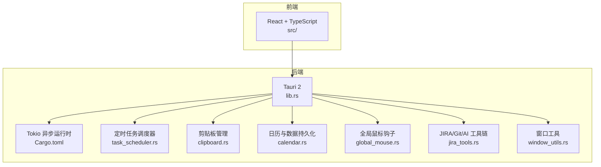
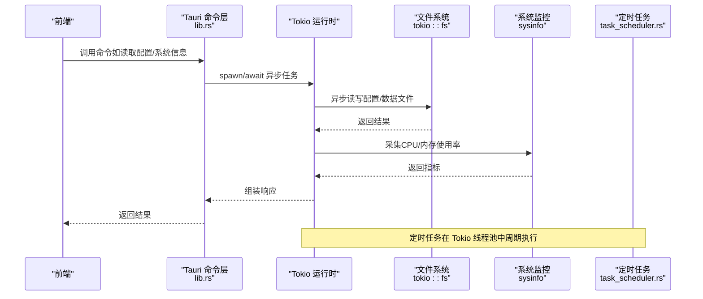
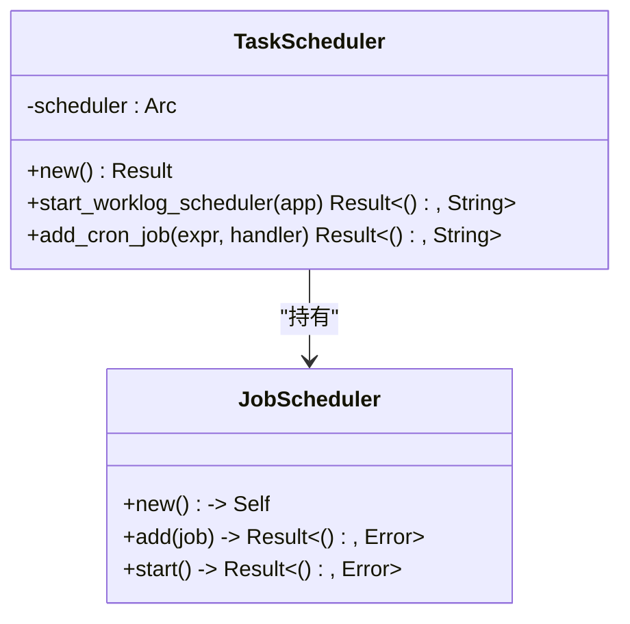
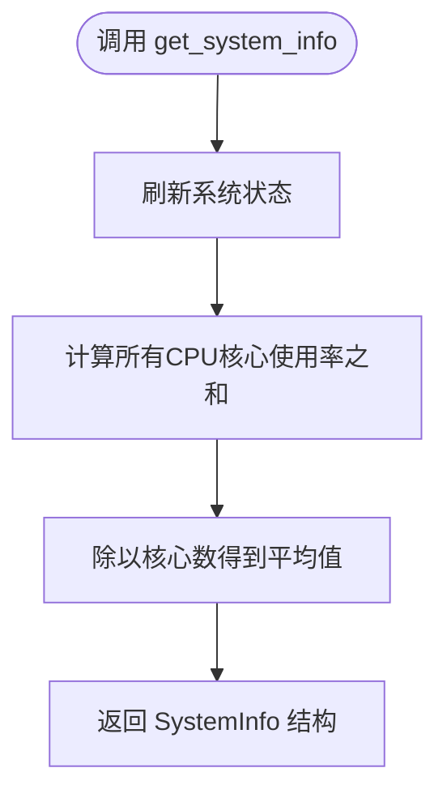
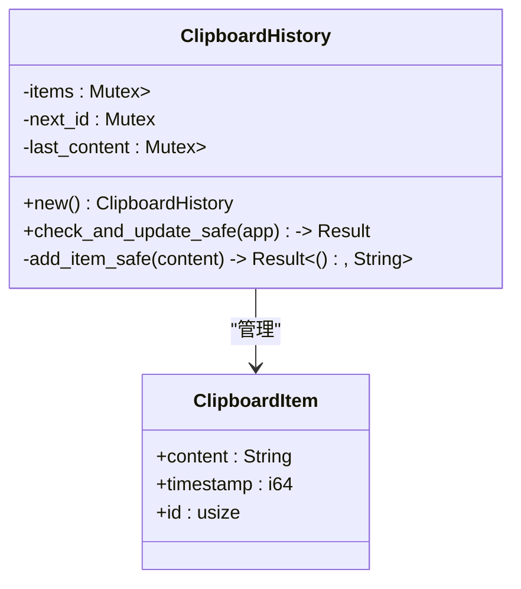
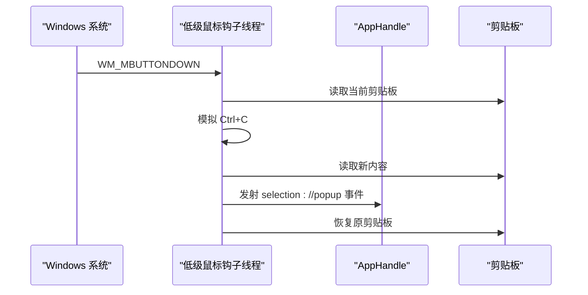
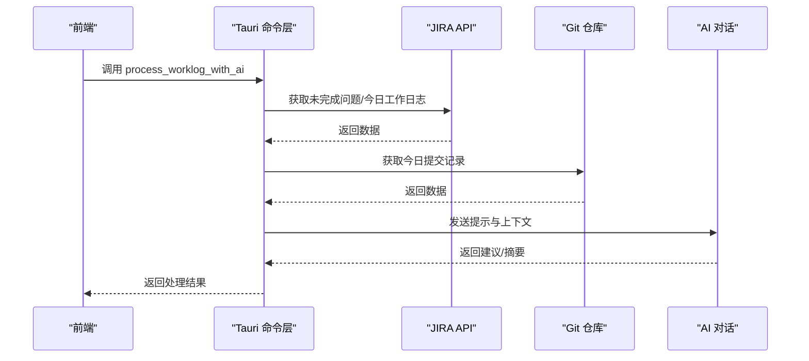
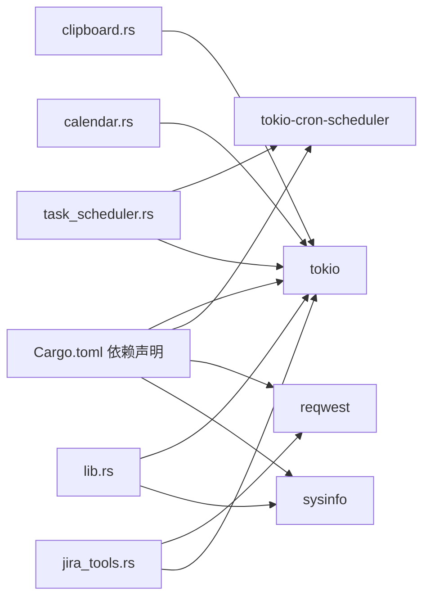

# 多线程性能优化

<cite>
**本文档引用的文件**
- [Cargo.toml](file://src-tauri/Cargo.toml)
- [lib.rs](file://src-tauri/src/lib.rs)
- [task_scheduler.rs](file://src-tauri/src/task_scheduler.rs)
- [clipboard.rs](file://src-tauri/src/clipboard.rs)
- [calendar.rs](file://src-tauri/src/calendar.rs)
- [window_utils.rs](file://src-tauri/src/window_utils.rs)
- [global_mouse.rs](file://src-tauri/src/global_mouse.rs)
- [jira_tools.rs](file://src-tauri/src/jira_tools.rs)
- [main.rs](file://src-tauri/src/main.rs)
- [deepseek.json](file://src-tauri/config/deepseek.json)
- [bubbles.json](file://public/config/bubbles.json)
- [README.md](file://README.md)
</cite>

## 目录
1. [简介](#简介)
2. [项目结构](#项目结构)
3. [核心组件](#核心组件)
4. [架构概览](#架构概览)
5. [详细组件分析](#详细组件分析)
6. [依赖关系分析](#依赖关系分析)
7. [性能考量](#性能考量)
8. [故障排除指南](#故障排除指南)
9. [结论](#结论)

## 简介
本指南围绕 Tokio 异步运行时在桌面应用中的多线程性能优化展开，结合项目中现有的异步 I/O、定时任务、系统监控与后台任务实现，系统性阐述任务调度策略、线程池配置、并发控制、监控与调优方法。文档同时提供 Rust 并发编程最佳实践，涵盖共享状态管理、死锁规避、资源竞争处理，并给出针对不同工作负载的线程配置建议。

## 项目结构
该项目采用前后端分离架构：前端使用 React + TypeScript，后端使用 Rust + Tauri，核心业务逻辑集中在 src-tauri 下。Tokio 在后端承担异步 I/O、定时任务与后台处理职责；系统监控通过 sysinfo 实现；定时任务由 tokio-cron-scheduler 提供。

**图表来源**
- [lib.rs:1-1120](file://src-tauri/src/lib.rs#L1-L1120)
- [task_scheduler.rs:1-93](file://src-tauri/src/task_scheduler.rs#L1-93)
- [clipboard.rs:1-251](file://src-tauri/src/clipboard.rs#L1-251)
- [calendar.rs:1-363](file://src-tauri/src/calendar.rs#L1-363)
- [global_mouse.rs:1-149](file://src-tauri/src/global_mouse.rs#L1-149)
- [jira_tools.rs:1-1029](file://src-tauri/src/jira_tools.rs#L1-1029)
- [window_utils.rs:1-33](file://src-tauri/src/window_utils.rs#L1-33)

**章节来源**
- [main.rs:1-11](file://src-tauri/src/main.rs#L1-11)
- [lib.rs:1-1120](file://src-tauri/src/lib.rs#L1-L1120)
- [README.md:129-168](file://README.md#L129-L168)

## 核心组件
- 异步 I/O 与文件系统：大量使用 tokio::fs 进行配置文件与数据的读写，避免阻塞主线程。
- 定时任务：基于 tokio-cron-scheduler 的 Cron 表达式驱动，实现后台任务调度。
- 系统监控：通过 sysinfo 实时采集 CPU/内存使用率，用于系统信息面板。
- 全局鼠标钩子：在 Windows 上使用低级鼠标钩子线程捕获中键点击事件，避免阻塞 UI。
- 剪贴板管理：使用互斥锁保护剪贴板历史队列，防止并发写入冲突。
- JIRA/Git/AI 集成：异步 HTTP 请求与 Git 仓库操作，配合 AI 对话生成工作日志建议。

**章节来源**
- [Cargo.toml:15-44](file://src-tauri/Cargo.toml#L15-L44)
- [lib.rs:41-72](file://src-tauri/src/lib.rs#L41-L72)
- [task_scheduler.rs:21-61](file://src-tauri/src/task_scheduler.rs#L21-L61)
- [clipboard.rs:14-122](file://src-tauri/src/clipboard.rs#L14-L122)
- [global_mouse.rs:111-149](file://src-tauri/src/global_mouse.rs#L111-L149)
- [jira_tools.rs:188-243](file://src-tauri/src/jira_tools.rs#L188-L243)

## 架构概览
Tokio 在本项目中的角色是“异步运行时 + 定时任务引擎 + 文件系统 I/O”。系统通过 Tauri 暴露命令接口给前端，后端在 Tokio 线程池上并发执行 I/O 与任务调度，避免阻塞 UI 线程。全局鼠标钩子在独立线程中运行，确保输入事件的实时性。

**图表来源**
- [lib.rs:303-386](file://src-tauri/src/lib.rs#L303-L386)
- [task_scheduler.rs:82-93](file://src-tauri/src/task_scheduler.rs#L82-L93)
- [clipboard.rs:85-121](file://src-tauri/src/clipboard.rs#L85-L121)

## 详细组件分析

### 组件A：定时任务调度器（Tokio + Cron）
该组件使用 tokio-cron-scheduler 在固定时间点触发后台任务，如工作日志 AI 处理。其设计要点包括：
- 使用 Arc 包裹 JobScheduler，便于跨任务传递。
- Cron 表达式支持秒级粒度，适合高频检查场景。
- 任务内部通过 await 调用异步函数，避免阻塞调度器线程。

**图表来源**
- [task_scheduler.rs:9-79](file://src-tauri/src/task_scheduler.rs#L9-L79)

**章节来源**
- [task_scheduler.rs:21-61](file://src-tauri/src/task_scheduler.rs#L21-L61)
- [task_scheduler.rs:82-93](file://src-tauri/src/task_scheduler.rs#L82-L93)

### 组件B：系统监控与性能指标
系统信息命令通过 sysinfo 采集 CPU 与内存使用率，平均 CPU 使用率来自所有核心的累加与均值计算。该实现简洁高效，适合在 UI 主循环中定期调用。

**图表来源**
- [lib.rs:61-72](file://src-tauri/src/lib.rs#L61-L72)

**章节来源**
- [lib.rs:41-72](file://src-tauri/src/lib.rs#L41-L72)

### 组件C：剪贴板历史管理（并发安全）
剪贴板历史使用 Mutex 保护三个共享字段：历史队列、下一个 ID、上次内容。check_and_update_safe 方法在获取锁后进行内容去重与长度控制，避免重复与溢出。

**图表来源**
- [clipboard.rs:14-122](file://src-tauri/src/clipboard.rs#L14-L122)

**章节来源**
- [clipboard.rs:29-122](file://src-tauri/src/clipboard.rs#L29-L122)

### 组件D：全局鼠标钩子（独立线程）
在 Windows 上，使用低级鼠标钩子在独立线程中监听中键点击事件，模拟 Ctrl+C 获取选中文本，然后恢复剪贴板并发射事件。该实现避免阻塞 UI 线程，但需注意线程生命周期与资源释放。

**图表来源**
- [global_mouse.rs:39-69](file://src-tauri/src/global_mouse.rs#L39-L69)
- [global_mouse.rs:118-149](file://src-tauri/src/global_mouse.rs#L118-L149)

**章节来源**
- [global_mouse.rs:111-149](file://src-tauri/src/global_mouse.rs#L111-L149)

### 组件E：JIRA/Git/AI 工具链（异步 I/O + 外部服务）
该模块整合 JIRA 查询、Git 提交检索与 AI 对话，所有外部调用均为异步，避免阻塞。工作日志 AI 处理流程通过提示工程与外部 API 协同完成。

**图表来源**
- [jira_tools.rs:808-955](file://src-tauri/src/jira_tools.rs#L808-L955)

**章节来源**
- [jira_tools.rs:188-243](file://src-tauri/src/jira_tools.rs#L188-L243)
- [jira_tools.rs:524-654](file://src-tauri/src/jira_tools.rs#L524-L654)
- [jira_tools.rs:808-955](file://src-tauri/src/jira_tools.rs#L808-L955)

## 依赖关系分析
Tokio 作为核心运行时，被多个模块依赖：定时任务、文件系统、网络请求、系统监控等。依赖关系清晰，模块间通过命令接口解耦。

**图表来源**
- [Cargo.toml:15-44](file://src-tauri/Cargo.toml#L15-L44)
- [lib.rs:1-1120](file://src-tauri/src/lib.rs#L1-L1120)
- [task_scheduler.rs:1-93](file://src-tauri/src/task_scheduler.rs#L1-93)
- [clipboard.rs:1-251](file://src-tauri/src/clipboard.rs#L1-251)
- [calendar.rs:1-363](file://src-tauri/src/calendar.rs#L1-363)
- [jira_tools.rs:1-1029](file://src-tauri/src/jira_tools.rs#L1-1029)

**章节来源**
- [Cargo.toml:15-44](file://src-tauri/Cargo.toml#L15-L44)

## 性能考量

### 任务调度策略
- 使用 tokio::spawn 启动短任务，避免长时间阻塞线程池。
- 对于高频检查型任务（如剪贴板轮询），建议采用背压或去抖策略，减少不必要的重复检查。
- 定时任务尽量使用 Cron 表达式集中调度，避免在任务内部再次创建定时器。

### 线程池配置
- 项目使用 tokio 的多线程运行时（features = ["rt-multi-thread"]）。默认线程数通常等于 CPU 核心数，可根据 I/O 密集程度适度调整。
- 对于 I/O 密集型任务（文件读写、网络请求），线程数可略高于核心数以提升吞吐；对于 CPU 密集型任务，应谨慎增加线程数，避免上下文切换开销。

### 并发控制与资源共享
- 共享状态使用 Mutex 保护，避免竞态条件。建议：
  - 将锁粒度最小化，仅保护必要字段；
  - 避免在锁内执行耗时操作（如网络请求、磁盘 I/O）；
  - 使用 Arc + Mutex 实现跨任务共享，避免拷贝大对象。
- 死锁规避：
  - 统一加锁顺序，避免循环等待；
  - 使用超时或取消机制，防止无限等待。

### I/O 优化
- 文件 I/O 使用 tokio::fs 异步接口，减少阻塞。建议：
  - 合并频繁的小写入为批量写入；
  - 对热点文件使用内存缓存，降低磁盘压力；
  - 对大文件读写使用流式处理，避免一次性加载到内存。

### 定时任务与后台任务
- Cron 表达式应避免过于频繁的任务（如秒级），以免占用过多 CPU。
- 将耗时任务拆分为多个子任务，使用任务队列或信号量限制并发度。
- 对外部服务调用增加超时与重试策略，避免任务堆积。

### 监控与分析
- 使用 sysinfo 实时采集 CPU/内存指标，结合日志输出评估负载变化。
- 对关键异步任务记录耗时与错误统计，便于定位性能瓶颈。
- 在 Windows 上，全局鼠标钩子线程需确保消息泵正常运行，避免系统拒绝输入事件。

## 故障排除指南

### 常见问题与对策
- 剪贴板内容异常或过长：在添加与读取时进行长度校验与去重，避免重复写入与内存膨胀。
- 定时任务未触发：检查 Cron 表达式与系统时间，确认调度器已启动并处于运行状态。
- 系统监控指标异常：确认 sysinfo 的刷新频率与调用时机，避免在高负载时段频繁刷新。
- 全局鼠标钩子失效：检查线程是否仍在运行，消息泵是否阻塞，以及权限与系统策略影响。

**章节来源**
- [clipboard.rs:85-122](file://src-tauri/src/clipboard.rs#L85-L122)
- [task_scheduler.rs:21-61](file://src-tauri/src/task_scheduler.rs#L21-L61)
- [lib.rs:41-72](file://src-tauri/src/lib.rs#L41-L72)
- [global_mouse.rs:118-149](file://src-tauri/src/global_mouse.rs#L118-L149)

## 结论
本项目在 Tokio 的支撑下，实现了高效的异步 I/O、定时任务与系统监控。通过合理的并发控制、资源保护与任务调度策略，能够在桌面环境中稳定运行多种后台任务。建议在现有基础上进一步完善监控体系、优化锁粒度与 I/O 批量化，并根据实际负载动态调整线程池大小，以获得更佳的性能表现。