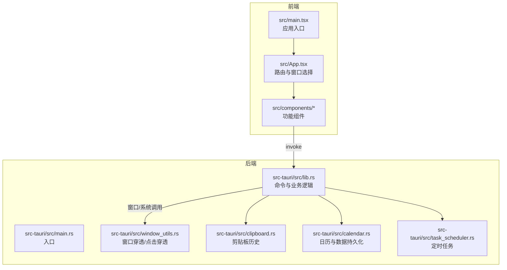
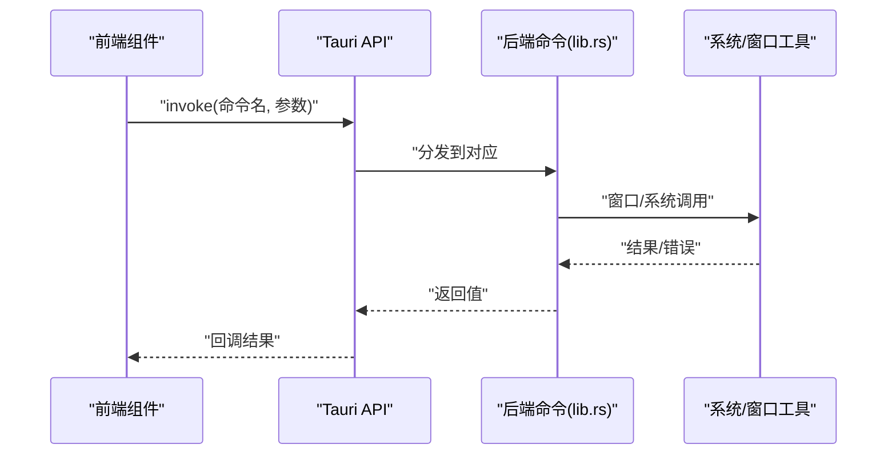
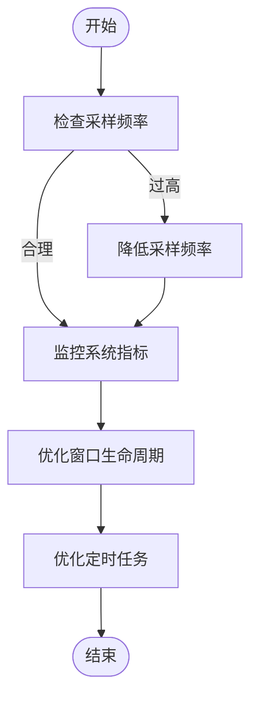
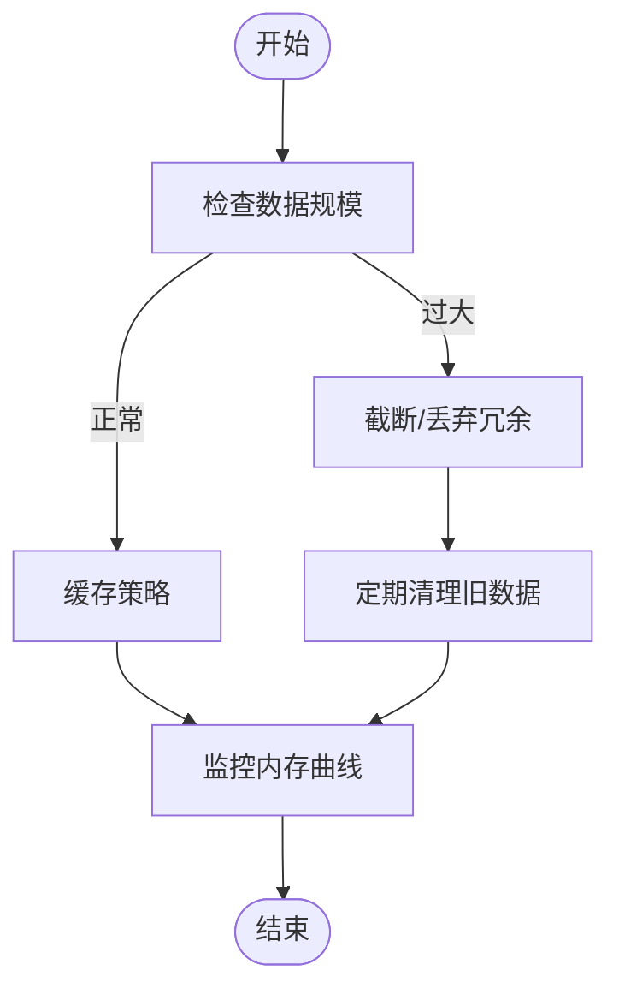
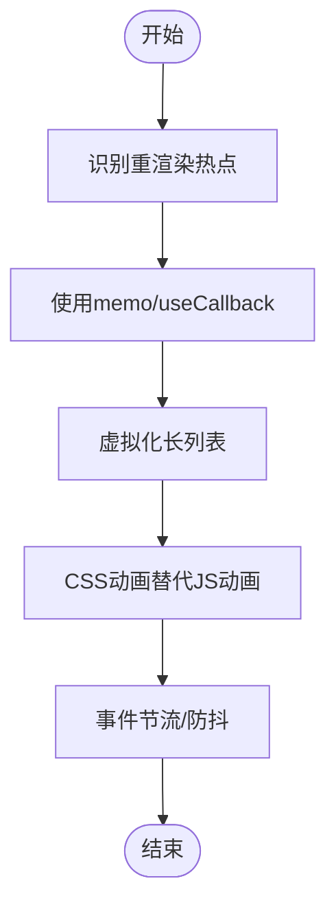
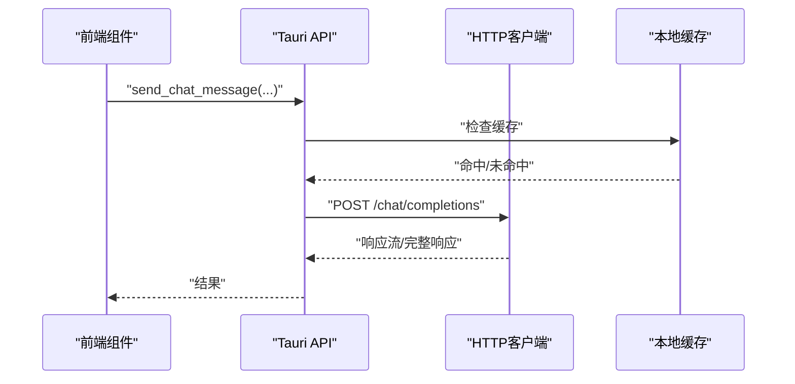
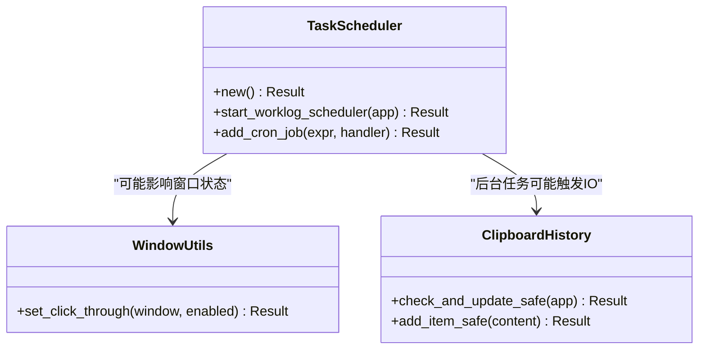
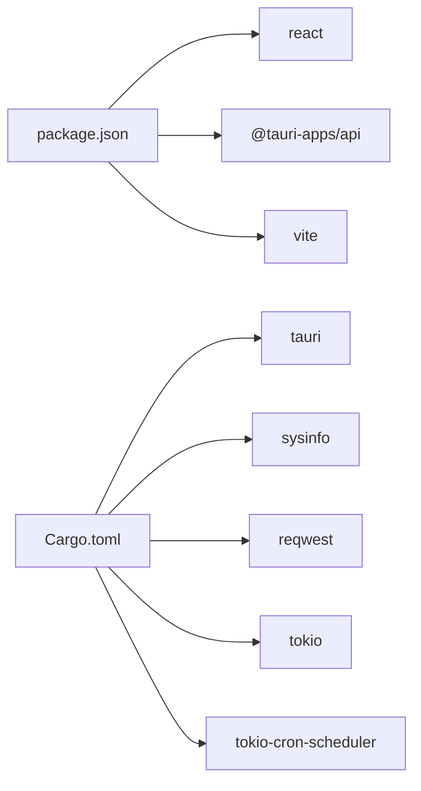

# 性能问题

<cite>
**本文引用的文件**
- [README.md](file://README.md)
- [package.json](file://package.json)
- [vite.config.ts](file://vite.config.ts)
- [tsconfig.json](file://tsconfig.json)
- [src/main.tsx](file://src/main.tsx)
- [src/App.tsx](file://src/App.tsx)
- [src-tauri/Cargo.toml](file://src-tauri/Cargo.toml)
- [src-tauri/src/main.rs](file://src-tauri/src/main.rs)
- [src-tauri/src/lib.rs](file://src-tauri/src/lib.rs)
- [src-tauri/src/window_utils.rs](file://src-tauri/src/window_utils.rs)
- [src-tauri/src/clipboard.rs](file://src-tauri/src/clipboard.rs)
- [src-tauri/src/calendar.rs](file://src-tauri/src/calendar.rs)
- [src-tauri/src/task_scheduler.rs](file://src-tauri/src/task_scheduler.rs)
- [src/components/PetComponent.tsx](file://src/components/PetComponent.tsx)
- [src/components/SystemInfoComponent.tsx](file://src/components/SystemInfoComponent.tsx)
- [src/components/ClipboardComponent.tsx](file://src/components/ClipboardComponent.tsx)
- [src/components/CalendarComponent.tsx](file://src/components/CalendarComponent.tsx)
</cite>

## 目录
1. [简介](#简介)
2. [项目结构](#项目结构)
3. [核心组件](#核心组件)
4. [架构总览](#架构总览)
5. [详细组件分析](#详细组件分析)
6. [依赖关系分析](#依赖关系分析)
7. [性能考量](#性能考量)
8. [故障排查指南](#故障排查指南)
9. [结论](#结论)
10. [附录](#附录)

## 简介
本指南围绕桌面宠物应用在性能方面的问题诊断与优化展开，重点覆盖以下主题：
- CPU占用过高：系统监控组件的性能瓶颈、窗口管理开销、事件循环与定时任务的优化。
- 内存使用异常：内存泄漏检测、内存碎片化与垃圾回收异常的识别与缓解。
- UI渲染性能：组件重渲染优化、动画性能提升、事件处理优化。
- 网络请求性能：API响应时间优化、连接池与缓存策略。
- 多线程与异步：任务调度、并发控制、资源竞争与死锁规避。

## 项目结构
应用采用前后端分离架构：
- 前端：React + TypeScript，通过 Vite 构建，使用 @tauri-apps/api 与后端通信。
- 后端：Rust + Tauri，提供系统级能力、窗口管理、定时任务与业务逻辑。

**图表来源**
- [src/main.tsx:1-10](file://src/main.tsx#L1-L10)
- [src/App.tsx:1-60](file://src/App.tsx#L1-L60)
- [src-tauri/src/main.rs:1-11](file://src-tauri/src/main.rs#L1-L11)
- [src-tauri/src/lib.rs:1-120](file://src-tauri/src/lib.rs#L1-L120)
- [src-tauri/src/window_utils.rs:1-33](file://src-tauri/src/window_utils.rs#L1-L33)
- [src-tauri/src/clipboard.rs:1-60](file://src-tauri/src/clipboard.rs#L1-L60)
- [src-tauri/src/calendar.rs:1-60](file://src-tauri/src/calendar.rs#L1-L60)
- [src-tauri/src/task_scheduler.rs:1-40](file://src-tauri/src/task_scheduler.rs#L1-L40)

**章节来源**
- [README.md:129-168](file://README.md#L129-L168)
- [package.json:1-29](file://package.json#L1-L29)
- [vite.config.ts:1-33](file://vite.config.ts#L1-L33)
- [tsconfig.json:1-26](file://tsconfig.json#L1-L26)

## 核心组件
- 桌宠主界面与菜单：负责窗口交互、点击穿透、休眠唤醒与功能面板打开。
- 系统信息监控：周期性采集系统资源并渲染。
- 剪贴板管理：记录最近若干条剪贴板内容，支持查看与清空。
- 日历组件：带待办事项、背景轮播、卡片模式与窗口尺寸切换。
- 后端命令与窗口工具：提供系统信息、窗口创建/聚焦、点击穿透、定时任务等。

**章节来源**
- [src/components/PetComponent.tsx:1-120](file://src/components/PetComponent.tsx#L1-L120)
- [src/components/SystemInfoComponent.tsx:1-60](file://src/components/SystemInfoComponent.tsx#L1-L60)
- [src/components/ClipboardComponent.tsx:1-60](file://src/components/ClipboardComponent.tsx#L1-L60)
- [src/components/CalendarComponent.tsx:1-80](file://src/components/CalendarComponent.tsx#L1-L80)
- [src-tauri/src/lib.rs:41-120](file://src-tauri/src/lib.rs#L41-L120)
- [src-tauri/src/window_utils.rs:1-33](file://src-tauri/src/window_utils.rs#L1-L33)

## 架构总览
前端通过 Tauri 的 invoke 调用后端命令；后端使用 tokio 异步运行时处理 I/O 与网络请求；窗口管理由 Tauri 提供的 WebviewWindow 管理，支持透明、装饰关闭、点击穿透等特性。

**图表来源**
- [src-tauri/src/lib.rs:262-301](file://src-tauri/src/lib.rs#L262-L301)
- [src-tauri/src/window_utils.rs:9-32](file://src-tauri/src/window_utils.rs#L9-L32)
- [src-tauri/src/clipboard.rs:124-134](file://src-tauri/src/clipboard.rs#L124-L134)

## 详细组件分析

### CPU占用过高排查与优化
- 系统监控组件
  - 现状：组件每帧调用后端命令获取系统信息，存在高频轮询风险。
  - 优化建议：
    - 后端改为固定频率采集（例如每秒一次），前端订阅事件而非轮询。
    - 后端使用 tokio::time::interval 控制采样节奏，避免阻塞。
  - 参考实现位置：
    - [src-tauri/src/lib.rs:41-72](file://src-tauri/src/lib.rs#L41-L72)
    - [src/components/SystemInfoComponent.tsx:16-26](file://src/components/SystemInfoComponent.tsx#L16-L26)

- 窗口管理与点击穿透
  - 现状：窗口创建/聚焦/显示频繁，且存在点击穿透切换逻辑。
  - 优化建议：
    - 复用已存在窗口，避免重复创建销毁。
    - 点击穿透切换仅在必要时触发，减少系统调用次数。
  - 参考实现位置：
    - [src-tauri/src/window_utils.rs:9-32](file://src-tauri/src/window_utils.rs#L9-L32)
    - [src/components/PetComponent.tsx:230-286](file://src/components/PetComponent.tsx#L230-L286)

- 定时任务与并发
  - 现状：定时任务每秒检查一次，可能造成不必要的负载。
  - 优化建议：
    - 使用更精确的 cron 表达式，仅在工作日特定时间点触发。
    - 将耗时任务放入后台任务队列，避免阻塞主线程。
  - 参考实现位置：
    - [src-tauri/src/task_scheduler.rs:21-61](file://src-tauri/src/task_scheduler.rs#L21-L61)

**图表来源**
- [src-tauri/src/lib.rs:41-72](file://src-tauri/src/lib.rs#L41-L72)
- [src-tauri/src/task_scheduler.rs:21-61](file://src-tauri/src/task_scheduler.rs#L21-L61)
- [src-tauri/src/window_utils.rs:9-32](file://src-tauri/src/window_utils.rs#L9-L32)

**章节来源**
- [src-tauri/src/lib.rs:41-72](file://src-tauri/src/lib.rs#L41-L72)
- [src-tauri/src/task_scheduler.rs:1-93](file://src-tauri/src/task_scheduler.rs#L1-L93)
- [src-tauri/src/window_utils.rs:1-33](file://src-tauri/src/window_utils.rs#L1-L33)
- [src/components/SystemInfoComponent.tsx:16-26](file://src/components/SystemInfoComponent.tsx#L16-L26)
- [src/components/PetComponent.tsx:230-286](file://src/components/PetComponent.tsx#L230-L286)

### 内存使用异常诊断与优化
- 剪贴板历史
  - 现状：内存中维护最多5条历史，内容较长时可能造成峰值内存上升。
  - 优化建议：
    - 限制单条内容长度，超过阈值丢弃或提示。
    - 使用弱引用或分页策略，避免长时间持有大对象。
  - 参考实现位置：
    - [src-tauri/src/clipboard.rs:14-82](file://src-tauri/src/clipboard.rs#L14-L82)

- 日历数据与背景图片
  - 现状：背景图片列表可能增长，待办数据按日期聚合。
  - 优化建议：
    - 定期清理旧数据（如超过一定天数），避免无限增长。
    - 图片加载采用懒加载与缓存策略，避免重复解码。
  - 参考实现位置：
    - [src-tauri/src/calendar.rs:324-361](file://src-tauri/src/calendar.rs#L324-L361)
    - [src/components/CalendarComponent.tsx:196-241](file://src/components/CalendarComponent.tsx#L196-L241)

- 前端内存
  - 现状：组件内部状态较多，定时器与事件监听未及时清理可能导致泄漏。
  - 优化建议：
    - 在 useEffect 返回函数中清理定时器与事件监听。
    - 使用 React.memo 或 useMemo/useCallback 降低重渲染。
  - 参考实现位置：
    - [src/components/ClipboardComponent.tsx:17-21](file://src/components/ClipboardComponent.tsx#L17-L21)
    - [src/components/CalendarComponent.tsx:40-47](file://src/components/CalendarComponent.tsx#L40-L47)

**图表来源**
- [src-tauri/src/clipboard.rs:14-82](file://src-tauri/src/clipboard.rs#L14-L82)
- [src-tauri/src/calendar.rs:324-361](file://src-tauri/src/calendar.rs#L324-L361)
- [src/components/ClipboardComponent.tsx:17-21](file://src/components/ClipboardComponent.tsx#L17-L21)
- [src/components/CalendarComponent.tsx:40-47](file://src/components/CalendarComponent.tsx#L40-L47)

**章节来源**
- [src-tauri/src/clipboard.rs:14-82](file://src-tauri/src/clipboard.rs#L14-L82)
- [src-tauri/src/calendar.rs:324-361](file://src-tauri/src/calendar.rs#L324-L361)
- [src/components/ClipboardComponent.tsx:17-21](file://src/components/ClipboardComponent.tsx#L17-L21)
- [src/components/CalendarComponent.tsx:40-47](file://src/components/CalendarComponent.tsx#L40-L47)

### UI渲染性能优化
- 组件重渲染
  - 优化建议：
    - 使用 React.memo 包裹纯展示组件。
    - 使用 useCallback/useMemo 缓存回调与派生数据。
    - 将大型列表虚拟化，仅渲染可见区域。
  - 参考实现位置：
    - [src/components/CalendarComponent.tsx:319-389](file://src/components/CalendarComponent.tsx#L319-L389)

- 动画与事件
  - 优化建议：
    - 使用 CSS 动画替代 JS 动画，减少主线程压力。
    - 避免在 pointer/mouse 事件中做重计算，使用节流/防抖。
  - 参考实现位置：
    - [src/components/PetComponent.tsx:89-139](file://src/components/PetComponent.tsx#L89-L139)

- 窗口尺寸与布局
  - 优化建议：
    - 卡片模式下减少 DOM 层级与重排，使用 transform 代替改变布局属性。
    - 避免在每次渲染中创建新的样式对象。
  - 参考实现位置：
    - [src/components/CalendarComponent.tsx:243-311](file://src/components/CalendarComponent.tsx#L243-L311)

**图表来源**
- [src/components/CalendarComponent.tsx:319-389](file://src/components/CalendarComponent.tsx#L319-L389)
- [src/components/PetComponent.tsx:89-139](file://src/components/PetComponent.tsx#L89-L139)

**章节来源**
- [src/components/CalendarComponent.tsx:319-389](file://src/components/CalendarComponent.tsx#L319-L389)
- [src/components/PetComponent.tsx:89-139](file://src/components/PetComponent.tsx#L89-L139)

### 网络请求性能分析与优化
- AI对话与翻译
  - 现状：使用 reqwest 直接发起 HTTP 请求，未配置连接池与超时。
  - 优化建议：
    - 复用 HTTP 客户端，设置连接池大小与超时。
    - 对频繁请求增加本地缓存（如最近查询结果）。
    - 对流式响应（AI）采用分块处理，避免一次性堆积。
  - 参考实现位置：
    - [src-tauri/src/lib.rs:262-301](file://src-tauri/src/lib.rs#L262-L301)
    - [src-tauri/src/lib.rs:480-552](file://src-tauri/src/lib.rs#L480-L552)

- 配置加载与本地文件
  - 现状：配置读写使用 tokio::fs，未见连接池。
  - 优化建议：
    - 对频繁读写的配置文件采用异步读写队列，合并写入。
    - 对配置文件变更增加去抖，避免频繁 IO。
  - 参考实现位置：
    - [src-tauri/src/lib.rs:317-355](file://src-tauri/src/lib.rs#L317-L355)

**图表来源**
- [src-tauri/src/lib.rs:262-301](file://src-tauri/src/lib.rs#L262-L301)
- [src-tauri/src/lib.rs:317-355](file://src-tauri/src/lib.rs#L317-L355)

**章节来源**
- [src-tauri/src/lib.rs:262-301](file://src-tauri/src/lib.rs#L262-L301)
- [src-tauri/src/lib.rs:317-355](file://src-tauri/src/lib.rs#L317-L355)
- [src-tauri/src/lib.rs:480-552](file://src-tauri/src/lib.rs#L480-L552)

### 多线程与异步处理优化
- 异步运行时
  - 现状：tokio rt-multi-thread 已启用，适合 I/O 密集型。
  - 优化建议：
    - 将 CPU 密集型任务放入线程池，避免阻塞事件循环。
    - 对高频 I/O 操作使用批处理与合并策略。
  - 参考实现位置：
    - [src-tauri/Cargo.toml:21-21](file://src-tauri/Cargo.toml#L21-L21)

- 定时任务
  - 现状：每秒检查一次，可能过于频繁。
  - 优化建议：
    - 使用 cron 表达式精确控制执行时间。
    - 将任务拆分为多个独立作业，避免串行阻塞。
  - 参考实现位置：
    - [src-tauri/src/task_scheduler.rs:21-61](file://src-tauri/src/task_scheduler.rs#L21-L61)

- 并发控制
  - 现状：窗口创建/聚焦存在竞态风险。
  - 优化建议：
    - 使用信号量或队列控制窗口创建并发。
    - 对窗口生命周期增加状态机，避免重复操作。
  - 参考实现位置：
    - [src/components/PetComponent.tsx:230-286](file://src/components/PetComponent.tsx#L230-L286)

**图表来源**
- [src-tauri/src/task_scheduler.rs:1-93](file://src-tauri/src/task_scheduler.rs#L1-L93)
- [src-tauri/src/window_utils.rs:1-33](file://src-tauri/src/window_utils.rs#L1-L33)
- [src-tauri/src/clipboard.rs:84-122](file://src-tauri/src/clipboard.rs#L84-L122)

**章节来源**
- [src-tauri/src/task_scheduler.rs:1-93](file://src-tauri/src/task_scheduler.rs#L1-L93)
- [src-tauri/src/window_utils.rs:1-33](file://src-tauri/src/window_utils.rs#L1-L33)
- [src-tauri/src/clipboard.rs:84-122](file://src-tauri/src/clipboard.rs#L84-L122)
- [src/components/PetComponent.tsx:230-286](file://src/components/PetComponent.tsx#L230-L286)

## 依赖关系分析
- 前端依赖
  - React + TypeScript + Vite，开发服务器固定端口 1420，避免 HMR 冲突。
- 后端依赖
  - Tauri + sysinfo + reqwest + tokio + serde + tokio-cron-scheduler 等。

**图表来源**
- [package.json:12-26](file://package.json#L12-L26)
- [src-tauri/Cargo.toml:15-35](file://src-tauri/Cargo.toml#L15-L35)

**章节来源**
- [package.json:1-29](file://package.json#L1-L29)
- [src-tauri/Cargo.toml:1-44](file://src-tauri/Cargo.toml#L1-L44)

## 性能考量
- 构建与运行
  - 开发环境固定端口与 HMR 配置，避免额外网络开销。
  - 生产构建建议开启压缩与 Tree-shaking。
- 资源加载
  - 图片与静态资源尽量压缩，避免在 UI 中频繁解码。
- 事件与定时
  - 减少高频事件监听，使用节流/防抖；定时任务尽量合并与去抖。

[本节为通用指导，无需具体文件引用]

## 故障排查指南
- CPU占用过高
  - 检查系统监控组件轮询频率，确认后端采样是否合理。
  - 查看窗口创建/聚焦是否频繁，优化复用策略。
  - 定位定时任务执行频率，调整 cron 表达式。
- 内存异常
  - 检查剪贴板历史长度与单条内容大小，设置上限。
  - 清理日历旧数据，避免无限增长。
  - 前端清理定时器与事件监听，避免泄漏。
- UI卡顿
  - 识别重渲染热点，使用 memo/useCallback。
  - 使用 CSS 动画，避免在事件中做重计算。
- 网络慢
  - 配置连接池与超时，增加本地缓存。
  - 对流式响应分块处理，避免一次性堆积。
- 多线程问题
  - 将 CPU 密集型任务放入线程池。
  - 控制窗口创建并发，避免竞态。

**章节来源**
- [src-tauri/src/lib.rs:41-72](file://src-tauri/src/lib.rs#L41-L72)
- [src-tauri/src/task_scheduler.rs:21-61](file://src-tauri/src/task_scheduler.rs#L21-L61)
- [src-tauri/src/clipboard.rs:14-82](file://src-tauri/src/clipboard.rs#L14-L82)
- [src-tauri/src/calendar.rs:324-361](file://src-tauri/src/calendar.rs#L324-L361)
- [src/components/ClipboardComponent.tsx:17-21](file://src/components/ClipboardComponent.tsx#L17-L21)
- [src/components/PetComponent.tsx:230-286](file://src/components/PetComponent.tsx#L230-L286)

## 结论
通过系统化的性能诊断与优化策略，可在不牺牲用户体验的前提下显著降低 CPU 占用、内存使用与 UI 卡顿，并提升网络请求效率与多线程稳定性。建议优先从采样频率、窗口生命周期与定时任务入手，逐步完善缓存与异步处理机制。

[本节为总结，无需具体文件引用]

## 附录
- 开发与构建
  - 开发运行：npm run tauri dev
  - 生产构建：cargo tauri build
- 关键配置
  - Vite 固定端口与 HMR 配置
  - TypeScript 严格模式与 JSX 配置

**章节来源**
- [README.md:249-259](file://README.md#L249-L259)
- [vite.config.ts:16-31](file://vite.config.ts#L16-L31)
- [tsconfig.json:18-22](file://tsconfig.json#L18-L22)