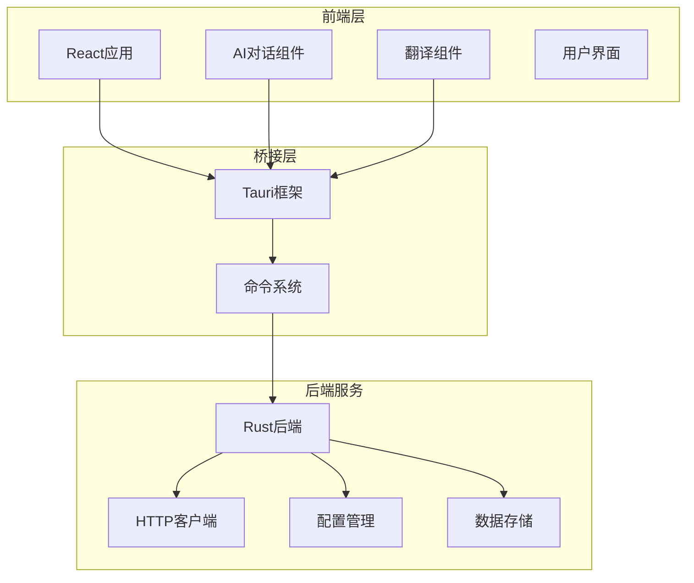
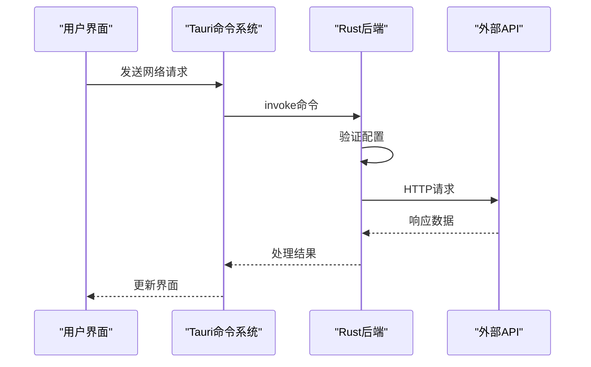
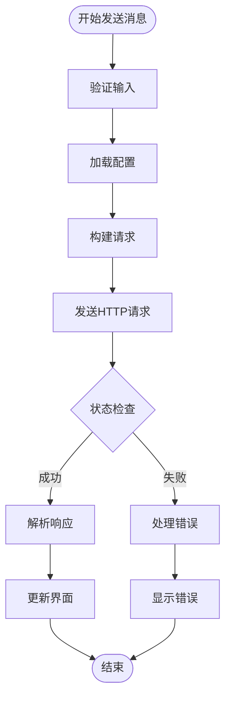
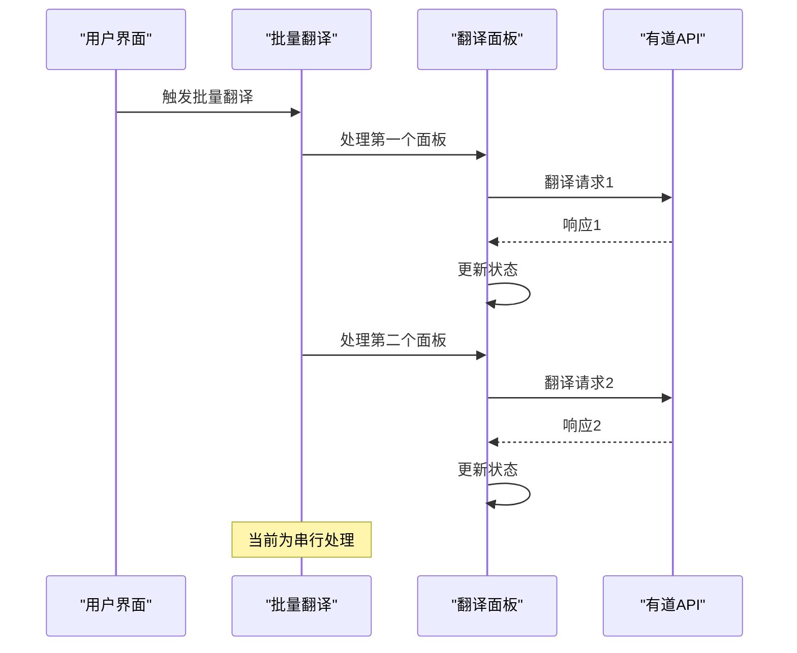
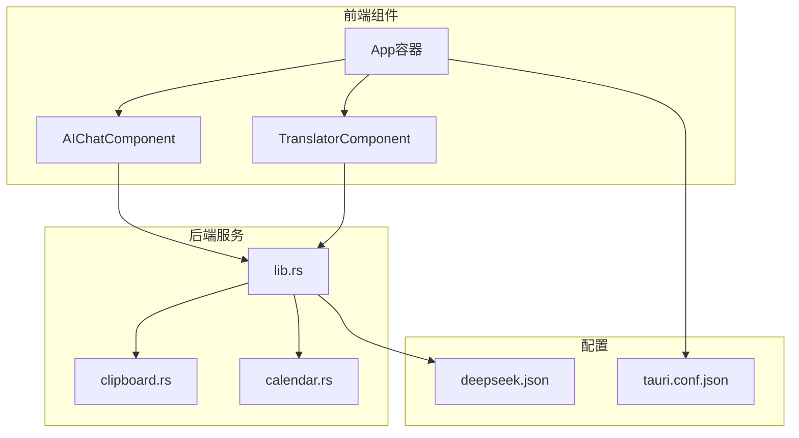
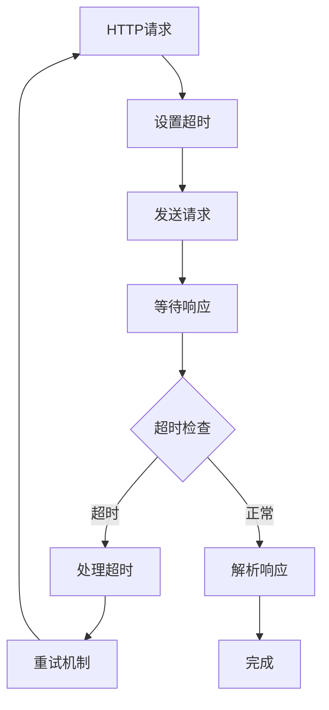
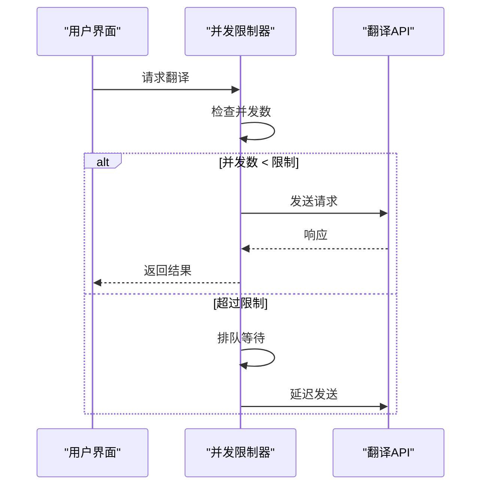
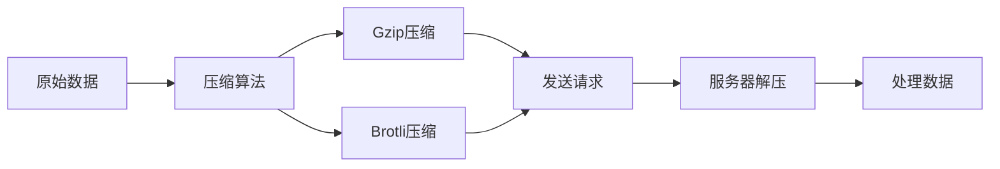

# 网络性能优化

<cite>
**本文档引用的文件**
- [App.tsx](file://src/App.tsx)
- [AIChatComponent.tsx](file://src/components/AIChatComponent.tsx)
- [TranslatorComponent.tsx](file://src/components/TranslatorComponent.tsx)
- [lib.rs](file://src-tauri/src/lib.rs)
- [clipboard.rs](file://src-tauri/src/clipboard.rs)
- [calendar.rs](file://src-tauri/src/calendar.rs)
- [Cargo.toml](file://src-tauri/Cargo.toml)
- [vite.config.ts](file://vite.config.ts)
- [tauri.conf.json](file://src-tauri/tauri.conf.json)
- [deepseek.json](file://src-tauri/config/deepseek.json)
</cite>

## 目录
1. [引言](#引言)
2. [项目结构](#项目结构)
3. [核心组件](#核心组件)
4. [架构概览](#架构概览)
5. [详细组件分析](#详细组件分析)
6. [依赖关系分析](#依赖关系分析)
7. [性能考虑](#性能考虑)
8. [故障排除指南](#故障排除指南)
9. [结论](#结论)

## 引言

本指南专注于桌面应用的网络性能优化，涵盖API请求性能优化、AI对话和翻译功能的网络策略、异步请求处理优化以及网络监控工具使用。通过对代码库的深入分析，我们将提供可操作的优化建议和最佳实践。

## 项目结构

该项目采用React + Tauri架构，前端负责用户界面交互，后端使用Rust提供系统级功能和网络请求处理。



**图表来源**
- [App.tsx:18-58](file://src/App.tsx#L18-L58)
- [lib.rs:948-1119](file://src-tauri/src/lib.rs#L948-L1119)

**章节来源**
- [App.tsx:1-60](file://src/App.tsx#L1-L60)
- [vite.config.ts:1-33](file://vite.config.ts#L1-L33)

## 核心组件

### 网络请求组件

应用包含两个主要的网络功能组件：

1. **AI对话组件** - 集成DeepSeek API进行对话
2. **翻译组件** - 集成有道翻译API进行文本翻译

### 配置管理系统

Rust后端提供完整的配置管理，包括：
- API密钥存储和验证
- 配置文件持久化
- 资源文件配置回退机制

**章节来源**
- [AIChatComponent.tsx:23-38](file://src/components/AIChatComponent.tsx#L23-L38)
- [TranslatorComponent.tsx:49-61](file://src/components/TranslatorComponent.tsx#L49-L61)
- [lib.rs:317-386](file://src-tauri/src/lib.rs#L317-L386)

## 架构概览

应用采用分层架构，前端通过Tauri命令系统调用后端Rust函数，后端使用reqwest库处理HTTP请求。



**图表来源**
- [AIChatComponent.tsx:113-135](file://src/components/AIChatComponent.tsx#L113-L135)
- [lib.rs:262-301](file://src-tauri/src/lib.rs#L262-L301)

## 详细组件分析

### AI对话网络优化

#### 请求处理流程



**图表来源**
- [AIChatComponent.tsx:88-135](file://src/components/AIChatComponent.tsx#L88-L135)
- [lib.rs:262-301](file://src-tauri/src/lib.rs#L262-L301)

#### 配置管理优化

当前配置系统支持本地文件和资源文件两种存储方式：

1. **本地配置优先** - 优先使用用户本地配置
2. **资源文件回退** - 作为默认配置备份
3. **配置验证** - 确保API密钥有效性

**章节来源**
- [lib.rs:357-386](file://src-tauri/src/lib.rs#L357-L386)
- [deepseek.json:1-6](file://src-tauri/config/deepseek.json#L1-L6)

### 翻译功能网络优化

#### 批量翻译处理

翻译组件支持多面板并发处理，但当前实现为串行执行：



**图表来源**
- [TranslatorComponent.tsx:189-195](file://src/components/TranslatorComponent.tsx#L189-L195)
- [lib.rs:478-552](file://src-tauri/src/lib.rs#L478-L552)

#### 签名生成优化

有道翻译API签名生成使用MD5哈希，可进一步优化：

**章节来源**
- [lib.rs:420-425](file://src-tauri/src/lib.rs#L420-L425)
- [TranslatorComponent.tsx:164-187](file://src/components/TranslatorComponent.tsx#L164-L187)

### 网络请求实现分析

#### HTTP客户端配置

后端使用reqwest库进行HTTP请求，支持以下特性：
- JSON序列化/反序列化
- 自定义请求头
- 错误处理和状态码检查

#### 连接管理

当前实现为每次请求创建新的HTTP客户端实例，未使用连接池优化。

**章节来源**
- [lib.rs:269](file://src-tauri/src/lib.rs#L269)
- [lib.rs:514](file://src-tauri/src/lib.rs#L514)

## 依赖关系分析

### 外部依赖

```mermaid
graph LR
subgraph "核心依赖"
React[React 19.1.0]
Tauri[Tauri 2.x]
Reqwest[reqwest 0.12]
end
subgraph "开发依赖"
Vite[Vite 7.x]
TypeScript[TypeScript 5.8.3]
CLI[@tauri/cli 2.x]
end
subgraph "系统依赖"
Tokio[Tokio 1.x]
Serde[Serde 1.x]
Sysinfo[Sysinfo 0.30]
end
```

**图表来源**
- [Cargo.toml:15-35](file://src-tauri/Cargo.toml#L15-L35)
- [package.json:12-27](file://package.json#L12-L27)

### 组件间依赖



**图表来源**
- [App.tsx:18-58](file://src/App.tsx#L18-L58)
- [lib.rs:12-17](file://src-tauri/src/lib.rs#L12-L17)

**章节来源**
- [Cargo.toml:1-44](file://src-tauri/Cargo.toml#L1-L44)
- [package.json:1-29](file://package.json#L1-L29)

## 性能考虑

### 当前实现的性能特征

1. **请求超时** - 缺少显式的超时配置
2. **重试机制** - 未实现自动重试逻辑
3. **连接池** - 未使用连接池复用
4. **并发控制** - 翻译功能缺少并发限制
5. **缓存策略** - 未实现响应缓存

### 优化建议

#### 1. 请求超时设置



#### 2. 连接池管理

建议在Rust后端实现全局HTTP客户端实例：

```rust
// 建议的实现模式
static CLIENT: Lazy<reqwest::Client> = Lazy::new(|| {
    reqwest::Client::builder()
        .timeout(Duration::from_secs(30))
        .pool_max_idle_per_host(10)
        .pool_idle_timeout(Duration::from_secs(30))
        .build()
        .unwrap()
});
```

#### 3. 并发控制优化

对于翻译功能，建议实现并发限制：



#### 4. 缓存策略

建议实现多层缓存：
- **内存缓存** - 短期高频访问数据
- **磁盘缓存** - 长期稳定数据
- **ETag/Last-Modified** - HTTP缓存验证

#### 5. 压缩传输优化



### 网络监控

#### 实现建议

1. **请求计数统计**
2. **响应时间监控**
3. **错误率跟踪**
4. **带宽使用测量**

**章节来源**
- [lib.rs:1046-1110](file://src-tauri/src/lib.rs#L1046-L1110)

## 故障排除指南

### 常见网络问题

#### 1. API密钥配置错误

**症状**：配置检查失败，API调用返回认证错误

**解决方案**：
- 验证配置文件格式
- 检查API密钥有效性
- 确认网络连接状态

#### 2. 请求超时问题

**症状**：网络请求长时间无响应

**诊断步骤**：
1. 检查网络连接稳定性
2. 验证API服务可用性
3. 查看防火墙设置

#### 3. 并发请求冲突

**症状**：多个翻译请求相互影响

**解决方法**：
- 实现请求队列管理
- 添加请求去重机制
- 设置合理的超时时间

### 调试工具使用

#### 1. 浏览器开发者工具
- Network面板监控请求
- Console查看错误信息
- Performance分析性能瓶颈

#### 2. Rust日志系统
- 使用`println!`输出调试信息
- 实现结构化日志记录
- 监控系统资源使用

**章节来源**
- [lib.rs:1084-1108](file://src-tauri/src/lib.rs#L1084-L1108)

## 结论

本项目在网络性能方面具有良好的基础架构，但仍存在以下优化机会：

1. **连接池优化** - 实现HTTP客户端连接池复用
2. **并发控制** - 添加翻译功能的并发限制
3. **缓存策略** - 实现多层缓存机制
4. **监控系统** - 建立完整的网络性能监控
5. **错误处理** - 完善重试机制和错误恢复

通过实施这些优化措施，可以显著提升应用的网络性能和用户体验，特别是在处理大量API请求和复杂网络环境时的表现。