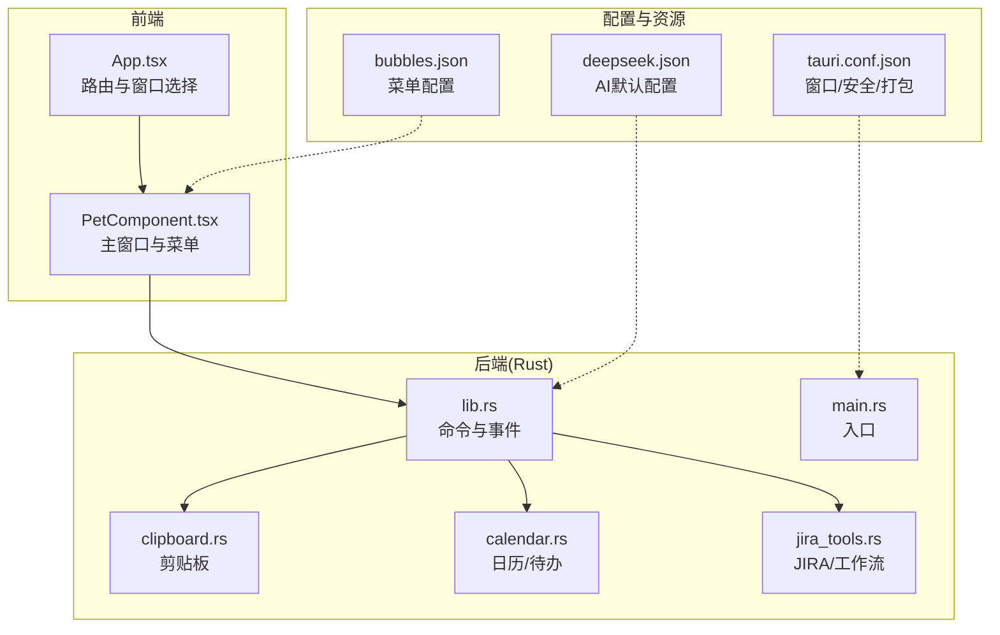
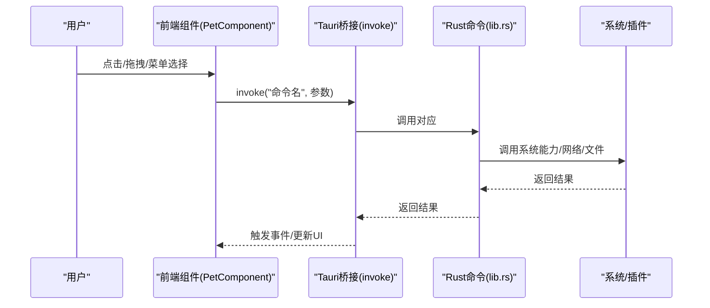
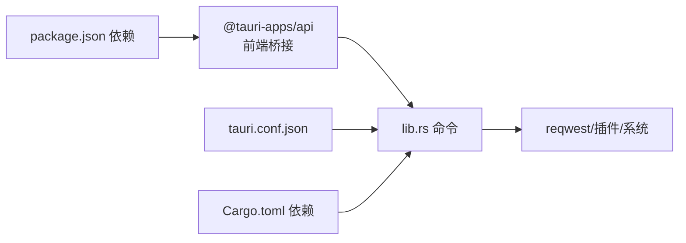

# 故障排除

<cite>
**本文引用的文件**
- [README.md](file://README.md)
- [package.json](file://package.json)
- [Cargo.toml](file://src-tauri/Cargo.toml)
- [tauri.conf.json](file://src-tauri/tauri.conf.json)
- [App.tsx](file://src/App.tsx)
- [PetComponent.tsx](file://src/components/PetComponent.tsx)
- [lib.rs](file://src-tauri/src/lib.rs)
- [main.rs](file://src-tauri/src/main.rs)
- [clipboard.rs](file://src-tauri/src/clipboard.rs)
- [calendar.rs](file://src-tauri/src/calendar.rs)
- [jira_tools.rs](file://src-tauri/src/jira_tools.rs)
- [deepseek.json](file://src-tauri/config/deepseek.json)
- [bubbles.json](file://public/config/bubbles.json)
</cite>

## 目录
1. [简介](#简介)
2. [项目结构](#项目结构)
3. [核心组件](#核心组件)
4. [架构总览](#架构总览)
5. [详细组件故障排除](#详细组件故障排除)
6. [依赖关系分析](#依赖关系分析)
7. [性能考量](#性能考量)
8. [故障排除指南](#故障排除指南)
9. [结论](#结论)
10. [附录](#附录)

## 简介
本指南面向使用者与维护者，提供针对 XSUN 桌宠桌面应用的系统化故障排除方法。内容涵盖安装与运行异常、功能失效、调试工具使用、系统兼容性排查、性能问题诊断、网络相关问题处理、配置问题修复、用户反馈分类与流程，以及预防性维护建议。

## 项目结构
应用采用前端 React + TypeScript + Tauri 2 的混合架构，Rust 提供系统能力与业务逻辑，前端通过 Tauri 的 invoke 与后端命令交互；窗口管理采用多窗口策略，主桌宠窗口常驻，功能窗口按需创建与销毁；配置文件位于资源目录与用户应用数据目录两处，分别用于默认配置与用户本地配置。

**图表来源**
- [App.tsx:17-55](file://src/App.tsx#L17-L55)
- [PetComponent.tsx:1-749](file://src/components/PetComponent.tsx#L1-L749)
- [lib.rs:1-1002](file://src-tauri/src/lib.rs#L1-L1002)
- [clipboard.rs:1-251](file://src-tauri/src/clipboard.rs#L1-L251)
- [calendar.rs:1-363](file://src-tauri/src/calendar.rs#L1-L363)
- [jira_tools.rs:1-1029](file://src-tauri/src/jira_tools.rs#L1-L1029)
- [bubbles.json:1-52](file://public/config/bubbles.json#L1-L52)
- [deepseek.json:1-6](file://src-tauri/config/deepseek.json#L1-L6)
- [tauri.conf.json:1-74](file://src-tauri/tauri.conf.json#L1-L74)

**章节来源**
- [README.md:129-168](file://README.md#L129-L168)
- [tauri.conf.json:13-51](file://src-tauri/tauri.conf.json#L13-L51)

## 核心组件
- 桌宠主界面与菜单：负责窗口交互、菜单渲染、窗口创建与事件监听。
- 系统信息与剪贴板：系统资源监控、剪贴板历史记录与手动检查。
- AI 对话与有道翻译：调用外部 API，支持本地配置与资源配置回退。
- 日历与待办：本地 JSON 文件持久化，支持背景图上传与设置。
- JIRA 工作流：连接 JIRA 与 Git，查询问题、工作日志与记录工时。
- 托盘与窗口管理：托盘菜单、显示/隐藏、窗口生命周期管理。

**章节来源**
- [README.md:30-128](file://README.md#L30-L128)
- [PetComponent.tsx:19-749](file://src/components/PetComponent.tsx#L19-L749)
- [lib.rs:41-274](file://src-tauri/src/lib.rs#L41-L274)

## 架构总览
前端通过 Tauri 的 invoke 调用后端命令，后端命令封装系统能力与业务逻辑，并通过事件向前端推送状态更新。窗口管理策略为“主窗口常驻 + 功能窗口按需创建”，托盘菜单提供快捷入口。

**图表来源**
- [lib.rs:41-274](file://src-tauri/src/lib.rs#L41-L274)
- [PetComponent.tsx:36-196](file://src/components/PetComponent.tsx#L36-L196)

**章节来源**
- [README.md:170-176](file://README.md#L170-L176)

## 详细组件故障排除

### 安装与运行异常
- 症状
  - 应用启动黑屏或无窗口
  - 开发模式下前端无法热更新
  - 打包后无法启动或闪退
- 诊断步骤
  - 检查开发依赖与版本：Node/NPM、Rust/Cargo、Tauri CLI。
  - 确认 Tauri 配置中的 devUrl 与 beforeDevCommand。
  - 查看系统托盘图标是否可用（Windows tray-icon 功能已启用）。
  - 检查窗口配置（透明、装饰、置顶、alwaysOnTop）是否与系统兼容。
- 修复建议
  - 更新至推荐版本：Node 22.18.0、npm 11.5.2、Rust 1.87.0、cargo 1.87.0、Tauri 2.8.0。
  - 清理缓存后重装依赖：删除 node_modules/.vite 与 Cargo.lock 并重新安装。
  - 在 Windows 上确认已安装所需运行库与 Visual Studio 组件。
  - 使用 Tauri CLI 的诊断命令检查系统依赖。

**章节来源**
- [package.json:1-29](file://package.json#L1-L29)
- [Cargo.toml:15-35](file://src-tauri/Cargo.toml#L15-L35)
- [tauri.conf.json:6-11](file://src-tauri/tauri.conf.json#L6-L11)
- [README.md:22-28](file://README.md#L22-L28)

### 桌宠与菜单交互异常
- 症状
  - 桌宠无法拖动或点击无效
  - 菜单不显示或点击无响应
  - 休眠/唤醒状态异常
- 诊断步骤
  - 检查 set_click_through 与 wake_up_pet 命令调用是否成功。
  - 确认事件监听 pet://wake-up 与 tray://open-* 是否正常触发。
  - 核对 bubbles.json 菜单项与前端 handleBubbleClick 分支是否匹配。
- 修复建议
  - 确保 invoke("set_click_through") 返回成功。
  - 检查窗口可见性与焦点控制（show/setFocus）。
  - 修复菜单项 action 与前端分支映射，避免未知动作。

**章节来源**
- [PetComponent.tsx:36-196](file://src/components/PetComponent.tsx#L36-L196)
- [lib.rs:48-59](file://src-tauri/src/lib.rs#L48-L59)
- [bubbles.json:1-52](file://public/config/bubbles.json#L1-L52)

### 剪贴板功能失效
- 症状
  - 剪贴板历史不更新
  - 复制/粘贴失败
  - 手动检查无新内容
- 诊断步骤
  - 检查剪贴板内容长度限制与重复过滤逻辑。
  - 确认系统剪贴板读取权限与插件 tauri-plugin-clipboard-manager。
  - 核查历史队列容量与去重策略。
- 修复建议
  - 确保内容长度在允许范围内（如超过上限应拒绝）。
  - 重新初始化剪贴板监听与历史状态。
  - 清空历史后重试，观察是否再次记录。

**章节来源**
- [clipboard.rs:84-121](file://src-tauri/src/clipboard.rs#L84-L121)
- [clipboard.rs:124-224](file://src-tauri/src/clipboard.rs#L124-L224)

### 系统信息监控异常
- 症状
  - CPU/内存数值异常或长时间不变
- 诊断步骤
  - 检查 sysinfo 刷新逻辑与多核平均计算。
  - 确认定时刷新频率与前端轮询策略。
- 修复建议
  - 调整刷新间隔，避免过于频繁导致卡顿。
  - 在高负载场景下降低刷新频率或合并更新。

**章节来源**
- [lib.rs:61-72](file://src-tauri/src/lib.rs#L61-L72)

### AI 对话与有道翻译网络问题
- 症状
  - API 请求失败、超时、认证错误
  - 返回空响应或错误码
- 诊断步骤
  - 检查本地配置 deepseek_config.json 与 youdao_config.json 是否存在且有效。
  - 核对资源配置 deepseek.json 的 API Key 与 Base URL。
  - 确认网络连通性与代理设置。
- 修复建议
  - 优先使用本地配置，若为空则回退到资源配置。
  - 验证 API Key 有效性与权限范围。
  - 对于翻译接口，确认签名参数与时间戳生成逻辑。

**章节来源**
- [lib.rs:150-189](file://src-tauri/src/lib.rs#L150-L189)
- [lib.rs:367-440](file://src-tauri/src/lib.rs#L367-L440)
- [deepseek.json:1-6](file://src-tauri/config/deepseek.json#L1-L6)

### 日历与待办数据异常
- 症状
  - 待办事项丢失或无法保存
  - 背景图上传失败
- 诊断步骤
  - 检查 todos.json 与 calendar_settings.json 的读写权限与路径。
  - 确认异步文件操作的错误处理与目录创建。
- 修复建议
  - 确保应用数据目录存在且可写。
  - 保存前进行序列化校验，失败时回滚或提示。

**章节来源**
- [calendar.rs:98-141](file://src-tauri/src/calendar.rs#L98-L141)
- [calendar.rs:188-218](file://src-tauri/src/calendar.rs#L188-L218)

### JIRA 工作流连接问题
- 症状
  - 连接测试失败、查询无结果、记录工时报错
- 诊断步骤
  - 检查 JIRA 与 Git 配置文件路径与内容。
  - 确认认证方式（Basic Auth）与 Token 有效性。
  - 校验日期解析与时间格式兼容性。
- 修复建议
  - 使用 test_jira_connection 先行验证。
  - 对返回的错误信息进行结构化解析并提示用户。

**章节来源**
- [jira_tools.rs:457-503](file://src-tauri/src/jira_tools.rs#L457-L503)
- [jira_tools.rs:188-243](file://src-tauri/src/jira_tools.rs#L188-L243)
- [jira_tools.rs:375-455](file://src-tauri/src/jira_tools.rs#L375-L455)

### 托盘与窗口管理异常
- 症状
  - 托盘菜单不显示或点击无反应
  - 窗口创建失败或无法聚焦
- 诊断步骤
  - 检查托盘菜单创建与事件分发逻辑。
  - 确认窗口标签唯一性与复用策略。
- 修复建议
  - 为动态窗口生成唯一标签，避免冲突。
  - 在创建后显式 show/setFocus，并设置超时与错误回调。

**章节来源**
- [lib.rs:666-764](file://src-tauri/src/lib.rs#L666-L764)
- [PetComponent.tsx:282-567](file://src/components/PetComponent.tsx#L282-L567)

## 依赖关系分析
- 前端依赖
  - @tauri-apps/api、@tauri-apps/plugin-* 插件用于系统能力调用。
  - React 生态与 Vite 构建工具链。
- 后端依赖
  - tauri、sysinfo、reqwest、tokio、serde、git2 等。
  - Windows 平台特定依赖（如 Win32 鼠标钩子）。
- 配置与打包
  - tauri.conf.json 控制窗口、安全策略与打包目标。
  - Cargo.toml 管理 Rust 依赖与特性开关。

**图表来源**
- [package.json:12-27](file://package.json#L12-L27)
- [Cargo.toml:15-43](file://src-tauri/Cargo.toml#L15-L43)
- [tauri.conf.json:44-51](file://src-tauri/tauri.conf.json#L44-L51)

**章节来源**
- [package.json:12-27](file://package.json#L12-L27)
- [Cargo.toml:15-43](file://src-tauri/Cargo.toml#L15-L43)
- [tauri.conf.json:44-51](file://src-tauri/tauri.conf.json#L44-L51)

## 性能考量
- CPU 占用
  - 避免高频轮询系统信息，建议合并更新或降低频率。
  - 对窗口事件与动画帧率进行节流。
- 内存使用
  - 剪贴板历史限制在固定数量，及时清理旧项。
  - 异步文件操作避免阻塞主线程。
- I/O 与网络
  - 对外部 API 请求增加超时与重试策略。
  - 对大文件（背景图）进行分块传输与进度反馈。

[本节为通用指导，无需列出章节来源]

## 故障排除指南

### 调试工具与日志
- 前端
  - 使用浏览器开发者工具查看网络请求、控制台错误与事件监听。
  - 在 PetComponent 中关注窗口创建与事件回调的超时与错误。
- 后端
  - Rust 命令中打印关键日志（如添加/移除历史、API 响应状态）。
  - 使用 Tauri 的事件系统向前端推送状态更新，便于前端定位问题。

**章节来源**
- [PetComponent.tsx:254-268](file://src/components/PetComponent.tsx#L254-L268)
- [clipboard.rs:78-82](file://src-tauri/src/clipboard.rs#L78-L82)

### 系统兼容性排查
- 操作系统
  - Windows：确认托盘图标与窗口置顶功能可用；必要时启用管理员权限。
  - macOS/Linux：检查窗口装饰与透明效果的兼容性。
- 硬件要求
  - 确认显示器分辨率与窗口尺寸设置合理。
- 依赖库冲突
  - 使用 Cargo.lock 锁定版本，避免第三方库版本不一致导致链接问题。

**章节来源**
- [tauri.conf.json:13-42](file://src-tauri/tauri.conf.json#L13-L42)
- [Cargo.toml:37-43](file://src-tauri/Cargo.toml#L37-L43)

### 网络相关问题
- API 连接失败
  - 检查 API Key、Base URL 与认证头。
  - 对于翻译与 AI 接口，确认签名与时间戳生成逻辑。
- 超时与重试
  - 为网络请求设置合理超时与指数退避重试。
- 认证错误
  - 校验 JIRA Basic Auth 与 Git Token 有效性。

**章节来源**
- [lib.rs:150-189](file://src-tauri/src/lib.rs#L150-L189)
- [lib.rs:367-440](file://src-tauri/src/lib.rs#L367-L440)
- [jira_tools.rs:457-503](file://src-tauri/src/jira_tools.rs#L457-L503)

### 配置问题修复
- 配置文件损坏
  - 检查 deepseek_config.json、youdao_config.json、jira_config.json、git_config.json 是否为合法 JSON。
  - 若损坏，删除后重启应用以回退到资源默认配置。
- 权限问题
  - 确认应用数据目录可读写；在 Windows 上以当前用户权限运行。
- 路径错误
  - 确认资源路径解析与打包后资源嵌入正确。

**章节来源**
- [lib.rs:206-243](file://src-tauri/src/lib.rs#L206-L243)
- [lib.rs:316-350](file://src-tauri/src/lib.rs#L316-L350)
- [jira_tools.rs:80-115](file://src-tauri/src/jira_tools.rs#L80-L115)

### 用户反馈分类与处理流程
- 分类
  - 安装与运行：版本不匹配、依赖缺失、打包失败
  - 功能失效：API 失败、数据丢失、窗口异常
  - 兼容性：系统不支持、权限不足、硬件限制
  - 配置错误：文件损坏、权限不足、路径错误
- 处理流程
  - 收集日志与版本信息
  - 复现步骤与最小化环境
  - 逐项验证依赖与配置
  - 提供修复方案与回滚策略

[本节为通用流程指导，无需列出章节来源]

### 预防性维护与最佳实践
- 定期更新依赖与运行时
- 对关键配置进行备份
- 为网络请求添加超时与重试
- 限制历史与缓存大小，定期清理
- 使用事件驱动的 UI 更新，避免轮询

[本节为通用指导，无需列出章节来源]

## 结论
通过本指南，您可以系统化地诊断与修复 XSUN 桌宠应用在安装、运行、功能、网络、配置与兼容性等方面的问题。建议结合前端与后端日志、事件与窗口管理策略，逐步定位根因并实施修复。同时，遵循预防性维护与最佳实践，可显著降低故障发生概率并提升用户体验。

## 附录

### 常用命令与路径速查
- 前端开发：npm run tauri dev
- 生产构建：cargo tauri build
- 应用数据目录：Rust AppHandle.path().app_data_dir()
- 资源配置：config/deepseek.json

**章节来源**
- [README.md:249-259](file://README.md#L249-L259)
- [lib.rs:191-203](file://src-tauri/src/lib.rs#L191-L203)