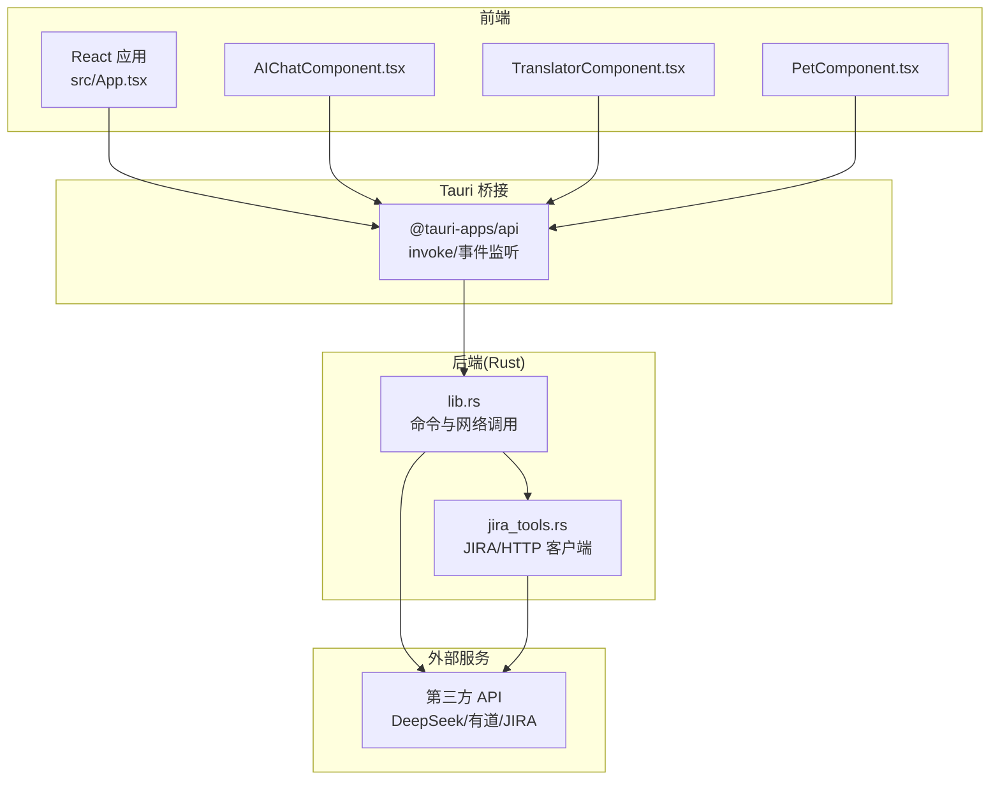
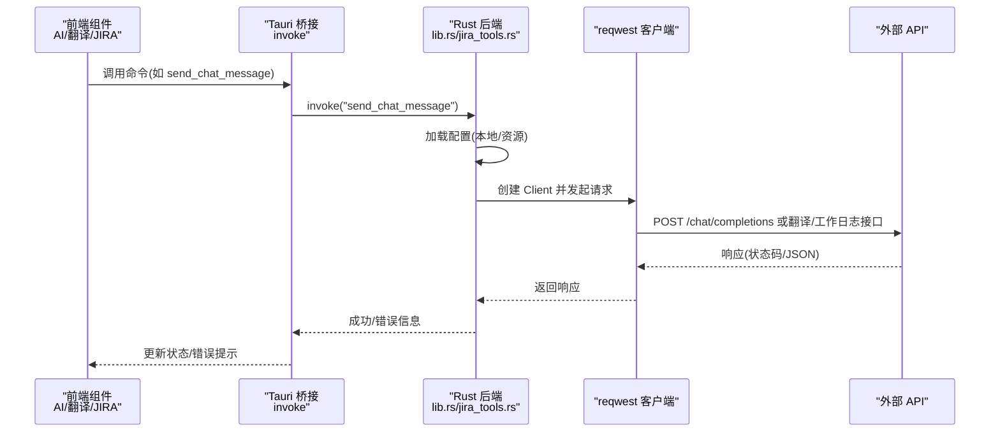
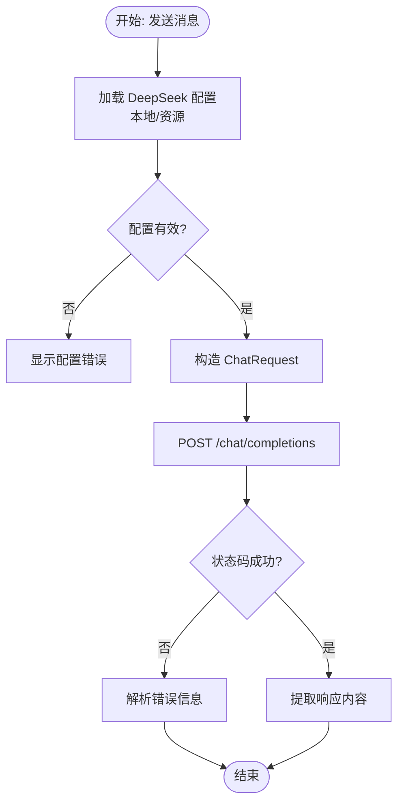
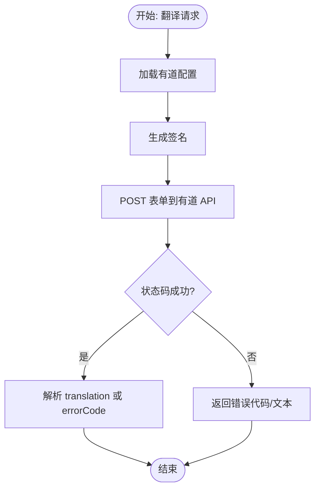
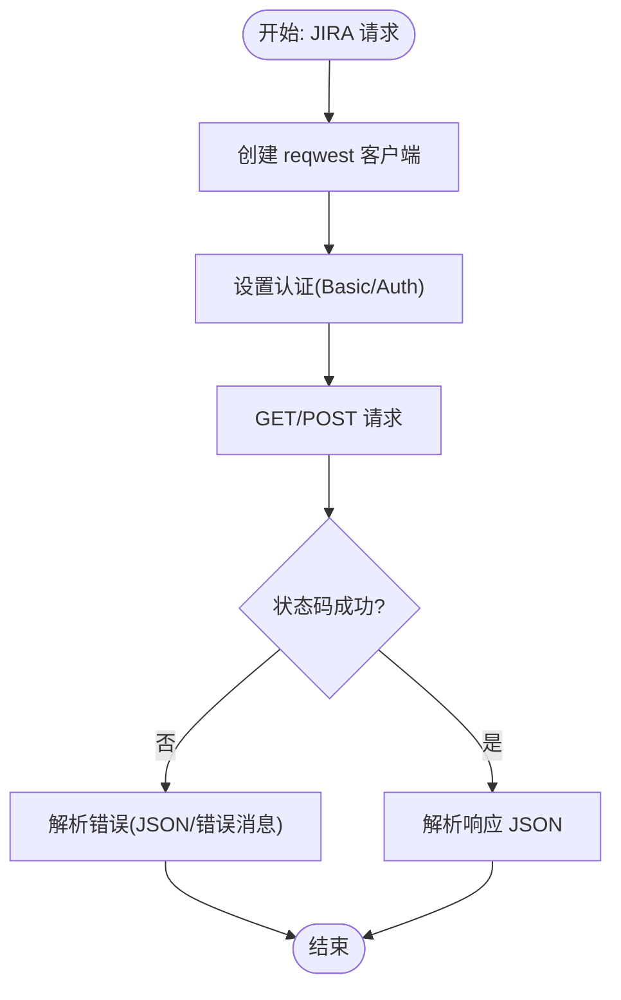
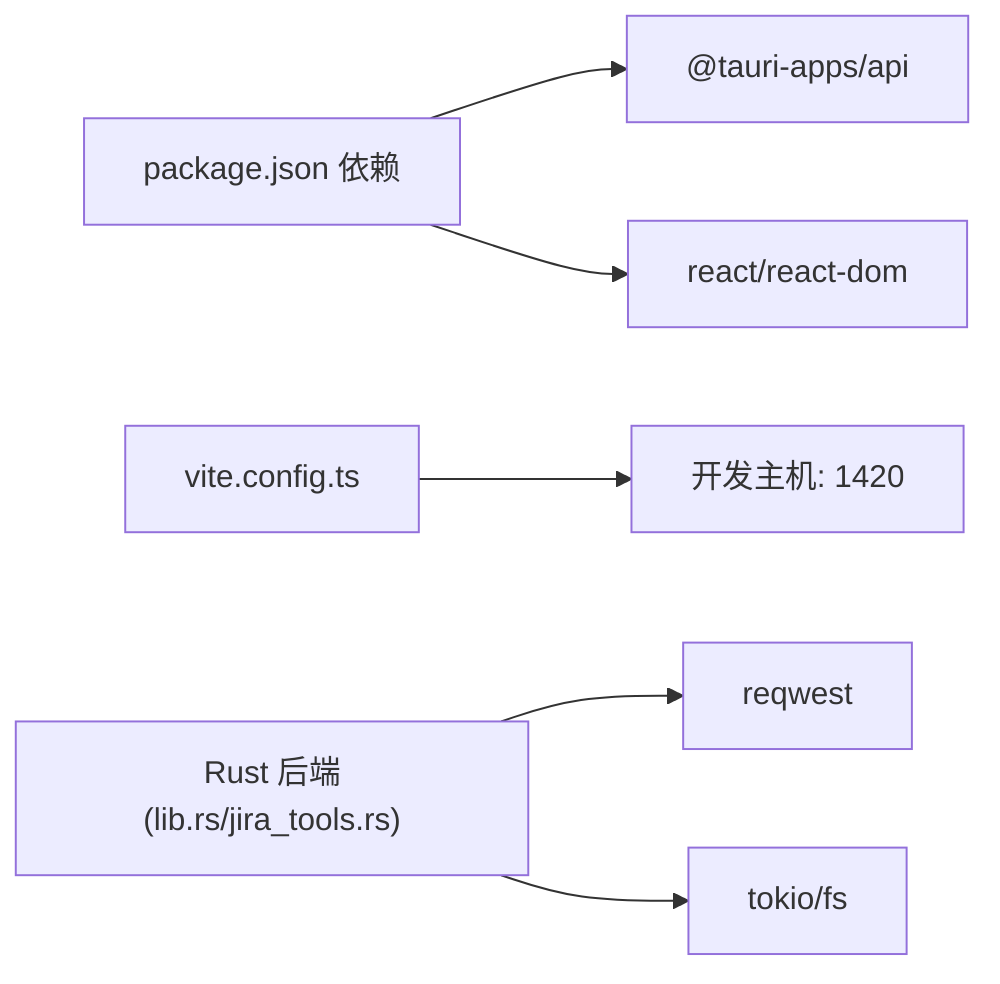

# 网络问题

<cite>
**本文档引用的文件**
- [README.md](file://README.md)
- [package.json](file://package.json)
- [vite.config.ts](file://vite.config.ts)
- [src/App.tsx](file://src/App.tsx)
- [src/main.tsx](file://src/main.tsx)
- [src/components/AIChatComponent.tsx](file://src/components/AIChatComponent.tsx)
- [src/components/TranslatorComponent.tsx](file://src/components/TranslatorComponent.tsx)
- [src/components/PetComponent.tsx](file://src/components/PetComponent.tsx)
- [src-tauri/src/lib.rs](file://src-tauri/src/lib.rs)
- [src-tauri/src/jira_tools.rs](file://src-tauri/src/jira_tools.rs)
- [src-tauri/config/deepseek.json](file://src-tauri/config/deepseek.json)
</cite>

## 目录
1. [简介](#简介)
2. [项目结构](#项目结构)
3. [核心组件](#核心组件)
4. [架构总览](#架构总览)
5. [详细组件分析](#详细组件分析)
6. [依赖关系分析](#依赖关系分析)
7. [性能考量](#性能考量)
8. [故障排除指南](#故障排除指南)
9. [结论](#结论)
10. [附录](#附录)

## 简介
本指南面向“网络相关问题”的故障排除，结合代码库中的实际网络调用与配置，提供系统化的诊断与修复方法。重点覆盖以下方面：
- API 连接失败：连通性检查、DNS 解析、防火墙阻断
- 超时与响应慢：延迟测试、服务器负载、客户端超时配置
- 认证与授权：API 密钥验证失败、OAuth 流程异常、令牌过期
- 代理与 VPN：代理设置、SSL 证书验证、网络路由
- 离线与恢复：缓存策略、重试机制、降级处理

## 项目结构
该项目采用前端 React + TypeScript + Tauri 2 的桌面应用架构，网络请求由 Rust 后端通过 reqwest 客户端发起，前端通过 Tauri 的 invoke 通道调用后端命令。

图表来源
- [src/App.tsx:18-58](file://src/App.tsx#L18-L58)
- [src-tauri/src/lib.rs:262-301](file://src-tauri/src/lib.rs#L262-L301)
- [src-tauri/src/jira_tools.rs:168-185](file://src-tauri/src/jira_tools.rs#L168-L185)

章节来源
- [README.md:129-168](file://README.md#L129-L168)
- [package.json:12-27](file://package.json#L12-L27)
- [vite.config.ts:16-31](file://vite.config.ts#L16-L31)

## 核心组件
- 前端组件通过 invoke 调用后端命令，后端使用 reqwest 发起 HTTP 请求。
- AI 对话组件与有道翻译组件分别调用 DeepSeek 与有道翻译 API；JIRA 工具模块调用 JIRA REST API。
- 配置文件位于应用数据目录，包含 API Key、Base URL、模型等参数。

章节来源
- [src/components/AIChatComponent.tsx:55-82](file://src/components/AIChatComponent.tsx#L55-L82)
- [src/components/TranslatorComponent.tsx:95-122](file://src/components/TranslatorComponent.tsx#L95-L122)
- [src-tauri/src/lib.rs:318-386](file://src-tauri/src/lib.rs#L318-L386)
- [src-tauri/src/lib.rs:428-476](file://src-tauri/src/lib.rs#L428-L476)
- [src-tauri/config/deepseek.json:1-6](file://src-tauri/config/deepseek.json#L1-L6)

## 架构总览
下图展示从前端到后端再到外部 API 的完整调用链路，并标注错误处理与配置加载位置。

图表来源
- [src/components/AIChatComponent.tsx:113-135](file://src/components/AIChatComponent.tsx#L113-L135)
- [src-tauri/src/lib.rs:262-301](file://src-tauri/src/lib.rs#L262-L301)
- [src-tauri/src/lib.rs:478-552](file://src-tauri/src/lib.rs#L478-L552)
- [src-tauri/src/jira_tools.rs:187-243](file://src-tauri/src/jira_tools.rs#L187-L243)

## 详细组件分析

### AI 对话组件（DeepSeek）
- 配置加载：优先读取本地 deepseek_config.json，若无效则回退到资源文件 deepseek.json。
- 请求流程：构造 ChatRequest，POST 到配置的 base_url/chat/completions，携带 Authorization Bearer Token。
- 错误处理：捕获网络错误与非成功状态码，解析响应文本或 JSON 错误字段。

图表来源
- [src/components/AIChatComponent.tsx:55-82](file://src/components/AIChatComponent.tsx#L55-L82)
- [src-tauri/src/lib.rs:262-301](file://src-tauri/src/lib.rs#L262-L301)
- [src-tauri/src/lib.rs:358-386](file://src-tauri/src/lib.rs#L358-L386)

章节来源
- [src/components/AIChatComponent.tsx:23-82](file://src/components/AIChatComponent.tsx#L23-L82)
- [src-tauri/src/lib.rs:262-301](file://src-tauri/src/lib.rs#L262-L301)
- [src-tauri/src/lib.rs:358-386](file://src-tauri/src/lib.rs#L358-L386)
- [src-tauri/config/deepseek.json:1-6](file://src-tauri/config/deepseek.json#L1-L6)

### 有道翻译组件
- 配置加载：读取本地 youdao_config.json，校验 appKey/appSecret/baseUrl。
- 请求流程：生成签名，POST 表单至有道翻译 API，解析 translation 或 errorCode。
- 错误处理：非成功状态码与解析失败均转换为用户可读错误。

图表来源
- [src/components/TranslatorComponent.tsx:164-187](file://src/components/TranslatorComponent.tsx#L164-L187)
- [src-tauri/src/lib.rs:478-552](file://src-tauri/src/lib.rs#L478-L552)

章节来源
- [src/components/TranslatorComponent.tsx:95-122](file://src/components/TranslatorComponent.tsx#L95-L122)
- [src-tauri/src/lib.rs:478-552](file://src-tauri/src/lib.rs#L478-L552)

### JIRA 工具模块
- 客户端：使用 reqwest 创建 HTTP 客户端，设置 User-Agent。
- 认证：支持 Basic Auth 与 basic_auth 方法。
- 错误处理：统一解析 JSON 错误对象或错误消息数组，返回人类可读的错误字符串。

图表来源
- [src-tauri/src/jira_tools.rs:168-185](file://src-tauri/src/jira_tools.rs#L168-L185)
- [src-tauri/src/jira_tools.rs:457-503](file://src-tauri/src/jira_tools.rs#L457-L503)

章节来源
- [src-tauri/src/jira_tools.rs:168-185](file://src-tauri/src/jira_tools.rs#L168-L185)
- [src-tauri/src/jira_tools.rs:457-503](file://src-tauri/src/jira_tools.rs#L457-L503)

## 依赖关系分析
- 前端依赖 @tauri-apps/api 进行命令调用与事件监听。
- 后端依赖 reqwest 进行 HTTP 请求，使用 tokio 异步文件系统进行配置读写。
- Vite 在开发模式下固定端口 1420，便于前端与后端联调。

图表来源
- [package.json:12-27](file://package.json#L12-L27)
- [vite.config.ts:16-31](file://vite.config.ts#L16-L31)
- [src-tauri/src/lib.rs:269-283](file://src-tauri/src/lib.rs#L269-L283)
- [src-tauri/src/jira_tools.rs:169-185](file://src-tauri/src/jira_tools.rs#L169-L185)

章节来源
- [package.json:12-27](file://package.json#L12-L27)
- [vite.config.ts:16-31](file://vite.config.ts#L16-L31)

## 性能考量
- 异步 I/O：后端使用 tokio 进行文件读写与网络请求，避免阻塞主线程。
- 请求头与 UA：设置合理的 User-Agent 与 Content-Type，减少服务端拒绝或额外处理。
- 配置优先级：本地配置优先，资源配置作为回退，降低首次启动失败概率。
- 前端渲染：组件内部使用滚动定位与状态控制，避免不必要的重渲染。

章节来源
- [src-tauri/src/lib.rs:303-315](file://src-tauri/src/lib.rs#L303-L315)
- [src-tauri/src/lib.rs:478-552](file://src-tauri/src/lib.rs#L478-L552)
- [src-tauri/src/jira_tools.rs:168-185](file://src-tauri/src/jira_tools.rs#L168-L185)

## 故障排除指南

### 一、API 连接失败诊断
- 连通性检查
  - 使用系统 ping/dig/traceroute 检查域名可达性与路由路径。
  - 在应用内确认配置的 Base URL 正确（例如 DeepSeek/有道/JIRA）。
- DNS 解析问题
  - 检查系统 DNS 设置，必要时更换为公共 DNS（如 8.8.8.8）。
  - 在后端日志中观察请求阶段是否抛出“发送请求失败”，定位 DNS 阶段错误。
- 防火墙与代理
  - 确认本地防火墙放行出站 TCP 443。
  - 若使用代理/VPN，确保代理配置正确且证书受信；必要时在后端禁用 SSL 校验（不推荐）。

章节来源
- [src-tauri/src/lib.rs:269-283](file://src-tauri/src/lib.rs#L269-L283)
- [src-tauri/src/lib.rs:514-528](file://src-tauri/src/lib.rs#L514-L528)
- [src-tauri/src/jira_tools.rs:169-185](file://src-tauri/src/jira_tools.rs#L169-L185)

### 二、超时与响应慢排查
- 延迟测试
  - 使用 curl/wget 对 API 基础 URL 进行基准测试，记录往返时间。
  - 在前端组件中增加“正在加载”指示，区分 UI 卡顿与网络延迟。
- 服务器负载
  - 观察后端错误信息中是否包含服务端限流或过载提示（如状态码与错误文本）。
- 客户端超时配置
  - 当前后端未显式设置超时，可在 reqwest Client Builder 中增加超时配置（建议在本地开发分支验证）。
  - 前端可引入指数退避重试与最大重试次数，避免频繁失败导致用户体验下降。

章节来源
- [src-tauri/src/lib.rs:269-283](file://src-tauri/src/lib.rs#L269-L283)
- [src-tauri/src/lib.rs:514-528](file://src-tauri/src/lib.rs#L514-L528)
- [src-tauri/src/jira_tools.rs:169-185](file://src-tauri/src/jira_tools.rs#L169-L185)

### 三、认证与授权问题
- API 密钥验证失败
  - 检查本地配置文件 deepseek_config.json/youdao_config.json 是否存在且字段完整。
  - 确认资源文件 deepseek.json 的 apiKey 字段已被替换为有效值。
- OAuth 流程异常
  - 当前代码未实现 OAuth 流程，若后续接入需确保回调地址与权限范围正确。
- 令牌过期
  - 对于 JIRA 的 API Token，确认未过期；对于有道翻译，密钥有效期由服务端决定。

章节来源
- [src-tauri/src/lib.rs:358-386](file://src-tauri/src/lib.rs#L358-L386)
- [src-tauri/src/lib.rs:443-476](file://src-tauri/src/lib.rs#L443-L476)
- [src-tauri/config/deepseek.json:1-6](file://src-tauri/config/deepseek.json#L1-L6)

### 四、代理与 VPN 环境
- 代理设置
  - 在系统或浏览器层面配置代理；确保代理支持 HTTPS。
  - 若代理要求认证，需在系统层正确配置凭据。
- SSL 证书验证
  - 若使用自签证书或企业 CA，需将证书加入系统信任链。
  - 后端可通过 reqwest 的证书校验选项进行调试（不建议生产使用）。
- 网络路由
  - 使用路由跟踪工具（如 traceroute/ip route）确认流量路径。
  - 在 VPN 下优先直连，避免代理绕行导致的延迟与丢包。

章节来源
- [src-tauri/src/lib.rs:269-283](file://src-tauri/src/lib.rs#L269-L283)
- [src-tauri/src/jira_tools.rs:169-185](file://src-tauri/src/jira_tools.rs#L169-L185)

### 五、离线模式与网络恢复
- 缓存策略
  - 将常用配置与少量静态资源缓存至应用数据目录，减少网络依赖。
- 重试机制
  - 前端对网络错误实施指数退避重试，避免雪崩效应。
- 降级处理
  - 当网络不可用时，显示本地可用功能（如日历、剪贴板历史），并在网络恢复后自动同步。

章节来源
- [src-tauri/src/lib.rs:303-315](file://src-tauri/src/lib.rs#L303-L315)
- [src-tauri/src/lib.rs:478-552](file://src-tauri/src/lib.rs#L478-L552)

## 结论
本指南基于代码库中的真实网络调用与配置实现，提供了从连通性、超时、认证到代理与离线恢复的全链路故障排除方法。建议在开发与运维中结合系统工具与应用日志，逐步缩小问题范围，并在本地验证修复方案后再推广至生产环境。

## 附录

### A. 关键调用与配置位置速查
- AI 对话请求：[send_chat_message:262-301](file://src-tauri/src/lib.rs#L262-L301)
- 有道翻译请求：[youdao_translate:478-552](file://src-tauri/src/lib.rs#L478-L552)
- JIRA 请求与认证：[jira_tools.rs:187-243](file://src-tauri/src/jira_tools.rs#L187-L243)
- 配置加载优先级：[load_deepseek_config:358-386](file://src-tauri/src/lib.rs#L358-L386)、[load_youdao_config:443-476](file://src-tauri/src/lib.rs#L443-L476)
- 开发端口与热更新：[vite.config.ts:16-31](file://vite.config.ts#L16-L31)