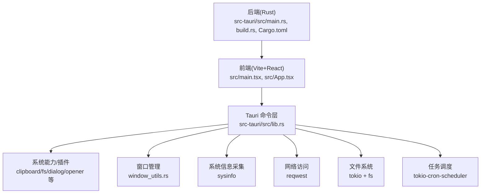
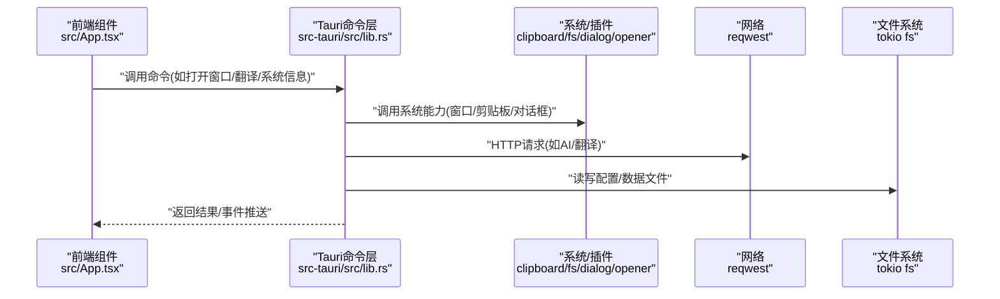
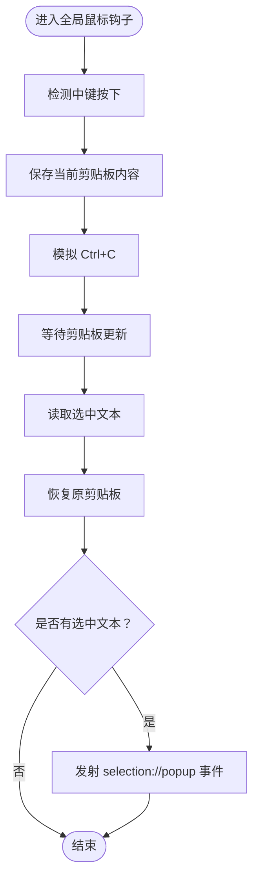
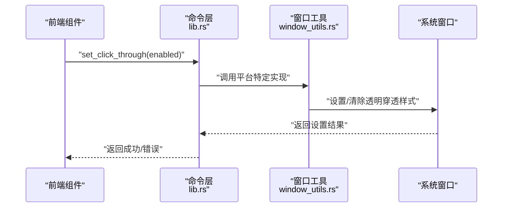
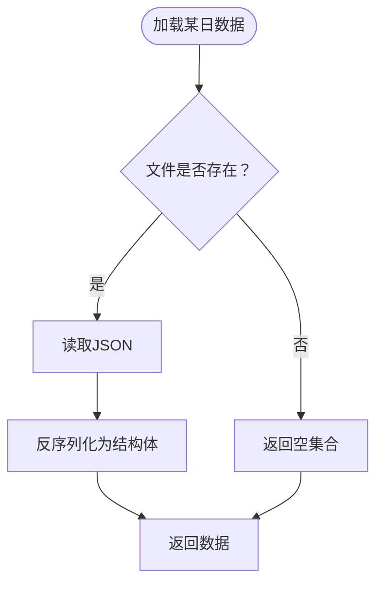
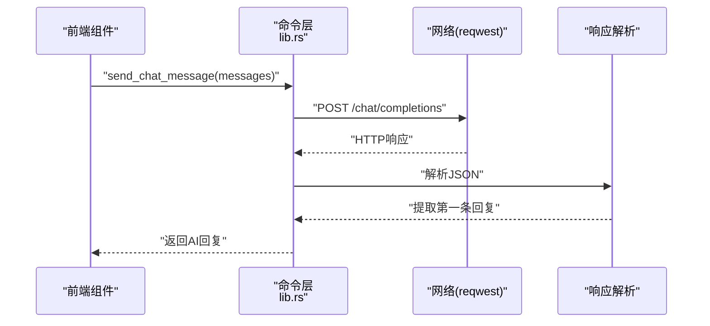
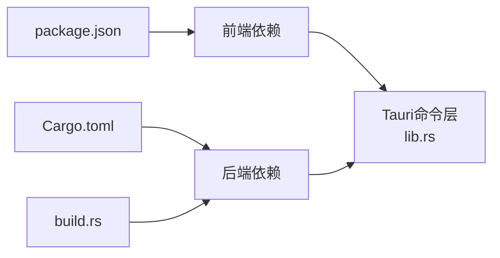

# 调试工具使用

<cite>
**本文引用的文件**
- [Cargo.toml](file://src-tauri/Cargo.toml)
- [tauri.conf.json](file://src-tauri/tauri.conf.json)
- [tauri.conf.dev.json](file://src-tauri/tauri.conf.dev.json)
- [package.json](file://package.json)
- [vite.config.ts](file://vite.config.ts)
- [src/main.tsx](file://src/main.tsx)
- [src/App.tsx](file://src/App.tsx)
- [src-tauri/src/main.rs](file://src-tauri/src/main.rs)
- [src-tauri/src/lib.rs](file://src-tauri/src/lib.rs)
- [src-tauri/src/window_utils.rs](file://src-tauri/src/window_utils.rs)
- [src-tauri/src/clipboard.rs](file://src-tauri/src/clipboard.rs)
- [src-tauri/src/calendar.rs](file://src-tauri/src/calendar.rs)
- [src-tauri/src/global_mouse.rs](file://src-tauri/src/global_mouse.rs)
- [src-tauri/build.rs](file://src-tauri/build.rs)
</cite>

## 目录
1. [简介](#简介)
2. [项目结构](#项目结构)
3. [核心组件](#核心组件)
4. [架构总览](#架构总览)
5. [详细组件分析](#详细组件分析)
6. [依赖关系分析](#依赖关系分析)
7. [性能考虑](#性能考虑)
8. [故障排查指南](#故障排查指南)
9. [结论](#结论)
10. [附录](#附录)

## 简介
本指南面向Tauri应用开发者与运维人员，系统讲解如何在本项目中进行调试，覆盖前端开发工具链、后端Rust代码调试、IPC通信调试、日志系统使用与分析、性能分析（内存/CPU/网络）、断点与条件断点设置，以及远程与生产环境调试策略（日志收集、错误上报、性能监控）。文档结合仓库中的配置与源码，提供可操作的步骤与可视化图示。

## 项目结构
本项目采用典型的Tauri架构：前端为Vite+React，后端为Rust，通过Tauri命令与插件实现IPC通信与系统能力调用。开发模式下，前端以固定端口运行并与Tauri DevServer联动；构建后，前端产物被嵌入为应用资源。

图表来源
- [vite.config.ts:1-33](file://vite.config.ts#L1-L33)
- [package.json:1-29](file://package.json#L1-L29)
- [src-tauri/src/lib.rs:1-120](file://src-tauri/src/lib.rs#L1-L120)
- [src-tauri/src/main.rs:1-11](file://src-tauri/src/main.rs#L1-L11)
- [src-tauri/Cargo.toml:15-44](file://src-tauri/Cargo.toml#L15-L44)

章节来源
- [vite.config.ts:1-33](file://vite.config.ts#L1-L33)
- [package.json:1-29](file://package.json#L1-L29)
- [src-tauri/src/main.rs:1-11](file://src-tauri/src/main.rs#L1-L11)
- [src-tauri/src/lib.rs:1-120](file://src-tauri/src/lib.rs#L1-L120)
- [src-tauri/Cargo.toml:15-44](file://src-tauri/Cargo.toml#L15-L44)

## 核心组件
- 前端入口与路由选择
  - 前端根节点与渲染入口位于 [src/main.tsx:1-10](file://src/main.tsx#L1-L10)，应用根据当前窗口label动态选择组件渲染，便于多窗口场景调试定位。
  - 应用主逻辑与窗口路由选择位于 [src/App.tsx:18-58](file://src/App.tsx#L18-L58)，包含多个窗口标签分支，便于按窗口类型进行断点与日志定位。
- 后端入口与命令导出
  - 后端入口位于 [src-tauri/src/main.rs:8-10](file://src-tauri/src/main.rs#L8-L10)，调用库模块的run流程。
  - 命令导出与业务逻辑集中在 [src-tauri/src/lib.rs:41-160](file://src-tauri/src/lib.rs#L41-L160)，涵盖窗口管理、系统信息、IPC事件、外部服务调用等。
- 构建与开发配置
  - 开发服务器端口、热重载与忽略规则由 [vite.config.ts:16-31](file://vite.config.ts#L16-L31) 定义。
  - Tauri开发/构建参数与窗口配置由 [tauri.conf.json:6-11](file://src-tauri/tauri.conf.json#L6-L11) 与 [tauri.conf.dev.json:1-8](file://src-tauri/tauri.conf.dev.json#L1-L8) 提供。
  - Rust依赖与插件由 [Cargo.toml:15-44](file://src-tauri/Cargo.toml#L15-44) 管理。

章节来源
- [src/main.tsx:1-10](file://src/main.tsx#L1-L10)
- [src/App.tsx:18-58](file://src/App.tsx#L18-L58)
- [src-tauri/src/main.rs:8-10](file://src-tauri/src/main.rs#L8-L10)
- [src-tauri/src/lib.rs:41-160](file://src-tauri/src/lib.rs#L41-L160)
- [vite.config.ts:16-31](file://vite.config.ts#L16-L31)
- [tauri.conf.json:6-11](file://src-tauri/tauri.conf.json#L6-L11)
- [tauri.conf.dev.json:1-8](file://src-tauri/tauri.conf.dev.json#L1-L8)
- [Cargo.toml:15-44](file://src-tauri/Cargo.toml#L15-L44)

## 架构总览
Tauri应用的调试关注点主要分布在三层：前端UI层、IPC命令层、系统能力层。下图展示典型请求流与调试切入点：

图表来源
- [src-tauri/src/lib.rs:262-301](file://src-tauri/src/lib.rs#L262-L301)
- [src-tauri/src/lib.rs:480-552](file://src-tauri/src/lib.rs#L480-L552)
- [src-tauri/src/lib.rs:578-638](file://src-tauri/src/lib.rs#L578-L638)
- [src-tauri/src/lib.rs:778-800](file://src-tauri/src/lib.rs#L778-L800)

章节来源
- [src-tauri/src/lib.rs:262-301](file://src-tauri/src/lib.rs#L262-L301)
- [src-tauri/src/lib.rs:480-552](file://src-tauri/src/lib.rs#L480-L552)
- [src-tauri/src/lib.rs:578-638](file://src-tauri/src/lib.rs#L578-L638)
- [src-tauri/src/lib.rs:778-800](file://src-tauri/src/lib.rs#L778-L800)

## 详细组件分析

### 剪贴板与全局鼠标钩子调试
- 剪贴板历史与去重、容量限制、线程安全等逻辑集中在 [src-tauri/src/clipboard.rs:20-122](file://src-tauri/src/clipboard.rs#L20-L122)。调试要点：
  - 关注重复内容过滤与容量上限，避免历史记录过多导致内存压力。
  - 检查异常路径（锁获取失败、内容过长）的日志输出，便于定位并发问题。
- 全局鼠标钩子用于中键触发选中文本事件，逻辑位于 [src-tauri/src/global_mouse.rs:111-149](file://src-tauri/src/global_mouse.rs#L111-L149)。调试要点：
  - 钩子初始化与消息泵生命周期，确保钩子在应用生命周期内正确安装/卸载。
  - 中键点击事件触发顺序（保存剪贴板→模拟Ctrl+C→恢复剪贴板→发射事件），便于断点分段验证。

图表来源
- [src-tauri/src/global_mouse.rs:39-69](file://src-tauri/src/global_mouse.rs#L39-L69)

章节来源
- [src-tauri/src/clipboard.rs:20-122](file://src-tauri/src/clipboard.rs#L20-L122)
- [src-tauri/src/global_mouse.rs:111-149](file://src-tauri/src/global_mouse.rs#L111-L149)

### 窗口管理与透明穿透调试
- 窗口管理命令与事件发射集中在 [src-tauri/src/lib.rs:48-160](file://src-tauri/src/lib.rs#L48-L160)，涉及创建/显示/聚焦/事件发射等。
- 平台特定的“穿透鼠标事件”逻辑位于 [src-tauri/src/window_utils.rs:9-32](file://src-tauri/src/window_utils.rs#L9-L32)，Windows平台通过Win32 API设置扩展样式，其他平台通过Tauri接口设置忽略光标事件。调试要点：
  - 在不同窗口标签（如pet、translator、json-compare等）分别设置断点，观察事件发射与窗口行为。
  - 在Windows上验证穿透/非穿透切换对鼠标交互的影响。

图表来源
- [src-tauri/src/lib.rs:48-50](file://src-tauri/src/lib.rs#L48-L50)
- [src-tauri/src/window_utils.rs:9-32](file://src-tauri/src/window_utils.rs#L9-L32)

章节来源
- [src-tauri/src/lib.rs:48-50](file://src-tauri/src/lib.rs#L48-L50)
- [src-tauri/src/window_utils.rs:9-32](file://src-tauri/src/window_utils.rs#L9-L32)

### 日历与待办数据调试
- 日历数据模型、文件读写、清理策略集中在 [src-tauri/src/calendar.rs:87-245](file://src-tauri/src/calendar.rs#L87-L245)。调试要点：
  - 日期边界与目录创建的异步流程，注意错误传播与默认值回退。
  - 数据清理（按日期保留）逻辑，避免误删历史数据。

图表来源
- [src-tauri/src/calendar.rs:98-141](file://src-tauri/src/calendar.rs#L98-L141)

章节来源
- [src-tauri/src/calendar.rs:87-245](file://src-tauri/src/calendar.rs#L87-L245)

### IPC命令与外部服务调用调试
- AI聊天命令与错误处理位于 [src-tauri/src/lib.rs:262-301](file://src-tauri/src/lib.rs#L262-301)，包含请求构造、状态码校验、响应解析与错误聚合。
- 有道翻译命令与签名生成位于 [src-tauri/src/lib.rs:480-552](file://src-tauri/src/lib.rs#L480-552)，包含参数拼装、MD5签名与错误码映射。
- 日历相关命令位于 [src-tauri/src/lib.rs:578-638](file://src-tauri/src/lib.rs#L578-638)，涉及文件读写与事件发射。

图表来源
- [src-tauri/src/lib.rs:262-301](file://src-tauri/src/lib.rs#L262-L301)

章节来源
- [src-tauri/src/lib.rs:262-301](file://src-tauri/src/lib.rs#L262-L301)
- [src-tauri/src/lib.rs:480-552](file://src-tauri/src/lib.rs#L480-L552)
- [src-tauri/src/lib.rs:578-638](file://src-tauri/src/lib.rs#L578-L638)

## 依赖关系分析
- 前端依赖与脚本由 [package.json:12-28](file://package.json#L12-L28) 管理，包含Tauri API与React生态。
- Rust依赖与插件由 [Cargo.toml:15-44](file://src-tauri/Cargo.toml#L15-44) 管理，涵盖系统信息、网络、文件系统、定时任务、Windows Win32绑定等。
- 构建阶段由 [src-tauri/build.rs:1-4](file://src-tauri/build.rs#L1-L4) 调用Tauri构建工具。

图表来源
- [package.json:12-28](file://package.json#L12-L28)
- [Cargo.toml:15-44](file://src-tauri/Cargo.toml#L15-L44)
- [src-tauri/build.rs:1-4](file://src-tauri/build.rs#L1-L4)

章节来源
- [package.json:12-28](file://package.json#L12-L28)
- [Cargo.toml:15-44](file://src-tauri/Cargo.toml#L15-L44)
- [src-tauri/build.rs:1-4](file://src-tauri/build.rs#L1-L4)

## 性能考虑
- 异步I/O与锁竞争
  - 剪贴板历史使用互斥锁保护，调试时关注锁粒度与持有时间，避免阻塞主线程或引发死锁。
  - 文件读写与网络请求均采用异步Tokio运行时，注意任务取消与超时设置。
- 窗口与事件发射
  - 多窗口场景下，事件发射频率与窗口焦点切换可能带来性能开销，建议在高频事件中加入节流/去抖。
- 网络与第三方API
  - 对外HTTP请求需设置合理的超时与重试策略，避免阻塞命令执行。
- 资源与内存
  - 日历背景图上传与清理逻辑需防止磁盘空间与内存泄漏，建议在大文件场景增加大小限制与进度反馈。

## 故障排查指南
- 前端控制台日志
  - 使用浏览器开发者工具的Console面板查看前端日志；在多窗口场景下，通过当前窗口label区分不同组件的输出。
  - 参考 [src/App.tsx:18-58](file://src/App.tsx#L18-L58) 的窗口路由，确认当前渲染组件与对应调试断点位置。
- 后端Rust日志
  - 使用println!输出作为调试日志（如剪贴板模块中的多处打印），在开发模式下可在终端查看。
  - 参考 [src-tauri/src/clipboard.rs:64-79](file://src-tauri/src/clipboard.rs#L64-L79)、[src-tauri/src/global_mouse.rs:135-136](file://src-tauri/src/global_mouse.rs#L135-L136) 等位置的调试输出。
- 系统日志与错误
  - Windows平台可通过事件查看器查看应用日志；Linux/macOS可通过系统日志工具查看。
  - 对于网络错误，参考 [src-tauri/src/lib.rs:285-289](file://src-tauri/src/lib.rs#L285-L289) 的状态码与错误文本聚合，便于快速定位API问题。
- IPC通信问题
  - 使用命令层的错误返回字符串（如“创建窗口失败: ...”）辅助定位，参考 [src-tauri/src/lib.rs:100-111](file://src-tauri/src/lib.rs#L100-L111)、[src-tauri/src/lib.rs:149-150](file://src-tauri/src/lib.rs#L149-L150) 等。
  - 在前端监听事件（如“translator://fill-text”、“json://fill-text”）时，确认窗口标签与初始化脚本注入是否正确，参考 [src-tauri/src/lib.rs:116-160](file://src-tauri/src/lib.rs#L116-L160)、[src-tauri/src/lib.rs:162-209](file://src-tauri/src/lib.rs#L162-L209)。

章节来源
- [src-tauri/src/clipboard.rs:64-82](file://src-tauri/src/clipboard.rs#L64-L82)
- [src-tauri/src/global_mouse.rs:135-136](file://src-tauri/src/global_mouse.rs#L135-L136)
- [src-tauri/src/lib.rs:100-111](file://src-tauri/src/lib.rs#L100-L111)
- [src-tauri/src/lib.rs:149-150](file://src-tauri/src/lib.rs#L149-L150)
- [src-tauri/src/lib.rs:116-160](file://src-tauri/src/lib.rs#L116-L160)
- [src-tauri/src/lib.rs:162-209](file://src-tauri/src/lib.rs#L162-L209)
- [src-tauri/src/lib.rs:285-289](file://src-tauri/src/lib.rs#L285-L289)

## 结论
本指南提供了从开发到生产的全链路调试方法：前端利用Vite热重载与浏览器工具、后端利用println与断点、IPC通过命令层错误字符串与事件发射进行定位，系统日志与网络监控配合性能分析工具，形成闭环。建议在开发阶段开启详细日志，在生产阶段通过集中化日志与错误上报工具进行持续观测。

## 附录

### 断点与条件断点设置清单
- 前端组件调试
  - 在 [src/App.tsx:18-58](file://src/App.tsx#L18-L58) 的窗口路由处设置断点，按窗口label区分场景。
  - 在 [src/main.tsx:5-9](file://src/main.tsx#L5-L9) 的渲染入口设置断点，验证根节点挂载。
- 后端服务调试
  - 在 [src-tauri/src/lib.rs:48-50](file://src-tauri/src/lib.rs#L48-L50) 设置“穿透/非穿透”切换断点。
  - 在 [src-tauri/src/lib.rs:262-301](file://src-tauri/src/lib.rs#L262-L301) 设置AI聊天命令断点，观察请求与响应。
  - 在 [src-tauri/src/lib.rs:480-552](file://src-tauri/src/lib.rs#L480-L552) 设置翻译命令断点，观察签名与错误码。
- 窗口管理调试
  - 在 [src-tauri/src/lib.rs:75-112](file://src-tauri/src/lib.rs#L75-L112) 设置“展开窗口”断点。
  - 在 [src-tauri/src/lib.rs:115-160](file://src-tauri/src/lib.rs#L115-L160) 设置“翻译窗口”断点。
  - 在 [src-tauri/src/lib.rs:162-209](file://src-tauri/src/lib.rs#L162-L209) 设置“JSON比较窗口”断点。
- 全局鼠标钩子调试
  - 在 [src-tauri/src/global_mouse.rs:111-149](file://src-tauri/src/global_mouse.rs#L111-L149) 设置钩子初始化断点，验证消息泵与卸载路径。
- 剪贴板历史调试
  - 在 [src-tauri/src/clipboard.rs:29-82](file://src-tauri/src/clipboard.rs#L29-L82) 设置“添加项目”断点，观察容量与去重逻辑。
  - 在 [src-tauri/src/clipboard.rs:84-121](file://src-tauri/src/clipboard.rs#L84-L121) 设置“检查更新”断点，观察重复内容过滤。

### 远程调试与生产环境调试
- 日志收集
  - 前端：通过浏览器Console与Network面板收集用户行为与错误。
  - 后端：在开发阶段使用println输出，在生产阶段接入集中化日志（如结构化日志格式与日志聚合平台）。
- 错误报告
  - 在命令层统一返回错误字符串，便于前端捕获与上报；在网络请求失败时，保留状态码与错误文本。
- 性能监控
  - 使用浏览器性能面板（CPU/内存/网络）与系统性能监视器（Windows任务管理器/资源监视器）进行对比分析。
  - 对高频IPC调用与文件I/O操作进行采样与指标埋点，识别瓶颈。