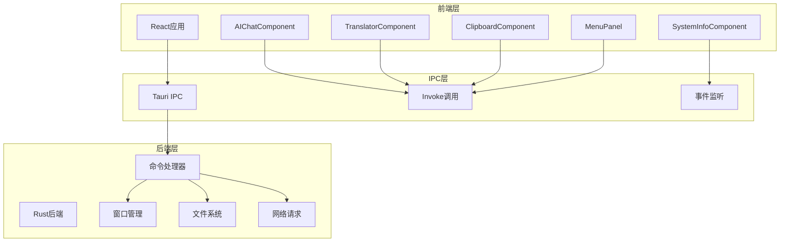
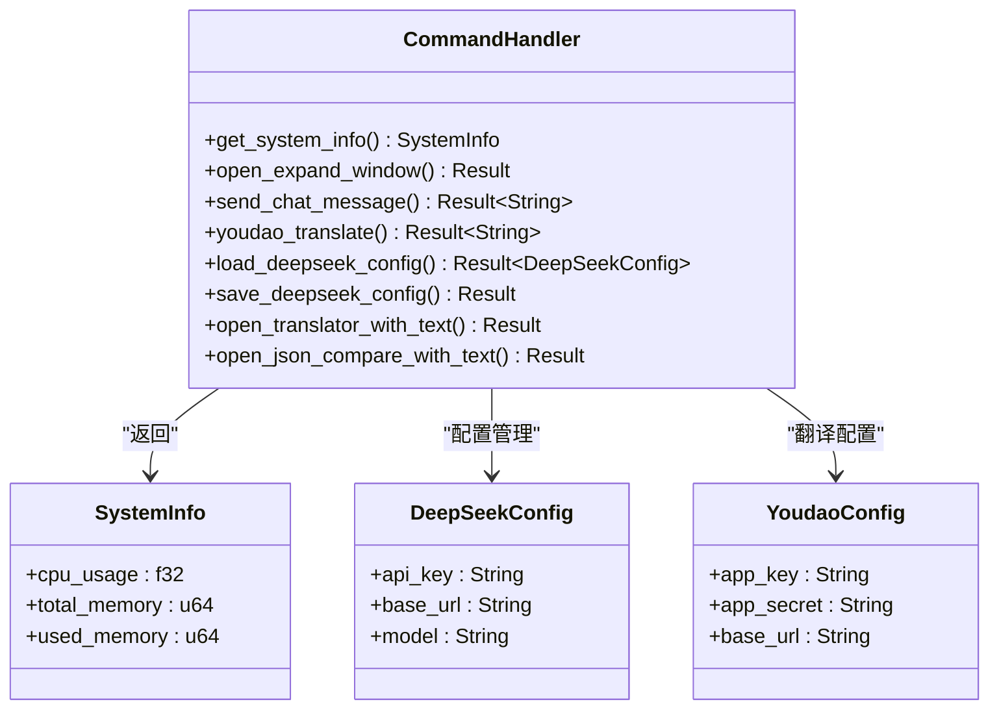
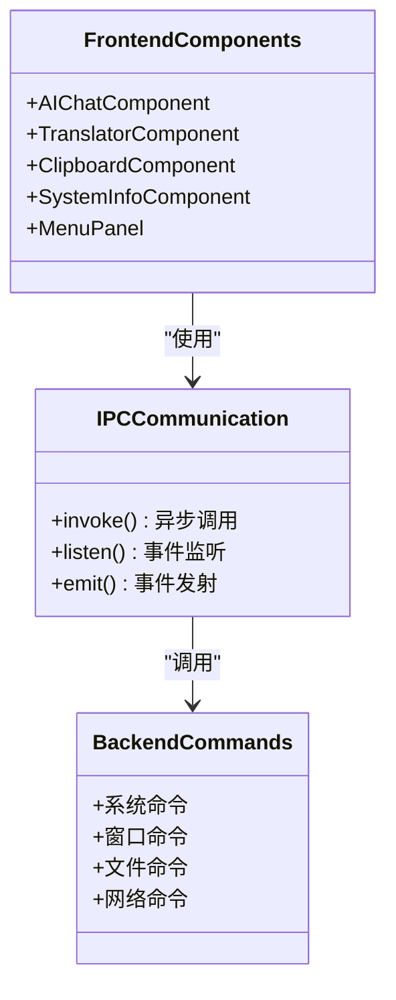
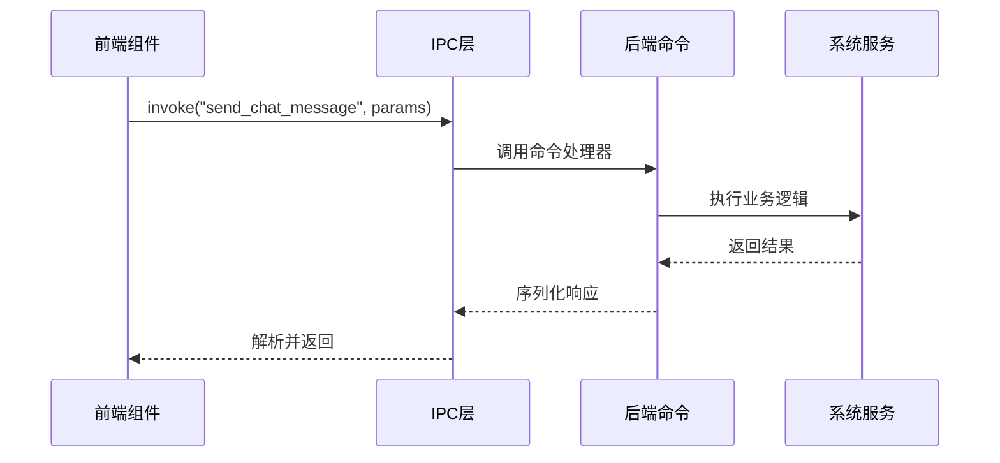
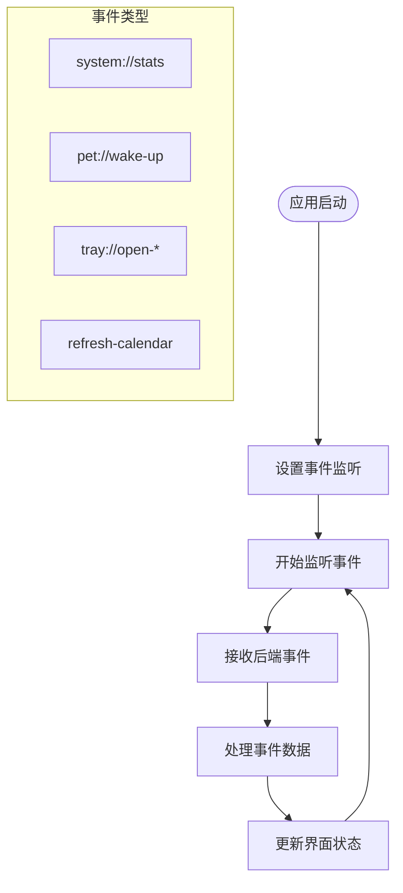
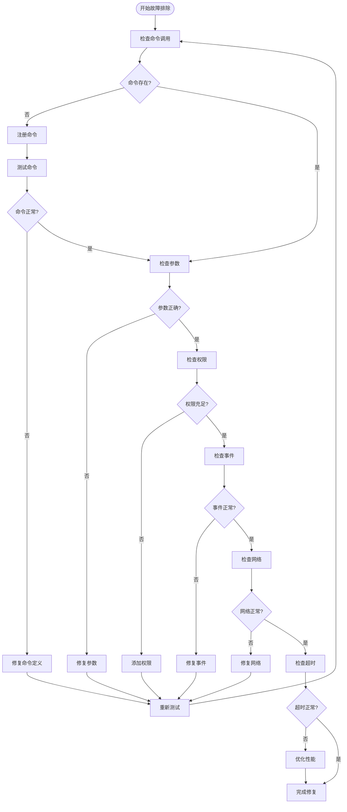
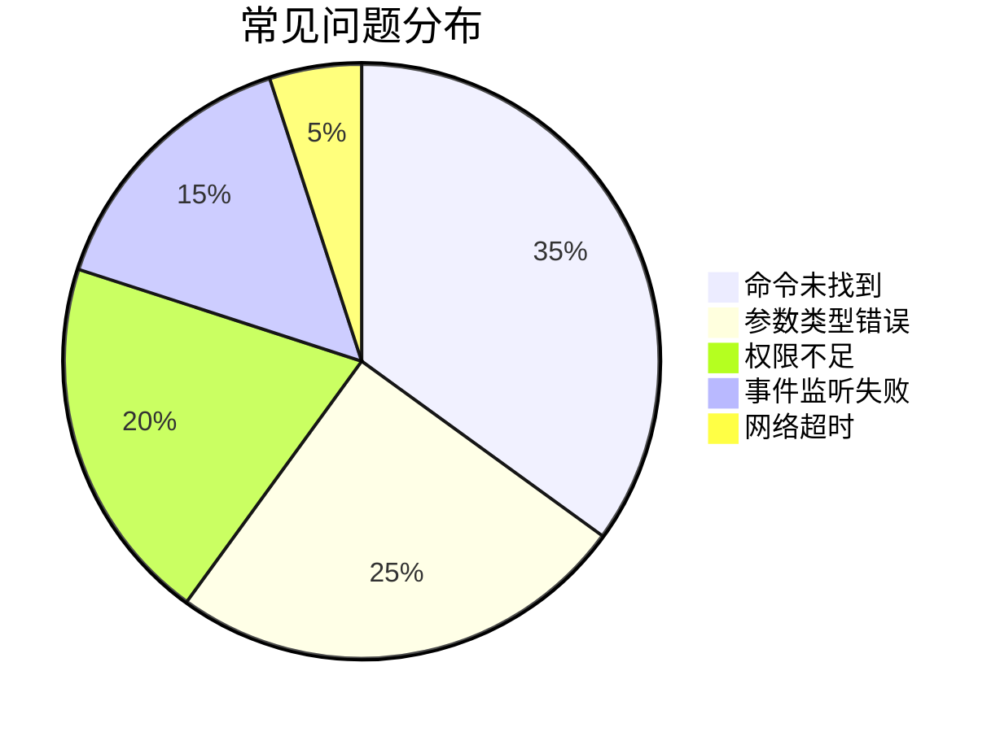

# IPC通信错误故障排除指南

<cite>
**本文档引用的文件**
- [src-tauri/src/lib.rs](file://src-tauri/src/lib.rs)
- [src-tauri/src/main.rs](file://src-tauri/src/main.rs)
- [src-tauri/Cargo.toml](file://src-tauri/Cargo.toml)
- [src-tauri/tauri.conf.json](file://src-tauri/tauri.conf.json)
- [src/App.tsx](file://src/App.tsx)
- [src/components/AIChatComponent.tsx](file://src/components/AIChatComponent.tsx)
- [src/components/TranslatorComponent.tsx](file://src/components/TranslatorComponent.tsx)
- [src/components/ClipboardComponent.tsx](file://src/components/ClipboardComponent.tsx)
- [src/components/SystemInfoComponent.tsx](file://src/components/SystemInfoComponent.tsx)
- [src/components/MenuPanel.tsx](file://src/components/MenuPanel.tsx)
- [src-tauri/src/task_scheduler.rs](file://src-tauri/src/task_scheduler.rs)
- [package.json](file://package.json)
</cite>

## 目录
1. [简介](#简介)
2. [项目架构概览](#项目架构概览)
3. [核心组件分析](#核心组件分析)
4. [IPC通信架构](#ipc通信架构)
5. [常见错误类型与诊断](#常见错误类型与诊断)
6. [事件监听故障排除](#事件监听故障排除)
7. [命令执行超时处理](#命令执行超时处理)
8. [调试技巧与最佳实践](#调试技巧与最佳实践)
9. [性能优化建议](#性能优化建议)
10. [故障排除流程图](#故障排除流程图)

## 简介

本指南专注于Tauri桌面应用中的IPC（进程间通信）错误故障排除。该应用是一个集成了多种功能的桌面宠物应用，包含AI对话、翻译、剪贴板管理、系统监控等多个模块。通过深入分析代码库中的IPC实现，提供系统性的故障排除方法和调试技巧。

## 项目架构概览

该应用采用典型的Tauri架构，前端使用React框架，后端使用Rust语言开发，通过IPC实现前后端通信。



**图表来源**
- [src-tauri/src/lib.rs:948-1119](file://src-tauri/src/lib.rs#L948-L1119)
- [src-tauri/src/main.rs:1-11](file://src-tauri/src/main.rs#L1-L11)

## 核心组件分析

### Rust后端命令系统

应用的后端通过`#[tauri::command]`宏定义了多个命令处理器，涵盖系统信息、窗口管理、文件操作、网络请求等功能。



**图表来源**
- [src-tauri/src/lib.rs:41-386](file://src-tauri/src/lib.rs#L41-L386)

### 前端组件架构

前端组件通过`@tauri-apps/api`库与后端进行IPC通信，每个组件负责特定的功能模块。



**图表来源**
- [src/components/AIChatComponent.tsx:1-371](file://src/components/AIChatComponent.tsx#L1-L371)
- [src/components/TranslatorComponent.tsx:1-416](file://src/components/TranslatorComponent.tsx#L1-L416)

**章节来源**
- [src-tauri/src/lib.rs:41-1003](file://src-tauri/src/lib.rs#L41-L1003)
- [src-tauri/src/main.rs:1-11](file://src-tauri/src/main.rs#L1-L11)
- [src/App.tsx:1-60](file://src/App.tsx#L1-L60)

## IPC通信架构

### 命令调用流程

应用的IPC通信主要通过以下几种方式实现：

1. **同步命令调用**：前端直接调用后端命令并等待返回
2. **异步事件监听**：后端主动向前端推送事件
3. **窗口间通信**：通过事件系统在不同窗口间传递消息



**图表来源**
- [src/components/AIChatComponent.tsx:113-135](file://src/components/AIChatComponent.tsx#L113-L135)
- [src-tauri/src/lib.rs:262-301](file://src-tauri/src/lib.rs#L262-L301)

### 事件监听机制

应用实现了多种事件监听机制，用于实现实时数据更新和状态同步。



**图表来源**
- [src-tauri/src/lib.rs:1046-1068](file://src-tauri/src/lib.rs#L1046-L1068)
- [src/components/SystemInfoComponent.tsx:19-25](file://src/components/SystemInfoComponent.tsx#L19-L25)

**章节来源**
- [src-tauri/src/lib.rs:948-1119](file://src-tauri/src/lib.rs#L948-L1119)
- [src/components/SystemInfoComponent.tsx:1-44](file://src/components/SystemInfoComponent.tsx#L1-L44)

## 常见错误类型与诊断

### 命令调用失败

#### 错误类型1：命令未找到
当前端调用不存在的命令时会出现此错误。

**诊断步骤：**
1. 检查命令名称是否正确
2. 确认命令已在后端注册
3. 验证命令参数类型匹配

**解决方案：**
```typescript
// 正确的命令调用方式
try {
    const result = await invoke('send_chat_message', {
        messages: chatMessages
    });
} catch (error) {
    console.error('命令调用失败:', error);
    // 检查后端是否注册了该命令
}
```

#### 错误类型2：参数类型不匹配
当传递给后端的参数类型与期望不符时发生。

**诊断步骤：**
1. 检查前端传入的参数类型
2. 对比后端命令定义的参数类型
3. 验证JSON序列化过程

**解决方案：**
```typescript
// 确保参数类型正确
const chatMessages: ChatMessage[] = [
    ...messages.map(msg => ({
        role: msg.role,
        content: msg.content
    })),
    {
        role: 'user',
        content: userMessage.content
    }
];
```

#### 错误类型3：权限不足
某些命令需要特定权限才能执行。

**诊断步骤：**
1. 检查Tauri配置中的权限设置
2. 验证窗口标签是否具有相应权限
3. 确认插件是否正确初始化

**解决方案：**
```json
{
  "identifier": "main-capability",
  "windows": ["main"],
  "permissions": [
    "core:default",
    "fs:allow-read-text-file",
    "dialog:open"
  ]
}
```

**章节来源**
- [src-tauri/src/lib.rs:956-1003](file://src-tauri/src/lib.rs#L956-L1003)
- [src-tauri/tauri.conf.json:44-51](file://src-tauri/tauri.conf.json#L44-L51)

### 参数传递错误

#### 错误类型1：JSON序列化失败
当复杂对象无法正确序列化时发生。

**诊断步骤：**
1. 检查对象是否包含循环引用
2. 验证可序列化字段
3. 确认编码格式正确

**解决方案：**
```typescript
// 使用安全的序列化方式
const safeParams = JSON.stringify({
    messages: chatMessages,
    model: config.model
});
```

#### 错误类型2：数据格式不兼容
前端和后端对同一数据的不同理解。

**诊断步骤：**
1. 统一数据结构定义
2. 建立接口契约文档
3. 实施数据验证

**解决方案：**
```typescript
// 定义明确的数据结构
interface ChatMessage {
    role: string;
    content: string;
}

const messages: ChatMessage[] = [
    { role: 'user', content: 'Hello' }
];
```

### 返回值异常

#### 错误类型1：异步操作超时
长时间运行的操作可能导致超时。

**诊断步骤：**
1. 检查后端异步操作的耗时
2. 验证Tokio任务的执行情况
3. 监控内存使用情况

**解决方案：**
```rust
// 使用超时控制
let result = tokio::time::timeout(Duration::from_secs(30), async_operation)
    .await
    .map_err(|_| "操作超时")?;
```

#### 错误类型2：错误传播链中断
错误在IPC链路中丢失。

**诊断步骤：**
1. 检查错误转换过程
2. 验证字符串错误处理
3. 实施统一的错误包装

**解决方案：**
```rust
// 统一错误处理
#[tauri::command]
async fn send_chat_message(
    app: tauri::AppHandle,
    messages: Vec<ChatMessage>,
) -> Result<String, String> {
    let client = reqwest::Client::new();
    let response = client.post(&config.base_url)
        .header("Authorization", format!("Bearer {}", config.api_key))
        .json(&chat_request)
        .send()
        .await
        .map_err(|e| format!("网络请求失败: {}", e))?;
    
    if !response.status().is_success() {
        let status = response.status();
        let error_text = response.text().await.unwrap_or_default();
        return Err(format!("API请求失败 ({}): {}", status, error_text));
    }
    
    // 解析响应
    let chat_response: ChatResponse = response
        .json()
        .await
        .map_err(|e| format!("响应解析失败: {}", e))?;
    
    chat_response.choices
        .first()
        .map(|choice| choice.message.content.clone())
        .ok_or_else(|| "AI响应为空".to_string())
}
```

**章节来源**
- [src-tauri/src/lib.rs:262-301](file://src-tauri/src/lib.rs#L262-L301)
- [src-tauri/src/lib.rs:480-552](file://src-tauri/src/lib.rs#L480-L552)

## 事件监听故障排除

### 事件注册失败

#### 问题现象
事件监听器无法接收到后端发出的事件。

**诊断步骤：**
1. 检查事件名称是否一致
2. 验证监听器注册时机
3. 确认事件作用域正确

**解决方案：**
```typescript
// 正确的事件监听方式
useEffect(() => {
    const unlistenPromise = listen<SystemInfo>("system://stats", (event) => {
        setInfo(event.payload);
    });

    return () => {
        unlistenPromise.then((unlistenFn) => unlistenFn());
    };
}, []);
```

#### 事件格式不匹配
前端期望的数据格式与后端实际发送的格式不一致。

**诊断步骤：**
1. 检查后端事件负载结构
2. 验证前端事件处理器
3. 确认JSON序列化一致性

**解决方案：**
```typescript
// 确保事件格式一致
// 后端
app.emit("system://stats", &payload).map_err(|e| e.to_string())?;

// 前端
listen<SystemInfo>("system://stats", (event) => {
    setInfo(event.payload);
});
```

### 回调函数异常

#### 问题现象
事件回调函数执行过程中出现异常。

**诊断步骤：**
1. 检查回调函数的异步处理
2. 验证状态更新的安全性
3. 确认内存泄漏防护

**解决方案：**
```typescript
// 使用安全的回调处理
const unlistenPromise = listen<SystemInfo>("system://stats", (event) => {
    // 防止并发状态更新
    if (infoRef.current !== event.payload) {
        infoRef.current = event.payload;
        setInfo(event.payload);
    }
});
```

**章节来源**
- [src-tauri/src/lib.rs:1063-1066](file://src-tauri/src/lib.rs#L1063-L1066)
- [src/components/SystemInfoComponent.tsx:19-25](file://src/components/SystemInfoComponent.tsx#L19-L25)

## 命令执行超时处理

### 网络延迟场景

#### 问题分析
AI对话和翻译功能涉及网络请求，可能受到网络延迟影响。

**诊断步骤：**
1. 监控网络请求耗时
2. 检查API响应时间
3. 分析代理和防火墙影响

**解决方案：**
```typescript
// 实现超时控制
const TIMEOUT = 30000; // 30秒超时

try {
    const controller = new AbortController();
    const timeoutId = setTimeout(() => controller.abort(), TIMEOUT);
    
    const response = await fetch('/api/chat', {
        method: 'POST',
        signal: controller.signal,
        body: JSON.stringify({ messages })
    });
    
    clearTimeout(timeoutId);
    
    if (!response.ok) {
        throw new Error(`HTTP error! status: ${response.status}`);
    }
    
    const data = await response.json();
    return data;
} catch (error) {
    if (error.name === 'AbortError') {
        throw new Error('请求超时');
    }
    throw error;
}
```

#### 后端处理时间过长

**诊断步骤：**
1. 分析后端命令的执行时间
2. 检查数据库查询性能
3. 监控外部API调用

**解决方案：**
```rust
// 后端超时处理
#[tauri::command]
async fn send_chat_message(
    app: tauri::AppHandle,
    messages: Vec<ChatMessage>,
) -> Result<String, String> {
    // 设置合理的超时时间
    let timeout_duration = Duration::from_secs(30);
    
    let client = reqwest::Client::builder()
        .timeout(timeout_duration)
        .build()
        .map_err(|e| format!("创建客户端失败: {}", e))?;
    
    let response = tokio::time::timeout(timeout_duration, client.post(&url).json(&body).send())
        .await
        .map_err(|_| "请求超时")??;
    
    // 处理响应...
}
```

### 优化策略

#### 并发控制
```typescript
// 限制并发请求数量
class RequestQueue {
    private queue: Array<Function> = [];
    private concurrent: number = 0;
    private maxConcurrent: number = 3;
    
    async add(requestFn: Function) {
        return new Promise((resolve, reject) => {
            this.queue.push(() => this.execute(requestFn, resolve, reject));
            this.process();
        });
    }
    
    private async execute(requestFn: Function, resolve: Function, reject: Function) {
        if (this.concurrent >= this.maxConcurrent) {
            setTimeout(() => this.execute(requestFn, resolve, reject), 100);
            return;
        }
        
        this.concurrent++;
        try {
            const result = await requestFn();
            resolve(result);
        } catch (error) {
            reject(error);
        } finally {
            this.concurrent--;
            this.process();
        }
    }
    
    private process() {
        if (this.queue.length > 0 && this.concurrent < this.maxConcurrent) {
            const requestFn = this.queue.shift();
            requestFn && requestFn();
        }
    }
}
```

#### 缓存策略
```typescript
// 实现智能缓存
class APICache {
    private cache: Map<string, {data: any, timestamp: number}> = new Map();
    private ttl: number = 5 * 60 * 1000; // 5分钟缓存
    
    get(key: string) {
        const entry = this.cache.get(key);
        if (!entry) return null;
        
        if (Date.now() - entry.timestamp > this.ttl) {
            this.cache.delete(key);
            return null;
        }
        
        return entry.data;
    }
    
    set(key: string, data: any) {
        this.cache.set(key, { data, timestamp: Date.now() });
    }
}
```

**章节来源**
- [src-tauri/src/lib.rs:262-301](file://src-tauri/src/lib.rs#L262-L301)
- [src-tauri/src/lib.rs:480-552](file://src-tauri/src/lib.rs#L480-L552)

## 调试技巧与最佳实践

### 日志记录策略

#### 前端调试
```typescript
// 实现详细的日志记录
class DebugLogger {
    static log(level: string, message: string, data?: any) {
        const timestamp = new Date().toISOString();
        const logEntry = {
            timestamp,
            level,
            message,
            data: data ? JSON.stringify(data) : undefined
        };
        
        console.log(JSON.stringify(logEntry));
        
        // 可选：将日志发送到后端
        if (level === 'ERROR') {
            invoke('log_frontend_error', { logEntry });
        }
    }
    
    static error(message: string, error?: any) {
        this.log('ERROR', message, error);
    }
    
    static warn(message: string, data?: any) {
        this.log('WARN', message, data);
    }
    
    static info(message: string, data?: any) {
        this.log('INFO', message, data);
    }
}

// 使用示例
DebugLogger.info('用户点击发送按钮', { userId: '123' });
```

#### 后端调试
```rust
// 后端日志记录
#[tauri::command]
async fn send_chat_message(
    app: tauri::AppHandle,
    messages: Vec<ChatMessage>,
) -> Result<String, String> {
    eprintln!("DEBUG: 开始处理聊天消息，消息数量: {}", messages.len());
    
    let result = process_request(messages).await;
    
    match &result {
        Ok(response) => eprintln!("DEBUG: 请求成功，响应长度: {}", response.len()),
        Err(error) => eprintln!("DEBUG: 请求失败: {}", error),
    }
    
    result
}
```

### 错误边界处理

#### 前端错误边界
```typescript
// 实现错误边界组件
interface ErrorBoundaryState {
    hasError: boolean;
    error: Error | null;
}

class ErrorBoundary extends React.Component<{}, ErrorBoundaryState> {
    constructor(props: {}) {
        super(props);
        this.state = { hasError: false, error: null };
    }
    
    static getDerivedStateFromError(error: Error): ErrorBoundaryState {
        return { hasError: true, error };
    }
    
    componentDidCatch(error: Error, errorInfo: React.ErrorInfo) {
        console.error('错误边界捕获:', error, errorInfo);
        invoke('log_frontend_error', { 
            error: error.toString(),
            stack: errorInfo.componentStack 
        });
    }
    
    render() {
        if (this.state.hasError) {
            return (
                <div className="error-boundary">
                    <h2>发生错误</h2>
                    <button onClick={() => this.setState({ hasError: false, error: null })}>
                        重试
                    </button>
                </div>
            );
        }
        
        return this.props.children;
    }
}
```

#### 后端错误处理
```rust
// 统一错误处理模式
impl From<reqwest::Error> for Error {
    fn from(error: reqwest::Error) -> Self {
        Error::NetworkError(error.to_string())
    }
}

impl From<std::io::Error> for Error {
    fn from(error: std::io::Error) -> Self {
        Error::IoError(error.to_string())
    }
}

impl From<serde_json::Error> for Error {
    fn from(error: serde_json::Error) -> Self {
        Error::JsonError(error.to_string())
    }
}

// 使用示例
#[tauri::command]
async fn load_deepseek_config(app: tauri::AppHandle) -> Result<DeepSeekConfig, String> {
    load_local_deepseek_config(app.clone())
        .await
        .or_else(|_| load_resource_config(app))
        .map_err(|e| format!("加载配置失败: {}", e))?;
}
```

### 性能监控

#### 前端性能监控
```typescript
// 性能监控工具
class PerformanceMonitor {
    private startTime: number = 0;
    private metrics: Record<string, number[]> = {};
    
    startOperation(operation: string) {
        this.startTime = performance.now();
        console.log(`开始操作: ${operation}`);
    }
    
    endOperation(operation: string) {
        const duration = performance.now() - this.startTime;
        if (!this.metrics[operation]) {
            this.metrics[operation] = [];
        }
        this.metrics[operation].push(duration);
        
        console.log(`操作完成: ${operation}, 耗时: ${duration.toFixed(2)}ms`);
        
        // 计算平均值
        const avg = this.metrics[operation].reduce((a, b) => a + b, 0) / this.metrics[operation].length;
        console.log(`平均耗时: ${avg.toFixed(2)}ms`);
    }
    
    getMetrics(): Record<string, number> {
        const averages: Record<string, number> = {};
        for (const [operation, durations] of Object.entries(this.metrics)) {
            averages[operation] = durations.reduce((a, b) => a + b, 0) / durations.length;
        }
        return averages;
    }
}

// 使用示例
const monitor = new PerformanceMonitor();
monitor.startOperation('发送聊天消息');
try {
    const result = await invoke('send_chat_message', { messages });
    monitor.endOperation('发送聊天消息');
} catch (error) {
    monitor.endOperation('发送聊天消息');
    throw error;
}
```

**章节来源**
- [src-tauri/src/lib.rs:1046-1110](file://src-tauri/src/lib.rs#L1046-L1110)
- [src/components/AIChatComponent.tsx:124-135](file://src/components/AIChatComponent.tsx#L124-L135)

## 性能优化建议

### 内存管理

#### 前端内存优化
```typescript
// 实现内存友好的组件
class OptimizedComponent extends React.Component {
    private messageRefs: WeakMap<Message, HTMLElement> = new WeakMap();
    
    componentDidUpdate() {
        // 清理不再使用的DOM引用
        this.cleanupOldRefs();
    }
    
    private cleanupOldRefs() {
        const currentTime = Date.now();
        for (const [message, element] of this.messageRefs.entries()) {
            if (!element.isConnected) {
                this.messageRefs.delete(message);
            }
        }
    }
    
    render() {
        return (
            <div className="optimized-container">
                {this.state.messages.map((message, index) => (
                    <div 
                        key={message.id}
                        ref={(el) => el && this.messageRefs.set(message, el)}
                    >
                        {message.content}
                    </div>
                ))}
            </div>
        );
    }
}
```

#### 后端内存优化
```rust
// 使用Arc共享状态
use std::sync::Arc;
use tokio::sync::Mutex;

#[derive(Clone)]
struct AppState {
    system_info: Arc<Mutex<System>>,
    clipboard_history: Arc<Mutex<ClipboardHistory>>,
}

// 后端状态管理
#[tauri::command]
async fn get_system_info(state: tauri::State<AppState>) -> SystemInfo {
    let mut sys = state.system_info.lock().await;
    sys.refresh_all();
    collect_system_info(&mut *sys)
}
```

### 网络优化

#### 连接池管理
```rust
// 实现连接池
static CLIENT: Lazy<reqwest::Client> = Lazy::new(|| {
    reqwest::Client::builder()
        .pool_max_idle_per_host(10)
        .pool_idle_timeout(Duration::from_secs(30))
        .timeout(Duration::from_secs(30))
        .build()
        .expect("Failed to create HTTP client")
});

#[tauri::command]
async fn send_chat_message(messages: Vec<ChatMessage>) -> Result<String, String> {
    let response = CLIENT
        .post(&config.base_url)
        .header("Authorization", format!("Bearer {}", config.api_key))
        .json(&chat_request)
        .send()
        .await
        .map_err(|e| format!("网络请求失败: {}", e))?;
    
    // 处理响应...
}
```

### 并发优化

#### 任务调度优化
```rust
// 使用tokio任务调度
#[tauri::command]
async fn process_multiple_requests(requests: Vec<Request>) -> Result<Vec<Response>, String> {
    let mut handles = vec![];
    
    for request in requests {
        let handle = tokio::spawn(async move {
            process_single_request(request).await
        });
        handles.push(handle);
    }
    
    let mut results = vec![];
    for handle in handles {
        match handle.await {
            Ok(result) => results.push(result),
            Err(e) => {
                eprintln!("任务执行失败: {}", e);
                results.push(Err(e.to_string()));
            }
        }
    }
    
    Ok(results)
}
```

## 故障排除流程图

### 综合故障排除流程



### 常见问题快速定位



### 调试工具清单

| 调试工具 | 用途 | 使用场景 |
|---------|------|----------|
| 浏览器开发者工具 | 前端调试 | 查看网络请求、控制台错误 |
| Rust日志输出 | 后端调试 | 查看服务器端错误信息 |
| Tauri日志 | IPC调试 | 监控命令调用和事件传输 |
| 性能分析器 | 性能优化 | 分析内存使用和CPU占用 |
| 网络监控 | 网络问题 | 检查API响应时间和错误码 |

**章节来源**
- [src-tauri/src/lib.rs:1046-1110](file://src-tauri/src/lib.rs#L1046-L1110)
- [src-tauri/Cargo.toml:15-36](file://src-tauri/Cargo.toml#L15-L36)

## 结论

本指南提供了针对Tauri应用IPC通信的完整故障排除方案。通过理解应用的架构设计、掌握常见的错误类型和诊断方法、实施有效的调试技巧和优化策略，可以显著提高应用的稳定性和用户体验。

关键要点包括：
- 建立完善的错误处理和日志记录机制
- 实施严格的参数验证和类型检查
- 优化网络请求和并发处理
- 建立性能监控和预警系统
- 制定标准化的故障排除流程

建议在开发过程中持续关注这些方面，定期进行性能评估和安全审查，确保应用的长期稳定运行。