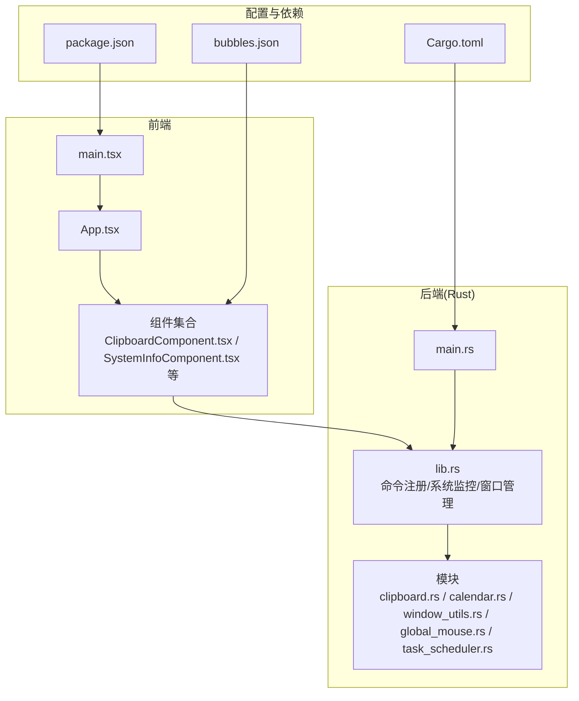
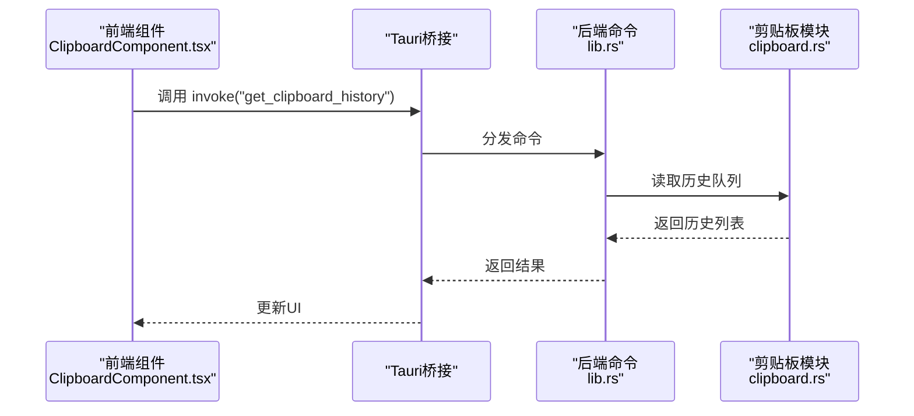
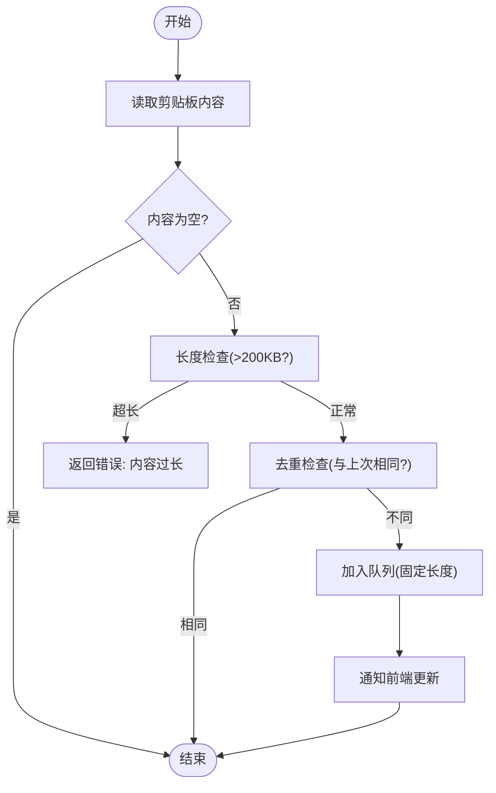
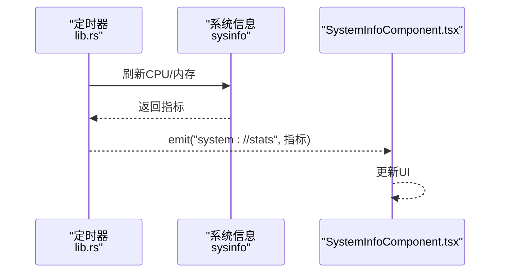
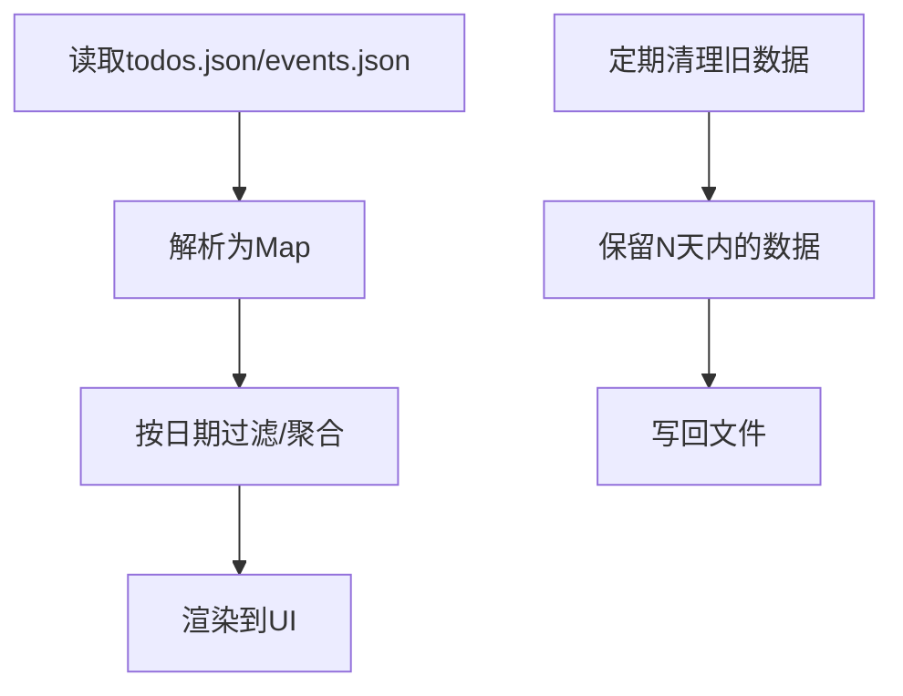
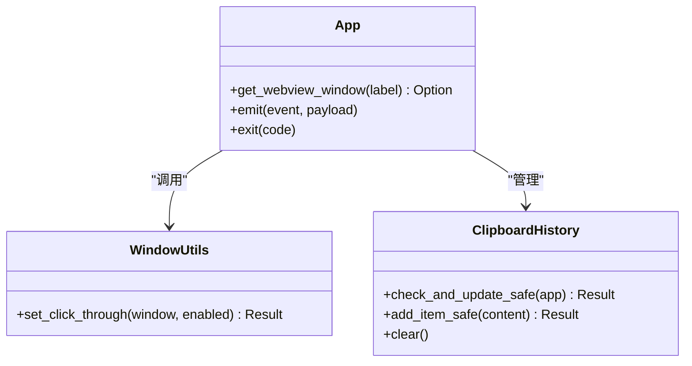
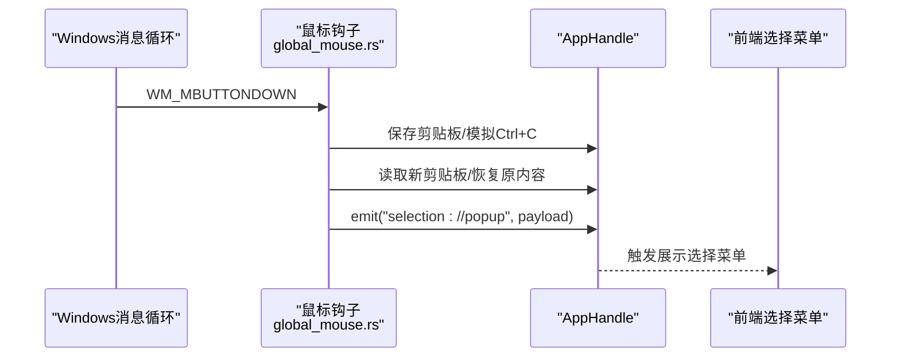
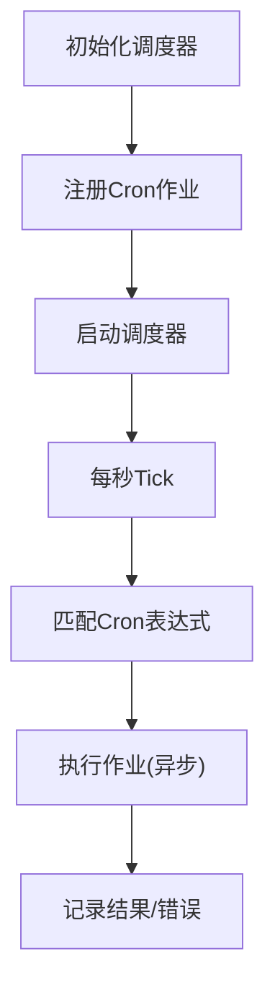
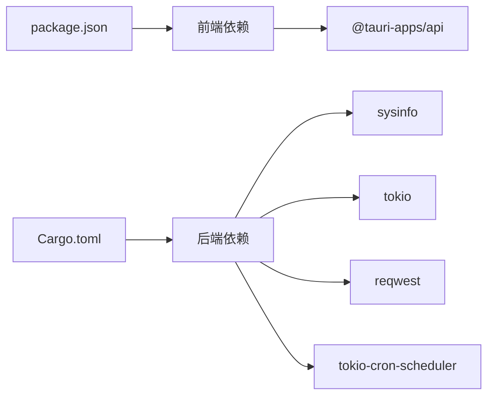

# 内存溢出和崩溃

<cite>
**本文引用的文件**
- [README.md](file://README.md)
- [package.json](file://package.json)
- [Cargo.toml](file://src-tauri/Cargo.toml)
- [main.rs](file://src-tauri/src/main.rs)
- [lib.rs](file://src-tauri/src/lib.rs)
- [clipboard.rs](file://src-tauri/src/clipboard.rs)
- [calendar.rs](file://src-tauri/src/calendar.rs)
- [window_utils.rs](file://src-tauri/src/window_utils.rs)
- [global_mouse.rs](file://src-tauri/src/global_mouse.rs)
- [task_scheduler.rs](file://src-tauri/src/task_scheduler.rs)
- [App.tsx](file://src/App.tsx)
- [main.tsx](file://src/main.tsx)
- [ClipboardComponent.tsx](file://src/components/ClipboardComponent.tsx)
- [SystemInfoComponent.tsx](file://src/components/SystemInfoComponent.tsx)
- [bubbles.json](file://public/config/bubbles.json)
</cite>

## 目录
1. [简介](#简介)
2. [项目结构](#项目结构)
3. [核心组件](#核心组件)
4. [架构总览](#架构总览)
5. [详细组件分析](#详细组件分析)
6. [依赖关系分析](#依赖关系分析)
7. [性能考量](#性能考量)
8. [故障排除指南](#故障排除指南)
9. [结论](#结论)
10. [附录](#附录)

## 简介
本指南面向开发者与运维人员，围绕内存溢出与应用崩溃的故障排除提供系统化方法。结合代码库现状，重点覆盖以下方面：
- 内存泄漏识别：内存使用持续增长、垃圾回收频繁触发等现象的分析思路
- 崩溃日志分析：堆栈跟踪解读、异常类型识别、崩溃点定位
- 大数据处理的内存压力：剪贴板历史、日历数据等场景的优化策略
- 系统资源监控：内存使用率监控、进程资源消耗分析
- 预防性措施与最佳实践：内存池管理、资源及时释放、大对象处理

## 项目结构
该项目采用前端 React + TypeScript、后端 Rust + Tauri 的双层架构，功能模块以组件形式组织，后端通过 Tauri 命令暴露系统能力与业务逻辑。

**图表来源**
- [App.tsx:18-58](file://src/App.tsx#L18-L58)
- [main.tsx:1-10](file://src/main.tsx#L1-L10)
- [main.rs:8-10](file://src-tauri/src/main.rs#L8-L10)
- [lib.rs:948-1119](file://src-tauri/src/lib.rs#L948-L1119)
- [clipboard.rs:1-251](file://src-tauri/src/clipboard.rs#L1-L251)
- [calendar.rs:1-363](file://src-tauri/src/calendar.rs#L1-L363)
- [window_utils.rs:1-33](file://src-tauri/src/window_utils.rs#L1-L33)
- [global_mouse.rs:1-149](file://src-tauri/src/global_mouse.rs#L1-L149)
- [task_scheduler.rs:1-93](file://src-tauri/src/task_scheduler.rs#L1-L93)
- [package.json:1-29](file://package.json#L1-L29)
- [Cargo.toml:1-44](file://src-tauri/Cargo.toml#L1-L44)
- [bubbles.json:1-52](file://public/config/bubbles.json#L1-L52)

**章节来源**
- [README.md:129-168](file://README.md#L129-L168)
- [package.json:1-29](file://package.json#L1-L29)
- [Cargo.toml:1-44](file://src-tauri/Cargo.toml#L1-L44)

## 核心组件
- 剪贴板管理：后端维护固定长度的历史队列，前端周期性拉取并渲染
- 系统信息监控：后端定时采集 CPU/内存，前端订阅事件实时展示
- 日历数据：前后端均使用文件持久化，支持待办与事件的增删改查
- 窗口管理：按需创建/销毁功能窗口，避免常驻窗口造成资源占用
- 全局鼠标钩子：Windows 平台通过系统钩子捕获中键点击，避免阻塞主线程

**章节来源**
- [clipboard.rs:14-122](file://src-tauri/src/clipboard.rs#L14-L122)
- [SystemInfoComponent.tsx:13-26](file://src/components/SystemInfoComponent.tsx#L13-L26)
- [lib.rs:1042-1110](file://src-tauri/src/lib.rs#L1042-L1110)
- [calendar.rs:83-141](file://src-tauri/src/calendar.rs#L83-L141)
- [global_mouse.rs:111-149](file://src-tauri/src/global_mouse.rs#L111-L149)

## 架构总览
前端通过 Tauri 的 invoke 与后端命令交互；后端通过插件与系统能力对接，并在后台线程中执行定时任务与系统监控。

**图表来源**
- [ClipboardComponent.tsx:23-32](file://src/components/ClipboardComponent.tsx#L23-L32)
- [lib.rs:956-1003](file://src-tauri/src/lib.rs#L956-L1003)
- [clipboard.rs:124-134](file://src-tauri/src/clipboard.rs#L124-L134)

## 详细组件分析

### 剪贴板历史组件（内存压力与泄漏风险）
- 历史容量控制：后端使用固定长度队列，限制最大条目数，避免无限增长
- 内容长度校验：对新增内容长度进行上限检查，防止超大文本导致内存峰值
- 前端轮询：前端以固定间隔拉取历史，避免一次性加载全部历史
- 锁竞争：后端使用互斥锁保护共享状态，注意避免长时间持有锁

**图表来源**
- [clipboard.rs:84-122](file://src-tauri/src/clipboard.rs#L84-L122)
- [clipboard.rs:29-82](file://src-tauri/src/clipboard.rs#L29-L82)

**章节来源**
- [clipboard.rs:14-122](file://src-tauri/src/clipboard.rs#L14-L122)
- [ClipboardComponent.tsx:17-32](file://src/components/ClipboardComponent.tsx#L17-L32)

### 系统信息监控（内存使用率与CPU监控）
- 后端定时采集：每秒刷新一次系统状态并通过事件推送前端
- 前端订阅：组件监听系统事件，实时更新内存使用率与可用内存
- 资源阈值：当内存使用率超过阈值时，建议触发降载或告警

**图表来源**
- [lib.rs:1042-1068](file://src-tauri/src/lib.rs#L1042-L1068)
- [SystemInfoComponent.tsx:16-26](file://src/components/SystemInfoComponent.tsx#L16-L26)

**章节来源**
- [lib.rs:41-72](file://src-tauri/src/lib.rs#L41-L72)
- [SystemInfoComponent.tsx:28-41](file://src/components/SystemInfoComponent.tsx#L28-L41)

### 日历数据（待办与事件的持久化）
- 文件存储：待办与事件分别存储为 JSON，键为日期字符串
- 清理策略：提供清理旧数据的接口，按天数阈值裁剪历史
- 大对象处理：建议对超大 JSON 进行分片或延迟加载

**图表来源**
- [calendar.rs:98-141](file://src-tauri/src/calendar.rs#L98-L141)
- [calendar.rs:324-361](file://src-tauri/src/calendar.rs#L324-L361)

**章节来源**
- [calendar.rs:83-141](file://src-tauri/src/calendar.rs#L83-L141)
- [calendar.rs:324-361](file://src-tauri/src/calendar.rs#L324-L361)

### 窗口管理与资源释放
- 窗口生命周期：窗口关闭即销毁实例，避免悬挂句柄
- 点击穿透：可通过工具函数切换窗口穿透模式，降低输入事件开销
- 窗口标签：使用唯一标签区分不同功能窗口，便于管理与回收

**图表来源**
- [window_utils.rs:9-32](file://src-tauri/src/window_utils.rs#L9-L32)
- [lib.rs:948-1119](file://src-tauri/src/lib.rs#L948-L1119)
- [clipboard.rs:20-122](file://src-tauri/src/clipboard.rs#L20-L122)

**章节来源**
- [window_utils.rs:9-32](file://src-tauri/src/window_utils.rs#L9-L32)
- [lib.rs:948-1119](file://src-tauri/src/lib.rs#L948-L1119)

### 全局鼠标钩子（Windows）
- 钩子线程：在独立线程中安装系统钩子，避免阻塞主线程
- 事件处理：捕获中键点击，模拟 Ctrl+C 获取选中文本，恢复剪贴板并发射事件
- 资源释放：线程退出时卸载钩子，防止句柄泄漏

**图表来源**
- [global_mouse.rs:30-69](file://src-tauri/src/global_mouse.rs#L30-L69)
- [global_mouse.rs:111-149](file://src-tauri/src/global_mouse.rs#L111-L149)

**章节来源**
- [global_mouse.rs:1-149](file://src-tauri/src/global_mouse.rs#L1-L149)

### 定时任务调度（内存与CPU影响）
- 调度器：基于 cron 表达式的异步作业调度器
- 作业频率：默认每分钟检查一次，注意在高频任务下对内存与网络的影响
- 异常隔离：作业内部错误被捕获并记录，避免影响调度器运行

**图表来源**
- [task_scheduler.rs:21-61](file://src-tauri/src/task_scheduler.rs#L21-L61)
- [task_scheduler.rs:82-93](file://src-tauri/src/task_scheduler.rs#L82-L93)

**章节来源**
- [task_scheduler.rs:1-93](file://src-tauri/src/task_scheduler.rs#L1-L93)

## 依赖关系分析
- 前端依赖：React、@tauri-apps/api、插件（fs、dialog、opener）
- 后端依赖：tauri、sysinfo、tokio、reqwest、serde、tokio-cron-scheduler 等
- 插件生态：clipboard-manager、fs、dialog、opener 等

**图表来源**
- [package.json:12-19](file://package.json#L12-L19)
- [Cargo.toml:15-35](file://src-tauri/Cargo.toml#L15-L35)

**章节来源**
- [package.json:1-29](file://package.json#L1-L29)
- [Cargo.toml:1-44](file://src-tauri/Cargo.toml#L1-L44)

## 性能考量
- 剪贴板监控：后端每 5 秒检查一次，前端每 2 秒拉取一次，建议在高负载场景下调大间隔
- 系统监控：每秒采集一次，建议在 UI 不可见时降低频率或停止采集
- 大对象处理：对超长文本进行截断或懒加载，避免一次性渲染
- 窗口管理：避免同时打开过多功能窗口，必要时合并窗口或延迟创建
- 网络请求：对外部 API 的调用应设置合理的超时与重试策略，避免连接泄漏

[本节为通用指导，无需列出具体文件来源]

## 故障排除指南

### 一、内存泄漏识别与分析
- 现象特征
  - 内存使用持续增长：观察系统监控中的内存使用率曲线
  - 垃圾回收频繁触发：GC 时间占比上升、卡顿明显
- 快速定位
  - 剪贴板历史：确认历史条目数量是否超过预期上限
  - 日历数据：检查 todos.json/events.json 是否过大
  - 前端组件：排查是否存在未清理的定时器、事件监听器
- 诊断步骤
  - 启用系统监控，记录内存使用率与可用内存
  - 逐步禁用功能模块，缩小问题范围
  - 检查后端日志中“剪贴板检查失败”等错误信息

**章节来源**
- [SystemInfoComponent.tsx:13-26](file://src/components/SystemInfoComponent.tsx#L13-L26)
- [clipboard.rs:59-70](file://src-tauri/src/clipboard.rs#L59-L70)
- [calendar.rs:324-361](file://src-tauri/src/calendar.rs#L324-L361)

### 二、崩溃日志分析技巧
- 崩溃点定位
  - 后端：关注 lib.rs 中的错误返回与日志输出
  - 前端：检查组件生命周期与事件处理中的异常
- 堆栈跟踪解读
  - Rust 层：定位到具体模块与函数（如 clipboard.rs、calendar.rs）
  - JS 层：定位到组件与事件绑定位置（如 ClipboardComponent.tsx）
- 常见异常类型
  - 资源访问失败：文件读写、网络请求错误
  - 状态锁失败：互斥锁获取失败或死锁
  - 窗口句柄失效：窗口被提前销毁导致操作失败

**章节来源**
- [lib.rs:1074-1110](file://src-tauri/src/lib.rs#L1074-L1110)
- [clipboard.rs:30-37](file://src-tauri/src/clipboard.rs#L30-L37)
- [calendar.rs:98-113](file://src-tauri/src/calendar.rs#L98-L113)

### 三、大数据处理的内存压力优化
- 剪贴板历史
  - 控制最大条目数与单条内容长度
  - 前端按需加载，避免一次性渲染大量历史项
- 日历数据
  - 使用清理策略定期删除旧数据
  - 对超大 JSON 进行分页或懒加载
- 窗口与事件
  - 合理设置窗口标签与生命周期
  - 及时移除不再使用的事件监听器

**章节来源**
- [clipboard.rs:14-122](file://src-tauri/src/clipboard.rs#L14-L122)
- [calendar.rs:324-361](file://src-tauri/src/calendar.rs#L324-L361)
- [ClipboardComponent.tsx:17-32](file://src/components/ClipboardComponent.tsx#L17-L32)

### 四、系统资源监控工具使用
- 内存使用率监控
  - 使用系统自带的任务管理器或性能监视器
  - 在应用中启用系统监控组件，实时查看内存使用
- 进程资源消耗分析
  - 关注 CPU 占用、线程数、句柄数
  - 在高负载场景下降低采集频率或暂停非关键任务

**章节来源**
- [SystemInfoComponent.tsx:52-134](file://src/components/SystemInfoComponent.tsx#L52-L134)
- [lib.rs:1042-1068](file://src-tauri/src/lib.rs#L1042-L1068)

### 五、预防性措施与最佳实践
- 内存池管理
  - 对频繁分配的大对象进行复用或缓存
  - 控制集合大小，避免无限增长
- 资源及时释放
  - 窗口关闭时彻底销毁
  - 释放互斥锁与系统钩子
- 大对象处理
  - 截断或分页展示超长文本
  - 异步处理与进度反馈
- 网络与IO
  - 设置超时与重试
  - 使用流式处理减少内存峰值

**章节来源**
- [window_utils.rs:9-32](file://src-tauri/src/window_utils.rs#L9-L32)
- [global_mouse.rs:111-149](file://src-tauri/src/global_mouse.rs#L111-L149)
- [task_scheduler.rs:21-61](file://src-tauri/src/task_scheduler.rs#L21-L61)

## 结论
本指南基于代码库的实际实现，提供了从内存监控、大数据处理到窗口管理与定时任务的全链路优化建议。通过合理控制数据规模、及时释放资源、降低采集频率与优化事件处理，可有效缓解内存压力与崩溃风险。建议在开发与运维流程中持续监控系统指标，并结合本文提供的方法进行针对性优化。

[本节为总结性内容，无需列出具体文件来源]

## 附录
- 功能菜单配置：用于控制功能入口与行为
- 项目脚本：开发与构建命令参考

**章节来源**
- [bubbles.json:1-52](file://public/config/bubbles.json#L1-L52)
- [package.json:6-11](file://package.json#L6-L11)