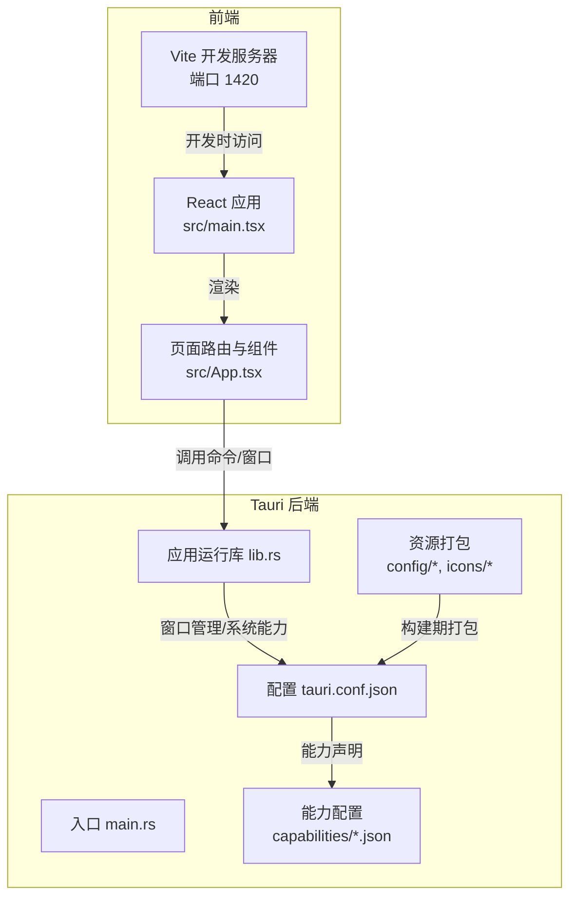
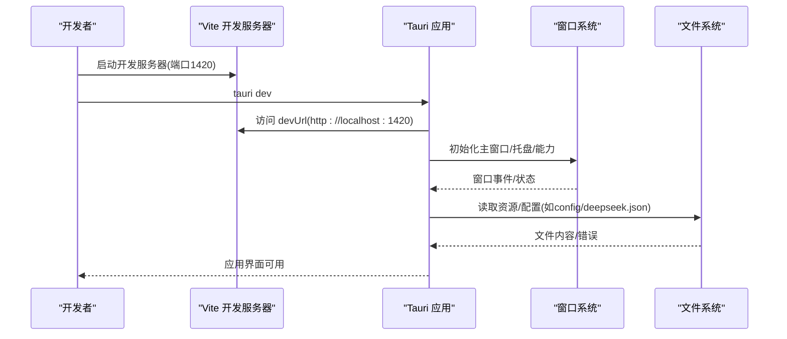
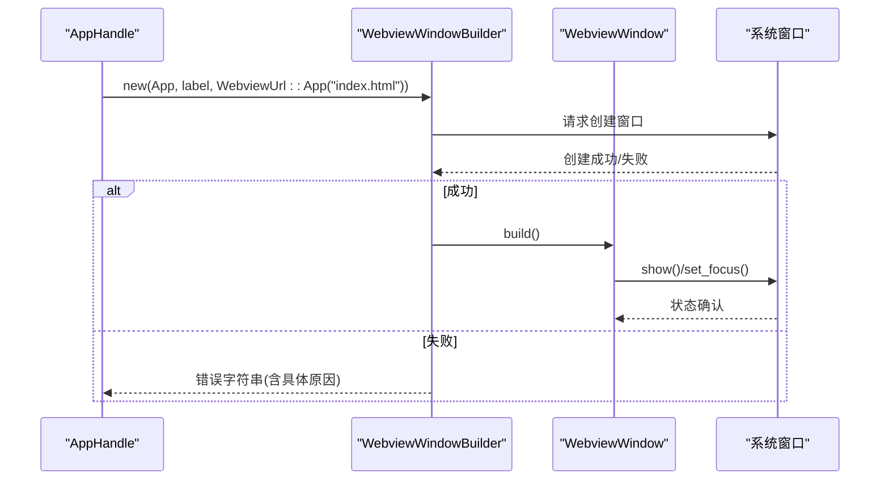
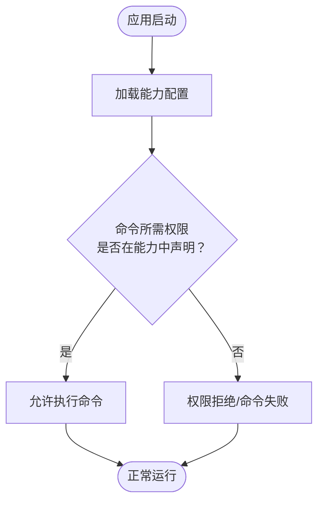
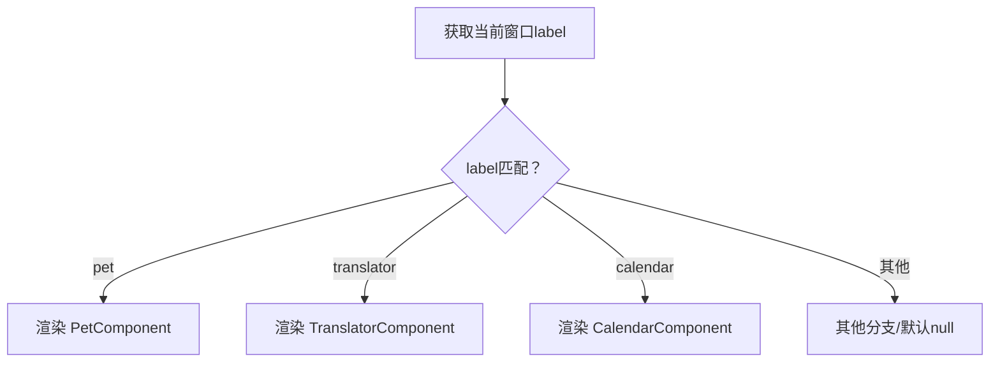
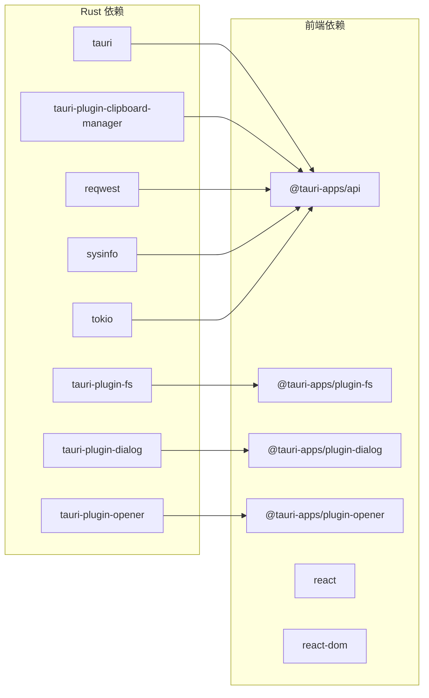
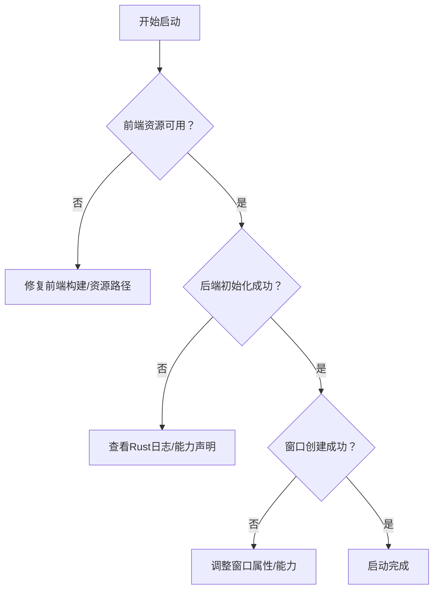

# 启动失败

<cite>
**本文引用的文件**
- [Cargo.toml](file://src-tauri/Cargo.toml)
- [tauri.conf.json](file://src-tauri/tauri.conf.json)
- [main.rs](file://src-tauri/src/main.rs)
- [lib.rs](file://src-tauri/src/lib.rs)
- [package.json](file://package.json)
- [main.tsx](file://src/main.tsx)
- [vite.config.ts](file://vite.config.ts)
- [tauri.conf.dev.json](file://src-tauri/tauri.conf.dev.json)
- [build.rs](file://src-tauri/build.rs)
- [default.json](file://src-tauri/capabilities/default.json)
- [main-capability.json](file://src-tauri/capabilities/main.json)
- [deepseek.json](file://src-tauri/config/deepseek.json)
- [bubbles.json](file://public/config/bubbles.json)
- [App.tsx](file://src/App.tsx)
</cite>

## 目录
1. [简介](#简介)
2. [项目结构](#项目结构)
3. [核心组件](#核心组件)
4. [架构总览](#架构总览)
5. [详细组件分析](#详细组件分析)
6. [依赖关系分析](#依赖关系分析)
7. [性能考虑](#性能考虑)
8. [故障排除指南](#故障排除指南)
9. [结论](#结论)
10. [附录](#附录)

## 简介
本指南面向Tauri应用“桌面宠物”的启动失败问题，提供系统化的诊断与修复流程。内容覆盖前端组件加载失败、后端服务初始化异常、窗口创建失败等常见症状；涵盖启动日志分析技巧（Tauri后端日志、Vite开发服务器日志、前端控制台错误）、资源文件缺失、权限问题、依赖冲突、配置文件错误、环境变量缺失、系统兼容性问题等场景的诊断步骤与修复方案。

## 项目结构
该应用采用典型的Tauri + React + Vite架构：前端通过Vite在开发模式下提供静态资源与热更新，Tauri负责原生窗口、系统集成与插件能力；构建时由Tauri打包前端产物为应用内资源。

图表来源
- [main.tsx:1-10](file://src/main.tsx#L1-L10)
- [App.tsx:18-58](file://src/App.tsx#L18-L58)
- [main.rs:8-10](file://src-tauri/src/main.rs#L8-L10)
- [lib.rs:780-800](file://src-tauri/src/lib.rs#L780-L800)
- [tauri.conf.json:1-74](file://src-tauri/tauri.conf.json#L1-L74)
- [vite.config.ts:16-31](file://vite.config.ts#L16-L31)

章节来源
- [package.json:6-11](file://package.json#L6-L11)
- [vite.config.ts:8-32](file://vite.config.ts#L8-L32)
- [tauri.conf.json:6-11](file://src-tauri/tauri.conf.json#L6-L11)

## 核心组件
- 前端入口与渲染
  - React根节点挂载于index.html的root容器，应用根据当前窗口label动态选择渲染组件。
- Tauri入口与运行库
  - 入口调用运行库以初始化窗口、托盘、命令注册与能力声明。
- 构建与开发配置
  - Vite固定端口1420用于开发；Tauri配置声明开发URL、构建前置命令与前端产物目录。
- 能力与权限
  - 通过capabilities声明窗口创建、窗口属性设置、文件系统、对话框、剪贴板等权限。
- 资源与打包
  - 构建期将config目录资源打包进应用，运行时可按资源路径读取。

章节来源
- [main.tsx:5-9](file://src/main.tsx#L5-L9)
- [App.tsx:18-58](file://src/App.tsx#L18-L58)
- [main.rs:8-10](file://src-tauri/src/main.rs#L8-L10)
- [lib.rs:780-800](file://src-tauri/src/lib.rs#L780-L800)
- [tauri.conf.json:6-11](file://src-tauri/tauri.conf.json#L6-L11)
- [default.json:6-10](file://src-tauri/capabilities/default.json#L6-L10)
- [main-capability.json:6-38](file://src-tauri/capabilities/main.json#L6-L38)

## 架构总览
启动链路自上而下分为三层：前端开发服务器、Tauri应用层、系统层（窗口、托盘、文件系统）。开发模式下，前端由Vite托管；生产模式下，前端产物被打包为应用内资源，Tauri通过Webview加载。

图表来源
- [vite.config.ts:16-26](file://vite.config.ts#L16-L26)
- [tauri.conf.dev.json:2-7](file://src-tauri/tauri.conf.dev.json#L2-L7)
- [tauri.conf.json:12-51](file://src-tauri/tauri.conf.json#L12-L51)
- [lib.rs:780-800](file://src-tauri/src/lib.rs#L780-L800)

## 详细组件分析

### 组件A：窗口创建与初始化
- 关键点
  - 主窗口与通知窗口在配置中声明；窗口创建通过WebviewWindowBuilder进行，支持透明、无装饰、置顶等属性。
  - 创建/显示/聚焦失败会返回明确错误字符串，便于定位。
- 常见失败场景
  - 窗口属性冲突（如透明+无装饰在某些平台限制）
  - 资源路径不可用导致初始脚本注入失败
  - 权限不足导致窗口创建被系统拦截
- 诊断要点
  - 检查窗口配置项与平台兼容性
  - 查看命令返回的错误字符串
  - 确认前端index.html存在且可被Webview加载

图表来源
- [lib.rs:88-112](file://src-tauri/src/lib.rs#L88-L112)
- [lib.rs:133-160](file://src-tauri/src/lib.rs#L133-L160)
- [lib.rs:181-209](file://src-tauri/src/lib.rs#L181-L209)
- [lib.rs:654-676](file://src-tauri/src/lib.rs#L654-L676)

章节来源
- [tauri.conf.json:13-43](file://src-tauri/tauri.conf.json#L13-L43)
- [lib.rs:88-112](file://src-tauri/src/lib.rs#L88-L112)
- [lib.rs:133-160](file://src-tauri/src/lib.rs#L133-L160)
- [lib.rs:181-209](file://src-tauri/src/lib.rs#L181-L209)
- [lib.rs:654-676](file://src-tauri/src/lib.rs#L654-L676)

### 组件B：能力与权限声明
- 关键点
  - 能力文件声明了窗口创建、窗口属性修改、文件系统读写、对话框、剪贴板等权限。
  - 安全策略通过capabilities与CSP配置共同约束。
- 常见失败场景
  - 缺少必要权限导致命令调用被拦截
  - 能力范围不匹配导致窗口创建失败
- 诊断要点
  - 对照命令所需的权限，核对对应能力文件
  - 确认安全策略未过度限制

图表来源
- [main-capability.json:6-38](file://src-tauri/capabilities/main.json#L6-L38)
- [default.json:6-10](file://src-tauri/capabilities/default.json#L6-L10)
- [tauri.conf.json:44-51](file://src-tauri/tauri.conf.json#L44-L51)

章节来源
- [main-capability.json:6-38](file://src-tauri/capabilities/main.json#L6-L38)
- [default.json:6-10](file://src-tauri/capabilities/default.json#L6-L10)
- [tauri.conf.json:44-51](file://src-tauri/tauri.conf.json#L44-L51)

### 组件C：前端组件路由与窗口标签
- 关键点
  - App根据当前窗口label选择渲染对应组件，确保每个窗口标签都有对应的组件分支。
- 常见失败场景
  - 新增窗口但未在App中添加对应分支，导致渲染为空
  - 窗口标签命名不一致导致无法正确匹配
- 诊断要点
  - 对照窗口创建处的label，逐项检查App中的分支
  - 确保index.html存在且可被Webview加载

图表来源
- [App.tsx:18-58](file://src/App.tsx#L18-L58)

章节来源
- [App.tsx:18-58](file://src/App.tsx#L18-L58)

### 组件D：开发服务器与构建配置
- 关键点
  - Vite固定端口1420，严格端口模式；开发时忽略src-tauri目录监听。
  - Tauri配置声明devUrl、beforeDevCommand、beforeBuildCommand与frontendDist。
- 常见失败场景
  - 端口被占用导致开发服务器无法启动
  - 前端构建产物未生成或路径不正确
- 诊断要点
  - 检查端口占用与防火墙
  - 确认构建脚本与输出目录一致

章节来源
- [vite.config.ts:14-31](file://vite.config.ts#L14-L31)
- [tauri.conf.dev.json:2-7](file://src-tauri/tauri.conf.dev.json#L2-L7)
- [tauri.conf.json:6-11](file://src-tauri/tauri.conf.json#L6-L11)

## 依赖关系分析
- Rust依赖
  - Tauri核心、插件（fs、dialog、opener、clipboard-manager）与第三方库（reqwest、sysinfo、tokio等）。
- 前端依赖
  - React、@tauri-apps/api与相关插件。
- 构建依赖
  - tauri-build、vite、typescript。

图表来源
- [Cargo.toml:15-35](file://src-tauri/Cargo.toml#L15-L35)
- [package.json:12-19](file://package.json#L12-L19)

章节来源
- [Cargo.toml:15-35](file://src-tauri/Cargo.toml#L15-L35)
- [package.json:12-19](file://package.json#L12-L19)

## 性能考虑
- 窗口透明与无装饰可能带来额外绘制成本，建议仅在需要时启用。
- 异步文件读写与网络请求应避免阻塞主线程，当前实现多采用异步tokio任务。
- 资源文件过大或过多可能导致首次加载延迟，建议分包或懒加载。

## 故障排除指南

### 一、启动阶段常见症状与排查步骤

1) 前端组件加载失败
- 症状
  - 窗口空白或仅显示默认UI
- 排查清单
  - 确认index.html存在且路径正确
  - 检查App.tsx中窗口label分支是否覆盖所有窗口
  - 查看浏览器控制台是否有资源加载错误
- 修复建议
  - 补充缺失的组件分支
  - 修正资源路径或打包配置

章节来源
- [App.tsx:18-58](file://src/App.tsx#L18-L58)

2) 后端服务初始化异常
- 症状
  - 应用启动后立即崩溃或黑屏
- 排查清单
  - 查看终端输出的Rust错误栈
  - 检查托盘、窗口、能力初始化顺序
  - 核对能力文件与命令权限
- 修复建议
  - 修正能力声明或命令实现
  - 降级能力范围以验证问题定位

章节来源
- [lib.rs:780-800](file://src-tauri/src/lib.rs#L780-L800)
- [main-capability.json:6-38](file://src-tauri/capabilities/main.json#L6-L38)

3) 窗口创建失败
- 症状
  - 窗口无法创建或创建后立即消失
- 排查清单
  - 检查窗口配置项（透明、无装饰、置顶等）与平台兼容性
  - 查看命令返回的错误字符串
  - 确认index.html可被Webview加载
- 修复建议
  - 调整窗口属性组合
  - 降低权限要求或补充能力声明

章节来源
- [lib.rs:88-112](file://src-tauri/src/lib.rs#L88-L112)
- [lib.rs:133-160](file://src-tauri/src/lib.rs#L133-L160)
- [lib.rs:654-676](file://src-tauri/src/lib.rs#L654-L676)

### 二、启动日志分析技巧

1) 查看Tauri后端日志
- 方法
  - 在终端运行开发命令，观察Rust编译与运行输出
  - 在生产构建后，使用系统日志查看器或重定向stdout/stderr
- 关注点
  - 能力初始化、窗口创建、命令注册、资源读取等关键步骤的错误信息

章节来源
- [main.rs:8-10](file://src-tauri/src/main.rs#L8-L10)
- [lib.rs:780-800](file://src-tauri/src/lib.rs#L780-L800)

2) 查看前端控制台错误信息
- 方法
  - 在浏览器开发者工具中打开Network面板，确认index.html与静态资源加载
  - 在Console面板查看JavaScript错误
- 关注点
  - 跨域、CSP策略、资源路径、模块导入错误

章节来源
- [vite.config.ts:16-31](file://vite.config.ts#L16-L31)
- [tauri.conf.json:44-51](file://src-tauri/tauri.conf.json#L44-L51)

3) 查看Vite开发服务器日志
- 方法
  - 运行开发命令，观察Vite输出的编译与热更新日志
- 关注点
  - 端口占用、HMR连接、构建失败

章节来源
- [vite.config.ts:14-31](file://vite.config.ts#L14-L31)
- [tauri.conf.dev.json:2-7](file://src-tauri/tauri.conf.dev.json#L2-L7)

### 三、常见启动错误类型与修复

1) 资源文件缺失
- 症状
  - 读取配置文件或资源时报错
- 排查清单
  - 检查构建期资源打包配置
  - 确认运行时资源路径解析
- 修复建议
  - 在构建配置中加入缺失资源
  - 使用绝对资源路径或在运行时回退到默认值

章节来源
- [tauri.conf.json:54-56](file://src-tauri/tauri.conf.json#L54-L56)
- [lib.rs:369-386](file://src-tauri/src/lib.rs#L369-L386)

2) 权限问题
- 症状
  - 命令调用被拒绝或功能不可用
- 排查清单
  - 对比命令所需权限与能力声明
  - 检查CSP与安全策略
- 修复建议
  - 补充缺失的能力权限
  - 放宽CSP或调整策略

章节来源
- [main-capability.json:6-38](file://src-tauri/capabilities/main.json#L6-L38)
- [tauri.conf.json:44-51](file://src-tauri/tauri.conf.json#L44-L51)

3) 依赖冲突
- 症状
  - 构建失败或运行时崩溃
- 排查清单
  - 检查Rust/Cargo依赖版本
  - 检查前端npm依赖版本
- 修复建议
  - 升级/降级至兼容版本
  - 清理缓存并重新安装依赖

章节来源
- [Cargo.toml:15-35](file://src-tauri/Cargo.toml#L15-L35)
- [package.json:12-28](file://package.json#L12-L28)

4) 配置文件错误
- 症状
  - 无法加载配置或功能异常
- 排查清单
  - 检查配置文件格式与字段
  - 确认默认值与校验逻辑
- 修复建议
  - 修正配置字段或提供默认值
  - 增加更友好的错误提示

章节来源
- [deepseek.json:1-6](file://src-tauri/config/deepseek.json#L1-L6)
- [lib.rs:359-386](file://src-tauri/src/lib.rs#L359-L386)

5) 环境变量缺失
- 症状
  - 开发主机绑定失败或HMR异常
- 排查清单
  - 检查环境变量TAURI_DEV_HOST
- 修复建议
  - 设置正确的开发主机地址或禁用远程HMR

章节来源
- [vite.config.ts:5](file://vite.config.ts#L5)
- [tauri.conf.dev.json:2-7](file://src-tauri/tauri.conf.dev.json#L2-L7)

6) 系统兼容性问题
- 症状
  - 窗口属性在特定系统上不生效
- 排查清单
  - 检查目标平台的窗口特性支持
- 修复建议
  - 针对不同平台调整窗口属性或提供降级方案

章节来源
- [tauri.conf.json:18-27](file://src-tauri/tauri.conf.json#L18-L27)

### 四、启动失败的常见原因与解决方案

- 配置文件错误
  - tauri.conf.json中的窗口、安全、打包配置需与实际功能匹配
- 环境变量缺失
  - Tauri开发主机与端口需正确配置
- 系统兼容性问题
  - 窗口透明、无装饰等属性在不同系统上行为差异较大
- 资源文件缺失
  - 构建期未包含必要资源，运行时无法读取
- 权限问题
  - 能力声明不足导致命令调用失败
- 依赖冲突
  - 前端/后端依赖版本不兼容

章节来源
- [tauri.conf.json:12-74](file://src-tauri/tauri.conf.json#L12-L74)
- [vite.config.ts:14-31](file://vite.config.ts#L14-L31)
- [Cargo.toml:15-35](file://src-tauri/Cargo.toml#L15-L35)
- [package.json:12-28](file://package.json#L12-L28)

## 结论
启动失败通常由前端资源、后端初始化、窗口创建、权限与配置四类因素引发。建议按照“前端可见性—后端日志—能力权限—配置校验”的顺序逐步排查，并结合本指南提供的修复方案快速定位问题。对于复杂场景，可参考附录中的通用排障流程与最佳实践。

## 附录

### A. 启动失败诊断流程图

### B. 常用命令与端口
- 开发启动
  - npm run dev 或 tauri dev
- 构建打包
  - npm run build 或 tauri build
- 端口
  - Vite开发服务器：1420（严格端口）
  - HMR备用端口：1421（当指定主机时）

章节来源
- [package.json:6-11](file://package.json#L6-L11)
- [vite.config.ts:16-26](file://vite.config.ts#L16-L26)