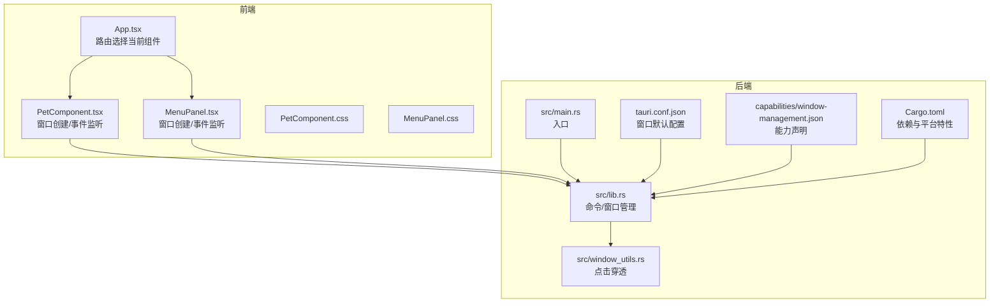
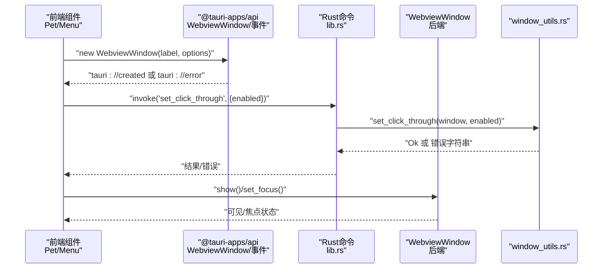
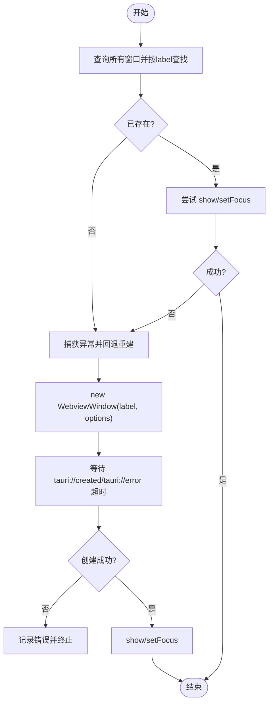
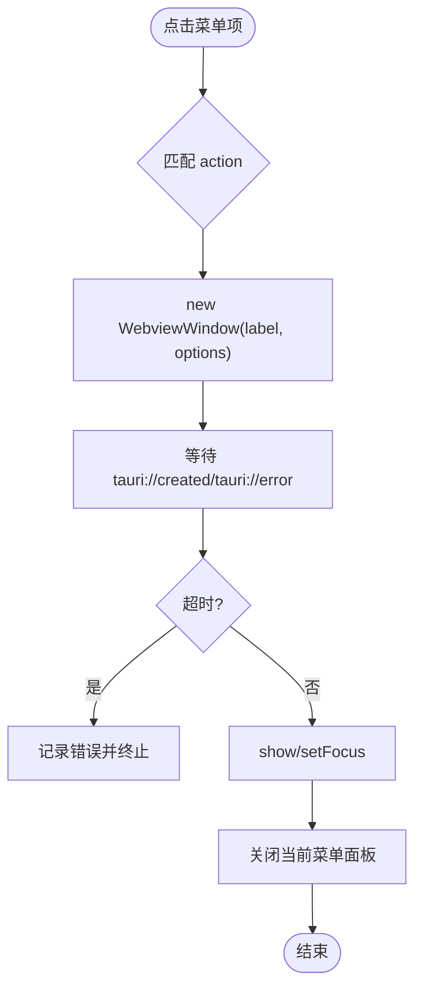
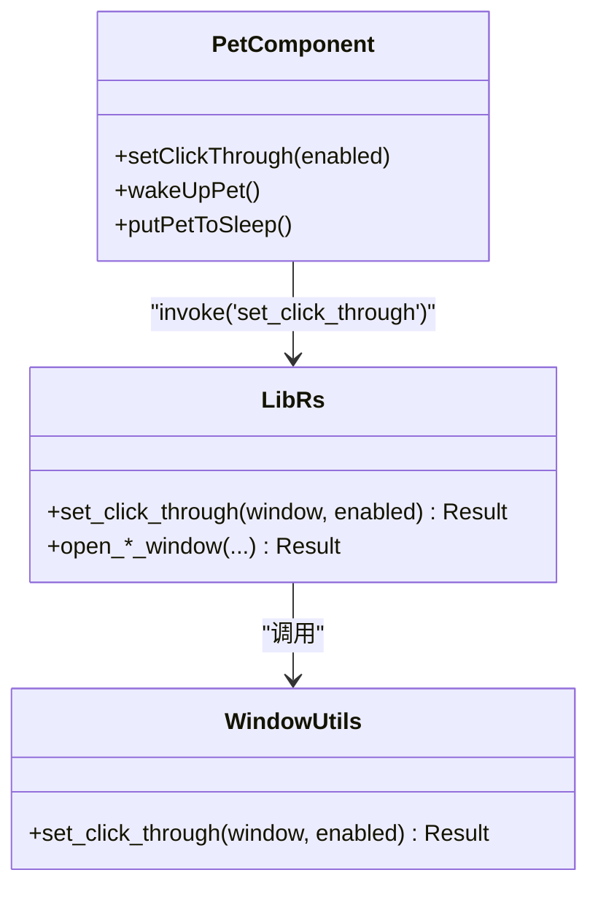
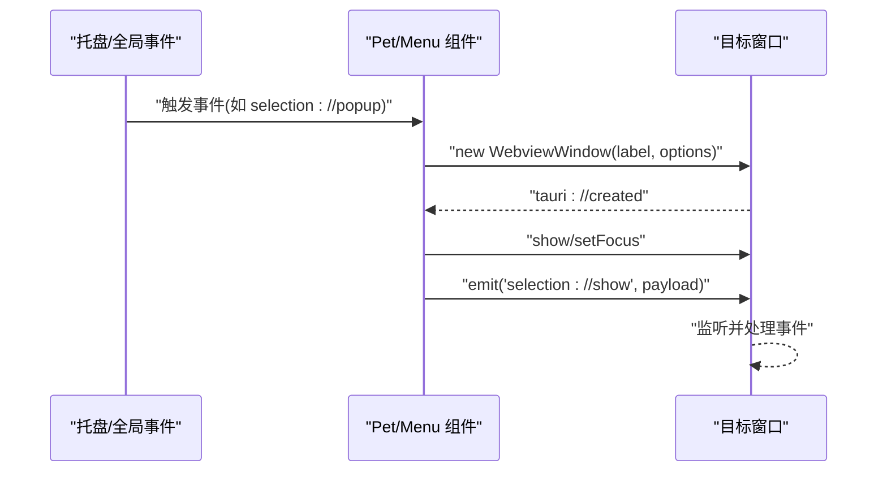
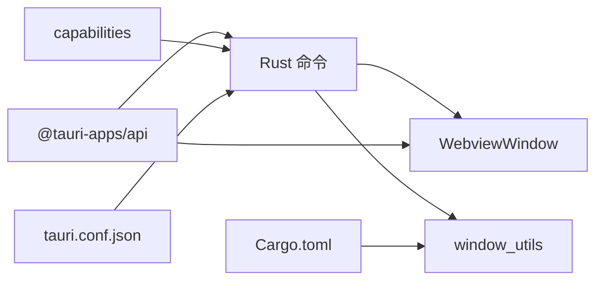

# 窗口管理错误

<cite>
**本文引用的文件**
- [src-tauri/src/main.rs](file://src-tauri/src/main.rs)
- [src-tauri/src/lib.rs](file://src-tauri/src/lib.rs)
- [src-tauri/src/window_utils.rs](file://src-tauri/src/window_utils.rs)
- [src-tauri/Cargo.toml](file://src-tauri/Cargo.toml)
- [src-tauri/tauri.conf.json](file://src-tauri/tauri.conf.json)
- [src-tauri/capabilities/window-management.json](file://src-tauri/capabilities/window-management.json)
- [src/App.tsx](file://src/App.tsx)
- [src/components/PetComponent.tsx](file://src/components/PetComponent.tsx)
- [src/components/MenuPanel.tsx](file://src/components/MenuPanel.tsx)
- [src/components/PetComponent.css](file://src/components/PetComponent.css)
- [src/components/MenuPanel.css](file://src/components/MenuPanel.css)
- [src/components/JsonCompareComponent.tsx](file://src/components/JsonCompareComponent.tsx)
</cite>

## 目录
1. [简介](#简介)
2. [项目结构](#项目结构)
3. [核心组件](#核心组件)
4. [架构总览](#架构总览)
5. [详细组件分析](#详细组件分析)
6. [依赖关系分析](#依赖关系分析)
7. [性能考量](#性能考量)
8. [故障排除指南](#故障排除指南)
9. [结论](#结论)
10. [附录](#附录)

## 简介
本指南聚焦于桌面宠物应用中的“窗口管理”相关错误与排障，涵盖以下主题：
- 多窗口创建失败与显示异常
- 窗口焦点丢失与交互失效
- 窗口生命周期管理（销毁异常、内存泄漏、资源未释放）
- 窗口间通信失败（事件传递、数据同步、状态不一致）
- 渲染问题（透明窗口异常、闪烁、尺寸计算错误）
- 最佳实践（窗口唯一性、资源清理、异常恢复）

## 项目结构
该应用采用 Tauri v2 架构，前端为 React 应用，后端 Rust 提供窗口管理与系统能力。窗口管理主要涉及：
- 前端通过 @tauri-apps/api 的 WebviewWindow 与事件系统创建/控制窗口
- 后端通过 tauri::WebviewWindow 与命令暴露能力（如点击穿透、窗口创建等）
- 能力配置通过 capabilities 控制权限范围

**图表来源**
- [src-tauri/src/main.rs:1-11](file://src-tauri/src/main.rs#L1-L11)
- [src-tauri/src/lib.rs:1-120](file://src-tauri/src/lib.rs#L1-L120)
- [src-tauri/src/window_utils.rs:1-33](file://src-tauri/src/window_utils.rs#L1-L33)
- [src-tauri/tauri.conf.json:1-74](file://src-tauri/tauri.conf.json#L1-L74)
- [src-tauri/capabilities/window-management.json:1-17](file://src-tauri/capabilities/window-management.json#L1-L17)
- [src-tauri/Cargo.toml:1-44](file://src-tauri/Cargo.toml#L1-L44)
- [src/App.tsx:1-60](file://src/App.tsx#L1-L60)
- [src/components/PetComponent.tsx:1-120](file://src/components/PetComponent.tsx#L1-L120)
- [src/components/MenuPanel.tsx:1-120](file://src/components/MenuPanel.tsx#L1-L120)

**章节来源**
- [src-tauri/src/main.rs:1-11](file://src-tauri/src/main.rs#L1-L11)
- [src-tauri/src/lib.rs:1-120](file://src-tauri/src/lib.rs#L1-L120)
- [src-tauri/tauri.conf.json:1-74](file://src-tauri/tauri.conf.json#L1-L74)
- [src-tauri/capabilities/window-management.json:1-17](file://src-tauri/capabilities/window-management.json#L1-L17)
- [src-tauri/Cargo.toml:1-44](file://src-tauri/Cargo.toml#L1-L44)
- [src/App.tsx:1-60](file://src/App.tsx#L1-L60)
- [src/components/PetComponent.tsx:1-120](file://src/components/PetComponent.tsx#L1-L120)
- [src/components/MenuPanel.tsx:1-120](file://src/components/MenuPanel.tsx#L1-L120)

## 核心组件
- 窗口创建与生命周期
  - 前端通过 WebviewWindow 创建具唯一 label 的窗口，并监听 tauri://created/tauri://error 事件进行超时与错误处理
  - 后端通过 WebviewWindowBuilder 创建窗口，支持透明、装饰、居中、可调整大小等参数
- 点击穿透与焦点
  - 通过 set_click_through 切换窗口忽略鼠标事件；Windows 平台直接修改扩展样式，非 Windows 平台调用 ignore_cursor_events
- 窗口间通信
  - 通过 emit/监听事件（如 selection://popup、translator://fill-text）实现跨窗口数据同步
- 能力与权限
  - capabilities/window-management.json 声明允许的操作（show/hide/focus/ignore-cursor-events），tauri.conf.json 中注册能力

**章节来源**
- [src/components/PetComponent.tsx:230-573](file://src/components/PetComponent.tsx#L230-L573)
- [src/components/MenuPanel.tsx:45-88](file://src/components/MenuPanel.tsx#L45-L88)
- [src-tauri/src/lib.rs:41-160](file://src-tauri/src/lib.rs#L41-L160)
- [src-tauri/src/window_utils.rs:9-32](file://src-tauri/src/window_utils.rs#L9-L32)
- [src-tauri/capabilities/window-management.json:1-17](file://src-tauri/capabilities/window-management.json#L1-L17)

## 架构总览

**图表来源**
- [src/components/PetComponent.tsx:230-573](file://src/components/PetComponent.tsx#L230-L573)
- [src-tauri/src/lib.rs:41-160](file://src-tauri/src/lib.rs#L41-L160)
- [src-tauri/src/window_utils.rs:9-32](file://src-tauri/src/window_utils.rs#L9-L32)

## 详细组件分析

### 组件A：PetComponent 窗口创建与事件监听
- 功能要点
  - 创建或显示多个窗口（main/clipboard/ai-chat/translator/calendar/jira/selection-menu/menu-panel）
  - 对每个窗口执行“存在性检查 → show/setFocus → 异常回退重建”的流程
  - 使用 tauri://created/tauri://error 超时与错误处理
  - 通过事件监听实现跨窗口交互（托盘事件、选中文本弹窗）
- 关键流程图

**图表来源**
- [src/components/PetComponent.tsx:230-573](file://src/components/PetComponent.tsx#L230-L573)

**章节来源**
- [src/components/PetComponent.tsx:230-573](file://src/components/PetComponent.tsx#L230-L573)

### 组件B：MenuPanel 窗口创建与事件监听
- 功能要点
  - 九宫格菜单项触发对应窗口创建
  - 统一的超时与错误处理逻辑
  - 通过 invoke 触发后端命令（如最小化到托盘）
- 关键流程图

**图表来源**
- [src/components/MenuPanel.tsx:45-88](file://src/components/MenuPanel.tsx#L45-L88)

**章节来源**
- [src/components/MenuPanel.tsx:45-88](file://src/components/MenuPanel.tsx#L45-L88)

### 组件C：点击穿透与焦点控制
- 功能要点
  - 前端通过 invoke 调用后端命令切换点击穿透
  - 后端在 Windows 平台直接修改扩展样式，在非 Windows 平台调用 ignore_cursor_events
- 类图

**图表来源**
- [src-tauri/src/window_utils.rs:9-32](file://src-tauri/src/window_utils.rs#L9-L32)
- [src-tauri/src/lib.rs:41-50](file://src-tauri/src/lib.rs#L41-L50)
- [src/components/PetComponent.tsx:36-62](file://src/components/PetComponent.tsx#L36-L62)

**章节来源**
- [src-tauri/src/window_utils.rs:9-32](file://src-tauri/src/window_utils.rs#L9-L32)
- [src-tauri/src/lib.rs:41-50](file://src-tauri/src/lib.rs#L41-L50)
- [src/components/PetComponent.tsx:36-62](file://src/components/PetComponent.tsx#L36-L62)

### 组件D：窗口间通信与数据同步
- 功能要点
  - 通过 listen/emit 实现事件驱动的数据同步（如 selection://popup、translator://fill-text、json://fill-text）
  - 通过 initialization_script 注入初始数据（如 __TRANSLATE_TEXT__、__JSON_TEXT__）
- 顺序图

**图表来源**
- [src/components/PetComponent.tsx:156-202](file://src/components/PetComponent.tsx#L156-L202)
- [src-tauri/src/lib.rs:115-160](file://src-tauri/src/lib.rs#L115-L160)
- [src/components/JsonCompareComponent.tsx:46-81](file://src/components/JsonCompareComponent.tsx#L46-L81)

**章节来源**
- [src/components/PetComponent.tsx:156-202](file://src/components/PetComponent.tsx#L156-L202)
- [src-tauri/src/lib.rs:115-160](file://src-tauri/src/lib.rs#L115-L160)
- [src/components/JsonCompareComponent.tsx:46-81](file://src/components/JsonCompareComponent.tsx#L46-L81)

## 依赖关系分析
- 前端依赖
  - @tauri-apps/api：窗口、事件、命令调用
  - React：组件化窗口创建与事件监听
- 后端依赖
  - tauri：窗口管理、命令系统、菜单、托盘
  - sysinfo、reqwest、tokio：系统信息、网络请求、异步调度
  - windows（Windows 平台）：窗口样式控制
- 能力与配置
  - capabilities/window-management.json：声明窗口管理权限
  - tauri.conf.json：声明默认窗口与能力注册

**图表来源**
- [src-tauri/Cargo.toml:15-44](file://src-tauri/Cargo.toml#L15-L44)
- [src-tauri/capabilities/window-management.json:1-17](file://src-tauri/capabilities/window-management.json#L1-L17)
- [src-tauri/tauri.conf.json:1-74](file://src-tauri/tauri.conf.json#L1-L74)

**章节来源**
- [src-tauri/Cargo.toml:15-44](file://src-tauri/Cargo.toml#L15-L44)
- [src-tauri/capabilities/window-management.json:1-17](file://src-tauri/capabilities/window-management.json#L1-L17)
- [src-tauri/tauri.conf.json:1-74](file://src-tauri/tauri.conf.json#L1-L74)

## 性能考量
- 窗口创建与显示
  - 使用超时与错误事件避免阻塞主线程
  - 仅在必要时重建窗口，优先复用已存在实例
- 事件监听
  - 在组件卸载时及时解绑监听，避免内存泄漏
- 渲染优化
  - 透明窗口与装饰关闭减少 GPU 开销
  - 合理使用动画与过渡，避免频繁重排

[本节为通用指导，无需具体文件引用]

## 故障排除指南

### 一、多窗口创建失败
- 症状
  - tauri://error 事件触发、创建超时、窗口不可见
- 排查步骤
  - 检查前端是否正确监听 tauri://created/tauri://error 并设置超时
  - 检查后端 WebviewWindowBuilder 参数（透明、装饰、居中、尺寸）是否合理
  - 检查 capabilities 与 tauri.conf.json 是否允许相应窗口操作
  - 若已存在同名窗口，确认 show/setFocus 是否可用，否则回退重建
- 解决方案
  - 为每个窗口设置唯一 label，避免冲突
  - 在失败时记录错误详情并重试一次重建
  - 确保前端等待 tauri://created 再执行 show/setFocus

**章节来源**
- [src/components/PetComponent.tsx:230-573](file://src/components/PetComponent.tsx#L230-L573)
- [src/components/MenuPanel.tsx:45-88](file://src/components/MenuPanel.tsx#L45-L88)
- [src-tauri/capabilities/window-management.json:1-17](file://src-tauri/capabilities/window-management.json#L1-L17)
- [src-tauri/tauri.conf.json:1-74](file://src-tauri/tauri.conf.json#L1-L74)

### 二、窗口显示异常（透明、闪烁、尺寸错误）
- 症状
  - 透明窗口渲染异常、窗口闪烁、尺寸与预期不符
- 排查步骤
  - 检查 CSS 样式（PetComponent.css/MenuPanel.css）中透明、装饰、尺寸设置
  - 确认窗口创建时 transparent/decorations/center/size 参数
  - 在 Windows 平台检查点击穿透是否影响渲染
- 解决方案
  - 确保透明窗口的背景与内容样式兼容
  - 避免频繁切换透明状态导致的重绘闪烁
  - 使用居中与固定尺寸，减少动态布局带来的尺寸误差

**章节来源**
- [src/components/PetComponent.css:1-242](file://src/components/PetComponent.css#L1-L242)
- [src/components/MenuPanel.css:1-180](file://src/components/MenuPanel.css#L1-L180)
- [src-tauri/src/lib.rs:75-112](file://src-tauri/src/lib.rs#L75-L112)
- [src-tauri/src/window_utils.rs:9-32](file://src-tauri/src/window_utils.rs#L9-L32)

### 三、窗口焦点丢失与交互失效
- 症状
  - 窗口无法获得焦点、点击穿透导致无法交互
- 排查步骤
  - 检查 set_click_through 的启用/禁用时机
  - 确认 show/setFocus 的调用顺序与返回值
  - 在 Windows 平台检查扩展样式是否正确更新
- 解决方案
  - 在用户交互时禁用点击穿透，交互结束后根据需要恢复
  - 在事件监听中确保焦点恢复逻辑可靠

**章节来源**
- [src-tauri/src/lib.rs:41-50](file://src-tauri/src/lib.rs#L41-L50)
- [src-tauri/src/window_utils.rs:9-32](file://src-tauri/src/window_utils.rs#L9-L32)
- [src/components/PetComponent.tsx:36-62](file://src/components/PetComponent.tsx#L36-L62)

### 四、窗口生命周期管理错误（销毁异常、内存泄漏、资源未释放）
- 症状
  - 窗口关闭后仍占用资源、事件监听未移除、定时器未清理
- 排查步骤
  - 检查组件卸载时是否移除了事件监听与定时器
  - 确认窗口 close 调用是否成功
- 解决方案
  - 在 useEffect 返回函数中统一解绑监听与清理定时器
  - 在窗口关闭后主动清理引用，避免循环引用

**章节来源**
- [src/components/PetComponent.tsx:191-202](file://src/components/PetComponent.tsx#L191-L202)
- [src/components/MenuPanel.tsx:30-34](file://src/components/MenuPanel.tsx#L30-L34)

### 五、窗口间通信失败（事件传递失败、数据同步异常、状态不一致）
- 症状
  - 事件未到达、数据未注入、状态不同步
- 排查步骤
  - 检查事件名称一致性（如 selection://popup、translator://fill-text）
  - 确认 initialization_script 注入时机与窗口加载顺序
  - 检查 emit 调用是否在窗口创建完成后执行
- 解决方案
  - 在窗口创建后等待 tauri://created 再 emit 数据
  - 对外部注入数据（如 __TRANSLATE_TEXT__）在使用后及时删除

**章节来源**
- [src/components/PetComponent.tsx:186-199](file://src/components/PetComponent.tsx#L186-L199)
- [src-tauri/src/lib.rs:115-160](file://src-tauri/src/lib.rs#L115-L160)
- [src/components/JsonCompareComponent.tsx:46-81](file://src/components/JsonCompareComponent.tsx#L46-L81)

### 六、最佳实践
- 窗口唯一性
  - 使用唯一 label，避免重复创建
- 资源清理
  - 卸载时移除事件监听、清理定时器、关闭窗口引用
- 异常恢复
  - 创建失败时回退重建，焦点丢失时重试 setFocus
- 渲染与交互
  - 合理使用透明与装饰，避免频繁切换导致闪烁
  - 在交互时禁用点击穿透，交互结束后恢复

[本节为通用指导，无需具体文件引用]

## 结论
本指南基于实际代码梳理了窗口管理的关键流程与常见问题，提供了从创建、显示、焦点、通信到渲染与生命周期的全链路排障方法。遵循最佳实践可显著降低窗口相关错误的发生率。

[本节为总结，无需具体文件引用]

## 附录
- 关键文件索引
  - 前端窗口创建与事件：[src/components/PetComponent.tsx:230-573](file://src/components/PetComponent.tsx#L230-L573)、[src/components/MenuPanel.tsx:45-88](file://src/components/MenuPanel.tsx#L45-L88)
  - 后端命令与窗口管理：[src-tauri/src/lib.rs:41-160](file://src-tauri/src/lib.rs#L41-L160)
  - 点击穿透实现：[src-tauri/src/window_utils.rs:9-32](file://src-tauri/src/window_utils.rs#L9-L32)
  - 能力与配置：[src-tauri/capabilities/window-management.json:1-17](file://src-tauri/capabilities/window-management.json#L1-L17)、[src-tauri/tauri.conf.json:1-74](file://src-tauri/tauri.conf.json#L1-L74)
  - 渲染样式：[src/components/PetComponent.css:1-242](file://src/components/PetComponent.css#L1-L242)、[src/components/MenuPanel.css:1-180](file://src/components/MenuPanel.css#L1-L180)

[本节为补充，无需具体文件引用]