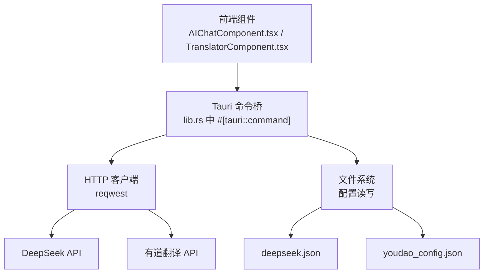
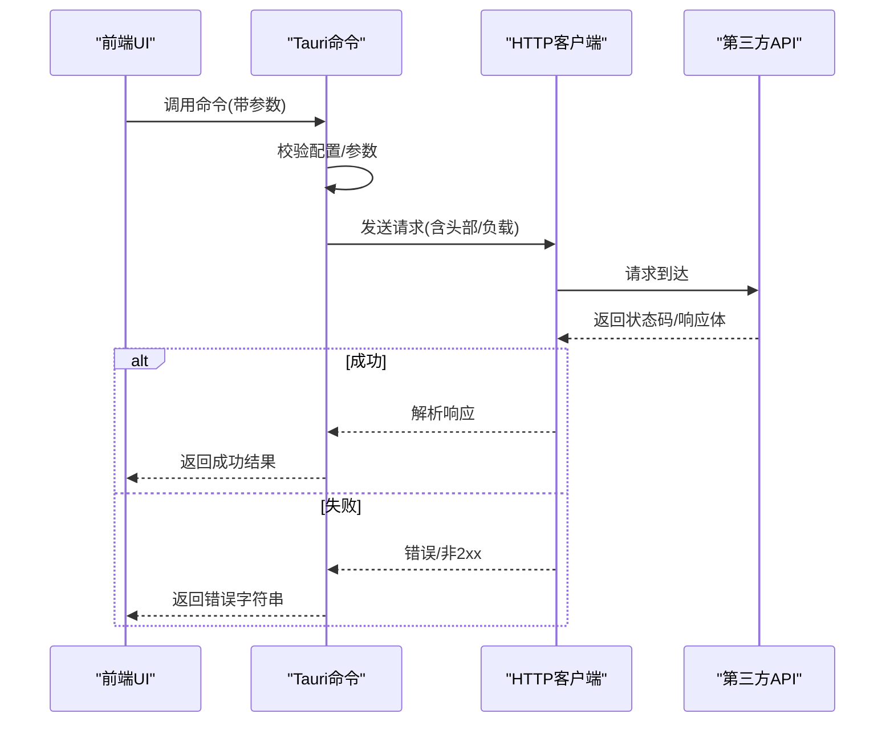
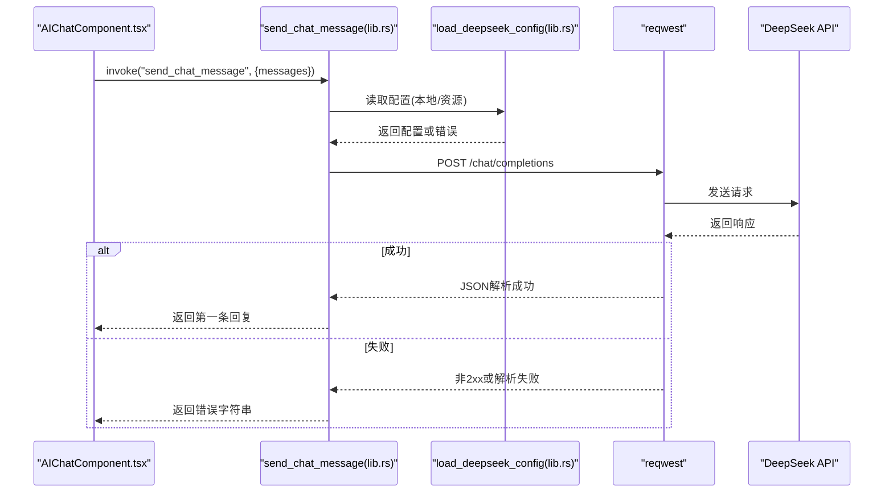
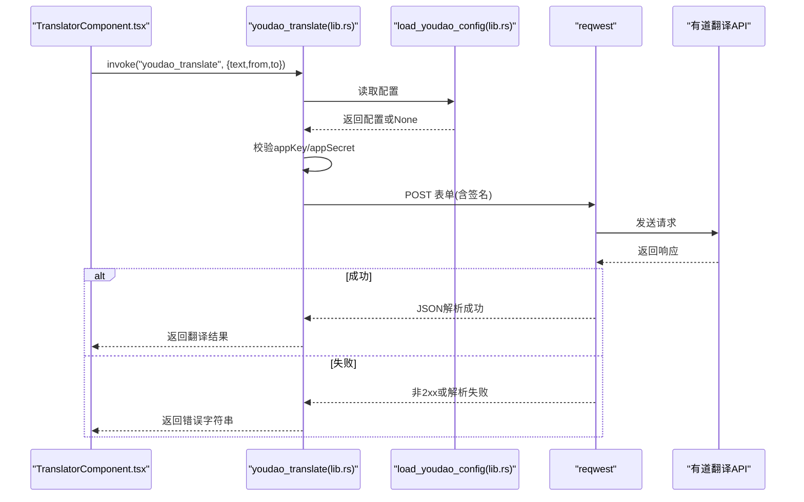
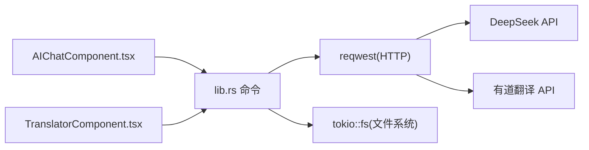

# 第三方API错误

<cite>
**本文引用的文件**
- [src-tauri/config/deepseek.json](file://src-tauri/config/deepseek.json)
- [src-tauri/src/lib.rs](file://src-tauri/src/lib.rs)
- [src-tauri/src/jira_tools.rs](file://src-tauri/src/jira_tools.rs)
- [src/components/TranslatorComponent.tsx](file://src/components/TranslatorComponent.tsx)
- [src/components/AIChatComponent.tsx](file://src/components/AIChatComponent.tsx)
- [src/App.tsx](file://src/App.tsx)
- [src-tauri/Cargo.toml](file://src-tauri/Cargo.toml)
- [README.md](file://README.md)
</cite>

## 目录
1. [简介](#简介)
2. [项目结构](#项目结构)
3. [核心组件](#核心组件)
4. [架构总览](#架构总览)
5. [详细组件分析](#详细组件分析)
6. [依赖关系分析](#依赖关系分析)
7. [性能考量](#性能考量)
8. [故障排除指南](#故障排除指南)
9. [结论](#结论)
10. [附录](#附录)

## 简介
本指南聚焦于桌面端应用中第三方API调用失败的故障排除，覆盖网络请求超时、认证失败、API限流、配置错误、网络连接异常等常见问题，并提供针对 DeepSeek API 与有道翻译 API 的具体排查策略。文档同时总结了错误处理流程、最佳实践（重试、超时、日志）以及常见网络问题的诊断方法，帮助开发者快速定位并解决问题。

## 项目结构
该应用采用前端 React + Tauri 架构，第三方API调用由 Rust 后端通过 Tauri 命令桥接发起，前端负责交互与错误提示。

图表来源
- [src-tauri/src/lib.rs:262-301](file://src-tauri/src/lib.rs#L262-L301)
- [src-tauri/src/lib.rs:478-552](file://src-tauri/src/lib.rs#L478-L552)
- [src-tauri/config/deepseek.json:1-6](file://src-tauri/config/deepseek.json#L1-L6)
- [src/components/AIChatComponent.tsx:113-115](file://src/components/AIChatComponent.tsx#L113-L115)
- [src/components/TranslatorComponent.tsx:174-178](file://src/components/TranslatorComponent.tsx#L174-L178)

章节来源
- [src-tauri/src/lib.rs:262-301](file://src-tauri/src/lib.rs#L262-L301)
- [src-tauri/src/lib.rs:478-552](file://src-tauri/src/lib.rs#L478-L552)
- [src-tauri/config/deepseek.json:1-6](file://src-tauri/config/deepseek.json#L1-L6)
- [src/components/AIChatComponent.tsx:113-115](file://src/components/AIChatComponent.tsx#L113-L115)
- [src/components/TranslatorComponent.tsx:174-178](file://src/components/TranslatorComponent.tsx#L174-L178)

## 核心组件
- AI 聊天组件（DeepSeek）
  - 负责加载本地与资源配置、发起聊天请求、处理错误与状态反馈。
- 有道翻译组件
  - 负责加载/保存有道配置、构造签名、发起翻译请求、处理错误与状态反馈。
- Tauri 命令层
  - 提供配置读写、请求转发、错误包装与返回。

章节来源
- [src/components/AIChatComponent.tsx:55-82](file://src/components/AIChatComponent.tsx#L55-L82)
- [src/components/TranslatorComponent.tsx:95-122](file://src/components/TranslatorComponent.tsx#L95-L122)
- [src-tauri/src/lib.rs:262-301](file://src-tauri/src/lib.rs#L262-L301)
- [src-tauri/src/lib.rs:478-552](file://src-tauri/src/lib.rs#L478-L552)

## 架构总览
前端通过 Tauri invoke 触发命令，Rust 层构建 HTTP 请求并处理响应；若出现错误，统一转换为字符串错误返回给前端，前端据此展示错误信息或引导用户配置。

图表来源
- [src-tauri/src/lib.rs:262-301](file://src-tauri/src/lib.rs#L262-L301)
- [src-tauri/src/lib.rs:478-552](file://src-tauri/src/lib.rs#L478-L552)
- [src/components/AIChatComponent.tsx:113-135](file://src/components/AIChatComponent.tsx#L113-L135)
- [src/components/TranslatorComponent.tsx:174-187](file://src/components/TranslatorComponent.tsx#L174-L187)

## 详细组件分析

### DeepSeek API（AI聊天）
- 配置加载策略
  - 优先加载本地配置文件；若无效则回退到资源中的配置文件。
- 请求流程
  - 组装请求体，设置 Authorization 与 Content-Type，发送至 /chat/completions。
- 错误处理
  - 非2xx状态码时，读取响应文本并拼接状态码返回。
  - JSON 解析失败时返回解析错误字符串。
- 前端交互
  - 若未配置或配置无效，前端显示“需要配置”提示并允许打开设置面板。

图表来源
- [src-tauri/src/lib.rs:262-301](file://src-tauri/src/lib.rs#L262-L301)
- [src-tauri/src/lib.rs:358-376](file://src-tauri/src/lib.rs#L358-L376)
- [src-tauri/src/lib.rs:318-355](file://src-tauri/src/lib.rs#L318-L355)
- [src/components/AIChatComponent.tsx:113-135](file://src/components/AIChatComponent.tsx#L113-L135)

章节来源
- [src-tauri/src/lib.rs:262-301](file://src-tauri/src/lib.rs#L262-L301)
- [src-tauri/src/lib.rs:318-355](file://src-tauri/src/lib.rs#L318-L355)
- [src-tauri/src/lib.rs:358-376](file://src-tauri/src/lib.rs#L358-L376)
- [src/components/AIChatComponent.tsx:55-82](file://src/components/AIChatComponent.tsx#L55-L82)
- [src/components/AIChatComponent.tsx:113-135](file://src/components/AIChatComponent.tsx#L113-L135)

### 有道翻译 API
- 配置与签名
  - 读取 appKey/appSecret/baseUrl；生成 salt 与签名；以表单形式发送。
- 请求与响应
  - POST 到 baseUrl；非2xx时返回状态码与响应文本；JSON解析失败时返回解析错误。
  - 若 errorCode 存在，按错误码提示；否则提示未知错误。
- 前端交互
  - 未配置或配置无效时，前端显示“需要配置API密钥”，并允许打开设置面板保存配置。

图表来源
- [src-tauri/src/lib.rs:478-552](file://src-tauri/src/lib.rs#L478-L552)
- [src-tauri/src/lib.rs:442-462](file://src-tauri/src/lib.rs#L442-L462)
- [src/components/TranslatorComponent.tsx:174-187](file://src/components/TranslatorComponent.tsx#L174-L187)

章节来源
- [src-tauri/src/lib.rs:478-552](file://src-tauri/src/lib.rs#L478-L552)
- [src-tauri/src/lib.rs:442-462](file://src-tauri/src/lib.rs#L442-L462)
- [src/components/TranslatorComponent.tsx:95-122](file://src/components/TranslatorComponent.tsx#L95-L122)
- [src/components/TranslatorComponent.tsx:174-187](file://src/components/TranslatorComponent.tsx#L174-L187)

### 配置文件与路径
- DeepSeek 配置
  - 本地配置文件：应用数据目录下的 deepseek_config.json。
  - 资源配置文件：resources/config/deepseek.json。
- 有道翻译配置
  - 应用数据目录下的 youdao_config.json。

章节来源
- [src-tauri/src/lib.rs:303-315](file://src-tauri/src/lib.rs#L303-L315)
- [src-tauri/src/lib.rs:465-476](file://src-tauri/src/lib.rs#L465-L476)
- [src-tauri/config/deepseek.json:1-6](file://src-tauri/config/deepseek.json#L1-L6)

## 依赖关系分析
- HTTP 客户端
  - 使用 reqwest，启用 json 与 rustls-tls 特性，确保 HTTPS 与 TLS 支持。
- 文件系统
  - 通过 tauri-plugin-fs 与 tokio::fs 进行配置文件的读写与存在性检查。
- 错误传播
  - Rust 层统一将错误转换为字符串，前端捕获并展示。

图表来源
- [src-tauri/Cargo.toml](file://src-tauri/Cargo.toml#L24)
- [src-tauri/src/lib.rs:262-301](file://src-tauri/src/lib.rs#L262-L301)
- [src-tauri/src/lib.rs:478-552](file://src-tauri/src/lib.rs#L478-L552)

章节来源
- [src-tauri/Cargo.toml:15-36](file://src-tauri/Cargo.toml#L15-L36)
- [src-tauri/src/lib.rs:262-301](file://src-tauri/src/lib.rs#L262-L301)
- [src-tauri/src/lib.rs:478-552](file://src-tauri/src/lib.rs#L478-L552)

## 性能考量
- 异步 I/O
  - 使用 tokio::fs 与 reqwest 异步读写与请求，避免阻塞主线程。
- TLS 优化
  - 启用 rustls-tls 减少 OpenSSL 依赖带来的开销与兼容性问题。
- 响应解析
  - 在非2xx时尽早短路，减少不必要的解析与传输。

章节来源
- [src-tauri/Cargo.toml](file://src-tauri/Cargo.toml#L24)
- [src-tauri/src/lib.rs:262-301](file://src-tauri/src/lib.rs#L262-L301)
- [src-tauri/src/lib.rs:478-552](file://src-tauri/src/lib.rs#L478-L552)

## 故障排除指南

### 一、网络请求超时
- 现象
  - 前端长时间无响应，最终收到“发送请求失败”的错误字符串。
- 排查步骤
  - 检查本地网络连通性与代理设置。
  - 尝试更换 DNS 或使用直连。
  - 在系统防火墙/安全软件中放行应用进程。
- 处理建议
  - 前端可增加“重试”按钮与“取消”操作，避免无界等待。
  - Rust 层可考虑引入超时配置（当前实现未显式设置超时，建议在 reqwest Client 上增加 timeout）。

章节来源
- [src-tauri/src/lib.rs:282-283](file://src-tauri/src/lib.rs#L282-L283)
- [src-tauri/src/lib.rs:527-528](file://src-tauri/src/lib.rs#L527-L528)

### 二、认证失败（API密钥无效）
- DeepSeek
  - 现象：返回“请配置有效的API Key”或“API请求失败 (401/403)”。
  - 排查：确认本地配置文件与资源配置文件中的 apiKey 是否有效且未被占位值替代。
- 有道翻译
  - 现象：返回“API密钥配置无效”或“API请求失败 (401/403)”。
  - 排查：确认 appKey 与 appSecret 是否正确，baseUrl 是否为官方域名。
- 处理建议
  - 前端在设置面板中提供“保存并测试”按钮，调用对应命令验证密钥有效性。
  - Rust 层对空值与占位值进行显式校验并返回明确错误。

章节来源
- [src-tauri/src/lib.rs:358-376](file://src-tauri/src/lib.rs#L358-L376)
- [src-tauri/src/lib.rs:486-492](file://src-tauri/src/lib.rs#L486-L492)
- [src-tauri/src/lib.rs:530-534](file://src-tauri/src/lib.rs#L530-L534)

### 三、API限流与配额不足
- 现象
  - 返回“API请求失败 (429)”或业务层面的限流错误码。
- 排查步骤
  - 查看响应体中的错误码与速率限制头（如 X-RateLimit-*）。
  - 检查账户配额与使用情况。
- 处理建议
  - 前端增加“稍后重试”提示与指数退避重试逻辑。
  - Rust 层解析响应体中的限流细节，区分临时与永久失败。

章节来源
- [src-tauri/src/lib.rs:285-289](file://src-tauri/src/lib.rs#L285-L289)
- [src-tauri/src/lib.rs:530-534](file://src-tauri/src/lib.rs#L530-L534)

### 四、请求格式校验失败
- 有道翻译
  - 现象：返回“API请求失败 (400)”或 errorCode。
  - 排查：确认 from/to 语言代码是否在支持列表内，text 是否为空。
- DeepSeek
  - 现象：返回“API请求失败 (400)”。
  - 排查：确认 messages 结构是否符合要求，model 名称是否正确。
- 处理建议
  - 前端在发送前进行参数校验与裁剪（如去空格、截断过长文本）。
  - Rust 层对必填字段进行校验并返回明确错误。

章节来源
- [src-tauri/src/lib.rs:270-274](file://src-tauri/src/lib.rs#L270-L274)
- [src-tauri/src/lib.rs:494-504](file://src-tauri/src/lib.rs#L494-L504)

### 五、响应数据解析失败
- 现象
  - 返回“解析响应失败: ...”。
- 排查步骤
  - 检查第三方API是否返回非标准 JSON。
  - 确认响应编码与 Content-Type。
- 处理建议
  - Rust 层在解析失败时记录原始响应文本，便于定位问题。
  - 前端显示“网络正常但响应异常，请稍后重试”。

章节来源
- [src-tauri/src/lib.rs:291-294](file://src-tauri/src/lib.rs#L291-L294)
- [src-tauri/src/lib.rs:537-539](file://src-tauri/src/lib.rs#L537-L539)

### 六、配置错误识别与修复
- 配置文件格式错误
  - 症状：读取配置失败或解析失败。
  - 排查：检查 JSON 语法、键名拼写、类型匹配。
- 参数缺失
  - 症状：返回“请先配置有道翻译API密钥”或“API密钥配置无效”。
  - 排查：确认 appKey、appSecret、baseUrl 是否填写完整。
- URL 格式不正确
  - 症状：请求发送失败或被重定向/拦截。
  - 排查：确认 baseUrl 为官方域名，协议为 https。
- 修复建议
  - 前端设置面板提供即时校验与示例提示。
  - Rust 层对配置文件进行严格校验并在失败时给出具体原因。

章节来源
- [src-tauri/src/lib.rs:442-462](file://src-tauri/src/lib.rs#L442-L462)
- [src-tauri/src/lib.rs:486-492](file://src-tauri/src/lib.rs#L486-L492)
- [src-tauri/src/lib.rs:332-355](file://src-tauri/src/lib.rs#L332-L355)

### 七、网络连接问题诊断
- 防火墙/代理阻断
  - 症状：超时或连接被拒绝。
  - 排查：临时关闭防火墙/代理验证；检查出站规则。
- DNS 解析失败
  - 症状：域名无法解析。
  - 排查：更换 DNS（如 8.8.8.8）、清理缓存。
- TLS 握手失败
  - 症状：证书错误或握手失败。
  - 排查：确认系统时间准确、信任根证书完整。
- 处理建议
  - 前端提供“网络诊断”入口，引导用户切换网络或代理。
  - Rust 层在错误字符串中包含状态码与摘要信息，便于定位。

章节来源
- [src-tauri/Cargo.toml](file://src-tauri/Cargo.toml#L24)
- [src-tauri/src/lib.rs:282-283](file://src-tauri/src/lib.rs#L282-L283)
- [src-tauri/src/lib.rs:527-528](file://src-tauri/src/lib.rs#L527-L528)

### 八、最佳实践
- 重试机制
  - 对瞬时网络错误与 5xx 响应进行有限次数重试，采用指数退避。
- 超时设置
  - 为 reqwest 设置合理连接与读取超时，避免长时间阻塞。
- 错误日志记录
  - Rust 层记录状态码、响应文本摘要与关键参数；前端记录用户操作与时间戳。
- 配置热更新
  - 设置面板保存后立即重新加载配置，减少配置漂移。
- 用户体验
  - 显示“正在发送/正在翻译”状态与进度指示；提供“取消/重试”按钮。

章节来源
- [src-tauri/src/lib.rs:262-301](file://src-tauri/src/lib.rs#L262-L301)
- [src-tauri/src/lib.rs:478-552](file://src-tauri/src/lib.rs#L478-L552)
- [src/components/AIChatComponent.tsx:113-135](file://src/components/AIChatComponent.tsx#L113-L135)
- [src/components/TranslatorComponent.tsx:174-187](file://src/components/TranslatorComponent.tsx#L174-L187)

## 结论
本指南基于现有代码实现了对 DeepSeek 与有道翻译 API 的错误处理与故障排除策略。建议在现有基础上补充超时配置、重试与指数退避、更详细的错误日志与网络诊断能力，以进一步提升稳定性与用户体验。

## 附录

### A. DeepSeek 配置文件位置与用途
- 本地配置：应用数据目录下的 deepseek_config.json。
- 资源配置：resources/config/deepseek.json，作为默认模板。

章节来源
- [src-tauri/src/lib.rs:303-315](file://src-tauri/src/lib.rs#L303-L315)
- [src-tauri/src/lib.rs:358-376](file://src-tauri/src/lib.rs#L358-L376)
- [src-tauri/config/deepseek.json:1-6](file://src-tauri/config/deepseek.json#L1-L6)

### B. 有道翻译配置结构
- 字段：appKey、appSecret、baseUrl。
- 作用：用于构造签名与发送请求。

章节来源
- [src/components/TranslatorComponent.tsx:7-11](file://src/components/TranslatorComponent.tsx#L7-L11)
- [src-tauri/src/lib.rs:442-462](file://src-tauri/src/lib.rs#L442-L462)

### C. 关键命令与职责
- send_chat_message：向 DeepSeek 发起聊天请求。
- load_deepseek_config/load_local_deepseek_config/save_deepseek_config：配置读写与回退策略。
- youdao_translate：有道翻译请求与签名生成。
- load_youdao_config/save_youdao_config：有道配置读写。

章节来源
- [src-tauri/src/lib.rs:262-301](file://src-tauri/src/lib.rs#L262-L301)
- [src-tauri/src/lib.rs:318-355](file://src-tauri/src/lib.rs#L318-L355)
- [src-tauri/src/lib.rs:478-552](file://src-tauri/src/lib.rs#L478-L552)
- [src-tauri/src/lib.rs:442-462](file://src-tauri/src/lib.rs#L442-L462)