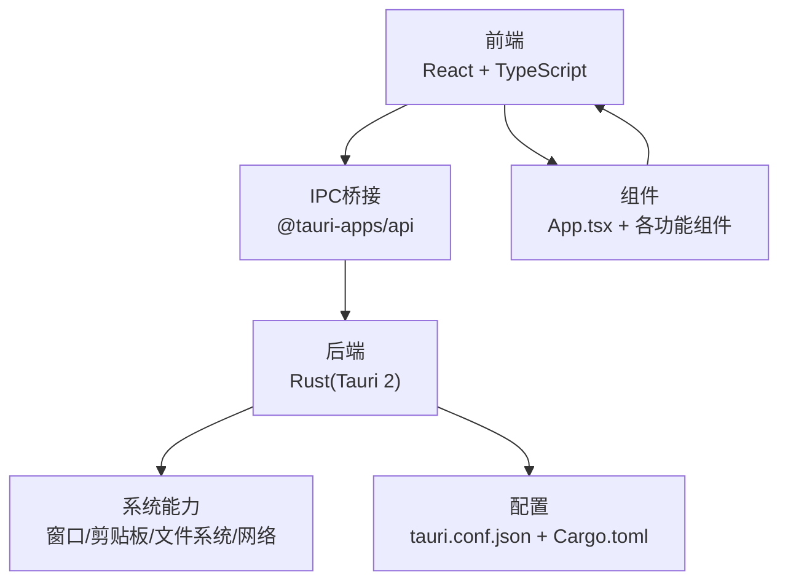
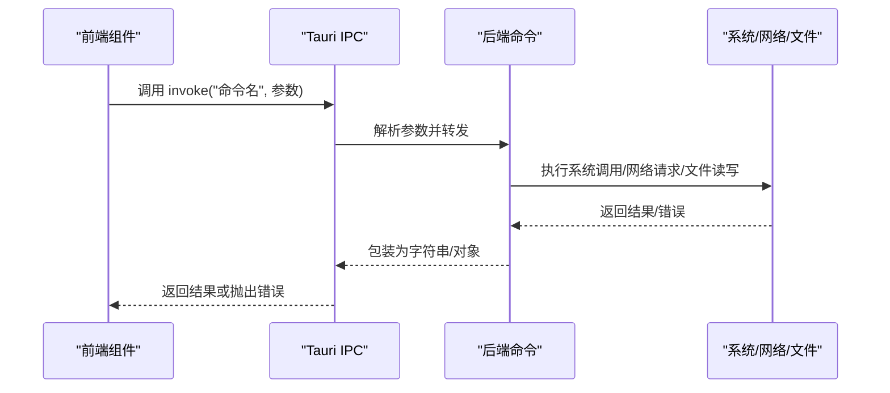
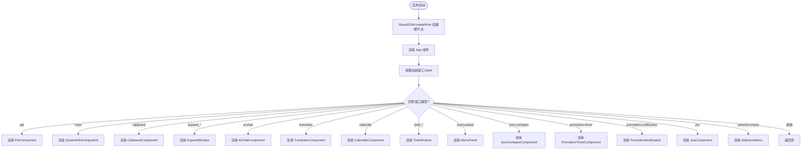
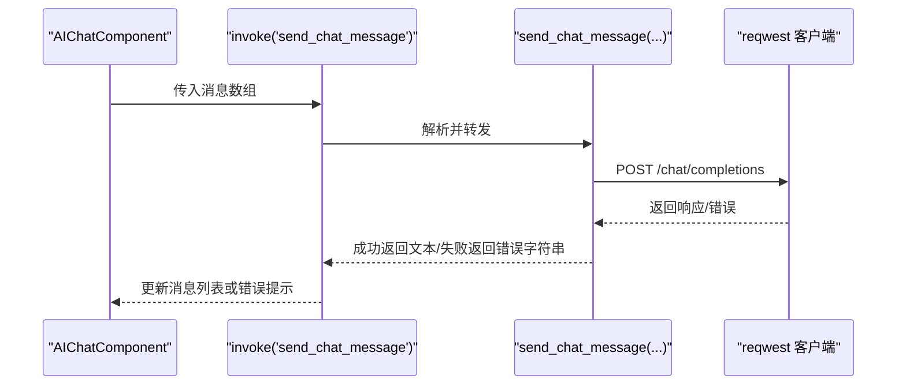
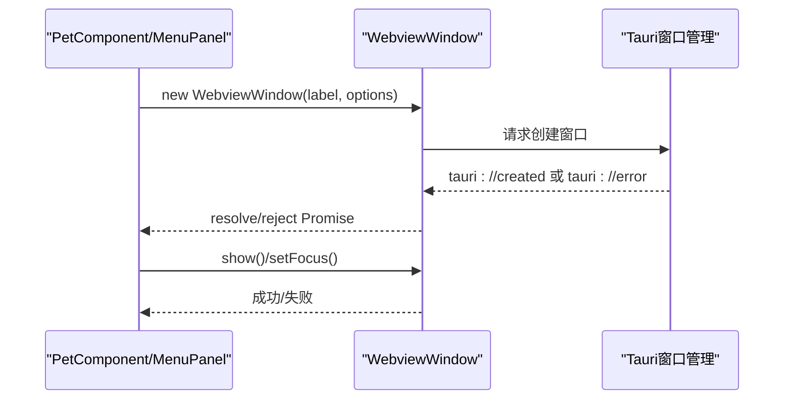
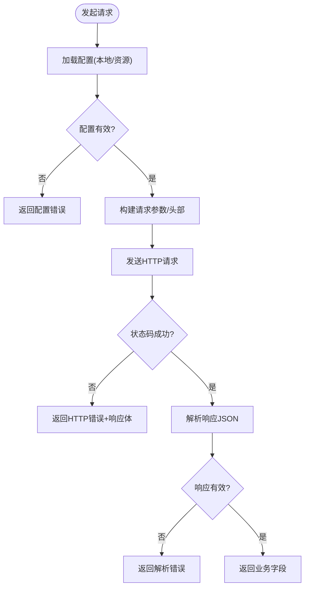
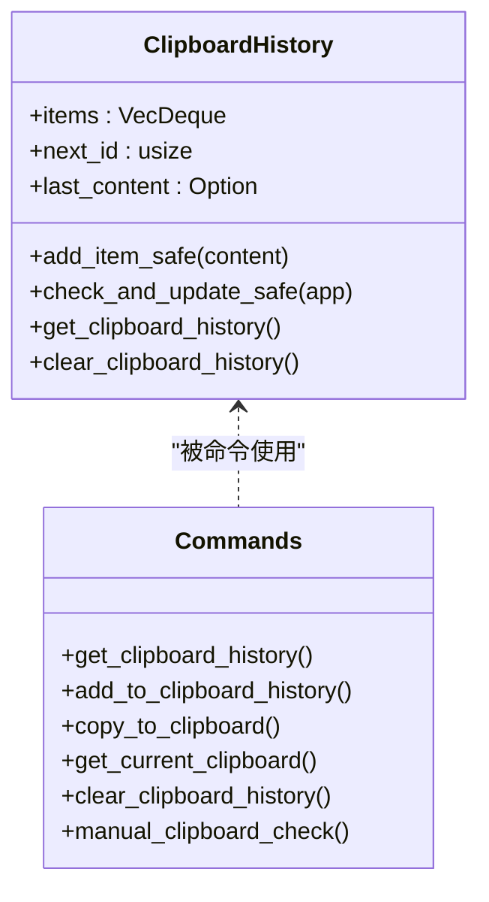
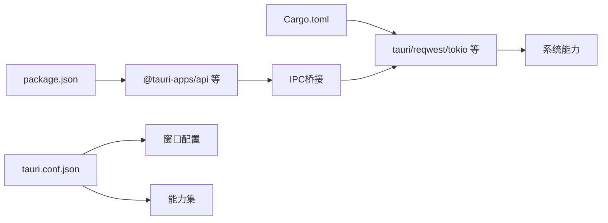

# 运行时错误

<cite>
**本文引用的文件列表**
- [main.tsx](file://src/main.tsx)
- [App.tsx](file://src/App.tsx)
- [AIChatComponent.tsx](file://src/components/AIChatComponent.tsx)
- [TranslatorComponent.tsx](file://src/components/TranslatorComponent.tsx)
- [PetComponent.tsx](file://src/components/PetComponent.tsx)
- [MenuPanel.tsx](file://src/components/MenuPanel.tsx)
- [clipboard.rs](file://src-tauri/src/clipboard.rs)
- [calendar.rs](file://src-tauri/src/calendar.rs)
- [lib.rs](file://src-tauri/src/lib.rs)
- [main.rs](file://src-tauri/src/main.rs)
- [Cargo.toml](file://src-tauri/Cargo.toml)
- [tauri.conf.json](file://src-tauri/tauri.conf.json)
- [package.json](file://package.json)
- [README.md](file://README.md)
</cite>

## 目录
1. [简介](#简介)
2. [项目结构](#项目结构)
3. [核心组件](#核心组件)
4. [架构总览](#架构总览)
5. [详细组件分析](#详细组件分析)
6. [依赖关系分析](#依赖关系分析)
7. [性能考量](#性能考量)
8. [故障排除指南](#故障排除指南)
9. [结论](#结论)
10. [附录](#附录)

## 简介
本指南面向开发者与运维人员，聚焦于桌面宠物应用在运行时可能遇到的各类错误与异常，覆盖启动失败、前端组件加载失败、后端服务启动异常、IPC通信错误、内存溢出与崩溃、系统资源不足、第三方API调用失败等场景，并提供可操作的诊断与修复建议。文档结合项目实际代码与配置，给出分层讲解、流程图与架构图，帮助快速定位问题并恢复稳定运行。

## 项目结构
应用采用前后端分离架构：
- 前端：React + TypeScript，通过 Tauri 的 invoke 与后端命令交互。
- 后端：Rust（Tauri 2），提供系统能力、业务逻辑与窗口管理。
- 配置：Tauri 配置文件控制窗口、权限与打包资源；前端 package.json 管理脚本与依赖。

图表来源
- [main.tsx:1-10](file://src/main.tsx#L1-L10)
- [App.tsx:1-60](file://src/App.tsx#L1-L60)
- [lib.rs:1-1113](file://src-tauri/src/lib.rs#L1-L1113)
- [tauri.conf.json:1-74](file://src-tauri/tauri.conf.json#L1-L74)
- [Cargo.toml:1-44](file://src-tauri/Cargo.toml#L1-L44)

章节来源
- [main.tsx:1-10](file://src/main.tsx#L1-L10)
- [App.tsx:1-60](file://src/App.tsx#L1-L60)
- [tauri.conf.json:1-74](file://src-tauri/tauri.conf.json#L1-L74)
- [Cargo.toml:1-44](file://src-tauri/Cargo.toml#L1-L44)
- [package.json:1-29](file://package.json#L1-L29)

## 核心组件
- 前端入口与路由：React 根节点渲染，App 根据窗口 label 渲染不同功能组件。
- 功能组件：AI 对话、有道翻译、剪贴板、系统信息、日历等。
- 后端命令：系统信息采集、窗口创建与事件、第三方API调用（DeepSeek、有道翻译）、文件系统读写、剪贴板历史管理等。
- 配置与权限：窗口属性、能力集、插件启用、资源打包。

章节来源
- [App.tsx:18-58](file://src/App.tsx#L18-L58)
- [AIChatComponent.tsx:1-200](file://src/components/AIChatComponent.tsx#L1-L200)
- [TranslatorComponent.tsx:1-200](file://src/components/TranslatorComponent.tsx#L1-L200)
- [lib.rs:41-379](file://src-tauri/src/lib.rs#L41-L379)
- [tauri.conf.json:13-51](file://src-tauri/tauri.conf.json#L13-L51)

## 架构总览
应用通过 Tauri 的命令系统实现前端与后端的解耦通信。前端组件通过 invoke 调用后端命令，后端执行系统级操作或网络请求，并将结果返回给前端更新 UI。窗口管理由后端统一调度，前端负责事件监听与交互。

图表来源
- [AIChatComponent.tsx:113-115](file://src/components/AIChatComponent.tsx#L113-L115)
- [TranslatorComponent.tsx:167-171](file://src/components/TranslatorComponent.tsx#L167-L171)
- [lib.rs:255-294](file://src-tauri/src/lib.rs#L255-L294)
- [lib.rs:472-545](file://src-tauri/src/lib.rs#L472-L545)

## 详细组件分析

### 前端启动与路由
- React 根节点在 index.html 中挂载，随后渲染 App。
- App 根据当前窗口 label 决定渲染哪个功能组件，若未匹配则返回空。
- 窗口 label 由 Tauri 配置文件定义，确保前端按预期加载对应组件。

图表来源
- [main.tsx:5-9](file://src/main.tsx#L5-L9)
- [App.tsx:21-58](file://src/App.tsx#L21-L58)

章节来源
- [main.tsx:1-10](file://src/main.tsx#L1-L10)
- [App.tsx:18-58](file://src/App.tsx#L18-L58)

### IPC 通信与命令调用
- 前端组件通过 invoke 调用后端命令，例如发送聊天消息、翻译文本、打开窗口等。
- 后端命令对参数进行校验、调用系统能力或第三方 API，并返回字符串或对象。
- 错误处理：命令内部捕获异常并返回字符串错误；前端收到错误后展示提示。

图表来源
- [AIChatComponent.tsx:113-115](file://src/components/AIChatComponent.tsx#L113-L115)
- [lib.rs:255-294](file://src-tauri/src/lib.rs#L255-L294)

章节来源
- [AIChatComponent.tsx:55-82](file://src/components/AIChatComponent.tsx#L55-L82)
- [AIChatComponent.tsx:88-135](file://src/components/AIChatComponent.tsx#L88-L135)
- [lib.rs:255-294](file://src-tauri/src/lib.rs#L255-L294)

### 窗口管理与事件
- 前端通过 WebviewWindow 创建/显示/聚焦窗口，并监听“tauri://created”和“tauri://error”事件。
- 后端命令负责创建窗口、注入初始化脚本、设置透明/装饰等属性。
- 超时与错误：前端在创建窗口时设置超时，若未收到事件则抛出错误；后端命令对创建/显示/聚焦失败返回错误字符串。

图表来源
- [PetComponent.tsx:247-286](file://src/components/PetComponent.tsx#L247-L286)
- [MenuPanel.tsx:67-77](file://src/components/MenuPanel.tsx#L67-L77)
- [lib.rs:75-112](file://src-tauri/src/lib.rs#L75-L112)

章节来源
- [PetComponent.tsx:231-286](file://src/components/PetComponent.tsx#L231-L286)
- [MenuPanel.tsx:45-77](file://src/components/MenuPanel.tsx#L45-L77)
- [lib.rs:75-112](file://src-tauri/src/lib.rs#L75-L112)

### 第三方API调用（AI与翻译）
- AI 对话：调用 DeepSeek API，需配置 API Key、基础URL与模型；后端命令封装请求与响应解析。
- 有道翻译：生成签名、构造表单参数、发送请求；后端命令封装配置加载与错误处理。
- 常见问题：网络超时、鉴权失败、响应为空、签名错误、配置缺失。

图表来源
- [lib.rs:255-294](file://src-tauri/src/lib.rs#L255-L294)
- [lib.rs:472-545](file://src-tauri/src/lib.rs#L472-L545)

章节来源
- [lib.rs:255-294](file://src-tauri/src/lib.rs#L255-L294)
- [lib.rs:472-545](file://src-tauri/src/lib.rs#L472-L545)

### 剪贴板与系统资源
- 剪贴板历史：后端维护固定大小的去重历史队列，限制内容长度；前端组件通过命令读取/清空/复制。
- 系统信息：后端采集CPU/内存使用率，前端定时轮询更新。

图表来源
- [clipboard.rs:14-122](file://src-tauri/src/clipboard.rs#L14-L122)
- [lib.rs:124-224](file://src-tauri/src/lib.rs#L124-L224)

章节来源
- [clipboard.rs:1-251](file://src-tauri/src/clipboard.rs#L1-L251)
- [lib.rs:124-224](file://src-tauri/src/lib.rs#L124-L224)

## 依赖关系分析
- 前端依赖：@tauri-apps/api、@tauri-plugins（fs/opener/dialog）、React 生态。
- 后端依赖：tauri、reqwest、tokio、serde、sysinfo、tauri-plugin-* 等。
- 配置：tauri.conf.json 控制窗口、能力集、打包资源；Cargo.toml 管理 Rust 依赖与特性。

图表来源
- [package.json:12-28](file://package.json#L12-L28)
- [Cargo.toml:15-44](file://src-tauri/Cargo.toml#L15-L44)
- [tauri.conf.json:44-51](file://src-tauri/tauri.conf.json#L44-L51)

章节来源
- [package.json:1-29](file://package.json#L1-L29)
- [Cargo.toml:1-44](file://src-tauri/Cargo.toml#L1-L44)
- [tauri.conf.json:1-74](file://src-tauri/tauri.conf.json#L1-L74)

## 性能考量
- 异步与并发：后端大量使用 tokio 异步IO与锁保护共享状态，避免阻塞主线程。
- 窗口与事件：前端创建窗口时设置超时与事件监听，减少卡顿与死等。
- 网络请求：对第三方API请求进行状态码与响应体校验，避免无效数据处理。
- 资源占用：系统信息采集按需刷新，避免频繁高负载操作。

章节来源
- [lib.rs:61-72](file://src-tauri/src/lib.rs#L61-L72)
- [PetComponent.tsx:260-274](file://src/components/PetComponent.tsx#L260-L274)
- [MenuPanel.tsx:67-77](file://src/components/MenuPanel.tsx#L67-L77)

## 故障排除指南

### 一、应用启动失败
常见原因与排查步骤：
- 前端入口未正确挂载
  - 现象：页面空白或白屏
  - 排查：确认 index.html 中根节点存在且 main.tsx 正常渲染
  - 参考：[main.tsx:5-9](file://src/main.tsx#L5-L9)
- 窗口 label 与路由不匹配
  - 现象：App 返回空，无功能组件渲染
  - 排查：核对 tauri.conf.json 中窗口 label 与 App.tsx 的分支逻辑
  - 参考：[App.tsx:27-58](file://src/App.tsx#L27-L58)、[tauri.conf.json:13-42](file://src-tauri/tauri.conf.json#L13-L42)
- 开发服务器未启动或端口冲突
  - 现象：devUrl 无法访问
  - 排查：检查 beforeDevCommand 与端口占用，确保 localhost:1420 可用
  - 参考：[tauri.conf.json:7-10](file://src-tauri/tauri.conf.json#L7-L10)、[package.json:6-10](file://package.json#L6-L10)
- Tauri 初始化错误
  - 现象：应用启动即崩溃或托盘/窗口创建失败
  - 排查：查看后端 main.rs 与 lib.rs 初始化流程，确认命令注册与能力集配置
  - 参考：[main.rs:8-10](file://src-tauri/src/main.rs#L8-L10)、[lib.rs:1-36](file://src-tauri/src/lib.rs#L1-L36)

章节来源
- [main.tsx:1-10](file://src/main.tsx#L1-L10)
- [App.tsx:18-58](file://src/App.tsx#L18-L58)
- [tauri.conf.json:7-10](file://src-tauri/tauri.conf.json#L7-L10)
- [main.rs:8-10](file://src-tauri/src/main.rs#L8-L10)
- [lib.rs:1-36](file://src-tauri/src/lib.rs#L1-L36)

### 二、前端组件加载失败
- 现象：组件未渲染或报错
- 排查要点：
  - 确认 App.tsx 的窗口 label 与组件映射一致
  - 检查组件自身是否有未捕获异常
  - 查看浏览器控制台错误与堆栈
- 参考：
  - [App.tsx:27-58](file://src/App.tsx#L27-L58)
  - [AIChatComponent.tsx:55-68](file://src/components/AIChatComponent.tsx#L55-L68)
  - [TranslatorComponent.tsx:88-102](file://src/components/TranslatorComponent.tsx#L88-L102)

章节来源
- [App.tsx:18-58](file://src/App.tsx#L18-L58)
- [AIChatComponent.tsx:55-68](file://src/components/AIChatComponent.tsx#L55-L68)
- [TranslatorComponent.tsx:88-102](file://src/components/TranslatorComponent.tsx#L88-L102)

### 三、后端服务启动异常
- 现象：命令不可用、托盘菜单无响应、窗口创建失败
- 排查要点：
  - 确认命令已在 lib.rs 中注册
  - 检查能力集与插件配置是否启用
  - 核对 Cargo.toml 依赖版本与特性
- 参考：
  - [lib.rs:41-379](file://src-tauri/src/lib.rs#L41-L379)
  - [tauri.conf.json:44-51](file://src-tauri/tauri.conf.json#L44-L51)
  - [Cargo.toml:15-44](file://src-tauri/Cargo.toml#L15-L44)

章节来源
- [lib.rs:41-379](file://src-tauri/src/lib.rs#L41-L379)
- [tauri.conf.json:44-51](file://src-tauri/tauri.conf.json#L44-L51)
- [Cargo.toml:15-44](file://src-tauri/Cargo.toml#L15-L44)

### 四、IPC 通信错误
- 命令调用失败
  - 现象：invoke 返回错误字符串或抛出异常
  - 排查：检查命令参数类型与命名一致性；查看后端命令返回的错误字符串
  - 参考：[AIChatComponent.tsx:113-115](file://src/components/AIChatComponent.tsx#L113-L115)、[lib.rs:255-294](file://src-tauri/src/lib.rs#L255-L294)
- 参数传递错误
  - 现象：后端收到空值或类型不匹配
  - 排查：前端调用时确保参数非空且类型正确；后端命令中增加参数校验
  - 参考：[lib.rs:115-160](file://src-tauri/src/lib.rs#L115-L160)、[lib.rs:472-545](file://src-tauri/src/lib.rs#L472-L545)
- 返回值异常
  - 现象：前端解析失败或业务字段为空
  - 排查：后端命令返回前进行空值检查与错误包装；前端做好兜底显示
  - 参考：[lib.rs:289-294](file://src-tauri/src/lib.rs#L289-L294)、[lib.rs:534-544](file://src-tauri/src/lib.rs#L534-L544)

章节来源
- [AIChatComponent.tsx:113-115](file://src/components/AIChatComponent.tsx#L113-L115)
- [lib.rs:115-160](file://src-tauri/src/lib.rs#L115-L160)
- [lib.rs:255-294](file://src-tauri/src/lib.rs#L255-L294)
- [lib.rs:472-545](file://src-tauri/src/lib.rs#L472-L545)

### 五、窗口创建与事件异常
- 现象：窗口创建超时、显示/聚焦失败
- 排查要点：
  - 前端设置超时与事件监听，确保收到“tauri://created”或“tauri://error”
  - 后端命令对创建/显示/聚焦失败返回错误字符串
- 参考：
  - [PetComponent.tsx:260-274](file://src/components/PetComponent.tsx#L260-L274)
  - [MenuPanel.tsx:67-77](file://src/components/MenuPanel.tsx#L67-L77)
  - [lib.rs:75-112](file://src-tauri/src/lib.rs#L75-L112)

章节来源
- [PetComponent.tsx:247-286](file://src/components/PetComponent.tsx#L247-L286)
- [MenuPanel.tsx:45-77](file://src/components/MenuPanel.tsx#L45-L77)
- [lib.rs:75-112](file://src-tauri/src/lib.rs#L75-L112)

### 六、内存溢出与崩溃
- 现象：应用卡顿、内存飙升、偶发崩溃
- 排查要点：
  - 检查剪贴板历史队列长度与锁竞争，避免无限增长
  - 核对第三方API响应体大小，必要时截断或分页
  - 使用系统监控工具观察CPU/内存曲线，定位热点函数
- 参考：
  - [clipboard.rs:59-71](file://src-tauri/src/clipboard.rs#L59-L71)
  - [lib.rs:269-282](file://src-tauri/src/lib.rs#L269-L282)

章节来源
- [clipboard.rs:29-82](file://src-tauri/src/clipboard.rs#L29-L82)
- [lib.rs:269-282](file://src-tauri/src/lib.rs#L269-L282)

### 七、系统资源不足
- CPU占用过高
  - 现象：系统风扇转速升高、发热明显
  - 排查：减少高频轮询、合并事件、使用节流/防抖；优化第三方API请求频率
- 内存泄漏
  - 现象：长时间运行后内存持续上涨
  - 排查：检查全局状态与事件监听是否正确清理；避免循环引用
- 参考：
  - [lib.rs:61-72](file://src-tauri/src/lib.rs#L61-L72)

章节来源
- [lib.rs:61-72](file://src-tauri/src/lib.rs#L61-L72)

### 八、第三方API调用失败
- DeepSeek API
  - 现象：网络超时、鉴权失败、响应为空
  - 排查：检查本地配置与资源配置加载顺序；验证API Key与基础URL；查看HTTP状态码与响应体
  - 参考：[lib.rs:255-294](file://src-tauri/src/lib.rs#L255-L294)
- 有道翻译
  - 现象：签名错误、参数缺失、翻译失败
  - 排查：确认 appKey/appSecret/baseUrl 配置；检查签名生成逻辑；验证响应字段
  - 参考：[lib.rs:472-545](file://src-tauri/src/lib.rs#L472-L545)

章节来源
- [lib.rs:255-294](file://src-tauri/src/lib.rs#L255-L294)
- [lib.rs:472-545](file://src-tauri/src/lib.rs#L472-L545)

### 九、文件系统与权限问题
- 现象：配置文件读写失败、资源文件找不到
- 排查要点：
  - 检查应用数据目录创建与权限
  - 确认资源文件打包与路径解析
- 参考：
  - [lib.rs:296-308](file://src-tauri/src/lib.rs#L296-L308)
  - [lib.rs:362-378](file://src-tauri/src/lib.rs#L362-L378)

章节来源
- [lib.rs:296-308](file://src-tauri/src/lib.rs#L296-L308)
- [lib.rs:362-378](file://src-tauri/src/lib.rs#L362-L378)

## 结论
本指南围绕启动失败、IPC通信、窗口管理、第三方API、内存与资源等关键运行时问题提供了系统化的诊断思路与修复建议。建议在开发与运维过程中：
- 建立完善的日志与错误上报机制
- 对关键命令与网络请求增加超时与重试策略
- 严格参数校验与错误包装
- 使用性能分析工具定期评估资源占用
- 保持依赖版本与配置文件的一致性

## 附录
- 快速检查清单
  - 前端：index.html 根节点、App 路由、组件异常
  - 后端：命令注册、能力集、插件启用、依赖版本
  - IPC：invoke 参数、返回值、错误字符串
  - 窗口：label 一致、事件监听、超时处理
  - 第三方API：配置加载、鉴权、响应解析
  - 文件系统：目录创建、权限、资源路径