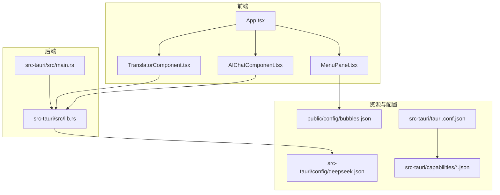
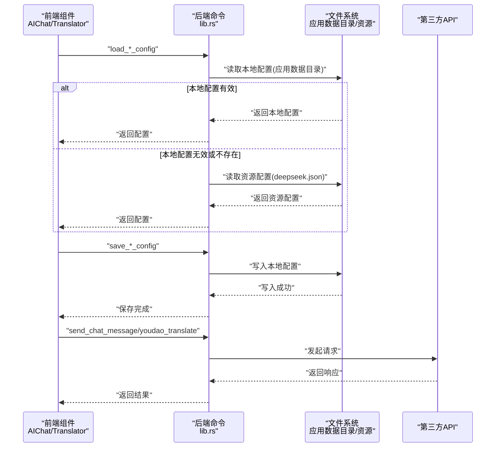
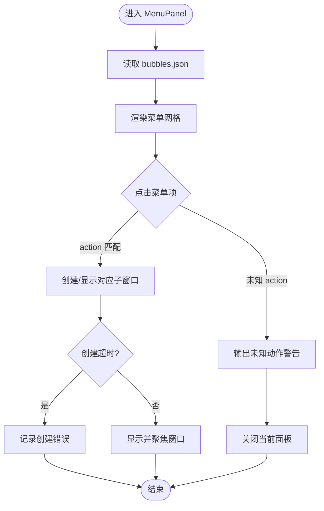
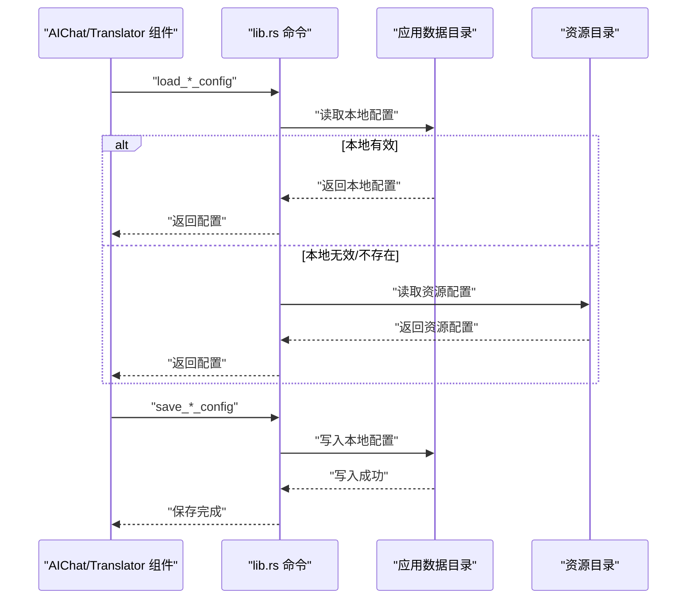
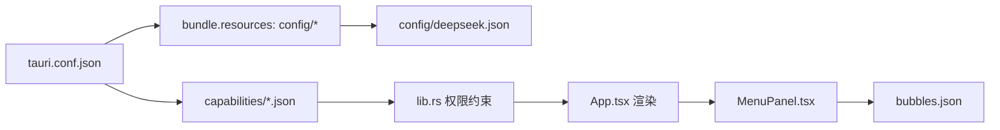

# 配置问题

<cite>
**本文引用的文件**
- [bubbles.json](file://public/config/bubbles.json)
- [deepseek.json](file://src-tauri/config/deepseek.json)
- [default.json](file://src-tauri/capabilities/default.json)
- [tauri.conf.json](file://src-tauri/tauri.conf.json)
- [package.json](file://package.json)
- [App.tsx](file://src/App.tsx)
- [MenuPanel.tsx](file://src/components/MenuPanel.tsx)
- [AIChatComponent.tsx](file://src/components/AIChatComponent.tsx)
- [TranslatorComponent.tsx](file://src/components/TranslatorComponent.tsx)
- [lib.rs](file://src-tauri/src/lib.rs)
- [main.rs](file://src-tauri/src/main.rs)
</cite>

## 目录
1. [简介](#简介)
2. [项目结构](#项目结构)
3. [核心组件](#核心组件)
4. [架构总览](#架构总览)
5. [详细组件分析](#详细组件分析)
6. [依赖关系分析](#依赖关系分析)
7. [性能考虑](#性能考虑)
8. [故障排除指南](#故障排除指南)
9. [结论](#结论)

## 简介
本指南面向“配置问题”的诊断与修复，覆盖以下方面：
- 配置文件格式错误（JSON语法、字段缺失、类型不匹配）
- API密钥配置错误（认证失败、权限不足、配额限制）
- 用户配置文件损坏或权限问题（删除重建、权限修复）
- 功能开关与菜单配置异常（bubbles.json导致的功能不可用）
- 环境变量配置问题（PATH、代理等）

## 项目结构
该桌面宠物应用采用前端React + Tauri后端的混合架构。配置相关的关键位置如下：
- 前端静态配置：public/config/bubbles.json（菜单/功能入口）
- 应用打包配置：src-tauri/tauri.conf.json（窗口、能力、资源打包）
- 能力声明：src-tauri/capabilities/*.json（权限集合）
- 后端配置：src-tauri/config/deepseek.json（示例第三方API配置）
- 前端应用入口：src/App.tsx（根据窗口label渲染对应功能）
- 菜单组件：src/components/MenuPanel.tsx（读取bubbles.json并创建子窗口）
- AI对话组件：src/components/AIChatComponent.tsx（调用后端命令加载/保存DeepSeek配置）
- 有道翻译组件：src/components/TranslatorComponent.tsx（调用后端命令加载/保存有道配置）
- 后端命令实现：src-tauri/src/lib.rs（读写本地配置、访问资源配置、调用第三方API）

**图表来源**
- [App.tsx:18-58](file://src/App.tsx#L18-L58)
- [MenuPanel.tsx:5-15](file://src/components/MenuPanel.tsx#L5-L15)
- [AIChatComponent.tsx:23-68](file://src/components/AIChatComponent.tsx#L23-L68)
- [TranslatorComponent.tsx:49-102](file://src/components/TranslatorComponent.tsx#L49-L102)
- [lib.rs:296-379](file://src-tauri/src/lib.rs#L296-L379)
- [tauri.conf.json:1-74](file://src-tauri/tauri.conf.json#L1-L74)
- [default.json:1-12](file://src-tauri/capabilities/default.json#L1-L12)

**章节来源**
- [tauri.conf.json:1-74](file://src-tauri/tauri.conf.json#L1-L74)
- [package.json:1-29](file://package.json#L1-L29)

## 核心组件
- 菜单与功能入口：MenuPanel.tsx通过导入bubbles.json动态生成菜单项，并根据action创建对应子窗口。
- 配置加载与保存：AIChatComponent.tsx与TranslatorComponent.tsx分别调用后端命令加载/保存各自配置；后端lib.rs实现具体逻辑。
- 配置来源策略：后端优先读取用户本地配置（应用数据目录），若不存在或无效则回退到打包资源中的配置文件。

**章节来源**
- [MenuPanel.tsx:5-15](file://src/components/MenuPanel.tsx#L5-L15)
- [AIChatComponent.tsx:23-82](file://src/components/AIChatComponent.tsx#L23-L82)
- [TranslatorComponent.tsx:49-115](file://src/components/TranslatorComponent.tsx#L49-L115)
- [lib.rs:350-379](file://src-tauri/src/lib.rs#L350-L379)

## 架构总览
下图展示配置相关的调用链路：前端组件通过invoke调用后端命令，后端命令按策略读取配置，必要时访问第三方API。

**图表来源**
- [AIChatComponent.tsx:55-82](file://src/components/AIChatComponent.tsx#L55-L82)
- [TranslatorComponent.tsx:88-115](file://src/components/TranslatorComponent.tsx#L88-L115)
- [lib.rs:350-379](file://src-tauri/src/lib.rs#L350-L379)
- [lib.rs:311-348](file://src-tauri/src/lib.rs#L311-L348)
- [lib.rs:472-545](file://src-tauri/src/lib.rs#L472-L545)

## 详细组件分析

### 菜单与功能入口（MenuPanel）
- 作用：读取bubbles.json，渲染九宫格菜单，点击后根据action创建对应子窗口。
- 关键点：
  - 菜单项必须包含label、action、icon字段，且action需与后端窗口label一致。
  - 若icon缺失或加载失败，会降级为默认图标。
  - 子窗口创建失败或超时会打印错误日志。

**图表来源**
- [MenuPanel.tsx:90-259](file://src/components/MenuPanel.tsx#L90-L259)
- [bubbles.json:1-52](file://public/config/bubbles.json#L1-L52)

**章节来源**
- [MenuPanel.tsx:5-15](file://src/components/MenuPanel.tsx#L5-L15)
- [MenuPanel.tsx:90-259](file://src/components/MenuPanel.tsx#L90-L259)
- [bubbles.json:1-52](file://public/config/bubbles.json#L1-L52)

### 配置加载与保存（AI对话/有道翻译）
- AI对话（DeepSeek）：
  - 前端：checkConfig调用后端命令加载配置；saveConfig保存临时配置。
  - 后端：优先读取本地deepseek_config.json；若无效则读取资源deepseek.json；发送消息时校验API Key。
- 有道翻译：
  - 前端：checkConfig加载配置；saveConfig保存临时配置。
  - 后端：优先读取本地youdao_config.json；若无效则报错提示未配置。

**图表来源**
- [AIChatComponent.tsx:55-82](file://src/components/AIChatComponent.tsx#L55-L82)
- [TranslatorComponent.tsx:88-115](file://src/components/TranslatorComponent.tsx#L88-L115)
- [lib.rs:350-379](file://src-tauri/src/lib.rs#L350-L379)
- [lib.rs:311-348](file://src-tauri/src/lib.rs#L311-L348)

**章节来源**
- [AIChatComponent.tsx:23-82](file://src/components/AIChatComponent.tsx#L23-L82)
- [TranslatorComponent.tsx:49-115](file://src/components/TranslatorComponent.tsx#L49-L115)
- [lib.rs:350-379](file://src-tauri/src/lib.rs#L350-L379)
- [lib.rs:311-348](file://src-tauri/src/lib.rs#L311-L348)

### 窗口路由与菜单联动（App.tsx）
- 依据当前窗口label决定渲染哪个功能组件。
- MenuPanel创建的子窗口label需与App.tsx中的判断分支一致，否则无法正确渲染。

**章节来源**
- [App.tsx:18-58](file://src/App.tsx#L18-L58)

## 依赖关系分析
- 能力与权限：tauri.conf.json声明了安全能力列表，capabilities/*.json定义了权限集合，确保前端可调用特定后端命令。
- 资源打包：tauri.conf.json的bundle.resources包含"config/*"，使deepseek.json随应用一起分发。
- 前端依赖：package.json声明了@tauri-apps/api等插件，用于窗口、对话框、文件系统等能力。

**图表来源**
- [tauri.conf.json:44-56](file://src-tauri/tauri.conf.json#L44-L56)
- [default.json:6-10](file://src-tauri/capabilities/default.json#L6-L10)
- [deepseek.json:1-6](file://src-tauri/config/deepseek.json#L1-L6)
- [bubbles.json:1-52](file://public/config/bubbles.json#L1-L52)

**章节来源**
- [tauri.conf.json:44-56](file://src-tauri/tauri.conf.json#L44-L56)
- [default.json:1-12](file://src-tauri/capabilities/default.json#L1-L12)
- [package.json:12-26](file://package.json#L12-L26)

## 性能考虑
- 配置读取：本地配置优先，减少网络请求；资源配置仅在首次使用或本地配置无效时读取。
- 窗口创建：超时控制与错误回调避免阻塞UI；重复创建时优先显示已有窗口。
- JSON解析：前端对JSON格式化/校验有容错处理，避免因格式错误导致崩溃。

[本节为通用建议，无需列出具体文件来源]

## 故障排除指南

### 一、配置文件格式错误（JSON语法、字段缺失、类型不匹配）
- 症状
  - bubbles.json：菜单不显示、点击无反应、图标加载失败
  - deepseek.json：AI对话界面提示“需要配置”或“请配置有效的API Key”
  - 有道翻译：界面提示“请配置有道翻译API密钥”或“API密钥配置无效”
- 诊断步骤
  - 使用在线JSON校验工具验证bubbles.json与deepseek.json的语法
  - 对照以下字段清单核对是否缺失或拼写错误
- 修复方法
  - bubbles.json字段清单
    - 必填：label（字符串）、action（字符串）、icon（字符串，可选）
    - 说明：action需与后端窗口label一致，否则菜单点击无法打开对应功能
  - deepseek.json字段清单
    - 必填：apiKey（字符串，非空且非占位符）、baseUrl（字符串）、model（字符串）
  - 有道翻译配置字段
    - 必填：appKey（字符串）、appSecret（字符串）、baseUrl（字符串）
- 参考实现
  - 菜单读取与渲染：MenuPanel.tsx导入bubbles.json并遍历渲染
  - 配置加载策略：lib.rs优先读取本地配置，再回退到资源配置

**章节来源**
- [MenuPanel.tsx:5-15](file://src/components/MenuPanel.tsx#L5-L15)
- [bubbles.json:1-52](file://public/config/bubbles.json#L1-L52)
- [lib.rs:350-379](file://src-tauri/src/lib.rs#L350-L379)
- [deepseek.json:1-6](file://src-tauri/config/deepseek.json#L1-L6)

### 二、API密钥配置错误（认证失败、权限不足、配额限制）
- 症状
  - AI对话：发送消息时报“API请求失败”、“解析响应失败”或“AI响应为空”
  - 有道翻译：调用接口返回“API请求失败”或“错误代码”
- 诊断步骤
  - 确认apiKey/appKey与appSecret是否正确
  - 检查baseUrl是否为官方可用地址
  - 确认网络代理设置是否正确
  - 查看后端日志定位具体HTTP状态码与错误信息
- 修复方法
  - 在AI对话/有道翻译设置界面重新填写并保存配置
  - 如为代理问题，调整系统/应用代理设置后重试
  - 若为配额限制，升级账户或等待额度恢复

**章节来源**
- [AIChatComponent.tsx:124-134](file://src/components/AIChatComponent.tsx#L124-L134)
- [lib.rs:255-294](file://src-tauri/src/lib.rs#L255-L294)
- [TranslatorComponent.tsx:173-179](file://src/components/TranslatorComponent.tsx#L173-L179)
- [lib.rs:472-545](file://src-tauri/src/lib.rs#L472-L545)

### 三、用户配置文件损坏或权限问题
- 症状
  - 保存配置后仍提示“需要配置”或“请配置有效的API Key”
  - 有道翻译界面持续提示未配置
- 诊断步骤
  - 定位应用数据目录（Windows通常位于用户目录下的应用数据文件夹）
  - 检查deepseek_config.json与youdao_config.json是否存在、可读写
- 修复方法
  - 删除损坏的配置文件（如deepseek_config.json、youdao_config.json）
  - 重启应用后重新在设置界面保存配置
  - 若仍失败，检查应用数据目录权限，确保程序具有读写权限

**章节来源**
- [lib.rs:296-308](file://src-tauri/src/lib.rs#L296-L308)
- [lib.rs:457-469](file://src-tauri/src/lib.rs#L457-L469)

### 四、功能开关与菜单配置异常（bubbles.json）
- 症状
  - 点击菜单项无反应或无法打开对应功能窗口
  - 图标加载失败，显示默认图标
- 诊断步骤
  - 确认bubbles.json中各菜单项的action与后端窗口label一致
  - 检查icon路径是否正确且资源存在
- 修复方法
  - 将action修改为与App.tsx中判断分支一致的值
  - 确保icon路径有效或移除icon字段以启用默认图标

**章节来源**
- [bubbles.json:1-52](file://public/config/bubbles.json#L1-L52)
- [App.tsx:18-58](file://src/App.tsx#L18-L58)
- [MenuPanel.tsx:278-284](file://src/components/MenuPanel.tsx#L278-L284)

### 五、环境变量配置问题（PATH、代理等）
- 症状
  - 应用启动后部分功能不可用（如网络相关API调用失败）
  - 代理设置导致第三方API请求失败
- 诊断步骤
  - 检查系统PATH中是否包含必要的可执行文件
  - 检查系统/应用代理设置
- 修复方法
  - 在系统环境变量中补充缺失的PATH条目
  - 在应用内配置代理（如支持），或在系统层面对应网络请求进行代理设置

[本小节为通用指导，无需列出具体文件来源]

## 结论
- 配置问题多源于JSON格式错误、字段缺失或类型不匹配，以及API密钥与网络环境配置不当。
- 建议遵循“先本地、后资源”的配置加载策略，优先检查应用数据目录中的本地配置文件。
- 菜单与功能的联动依赖于bubbles.json的action与后端窗口label一致性，务必保持一致。
- 出现认证失败时，优先核对密钥有效性与网络代理设置。