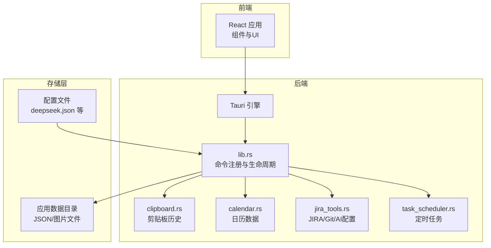
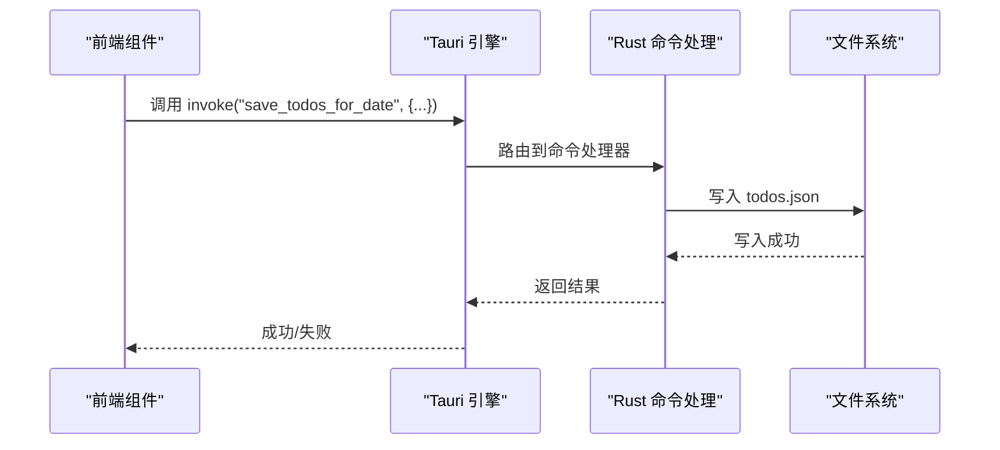
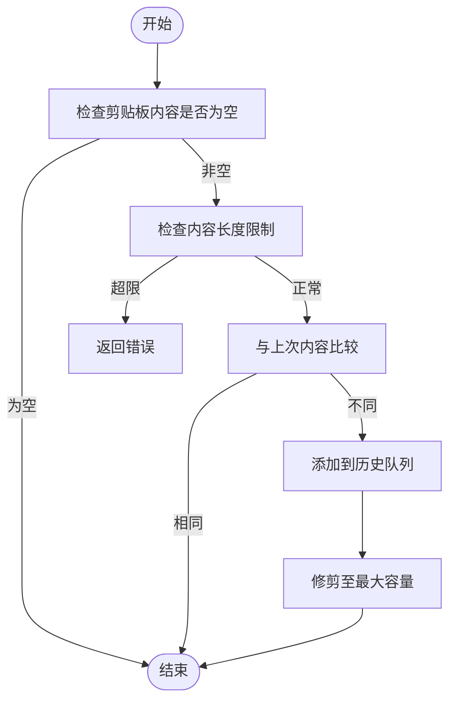
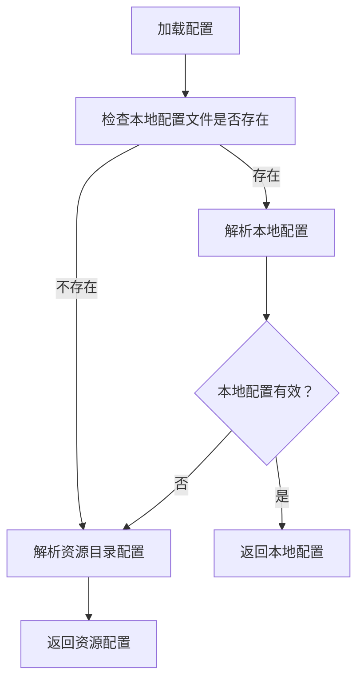
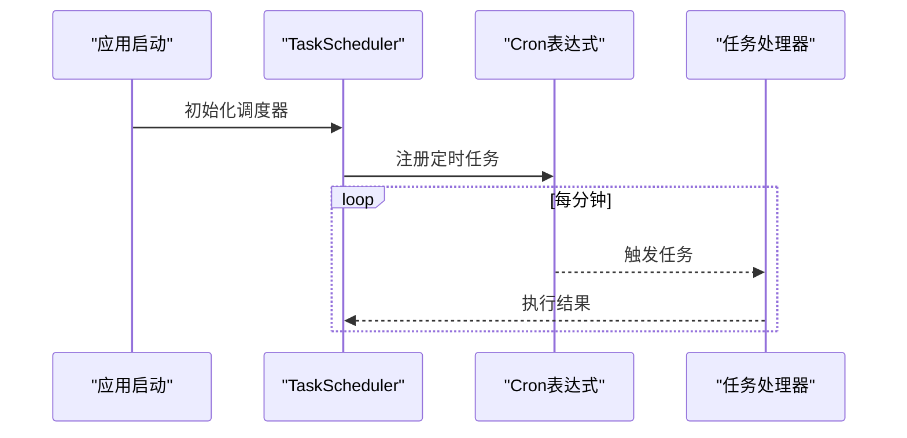
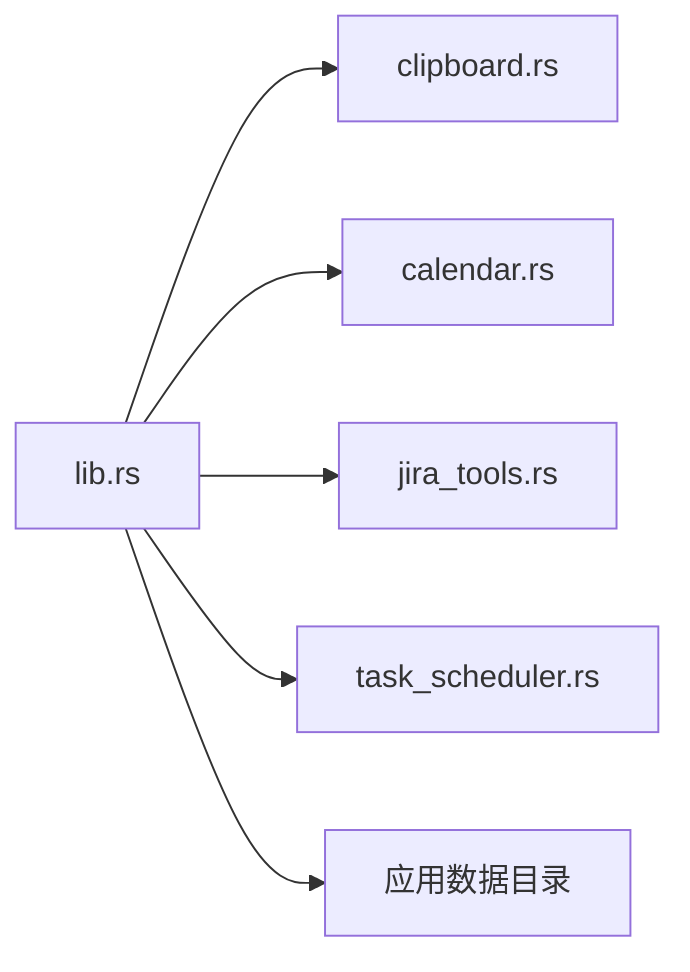

# 备份与恢复机制

<cite>
**本文档引用的文件**
- [README.md](file://README.md)
- [main.rs](file://src-tauri/src/main.rs)
- [lib.rs](file://src-tauri/src/lib.rs)
- [clipboard.rs](file://src-tauri/src/clipboard.rs)
- [calendar.rs](file://src-tauri/src/calendar.rs)
- [jira_tools.rs](file://src-tauri/src/jira_tools.rs)
- [task_scheduler.rs](file://src-tauri/src/task_scheduler.rs)
- [bubbles.json](file://public/config/bubbles.json)
- [deepseek.json](file://src-tauri/config/deepseek.json)
</cite>

## 目录
1. [简介](#简介)
2. [项目结构](#项目结构)
3. [核心组件](#核心组件)
4. [架构总览](#架构总览)
5. [详细组件分析](#详细组件分析)
6. [依赖关系分析](#依赖关系分析)
7. [性能考量](#性能考量)
8. [故障排除指南](#故障排除指南)
9. [结论](#结论)
10. [附录](#附录)

## 简介
本文件围绕 XSUN Desktop Pet 桌面宠物应用的数据持久化与恢复能力进行系统化技术说明。通过对 Rust 后端与前端交互、配置文件存储、定时任务调度以及数据文件组织结构的深入分析，给出备份与恢复机制的现状评估、潜在改进方向与最佳实践建议。

## 项目结构
应用采用前后端分离架构：
- 前端：React + TypeScript，负责用户界面与交互。
- 后端：Rust + Tauri，负责系统级功能、数据持久化与定时任务。
- 配置与静态资源：位于 public 与 src-tauri/config 目录。



图表来源
- [lib.rs:948-1119](file://src-tauri/src/lib.rs#L948-L1119)
- [main.rs:1-11](file://src-tauri/src/main.rs#L1-L11)
- [clipboard.rs:1-251](file://src-tauri/src/clipboard.rs#L1-L251)
- [calendar.rs:1-363](file://src-tauri/src/calendar.rs#L1-L363)
- [jira_tools.rs:1-1029](file://src-tauri/src/jira_tools.rs#L1-L1029)
- [task_scheduler.rs:1-93](file://src-tauri/src/task_scheduler.rs#L1-L93)

章节来源
- [README.md:129-181](file://README.md#L129-L181)
- [lib.rs:948-1119](file://src-tauri/src/lib.rs#L948-L1119)
- [main.rs:1-11](file://src-tauri/src/main.rs#L1-L11)

## 核心组件
- 剪贴板历史：内存型缓存，应用重启即丢失，适合短期临时记录。
- 日历数据：以 JSON 文件形式按日期分片存储，包含待办事项与事件。
- 配置文件：深色/浅色主题、旋转间隔、背景图片等设置；AI/JIRA/Git 配置。
- 定时任务：基于 cron 表达式的后台任务调度器，支持扩展。

章节来源
- [README.md:206-215](file://README.md#L206-L215)
- [clipboard.rs:14-122](file://src-tauri/src/clipboard.rs#L14-L122)
- [calendar.rs:98-186](file://src-tauri/src/calendar.rs#L98-L186)
- [jira_tools.rs:66-166](file://src-tauri/src/jira_tools.rs#L66-L166)

## 架构总览
后端通过 Tauri 的 invoke 机制向前端暴露命令，前端调用后端命令实现数据读写与系统功能。数据持久化主要依赖应用数据目录下的 JSON 文件与图片目录。



图表来源
- [lib.rs:956-1003](file://src-tauri/src/lib.rs#L956-L1003)
- [calendar.rs:115-141](file://src-tauri/src/calendar.rs#L115-L141)

## 详细组件分析

### 剪贴板历史（内存型，非持久）
- 存储方式：内存中的循环队列，最大容量固定，应用重启后清空。
- 特点：高频读写、低延迟，适合临时记录。
- 备份与恢复：无内置持久化，不支持自动/手动备份；如需长期保留，应结合外部存储或迁移至磁盘文件。



图表来源
- [clipboard.rs:84-122](file://src-tauri/src/clipboard.rs#L84-L122)

章节来源
- [clipboard.rs:14-122](file://src-tauri/src/clipboard.rs#L14-L122)
- [README.md:210-211](file://README.md#L210-L211)

### 日历数据（JSON 文件持久化）
- 文件组织：应用数据目录下 todos.json、events.json、calendar_settings.json，以及 background_images 图片目录。
- 写入策略：按日期键聚合，空集合时删除该日期键，避免冗余。
- 清理策略：提供按日期范围清理旧数据的能力。
- 备份与恢复：可通过复制应用数据目录实现完整备份；恢复时将数据目录替换为备份即可。

```mermaid
erDiagram
DATA_DIR {
string todos.json
string events.json
string calendar_settings.json
dir background_images
}
TODO_ITEM {
string id
string content
boolean completed
int64 created_at
}
CALENDAR_EVENT {
string id
string title
string description
int64 start_time
int64 end_time
boolean all_day
string color
}
CALENDAR_SETTINGS {
array background_images
uint rotation_interval
string theme
boolean show_lunar
boolean show_holidays
enum default_view
}
DATA_DIR ||--o{ TODO_ITEM : "包含"
DATA_DIR ||--o{ CALENDAR_EVENT : "包含"
DATA_DIR ||--o{ CALENDAR_SETTINGS : "包含"
```

图表来源
- [calendar.rs:5-81](file://src-tauri/src/calendar.rs#L5-L81)
- [calendar.rs:98-218](file://src-tauri/src/calendar.rs#L98-L218)

章节来源
- [calendar.rs:98-186](file://src-tauri/src/calendar.rs#L98-L186)
- [calendar.rs:324-361](file://src-tauri/src/calendar.rs#L324-L361)

### 配置文件（JSON 持久化）
- 深度配置：deepseek_config.json（AI 配置），youdao_config.json（翻译配置），jira_config.json、git_config.json、ai_config.json（JIRA/Git/AI配置）。
- 读取优先级：优先读取应用数据目录中的本地配置，若不存在则回退到资源目录中的示例配置。
- 备份与恢复：复制应用数据目录中的配置文件即可完成备份；恢复时覆盖对应文件。



图表来源
- [lib.rs:358-386](file://src-tauri/src/lib.rs#L358-L386)
- [jira_tools.rs:729-767](file://src-tauri/src/jira_tools.rs#L729-L767)

章节来源
- [lib.rs:303-386](file://src-tauri/src/lib.rs#L303-L386)
- [jira_tools.rs:66-166](file://src-tauri/src/jira_tools.rs#L66-L166)
- [jira_tools.rs:714-767](file://src-tauri/src/jira_tools.rs#L714-L767)
- [deepseek.json:1-6](file://src-tauri/config/deepseek.json#L1-L6)

### 定时任务（调度与扩展）
- 调度器：基于 cron 表达式，支持每分钟检查与自定义任务注册。
- 应用场景：可用于定期清理旧数据、导出报表等。
- 备份与恢复：定时任务本身不涉及数据备份，但可作为自动化流程的一部分参与备份脚本。



图表来源
- [task_scheduler.rs:21-61](file://src-tauri/src/task_scheduler.rs#L21-L61)
- [lib.rs:1111-1112](file://src-tauri/src/lib.rs#L1111-L1112)

章节来源
- [task_scheduler.rs:1-93](file://src-tauri/src/task_scheduler.rs#L1-L93)
- [lib.rs:1111-1112](file://src-tauri/src/lib.rs#L1111-L1112)

## 依赖关系分析
- 命令注册：lib.rs 中集中注册所有 invoke 命令，包括剪贴板、日历、翻译、JIRA、定时任务等。
- 生命周期：应用启动时初始化托盘、窗口、系统监控与定时任务。
- 文件权限：通过 Tauri 能力配置允许对应用数据目录的读写。



图表来源
- [lib.rs:956-1003](file://src-tauri/src/lib.rs#L956-L1003)
- [lib.rs:1004-1119](file://src-tauri/src/lib.rs#L1004-L1119)

章节来源
- [lib.rs:948-1119](file://src-tauri/src/lib.rs#L948-L1119)
- [main.rs:1-11](file://src-tauri/src/main.rs#L1-L11)

## 性能考量
- 剪贴板监控：每 5 秒检查一次，连续错误超过阈值会短暂退避，避免过度占用系统资源。
- JSON 序列化：使用紧凑/美化两种序列化方式，按需选择以平衡可读性与体积。
- 文件 I/O：按日期分片存储，减少单文件过大；清理旧数据降低存储压力。

章节来源
- [lib.rs:1074-1110](file://src-tauri/src/lib.rs#L1074-L1110)
- [calendar.rs:115-141](file://src-tauri/src/calendar.rs#L115-L141)
- [calendar.rs:324-361](file://src-tauri/src/calendar.rs#L324-L361)

## 故障排除指南
- 剪贴板历史丢失：由于内存型设计，重启后历史清空属预期行为。如需保留，请在外部系统中同步或迁移到磁盘文件。
- 配置读取失败：检查应用数据目录中的配置文件是否存在且格式正确；确认本地配置优先级高于资源目录配置。
- 日历数据异常：检查 todos.json/events.json 是否被意外修改；必要时使用备份文件替换。
- 定时任务未执行：确认调度器已初始化并处于运行状态；检查 cron 表达式与系统时间。

章节来源
- [clipboard.rs:14-122](file://src-tauri/src/clipboard.rs#L14-L122)
- [lib.rs:358-386](file://src-tauri/src/lib.rs#L358-L386)
- [calendar.rs:98-186](file://src-tauri/src/calendar.rs#L98-L186)
- [task_scheduler.rs:82-93](file://src-tauri/src/task_scheduler.rs#L82-L93)

## 结论
当前应用的数据持久化以 JSON 文件为主，具备基础的配置与日历数据持久化能力；剪贴板历史为内存型，不支持持久化。备份与恢复可通过复制应用数据目录实现，恢复时注意文件完整性与权限。若需增强备份能力，可在现有基础上引入压缩归档、校验和、版本控制与增量备份策略，并完善自动化与监控告警。

## 附录

### 备份与恢复策略建议
- 自动备份
  - 方案：定时任务触发，将应用数据目录打包为压缩包并上传到云存储或本地外设。
  - 触发条件：每日/每周固定时间，或在关键数据变更后触发。
- 手动备份
  - 方案：提供 UI 按钮触发备份流程，支持选择备份目标路径与命名规则。
- 增量备份
  - 方案：基于文件修改时间戳或哈希值识别变更，仅传输变化部分。
- 存储位置与格式
  - 位置：用户可配置的本地目录或云端存储。
  - 格式：建议使用 ZIP/TAR.GZ 并附带 SHA-256 校验文件。
- 恢复流程
  - 完整恢复：停止应用，替换应用数据目录，启动应用。
  - 部分恢复：仅替换特定文件（如 todos.json），重启对应功能模块。
  - 版本回滚：保留多个备份版本，按时间点回滚到指定版本。
- 验证与完整性
  - 校验和：对备份包与单个文件计算并存储 SHA-256。
  - 一致性验证：恢复后读取关键文件并进行结构校验。
  - 损坏检测：对校验和不匹配的备份包进行告警与隔离。
- 配置与管理
  - 频率设置：支持按天/周/月配置备份周期。
  - 空间管理：保留最近 N 份备份，超出数量自动清理最旧备份。
  - 保留周期：支持按天/月/年配置保留期限。
- 灾难恢复预案
  - 数据丢失处理：立即启动最近一次可用备份恢复。
  - 系统重建：在新机器上安装应用，导入备份并重新配置。
  - 业务连续性：提供快速恢复流程与回滚方案，尽量缩短停机时间。
- 最佳实践
  - 备份前先校验磁盘空间与网络连通性。
  - 对敏感配置文件进行加密存储（如需）。
  - 定期演练恢复流程，确保备份可用。
  - 记录每次备份的时间、大小与校验和，便于审计。