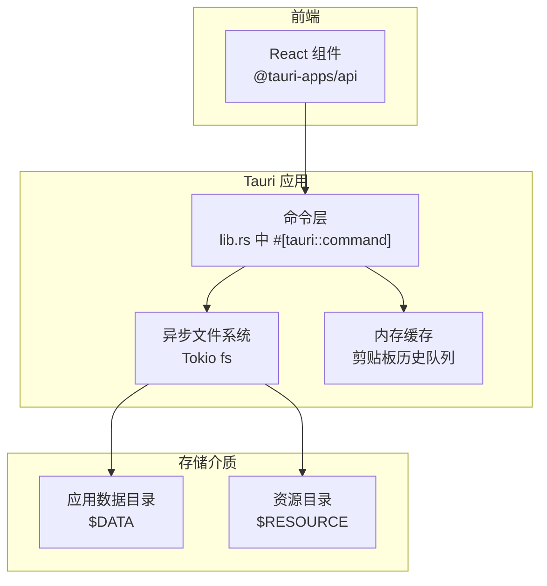
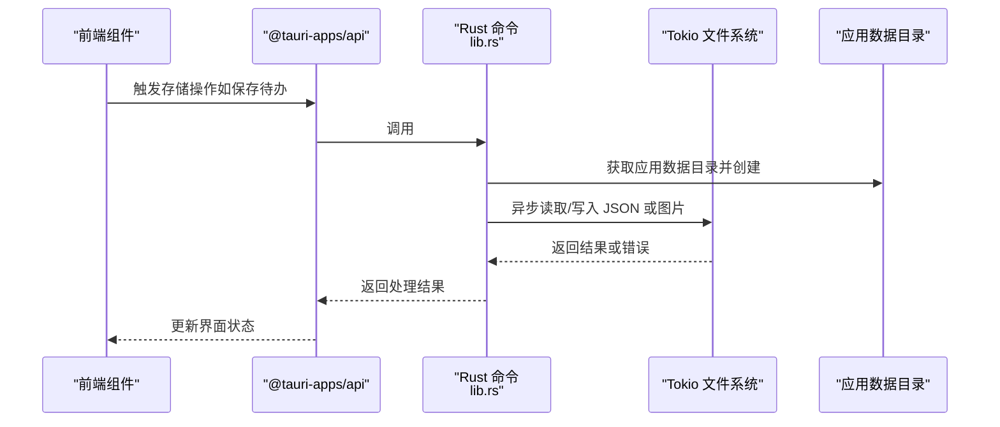
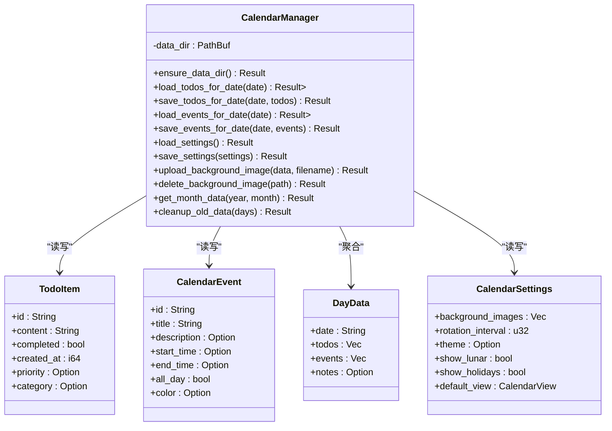
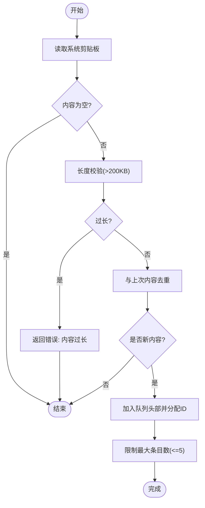
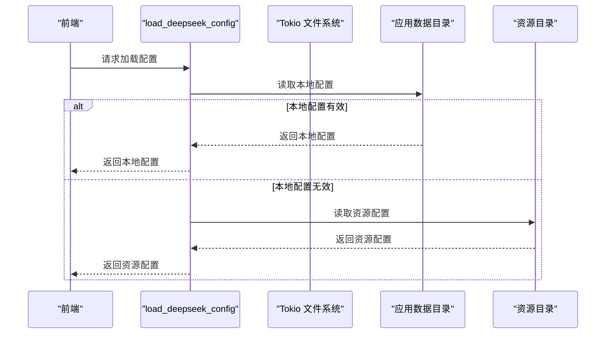
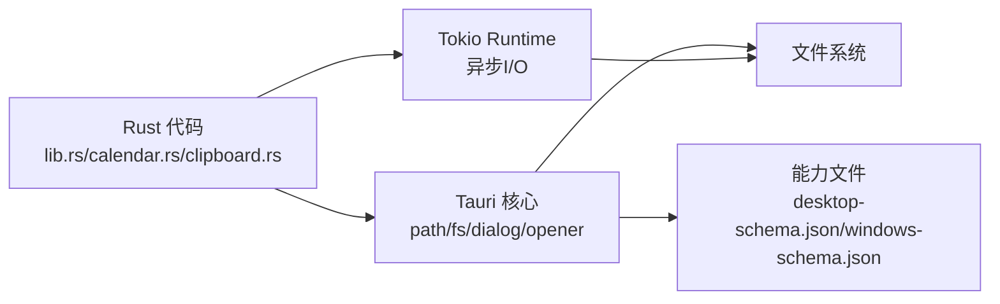

# 存储策略

<cite>
**本文引用的文件**
- [src-tauri/src/lib.rs](file://src-tauri/src/lib.rs)
- [src-tauri/src/calendar.rs](file://src-tauri/src/calendar.rs)
- [src-tauri/src/clipboard.rs](file://src-tauri/src/clipboard.rs)
- [src-tauri/Cargo.toml](file://src-tauri/Cargo.toml)
- [src-tauri/tauri.conf.json](file://src-tauri/tauri.conf.json)
- [src-tauri/config/deepseek.json](file://src-tauri/config/deepseek.json)
- [src-tauri/gen/schemas/desktop-schema.json](file://src-tauri/gen/schemas/desktop-schema.json)
- [src-tauri/gen/schemas/windows-schema.json](file://src-tauri/gen/schemas/windows-schema.json)
- [package.json](file://package.json)
</cite>

## 目录
1. [简介](#简介)
2. [项目结构](#项目结构)
3. [核心组件](#核心组件)
4. [架构总览](#架构总览)
5. [详细组件分析](#详细组件分析)
6. [依赖关系分析](#依赖关系分析)
7. [性能考量](#性能考量)
8. [故障排查指南](#故障排查指南)
9. [结论](#结论)
10. [附录](#附录)

## 简介
本文件面向“数据存储策略”的技术文档，围绕桌面宠物应用在 Rust 后端与前端之间的数据持久化、路径管理、跨平台兼容、性能优化与安全控制进行系统化梳理。重点覆盖以下方面：
- 异步文件存储：基于 Tokio 的异步 I/O 实现，统一写入 JSON 数据与二进制图片。
- 内存缓存：剪贴板历史的内存队列缓存，避免频繁磁盘访问。
- 临时存储：运行时生成的中间状态与会话数据（如剪贴板监控循环中的状态）。
- 路径管理：通过 Tauri 提供的应用数据目录接口，自动创建并管理应用数据路径。
- 性能优化：异步 I/O、文件缓存、磁盘空间清理与限流策略。
- 安全控制：文件系统权限、敏感配置隔离与最小权限原则。
- 错误处理与恢复：统一的错误传播、重试与降级策略。
- 监控与维护：定期清理、容量规划与日志输出。

## 项目结构
本项目采用 Tauri 架构，Rust 后端负责系统集成与数据持久化，前端负责界面交互。存储相关的关键位置如下：
- 后端（Rust）：位于 src-tauri，包含命令层与业务模块（日历、剪贴板、任务调度等），统一通过异步文件系统进行数据持久化。
- 前端（TypeScript/React）：位于 src，通过 @tauri-apps/api 与后端通信，触发存储操作。
- 配置与能力：通过 tauri.conf.json 与能力文件定义文件系统权限范围；配置文件 deepseek.json 放置于资源目录。

图表来源
- [src-tauri/src/lib.rs](file://src-tauri/src/lib.rs)
- [src-tauri/Cargo.toml](file://src-tauri/Cargo.toml)
- [src-tauri/tauri.conf.json](file://src-tauri/tauri.conf.json)

章节来源
- [src-tauri/src/lib.rs](file://src-tauri/src/lib.rs)
- [src-tauri/Cargo.toml](file://src-tauri/Cargo.toml)
- [src-tauri/tauri.conf.json](file://src-tauri/tauri.conf.json)

## 核心组件
- 异步文件存储
  - 统一使用 tokio::fs 的异步读写接口，确保 UI 不阻塞。
  - JSON 文件用于结构化数据（如待办、事件、设置、AI 配置）。
  - 图片以二进制形式写入应用数据目录下的子目录，返回相对路径给前端。
- 内存缓存
  - 剪贴板历史采用 VecDeque 与互斥锁保护，限制最大条目数，避免频繁磁盘 IO。
- 临时存储
  - 运行时状态（如剪贴板监控循环中的 last_content）驻留内存，周期性持久化或按需清理。
- 路径管理
  - 通过 app.path().app_data_dir() 获取应用数据根目录，自动创建缺失目录。
  - 资源配置通过 app.path().resolve(...) 解析，支持跨平台路径拼接。
- 性能优化
  - 异步 I/O：所有文件操作均在 Tokio Runtime 上执行。
  - 缓存策略：热点数据（剪贴板历史）驻内存，冷数据（历史待办/事件）落盘。
  - 清理策略：按时间窗口清理旧数据，释放磁盘空间。
- 安全控制
  - 文件系统权限通过能力文件与 tauri.conf.json 的 plugins.fs 配置限定。
  - 敏感配置（如 API Key）优先写入应用数据目录，避免暴露于资源目录。
- 错误处理
  - 统一使用 Result<String,...> 错误类型，错误信息包含上下文，便于前端提示与日志定位。
  - 对异常进行分级处理（如剪贴板监控连续错误时退避重试）。

章节来源
- [src-tauri/src/lib.rs](file://src-tauri/src/lib.rs)
- [src-tauri/src/calendar.rs](file://src-tauri/src/calendar.rs)
- [src-tauri/src/clipboard.rs](file://src-tauri/src/clipboard.rs)
- [src-tauri/tauri.conf.json](file://src-tauri/tauri.conf.json)

## 架构总览
下图展示从前端到后端再到文件系统的完整数据流，强调异步 I/O 与路径管理：

图表来源
- [src-tauri/src/lib.rs](file://src-tauri/src/lib.rs)
- [src-tauri/tauri.conf.json](file://src-tauri/tauri.conf.json)

## 详细组件分析

### 日历数据存储（CalendarManager）
- 数据模型
  - 待办项、日历事件、每日聚合数据、日历设置等结构体，统一以 JSON 形式持久化。
- 关键流程
  - 读取/写入 todos.json、events.json、calendar_settings.json。
  - 上传背景图片至 background_images 子目录，返回相对路径。
  - 按月聚合数据，仅返回非空日期，减少前端渲染负担。
  - 定期清理旧数据，保留指定天数内的记录。
- 路径与权限
  - 所有文件位于应用数据目录下，避免越权访问。
  - 通过能力文件限制对 $DATA 目录的读写权限。

图表来源
- [src-tauri/src/calendar.rs](file://src-tauri/src/calendar.rs)

章节来源
- [src-tauri/src/calendar.rs](file://src-tauri/src/calendar.rs)

### 剪贴板历史缓存（ClipboardHistory）
- 数据结构
  - 使用 VecDeque 作为历史队列，Mutex 保护并发访问。
  - 限制最大条目数量，避免无限增长。
- 关键流程
  - 检测剪贴板变化，去重后追加到队列头部。
  - 提供手动添加、清空、查询等命令。
  - 对超长内容进行截断与告警。
- 性能与安全
  - 内存缓存减少磁盘 IO；同时对单次内容长度进行上限校验。
  - 并发访问通过互斥锁保证一致性。

图表来源
- [src-tauri/src/clipboard.rs](file://src-tauri/src/clipboard.rs)

章节来源
- [src-tauri/src/clipboard.rs](file://src-tauri/src/clipboard.rs)

### 配置与资源存储（AI/翻译配置）
- 配置优先级
  - 本地配置：优先读取应用数据目录下的配置文件（如 deepseek_config.json、youdao_config.json）。
  - 资源配置：若本地配置不可用，则回退到资源目录中的配置文件（如 config/deepseek.json）。
- 路径解析
  - 应用数据目录通过 app.path().app_data_dir() 获取并创建。
  - 资源路径通过 app.path().resolve(...) 解析，支持跨平台路径拼接。
- 安全与权限
  - 本地配置写入 $DATA 目录，避免被安装包覆盖。
  - 能力文件限制对 $DATA/$RESOURCE 的访问范围。

图表来源
- [src-tauri/src/lib.rs](file://src-tauri/src/lib.rs)
- [src-tauri/config/deepseek.json](file://src-tauri/config/deepseek.json)

章节来源
- [src-tauri/src/lib.rs](file://src-tauri/src/lib.rs)
- [src-tauri/config/deepseek.json](file://src-tauri/config/deepseek.json)

## 依赖关系分析
- Rust 异步运行时
  - tokio 提供异步文件系统与任务调度，确保 I/O 非阻塞。
- Tauri 插件
  - tauri-plugin-fs 提供受限的文件系统访问能力。
  - tauri-plugin-dialog、tauri-plugin-opener 等辅助功能。
- 跨平台路径
  - 通过 tauri::path 接口与 PathBuf 拼接，保证 Windows/Linux/macOS 一致行为。
- 能力与权限
  - 能力文件定义了 $DATA/$CONFIG/$RESOURCE 等目录的读写范围，避免过度授权。

图表来源
- [src-tauri/Cargo.toml](file://src-tauri/Cargo.toml)
- [src-tauri/tauri.conf.json](file://src-tauri/tauri.conf.json)
- [src-tauri/gen/schemas/desktop-schema.json](file://src-tauri/gen/schemas/desktop-schema.json)
- [src-tauri/gen/schemas/windows-schema.json](file://src-tauri/gen/schemas/windows-schema.json)

章节来源
- [src-tauri/Cargo.toml](file://src-tauri/Cargo.toml)
- [src-tauri/tauri.conf.json](file://src-tauri/tauri.conf.json)
- [src-tauri/gen/schemas/desktop-schema.json](file://src-tauri/gen/schemas/desktop-schema.json)
- [src-tauri/gen/schemas/windows-schema.json](file://src-tauri/gen/schemas/windows-schema.json)

## 性能考量
- 异步 I/O
  - 所有文件读写使用 tokio::fs，避免阻塞主线程，提升 UI 流畅度。
- 内存缓存
  - 剪贴板历史采用内存队列，限制条目数量，显著降低磁盘压力。
- 磁盘空间管理
  - 日历模块提供按时间窗口清理旧数据的能力，防止数据无限增长。
- 资源与配置
  - 资源配置只读，避免频繁写入；本地配置可写但受权限约束。
- 并发与锁
  - 使用 Mutex 保护共享状态，避免竞态条件；对热点数据尽量减少锁粒度。

## 故障排查指南
- 常见错误与定位
  - 路径获取失败：检查 app.path().app_data_dir() 是否返回有效路径。
  - 文件读写失败：确认目标文件是否存在、权限是否允许、磁盘空间是否充足。
  - 配置加载失败：优先检查本地配置是否有效，再回退到资源配置。
  - 剪贴板监控异常：关注连续错误计数，必要时等待退避后再重试。
- 建议排查步骤
  - 查看后端日志输出（println）定位具体环节。
  - 使用能力文件核对 $DATA/$RESOURCE 的读写权限是否满足需求。
  - 对大文件或长文本进行分段处理，避免超时或内存溢出。
- 恢复策略
  - 对于可恢复的 I/O 错误，建议短暂退避后重试。
  - 对于配置错误，引导用户重新输入或恢复默认值。

章节来源
- [src-tauri/src/lib.rs](file://src-tauri/src/lib.rs)
- [src-tauri/src/clipboard.rs](file://src-tauri/src/clipboard.rs)
- [src-tauri/gen/schemas/desktop-schema.json](file://src-tauri/gen/schemas/desktop-schema.json)
- [src-tauri/gen/schemas/windows-schema.json](file://src-tauri/gen/schemas/windows-schema.json)

## 结论
本项目通过“异步文件存储 + 内存缓存 + 临时状态”的组合策略，在保证用户体验的同时兼顾了性能与安全。路径管理与能力控制确保了跨平台兼容与最小权限原则，定期清理与限流策略有助于长期稳定运行。建议在后续迭代中：
- 引入更细粒度的缓存失效策略（如 LRU）。
- 对大文件上传增加进度回调与断点续传能力。
- 增强配置热更新与版本迁移机制。
- 补充存储监控指标（文件大小、I/O 延迟、错误率）以便运维分析。

## 附录

### 存储策略选择与最佳实践
- 数据类型与存储方案
  - 结构化小数据（配置、设置）：JSON 文件，写入应用数据目录，优先本地配置。
  - 结构化中大数据（日历、待办）：JSON 文件，按日期聚合，定期清理旧数据。
  - 二进制数据（图片）：写入应用数据目录子目录，返回相对路径。
  - 热点数据（剪贴板历史）：内存缓存，限制条目数，定期持久化。
- 存储容量规划
  - 估算日均新增数据量，结合清理策略设定保留天数。
  - 对图片类数据单独统计，预留磁盘空间余量。
- 性能调优
  - 使用异步 I/O 并发写入，避免 UI 卡顿。
  - 对高频读取的数据（如剪贴板）驻内存，降低磁盘 IO。
  - 对超长文本与大文件进行分块处理与长度校验。

### 跨平台兼容性要点
- 路径拼接：统一使用 PathBuf 与 Tauri 的 path 接口，避免硬编码分隔符。
- 权限控制：通过能力文件限定 $DATA/$RESOURCE 访问范围，避免越权。
- 文件系统差异：Windows/Linux/macOS 的路径语义一致，注意大小写与特殊字符。

### 安全措施清单
- 最小权限：仅授予 $DATA 目录必要的读写权限。
- 敏感信息：API Key 等敏感配置写入应用数据目录，不放入资源包。
- 输入校验：对剪贴板内容长度与格式进行校验，防止异常输入。
- 错误隔离：对 I/O 错误进行分类处理，避免影响主流程。