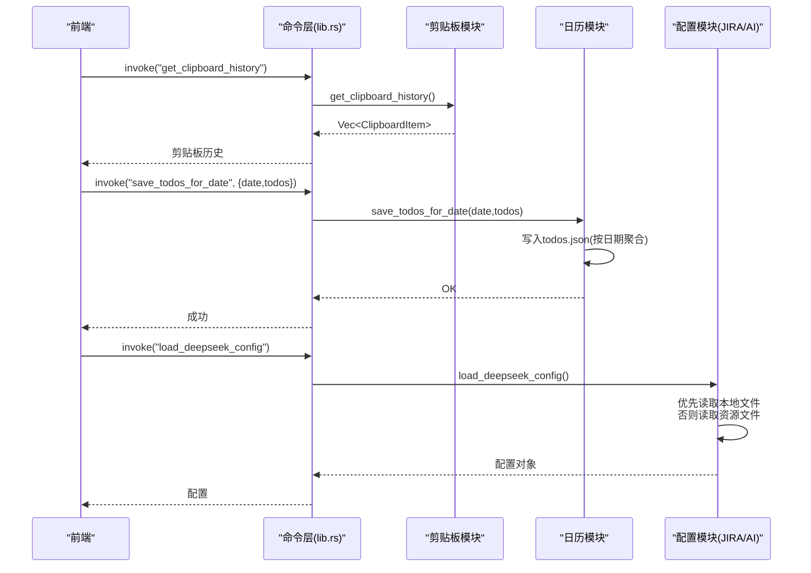
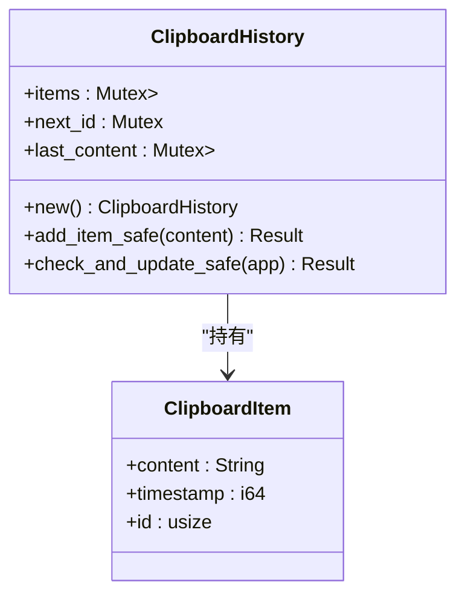
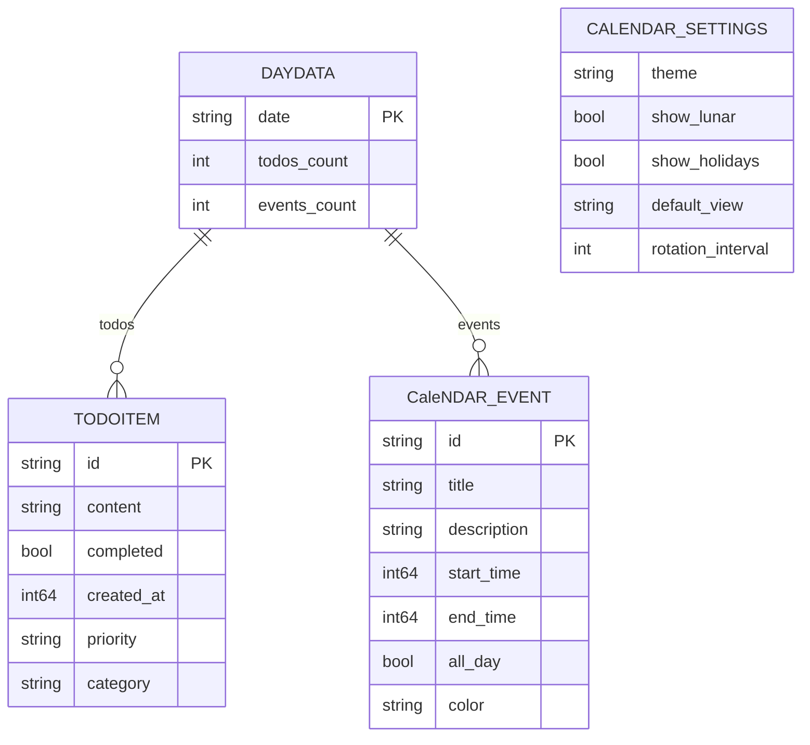
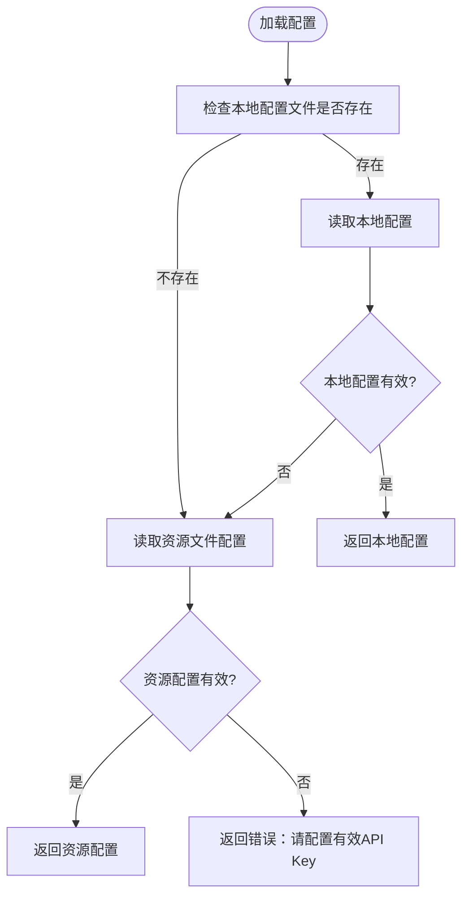
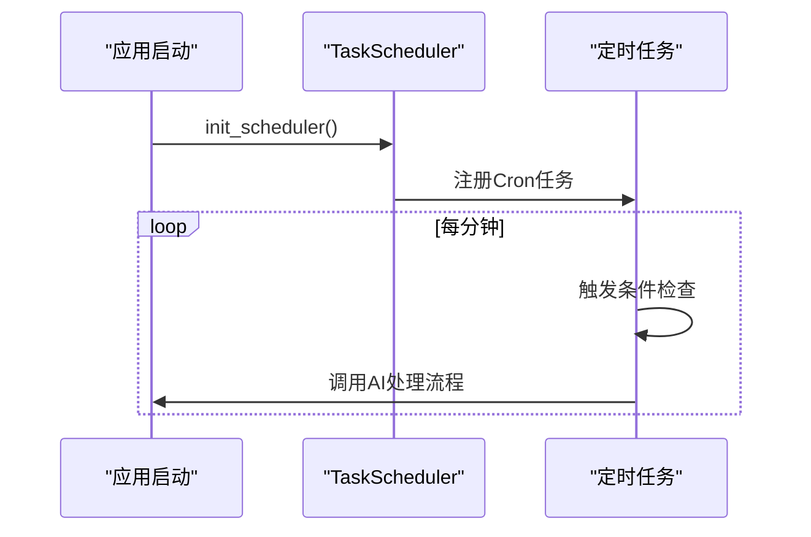
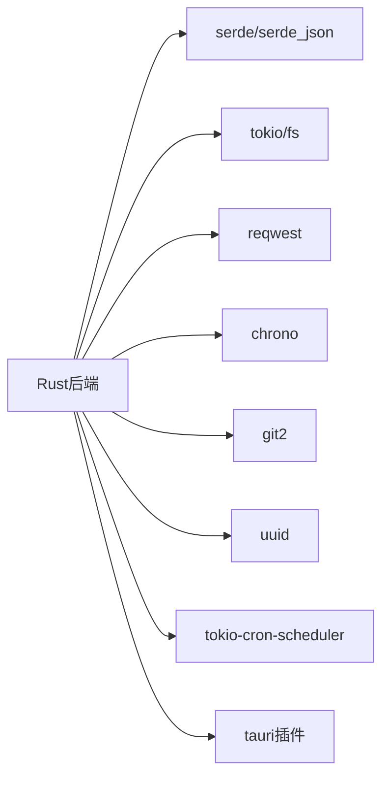

# 数据持久化

<cite>
**本文引用的文件**
- [src-tauri/src/lib.rs](file://src-tauri/src/lib.rs)
- [src-tauri/src/main.rs](file://src-tauri/src/main.rs)
- [src-tauri/src/clipboard.rs](file://src-tauri/src/clipboard.rs)
- [src-tauri/src/calendar.rs](file://src-tauri/src/calendar.rs)
- [src-tauri/src/jira_tools.rs](file://src-tauri/src/jira_tools.rs)
- [src-tauri/src/task_scheduler.rs](file://src-tauri/src/task_scheduler.rs)
- [src-tauri/Cargo.toml](file://src-tauri/Cargo.toml)
- [src-tauri/config/deepseek.json](file://src-tauri/config/deepseek.json)
- [public/config/bubbles.json](file://public/config/bubbles.json)
</cite>

## 目录
1. [简介](#简介)
2. [项目结构](#项目结构)
3. [核心组件](#核心组件)
4. [架构总览](#架构总览)
5. [详细组件分析](#详细组件分析)
6. [依赖分析](#依赖分析)
7. [性能考量](#性能考量)
8. [故障排查指南](#故障排查指南)
9. [结论](#结论)
10. [附录](#附录)

## 简介
本文件围绕桌面宠物应用的数据持久化能力，系统性梳理三类数据的存储策略与实现：
- 剪贴板历史：基于内存的短期缓存，避免频繁磁盘IO，同时提供手动导入与清空能力。
- AI配置与翻译配置：基于应用数据目录的文件存储，采用JSON格式，支持本地覆盖与资源文件回退。
- 日历数据：以结构化JSON文件存储待办与事件，按日期组织，支持背景图上传与轮播设置。

文档还涵盖数据模型设计、访问模式、生命周期管理、安全与隐私、迁移与升级、备份与恢复、性能优化与存储管理，以及最佳实践与故障恢复指南。

## 项目结构
应用采用Tauri 2架构，Rust侧负责命令与数据持久化，前端通过Tauri invoke调用后端命令，实现跨平台桌面应用。

```mermaid
graph TB
subgraph "前端"
FE["前端组件<br/>如日历、剪贴板、AI对话等"]
end
subgraph "Tauri后端"
CMD["命令层<br/>lib.rs 中的 #[tauri::command]"]
CLIP["剪贴板模块<br/>clipboard.rs"]
CALENDAR["日历模块<br/>calendar.rs"]
JIRA["JIRA/Git/AI配置<br/>jira_tools.rs"]
SCHED["定时任务<br/>task_scheduler.rs"]
end
subgraph "存储介质"
MEM["内存缓存<br/>VecDeque/HashMap"]
FS["文件系统<br/>JSON文件"]
IMG["图片目录<br/>background_images"]
end
FE --> CMD
CMD --> CLIP
CMD --> CALENDAR
CMD --> JIRA
CMD --> SCHED
CLIP --> MEM
CALENDAR --> FS
CALENDAR --> IMG
JIRA --> FS
```

图表来源
- [src-tauri/src/lib.rs:832-998](file://src-tauri/src/lib.rs#L832-L998)
- [src-tauri/src/clipboard.rs:14-122](file://src-tauri/src/clipboard.rs#L14-L122)
- [src-tauri/src/calendar.rs:83-363](file://src-tauri/src/calendar.rs#L83-L363)
- [src-tauri/src/jira_tools.rs:66-166](file://src-tauri/src/jira_tools.rs#L66-L166)
- [src-tauri/src/task_scheduler.rs:9-93](file://src-tauri/src/task_scheduler.rs#L9-L93)

章节来源
- [src-tauri/src/lib.rs:832-998](file://src-tauri/src/lib.rs#L832-L998)
- [src-tauri/src/main.rs:8-11](file://src-tauri/src/main.rs#L8-L11)

## 核心组件
- 剪贴板历史：内存中的循环队列，去重与上限控制，定期轮询检测新内容。
- 日历数据：按日期组织的待办与事件，配置与背景图独立文件存储。
- 配置管理：AI与翻译配置的本地文件存储，支持资源文件回退与校验。
- 定时任务：基于cron表达式的后台任务，用于周期性处理工作日志。

章节来源
- [src-tauri/src/clipboard.rs:14-122](file://src-tauri/src/clipboard.rs#L14-L122)
- [src-tauri/src/calendar.rs:83-363](file://src-tauri/src/calendar.rs#L83-L363)
- [src-tauri/src/jira_tools.rs:66-166](file://src-tauri/src/jira_tools.rs#L66-L166)
- [src-tauri/src/task_scheduler.rs:9-93](file://src-tauri/src/task_scheduler.rs#L9-L93)

## 架构总览
后端通过Tauri命令暴露数据访问接口，前端通过invoke调用；数据持久化分为内存与文件两类：
- 内存：剪贴板历史，容量小、访问频繁。
- 文件：日历数据、配置、图片，容量大、持久性强。



图表来源
- [src-tauri/src/lib.rs:840-884](file://src-tauri/src/lib.rs#L840-L884)
- [src-tauri/src/clipboard.rs:124-134](file://src-tauri/src/clipboard.rs#L124-L134)
- [src-tauri/src/calendar.rs:115-141](file://src-tauri/src/calendar.rs#L115-L141)
- [src-tauri/src/jira_tools.rs:729-767](file://src-tauri/src/jira_tools.rs#L729-L767)

## 详细组件分析

### 剪贴板历史（内存存储）
- 存储策略：内存中的循环队列，去重与上限控制，避免频繁磁盘IO。
- 关键结构：ClipboardHistory封装了历史项、自增ID与上次内容快照。
- 访问模式：命令接口提供查询、添加、复制、清空与手动检查。
- 生命周期：仅驻留于运行时，重启丢失；可通过手动导入恢复。



图表来源
- [src-tauri/src/clipboard.rs:7-122](file://src-tauri/src/clipboard.rs#L7-L122)

章节来源
- [src-tauri/src/clipboard.rs:14-122](file://src-tauri/src/clipboard.rs#L14-L122)
- [src-tauri/src/lib.rs:950-988](file://src-tauri/src/lib.rs#L950-L988)

### 日历数据（结构化存储）
- 存储策略：按日期聚合的JSON文件，分别存储待办与事件；配置与背景图独立文件。
- 数据模型：TodoItem、CalendarEvent、DayData、CalendarSettings等。
- 访问模式：按日期读写，支持月份聚合查询与清理旧数据。
- 生命周期：长期持久，支持清理策略按日期保留。



图表来源
- [src-tauri/src/calendar.rs:5-81](file://src-tauri/src/calendar.rs#L5-L81)

章节来源
- [src-tauri/src/calendar.rs:83-363](file://src-tauri/src/calendar.rs#L83-L363)
- [src-tauri/src/lib.rs:462-660](file://src-tauri/src/lib.rs#L462-L660)

### AI与翻译配置（文件存储）
- 存储策略：应用数据目录下的JSON文件，支持本地覆盖与资源文件回退。
- 访问模式：优先读取本地配置，若无效则读取资源文件；保存时写入本地文件。
- 安全性：敏感信息以明文JSON存储，建议配合应用权限与系统安全策略。



图表来源
- [src-tauri/src/lib.rs:243-271](file://src-tauri/src/lib.rs#L243-L271)
- [src-tauri/config/deepseek.json:1-6](file://src-tauri/config/deepseek.json#L1-L6)

章节来源
- [src-tauri/src/lib.rs:188-271](file://src-tauri/src/lib.rs#L188-L271)
- [src-tauri/src/jira_tools.rs:66-166](file://src-tauri/src/jira_tools.rs#L66-L166)

### 定时任务（后台处理）
- 用途：周期性触发AI处理工作日志等后台任务。
- 实现：基于tokio-cron-scheduler，支持Cron表达式与动态添加任务。
- 集成：应用启动时初始化并注册到App状态。



图表来源
- [src-tauri/src/task_scheduler.rs:82-93](file://src-tauri/src/task_scheduler.rs#L82-L93)
- [src-tauri/src/lib.rs:989-990](file://src-tauri/src/lib.rs#L989-L990)

章节来源
- [src-tauri/src/task_scheduler.rs:9-93](file://src-tauri/src/task_scheduler.rs#L9-L93)
- [src-tauri/src/lib.rs:989-990](file://src-tauri/src/lib.rs#L989-L990)

## 依赖分析
- Rust依赖：tauri、serde、serde_json、tokio、reqwest、chrono、git2、uuid、tokio-cron-scheduler等。
- 插件：clipboard-manager、fs、dialog等。
- 文件系统：通过tauri-plugin-fs与tokio::fs进行异步文件操作。



图表来源
- [src-tauri/Cargo.toml:15-35](file://src-tauri/Cargo.toml#L15-L35)

章节来源
- [src-tauri/Cargo.toml:15-35](file://src-tauri/Cargo.toml#L15-L35)

## 性能考量
- 剪贴板历史：内存队列避免磁盘IO，定期轮询（默认5秒）降低CPU占用；连续错误自动退避。
- 日历数据：按日期读写，避免大文件全量解析；支持清理旧数据减少文件体积。
- 配置读取：本地优先，减少网络依赖；资源文件作为回退，保证可用性。
- 异步IO：全部使用tokio异步文件操作，避免阻塞主线程。
- 图片处理：背景图单独目录，避免与JSON数据混合导致体积膨胀。

章节来源
- [src-tauri/src/lib.rs:952-988](file://src-tauri/src/lib.rs#L952-L988)
- [src-tauri/src/calendar.rs:324-361](file://src-tauri/src/calendar.rs#L324-L361)

## 故障排查指南
- 剪贴板监控异常
  - 现象：连续报错后暂停。
  - 处理：检查系统剪贴板权限、杀软拦截；观察日志中连续错误计数与退避行为。
- 配置加载失败
  - 现象：提示“请配置有效的API Key”。
  - 处理：确认本地配置文件内容有效；检查资源文件是否存在且格式正确。
- 日历数据读写失败
  - 现象：保存/读取返回错误。
  - 处理：检查应用数据目录权限；确认JSON格式合法；必要时清理损坏文件。
- 图片上传失败
  - 现象：背景图保存失败。
  - 处理：确认目录创建成功；检查文件名与路径；验证磁盘空间。

章节来源
- [src-tauri/src/lib.rs:971-986](file://src-tauri/src/lib.rs#L971-L986)
- [src-tauri/src/lib.rs:266-268](file://src-tauri/src/lib.rs#L266-L268)
- [src-tauri/src/calendar.rs:220-245](file://src-tauri/src/calendar.rs#L220-L245)

## 结论
本应用采用“内存+文件”的混合持久化策略：剪贴板历史以内存为主，追求低延迟与高吞吐；日历与配置以外存为主，强调可靠性与可维护性。通过异步IO、错误退避、清理策略与配置回退机制，系统在易用性与稳定性之间取得平衡。建议在生产环境中进一步强化安全与审计能力，并完善备份与迁移方案。

## 附录

### 数据模型与字段约束
- 剪贴板项
  - 字段：content、timestamp、id
  - 约束：内容长度限制、去重、上限控制
- 待办项
  - 字段：id、content、completed、created_at、priority、category
  - 约束：按日期聚合、空集合删除
- 日历事件
  - 字段：id、title、description、start_time、end_time、all_day、color
  - 约束：按日期聚合
- 配置
  - 字段：AI与翻译配置的关键字段
  - 约束：本地优先、资源回退、有效性校验

章节来源
- [src-tauri/src/clipboard.rs:7-12](file://src-tauri/src/clipboard.rs#L7-L12)
- [src-tauri/src/calendar.rs:5-31](file://src-tauri/src/calendar.rs#L5-L31)
- [src-tauri/src/lib.rs:112-120](file://src-tauri/src/lib.rs#L112-L120)

### 数据访问模式
- 读写分离：剪贴板读写在内存；日历与配置读写在文件。
- 缓存策略：剪贴板历史作为热点数据缓存；日历按需加载。
- 事务处理：文件写入为原子操作（单次写入），不涉及跨文件事务。

章节来源
- [src-tauri/src/clipboard.rs:124-134](file://src-tauri/src/clipboard.rs#L124-L134)
- [src-tauri/src/calendar.rs:115-141](file://src-tauri/src/calendar.rs#L115-L141)

### 数据生命周期管理
- 创建：首次访问时创建目录与文件。
- 更新：按日期写入；空集合删除对应日期条目。
- 归档：日历提供清理旧数据功能。
- 清理：按日期阈值清理待办与事件。

章节来源
- [src-tauri/src/calendar.rs:324-361](file://src-tauri/src/calendar.rs#L324-L361)

### 安全与隐私
- 当前实现：敏感配置以明文JSON存储；未内置加密与细粒度访问控制。
- 建议：结合操作系统凭据保管、文件权限控制、审计日志与传输加密。

章节来源
- [src-tauri/src/lib.rs:204-240](file://src-tauri/src/lib.rs#L204-L240)
- [src-tauri/src/jira_tools.rs:82-115](file://src-tauri/src/jira_tools.rs#L82-L115)

### 迁移与版本升级
- 数据格式转换：按需在加载时进行字段迁移（如新增字段默认值）。
- 向后兼容：资源文件作为回退，避免因本地配置缺失导致不可用。
- 升级脚本：可在应用启动时执行一次性迁移逻辑。

章节来源
- [src-tauri/src/lib.rs:243-271](file://src-tauri/src/lib.rs#L243-L271)
- [src-tauri/config/deepseek.json:1-6](file://src-tauri/config/deepseek.json#L1-L6)

### 备份与恢复
- 自动备份：建议在每次重要写入后生成增量备份。
- 手动备份：导出todos.json、events.json与配置文件。
- 灾难恢复：优先恢复配置文件，再恢复日历数据；剪贴板历史需手动导入。

章节来源
- [src-tauri/src/calendar.rs:115-141](file://src-tauri/src/calendar.rs#L115-L141)
- [src-tauri/src/lib.rs:204-240](file://src-tauri/src/lib.rs#L204-L240)

### 性能优化与存储管理
- 内存优化：限制剪贴板历史数量，避免无限增长。
- IO优化：异步读写、按日期分片、定期清理。
- 存储管理：图片独立目录、压缩与命名规范。

章节来源
- [src-tauri/src/clipboard.rs:59-82](file://src-tauri/src/clipboard.rs#L59-L82)
- [src-tauri/src/calendar.rs:220-245](file://src-tauri/src/calendar.rs#L220-L245)

### 最佳实践与故障恢复
- 最佳实践
  - 为配置文件设置只读权限（在支持的平台上）。
  - 定期备份应用数据目录。
  - 使用Cron表达式合理安排后台任务，避免高峰期负载。
- 故障恢复
  - 删除损坏的JSON文件后重启应用，系统会重建默认结构。
  - 重新导入剪贴板历史或重新配置AI/翻译服务。

章节来源
- [src-tauri/src/lib.rs:952-988](file://src-tauri/src/lib.rs#L952-L988)
- [src-tauri/src/calendar.rs:324-361](file://src-tauri/src/calendar.rs#L324-L361)